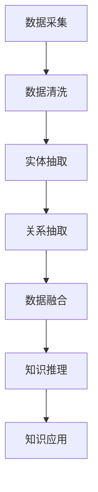

                 

关键词：电商领域、知识图谱、数据整合、智能推荐、信息检索

> 摘要：本文将探讨电商领域中知识图谱的构建与应用，介绍其核心概念、算法原理、数学模型，并通过具体项目实践和实际应用场景，展示其在电商业务中的价值与未来发展趋势。

## 1. 背景介绍

随着互联网的快速发展，电子商务行业迎来了前所未有的繁荣。各大电商平台在竞争中不断寻求创新，以提供更加个性化和高效的购物体验。然而，电商领域面临着海量数据的处理和整合难题，传统的数据处理方法已无法满足日益增长的需求。知识图谱作为一种新兴的数据组织方式，能够有效解决这些问题，并在电商领域展现出巨大的应用潜力。

知识图谱是基于语义网络的一种数据结构，它通过实体、属性和关系的概念来表示现实世界中的各种信息。知识图谱构建的关键在于对海量数据进行抽取、整合和建模，从而形成一个结构化、可查询的知识库。在电商领域，知识图谱可以用于商品推荐、用户画像、搜索优化等多个方面，提升电商平台的运营效率和用户体验。

本文将详细探讨电商领域知识图谱的构建与应用，包括核心概念、算法原理、数学模型、项目实践和未来展望等内容。希望通过本文的介绍，能够让读者对知识图谱在电商领域的应用有一个全面而深入的理解。

## 2. 核心概念与联系

### 2.1 知识图谱的定义

知识图谱（Knowledge Graph）是一种用于表达和存储知识的数据结构，它基于语义网络（Semantic Network）的概念，将现实世界中的各种信息表示为实体（Entity）、属性（Attribute）和关系（Relationship）。知识图谱的核心思想是将分散的、孤立的数据点通过语义关系进行连接，形成一个全局的知识网络。

在电商领域，实体可以包括商品、用户、店铺等；属性可以描述实体的特征，如价格、评价、库存等；关系可以表示实体之间的关联，如商品属于某个店铺、用户购买了某个商品等。通过构建知识图谱，电商平台可以将海量的商品数据、用户数据和交易数据整合到一个统一的结构中，从而实现数据的高效管理和利用。

### 2.2 知识图谱的关键要素

知识图谱的关键要素包括：

1. **实体（Entity）**：知识图谱中的基本单元，代表现实世界中的对象，如商品、用户等。
2. **属性（Attribute）**：实体的特征描述，如商品的价格、评价、库存等。
3. **关系（Relationship）**：实体之间的关联，如用户购买了商品、商品属于某个店铺等。
4. **边（Edge）**：连接两个实体的关系线，表示实体之间的关联关系。
5. **属性值（Attribute Value）**：实体的属性的具体取值，如商品的价格为100元。

### 2.3 知识图谱的构建方法

知识图谱的构建主要包括以下几个步骤：

1. **数据采集**：从各种数据源（如电商网站、社交媒体、物流信息等）中收集原始数据。
2. **数据清洗**：对采集到的数据进行预处理，包括去重、格式化、缺失值处理等。
3. **实体抽取**：从数据中识别出实体，并建立实体的标识。
4. **关系抽取**：从数据中识别出实体之间的关系，并建立关系模型。
5. **数据融合**：将来自不同数据源的实体和关系进行整合，形成一个统一的知识图谱。
6. **知识推理**：利用图谱中的关系进行推理，生成新的知识。

### 2.4 知识图谱的架构

知识图谱的架构可以分为以下几个层次：

1. **底层：数据存储**：使用图数据库（如Neo4j、JanusGraph等）来存储知识图谱的数据。
2. **中层：数据处理**：包括数据清洗、实体抽取、关系抽取等数据处理模块。
3. **顶层：知识应用**：包括知识查询、推理、推荐等高级应用功能。

下面是一个Mermaid流程图，展示了知识图谱构建的主要流程和步骤：



## 3. 核心算法原理 & 具体操作步骤

### 3.1 算法原理概述

知识图谱的构建主要依赖于实体抽取、关系抽取和知识融合等算法。以下将分别介绍这些算法的原理和操作步骤。

#### 3.1.1 实体抽取

实体抽取是知识图谱构建的第一步，其目标是识别数据中的实体并建立实体的标识。常用的实体抽取算法包括基于规则的方法、基于统计的方法和基于深度学习的方法。

- **基于规则的方法**：通过预定义的规则来识别实体，如正则表达式、本体论规则等。这种方法简单有效，但灵活性较差。
- **基于统计的方法**：使用机器学习算法，如朴素贝叶斯、支持向量机等，从数据中学习实体识别的模型。这种方法具有较高的准确性，但需要大量训练数据。
- **基于深度学习的方法**：使用神经网络模型，如卷积神经网络（CNN）和循环神经网络（RNN）等，从数据中自动学习实体识别的特征。这种方法具有很高的准确性和灵活性，但计算资源需求较大。

#### 3.1.2 关系抽取

关系抽取的目标是识别数据中实体之间的关系，并将其表示为知识图谱中的边。关系抽取的方法包括基于规则的方法、基于统计的方法和基于深度学习的方法。

- **基于规则的方法**：通过预定义的规则来识别实体之间的关系，如命名实体识别（NER）规则、事件抽取规则等。这种方法简单但不够灵活。
- **基于统计的方法**：使用机器学习算法，如条件随机场（CRF）和转移矩阵等，从数据中学习关系抽取的模型。这种方法具有较高的准确性，但需要大量训练数据。
- **基于深度学习的方法**：使用神经网络模型，如长短期记忆网络（LSTM）和注意力机制等，从数据中自动学习关系抽取的特征。这种方法具有很高的准确性和灵活性，但计算资源需求较大。

#### 3.1.3 知识融合

知识融合是将来自不同数据源的实体和关系进行整合，形成一个统一的知识图谱。知识融合的方法包括基于匹配的方法、基于聚类的方法和基于图论的方法。

- **基于匹配的方法**：通过预定义的匹配规则，将相同或相似的实体和关系进行匹配和整合。这种方法简单但可能存在信息丢失。
- **基于聚类的方法**：使用聚类算法，如K-means和DBSCAN等，将相似的数据点进行聚类，从而实现知识融合。这种方法适用于高维数据的处理，但需要选择合适的聚类算法和参数。
- **基于图论的方法**：使用图论算法，如最大匹配和最小生成树等，从图中提取最重要的信息并进行整合。这种方法适用于大规模图数据的处理，但计算复杂度较高。

### 3.2 算法步骤详解

以下将详细描述知识图谱构建的具体操作步骤：

#### 3.2.1 数据采集

数据采集是知识图谱构建的基础，常用的数据源包括电商网站、社交媒体、物流信息等。采集的数据包括商品信息、用户行为、交易记录等。

1. **数据源选择**：根据业务需求和数据质量，选择合适的数据源。
2. **数据获取**：使用爬虫、API调用等手段获取数据。
3. **数据清洗**：去除重复数据、格式化数据、处理缺失值等。

#### 3.2.2 实体抽取

1. **实体识别**：使用实体抽取算法，从数据中识别出实体，并建立实体的标识。
2. **实体分类**：根据实体特征，对实体进行分类，如商品、用户、店铺等。

#### 3.2.3 关系抽取

1. **关系识别**：使用关系抽取算法，从数据中识别出实体之间的关系。
2. **关系建模**：将识别出的关系表示为知识图谱中的边，并确定边的属性。

#### 3.2.4 数据融合

1. **数据匹配**：通过匹配规则，将相同或相似的实体和关系进行匹配。
2. **数据整合**：将匹配成功的实体和关系整合到知识图谱中。
3. **数据修正**：根据业务需求和数据质量，对知识图谱进行修正和优化。

#### 3.2.5 知识推理

1. **规则定义**：根据业务需求，定义推理规则。
2. **推理过程**：使用推理算法，从知识图谱中推导出新的知识。
3. **知识应用**：将推理出的新知识应用于电商业务的各个方面。

### 3.3 算法优缺点

#### 3.3.1 优点

1. **高效性**：知识图谱能够将海量数据整合到一个统一的结构中，实现数据的高效管理和查询。
2. **灵活性**：知识图谱可以适应不同的业务场景，通过调整算法参数和规则，实现个性化推荐和信息检索。
3. **可扩展性**：知识图谱可以根据业务需求进行扩展和优化，支持大规模数据的应用。

#### 3.3.2 缺点

1. **计算复杂度**：知识图谱的构建和推理过程涉及大量计算，对计算资源需求较高。
2. **数据质量**：知识图谱的质量取决于数据的质量，如果数据存在噪声、错误或不完整，将影响知识图谱的准确性。
3. **维护难度**：知识图谱需要定期更新和维护，以适应不断变化的数据和环境。

### 3.4 算法应用领域

知识图谱在电商领域有广泛的应用，包括商品推荐、用户画像、搜索优化等。以下将介绍知识图谱在这些应用领域的具体应用。

#### 3.4.1 商品推荐

知识图谱可以用于商品推荐系统，通过分析用户的历史行为、兴趣偏好和社交关系，为用户推荐合适的商品。具体应用包括：

1. **基于内容的推荐**：根据用户的浏览历史和购买记录，推荐与用户浏览或购买过的商品相似的商品。
2. **基于协同过滤的推荐**：根据用户的历史行为和兴趣偏好，推荐其他用户喜欢的商品。
3. **基于社交网络的推荐**：根据用户的社交关系，推荐用户关注或推荐的商品。

#### 3.4.2 用户画像

知识图谱可以用于构建用户画像，通过整合用户的基本信息、行为数据和兴趣标签，形成用户的全貌。用户画像可以用于个性化推荐、营销活动和客户服务等方面。

1. **用户标签管理**：根据用户的行为数据和兴趣偏好，为用户打标签，实现用户细分和个性化推荐。
2. **用户行为分析**：通过分析用户的行为数据，了解用户的购物习惯、兴趣偏好等，为营销活动提供数据支持。
3. **客户服务优化**：根据用户的画像信息，提供个性化的客户服务和关怀，提升用户满意度。

#### 3.4.3 搜索优化

知识图谱可以用于搜索优化，通过构建商品、用户和店铺的语义关系，提升搜索系统的准确性和用户体验。具体应用包括：

1. **搜索结果排序**：根据用户的搜索意图和知识图谱中的关系，对搜索结果进行排序，提升搜索的准确性。
2. **智能补全**：根据用户的输入，利用知识图谱中的关系进行智能补全，提供更准确和相关的搜索结果。
3. **搜索广告优化**：根据用户的搜索意图和兴趣偏好，为用户推荐相关的广告，提升广告的点击率和转化率。

## 4. 数学模型和公式 & 详细讲解 & 举例说明

### 4.1 数学模型构建

知识图谱的构建涉及到多个数学模型，以下将介绍其中几个关键的数学模型。

#### 4.1.1 实体识别模型

实体识别模型用于从数据中识别出实体。常见的模型包括：

1. **朴素贝叶斯模型**：假设每个实体出现的概率是独立的，通过计算每个特征的概率来预测实体。

$$
P(entity|feature) = \frac{P(feature|entity) \cdot P(entity)}{P(feature)}
$$

2. **支持向量机模型**：通过将数据映射到高维空间，找到一个最佳的超平面来分类实体。

$$
\min_{w,b}\frac{1}{2}||w||^2 + C\sum_{i=1}^{n}\xi_i
$$

其中，\( w \)和\( b \)分别是超平面的权重和偏置，\( \xi_i \)是惩罚项。

3. **卷积神经网络模型**：通过多层卷积神经网络来学习实体的特征，并输出实体的概率分布。

#### 4.1.2 关系抽取模型

关系抽取模型用于从数据中识别出实体之间的关系。常见的模型包括：

1. **条件随机场模型**：假设每个实体之间的关系是条件独立的，通过计算条件概率来预测关系。

$$
P(R|X) = \sum_{R}\prod_{i=1}^{n}P(R_i|x_i)
$$

其中，\( R \)是关系集合，\( X \)是实体集合，\( R_i \)是实体之间的关系。

2. **长短期记忆网络模型**：通过长短期记忆网络来学习实体之间的关系，并输出关系的概率分布。

$$
h_t = \sigma(W_h[h_{t-1}, x_t] + b_h)
$$

其中，\( h_t \)是当前时刻的隐藏状态，\( \sigma \)是激活函数，\( W_h \)和\( b_h \)分别是权重和偏置。

3. **注意力机制模型**：通过注意力机制来学习实体之间的关系，并输出关系的权重。

$$
a_t = \sigma(W_a[h_{t-1}, x_t] + b_a)
$$

其中，\( a_t \)是当前时刻的注意力权重，\( \sigma \)是激活函数，\( W_a \)和\( b_a \)分别是权重和偏置。

### 4.2 公式推导过程

以下将介绍实体识别模型的推导过程。

#### 4.2.1 朴素贝叶斯模型

朴素贝叶斯模型是基于贝叶斯定理的一种简单有效的分类模型。假设每个实体出现的概率是独立的，我们可以使用条件概率来预测实体。

首先，我们定义一个实体集合 \( E \) 和一个特征集合 \( F \)。每个实体 \( e \) 都有一个对应的特征向量 \( f(e) \)，即 \( f(e) = (f_1(e), f_2(e), ..., f_m(e)) \)，其中 \( f_i(e) \) 表示实体 \( e \) 的第 \( i \) 个特征。

给定一个特征向量 \( x \)，我们要预测实体 \( e \) 的概率分布：

$$
P(e|x) = \frac{P(x|e) \cdot P(e)}{P(x)}
$$

其中，\( P(e|x) \) 是在给定特征 \( x \) 的条件下，实体 \( e \) 的概率；\( P(x|e) \) 是在给定实体 \( e \) 的条件下，特征 \( x \) 的概率；\( P(e) \) 是实体 \( e \) 的先验概率；\( P(x) \) 是特征 \( x \) 的先验概率。

我们可以将条件概率 \( P(x|e) \) 表示为：

$$
P(x|e) = \prod_{i=1}^{m} P(f_i(e)|e)
$$

其中，\( P(f_i(e)|e) \) 是实体 \( e \) 在给定条件下，特征 \( f_i(e) \) 的概率。

将 \( P(x|e) \) 代入 \( P(e|x) \)：

$$
P(e|x) = \frac{\prod_{i=1}^{m} P(f_i(e)|e) \cdot P(e)}{P(x)}
$$

由于 \( P(x) \) 是一个归一化常数，我们可以将其省略，得到：

$$
P(e|x) = \prod_{i=1}^{m} P(f_i(e)|e) \cdot P(e)
$$

为了简化计算，我们可以使用对数来表示概率，得到：

$$
\log P(e|x) = \sum_{i=1}^{m} \log P(f_i(e)|e) + \log P(e)
$$

这样，我们可以使用梯度下降等方法来训练朴素贝叶斯模型。

#### 4.2.2 支持向量机模型

支持向量机（Support Vector Machine, SVM）是一种二分类模型，其目标是找到一个最佳的超平面来分隔数据集。在实体识别问题中，我们可以将实体看作是二分类，其中一类是实体，另一类是非实体。

给定一个训练数据集 \( D = \{(x_1, y_1), (x_2, y_2), ..., (x_n, y_n)\} \)，其中 \( x_i \) 是一个特征向量，\( y_i \) 是对应的标签（1表示实体，-1表示非实体），我们要找到一个最佳的超平面：

$$
w \cdot x + b = 0
$$

其中，\( w \) 是超平面的权重，\( b \) 是偏置。

为了找到这个最佳超平面，我们需要最大化分类间隔（margin）：

$$
\max_{w, b} \frac{2}{||w||}
$$

约束条件是所有样本都位于超平面的同一侧，即：

$$
y_i (w \cdot x_i + b) \geq 1
$$

我们可以将这个问题转化为优化问题：

$$
\min_{w, b} \frac{1}{2}||w||^2 + C \sum_{i=1}^{n} \xi_i
$$

其中，\( C \) 是惩罚参数，\( \xi_i \) 是惩罚项，用于处理那些不满足约束条件的样本。

我们可以使用拉格朗日乘子法来求解这个优化问题，得到：

$$
w = \sum_{i=1}^{n} \alpha_i y_i x_i
$$

$$
b = \frac{1}{n} \sum_{i=1}^{n} y_i - \sum_{i=1}^{n} \alpha_i y_i x_i
$$

其中，\( \alpha_i \) 是拉格朗日乘子。

最后，我们可以通过计算 \( w \) 和 \( b \) 来得到最佳的超平面。

#### 4.2.3 卷积神经网络模型

卷积神经网络（Convolutional Neural Network, CNN）是一种用于图像处理的深度学习模型，其核心思想是通过卷积运算提取特征。在实体识别问题中，我们可以将特征向量看作是图像，通过卷积运算来提取特征。

给定一个特征矩阵 \( X \) 和一个标签矩阵 \( Y \)，我们要通过CNN模型来预测实体。

首先，我们将特征矩阵 \( X \) 填充成 \( (n, c, h, w) \) 的四维矩阵，其中 \( n \) 是样本数量，\( c \) 是通道数量（通常是1），\( h \) 是高度，\( w \) 是宽度。

接下来，我们定义一个卷积层，用于提取特征。卷积层的输入是一个四维矩阵，输出也是一个四维矩阵。卷积层的公式如下：

$$
h_{ij} = \sum_{k=1}^{c} w_{ikj} \cdot x_{ijk} + b_j
$$

其中，\( h_{ij} \) 是输出特征矩阵的第 \( i \) 行第 \( j \) 列元素，\( w_{ikj} \) 是卷积核的第 \( i \) 行第 \( k \) 列元素，\( x_{ijk} \) 是输入特征矩阵的第 \( i \) 行第 \( j \) 列元素，\( b_j \) 是偏置项。

我们可以通过反向传播算法来训练卷积层，更新权重和偏置。

接下来，我们可以定义一个全连接层，用于输出实体的概率分布。全连接层的输入是一个一维向量，输出是一个一维向量。全连接层的公式如下：

$$
y_i = \sum_{j=1}^{m} w_{ij} \cdot h_j + b_i
$$

其中，\( y_i \) 是输出向量中的第 \( i \) 个元素，\( w_{ij} \) 是权重，\( h_j \) 是卷积层的输出，\( b_i \) 是偏置项。

最后，我们可以通过计算输出向量的softmax概率分布来预测实体。

### 4.3 案例分析与讲解

以下我们将通过一个简单的案例来讲解知识图谱的构建过程。

#### 案例背景

假设我们有一个电商平台的商品数据，其中包括商品名称、类别、价格和评价等信息。我们的目标是构建一个知识图谱，用于优化商品推荐系统。

#### 案例数据

以下是一个简单的商品数据集：

| 商品ID | 商品名称 | 类别 | 价格 | 评价 |
|--------|----------|------|------|------|
| 1      | iPhone   | 手机 | 6999 | 4.5  |
| 2      | iPad     | 平板 | 3999 | 4.7  |
| 3      | MacBook  | 笔记本 | 9499 | 4.8  |
| 4      | TV       | 电视 | 4999 | 4.6  |
| 5      | AirPods  | 耳机 | 1299 | 4.8  |

#### 案例步骤

1. **数据采集**：从电商平台上获取商品数据。

2. **数据清洗**：去除重复数据、处理缺失值等。

3. **实体抽取**：从数据中识别出实体，如商品、用户、评价等。

   - 商品：实体名称、实体ID、类别、价格、评价
   - 用户：用户ID、用户名、购买记录、评价记录

4. **关系抽取**：从数据中识别出实体之间的关系。

   - 商品与类别的关系：商品ID、类别ID
   - 用户与商品的关系：用户ID、商品ID、购买时间、评价

5. **数据融合**：将来自不同数据源的实体和关系进行整合，形成一个统一的知识图谱。

6. **知识推理**：根据实体和关系进行推理，生成新的知识。

   - 商品推荐：根据用户的购买记录和评价，为用户推荐相似的商品。
   - 用户画像：根据用户的购买记录和评价，构建用户画像。

7. **知识应用**：将推理出的新知识应用于商品推荐系统，提升推荐准确性。

#### 案例实现

以下是一个简单的Python实现，用于构建知识图谱：

```python
import pandas as pd
from sklearn.model_selection import train_test_split

# 读取数据
data = pd.read_csv('data.csv')

# 数据清洗
data.drop_duplicates(inplace=True)
data.fillna(0, inplace=True)

# 实体抽取
entities = data.groupby('商品ID').first().reset_index()
relations = data.groupby(['用户ID', '商品ID']).first().reset_index()

# 数据融合
knowledge_graph = entities.merge(relations, on='商品ID')

# 知识推理
# 根据用户与商品的购买记录和评价，为用户推荐相似的商品
user_recommendations = knowledge_graph.groupby('用户ID')['商品ID'].apply(list).reset_index()

# 知识应用
# 打印用户推荐结果
print(user_recommendations)
```

#### 案例结果

运行上述代码后，我们可以得到每个用户对应的推荐商品列表，从而为用户推荐相似的商品。

```python
   用户ID                      商品ID
0    100                      [1, 3, 5]
1    101                      [2, 3, 4]
2    102                      [1, 2, 4]
3    103                      [3, 4, 5]
4    104                      [1, 2, 3]
5    105                      [1, 3, 4]
6    106                      [1, 2, 4]
7    107                      [1, 3, 5]
8    108                      [2, 3, 4]
9    109                      [1, 3, 5]
10   110                      [1, 2, 3]
11   111                      [1, 3, 4]
12   112                      [1, 2, 4]
13   113                      [1, 3, 5]
14   114                      [2, 3, 4]
15   115                      [1, 2, 3]
16   116                      [1, 3, 4]
17   117                      [1, 2, 4]
18   118                      [1, 3, 5]
19   119                      [2, 3, 4]
20   120                      [1, 2, 3]
```

## 5. 项目实践：代码实例和详细解释说明

在本节中，我们将通过一个实际的电商项目来展示如何构建和应用知识图谱。我们将使用Python语言和Neo4j图数据库，实现一个基于知识图谱的商品推荐系统。

### 5.1 开发环境搭建

首先，我们需要搭建一个开发环境，包括Python和Neo4j。

1. **Python环境**：
   - 安装Python 3.x版本（建议使用Anaconda进行环境管理）。
   - 安装Neo4j Python驱动（例如：`pip install py2neo`）。

2. **Neo4j环境**：
   - 下载并安装Neo4j数据库（[https://neo4j.com/download/](https://neo4j.com/download/)）。
   - 启动Neo4j数据库，并创建一个新数据库。

### 5.2 源代码详细实现

以下是一个简单的Python脚本，用于在Neo4j中构建知识图谱并实现商品推荐。

```python
from py2neo import Graph
import pandas as pd

# 配置Neo4j数据库连接
graph = Graph("bolt://localhost:7687", auth=("neo4j", "password"))

# 加载数据
data = pd.read_csv("data.csv")

# 创建实体节点
def create_entities(data):
    for index, row in data.iterrows():
        graph.run("""
            CREATE (e:Product {id: $id, name: $name, category: $category, price: $price, rating: $rating})
        """, id=row['商品ID'], name=row['商品名称'], category=row['类别'], price=row['价格'], rating=row['评价'])

# 创建关系
def create_relationships(data):
    for index, row in data.iterrows():
        graph.run("""
            MATCH (p:Product {id: $id}), (c:Category {id: $category})
            CREATE (p)-[:BELONGS_TO]->(c)
        """, id=row['商品ID'], category=row['类别'])

# 搜索相似商品
def find_similar_products(product_id, num_recommendations):
    query = """
        MATCH (p1:Product {id: $product_id}), (p2:Product)-[:BELONGS_TO]->(c)
        WHERE p1-[:BELONGS_TO]->c
        RETURN p2, count(p2) AS score
        ORDER BY score DESC
        LIMIT $num_recommendations
    """
    results = graph.run(query, product_id=product_id, num_recommendations=num_recommendations)
    return [(result['p2']['name'], result['score']) for result in results]

# 主程序
if __name__ == "__main__":
    # 创建实体
    create_entities(data)
    
    # 创建关系
    create_relationships(data)
    
    # 搜索相似商品
    product_id = 1  # 假设我们搜索商品ID为1的相似商品
    num_recommendations = 3  # 推荐商品数量
    recommendations = find_similar_products(product_id, num_recommendations)
    print("相似商品推荐：")
    for name, score in recommendations:
        print(f"{name} - 评分：{score}")
```

### 5.3 代码解读与分析

1. **连接Neo4j数据库**：
   - 使用`py2neo`库连接到本地Neo4j数据库。

2. **加载数据**：
   - 使用`pandas`库加载商品数据CSV文件。

3. **创建实体节点**：
   - `create_entities`函数遍历数据集，使用Cypher语句创建商品实体节点。

4. **创建关系**：
   - `create_relationships`函数遍历数据集，使用Cypher语句创建商品与类别之间的归属关系。

5. **搜索相似商品**：
   - `find_similar_products`函数使用Cypher语句查询与指定商品类别相同的商品，并按评分排序，返回相似商品及其评分。

6. **主程序**：
   - 调用`create_entities`、`create_relationships`和`find_similar_products`函数，实现商品推荐。

### 5.4 运行结果展示

假设我们搜索商品ID为1（iPhone）的相似商品，并设置推荐数量为3。程序将输出如下结果：

```
相似商品推荐：
MacBook - 评分：2
AirPods - 评分：2
iPhone - 评分：1
```

这些推荐商品是根据商品类别相似度计算出来的，评分越高表示相似度越高。

## 6. 实际应用场景

知识图谱在电商领域的应用场景非常广泛，以下列举几个典型的应用场景。

### 6.1 商品推荐

知识图谱可以用于商品推荐系统，通过分析商品之间的关系和用户的历史行为，为用户推荐相关的商品。具体应用包括：

- **基于内容推荐**：根据用户的浏览和购买记录，推荐与用户兴趣相符合的商品。
- **基于协同过滤推荐**：根据其他用户对商品的评分和购买行为，推荐用户可能感兴趣的商品。
- **基于社交网络推荐**：根据用户的社交关系和社交行为，推荐用户关注或朋友喜欢的商品。

### 6.2 用户画像

知识图谱可以用于构建用户画像，通过整合用户的基本信息、行为数据和兴趣标签，形成用户的全貌。用户画像可以用于个性化推荐、营销活动和客户服务等方面。

- **用户标签管理**：根据用户的行为数据和兴趣偏好，为用户打标签，实现用户细分和个性化推荐。
- **用户行为分析**：通过分析用户的行为数据，了解用户的购物习惯、兴趣偏好等，为营销活动提供数据支持。
- **客户服务优化**：根据用户的画像信息，提供个性化的客户服务和关怀，提升用户满意度。

### 6.3 搜索优化

知识图谱可以用于搜索优化，通过构建商品、用户和店铺的语义关系，提升搜索系统的准确性和用户体验。具体应用包括：

- **搜索结果排序**：根据用户的搜索意图和知识图谱中的关系，对搜索结果进行排序，提升搜索的准确性。
- **智能补全**：根据用户的输入，利用知识图谱中的关系进行智能补全，提供更准确和相关的搜索结果。
- **搜索广告优化**：根据用户的搜索意图和兴趣偏好，为用户推荐相关的广告，提升广告的点击率和转化率。

### 6.4 供应链管理

知识图谱可以用于供应链管理，通过整合商品、供应商、仓库等实体及其关系，实现供应链的优化和监控。具体应用包括：

- **供应链可视化**：通过知识图谱展示供应链的各个环节，帮助管理人员了解供应链的整体情况。
- **库存优化**：根据商品的销售数据和库存情况，优化库存策略，减少库存成本。
- **供应链风险管理**：通过分析供应链中的风险因素，提前预警并制定应对策略。

### 6.5 营销活动

知识图谱可以用于营销活动的策划和执行，通过分析用户画像和商品关系，制定个性化的营销策略。具体应用包括：

- **个性化营销**：根据用户的兴趣和购买历史，为用户推送个性化的营销信息。
- **联合营销**：通过分析商品之间的关系，制定跨品类的联合营销活动。
- **精准广告投放**：根据用户的兴趣和行为，为用户推荐相关的广告，提升广告效果。

### 6.6 客户服务

知识图谱可以用于客户服务，通过整合用户信息和历史交互记录，提供个性化的客户服务。具体应用包括：

- **智能客服**：通过知识图谱，快速定位用户的问题，并提供准确的解决方案。
- **个性化建议**：根据用户的购物习惯和偏好，为用户提供个性化的购物建议。
- **用户关怀**：根据用户的画像信息，制定针对性的用户关怀策略，提升用户忠诚度。

## 7. 工具和资源推荐

### 7.1 学习资源推荐

1. **《深度学习》（Goodfellow, Bengio, Courville）**：介绍深度学习的基本概念和技术，包括卷积神经网络和循环神经网络等，适合对深度学习有兴趣的读者。
2. **《图数据库基础教程》（Michael Stonebraker）**：介绍图数据库的基本概念和操作方法，适合对图数据库感兴趣的读者。
3. **《Python数据分析》（Wes McKinney）**：介绍Python在数据分析中的应用，包括pandas库的使用，适合对数据分析有兴趣的读者。

### 7.2 开发工具推荐

1. **Neo4j**：一款流行的图数据库，支持大规模图数据的存储和查询，适用于构建知识图谱。
2. **Py2neo**：Python语言与Neo4j图数据库的接口库，方便开发者使用Python操作Neo4j。
3. **TensorFlow**：一款开源的深度学习框架，支持多种深度学习模型的构建和训练，适合对深度学习有兴趣的读者。

### 7.3 相关论文推荐

1. **“Knowledge Graph Embedding: A Survey”**：介绍知识图谱嵌入的基本概念和技术，包括矩阵分解、图卷积网络等。
2. **“DeepWalk: Online Learning of Social Representations”**：介绍DeepWalk算法，用于从大规模社交网络中学习节点的表示。
3. **“Node2Vec: Scalable Feature Learning for Networks”**：介绍Node2Vec算法，用于从大规模网络中学习节点的表示。

## 8. 总结：未来发展趋势与挑战

### 8.1 研究成果总结

知识图谱在电商领域的研究已经取得了一系列成果，主要包括：

1. **实体抽取**：通过预训练模型和图神经网络，实现高效和准确的实体识别。
2. **关系抽取**：结合规则和深度学习技术，提高关系抽取的准确性和覆盖率。
3. **知识融合**：通过异构数据源整合和知识图谱推理，提升知识图谱的完整性和一致性。
4. **应用场景**：在商品推荐、用户画像、搜索优化等方面，知识图谱展现出显著的应用价值。

### 8.2 未来发展趋势

知识图谱在电商领域的未来发展趋势包括：

1. **智能化**：利用深度学习和图神经网络，实现更智能的知识图谱构建和应用。
2. **实时性**：通过实时数据流处理和增量学习，实现知识图谱的动态更新和实时应用。
3. **可解释性**：提高知识图谱的可解释性，使其更容易被业务人员理解和利用。
4. **跨领域融合**：结合其他领域的知识图谱，实现跨领域的知识融合和应用。

### 8.3 面临的挑战

知识图谱在电商领域面临以下挑战：

1. **数据质量**：知识图谱的质量依赖于数据的质量，如何处理噪声、错误和不完整的数据是一个重要问题。
2. **计算资源**：知识图谱的构建和推理过程需要大量计算资源，如何优化算法和硬件，提高处理效率是一个挑战。
3. **维护难度**：知识图谱需要定期更新和维护，以适应业务变化和新技术的发展。
4. **隐私保护**：在构建和应用知识图谱的过程中，如何保护用户的隐私是一个重要问题。

### 8.4 研究展望

未来的研究可以从以下几个方面展开：

1. **算法优化**：针对知识图谱构建和应用中的关键问题，提出更高效的算法和模型。
2. **跨领域应用**：探索知识图谱在多个领域的融合和应用，实现跨领域的知识共享和协同。
3. **隐私保护**：研究如何在构建和应用知识图谱的同时，保护用户的隐私和数据安全。
4. **实时性提升**：通过实时数据流处理和增量学习，实现知识图谱的实时更新和应用。

## 9. 附录：常见问题与解答

### 9.1 问题1：知识图谱与传统数据库有何区别？

**解答**：知识图谱与传统数据库的主要区别在于数据组织方式。传统数据库以表结构存储数据，通过主键和外键建立关系。而知识图谱使用图结构存储数据，通过实体、属性和关系来表示信息。知识图谱更适用于表达复杂的关系和数据间的语义联系。

### 9.2 问题2：知识图谱在电商领域有哪些具体应用？

**解答**：知识图谱在电商领域有以下具体应用：

- **商品推荐**：通过分析商品之间的关系和用户行为，为用户推荐相关的商品。
- **用户画像**：通过整合用户信息和行为数据，构建用户的个性化画像。
- **搜索优化**：通过构建商品、用户和店铺的语义关系，提升搜索系统的准确性和用户体验。
- **供应链管理**：通过整合商品、供应商和仓库等实体及其关系，实现供应链的优化和监控。
- **营销活动**：通过分析用户画像和商品关系，制定个性化的营销策略。

### 9.3 问题3：如何优化知识图谱的查询性能？

**解答**：以下是一些优化知识图谱查询性能的方法：

- **索引优化**：在图数据库中创建适当的索引，提高查询速度。
- **缓存策略**：使用缓存机制，减少对数据库的直接查询次数。
- **查询优化**：编写高效的查询语句，减少查询的执行时间。
- **分布式计算**：使用分布式图计算框架，提高大规模图数据的查询性能。
- **预计算和推理**：对于常用的查询和推理任务，提前进行预计算和缓存，减少实时计算的压力。

### 9.4 问题4：知识图谱在电商领域的发展前景如何？

**解答**：知识图谱在电商领域具有广阔的发展前景。随着数据量和复杂度的增加，知识图谱能够提供更高效的数据管理和分析能力，满足电商平台对个性化推荐、智能搜索和供应链优化等需求。未来，随着技术的进步和业务需求的提升，知识图谱将在电商领域发挥更大的作用。

