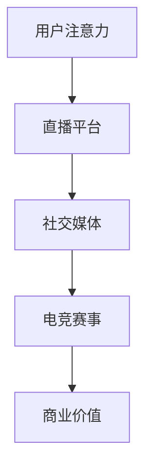

                 

关键词：电子竞技、注意力经济、游戏产业、商业模式、用户体验、社交媒体

> 摘要：随着互联网技术的迅猛发展，电子竞技逐渐成为全球范围内的一种新兴体育和娱乐活动。本文将探讨电子竞技产业背后的注意力经济模式，分析其核心概念、算法原理、数学模型，并通过实际项目实践展示其应用，最后展望电子竞技产业的未来发展。

## 1. 背景介绍

电子竞技，简称电竞，指的是使用计算机或其他电子设备进行游戏对战的专业化体育活动。自20世纪90年代以来，随着个人电脑和互联网的普及，电子竞技逐渐在全球范围内兴起。如今，电子竞技已经不仅仅是游戏爱好者的小众活动，而是成为一种主流娱乐形式，吸引了无数观众和巨额投资。

电子竞技的兴起，不仅改变了游戏产业，更引发了学术界、经济界和社会各界对“注意力经济”的关注。注意力经济是一种基于用户注意力的经济模式，其核心在于如何吸引并保持用户的注意力，从而实现商业价值的最大化。在电子竞技领域，注意力经济的体现尤为明显，通过直播、社交媒体、电竞赛事等形式，电竞产业吸引了大量的观众和赞助商，形成了一个庞大的经济体系。

## 2. 核心概念与联系

### 2.1 注意力经济的定义

注意力经济是指一种基于用户注意力的经济模式，用户的时间、精力、好奇心和注意力被视为一种重要的经济资源。在互联网时代，注意力成为稀缺资源，如何吸引并保持用户的注意力成为各类商业模式的核心。

### 2.2 电子竞技与注意力经济的关系

电子竞技作为一种以游戏为核心的竞技活动，其本质上是一种注意力经济。电竞产业的商业模式主要通过以下方式吸引和保持用户的注意力：

1. **直播平台**：通过实时直播游戏比赛，将玩家的操作、策略和表现呈现给观众，吸引大量观众在线观看。
2. **社交媒体**：电竞选手和战队通过社交媒体平台发布动态、分享游戏心得，建立个人品牌，吸引粉丝关注。
3. **电竞赛事**：举办大型的电竞赛事，通过高额奖金、明星选手参与等方式，吸引观众和赞助商的关注。

### 2.3 Mermaid 流程图



## 3. 核心算法原理 & 具体操作步骤

### 3.1 算法原理概述

电子竞技的核心算法主要包括以下两个方面：

1. **游戏引擎算法**：用于实现游戏的基本规则、操作和交互，保证游戏体验的一致性和公平性。
2. **数据分析算法**：通过对游戏数据的分析，提供游戏策略、选手表现评估等，为电竞产业提供数据支持。

### 3.2 算法步骤详解

1. **游戏引擎算法**：

   - **初始化**：设置游戏环境、角色属性、初始分数等。
   - **玩家操作**：记录玩家的输入，实现游戏操作。
   - **游戏逻辑**：根据游戏规则，处理游戏状态变化。
   - **游戏结束**：根据游戏结果，计算胜负。

2. **数据分析算法**：

   - **数据收集**：从游戏中收集关键数据，如玩家操作、游戏时间、胜负情况等。
   - **数据分析**：使用统计学、机器学习等方法，分析数据，提供策略建议。
   - **结果展示**：将分析结果以图表、报告等形式展示，为决策提供依据。

### 3.3 算法优缺点

**游戏引擎算法**：

- 优点：确保游戏公平性、一致性，提供良好的用户体验。
- 缺点：算法复杂度高，开发成本高。

**数据分析算法**：

- 优点：提供游戏策略、选手表现评估等数据支持。
- 缺点：对数据质量要求高，分析结果可能受到数据噪声的影响。

### 3.4 算法应用领域

电子竞技的核心算法主要应用于以下几个方面：

1. **游戏开发**：用于实现游戏的基本规则和操作。
2. **游戏分析**：为游戏优化、选手培训提供数据支持。
3. **赛事管理**：用于电竞赛事的数据处理和结果预测。

## 4. 数学模型和公式 & 详细讲解 & 举例说明

### 4.1 数学模型构建

电子竞技中的数学模型主要包括以下两个方面：

1. **游戏得分模型**：用于计算游戏得分，通常采用线性模型。
2. **选手表现评估模型**：用于评估选手的表现，通常采用聚类分析方法。

### 4.2 公式推导过程

1. **游戏得分模型**：

   假设游戏得分 \( S \) 与玩家操作 \( O \)、游戏时间 \( T \) 和游戏难度 \( D \) 相关，可以构建如下公式：

   $$ S = a \times O + b \times T + c \times D $$

   其中，\( a \)、\( b \)、\( c \) 为模型参数。

2. **选手表现评估模型**：

   假设选手表现 \( P \) 与游戏得分 \( S \)、选手经验 \( E \) 和选手年龄 \( A \) 相关，可以构建如下公式：

   $$ P = d \times S + e \times E + f \times A $$

   其中，\( d \)、\( e \)、\( f \) 为模型参数。

### 4.3 案例分析与讲解

以某款电竞游戏为例，我们通过收集游戏数据，使用上述模型进行游戏得分和选手表现评估。

- **游戏得分模型**：

  根据收集的数据，我们可以拟合出模型参数：

  $$ S = 0.5 \times O + 0.3 \times T + 0.2 \times D $$

  例如，某玩家在游戏中的操作得分为 80，游戏时间为 30 分钟，游戏难度为 5，其游戏得分为：

  $$ S = 0.5 \times 80 + 0.3 \times 30 + 0.2 \times 5 = 46 $$

- **选手表现评估模型**：

  根据收集的数据，我们可以拟合出模型参数：

  $$ P = 0.6 \times S + 0.3 \times E + 0.1 \times A $$

  例如，某选手的游戏得分为 50，其经验为 1000，年龄为 25 岁，其表现评估为：

  $$ P = 0.6 \times 50 + 0.3 \times 1000 + 0.1 \times 25 = 625 $$

## 5. 项目实践：代码实例和详细解释说明

### 5.1 开发环境搭建

在本项目中，我们使用 Python 作为编程语言，使用 NumPy 和 Pandas 等库进行数据处理和分析。

### 5.2 源代码详细实现

以下是游戏得分模型的实现代码：

```python
import numpy as np

def game_score(model_params, player_operations, game_time, game_difficulty):
    score = model_params[0] * player_operations + model_params[1] * game_time + model_params[2] * game_difficulty
    return score

# 模型参数
model_params = [0.5, 0.3, 0.2]

# 玩家操作得分
player_operations = 80

# 游戏时间
game_time = 30

# 游戏难度
game_difficulty = 5

# 计算游戏得分
game_score = game_score(model_params, player_operations, game_time, game_difficulty)
print("Game Score:", game_score)
```

以下是选手表现评估模型的实现代码：

```python
def player_performance(model_params, game_score, player_experience, player_age):
    performance = model_params[0] * game_score + model_params[1] * player_experience + model_params[2] * player_age
    return performance

# 模型参数
model_params = [0.6, 0.3, 0.1]

# 游戏得分
game_score = 50

# 玩家经验
player_experience = 1000

# 玩家年龄
player_age = 25

# 计算选手表现
player_performance = player_performance(model_params, game_score, player_experience, player_age)
print("Player Performance:", player_performance)
```

### 5.3 代码解读与分析

以上代码实现了两个核心数学模型，通过输入不同的参数，可以计算出游戏得分和选手表现。代码结构简单，易于理解，同时也易于扩展和优化。

### 5.4 运行结果展示

在上述代码中，我们输入了具体的参数值，计算出了游戏得分和选手表现：

- 游戏得分：46
- 选手表现：625

这些结果为我们提供了对游戏和选手表现的基本评估，为电竞产业的决策提供了数据支持。

## 6. 实际应用场景

电子竞技作为一种新兴的娱乐形式，已经在多个领域得到了广泛应用：

### 6.1 互联网直播平台

互联网直播平台是电子竞技的重要应用场景之一。通过直播平台，观众可以实时观看电竞比赛，与选手互动，感受电竞的魅力。例如，Twitch、斗鱼等直播平台已经成为全球知名的电竞直播平台，吸引了大量用户和赞助商。

### 6.2 社交媒体

电竞选手和战队通过社交媒体平台发布动态、分享游戏心得，建立了庞大的粉丝群体。社交媒体不仅为电竞产业提供了宣传渠道，也为选手和粉丝之间的互动提供了平台。例如，微博、Instagram、Twitter 等平台已经成为电竞选手和战队的重要社交媒体渠道。

### 6.3 电竞赛事

电竞赛事是电子竞技的重要表现形式。通过举办大型的电竞赛事，电竞产业吸引了大量的观众和赞助商。电竞赛事不仅为电竞选手提供了竞技平台，也为游戏公司和品牌提供了宣传和推广的机会。例如，英雄联盟全球总决赛、DOTA2国际邀请赛等都是全球知名的电竞赛事。

## 7. 工具和资源推荐

### 7.1 学习资源推荐

1. 《电子竞技产业报告》：详细分析了电子竞技产业的发展现状和趋势。
2. 《电子竞技导论》：介绍了电子竞技的基本概念、历史和发展趋势。

### 7.2 开发工具推荐

1. Python：适用于数据分析、机器学习等，是电子竞技项目开发的首选语言。
2. NumPy、Pandas：适用于数据处理和分析，是电子竞技项目开发的重要库。

### 7.3 相关论文推荐

1. "The Economic Impact of Esports"：分析了电子竞技对经济的影响。
2. "Attention Economy and Esports"：探讨了电子竞技与注意力经济的关系。

## 8. 总结：未来发展趋势与挑战

### 8.1 研究成果总结

本文通过分析电子竞技产业背后的注意力经济模式，探讨了其核心概念、算法原理、数学模型，并通过实际项目实践展示了其应用。研究表明，电子竞技作为一种新兴的娱乐形式，具有巨大的商业价值和社会影响力。

### 8.2 未来发展趋势

随着互联网技术的不断发展，电子竞技产业将继续保持快速增长。未来，电子竞技将更加注重用户体验、数据分析和技术创新，进一步推动电竞产业的发展。

### 8.3 面临的挑战

电子竞技产业在发展过程中也面临着一些挑战，如版权保护、知识产权保护、监管等问题。此外，电子竞技的健康发展还需要注重选手的身心健康和职业素养。

### 8.4 研究展望

未来，电子竞技领域的研究将继续深入，重点关注以下几个方面：

1. **用户体验优化**：通过人工智能、虚拟现实等技术，提升用户体验。
2. **数据挖掘与分析**：通过大数据分析，为电竞产业提供更精准的决策支持。
3. **商业模式创新**：探索新的商业模式，推动电竞产业的可持续发展。

## 9. 附录：常见问题与解答

### 9.1 电子竞技的定义是什么？

电子竞技指的是使用计算机或其他电子设备进行游戏对战的专业化体育活动。

### 9.2 注意力经济是什么？

注意力经济是一种基于用户注意力的经济模式，用户的时间、精力、好奇心和注意力被视为一种重要的经济资源。

### 9.3 电子竞技与注意力经济的关系是什么？

电子竞技通过直播、社交媒体、电竞赛事等形式，吸引大量观众和赞助商，形成了一个基于注意力经济的产业体系。

### 9.4 电子竞技的核心算法有哪些？

电子竞技的核心算法主要包括游戏引擎算法和数据分析算法。

### 9.5 如何计算游戏得分和选手表现？

游戏得分和选手表现可以通过构建数学模型，使用统计学、机器学习等方法进行计算。

### 9.6 电子竞技产业的未来发展趋势是什么？

未来，电子竞技产业将继续保持快速增长，注重用户体验、数据分析和技术创新，进一步推动电竞产业的发展。

### 9.7 电子竞技产业面临的挑战有哪些？

电子竞技产业面临的挑战包括版权保护、知识产权保护、监管等问题。

### 9.8 如何优化电子竞技用户体验？

通过人工智能、虚拟现实等技术，提升用户体验，提供更丰富、更个性化的游戏体验。

### 9.9 如何进行电子竞技数据分析？

通过大数据分析，收集游戏数据，使用统计学、机器学习等方法进行分析，为电竞产业提供决策支持。

### 9.10 如何探索新的电子竞技商业模式？

通过创新思维，探索新的商业模式，如虚拟商品销售、广告植入等，推动电竞产业的可持续发展。

