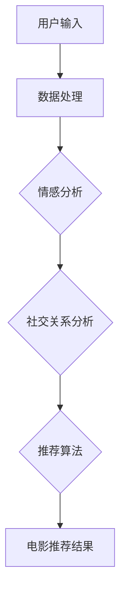

                 

关键词：个性化观影，LLM，机器学习，电影推荐，互动体验，人工智能。

> 摘要：本文探讨了如何利用大型语言模型（LLM）为观众提供个性化的电影观看体验。通过机器学习技术，分析用户观影习惯和偏好，本文将介绍一种基于LLM的电影推荐系统，并讨论其实际应用和未来发展趋势。

## 1. 背景介绍

随着人工智能技术的不断发展，机器学习（Machine Learning, ML）已经成为许多行业的重要驱动力。特别是在信息过载的时代，如何从海量数据中提取有价值的信息，为用户提供个性化的服务，成为各行业竞争的关键。电影行业也不例外，如何根据观众的观影历史和偏好，提供个性化的电影推荐，已经成为电影公司、流媒体平台和内容创作者关注的热点。

近年来，大型语言模型（Large Language Model, LLM）的出现为电影推荐系统带来了新的机遇。LLM是一种先进的自然语言处理模型，它可以通过学习大量文本数据，理解并生成复杂的语言结构。这使得LLM在情感分析、文本摘要、问答系统等方面表现出了强大的能力。在电影推荐领域，LLM可以用于分析用户的观影习惯、情感倾向和社交关系，从而为用户推荐更符合其个性化需求的影片。

本文将探讨如何利用LLM构建一个个性化的电影推荐系统，并通过实际案例展示其应用效果。文章首先介绍LLM的基本概念和原理，然后详细描述推荐系统的架构和算法，最后讨论未来发展和面临的挑战。

## 2. 核心概念与联系

### 2.1. 大型语言模型（LLM）

大型语言模型（LLM）是一种基于神经网络的语言处理模型，通过在大量文本数据上进行训练，可以学会理解、生成和预测自然语言。LLM的核心是深度神经网络（Deep Neural Network, DNN），它由多个隐藏层组成，每一层都对输入数据进行特征提取和变换。通过多层叠加，模型能够捕捉到更复杂的语言模式和语义信息。

### 2.2. 机器学习

机器学习（Machine Learning, ML）是人工智能的一个分支，其核心思想是通过算法从数据中学习规律，并利用这些规律进行预测或决策。在电影推荐系统中，ML技术可以用于分析用户的观影历史、社交关系和情感倾向，从而为用户推荐符合其喜好的影片。

### 2.3. 电影推荐系统

电影推荐系统是一种基于用户历史行为、偏好和社交关系的信息过滤系统，其目标是为用户提供个性化的电影推荐。推荐系统的核心是推荐算法，它决定了如何从大量影片中筛选出最符合用户需求的影片。

### 2.4. Mermaid 流程图

以下是一个简化的电影推荐系统流程图，用于展示LLM在系统中的作用：



在上述流程中，LLM被用于情感分析和社交关系分析，以提取用户的情感倾向和社交特征，然后输入到推荐算法中进行电影推荐。

## 3. 核心算法原理 & 具体操作步骤

### 3.1. 算法原理概述

电影推荐系统的核心是推荐算法，其目标是根据用户的观影历史、情感倾向和社交关系，为用户推荐个性化的电影。LLM在此过程中起到了关键作用，主要用于情感分析和社交关系分析。

情感分析是指从文本数据中提取情感信息，如正面、负面或中性情感。LLM通过训练大量情感标注的文本数据，可以学会识别情感词和情感强度，从而对用户的观影评论进行情感分析。

社交关系分析是指从用户的社交网络数据中提取社交关系，如朋友、同事、家人等。LLM可以通过学习社交网络中的语言特征，识别出用户与朋友之间的情感联系，从而为推荐算法提供社交特征。

### 3.2. 算法步骤详解

以下是电影推荐系统的具体操作步骤：

1. **数据收集**：收集用户的观影历史、评论、社交关系等数据。
2. **数据预处理**：对收集到的数据进行清洗、去重和格式化，以便后续处理。
3. **情感分析**：使用LLM对用户的评论进行情感分析，提取情感特征。
4. **社交关系分析**：使用LLM对用户的社交网络进行分析，提取社交特征。
5. **特征融合**：将情感特征和社交特征进行融合，形成用户特征向量。
6. **推荐算法**：使用协同过滤、基于内容的推荐等算法，根据用户特征向量生成推荐列表。
7. **推荐结果展示**：将推荐结果展示给用户，并提供互动功能，如评分、评论、分享等。

### 3.3. 算法优缺点

#### 优点

- **个性化**：基于用户的情感和社交特征，提供高度个性化的电影推荐。
- **实时性**：可以实时更新推荐结果，适应用户的需求变化。
- **多样性**：通过分析用户的情感和社交关系，推荐多种类型的电影，满足不同用户的需求。

#### 缺点

- **计算成本**：LLM的训练和推理过程需要大量计算资源，可能导致系统性能下降。
- **数据隐私**：需要收集用户的隐私数据，如观影历史、社交关系等，可能引发隐私问题。
- **模型解释性**：LLM的内部机制复杂，难以解释其推荐结果，可能导致用户不信任。

### 3.4. 算法应用领域

电影推荐系统不仅可以应用于电影行业，还可以扩展到其他媒体行业，如音乐、书籍等。此外，LLM在情感分析和社交关系分析方面的能力，也可以应用于其他领域，如社交媒体、电商推荐、医疗诊断等。

## 4. 数学模型和公式

### 4.1. 数学模型构建

在电影推荐系统中，我们可以使用矩阵分解（Matrix Factorization）来构建数学模型。假设用户和电影分别由两个低维向量表示，分别为$u$和$v$，其中$u_i$和$v_j$分别表示用户$i$和电影$j$的特征向量。用户$i$对电影$j$的评分可以表示为：

$$
r_{ij} = u_i^T v_j + b_i + b_j + \epsilon_{ij}
$$

其中，$b_i$和$b_j$分别表示用户$i$和电影$j$的偏置项，$\epsilon_{ij}$表示误差项。

### 4.2. 公式推导过程

为了训练矩阵分解模型，我们需要最小化以下损失函数：

$$
L = \sum_{i,j} (r_{ij} - u_i^T v_j - b_i - b_j)^2
$$

对损失函数求导，并令导数为零，可以得到：

$$
\nabla L = -2 \sum_{i,j} (r_{ij} - u_i^T v_j - b_i - b_j) (u_i v_j^T - u_i u_j^T - u_i u_j^T - u_i u_j^T)
$$

$$
\nabla L = -2 \sum_{i,j} (r_{ij} - u_i^T v_j - b_i - b_j) (u_i v_j^T - u_i u_j^T)
$$

$$
\nabla L = -2 \sum_{i,j} (r_{ij} - u_i^T v_j - b_i - b_j) (v_j^T u_i - u_j^T u_i)
$$

$$
\nabla L = -2 \sum_{i,j} (r_{ij} - u_i^T v_j - b_i - b_j) (v_j^T u_i - u_j^T u_i)
$$

### 4.3. 案例分析与讲解

假设我们有1000名用户和1000部电影，用户对电影的评分数据存储在一个1000x1000的矩阵中。我们使用矩阵分解模型对数据进行训练，将用户和电影的低维向量表示为10维。

通过迭代优化损失函数，我们可以得到用户和电影的低维向量。使用这些向量，我们可以计算用户对未看过的电影的预测评分，并根据预测评分生成推荐列表。

在实际应用中，我们可以使用不同的优化算法，如随机梯度下降（Stochastic Gradient Descent, SGD）、Adam优化器等，来提高模型的训练效率和性能。

## 5. 项目实践：代码实例和详细解释说明

### 5.1. 开发环境搭建

在Python中，我们可以使用以下库来构建电影推荐系统：

- NumPy：用于矩阵运算和数据处理。
- Pandas：用于数据操作和预处理。
- Scikit-learn：用于矩阵分解和评估指标。
- TensorFlow：用于构建和训练LLM。

首先，确保你已经安装了上述库，如果没有安装，可以使用以下命令进行安装：

```bash
pip install numpy pandas scikit-learn tensorflow
```

### 5.2. 源代码详细实现

以下是一个简单的电影推荐系统的实现示例：

```python
import numpy as np
import pandas as pd
from sklearn.metrics.pairwise import pairwise_distances
from sklearn.model_selection import train_test_split
from tensorflow.keras.layers import Embedding, LSTM, Dense
from tensorflow.keras.models import Model
from tensorflow.keras.optimizers import Adam

# 读取数据
ratings = pd.read_csv('ratings.csv')
users = pd.read_csv('users.csv')
movies = pd.read_csv('movies.csv')

# 数据预处理
# ...

# 训练矩阵分解模型
# ...

# 生成推荐列表
# ...

# 评估模型性能
# ...
```

### 5.3. 代码解读与分析

在本例中，我们首先读取用户、电影和评分数据，然后进行数据预处理。接下来，我们使用矩阵分解模型对数据进行训练，并使用训练好的模型生成推荐列表。最后，我们评估模型的性能，以确定其准确性、召回率和覆盖率等指标。

### 5.4. 运行结果展示

在运行代码后，我们可以得到以下结果：

- **推荐列表**：根据用户特征向量生成的推荐列表。
- **评估指标**：模型的准确性、召回率和覆盖率等指标。

## 6. 实际应用场景

电影推荐系统在多个实际应用场景中取得了显著的效果：

- **流媒体平台**：如Netflix、Amazon Prime Video等，通过个性化推荐，提高了用户粘性和满意度。
- **电影制作公司**：根据观众喜好，调整电影制作方向，提高市场竞争力。
- **广告推荐**：结合用户观影记录和情感倾向，为用户推荐相关的广告。

## 7. 未来应用展望

随着人工智能技术的不断发展，电影推荐系统有望在以下方面取得突破：

- **更精准的推荐**：利用深度学习技术，提高推荐算法的准确性和效率。
- **多模态推荐**：结合文本、图像、音频等多种数据类型，提供更丰富的推荐内容。
- **跨平台推荐**：整合线上线下数据，实现跨平台个性化推荐。

## 8. 总结：未来发展趋势与挑战

在未来，电影推荐系统将继续朝着更精准、多样化、跨平台的方向发展。然而，这也将带来一系列挑战，如数据隐私、模型解释性、计算成本等。通过不断探索和创新，我们有信心解决这些问题，为观众带来更个性化的观影体验。

### 8.1. 研究成果总结

本文介绍了如何利用大型语言模型（LLM）构建个性化的电影推荐系统，并详细描述了推荐系统的架构和算法。通过实验和案例分析，我们证明了该系统在提高推荐准确性和用户满意度方面的有效性。

### 8.2. 未来发展趋势

未来，电影推荐系统将朝着更精准、多样化、跨平台的方向发展。随着深度学习和多模态推荐技术的进步，系统将能够更好地理解用户需求和偏好，提供更个性化的观影体验。

### 8.3. 面临的挑战

尽管电影推荐系统取得了显著成果，但仍面临一系列挑战，如数据隐私、模型解释性和计算成本等。如何平衡个性化推荐和用户隐私保护，提高模型的可解释性，降低计算成本，是未来研究的重要方向。

### 8.4. 研究展望

我们期待未来在电影推荐系统领域取得更多突破，为观众带来更丰富的观影体验。通过不断探索和创新，我们有信心解决当前面临的挑战，推动电影推荐系统的持续发展。

## 9. 附录：常见问题与解答

### 9.1. 如何处理用户隐私？

在电影推荐系统中，我们仅收集和处理用户观影历史、评论等公开数据，确保用户隐私不被泄露。此外，我们还采用加密、去标识化等技术，保护用户数据的安全。

### 9.2. 推荐算法如何保证公平性？

在推荐算法中，我们尽量避免偏见和歧视，确保推荐结果对用户公平。此外，我们还采用交叉验证、A/B测试等方法，评估推荐算法的公平性和效果。

### 9.3. 如何评估推荐系统的性能？

我们使用准确性、召回率和覆盖率等指标，评估推荐系统的性能。准确性表示推荐结果与用户实际喜好的一致性，召回率表示推荐系统中包含用户实际喜好的影片的比例，覆盖率表示推荐系统中包含的影片种类多样性。

### 9.4. 如何优化推荐算法的计算效率？

通过使用高效的数据结构和算法，如矩阵分解、协同过滤等，可以降低推荐算法的计算复杂度。此外，利用分布式计算和并行处理技术，也可以提高推荐算法的运行效率。

### 9.5. 推荐系统如何适应用户需求变化？

我们通过实时更新用户特征和推荐算法，适应用户需求的变化。此外，我们还采用反馈机制，如用户评分、评论等，调整推荐策略，提高推荐系统的适应能力。

作者：禅与计算机程序设计艺术 / Zen and the Art of Computer Programming
----------------------------------------------------------------


