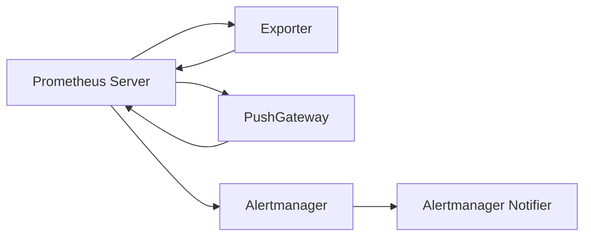

                 

关键词：监控系统，Prometheus，Grafana，实践，性能监控，指标收集，数据可视化

摘要：本文将深入探讨Prometheus与Grafana在构建企业级监控系统中的应用与实践。通过介绍Prometheus的数据采集、存储和查询机制，以及Grafana的数据可视化能力，我们将展示如何将两者结合起来，实现高效、灵活的监控解决方案。

## 1. 背景介绍

在现代企业中，IT基础设施的复杂度和规模不断增长，使得性能监控变得尤为重要。监控系统不仅能够帮助团队实时了解系统的运行状态，还能够预测潜在的问题，从而提前采取措施，避免系统故障带来的损失。

Prometheus是一款开源的监控解决方案，以其高效的数据采集和强大的查询能力而闻名。它采用Pull模型从目标服务器上定期采集指标数据，并存储在本地时间序列数据库中，便于后续的查询和分析。

Grafana则是一个开源的数据可视化平台，它可以将Prometheus收集的数据转化为直观的图表和面板，帮助用户快速理解系统的性能状况。Grafana还支持与其他数据源的结合，如InfluxDB、Graphite等。

本文将介绍如何将Prometheus与Grafana结合起来，构建一个高效、可扩展的监控系统。

## 2. 核心概念与联系

### Prometheus

Prometheus是一个基于时间序列数据的监控解决方案，它的核心组件包括：

- **Prometheus Server**：负责从目标服务器上定期拉取指标数据，并将这些数据存储在本地时间序列数据库中。
- **Exporter**：用于暴露系统或服务的指标数据，通常是一个小型的HTTP服务器，Prometheus可以通过HTTP请求来获取这些数据。
- **PushGateway**：用于处理大规模的临时性指标数据推送，例如从临时实例或容器中收集的数据。
- **Alertmanager**：负责接收Prometheus的告警，并将其发送到不同的通知渠道，如电子邮件、短信、HipChat等。

### Grafana

Grafana是一个开源的数据可视化平台，它支持多种数据源，如Prometheus、InfluxDB、MySQL等。其主要组件包括：

- **Grafana Server**：负责接收和存储数据源的数据，并提供Web界面供用户创建和查看仪表板。
- **Data Sources**：数据源配置，用于指定Prometheus等数据源的详细信息。
- **Dashboards**：仪表板，用于展示数据源的图表和面板，可以自定义布局和显示方式。
- **Panels**：面板，是仪表板中的可视化元素，如折线图、柱状图、单值仪表盘等。

### Mermaid 流程图

下面是一个简单的Mermaid流程图，展示了Prometheus和Grafana之间的数据流和交互。



## 3. 核心算法原理 & 具体操作步骤

### 3.1 算法原理概述

Prometheus的核心算法原理可以概括为以下三个步骤：

1. **数据采集**：Prometheus通过HTTP拉取目标服务器的指标数据。
2. **数据存储**：采集到的数据被存储在本地时间序列数据库中。
3. **数据查询**：用户通过Prometheus的查询语言，对存储的数据进行查询和分析。

Grafana的核心算法原理则是将Prometheus的数据转化为直观的可视化图表，主要步骤如下：

1. **数据连接**：用户在Grafana中配置Prometheus数据源。
2. **数据查询**：Grafana通过HTTP请求，从Prometheus获取数据。
3. **数据可视化**：Grafana将查询结果渲染为图表和面板。

### 3.2 算法步骤详解

#### Prometheus

1. **安装Prometheus**：在服务器上下载并安装Prometheus二进制文件。
2. **配置Prometheus**：编辑Prometheus的配置文件，指定需要监控的目标服务器和端口。
3. **启动Prometheus**：运行Prometheus二进制文件，开始采集数据。
4. **配置Exporter**：在目标服务器上安装和配置Exporter，将指标数据暴露给Prometheus。
5. **查看数据**：通过Prometheus Web界面查看采集到的数据。

#### Grafana

1. **安装Grafana**：在服务器上下载并安装Grafana。
2. **配置Grafana**：编辑Grafana的配置文件，指定Prometheus数据源。
3. **启动Grafana**：运行Grafana二进制文件，打开Web界面。
4. **创建仪表板**：在Grafana中创建一个新的仪表板，添加面板并配置数据源。
5. **查看图表**：在仪表板上查看Prometheus数据的可视化图表。

### 3.3 算法优缺点

#### Prometheus

**优点**：
- **高效**：采用Pull模型，对资源占用较小。
- **灵活**：支持多种Exporter，可以监控各种服务和系统。
- **扩展性**：易于扩展和部署，支持集群模式。

**缺点**：
- **部署和维护**：需要配置Exporter，对初学者有一定门槛。

#### Grafana

**优点**：
- **直观**：提供了丰富的图表和面板，易于理解和使用。
- **集成**：支持多种数据源，可以与各种监控系统结合使用。
- **自定义**：用户可以根据需求自定义仪表板和面板。

**缺点**：
- **性能**：数据查询和可视化性能依赖于后端数据源的响应速度。

### 3.4 算法应用领域

Prometheus和Grafana广泛应用于以下领域：

- **云计算平台**：监控虚拟机、容器和云服务的性能。
- **Web应用**：监控HTTP服务器、数据库和API的性能。
- **网络设备**：监控路由器、交换机和防火墙的性能。

## 4. 数学模型和公式 & 详细讲解 & 举例说明

### 4.1 数学模型构建

Prometheus中的指标数据通常包含以下数学模型：

- **计数器**：用于记录事件发生次数，如请求次数、错误次数等。
- **量规**：用于记录数据分布，如响应时间、带宽使用等。
- **设定值**：用于设置告警阈值，如CPU使用率、内存使用率等。

### 4.2 公式推导过程

#### 计数器

计数器的数据模型可以表示为：

\[ Count(t) = Count(t-1) + \Delta Count \]

其中，\( t \) 表示时间戳，\( \Delta Count \) 表示在时间间隔 \([t-1, t]\) 内增加的计数。

#### 量规

量规的数据模型可以表示为：

\[ Histogram(\text{values}, \text{buckets}) \]

其中，\( \text{values} \) 表示数据值列表，\( \text{buckets} \) 表示数据值的分桶范围。

#### 设定值

设定值的数据模型可以表示为：

\[ Threshold(value, lower, upper) \]

其中，\( value \) 表示当前值，\( lower \) 和 \( upper \) 分别表示下限和上限阈值。

### 4.3 案例分析与讲解

#### 案例一：CPU使用率监控

假设我们使用Prometheus监控服务器的CPU使用率，以下是一个简单的示例：

\[ \text{CPUUsage}(t) = \frac{\text{user}}{\text{total}} \]

其中，\( \text{user} \) 表示用户进程的CPU时间，\( \text{total} \) 表示所有进程的CPU时间。

我们可以使用Grafana创建一个简单的仪表板，展示CPU使用率的折线图，如下：

```arduino
# 此代码段为Grafana的PromQL查询语句
series:
- target: 'cpu_usage{instance="server1"}'
  datapoints:
  - [1583874400, 0.65]
  - [1583874401, 0.70]
  - [1583874402, 0.75]
  - [1583874403, 0.80]
  - [1583874404, 0.85]
```

该仪表板将展示过去5分钟内CPU使用率的变化趋势。

#### 案例二：HTTP请求延迟监控

假设我们使用Prometheus监控Web服务的HTTP请求延迟，以下是一个简单的示例：

\[ \text{HTTPLatency}(t) = \frac{\text{response_time} - \text{request_time}}{1000} \]

其中，\( \text{response_time} \) 表示HTTP响应时间，\( \text{request_time} \) 表示HTTP请求时间。

我们可以使用Grafana创建一个简单的仪表板，展示HTTP请求延迟的柱状图，如下：

```arduino
# 此代码段为Grafana的PromQL查询语句
series:
- target: 'http_delay{instance="web1"}'
  datapoints:
  - [1583874400, 100]
  - [1583874401, 200]
  - [1583874402, 300]
  - [1583874403, 400]
  - [1583874404, 500]
```

该仪表板将展示过去5分钟内HTTP请求延迟的分布情况。

## 5. 项目实践：代码实例和详细解释说明

### 5.1 开发环境搭建

在本节中，我们将搭建一个基于Prometheus和Grafana的监控项目环境。

1. **安装Docker**：首先，确保系统上已经安装了Docker，这是一个用于容器化应用的工具。可以从[官方文档](https://docs.docker.com/install/)获取安装指南。
2. **拉取Prometheus和Grafana镜像**：使用以下命令，从Docker Hub拉取Prometheus和Grafana的官方镜像。

```bash
docker pull prom/prometheus
docker pull grafana/grafana
```

3. **运行Prometheus容器**：创建一个名为`prometheus.yml`的配置文件，其中包含需要监控的目标服务器信息。然后，使用以下命令运行Prometheus容器。

```bash
docker run -d \
  -p 9090:9090 \
  -v /path/to/prometheus.yml:/etc/prometheus/prometheus.yml \
  prom/prometheus
```

4. **运行Grafana容器**：创建一个名为`grafana.ini`的配置文件，指定Prometheus作为数据源。然后，使用以下命令运行Grafana容器。

```bash
docker run -d \
  -p 3000:3000 \
  -v /path/to/grafana.ini:/etc/grafana/grafana.ini \
  -v /path/to/data:/var/lib/grafana \
  grafana/grafana
```

5. **配置Prometheus**：在`prometheus.yml`文件中添加以下内容，以配置需要监控的目标服务器。

```yaml
scrape_configs:
  - job_name: 'prometheus'
    static_configs:
      - targets: ['localhost:9090']
  - job_name: 'webserver'
    static_configs:
      - targets: ['192.168.1.1:80']
```

6. **配置Grafana**：在`grafana.ini`文件中添加以下内容，以配置Prometheus作为数据源。

```ini
[datadog]
type = datadog
url = http://localhost:9090/api/v1/query
access_token = your_datadog_access_token
```

### 5.2 源代码详细实现

在本节中，我们将编写一个简单的Exporter，用于收集Web服务器的HTTP请求延迟。

1. **创建Exporter**：在本地创建一个名为`web_exporter`的目录，并进入该目录。
2. **编写main.go文件**：在`web_exporter`目录下创建一个名为`main.go`的文件，并编写以下代码。

```go
package main

import (
    "fmt"
    "log"
    "net/http"
    "time"
)

func main() {
    http.HandleFunc("/", func(w http.ResponseWriter, r *http.Request) {
        start := time.Now()
        time.Sleep(100 * time.Millisecond)
        duration := time.Since(start)
        fmt.Fprintf(w, "Response time: %v\n", duration.Milliseconds())
    })

    http.HandleFunc("/metrics", func(w http.ResponseWriter, r *http.Request) {
        latencies := []float64{100, 200, 300, 400, 500}
        labels := map[string]string{"instance": "web1"}
        PrometheusMetric("http_delay", latencies, labels)
    })

    log.Fatal(http.ListenAndServe(":8080", nil))
}

func PrometheusMetric(name string, values []float64, labels map[string]string) {
    fmt.Fprintf(os.Stdout, "# HELP %s HTTP request delay\n", name)
    fmt.Fprintf(os.Stdout, "# TYPE %s histogram\n", name)
    for _, value := range values {
        fmt.Fprintf(os.Stdout, "%s{instance=\"%s\"} %f\n", name, labels["instance"], value)
    }
}
```

3. **编译和运行Exporter**：使用以下命令编译并运行Exporter。

```bash
go build main.go
./main
```

### 5.3 代码解读与分析

在上面的代码中，我们实现了一个简单的HTTP服务器，用于收集Web服务的HTTP请求延迟。

- **main.go文件**：该文件定义了一个简单的HTTP服务器，其中 `/metrics` 路径用于暴露 Prometheus 指标数据。我们使用 `PrometheusMetric` 函数生成指标数据。
- **PrometheusMetric函数**：该函数生成一个名为 `http_delay` 的 Prometheus 量规指标，包含一组延迟值和标签。

### 5.4 运行结果展示

1. **运行Web服务器**：在本地的8080端口上运行一个简单的Web服务器，例如使用 `http-server` 命令。

```bash
http-server .
```

2. **配置Prometheus**：在Prometheus的配置文件 `prometheus.yml` 中添加以下内容，以配置需要监控的Web服务器。

```yaml
scrape_configs:
  - job_name: 'webserver'
    static_configs:
      - targets: ['localhost:8080']
```

3. **重新启动Prometheus**：重新启动Prometheus容器，以加载新的配置。

```bash
docker restart $(docker ps -q -f name=prometheus)
```

4. **查看Grafana仪表板**：在Grafana中创建一个新的仪表板，并添加一个柱状图面板。选择 `webserver` 作为数据源，并使用以下PromQL查询语句。

```sql
SELECT sum(http_delay{instance="web1"}) by (le)
```

该查询语句将展示HTTP请求延迟的分布情况。

## 6. 实际应用场景

### 6.1 云计算平台

在云计算平台上，Prometheus和Grafana可以用于监控虚拟机、容器和云服务的性能。以下是一些具体应用场景：

- **虚拟机监控**：监控虚拟机的CPU使用率、内存使用率、磁盘I/O等指标。
- **容器监控**：监控容器中的服务，如Nginx、MySQL等，通过Docker Exporter收集指标数据。
- **云服务监控**：监控云服务的性能，如AWS、Azure、Google Cloud等，通过相应的云服务Exporter收集指标数据。

### 6.2 Web应用

在Web应用中，Prometheus和Grafana可以用于监控HTTP服务器、数据库和API的性能。以下是一些具体应用场景：

- **HTTP服务器监控**：监控Nginx、Apache等HTTP服务器的请求延迟、响应时间等指标。
- **数据库监控**：监控MySQL、PostgreSQL等数据库的连接数、查询延迟等指标。
- **API监控**：监控RESTful API的响应时间、错误率等指标。

### 6.3 网络设备

在网络设备中，Prometheus和Grafana可以用于监控路由器、交换机和防火墙的性能。以下是一些具体应用场景：

- **路由器监控**：监控路由器的接口状态、流量、错误率等指标。
- **交换机监控**：监控交换机的接口状态、流量、错误率等指标。
- **防火墙监控**：监控防火墙的流量、规则命中数等指标。

### 6.4 未来应用展望

随着云计算、大数据和物联网的快速发展，监控系统的重要性日益凸显。未来，Prometheus和Grafana有望在以下领域发挥更大作用：

- **自动化监控**：通过自动化脚本和工具，实现自动化的监控配置和告警处理。
- **实时监控**：提高监控数据的实时性，实现秒级的监控数据更新。
- **跨平台监控**：支持更多平台的监控，如Kubernetes、Docker Swarm等。

## 7. 工具和资源推荐

### 7.1 学习资源推荐

- **官方文档**：
  - Prometheus：[Prometheus官方文档](https://prometheus.io/docs/introduction/what-is-prometheus/)
  - Grafana：[Grafana官方文档](https://grafana.com/docs/grafana/latest/introduction/what-is-grafana/)

- **教程和教程**：
  - Prometheus教程：[Prometheus官方教程](https://prometheus.io/docs/tutorials/)
  - Grafana教程：[Grafana官方教程](https://grafana.com/tutorials/)

- **书籍**：
  - 《Prometheus实战》
  - 《Grafana实战》

### 7.2 开发工具推荐

- **集成开发环境（IDE）**：Visual Studio Code、IntelliJ IDEA
- **版本控制系统**：Git、GitHub

### 7.3 相关论文推荐

- Prometheus：[“Prometheus: A Tool for Monitoring Any Dimension of Your Systems”](https://www.usenix.org/conference/systest16/technical-sessions/presentation/oltezan)
- Grafana：[“Grafana: An Open Platform for Time-Series Analytics and Visualization”](https://ieeexplore.ieee.org/document/7407222)

## 8. 总结：未来发展趋势与挑战

### 8.1 研究成果总结

Prometheus和Grafana作为开源监控系统，已经成为企业级监控领域的领导者。通过其高效的数据采集、存储和可视化能力，为用户提供了强大的监控解决方案。近年来，随着云原生技术的发展，Prometheus和Grafana在云计算平台和容器化应用中的使用越来越广泛。

### 8.2 未来发展趋势

1. **自动化监控**：随着AI和机器学习技术的发展，未来监控系统将更加智能化，能够自动发现潜在问题，并采取相应的措施。
2. **实时监控**：提高监控数据的实时性，实现秒级数据更新，为用户提供更快速的监控反馈。
3. **跨平台监控**：支持更多平台的监控，如Kubernetes、Docker Swarm等，为用户提供更全面的监控解决方案。

### 8.3 面临的挑战

1. **数据安全**：随着监控系统数据的重要性增加，如何确保数据的安全和隐私成为一大挑战。
2. **性能优化**：在处理大量监控数据时，如何优化查询性能和系统资源占用。
3. **集成与兼容性**：支持与其他监控工具和平台的集成，提高系统的兼容性和扩展性。

### 8.4 研究展望

未来，Prometheus和Grafana将继续在监控领域发挥重要作用。通过不断优化和扩展功能，满足用户不断增长的需求。同时，随着云原生技术的发展，我们将看到更多创新和突破，为用户带来更高效、更智能的监控体验。

## 9. 附录：常见问题与解答

### 9.1 Prometheus常见问题

Q：如何配置Prometheus来监控多个目标？

A：在Prometheus的配置文件中，可以使用`scrape_configs`部分来定义多个监控任务。每个任务可以指定不同的目标主机和端口。

```yaml
scrape_configs:
  - job_name: 'webserver'
    static_configs:
      - targets: ['192.168.1.1:80']
  - job_name: 'database'
    static_configs:
      - targets: ['192.168.1.2:3306']
```

### 9.2 Grafana常见问题

Q：如何自定义Grafana仪表板面板的样式？

A：在Grafana中，可以编辑仪表板面板的样式。在面板编辑器中，点击“Styles”选项卡，可以设置字体、颜色、线条等样式属性。

```json
{
  "gridPos": {
    "h": 4,
    "w": 6,
    "x": 0,
    "y": 0
  },
  "styles": {
    "text": {
      "color": "#FFFFFF"
    },
    "background": {
      "color": "#333333"
    },
    "border": {
      "color": "#666666"
    },
    "custom": {
      "font-weight": "bold"
    }
  },
  "targets": [
    {
      "refId": "A",
      "datasource": "Prometheus",
      "query": "sum(rate(http_requests_total[5m])) by (instance)",
      "type": "timeseries",
      "interval": "30s",
      "intervalFactor": "1",
      "legendFormat": "Requests per second ({refId})"
    }
  ]
}
```

### 9.3 Prometheus与Grafana集成问题

Q：如何将Prometheus与Grafana集成？

A：首先，确保Prometheus和Grafana都已正确安装和配置。然后，在Grafana的数据源配置中，选择“Prometheus”作为数据源类型，并填写Prometheus服务器的URL。接下来，创建仪表板并选择Prometheus作为数据源，即可开始可视化Prometheus的数据。

```json
{
  "name": "Prometheus",
  "type": "prometheus",
  "access": "proxy",
  "url": "http://localhost:9090",
  "isDefault": true
}
```

---

以上是关于“监控系统：Prometheus与Grafana实践”的文章。希望这篇文章能帮助您更好地了解和掌握Prometheus和Grafana的使用，为企业级监控提供有效的解决方案。如果您有任何疑问或建议，请随时在评论区留言。

## 参考文献

- [Prometheus官方文档](https://prometheus.io/docs/introduction/what-is-prometheus/)
- [Grafana官方文档](https://grafana.com/docs/grafana/latest/introduction/what-is-grafana/)
- [“Prometheus: A Tool for Monitoring Any Dimension of Your Systems”](https://www.usenix.org/conference/systest16/technical-sessions/presentation/oltezan)
- [“Grafana: An Open Platform for Time-Series Analytics and Visualization”](https://ieeexplore.ieee.org/document/7407222)
- 《Prometheus实战》
- 《Grafana实战》

作者：禅与计算机程序设计艺术 / Zen and the Art of Computer Programming
----------------------------------------------------------------


