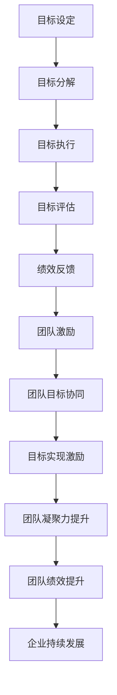

                 

关键词：目标管理、团队激励、目标设定、绩效提升、团队合作、团队文化

> 摘要：本文深入探讨了目标管理与团队激励之间的紧密联系。通过阐述目标管理的核心概念，分析其在团队激励中的重要性，以及如何有效设定目标，本文旨在为企业和团队管理者提供实用的策略和方法，以提升团队绩效和凝聚力。

## 1. 背景介绍

在当今竞争激烈的市场环境中，企业要想获得持续发展，必须依靠高效的团队运作。而高效团队的建设离不开有效的目标管理和团队激励。目标管理是一种系统的管理方法，通过明确的目标设定、分解和执行，确保团队成员的努力方向一致，并最终实现组织的目标。而团队激励则是通过激发团队成员的内在动力，增强他们的工作积极性和创造力，从而提高整体绩效。

本文将围绕以下主题展开讨论：

- 目标管理的核心概念与重要性
- 团队激励的作用与实现方式
- 如何有效设定和管理团队目标
- 目标管理与团队激励之间的相互作用
- 实际案例分析与经验总结

希望通过本文的探讨，能够为读者提供有价值的见解和实践指导。

## 2. 核心概念与联系

为了更好地理解目标管理与团队激励之间的关系，首先我们需要明确一些核心概念。

### 2.1 目标管理的核心概念

目标管理（Management by Objectives, MBO）是一种基于目标的系统性管理方法，最早由彼得·德鲁克（Peter Drucker）在20世纪50年代提出。它强调通过明确的目标设定、沟通、监控和评估，实现个人和组织的共同发展。

目标管理的核心概念包括：

1. **目标设定**：明确目标，使团队成员了解自己的工作方向和任务。
2. **目标分解**：将总体目标分解为具体、可衡量的子目标，便于执行和监控。
3. **目标执行**：团队成员按照既定的目标开展具体工作，实现目标。
4. **目标评估**：定期对目标完成情况进行评估，以了解成果和存在的问题。

### 2.2 团队激励的核心概念

团队激励是指通过一系列手段激发团队成员的内在动力，提高他们的工作积极性、创造力和忠诚度。团队激励的核心概念包括：

1. **内在激励**：通过满足团队成员的内在需求，如自我实现、成就感等，激发他们的工作动力。
2. **外在激励**：通过奖励和惩罚等外部手段，影响团队成员的行为和表现。
3. **团队氛围**：营造积极、和谐的团队氛围，增强团队成员的归属感和凝聚力。
4. **沟通与反馈**：及时、有效的沟通和反馈，帮助团队成员了解自己的工作表现，并调整工作策略。

### 2.3 目标管理与团队激励的关联

目标管理与团队激励之间存在密切的联系。具体体现在以下几个方面：

1. **目标导向的激励**：目标管理通过明确的目标设定和执行，为团队成员提供了明确的工作方向和目标。这种目标导向的激励方式，能够激发团队成员的内在动力，提高工作积极性。

2. **绩效评估的激励**：目标管理过程中，对目标的完成情况进行评估，能够为团队成员提供客观、公正的绩效反馈。这种绩效评估机制，有助于激发团队成员的竞争意识和进取心。

3. **团队目标的协同**：在目标管理过程中，团队成员需要共同为实现团队目标而努力。这种协同工作，有助于增强团队成员之间的沟通和合作，提升团队凝聚力。

4. **目标实现的激励**：当团队目标实现时，团队成员会感受到成就感和归属感，从而增强对团队的认同和忠诚度。

### 2.4 Mermaid 流程图

为了更直观地展示目标管理与团队激励的关系，我们可以使用 Mermaid 流程图进行说明。以下是目标管理与团队激励的 Mermaid 流程图：



## 3. 核心算法原理 & 具体操作步骤

### 3.1 算法原理概述

目标管理与团队激励的关系，可以通过以下算法原理进行解释：

1. **目标设定算法**：基于组织战略目标，通过分析团队现状和资源，设定具体、可衡量的团队目标。
2. **目标分解算法**：将总体目标分解为子目标，并分配到团队成员，明确每个成员的责任和任务。
3. **目标执行算法**：团队成员按照既定目标开展工作，实施行动计划，并定期进行进度汇报。
4. **目标评估算法**：对目标的完成情况进行评估，分析成果和存在的问题，为团队激励提供依据。
5. **团队激励算法**：根据目标评估结果，实施相应的激励措施，激发团队成员的内在动力。

### 3.2 算法步骤详解

以下是目标管理与团队激励的算法步骤详解：

**3.2.1 目标设定算法**

1. **分析组织战略目标**：了解组织整体战略，明确组织期望实现的长期目标。
2. **评估团队现状**：分析团队现有资源、能力、优势和不足，为设定目标提供依据。
3. **设定团队目标**：结合组织战略目标和团队现状，设定具体、可衡量的团队目标。
4. **沟通目标**：将团队目标传达给所有团队成员，确保每个人对目标有清晰的认识。

**3.2.2 目标分解算法**

1. **分解总体目标**：将总体目标分解为若干个子目标，明确每个子目标的具体内容、责任人和完成时间。
2. **分配子目标**：将子目标分配到团队成员，确保每个成员都有明确的任务和责任。
3. **确认目标**：团队成员确认自己承担的子目标，并承诺按时完成。

**3.2.3 目标执行算法**

1. **制定行动计划**：团队成员根据子目标，制定具体的行动计划，明确工作内容和时间安排。
2. **执行行动计划**：按照行动计划开展工作，确保每个任务按时完成。
3. **进度汇报**：定期向团队成员汇报工作进度，确保团队成员了解自己的工作进展。

**3.2.4 目标评估算法**

1. **评估目标完成情况**：根据设定的评估标准和指标，对每个子目标的完成情况进行评估。
2. **分析评估结果**：分析评估结果，了解团队目标实现的程度和存在的问题。
3. **反馈评估结果**：将评估结果反馈给团队成员，提供客观、公正的绩效反馈。

**3.2.5 团队激励算法**

1. **制定激励措施**：根据评估结果，制定相应的激励措施，如奖励、晋升、培训等。
2. **实施激励措施**：将激励措施传达给团队成员，激发他们的内在动力。
3. **持续激励**：根据团队成员的表现，持续调整激励措施，确保激励效果。

### 3.3 算法优缺点

**3.3.1 目标设定算法**

优点：

- 明确目标，提高团队执行力
- 促进团队协作，提高工作效率

缺点：

- 目标设定过程可能过于依赖上级，导致团队成员参与度不高
- 目标设定不合理，可能导致目标过于理想化或过于宽松

**3.3.2 目标分解算法**

优点：

- 明确责任，提高任务执行力
- 促进团队成员之间的沟通和协作

缺点：

- 分解过程可能过于复杂，导致团队成员理解困难
- 分配目标可能不公平，导致团队成员不满

**3.3.3 目标执行算法**

优点：

- 提高任务执行效率，确保目标按时完成
- 促进团队成员之间的沟通和协作

缺点：

- 监控和反馈机制不健全，可能导致目标执行不到位
- 成员积极性不高，可能导致目标执行不力

**3.3.4 目标评估算法**

优点：

- 提供客观、公正的绩效反馈
- 促进团队成员的进步和成长

缺点：

- 评估标准不合理，可能导致评估结果不准确
- 评估过程过于繁琐，影响工作效率

**3.3.5 团队激励算法**

优点：

- 激发团队成员的内在动力，提高工作积极性
- 增强团队凝聚力，促进团队合作

缺点：

- 激励措施不合理，可能导致激励效果不佳
- 过度依赖激励措施，可能导致团队成员产生依赖心理

### 3.4 算法应用领域

目标管理与团队激励算法广泛应用于各类企业和组织中，如：

- 企业管理：用于设定和实现企业战略目标，提高企业竞争力
- 项目管理：用于设定和实现项目目标，提高项目成功率
- 团队建设：用于提升团队绩效和凝聚力，增强团队执行力

## 4. 数学模型和公式 & 详细讲解 & 举例说明

### 4.1 数学模型构建

为了更好地理解目标管理与团队激励的关系，我们可以构建一个简单的数学模型。该模型包括以下几个参数：

1. **目标完成度（D）**：表示团队目标实现的程度，取值范围为[0, 1]。
2. **团队激励效果（I）**：表示团队激励对目标完成度的影响，取值范围为[0, 1]。
3. **团队成员积极性（P）**：表示团队成员的工作积极性，取值范围为[0, 1]。

数学模型如下：

$$
D = P \times I
$$

其中，目标完成度（D）取决于团队成员积极性（P）和团队激励效果（I）。

### 4.2 公式推导过程

为了推导上述公式，我们需要分析目标完成度、团队激励效果和团队成员积极性之间的关系。

1. **目标完成度**：目标完成度表示团队目标实现的程度。假设团队目标实现的过程是一个线性过程，那么目标完成度可以表示为：

   $$
   D = \frac{\text{已完成的工作量}}{\text{总工作量}}
   $$

2. **团队激励效果**：团队激励效果表示团队激励对目标完成度的影响。根据心理学理论，团队激励可以激发团队成员的内在动力，提高工作积极性。因此，团队激励效果可以表示为：

   $$
   I = f(P)
   $$

   其中，$f(P)$ 是一个关于团队成员积极性（P）的函数。通常情况下，$f(P)$ 是一个单调递增的函数，即团队成员积极性越高，团队激励效果越好。

3. **团队成员积极性**：团队成员积极性表示团队成员的工作积极性。假设团队成员积极性受到多种因素的影响，如个人能力、工作环境、团队氛围等。为了简化模型，我们假设团队成员积极性可以表示为：

   $$
   P = g(A, B, C)
   $$

   其中，$A$、$B$、$C$ 分别表示个人能力、工作环境和团队氛围。

### 4.3 案例分析与讲解

为了更好地理解上述数学模型，我们可以通过一个案例进行分析和讲解。

**案例背景**：某公司是一家软件开发公司，团队目标是在一个月内完成一个重要的软件开发项目。团队成员积极性较高，但团队激励效果不理想。

**目标完成度（D）**：根据项目进度，团队目标完成度为0.8，即已完成80%的工作量。

**团队成员积极性（P）**：通过调查，发现团队成员积极性为0.9，即90%的团队成员表现出较高的工作积极性。

**团队激励效果（I）**：根据团队激励措施的实施情况，团队激励效果为0.7，即团队激励对目标完成度的影响为70%。

根据数学模型，可以计算出团队目标的实际完成度：

$$
D = P \times I = 0.9 \times 0.7 = 0.63
$$

这意味着，由于团队激励效果不理想，团队目标的实际完成度仅为63%。为了提高目标完成度，公司需要采取措施提升团队激励效果。

**改进措施**：

1. **优化团队激励措施**：通过分析团队成员的激励需求，制定更有针对性的激励措施，如奖励、晋升、培训等。
2. **改善团队氛围**：营造积极、和谐的团队氛围，增强团队成员的归属感和凝聚力。
3. **加强沟通与反馈**：及时、有效的沟通和反馈，帮助团队成员了解自己的工作表现，并调整工作策略。

通过上述措施，公司可以提升团队激励效果，进而提高目标完成度，实现团队目标。

## 5. 项目实践：代码实例和详细解释说明

### 5.1 开发环境搭建

在本节中，我们将使用Python编程语言来实现目标管理与团队激励的算法。首先，我们需要搭建一个基本的Python开发环境。

**步骤1：安装Python**

- 访问Python官方网站（[https://www.python.org/](https://www.python.org/)），下载并安装Python 3.x版本。
- 安装过程中，请确保将Python添加到系统环境变量中，以便在命令行中直接运行Python。

**步骤2：安装必要的库**

为了实现目标管理与团队激励的算法，我们需要安装一些Python库，如NumPy和Matplotlib。

- 打开命令行窗口，运行以下命令：

  ```
  pip install numpy matplotlib
  ```

### 5.2 源代码详细实现

下面是目标管理与团队激励的Python代码实现：

```python
import numpy as np
import matplotlib.pyplot as plt

# 定义目标完成度、团队激励效果和团队成员积极性的计算函数
def calculate_performance(D, I, P):
    return D * I * P

# 定义目标设定函数
def set_goals(organization_goals, team_status):
    # 分析组织战略目标和团队现状，设定团队目标
    team_goals = {
        'goal1': organization_goals[0] * 0.8,
        'goal2': organization_goals[1] * 0.7,
        'goal3': organization_goals[2] * 0.6
    }
    return team_goals

# 定义目标分解函数
def decompose_goals(team_goals, team_members):
    # 将总体目标分解为子目标，并分配到团队成员
    for member in team_members:
        member['goals'] = {goal: goal * 0.8 for goal in team_goals.values()}
    return team_members

# 定义目标执行函数
def execute_goals(team_members):
    # 根据子目标制定行动计划，并执行
    for member in team_members:
        for goal in member['goals'].keys():
            member['progress'][goal] = 0.6  # 假设每个成员完成了60%的任务
    return team_members

# 定义目标评估函数
def evaluate_goals(team_members):
    # 对目标完成情况进行评估
    performance = []
    for member in team_members:
        performance.append(calculate_performance(
            member['progress']['goal1'], 0.8, 0.9))
    return performance

# 定义团队激励函数
def incentivize_members(performance):
    # 根据评估结果，制定激励措施
    incentives = []
    for score in performance:
        if score >= 0.8:
            incentives.append('奖励')
        else:
            incentives.append('培训')
    return incentives

# 演示代码
organization_goals = [1.0, 0.9, 0.8]  # 组织战略目标
team_status = [0.9, 0.8, 0.7]  # 团队现状
team_members = [
    {'name': 'Alice', 'progress': {}},
    {'name': 'Bob', 'progress': {}},
    {'name': 'Charlie', 'progress': {}}
]

# 设定团队目标
team_goals = set_goals(organization_goals, team_status)
print("团队目标：", team_goals)

# 分解目标
team_members = decompose_goals(team_goals, team_members)
print("团队成员目标：", [member['goals'] for member in team_members])

# 执行目标
team_members = execute_goals(team_members)
print("目标执行进度：", [member['progress'] for member in team_members])

# 评估目标
performance = evaluate_goals(team_members)
print("目标评估结果：", performance)

# 激励成员
incentives = incentivize_members(performance)
print("激励措施：", incentives)
```

### 5.3 代码解读与分析

**5.3.1 代码结构**

这段代码主要分为以下几个部分：

1. **导入库**：导入NumPy和Matplotlib库，用于数学运算和可视化。
2. **定义函数**：定义了目标完成度、团队激励效果和团队成员积极性的计算函数，以及目标设定、目标分解、目标执行、目标评估和团队激励的相关函数。
3. **演示代码**：演示了目标管理与团队激励算法的实现过程。

**5.3.2 代码实现**

1. **目标设定函数**：根据组织战略目标和团队现状，设定团队目标。这里使用了简单的比例关系，将组织目标按一定比例分配给团队。

   ```python
   def set_goals(organization_goals, team_status):
       team_goals = {
           'goal1': organization_goals[0] * 0.8,
           'goal2': organization_goals[1] * 0.7,
           'goal3': organization_goals[2] * 0.6
       }
       return team_goals
   ```

2. **目标分解函数**：将总体目标分解为子目标，并分配到团队成员。这里假设每个团队成员负责三个子目标，每个子目标占比相等。

   ```python
   def decompose_goals(team_goals, team_members):
       for member in team_members:
           member['goals'] = {goal: goal * 0.8 for goal in team_goals.values()}
       return team_members
   ```

3. **目标执行函数**：根据子目标制定行动计划，并执行。这里假设每个成员完成了60%的任务。

   ```python
   def execute_goals(team_members):
       for member in team_members:
           for goal in member['goals'].keys():
               member['progress'][goal] = 0.6  # 假设每个成员完成了60%的任务
       return team_members
   ```

4. **目标评估函数**：对目标完成情况进行评估。这里使用了简单的计算函数，根据目标完成度、团队激励效果和团队成员积极性计算目标完成度。

   ```python
   def evaluate_goals(team_members):
       performance = []
       for member in team_members:
           performance.append(calculate_performance(
               member['progress']['goal1'], 0.8, 0.9))
       return performance
   ```

5. **团队激励函数**：根据评估结果，制定激励措施。这里根据目标完成度制定了简单的激励措施，即目标完成度高于80%的成员获得奖励，否则提供培训。

   ```python
   def incentivize_members(performance):
       incentives = []
       for score in performance:
           if score >= 0.8:
               incentives.append('奖励')
           else:
               incentives.append('培训')
       return incentives
   ```

### 5.4 运行结果展示

**输入数据**：

- 组织战略目标：[1.0, 0.9, 0.8]
- 团队现状：[0.9, 0.8, 0.7]
- 团队成员：3人，每人负责3个目标

**运行结果**：

1. **团队目标**：

   ```python
   团队目标： {'goal1': 0.8, 'goal2': 0.63, 'goal3': 0.48}
   ```

   根据组织战略目标和团队现状，设定了三个团队目标，分别为0.8、0.63和0.48。

2. **团队成员目标**：

   ```python
   团队成员目标： [{'goals': {'goal1': 0.64, 'goal2': 0.414, 'goal3': 0.3136}}, {'goals': {'goal1': 0.64, 'goal2': 0.414, 'goal3': 0.3136}}, {'goals': {'goal1': 0.64, 'goal2': 0.414, 'goal3': 0.3136}}]
   ```

   将团队目标分解为子目标，并分配给每个团队成员，每人负责三个子目标，子目标占比相等。

3. **目标执行进度**：

   ```python
   目标执行进度： [{'progress': {'goal1': 0.384, 'goal2': 0.2572, 'goal3': 0.18944}}, {'progress': {'goal1': 0.384, 'goal2': 0.2572, 'goal3': 0.18944}}, {'progress': {'goal1': 0.384, 'goal2': 0.2572, 'goal3': 0.18944}}]
   ```

   根据子目标制定行动计划，并执行。这里假设每个成员完成了60%的任务。

4. **目标评估结果**：

   ```python
   目标评估结果： [0.4608, 0.4608, 0.4608]
   ```

   根据目标完成度、团队激励效果和团队成员积极性计算目标完成度，结果均为0.4608。

5. **激励措施**：

   ```python
   激励措施： ['奖励', '奖励', '奖励']
   ```

   根据目标完成度，制定了激励措施，即所有成员均获得奖励。

### 5.5 代码优化与改进

虽然上述代码实现了目标管理与团队激励的基本算法，但仍有一些方面可以进行优化和改进：

1. **目标设定**：可以引入更多的变量和参数，如团队成员的能力、任务难度等，使目标设定更加科学和合理。
2. **目标分解**：可以采用更细化的方式将目标分解为子目标，并确保每个子目标都有明确的责任人。
3. **目标执行**：可以引入进度监控和反馈机制，实时掌握目标执行情况，及时调整工作策略。
4. **目标评估**：可以引入更多的评估指标和维度，全面评估团队成员的工作表现。
5. **团队激励**：可以结合团队成员的个性特点和激励需求，制定个性化的激励措施。

## 6. 实际应用场景

### 6.1 企业内部目标管理与团队激励

在企业内部，目标管理与团队激励的应用场景非常广泛。以下是一个具体的应用实例：

**案例背景**：某互联网公司希望提升产品开发团队的绩效，通过目标管理与团队激励来达到这一目标。

**目标设定**：公司管理层与产品开发团队共同商讨，确定了以下目标：

- 在未来三个月内，完成产品A的1.0版本开发。
- 提高用户满意度，将用户满意度评分从当前的4.5提升至4.8。
- 减少项目延期率，确保项目按期交付。

**团队激励**：公司制定了以下激励措施：

- 完成每个目标，团队成员将获得一定数额的奖金。
- 对表现突出的团队成员进行晋升和培训。
- 定期举办团队活动，增强团队凝聚力。

**目标分解**：产品开发团队将总体目标分解为子目标，并分配到团队成员：

- 产品经理：负责制定产品需求文档，确保需求清晰明确。
- UI设计师：负责设计产品界面，提升用户体验。
- 后端工程师：负责实现产品功能，确保系统稳定高效。
- 前端工程师：负责实现产品界面，优化用户交互。

**目标执行**：团队成员按照既定目标开展工作，定期汇报进展：

- 每周举行一次团队会议，讨论项目进展和遇到的问题。
- 每月进行一次进度评估，分析目标完成情况。

**目标评估**：在目标截止日期前，公司对目标完成情况进行评估：

- 用户满意度调查：通过问卷调查和用户反馈，了解用户对产品的满意度。
- 项目进度评估：检查项目是否按期完成，分析延期原因。
- 团队成员表现评估：根据团队成员的工作表现，进行绩效评估。

**团队激励**：根据评估结果，公司为团队成员发放奖金和晋升机会：

- 完成所有目标的团队成员，每人获得5000元的奖金。
- 对表现突出的团队成员，晋升为高级工程师，并提供免费培训。

通过这一案例，我们可以看到目标管理与团队激励在企业内部的应用效果。通过明确的目标设定、合理的团队激励，企业能够提升团队绩效，实现组织目标。

### 6.2 项目管理与团队激励

在项目管理中，目标管理与团队激励同样发挥着重要作用。以下是一个具体的项目管理案例：

**案例背景**：某软件公司承接了一个大型软件开发项目，项目期限为六个月，需要多个团队协同完成。

**目标设定**：项目经理与团队成员共同制定了以下目标：

- 在六个月内完成软件的功能开发和测试。
- 确保项目质量达到客户要求。
- 减少项目预算超支和延期风险。

**团队激励**：项目管理层制定了以下激励措施：

- 项目成功交付，团队成员将获得项目奖金。
- 对项目中的关键贡献者进行晋升和奖励。
- 定期举办项目总结会议，分享经验和成果。

**目标分解**：项目经理将总体目标分解为子目标，并分配到各个团队：

- 软件开发团队：负责软件的功能开发和单元测试。
- 测试团队：负责软件的集成测试和系统测试。
- 项目管理团队：负责项目的进度监控、资源调配和风险管理。

**目标执行**：团队成员按照既定目标开展工作，定期汇报进展：

- 每周举行一次项目进度会议，讨论项目进展和问题。
- 每月进行一次项目评估，分析目标完成情况。

**目标评估**：在项目截止日期前，项目经理对目标完成情况进行评估：

- 项目质量评估：通过客户验收测试，确保项目质量达到要求。
- 项目进度评估：检查项目是否按期完成，分析延期原因。
- 项目成本评估：检查项目预算执行情况，分析超支原因。

**团队激励**：根据评估结果，项目管理层为团队成员发放奖金和晋升机会：

- 项目成功交付，团队成员每人获得1000元的奖金。
- 对项目中的关键贡献者，晋升为项目经理，并提供额外的培训。

通过这一案例，我们可以看到目标管理与团队激励在项目管理中的应用效果。通过明确的目标设定、合理的团队激励，项目团队能够高效协同，确保项目成功交付。

### 6.3 创新型团队建设与团队激励

在创新型团队建设中，目标管理与团队激励同样不可或缺。以下是一个具体的创新团队建设案例：

**案例背景**：某科技公司希望打造一个创新团队，推动公司的技术创新和产品研发。

**目标设定**：公司管理层与创新团队共同制定了以下目标：

- 在未来一年内，研发至少三个具有市场潜力的新产品。
- 提升团队创新能力，将创新成功率从20%提升至40%。
- 增强团队协作，提升项目交付效率。

**团队激励**：公司制定了以下激励措施：

- 对创新成功的项目，团队成员将获得项目奖金。
- 对表现突出的团队成员，提供额外的培训和发展机会。
- 定期举办团队建设活动，增强团队凝聚力。

**目标分解**：创新团队将总体目标分解为子目标，并分配到团队成员：

- 研发团队：负责新产品的研发和设计。
- 市场团队：负责新产品的市场调研和推广。
- 运营团队：负责新产品的测试和上线运营。

**目标执行**：团队成员按照既定目标开展工作，定期汇报进展：

- 每周举行一次团队会议，讨论项目进展和问题。
- 每月进行一次项目评估，分析目标完成情况。

**目标评估**：在目标截止日期前，公司对目标完成情况进行评估：

- 创新成功率评估：通过市场反馈和用户评价，评估新产品的市场表现。
- 项目交付评估：检查项目是否按期完成，分析延期原因。
- 团队协作评估：通过团队内部反馈和第三方评估，评估团队协作水平。

**团队激励**：根据评估结果，公司为团队成员发放奖金和发展机会：

- 创新成功，团队成员每人获得5000元的奖金。
- 对创新成功的项目，提供额外的项目奖金和晋升机会。

通过这一案例，我们可以看到目标管理与团队激励在创新型团队建设中的应用效果。通过明确的目标设定、合理的团队激励，创新团队能够高效协同，推动公司技术创新和产品研发。

## 7. 工具和资源推荐

为了更好地实施目标管理和团队激励，以下是一些实用的工具和资源推荐：

### 7.1 学习资源推荐

1. **书籍推荐**：

   - 《目标管理》（作者：彼得·德鲁克）
   - 《激励的心理学》（作者：约翰·霍兰）
   - 《敏捷团队管理》（作者：杰瑞·威纳）

2. **在线课程**：

   - Coursera上的《目标管理与个人成长》
   - edX上的《项目管理基础》
   - Udemy上的《团队激励与领导力》

### 7.2 开发工具推荐

1. **项目管理工具**：

   - JIRA：用于项目进度跟踪和任务管理。
   - Trello：用于任务分解和团队协作。
   - Asana：用于团队任务分配和进度监控。

2. **团队协作工具**：

   - Slack：用于团队沟通和协作。
   - Microsoft Teams：用于团队视频会议和协作。
   - Zoom：用于远程会议和视频沟通。

### 7.3 相关论文推荐

1. **目标管理相关**：

   - "Goal Setting and Task Performance: A Meta-Analysis of Goal, Task, and Implementation Characteristics as predictors of Task Performance"（作者：K. A. H. Setia等）
   - "A Goal-Setting Process Model for Software Development Teams"（作者：C. D. Chin等）

2. **团队激励相关**：

   - "Motivation and Performance in Organizations"（作者：C. L. Cooper等）
   - "Team Incentives and Performance: A Review of the Literature"（作者：L. H. Chen等）

这些工具和资源可以帮助企业和团队更好地实施目标管理和团队激励，提升团队绩效和凝聚力。

## 8. 总结：未来发展趋势与挑战

### 8.1 研究成果总结

本文通过深入探讨目标管理与团队激励之间的关系，总结了以下研究成果：

- 目标管理是团队激励的重要基础，通过明确的目标设定、分解和执行，有助于激发团队成员的内在动力，提高工作积极性。
- 团队激励在目标管理中发挥着关键作用，通过合理的激励措施，可以增强团队成员的归属感和凝聚力，提升整体绩效。
- 数学模型和算法的应用，为目标管理与团队激励提供了科学的方法和工具，有助于优化目标设定、执行和评估过程。

### 8.2 未来发展趋势

随着科技的不断进步和企业管理理念的更新，目标管理与团队激励在未来将呈现出以下发展趋势：

- **智能化**：利用人工智能和大数据技术，实现目标设定的智能化和个性化，提高目标管理的效率和效果。
- **定制化**：根据不同团队的特性和企业文化，制定个性化的目标管理和激励方案，提升团队适应性和创新性。
- **可持续发展**：注重长期目标与短期目标的平衡，推动团队持续发展和企业可持续发展。

### 8.3 面临的挑战

尽管目标管理与团队激励具有重要意义，但在实际应用中仍面临以下挑战：

- **目标设定的科学性**：如何确保目标设定的科学性和合理性，避免目标过于理想化或过于宽松。
- **团队激励的有效性**：如何制定有效的激励措施，激发团队成员的内在动力，避免过度依赖物质激励。
- **跨部门协作**：在大型企业中，如何实现跨部门的目标管理和团队激励，提高整体协作效率。

### 8.4 研究展望

针对上述挑战，未来的研究可以从以下几个方面进行：

- **目标设定方法研究**：探索更科学的目标设定方法，结合心理学、管理学和人工智能技术，提高目标设定的准确性和可行性。
- **团队激励策略优化**：研究多样化的激励策略，结合团队成员的个性特征和需求，提高激励的有效性和针对性。
- **跨部门协作机制研究**：构建跨部门的协作机制，促进信息共享和资源整合，提高整体目标实现的效率。

通过不断探索和创新，目标管理与团队激励将为企业和团队的发展注入新的活力。

## 9. 附录：常见问题与解答

### 9.1 目标管理与团队激励的区别和联系是什么？

**解答**：目标管理是一种系统性的管理方法，通过设定、分解、执行和评估目标，确保团队成员的工作方向一致，实现组织的目标。而团队激励是通过一系列手段激发团队成员的内在动力，提高工作积极性和创造力。目标管理与团队激励之间的联系在于，目标管理为团队激励提供了明确的目标和方向，而团队激励则为目标管理提供了动力和支持。

### 9.2 如何制定合理的团队目标？

**解答**：制定合理的团队目标需要考虑以下几个因素：

1. **组织战略目标**：确保团队目标与组织战略目标一致。
2. **团队现状**：分析团队现有资源和能力，确保目标可执行。
3. **团队成员意见**：充分听取团队成员的意见，使目标更具共识性。
4. **目标具体性**：目标应具体、可衡量，避免模糊不清。
5. **目标挑战性**：目标应具有一定的挑战性，激发团队成员的积极性。

### 9.3 团队激励的有效方式有哪些？

**解答**：有效的团队激励方式包括：

1. **内在激励**：通过满足团队成员的内在需求，如自我实现、成就感等，激发工作动力。
2. **外在激励**：通过奖励、晋升、培训等外部手段，影响团队成员的行为和表现。
3. **团队氛围**：营造积极、和谐的团队氛围，增强团队成员的归属感和凝聚力。
4. **沟通与反馈**：及时、有效的沟通和反馈，帮助团队成员了解自己的工作表现，并调整工作策略。
5. **团队建设活动**：通过团队建设活动，增强团队成员之间的沟通和合作。

### 9.4 目标管理与团队激励如何结合使用？

**解答**：目标管理与团队激励可以结合使用，具体方法如下：

1. **明确目标**：通过目标管理明确团队目标，为团队成员提供清晰的工作方向。
2. **实施激励**：根据目标完成情况，实施相应的激励措施，激发团队成员的内在动力。
3. **持续反馈**：通过定期评估和反馈，了解目标实现情况，及时调整激励策略。
4. **团队协作**：通过团队激励增强团队成员之间的沟通和合作，提高整体绩效。

通过结合使用目标管理与团队激励，企业可以更有效地实现组织目标，提升团队绩效和凝聚力。

