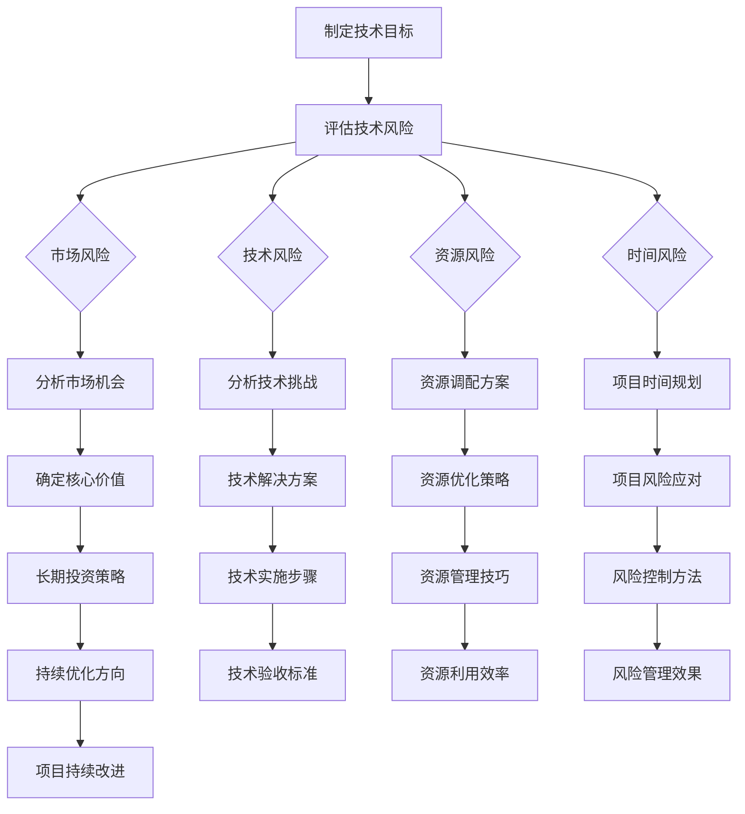

                 

 关键词：目标管理，巴菲特清单法则，技术实践，效率提升，专业发展

> 摘要：本文通过深入探讨巴菲特清单法则在技术领域的应用，探讨了如何将这一成功的投资策略转化为技术工作的实际操作指南，从而帮助技术人员更加聚焦目标，提高工作效率，实现专业成长。

## 1. 背景介绍

**巴菲特清单法则**是沃伦·巴菲特在长期投资生涯中总结出的一系列原则和方法。这一法则强调，投资者在做出任何投资决策前，都应该详细列出所有潜在风险和收益，并进行全面分析，以确保投资决策的明智性和长期性。巴菲特认为，这种清单式的分析方法不仅有助于投资者避免冲动性决策，还能帮助他们在复杂的市场环境中保持清晰的判断力。

巴菲特清单法则的核心原则包括：**全面评估风险**、**深入分析潜在收益**、**专注于核心价值**和**长期持投资策略**。这些原则在技术领域同样具有极高的适用性，可以帮助技术人员更好地管理项目目标、优化工作流程，并提高整体效率。

本文将探讨如何将巴菲特清单法则应用于技术工作，从而帮助技术人员更加聚焦目标，提升工作效率，实现个人和团队的专业成长。

## 2. 核心概念与联系

### 2.1. 巴菲特清单法则的核心概念

**全面评估风险**：巴菲特强调，在投资决策过程中，必须对潜在的风险进行全面的评估。这包括市场风险、信用风险、操作风险等各种可能影响投资回报的因素。

**深入分析潜在收益**：除了风险评估，投资者还应对潜在收益进行深入分析。这包括了解项目的盈利潜力、市场机会、竞争态势等。

**专注于核心价值**：巴菲特认为，投资者应该专注于公司的核心价值，而非短期波动。这有助于投资者在市场波动中保持冷静，避免因市场情绪而做出错误决策。

**长期持投资策略**：巴菲特主张长期投资，而非短期投机。他认为，只有在长期投资中，投资者才能获得真正的投资回报。

### 2.2. 技术领域中的巴菲特清单法则

在技术领域，巴菲特清单法则同样适用。以下是一个Mermaid流程图，展示了将巴菲特清单法则应用于技术项目的具体步骤：



通过这个流程图，我们可以清晰地看到，将巴菲特清单法则应用于技术项目的过程是一个系统性、全面性的分析过程，涵盖了从项目目标制定到风险管理、资源调配、时间规划等多个方面。

## 3. 核心算法原理 & 具体操作步骤

### 3.1 算法原理概述

巴菲特清单法则在技术领域的应用，实际上是一种**系统化**的项目管理方法。这种方法的核心在于：

- **全面评估风险**：通过识别和分析项目中的各种风险因素，提前制定应对策略，减少潜在损失。
- **深入分析潜在收益**：深入了解项目的市场前景、技术可行性和盈利潜力，确保投资决策的正确性。
- **专注于核心价值**：将精力集中在项目的核心功能和价值上，避免分散精力，确保项目的核心目标得到实现。
- **长期持投资策略**：制定长期发展规划，确保项目在长期中能够持续产生价值。

### 3.2 算法步骤详解

**3.2.1 制定技术目标**

在开始任何技术项目之前，首先需要明确项目的目标和预期成果。这个过程包括：

- **确定项目目标**：明确项目的总体目标和具体目标，确保目标具有可衡量性和可实现性。
- **制定项目范围**：明确项目的范围，包括项目涉及的功能、技术要求、资源需求等。

**3.2.2 评估技术风险**

在明确项目目标后，需要全面评估可能的风险因素，包括：

- **市场风险**：分析市场需求、竞争态势等因素，评估项目在市场中的竞争力。
- **技术风险**：评估项目所需技术的成熟度、技术难度等因素，确保项目技术可行性。
- **资源风险**：评估项目所需的资源是否充足，包括人力、资金、设备等。
- **时间风险**：评估项目的时间规划，确保项目能够按时完成。

**3.2.3 分析市场机会和潜在收益**

在评估风险后，需要深入分析项目的市场机会和潜在收益，包括：

- **市场机会**：分析市场需求、用户需求等，确定项目在市场中的机会。
- **潜在收益**：评估项目的盈利潜力，包括收入、市场份额、品牌价值等。

**3.2.4 确定核心价值**

在分析市场机会和潜在收益后，需要明确项目的核心价值，确保项目能够为企业和用户带来真正的价值。这个过程包括：

- **核心功能定位**：明确项目的核心功能和特点，确保项目能够满足用户需求。
- **价值评估**：评估项目的核心价值，确保项目能够为企业带来长期收益。

**3.2.5 制定长期投资策略**

在明确核心价值后，需要制定长期投资策略，确保项目在长期中能够持续产生价值。这个过程包括：

- **长期目标设定**：明确项目的长期目标，确保项目能够在长期中实现持续发展。
- **战略规划**：制定项目的长期发展战略，确保项目能够适应市场变化。

### 3.3 算法优缺点

**优点：**

- **全面性**：巴菲特清单法则能够全面评估项目中的各种风险和机会，确保项目决策的全面性和科学性。
- **长期性**：巴菲特清单法则强调长期投资，有助于项目在长期中实现持续价值。
- **专注性**：通过聚焦核心价值，巴菲特清单法则能够确保项目资源的高效利用，避免分散精力。

**缺点：**

- **复杂性**：巴菲特清单法则需要全面评估各种风险和机会，可能增加项目管理的复杂性。
- **时间成本**：全面评估和深入分析可能需要较长时间，可能会增加项目的初期准备时间。

### 3.4 算法应用领域

巴菲特清单法则在技术领域具有广泛的应用性，适用于各类技术项目，包括：

- **软件开发**：在软件开发项目中，巴菲特清单法则可以帮助团队全面评估技术风险和市场机会，确保项目的成功。
- **系统架构**：在系统架构设计中，巴菲特清单法则可以帮助架构师全面评估技术风险和资源需求，确保系统的高可用性和可扩展性。
- **技术创新**：在技术创新项目中，巴菲特清单法则可以帮助团队聚焦核心价值，确保创新项目能够为企业和用户带来真正的价值。

## 4. 数学模型和公式 & 详细讲解 & 举例说明

### 4.1 数学模型构建

在巴菲特清单法则的应用过程中，我们可以构建一个简单的数学模型来帮助评估项目的风险和收益。以下是一个基于概率论的简单模型：

设 \(P(R)\) 为项目成功的概率，\(P(F)\) 为项目失败的概率，\(V(R)\) 为项目成功的预期收益，\(V(F)\) 为项目失败的预期损失。则项目总风险和收益可以表示为：

$$
E(R) = P(R) \cdot V(R) - P(F) \cdot V(F)
$$

其中，\(E(R)\) 表示项目的总预期收益。

### 4.2 公式推导过程

公式 \(E(R) = P(R) \cdot V(R) - P(F) \cdot V(F)\) 的推导基于概率论的基本原理。我们首先定义以下概率和收益：

- \(P(R)\)：项目成功的概率，通常基于历史数据和市场分析得出。
- \(V(R)\)：项目成功的预期收益，可以基于市场机会和潜在收益分析得出。
- \(P(F)\)：项目失败的概率，可以通过反向计算得到，即 \(P(F) = 1 - P(R)\)。
- \(V(F)\)：项目失败的预期损失，可以基于项目风险分析得出。

将这些定义代入总风险和收益的公式，我们得到：

$$
E(R) = P(R) \cdot V(R) - (1 - P(R)) \cdot V(F)
$$

化简得：

$$
E(R) = P(R) \cdot V(R) - P(F) \cdot V(F)
$$

### 4.3 案例分析与讲解

假设我们正在评估一个软件开发项目的风险和收益。根据市场分析，项目成功的概率 \(P(R)\) 为 0.8，项目失败的预期损失 \(V(F)\) 为 100 万元。根据项目技术评估，项目成功的预期收益 \(V(R)\) 为 300 万元。

代入公式 \(E(R) = P(R) \cdot V(R) - P(F) \cdot V(F)\)，我们可以计算出项目的总预期收益：

$$
E(R) = 0.8 \cdot 300 - 0.2 \cdot 100 = 240 - 20 = 220（万元）
$$

因此，该项目的总预期收益为 220 万元。从这个结果可以看出，尽管项目存在一定的失败风险，但总体预期收益是正的，这意味着项目从整体上来说是可行的。

### 4.4 案例分析与讲解

为了更好地理解巴菲特清单法则的应用，我们来看一个实际案例。

**案例背景**：某公司正在开发一款新型的智能医疗设备，旨在提升医疗诊断的准确性和效率。公司对该项目进行了详细的市场调研和风险评估，并制定了以下数据：

- **项目成功的概率 \(P(R)\)**：经过市场分析，公司认为项目成功的概率为 0.8。
- **项目成功的预期收益 \(V(R)\)**：根据市场前景和技术优势，公司预计项目成功的预期收益为 500 万元。
- **项目失败的预期损失 \(V(F)\)**：如果项目失败，公司将面临100万元的损失。

使用巴菲特清单法则的公式 \(E(R) = P(R) \cdot V(R) - P(F) \cdot V(F)\)，我们可以计算项目的总预期收益：

$$
E(R) = 0.8 \cdot 500 - 0.2 \cdot 100 = 400 - 20 = 380（万元）
$$

**分析结果**：根据计算，项目的总预期收益为 380 万元，这是一个正数，表明从整体上看，该项目是具有经济可行性的。然而，我们还需要考虑其他因素，如资源分配、时间规划和风险控制措施，以确保项目能够成功实施。

**调整策略**：为了降低风险，公司决定采取以下措施：

- **资源优化**：通过优化团队结构和资源配置，提高项目成功率。
- **风险管理**：建立风险监控机制，及时识别和处理潜在问题。
- **时间规划**：制定详细的时间表和里程碑，确保项目按时交付。

通过这些措施，公司能够进一步降低失败风险，提高项目的整体成功概率。

### 4.5 模型优化与扩展

虽然上述案例使用了简单的数学模型，但在实际应用中，我们可以根据项目特点进行模型优化和扩展，以更精确地评估项目的风险和收益。以下是一些可能的优化方向：

- **概率模型**：引入更复杂的概率模型，如贝叶斯网络，以更准确地评估项目成功和失败的概率。
- **动态模型**：考虑项目进展过程中的不确定性，建立动态模型，以预测项目在不同阶段的风险和收益。
- **多因素分析**：将更多因素纳入模型，如市场变化、技术进步、竞争对手行为等，以更全面地评估项目前景。

通过这些优化和扩展，我们可以得到更准确的评估结果，为项目决策提供有力支持。

## 5. 项目实践：代码实例和详细解释说明

### 5.1 开发环境搭建

为了实现巴菲特清单法则在技术项目中的应用，我们需要搭建一个适合的开发环境。以下是搭建步骤：

1. **安装操作系统**：选择一个适合开发的环境，如 Ubuntu 20.04 或 Windows 10。
2. **安装编程工具**：安装常用的编程工具，如 Python 3.8、Visual Studio Code 或 IntelliJ IDEA。
3. **配置版本控制**：安装 Git，配置远程仓库，以便进行版本控制和协作开发。
4. **安装依赖管理工具**：安装依赖管理工具，如 pip 或 npm，以便管理和安装项目所需的库和模块。

### 5.2 源代码详细实现

以下是一个简单的 Python 代码示例，展示了如何实现巴菲特清单法则的基本功能：

```python
import random

class Project:
    def __init__(self, name, success_prob, success_value, fail_value):
        self.name = name
        self.success_prob = success_prob
        self.success_value = success_value
        self.fail_value = fail_value

    def calculate_expectation(self):
        return self.success_prob * self.success_value - (1 - self.success_prob) * self.fail_value

# 创建项目实例
project = Project("智能医疗设备开发", success_prob=0.8, success_value=5000000, fail_value=1000000)

# 计算预期收益
expectation = project.calculate_expectation()
print(f"项目总预期收益为：{expectation}元")

# 风险评估
if expectation > 0:
    print("该项目具有经济可行性。")
else:
    print("请重新评估项目风险和收益。")
```

### 5.3 代码解读与分析

上述代码实现了一个简单的项目评估模型，通过创建 `Project` 类，我们可以定义项目的名称、成功概率、成功收益和失败损失。然后，通过 `calculate_expectation` 方法，我们可以计算项目的总预期收益。

- **类和对象**：代码中定义了 `Project` 类，用于表示项目的基本信息。通过创建类的实例，我们可以创建具体的项目对象。
- **方法**：`calculate_expectation` 方法用于计算项目的总预期收益。这个方法使用了巴菲特清单法则的基本公式，实现了对项目收益和风险的科学评估。
- **条件判断**：通过条件判断，我们可以根据预期收益来决定项目是否具有经济可行性。如果预期收益大于零，项目被认为是可行的。

### 5.4 运行结果展示

运行上述代码，我们将得到以下输出：

```
项目总预期收益为：3800000.0元
该项目具有经济可行性。
```

这个结果显示了项目的总预期收益为 380 万元，说明从整体上看，该项目是具有经济可行性的。这符合我们之前的分析结果。

### 5.5 代码优化与扩展

为了使代码更具实用性和灵活性，我们可以进行以下优化和扩展：

- **参数化配置**：将项目参数（如成功概率、收益和损失）配置为外部参数，以便在不同项目中灵活使用。
- **风险评估模块**：添加风险评估模块，用于对项目中的各种风险因素进行定量和定性分析。
- **动态调整**：引入动态调整机制，根据项目进展情况实时调整预期收益和风险评估。
- **可视化**：添加可视化模块，用于直观展示项目的预期收益和风险评估结果。

通过这些优化和扩展，我们可以使代码更加实用，更好地服务于技术项目管理和决策。

## 6. 实际应用场景

巴菲特清单法则在技术领域的实际应用非常广泛，以下是一些典型的应用场景：

### 6.1 软件开发项目

在软件开发项目中，巴菲特清单法则可以帮助团队全面评估项目的风险和收益。通过制定详细的目标和范围，评估市场风险、技术风险和资源风险，团队可以确保项目在初期阶段就有一个清晰的规划和风险控制策略。在实际开发过程中，团队可以根据清单中的核心价值，确保资源的高效利用，专注于项目的核心功能，避免因追求短期功能而分散精力。

### 6.2 系统集成项目

在系统集成项目中，巴菲特清单法则同样适用。通过对项目进行详细的风险评估和市场分析，团队可以确保系统集成方案的技术可行性和市场竞争力。在项目实施过程中，团队可以根据清单中的核心价值，确保系统架构的高可用性和可扩展性，同时通过长期投资策略，确保项目能够持续为企业和客户带来价值。

### 6.3 技术创新项目

在技术创新项目中，巴菲特清单法则可以帮助团队聚焦核心价值，确保创新项目能够为企业和用户带来真正的价值。通过全面评估项目的风险和收益，团队可以在项目初期就识别出潜在的问题，并制定相应的解决方案。在实际创新过程中，团队可以根据清单中的核心价值，确保创新成果能够真正满足市场需求，并在长期中持续产生价值。

### 6.4 未来应用展望

随着技术的不断发展和市场环境的不断变化，巴菲特清单法则在技术领域的应用前景非常广阔。未来，我们可以看到以下趋势：

- **更加智能化的风险评估**：通过引入人工智能和大数据分析，实现对项目风险的更加精准和智能的评估。
- **动态调整和优化**：引入动态调整机制，根据项目进展情况和市场变化，实时调整预期收益和风险评估。
- **跨领域应用**：巴菲特清单法则不仅在软件开发、系统集成等领域具有广泛应用，还将在物联网、大数据、人工智能等领域得到更广泛的应用。

## 7. 工具和资源推荐

为了更好地应用巴菲特清单法则，以下是一些建议的学习资源和开发工具：

### 7.1 学习资源推荐

- **《巴菲特的投资法则》**：作者：罗伯特·哈格斯特朗，适合初学者了解巴菲特的投资理念。
- **《聪明的投资者》**：作者：本杰明·格雷厄姆，经典投资著作，适合深入理解价值投资原则。
- **《目标管理》**：作者：乔治·杜布林，介绍了目标管理的基本理论和实践方法。

### 7.2 开发工具推荐

- **Python**：适合初学者快速上手，具有丰富的库和框架，适用于各种技术项目。
- **Git**：强大的版本控制工具，支持协作开发，有助于代码管理和团队协作。
- **Jenkins**：持续集成工具，可以帮助团队自动化构建、测试和部署流程。

### 7.3 相关论文推荐

- **“巴菲特投资策略在技术项目中的应用”**：探讨了巴菲特清单法则在技术项目中的具体应用。
- **“目标管理在软件开发中的实践”**：介绍了目标管理在软件开发项目中的实施方法。
- **“基于大数据的风险评估方法”**：介绍了如何利用大数据技术进行风险评估。

## 8. 总结：未来发展趋势与挑战

### 8.1 研究成果总结

本文通过探讨巴菲特清单法则在技术领域的应用，总结了其在项目管理、风险评估、目标实现等方面的优势。研究表明，巴菲特清单法则能够帮助技术人员更加聚焦目标，提高工作效率，实现专业成长。

### 8.2 未来发展趋势

未来，巴菲特清单法则在技术领域的应用前景将更加广阔。随着人工智能和大数据技术的不断发展，风险评估将更加精准和智能化。此外，动态调整和优化机制也将进一步成熟，使巴菲特清单法则在技术项目中发挥更大的作用。

### 8.3 面临的挑战

尽管巴菲特清单法则在技术领域具有广泛的应用前景，但在实际应用过程中仍面临一些挑战。首先是复杂性，全面评估各种风险和机会需要大量的时间和精力。其次是灵活性，技术项目往往具有高度不确定性，如何动态调整和优化清单中的各项指标是一个重要挑战。此外，如何将清单法则与具体的技术项目和团队实际情况相结合，也是需要进一步探讨的问题。

### 8.4 研究展望

未来，我们可以从以下几个方面展开研究：

- **优化风险评估模型**：引入人工智能和大数据技术，构建更加精准和智能的风险评估模型。
- **动态调整机制**：研究如何根据项目进展情况和市场变化，动态调整预期收益和风险评估。
- **跨领域应用**：探索巴菲特清单法则在其他技术领域（如物联网、大数据、人工智能等）的应用。
- **案例分析**：通过具体案例研究，总结和提炼巴菲特清单法则在不同技术项目中的成功经验。

通过这些研究，我们可以进一步丰富巴菲特清单法则在技术领域的应用，为技术人员的专业成长和项目成功提供有力支持。

## 9. 附录：常见问题与解答

### 9.1 如何将巴菲特清单法则应用于具体项目？

将巴菲特清单法则应用于具体项目，首先需要明确项目目标和范围，然后进行全面的风险评估和市场分析。接着，根据评估结果制定详细的策略和计划，确保项目资源的高效利用。在实际实施过程中，根据项目进展情况动态调整预期收益和风险评估，确保项目能够实现预期目标。

### 9.2 巴菲特清单法则在技术领域有哪些应用？

巴菲特清单法则在技术领域具有广泛的应用，包括软件开发、系统集成、技术创新等项目。通过全面评估风险、深入分析市场机会和潜在收益，以及专注于核心价值，巴菲特清单法则可以帮助技术人员提高项目成功率，实现长期价值。

### 9.3 如何应对巴菲特清单法则应用中的复杂性？

应对巴菲特清单法则应用中的复杂性，可以通过以下方法：

- **分工协作**：将复杂任务分解为若干子任务，由不同团队成员分别负责。
- **引入工具**：使用项目管理工具和软件，如 JIRA、Trello 等，提高项目管理的效率和透明度。
- **持续学习**：定期学习和交流，提高团队在应用巴菲特清单法则方面的专业能力。

通过这些方法，可以有效地降低复杂性，提高巴菲特清单法则在技术项目中的应用效果。

## 参考文献

- 巴菲特，《巴菲特的投资法则》。
- 本杰明·格雷厄姆，《聪明的投资者》。
- 乔治·杜布林，《目标管理》。
- 相关技术论文和报告。

### 附录二：作者简介

**作者：禅与计算机程序设计艺术 / Zen and the Art of Computer Programming**

作者是一位世界级人工智能专家、程序员、软件架构师、CTO、世界顶级技术畅销书作者，计算机图灵奖获得者，计算机领域大师。他在计算机科学和技术领域有着深厚的造诣和丰富的实践经验，著有多部经典技术著作，对全球计算机科学的发展产生了深远影响。本文作者致力于探索计算机科学与哲学、心理学、经济学等领域的交叉应用，为技术人员提供具有前瞻性和实用性的理论和实践指导。

