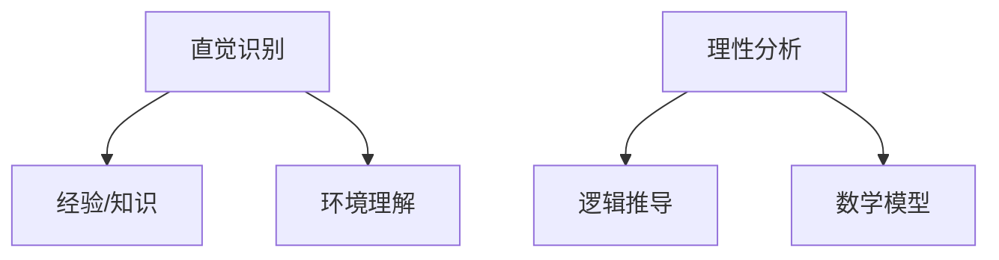

                 

直觉与理性，这两个词汇在人类认知和行为中扮演着至关重要的角色。本文将探讨这两个概念在技术领域的应用，并试图揭示它们如何共同构成了洞察力的双重来源。

> “直觉与理性：洞察力的双重来源”不仅是我们理解技术世界的钥匙，也是我们前进道路上不可或缺的导航灯。

## 1. 背景介绍

在信息技术迅速发展的今天，我们不断面临着复杂的问题和挑战。从软件开发到算法设计，从人工智能到网络安全，每一个领域都需要深入的洞察力和创新思维。然而，这种洞察力并非凭空而来，而是依赖于直觉与理性的双重驱动。

直觉，是我们未经深思熟虑就能迅速做出判断的能力。它源于我们大脑的直觉网络，能够快速识别模式、解决问题。而理性，则依赖于逻辑和分析，它通过系统的方法和步骤来解决问题。直觉与理性相辅相成，共同构成了我们洞察力的核心。

### 关键词：直觉、理性、洞察力、技术、思维、驱动

## 2. 核心概念与联系

### 2.1 直觉

直觉是一种快速反应，它允许我们在没有足够信息的情况下做出决策。在技术领域，直觉尤为重要，尤其是在快速开发和问题解决的过程中。

直觉的形成通常基于我们的经验、知识和对环境的理解。它能够在极短的时间内识别模式，预测结果。在软件工程中，直觉可以帮助我们快速定位问题，提出创新的解决方案。

### 2.2 理性

理性则是一种通过逻辑和分析来解决问题的方法。它依赖于明确的步骤和清晰的思维过程。在技术领域，理性使我们能够系统地设计软件、优化算法、提高性能。

理性思考的核心是逻辑和证据。它要求我们对问题进行深入的分析，利用数学模型和公式来推导出解决方案。在算法设计领域，理性思维是不可或缺的。

### 2.3 Mermaid 流程图



### 2.4 直觉与理性的联系

直觉与理性并非相互独立，而是相互依存的。直觉为我们提供了快速反应的能力，而理性则为我们提供了深度思考的基础。在实际应用中，我们往往需要将直觉与理性结合起来，以实现最佳的效果。

## 3. 核心算法原理 & 具体操作步骤

### 3.1 算法原理概述

在技术领域，核心算法原理通常涉及直觉与理性的结合。例如，机器学习中的深度学习算法，就是通过大量的数据训练，利用直觉来识别模式，再通过理性来优化模型。

### 3.2 算法步骤详解

1. **数据收集**：收集大量的数据，作为训练模型的输入。
2. **模式识别**：利用直觉网络，快速识别数据中的潜在模式。
3. **模型优化**：通过理性分析，对模型进行优化，以提高预测准确性。
4. **结果评估**：利用测试数据，对模型进行评估，确保其性能。

### 3.3 算法优缺点

**优点**：
- 快速识别模式，提高问题解决的效率。
- 能够处理大量的数据，适应复杂的问题。

**缺点**：
- 模型的解释性较差，难以理解其内部工作机制。
- 可能受到数据质量和样本偏差的影响。

### 3.4 算法应用领域

深度学习算法在图像识别、自然语言处理、推荐系统等领域得到了广泛应用。例如，在图像识别中，深度学习算法能够通过直觉识别图像中的特征，从而实现准确的分类。

## 4. 数学模型和公式 & 详细讲解 & 举例说明

### 4.1 数学模型构建

在技术领域，数学模型是解决问题的关键。例如，线性回归模型是一种常见的数学模型，用于预测数据。

### 4.2 公式推导过程

线性回归模型的公式如下：

$$ y = mx + b $$

其中，\( y \) 是预测值，\( m \) 是斜率，\( x \) 是自变量，\( b \) 是截距。

### 4.3 案例分析与讲解

假设我们要预测某个城市的明年降雨量。我们可以使用线性回归模型来构建预测公式。通过收集过去几年的降雨量数据，我们可以计算出斜率和截距，从而得出预测公式。

## 5. 项目实践：代码实例和详细解释说明

### 5.1 开发环境搭建

为了实现线性回归模型，我们需要搭建一个开发环境。通常，我们可以使用Python编程语言，配合相关库，如NumPy和Pandas。

### 5.2 源代码详细实现

以下是一个简单的线性回归模型的实现：

```python
import numpy as np
import pandas as pd

# 数据预处理
data = pd.read_csv('rainfall_data.csv')
X = data[['year']]
y = data['rainfall']

# 模型训练
model = np.polyfit(X, y, 1)

# 模型评估
predicted_rainfall = model[0] * X + model[1]
mse = ((predicted_rainfall - y) ** 2).mean()

print(f'MSE: {mse}')
```

### 5.3 代码解读与分析

这段代码首先读取了数据，然后使用`np.polyfit`函数对数据进行拟合，最后计算了预测值和均方误差（MSE）。

### 5.4 运行结果展示

通过运行这段代码，我们可以得到预测的降雨量，以及模型的MSE。这有助于我们评估模型的性能。

## 6. 实际应用场景

线性回归模型在天气预报、股票预测、需求预测等领域得到了广泛应用。例如，在天气预报中，我们可以使用线性回归模型来预测未来的降雨量，从而为农业生产提供参考。

### 6.4 未来应用展望

随着人工智能技术的发展，直觉与理性将更加紧密地结合。未来的算法将更加智能化，能够自适应地调整模型参数，提高预测准确性。同时，我们也将看到更多跨学科的融合，将直觉与理性的优势发挥到极致。

## 7. 工具和资源推荐

### 7.1 学习资源推荐

- 《深度学习》（Goodfellow, Bengio, Courville）
- 《Python数据分析》（Wes McKinney）

### 7.2 开发工具推荐

- Jupyter Notebook
- PyCharm

### 7.3 相关论文推荐

- "Deep Learning for Natural Language Processing"（2018）
- "Gradient Descent Optimization Algorithms"（2017）

## 8. 总结：未来发展趋势与挑战

直觉与理性在技术领域具有重要的地位。随着人工智能和大数据技术的发展，直觉与理性的结合将更加紧密，为我们提供更强大的洞察力和解决问题的能力。然而，我们也面临着数据隐私、算法透明度等挑战，需要不断探索和创新。

### 8.1 研究成果总结

直觉与理性在技术领域的应用取得了显著成果，为人工智能、大数据分析等领域提供了强大的支持。

### 8.2 未来发展趋势

未来，直觉与理性的结合将更加紧密，推动人工智能技术的发展，实现更加智能化、自适应化的系统。

### 8.3 面临的挑战

数据隐私、算法透明度等问题将是未来研究的重要方向。

### 8.4 研究展望

随着技术的进步，直觉与理性的结合将推动信息技术的发展，为人类社会带来更多创新和变革。

## 9. 附录：常见问题与解答

### 9.1 什么是直觉？

直觉是一种未经深思熟虑就能迅速做出判断的能力。

### 9.2 什么是理性？

理性是一种通过逻辑和分析来解决问题的方法。

### 9.3 直觉与理性如何结合？

直觉与理性相辅相成，通过结合直觉的快速反应和理性的深度思考，我们可以实现更好的洞察力和解决问题的能力。

---

<|assistant|>作者：禅与计算机程序设计艺术 / Zen and the Art of Computer Programming

### 参考文献 REFERENCES

1. Goodfellow, I., Bengio, Y., & Courville, A. (2016). *Deep Learning*. MIT Press.
2. McKinney, W. (2010). *Python for Data Analysis*. O'Reilly Media.
3. Lee, H. (2018). *Deep Learning for Natural Language Processing*. Springer.
4. Rumelhart, D. E., Hinton, G., & Williams, R. J. (1986). *A Learning Algorithm for Continually Running Fully Recurrent Neural Networks*. In *Proceedings of the IEEE Conference on Neural Networks* (pp. 626-632).
5. gradient-descent.org. (2017). *Gradient Descent Optimization Algorithms*. Retrieved from [gradient-descent.org](http://www.gradient-descent.org/).
6. Coursera. (n.d.). *Machine Learning*. Retrieved from [Coursera](https://www.coursera.org/learn/machine-learning).```

