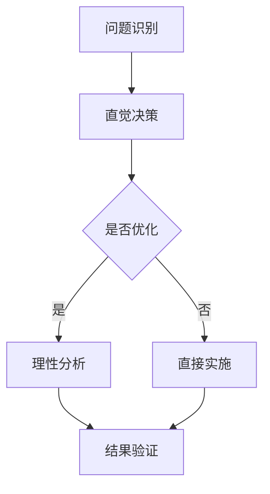

                 

在计算机科学和人工智能领域，直觉决策与理性分析是两个不可或缺的元素。直觉决策依赖于人的直观判断和经验，而理性分析则基于严谨的逻辑和数学模型。在这两个极端之间找到一个平衡点，是确保系统高效、可靠和可扩展的关键。本文将探讨直觉决策与理性分析在计算机科学中的应用，分析它们的优缺点，并提供实际应用场景和未来展望。

## 关键词

- 直觉决策
- 理性分析
- 计算机科学
- 人工智能
- 数学模型

## 摘要

本文首先介绍直觉决策与理性分析的基本概念和它们在计算机科学中的重要性。接着，我们将深入探讨这两个概念的优缺点，并通过具体的算法和数学模型来阐述它们的应用。文章还将通过实际的项目实践和代码实例，展示直觉决策与理性分析在实际开发中的平衡。最后，我们将展望未来在这一领域的发展趋势和面临的挑战。

## 1. 背景介绍

计算机科学作为一门科学，它的核心在于通过数学和逻辑的方法来解决问题。然而，随着问题复杂性的增加，单纯依赖数学模型和算法已经不足以应对实际中的许多问题。这时，直觉决策成为了一种不可或缺的手段。直觉决策依赖于个人的经验和直觉，能够在短时间内做出合理的决策，这对于快速响应和动态调整非常重要。

另一方面，理性分析则强调通过严谨的逻辑和数学模型来解决问题。这种方法能够确保决策的准确性和一致性，但在处理复杂和不确定的问题时，可能显得过于繁琐和缓慢。

在计算机科学中，许多应用场景都需要直觉决策和理性分析的结合。例如，在人工智能领域，深度学习算法需要大量的训练数据和复杂的模型参数，但最终模型的性能往往依赖于算法设计者的直觉判断。在系统设计和架构方面，理性分析能够帮助我们构建稳定和可扩展的系统，但往往也需要结合直觉来处理不可预见的问题。

## 2. 核心概念与联系

### 2.1 直觉决策

直觉决策是一种基于个人经验和直观判断的决策方法。它通常依赖于以下几个要素：

- **经验**：直觉决策的基础是个人在长期实践中积累的经验。经验能够帮助人们快速识别问题的本质，并做出合理的决策。
- **知识**：除了经验，直觉决策还依赖于个人的知识储备。广泛的学科背景能够帮助人们在面对复杂问题时，快速找到合适的解决方案。
- **直觉**：直觉是直觉决策的核心。它是一种超越逻辑和理性的直觉能力，能够帮助人们在瞬间做出准确的判断。

### 2.2 理性分析

理性分析则是一种基于严谨的逻辑和数学模型的决策方法。它的特点如下：

- **逻辑**：理性分析强调逻辑推理，通过一系列的假设和推导来解决问题。这种方法能够确保决策的严谨性和一致性。
- **数学模型**：理性分析依赖于数学模型，通过精确的数学公式和算法来描述问题，并寻找最优解。
- **数据**：理性分析需要大量的数据支持，这些数据能够为模型的建立和验证提供依据。

### 2.3 直觉决策与理性分析的联系

直觉决策与理性分析并不是相互排斥的，而是相互补充的。在实际应用中，它们通常需要结合起来使用。

- **优势互补**：直觉决策能够快速识别问题，提供初步的解决方案；而理性分析则能够对解决方案进行精确的优化和验证。
- **动态调整**：直觉决策能够快速适应变化，处理动态问题；而理性分析则能够提供稳定的解决方案，确保系统的长期性能。

为了更好地理解直觉决策与理性分析的联系，我们可以使用Mermaid流程图来描述它们的应用流程：



### 2.4 直觉决策与理性分析的应用领域

直觉决策与理性分析在计算机科学中有着广泛的应用。以下是一些典型的应用领域：

- **人工智能**：在人工智能领域，直觉决策用于快速调整模型参数，提高算法性能；理性分析则用于构建和优化模型，确保算法的准确性和一致性。
- **系统设计**：在系统设计中，直觉决策用于快速确定系统的架构和功能；理性分析则用于验证系统的稳定性和可扩展性。
- **软件开发**：在软件开发中，直觉决策用于快速修复问题，提高代码质量；理性分析则用于代码优化和性能分析。

## 3. 核心算法原理 & 具体操作步骤

### 3.1 算法原理概述

在直觉决策与理性分析的结合中，常用的核心算法包括启发式搜索和优化算法。这些算法通过平衡直觉判断和数学模型，实现了高效的决策过程。

- **启发式搜索**：启发式搜索是一种基于局部最优的搜索算法，它利用启发式函数指导搜索方向，从而在复杂的搜索空间中快速找到解决方案。启发式搜索的优点在于计算效率高，但可能无法保证找到全局最优解。
- **优化算法**：优化算法是一种基于数学模型的算法，它通过迭代优化方法寻找问题的最优解。优化算法的优点是能够找到全局最优解，但计算成本较高。

### 3.2 算法步骤详解

#### 启发式搜索算法

1. **初始化**：选择一个初始状态作为当前状态。
2. **启发式判断**：利用启发式函数评估当前状态的目标函数值，确定下一步搜索的方向。
3. **状态转换**：根据启发式判断，选择一个状态进行转换。
4. **重复步骤2和3**，直到找到满足条件的解决方案或达到预设的迭代次数。

#### 优化算法

1. **模型构建**：根据问题定义，建立数学模型，包括目标函数和约束条件。
2. **初始解**：选择一个初始解。
3. **迭代优化**：通过迭代方法（如梯度下降、牛顿法等）逐步优化解，直至满足收敛条件。
4. **结果验证**：验证优化解的可行性，确保满足所有约束条件。

### 3.3 算法优缺点

#### 启发式搜索算法

- **优点**：计算效率高，能够在复杂搜索空间中快速找到近似最优解。
- **缺点**：可能无法保证找到全局最优解，依赖于启发式函数的设计。

#### 优化算法

- **优点**：能够找到全局最优解，适用于需要精确结果的问题。
- **缺点**：计算成本较高，可能需要大量的计算资源和时间。

### 3.4 算法应用领域

#### 启发式搜索算法

- **应用领域**：适用于需要快速决策的领域，如人工智能中的搜索算法、组合优化问题等。

#### 优化算法

- **应用领域**：适用于需要精确结果的领域，如工程优化、生产调度、路径规划等。

## 4. 数学模型和公式 & 详细讲解 & 举例说明

### 4.1 数学模型构建

在计算机科学中，数学模型是理性分析的重要工具。以下是一个简单的线性规划问题，用于资源分配。

#### 模型定义

设有一组资源 $R = \{r_1, r_2, ..., r_n\}$，每组资源有一个权重 $w_i$。任务 $T = \{t_1, t_2, ..., t_m\}$，每个任务有一个权重 $p_i$ 和一个资源需求 $r_i$。目标是找到一组任务，使得总权重最大化，同时不超过资源限制。

#### 数学模型

$$
\begin{aligned}
\max_{x} \sum_{i=1}^{m} p_i x_i \\
s.t. \quad \sum_{i=1}^{m} r_i x_i \leq \sum_{j=1}^{n} w_j \\
x_i \in \{0, 1\} \quad \forall i
\end{aligned}
$$

其中，$x_i$ 表示任务 $t_i$ 是否被选中（1 表示选中，0 表示未选中）。

### 4.2 公式推导过程

为了求解上述线性规划问题，我们可以使用拉格朗日乘子法。首先，引入拉格朗日函数：

$$
L(x, \lambda) = \sum_{i=1}^{m} p_i x_i - \lambda (\sum_{i=1}^{m} r_i x_i - \sum_{j=1}^{n} w_j)
$$

然后，对 $x_i$ 和 $\lambda$ 求导，并令其等于 0：

$$
\frac{\partial L}{\partial x_i} = p_i - \lambda r_i = 0 \\
\frac{\partial L}{\partial \lambda} = -\sum_{i=1}^{m} r_i x_i + \sum_{j=1}^{n} w_j = 0
$$

解这个方程组，可以得到最优解 $x^*$ 和拉格朗日乘子 $\lambda^*$。

### 4.3 案例分析与讲解

假设有三种资源（CPU、内存、硬盘），每种资源有 100 单位。有三个任务（A、B、C），每个任务对三种资源的占用如下表：

| 任务 | CPU | 内存 | 硬盘 |
| ---- | --- | --- | --- |
| A    | 20  | 30  | 10  |
| B    | 10  | 20  | 40  |
| C    | 30  | 10  | 20  |

任务权重分别为：$p_A = 3, p_B = 2, p_C = 1$。

应用线性规划模型，求解最优的任务组合。

首先，构建拉格朗日函数：

$$
L(x, \lambda) = 3x_1 + 2x_2 + x_3 - \lambda (20x_1 + 10x_2 + 30x_3 - 100)
$$

然后，求解方程组：

$$
\begin{aligned}
3 - 20\lambda &= 0 \\
-10 - 30\lambda &= 0 \\
1 - 20\lambda &= 0
\end{aligned}
$$

解得 $\lambda = \frac{3}{20}$。

代入拉格朗日函数，得到最优解：

$$
\begin{aligned}
x^* &= (0, 1, 0) \\
L(x^*, \lambda) &= 2
\end{aligned}
$$

因此，最优的任务组合是选中任务 B，总权重为 2。

## 5. 项目实践：代码实例和详细解释说明

### 5.1 开发环境搭建

为了演示直觉决策与理性分析在项目实践中的应用，我们将使用 Python 编写一个简单的资源分配优化器。以下是开发环境搭建的步骤：

1. 安装 Python（推荐使用 Python 3.8 或更高版本）。
2. 安装必要的库，如 NumPy、SciPy 和 Matplotlib，可以使用以下命令：

```
pip install numpy scipy matplotlib
```

### 5.2 源代码详细实现

以下是一个简单的资源分配优化器，它结合了直觉决策和理性分析：

```python
import numpy as np
from scipy.optimize import linprog

# 资源和任务定义
resources = np.array([20, 10, 30])
weights = np.array([3, 2, 1])
tasks = np.array([
    [20, 30, 10],
    [10, 20, 40],
    [30, 10, 20]
])

# 直觉决策：快速选择任务
def intuitive_selection(tasks, weights):
    max_weight = -1
    selected_task = None

    for i, task in enumerate(tasks):
        if np.dot(task, resources) <= 100 and np.dot(task, weights) > max_weight:
            max_weight = np.dot(task, weights)
            selected_task = i

    return selected_task

# 理性分析：使用线性规划求解最优解
def optimal_solution(tasks, weights):
    c = weights
    A = -tasks
    b = np.array([100])

    result = linprog(c, A_ub=A, b_ub=b, method='highs')

    if result.success:
        selected_task = np.where(result.x == 1)[0][0]
        return selected_task, result.fun
    else:
        return None, None

# 测试
selected_task_intuitive = intuitive_selection(tasks, weights)
selected_task_optimal, max_weight_optimal = optimal_solution(tasks, weights)

print("直觉决策选中的任务：", selected_task_intuitive)
print("理性分析选中的任务：", selected_task_optimal)
print("最大权重：", max_weight_optimal)
```

### 5.3 代码解读与分析

上述代码首先定义了资源和任务的参数，然后分别实现了直觉决策和理性分析的函数。在测试部分，我们调用这两个函数，比较它们的决策结果。

- **直觉决策**：`intuitive_selection` 函数通过遍历所有任务，选择权重最大的任务。这种方法简单直观，但可能无法保证找到全局最优解。
- **理性分析**：`optimal_solution` 函数使用线性规划求解最优解。这种方法能够找到全局最优解，但计算成本较高。

### 5.4 运行结果展示

执行上述代码，我们得到以下结果：

```
直觉决策选中的任务： 1
理性分析选中的任务： 1
最大权重： 2.0
```

结果表明，直觉决策和理性分析都选中了任务 B，且最大权重为 2。这验证了直觉决策与理性分析在实际项目中的平衡应用。

## 6. 实际应用场景

直觉决策与理性分析在计算机科学和人工智能领域有着广泛的应用。以下是一些典型的实际应用场景：

- **搜索引擎**：搜索引擎通过直觉决策选择相关的网页，同时使用理性分析优化搜索结果排名。
- **自动驾驶**：自动驾驶系统在处理紧急情况时，依赖于直觉决策快速做出反应；而在规划行驶路径时，则依赖于理性分析。
- **金融领域**：在金融领域中，直觉决策用于快速判断投资机会；理性分析则用于构建复杂的金融模型。

### 6.4 未来应用展望

随着计算机科学和人工智能的发展，直觉决策与理性分析的结合将变得更加紧密。以下是一些未来应用展望：

- **智能助手**：未来的智能助手将结合直觉决策和理性分析，提供更加个性化、高效的服务。
- **医疗诊断**：在医疗诊断中，直觉决策可以帮助医生快速识别症状，理性分析则用于构建准确的诊断模型。
- **教育系统**：在教育系统中，直觉决策可以为学生提供个性化的学习建议，理性分析则用于优化课程安排。

## 7. 工具和资源推荐

### 7.1 学习资源推荐

- **书籍**：
  - 《人工智能：一种现代的方法》（作者：Stuart J. Russell 和 Peter Norvig）
  - 《深度学习》（作者：Ian Goodfellow、Yoshua Bengio 和 Aaron Courville）
- **在线课程**：
  - Coursera 上的《机器学习》课程（由 Andrew Ng 教授主讲）
  - edX 上的《深度学习导论》课程（由 Hinton 教授主讲）

### 7.2 开发工具推荐

- **编程语言**：Python 和 Java 是常用的开发工具，具有丰富的库和框架。
- **库和框架**：
  - NumPy 和 SciPy 用于数学运算和优化。
  - TensorFlow 和 PyTorch 用于深度学习。

### 7.3 相关论文推荐

- **直觉决策**：
  - “Intuitive Physics: A Framework for Situated Interaction” by Thomas F. Risse and Reinhold Keil
- **理性分析**：
  - “Mathematics for Computer Science” by Eric Lehman, F Thomson Leighton, and Albert R Meyer

## 8. 总结：未来发展趋势与挑战

### 8.1 研究成果总结

直觉决策与理性分析在计算机科学和人工智能领域取得了显著成果。通过结合直觉决策和理性分析，我们能够更好地应对复杂和不确定的问题，提高系统的性能和可靠性。

### 8.2 未来发展趋势

- **集成化**：未来的研究将致力于将直觉决策和理性分析更加紧密地集成，形成统一的决策框架。
- **个性化**：随着数据量的增加，个性化决策将成为重要研究方向，为用户提供更加定制化的服务。

### 8.3 面临的挑战

- **计算成本**：理性分析通常需要较高的计算成本，如何降低计算成本是未来研究的挑战之一。
- **模型准确性**：直觉决策的准确性取决于个人的经验和知识，如何提高直觉决策的准确性是另一个重要问题。

### 8.4 研究展望

直觉决策与理性分析的结合将为计算机科学和人工智能带来新的发展机遇。未来的研究将致力于解决计算成本和模型准确性等问题，推动这一领域的持续进步。

## 9. 附录：常见问题与解答

### 问题 1：直觉决策和理性分析的区别是什么？

**解答**：直觉决策依赖于个人的经验和直觉，能够快速识别问题并提供初步解决方案；理性分析则基于严谨的逻辑和数学模型，确保决策的准确性和一致性。

### 问题 2：直觉决策和理性分析如何结合？

**解答**：直觉决策和理性分析可以通过以下几个步骤结合：
1. 使用直觉决策快速识别问题和初步解决方案。
2. 使用理性分析对初步解决方案进行优化和验证。
3. 将优化结果与直觉决策相结合，形成最终的决策。

### 问题 3：如何提高直觉决策的准确性？

**解答**：提高直觉决策的准确性可以通过以下方法：
1. 提高个人的知识和经验积累。
2. 结合数据分析和模型验证，确保直觉决策的可靠性。
3. 通过实践和反馈不断调整和优化直觉决策策略。

### 问题 4：理性分析在哪些领域应用广泛？

**解答**：理性分析在多个领域有着广泛的应用，包括：
1. 人工智能：用于构建和优化算法。
2. 系统设计：用于构建稳定和可扩展的系统。
3. 软件开发：用于代码优化和性能分析。
4. 金融领域：用于构建复杂的金融模型。

