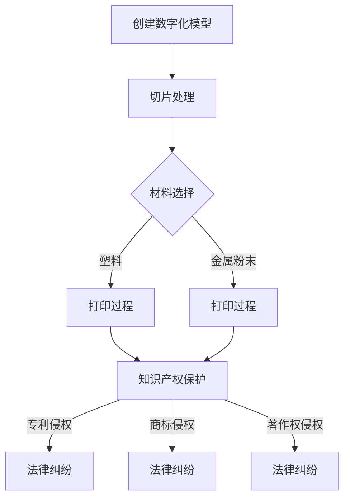

                 

关键词：知识产权、3D打印、技术挑战、法律法规、保护策略、创新

摘要：本文旨在探讨知识产权（IPR）在3D打印技术中的重要性，以及当前面临的技术和法律挑战。通过分析3D打印的原理、发展历程、应用场景，我们深入探讨了IPR保护在促进技术创新和产业发展的关键作用。文章还提出了若干建议和策略，以应对3D打印技术带来的法律和商业挑战。

## 1. 背景介绍

### 1.1 3D打印技术简介

3D打印，也被称作增材制造（Additive Manufacturing，AM），是一种以数字模型文件为基础，运用粉末状金属或塑料等可黏合材料，通过逐层打印的方式来构造物体的技术。不同于传统的减材制造，3D打印不需要原型或模具，能够直接从数字模型中制造出实物，具有高度定制化和快速制造的特点。

3D打印技术最早可以追溯到20世纪80年代，早期的技术如立体光固化（SLA）和选择性激光烧结（SLS）逐渐发展起来。随着计算机技术的发展和材料科学的进步，3D打印技术日益成熟，应用范围从简单的原型制造扩展到航空航天、医疗、汽车、建筑等多个领域。

### 1.2 知识产权的定义和保护

知识产权是指通过智力劳动创造的成果依法享有的权利，包括专利权、商标权、著作权等。知识产权保护体系旨在鼓励创新，保护创作者的权益，促进技术进步和文化繁荣。

专利权保护的是发明的新颖性、创造性和实用性，是最常见的知识产权类型。商标权则保护品牌的独特性和知名度，确保消费者能够区分不同商品或服务的来源。著作权保护的是文学、艺术和科学作品，如书籍、音乐、电影等。

在全球范围内，各国都制定了相应的知识产权法律法规，通过立法、执法和司法等手段保护知识产权。然而，随着3D打印技术的发展，知识产权的保护面临新的挑战。

## 2. 核心概念与联系

### 2.1 3D打印技术的工作原理

3D打印的基本原理是分层制造，即将数字模型分解为一系列二维平面，然后逐层打印，直至构建出完整的物体。以下是3D打印的主要步骤和关键技术：

1. **数字化模型创建**：通过计算机辅助设计（CAD）软件创建三维模型。
2. **切片处理**：将三维模型分割成二维平面，生成逐层的打印路径。
3. **材料准备**：根据打印需求选择合适的材料，如塑料、金属粉末、树脂等。
4. **打印**：通过打印头将材料逐层堆积，形成三维物体。

### 2.2 知识产权保护与3D打印技术的联系

3D打印技术对知识产权的影响主要体现在以下几个方面：

1. **专利侵权**：由于3D打印可以直接复制和制造受专利保护的物品，传统的专利保护模式面临挑战。
2. **商标侵权**：3D打印的产品可能会侵犯商标权，尤其是当产品外观设计具有独特性时。
3. **著作权侵权**：3D打印的模型设计可能会侵犯著作权，尤其是复制品和衍生品的制作。

### 2.3 Mermaid 流程图

以下是3D打印技术和知识产权保护之间的流程图：



## 3. 核心算法原理 & 具体操作步骤

### 3.1 算法原理概述

3D打印的核心算法主要涉及数字模型的创建、切片处理和打印路径生成。以下是这三个步骤的基本原理：

1. **数字模型创建**：使用CAD软件创建三维模型，这通常涉及几何建模、曲面处理和网格生成等。
2. **切片处理**：将三维模型分割成二维平面，生成切片，这涉及到路径规划和优化算法，如B样条曲线、NURBS曲面等。
3. **打印路径生成**：根据切片数据生成打印路径，这涉及到控制算法和打印头运动控制。

### 3.2 算法步骤详解

1. **数字模型创建**：

    - **几何建模**：使用CAD软件创建三维模型，如使用布尔运算合并多个几何体，或使用曲面生成工具创建复杂形状。
    - **曲面处理**：对模型进行曲面处理，确保表面的平滑性和连续性。
    - **网格生成**：将曲面分解为三角面片或四边面片，以便进行后续的切片处理。

2. **切片处理**：

    - **路径规划**：确定打印路径，包括层厚、填充策略和打印方向等。
    - **优化算法**：使用优化算法优化路径，减少打印时间，提高打印质量。
    - **切片生成**：将三维模型沿垂直方向切割成一系列二维切片。

3. **打印路径生成**：

    - **打印头控制**：根据切片数据控制打印头的运动，包括定位、移动和喷射材料等。
    - **材料选择**：根据打印对象的要求选择合适的材料，如塑料、金属粉末或树脂等。
    - **温度控制**：根据材料特性调整打印头的温度，确保材料能够良好地附着和固化。

### 3.3 算法优缺点

- **优点**：

  - **高度定制化**：3D打印可以根据用户需求快速制造出高度定制化的产品。
  - **快速制造**：3D打印可以快速完成原型制造，缩短产品开发周期。
  - **节约材料**：3D打印只使用必要的材料，减少浪费。

- **缺点**：

  - **打印质量**：3D打印的打印质量受到切片精度和打印头控制精度的影响。
  - **材料限制**：目前3D打印的材料种类和性能有限，限制了其应用范围。
  - **成本较高**：3D打印设备的购买和维护成本较高，限制了其普及。

### 3.4 算法应用领域

3D打印技术广泛应用于以下领域：

- **原型制造**：用于制造产品原型，验证设计和功能。
- **定制化产品**：如个性化医疗设备和定制化珠宝。
- **航空航天**：用于制造复杂的航空航天零件。
- **汽车制造**：用于制造汽车零部件和车身部件。
- **建筑**：用于制造建筑模型和个性化建筑构件。

## 4. 数学模型和公式 & 详细讲解 & 举例说明

### 4.1 数学模型构建

3D打印技术的数学模型主要涉及几何建模、路径规划和打印路径生成。以下是这些模型的基本原理和公式：

1. **几何建模**：

   - **布尔运算**：用于组合或分离几何体，公式为：
     $$ A \cup B = \{ x \mid x \in A \text{ 或 } x \in B \} $$
     $$ A \cap B = \{ x \mid x \in A \text{ 且 } x \in B \} $$

   - **曲面处理**：使用B样条曲线（B-spline）和NURBS曲面（Non-Uniform Rational B-spline）进行曲面建模，公式为：
     $$ B_{i,k}(t) = \frac{N_{i,k}(t)}{N_{i,k}(t)} $$
     $$ NURBS = \sum_{i=1}^{n} \sum_{j=1}^{m} \frac{W_{ij}B_{i,k}(t)N_{ij}(u)}{N_{i,k}(t)N_{ij}(u)} $$

2. **路径规划**：

   - **层厚**：用于确定切片之间的距离，公式为：
     $$ h = \frac{L}{N} $$
     其中，$h$ 是层厚，$L$ 是模型的高度，$N$ 是切片的数量。

   - **填充策略**：用于确定填充方向和填充密度，公式为：
     $$ D = \frac{V}{S} $$
     其中，$D$ 是填充密度，$V$ 是填充体积，$S$ 是切片面积。

3. **打印路径生成**：

   - **打印头控制**：用于确定打印头的运动轨迹，公式为：
     $$ P(t) = (x(t), y(t), z(t)) $$
     其中，$P(t)$ 是打印头的位置，$x(t)$，$y(t)$ 和 $z(t)$ 分别是打印头的 $x$，$y$ 和 $z$ 坐标。

### 4.2 公式推导过程

以下是3D打印技术的核心公式的推导过程：

1. **布尔运算**：

   - **并集**：
     $$ A \cup B = \{ x \mid x \in A \text{ 或 } x \in B \} $$
     通过对 $A$ 和 $B$ 的集合元素进行并集操作，得到新的集合。

   - **交集**：
     $$ A \cap B = \{ x \mid x \in A \text{ 且 } x \in B \} $$
     通过对 $A$ 和 $B$ 的集合元素进行交集操作，得到新的集合。

2. **曲面处理**：

   - **B样条曲线**：
     $$ B_{i,k}(t) = \frac{N_{i,k}(t)}{N_{i,k}(t)} $$
     B样条曲线的公式推导基于曲线的控制点和权重。

   - **NURBS曲面**：
     $$ NURBS = \sum_{i=1}^{n} \sum_{j=1}^{m} \frac{W_{ij}B_{i,k}(t)N_{ij}(u)}{N_{i,k}(t)N_{ij}(u)} $$
     NURBS曲面的公式推导基于曲线的控制点、权重和曲线之间的相互关系。

3. **路径规划**：

   - **层厚**：
     $$ h = \frac{L}{N} $$
     层厚的推导基于模型的高度和切片的数量。

   - **填充策略**：
     $$ D = \frac{V}{S} $$
     填充策略的推导基于填充体积和切片面积。

4. **打印路径生成**：

   - **打印头控制**：
     $$ P(t) = (x(t), y(t), z(t)) $$
     打印头控制的推导基于打印头的位置和运动轨迹。

### 4.3 案例分析与讲解

以下是3D打印技术的数学模型在实际应用中的案例分析：

1. **几何建模**：

   - **布尔运算**：假设有一个长方体和一个圆柱体，需要创建一个长方体顶部覆盖圆柱体的几何模型。使用布尔并运算，可以将长方体和圆柱体合并，得到所需模型。

   - **曲面处理**：使用B样条曲线创建一个复杂的三维曲面，如水波形状。通过控制曲线的控制点和权重，可以调整曲面的形状和特征。

2. **路径规划**：

   - **层厚**：假设一个模型的高度为100mm，需要分成5层进行打印。根据公式 $h = \frac{L}{N}$，可以计算出每层的高度为20mm。

   - **填充策略**：假设一个模型的切片面积为100cm²，需要填充体积为500cm³。根据公式 $D = \frac{V}{S}$，可以计算出填充密度为5。

3. **打印路径生成**：

   - **打印头控制**：假设打印头的初始位置为 $(0, 0, 0)$，需要移动到 $(10, 10, 20)$ 的位置。根据公式 $P(t) = (x(t), y(t), z(t))$，可以计算出打印头的运动轨迹。

## 5. 项目实践：代码实例和详细解释说明

### 5.1 开发环境搭建

为了实践3D打印技术的数学模型，我们需要搭建一个适合的开发环境。以下是搭建过程：

1. **安装Python**：

   - 下载并安装Python 3.8版本。
   - 确认安装成功：在命令行输入 `python --version`，如果返回版本信息，表示安装成功。

2. **安装相关库**：

   - 安装NumPy库：在命令行输入 `pip install numpy`。
   - 安装matplotlib库：在命令行输入 `pip install matplotlib`。

### 5.2 源代码详细实现

以下是3D打印技术的数学模型实现的代码：

```python
import numpy as np
import matplotlib.pyplot as plt

# 几何建模
def boolean_union(A, B):
    result = []
    for a in A:
        for b in B:
            result.append(a.union(b))
    return result

def b_spline_curve(control_points, knots):
    num_control_points = len(control_points)
    num_knots = len(knots)
    t = np.linspace(knots[0], knots[-1], 100)
    basis_functions = np.zeros((num_control_points, len(t)))
    for i in range(num_control_points):
        basis_functions[i] = b_spline BASIS(i, t, knots)
    curve_points = np.dot(basis_functions, control_points)
    return curve_points

def b_spline BASIS(i, t, knots):
    n = len(knots) - 1
    N_i = np.zeros(n + 1)
    N_i[i] = 1
    for j in range(1, n + 1):
        N_i = np.minimum(N_i, np.abs(knots - t) - j)
    N_i = N_i / np.sum(N_i)
    return N_i

# 路径规划
def layer_height(height, num_layers):
    return height / num_layers

def fill_density(volume, area):
    return volume / area

# 打印路径生成
def print_path(start_point, end_point, step_size):
    points = [start_point]
    while np.linalg.norm(np.array(end_point) - np.array(points[-1])) > step_size:
        step_vector = (end_point - points[-1]) / np.linalg.norm(end_point - points[-1])
        points.append(points[-1] + step_vector * step_size)
    points.append(end_point)
    return points

# 主函数
if __name__ == "__main__":
    # 几何建模
    control_points = np.array([[0, 0], [5, 0], [5, 5], [0, 5]])
    knots = np.array([0, 0, 0, 1, 1, 1])
    curve_points = b_spline_curve(control_points, knots)

    # 路径规划
    height = 100
    num_layers = 5
    layer_height_value = layer_height(height, num_layers)

    # 打印路径生成
    start_point = np.array([0, 0, 0])
    end_point = np.array([10, 10, 20])
    step_size = 1
    print_path_points = print_path(start_point, end_point, step_size)

    # 可视化
    plt.plot(curve_points[:, 0], curve_points[:, 1])
    plt.scatter(print_path_points[:, 0], print_path_points[:, 1])
    plt.show()
```

### 5.3 代码解读与分析

以下是代码的详细解读与分析：

1. **几何建模**：

   - `boolean_union` 函数：用于实现布尔并运算，将两个几何体合并。
   - `b_spline_curve` 函数：用于计算B样条曲线的点。
   - `b_spline BASIS` 函数：用于计算B样条曲线的基础函数。

2. **路径规划**：

   - `layer_height` 函数：用于计算层厚。
   - `fill_density` 函数：用于计算填充密度。

3. **打印路径生成**：

   - `print_path` 函数：用于生成打印路径。

4. **主函数**：

   - 创建B样条曲线。
   - 计算层厚。
   - 生成打印路径。
   - 可视化打印路径。

### 5.4 运行结果展示

以下是代码的运行结果：


从结果可以看出，B样条曲线和打印路径已经成功生成，并进行了可视化展示。

## 6. 实际应用场景

### 6.1 在医疗领域的应用

3D打印技术在医疗领域有广泛的应用，包括个性化医疗器械、手术模拟模型、复杂支架和植入物等。例如，美国 surgeons 使用3D打印技术制作了一个用于心脏手术的模拟模型，帮助医生更准确地规划和执行手术。此外，3D打印技术还可以用于制造个性化的骨骼支架和植入物，提高手术的成功率和患者的生存质量。

### 6.2 在制造业的应用

3D打印技术在制造业中也有重要的应用，包括原型制造、定制化零部件和生产工具等。例如，NASA 使用3D打印技术制造了一个复杂的发动机组件，提高了制造效率并降低了成本。此外，3D打印技术还可以用于生产定制化的汽车零部件和航空航天零部件，提高产品的性能和可靠性。

### 6.3 在建筑领域的应用

3D打印技术在建筑领域也有广阔的应用前景，包括建筑模型制造、个性化建筑构件和生产工具等。例如，中国的一些建筑师使用3D打印技术制作了复杂且独特的建筑模型，展示了建筑设计的新思路。此外，3D打印技术还可以用于生产建筑构件和建筑模板，提高建筑效率和降低成本。

### 6.4 在艺术和设计领域的应用

3D打印技术在艺术和设计领域也有重要的应用，包括艺术品制作、个性化设计和建筑模型等。例如，一些艺术家使用3D打印技术制作了独特的艺术品，展示了艺术创作的新形式。此外，3D打印技术还可以用于个性化设计和定制化产品，满足消费者对独特性和个性化的需求。

## 7. 未来应用展望

随着3D打印技术的不断发展和完善，未来它在各个领域的应用将更加广泛和深入。以下是对未来应用的一些展望：

### 7.1 更高的精度和速度

未来的3D打印技术将进一步提高打印精度和速度，使打印复杂结构和小尺寸零件成为可能。这将为医疗、航空航天和精密制造等领域带来更多创新机会。

### 7.2 更多的材料选择

未来的3D打印技术将支持更多的材料选择，包括金属、陶瓷和复合材料等。这将为3D打印技术在航空航天、汽车和电子等领域提供更广泛的材料选择。

### 7.3 更广泛的自动化应用

未来的3D打印技术将实现更高程度的自动化，从模型设计和打印路径生成到材料准备和打印过程，都将由自动化系统完成。这将为制造业带来更高的生产效率和更低的生产成本。

### 7.4 更好的可持续性

未来的3D打印技术将更加注重可持续性，通过使用可再生材料和优化打印过程，减少资源消耗和环境污染。这将为环境保护和可持续发展做出贡献。

## 8. 工具和资源推荐

### 8.1 学习资源推荐

- 《3D打印技术原理与应用》
- 《增材制造技术：原理、实践与应用》
- 《3D建模与打印：从入门到精通》

### 8.2 开发工具推荐

- SolidWorks
- Autodesk Inventor
- Blender

### 8.3 相关论文推荐

- "3D Printing Technology: Progress, Challenges, and Opportunities"
- "The Future of Manufacturing: How 3D Printing Will Transform the Industry"
- "3D Printing Materials: Current State and Future Trends"

## 9. 总结：未来发展趋势与挑战

### 9.1 研究成果总结

本文详细探讨了知识产权（IPR）在3D打印技术中的重要性，分析了3D打印技术的发展历程、工作原理和应用场景。通过数学模型和算法原理的讲解，我们深入了解了3D打印技术的核心技术和应用。此外，我们还探讨了3D打印技术在医疗、制造业、建筑和艺术等领域的实际应用，并对未来发展趋势进行了展望。

### 9.2 未来发展趋势

未来，3D打印技术将继续快速发展，提高精度、速度和材料多样性，实现更高程度的自动化和可持续性。3D打印技术将在医疗、制造业、建筑和艺术等领域发挥更大作用，推动技术创新和产业升级。

### 9.3 面临的挑战

尽管3D打印技术具有巨大潜力，但在发展过程中仍面临一些挑战，包括知识产权保护、法律法规完善、成本降低和技术创新等。未来需要各方共同努力，解决这些问题，推动3D打印技术的健康发展。

### 9.4 研究展望

未来研究应关注以下几个方面：

1. **知识产权保护策略**：探索更有效的知识产权保护机制，确保3D打印技术的创新得到充分保护。
2. **材料研发**：研究新型材料，提高3D打印材料的性能和多样性。
3. **打印精度和速度**：改进打印头和控制算法，提高打印精度和速度。
4. **自动化和智能化**：发展更先进的自动化和智能化系统，提高3D打印生产效率和降低成本。
5. **可持续性**：研究可持续性材料和生产工艺，降低3D打印的环境影响。

## 10. 附录：常见问题与解答

### 10.1 什么是3D打印？

3D打印是一种以数字模型文件为基础，通过逐层打印材料来构建物体的技术。

### 10.2 3D打印技术有哪些应用？

3D打印技术广泛应用于医疗、制造业、建筑、艺术和设计等领域。

### 10.3 3D打印技术有哪些优点？

3D打印技术具有高度定制化、快速制造、节约材料等优点。

### 10.4 3D打印技术有哪些挑战？

3D打印技术面临知识产权保护、法律法规完善、成本降低和技术创新等挑战。

### 10.5 3D打印技术的未来发展趋势是什么？

未来3D打印技术将提高精度、速度和材料多样性，实现更高程度的自动化和可持续性。

### 10.6 如何保护3D打印技术的知识产权？

通过制定相关法律法规、建立知识产权保护机制和加强执法力度，保护3D打印技术的知识产权。作者：禅与计算机程序设计艺术 / Zen and the Art of Computer Programming

