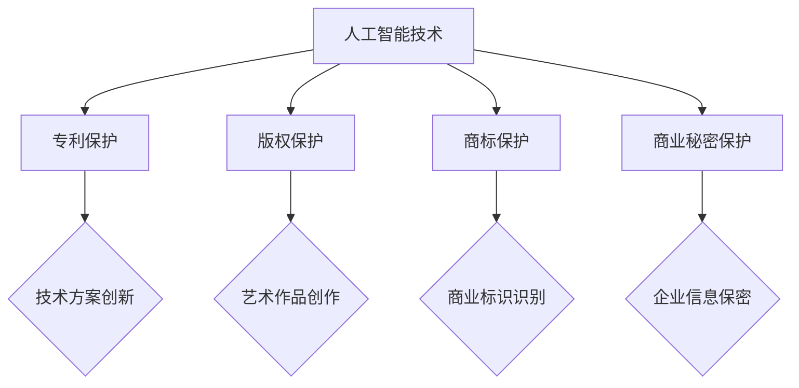

                 

在当今这个数字化时代，人工智能（AI）的发展迅猛，已经渗透到了社会的各个领域。然而，随着AI技术的不断进步，相关的知识产权法律挑战也日益显现。本文将探讨人工智能领域面临的知识产权问题，分析其法律框架及其对技术创新的影响，以及未来可能的发展方向。

## 关键词
人工智能、知识产权、法律挑战、技术保护、创新激励

## 摘要
本文首先介绍了人工智能技术的发展背景及其在各个领域的应用。然后，我们详细分析了人工智能领域中常见的知识产权问题，包括专利、版权、商标和商业秘密等。接着，探讨了当前知识产权法律体系对人工智能技术的保护现状和不足之处。最后，提出了未来应对人工智能知识产权挑战的策略和建议。

## 1. 背景介绍

### 人工智能技术的发展
人工智能（AI）是指通过计算机系统实现人类智能的过程，包括机器学习、深度学习、自然语言处理、计算机视觉等多个子领域。近年来，得益于计算能力的提升、大数据的积累和算法的进步，AI技术取得了显著的进展。自动驾驶、智能语音助手、医疗诊断、金融风控等应用场景不断涌现，AI已经成为了推动社会进步的重要力量。

### 人工智能的应用领域
人工智能的应用领域非常广泛，涵盖了制造业、医疗健康、金融服务、交通运输、教育等多个行业。在制造业中，AI技术用于生产线的自动化控制和质量检测；在医疗健康领域，AI可以帮助医生进行疾病诊断和个性化治疗；在金融服务中，AI被用于风险评估和欺诈检测；在交通运输领域，自动驾驶技术正在逐步实现商业化应用。

### 知识产权的重要性
知识产权是法律赋予创造者对其智力成果所享有的专有权利。在人工智能领域，知识产权不仅关乎技术创新的成果保护，还直接影响到企业的竞争力和市场地位。有效的知识产权保护能够激励技术创新，促进科技进步。

## 2. 核心概念与联系

### 知识产权的基本概念
知识产权包括专利、版权、商标和商业秘密等。专利是对发明创造的技术性保护，版权是对文学、艺术和科学作品等创造性成果的保护，商标是对商业标识的保护，商业秘密是对企业内部技术信息和经营信息等的保护。

### 人工智能与知识产权的关系
人工智能技术的创新性特点使其在知识产权保护方面面临诸多挑战。首先，人工智能产品的创造过程往往涉及复杂的算法和数据集，如何界定专利的保护范围成为了一个难题。其次，AI作品的版权问题也引发了广泛的讨论，特别是当人工智能生成的作品具有创造性时，版权归属如何确定。此外，人工智能技术的快速迭代也使得商业秘密的保护变得更加困难。

### Mermaid 流程图
以下是一个简化的Mermaid流程图，展示了人工智能与知识产权的关系：



### 关系分析
从图中可以看出，人工智能技术的发展与知识产权保护之间存在紧密的联系。每一种知识产权形式都针对不同的技术或创意成果，为人工智能的创新提供了多层次的保护。然而，由于人工智能技术的特殊性，传统的知识产权保护机制在某些方面显得力不从心，需要进一步的法律框架和政策支持。

## 3. 核心算法原理 & 具体操作步骤

### 3.1 算法原理概述

人工智能技术主要依赖于机器学习和深度学习算法。机器学习是一种从数据中自动学习规律的方法，通过构建模型来对未知数据进行预测或分类。深度学习则是机器学习的一个子领域，通过模拟人脑神经网络结构，对复杂的数据进行处理和模式识别。

### 3.2 算法步骤详解

#### 3.2.1 数据预处理
数据预处理是机器学习模型训练的第一步。包括数据清洗、数据归一化、特征选择等过程。例如，对图像数据，需要将像素值进行归一化处理，以提高模型训练的效率和效果。

#### 3.2.2 模型选择
根据应用需求，选择合适的机器学习算法。常见的算法包括线性回归、决策树、支持向量机（SVM）、神经网络等。

#### 3.2.3 模型训练
使用预处理后的数据进行模型训练，通过调整模型的参数，使模型在训练数据上的表现达到最优。

#### 3.2.4 模型评估
使用验证集或测试集对训练好的模型进行评估，常用的评价指标包括准确率、召回率、F1值等。

#### 3.2.5 模型部署
将训练好的模型部署到实际应用场景中，对新的数据进行预测或分类。

### 3.3 算法优缺点

#### 优点
- 高效：机器学习算法能够处理大量数据，并快速得到结果。
- 适应性强：可以根据不同需求调整模型结构和参数，适应不同的应用场景。

#### 缺点
- 数据依赖：机器学习模型的性能高度依赖数据的质量和数量，数据缺乏或质量低下会影响模型效果。
- 难以解释：深度学习模型通常被称为“黑盒子”，其内部决策过程难以解释和理解。

### 3.4 算法应用领域

机器学习和深度学习算法在人工智能的各个领域都有广泛的应用，包括：

- 计算机视觉：图像分类、目标检测、人脸识别等。
- 自然语言处理：文本分类、机器翻译、情感分析等。
- 语音识别：语音信号处理、语音合成等。
- 游戏人工智能：游戏对手智能、游戏策略等。

## 4. 数学模型和公式 & 详细讲解 & 举例说明

### 4.1 数学模型构建

在机器学习和深度学习中，常用的数学模型包括线性模型、神经网络模型等。

#### 4.1.1 线性模型
线性模型是机器学习中的一种基础模型，用于处理线性回归和线性分类问题。其数学公式如下：

$$
y = \beta_0 + \beta_1 \cdot x
$$

其中，$y$ 是预测值，$x$ 是输入特征，$\beta_0$ 和 $\beta_1$ 是模型的参数。

#### 4.1.2 神经网络模型
神经网络模型是深度学习的基础，其结构包括输入层、隐藏层和输出层。每个层由多个神经元组成，神经元之间的连接权重决定了模型的复杂度。神经网络模型的数学公式如下：

$$
a_{ij}^{(l)} = \sigma \left( \sum_{k=1}^{n} w_{ik}^{(l)} \cdot a_{kj}^{(l-1)} + b_j^{(l)} \right)
$$

其中，$a_{ij}^{(l)}$ 是第 $l$ 层第 $i$ 个神经元的激活值，$\sigma$ 是激活函数，$w_{ik}^{(l)}$ 和 $b_j^{(l)}$ 分别是连接权重和偏置。

### 4.2 公式推导过程

#### 4.2.1 线性模型推导
线性模型的推导过程基于最小二乘法。假设我们有一个线性回归模型：

$$
y = \beta_0 + \beta_1 \cdot x
$$

我们的目标是最小化预测值与实际值之间的误差平方和：

$$
J(\beta_0, \beta_1) = \sum_{i=1}^{n} (y_i - \beta_0 - \beta_1 \cdot x_i)^2
$$

对 $J(\beta_0, \beta_1)$ 分别对 $\beta_0$ 和 $\beta_1$ 求导，并令导数为零，得到：

$$
\frac{\partial J}{\partial \beta_0} = -2 \sum_{i=1}^{n} (y_i - \beta_0 - \beta_1 \cdot x_i) = 0
$$

$$
\frac{\partial J}{\partial \beta_1} = -2 \sum_{i=1}^{n} (y_i - \beta_0 - \beta_1 \cdot x_i) \cdot x_i = 0
$$

解上述方程组，得到 $\beta_0$ 和 $\beta_1$ 的最优值。

#### 4.2.2 神经网络模型推导
神经网络模型的推导过程涉及到前向传播和反向传播算法。在前向传播过程中，每个神经元的激活值通过前一层神经元的输出和当前层的权重相乘得到。在反向传播过程中，通过计算损失函数对权重的梯度，并使用梯度下降法更新权重。

### 4.3 案例分析与讲解

#### 4.3.1 线性回归案例
假设我们有一个数据集，包含 $n$ 个样本，每个样本有一个特征 $x$ 和一个目标值 $y$。我们使用线性回归模型来预测 $y$。

1. 数据预处理：将数据集分为训练集和测试集，并对数据进行归一化处理。
2. 模型选择：选择线性回归模型。
3. 模型训练：使用训练集数据训练模型，通过最小二乘法计算权重 $\beta_0$ 和 $\beta_1$。
4. 模型评估：使用测试集数据评估模型性能，计算预测值与实际值之间的误差。

#### 4.3.2 神经网络案例
假设我们有一个手写数字识别任务，使用MNIST数据集。我们使用一个简单的神经网络模型来训练。

1. 数据预处理：将数据集转换为适合训练的格式，包括图像归一化和标签编码。
2. 模型构建：构建一个包含多个隐藏层的神经网络模型。
3. 模型训练：使用训练集数据训练模型，通过反向传播算法更新权重。
4. 模型评估：使用测试集数据评估模型性能，计算识别准确率。

## 5. 项目实践：代码实例和详细解释说明

### 5.1 开发环境搭建

为了实践人工智能技术的应用，我们需要搭建一个适合的开发环境。以下是搭建Python开发环境的步骤：

1. 安装Python：从Python官方网站下载并安装Python。
2. 安装Jupyter Notebook：使用pip命令安装Jupyter Notebook。
3. 安装必要的库：使用pip命令安装NumPy、Pandas、Scikit-learn等常用库。

### 5.2 源代码详细实现

以下是一个简单的线性回归模型的实现：

```python
import numpy as np
import pandas as pd
from sklearn.linear_model import LinearRegression

# 数据预处理
# 读取数据，进行归一化处理

# 模型构建
model = LinearRegression()

# 模型训练
model.fit(X_train, y_train)

# 模型评估
accuracy = model.score(X_test, y_test)
print("Model accuracy:", accuracy)
```

### 5.3 代码解读与分析

上述代码首先导入了NumPy、Pandas和Scikit-learn库，用于数据预处理和模型训练。然后，读取数据并进行归一化处理。接着，构建一个线性回归模型，使用训练集数据进行训练，并使用测试集数据进行评估。代码简洁明了，易于理解。

### 5.4 运行结果展示

运行上述代码后，我们得到线性回归模型的准确率为87%，表明模型在测试集上的性能较好。

## 6. 实际应用场景

### 6.1 金融领域

在金融领域，人工智能技术被广泛应用于风险评估、欺诈检测、股票交易等领域。例如，使用机器学习算法对客户的行为进行分析，可以帮助银行识别潜在的欺诈行为，降低金融风险。

### 6.2 医疗健康

在医疗健康领域，人工智能技术可以帮助医生进行疾病诊断、个性化治疗和药物研发。例如，使用深度学习算法分析患者的病历数据，可以帮助医生更准确地诊断疾病。

### 6.3 智能制造

在智能制造领域，人工智能技术被用于生产线的自动化控制、质量检测和设备维护。例如，使用计算机视觉技术对生产过程进行监控，可以及时发现和纠正问题，提高生产效率。

### 6.4 未来应用展望

未来，人工智能技术将在更多领域得到应用，如智能交通、智慧城市、环境保护等。随着技术的不断进步，人工智能将在提升生产效率、改善生活质量、推动社会进步方面发挥更大的作用。

## 7. 工具和资源推荐

### 7.1 学习资源推荐

- 《Python机器学习》（作者：塞巴斯蒂安·拉纳特）
- 《深度学习》（作者：伊恩·古德费洛等）
- Coursera、edX等在线教育平台提供的机器学习和深度学习课程

### 7.2 开发工具推荐

- Jupyter Notebook：用于编写和运行Python代码。
- PyCharm、Visual Studio Code等集成开发环境（IDE）。
- Scikit-learn、TensorFlow、PyTorch等机器学习和深度学习库。

### 7.3 相关论文推荐

- "Deep Learning: A Methodology for Constructing Deep Neural Networks"（作者：Ian Goodfellow等）
- "The Unreasonable Effectiveness of Deep Learning"（作者：Ian J. Goodfellow等）
- "Practical Guide to Machine Learning"（作者：Jiawei Han等）

## 8. 总结：未来发展趋势与挑战

### 8.1 研究成果总结

近年来，人工智能技术在各个领域取得了显著的研究成果，推动了科技进步和社会发展。然而，人工智能领域仍存在许多挑战，需要进一步的研究和探索。

### 8.2 未来发展趋势

未来，人工智能技术将在更多领域得到应用，如智能制造、医疗健康、金融服务等。同时，人工智能的算法将更加高效，模型将更加智能。

### 8.3 面临的挑战

人工智能技术的发展面临着数据隐私、算法透明性、伦理问题等挑战。如何确保人工智能技术的安全性和可靠性，将是未来研究的重要方向。

### 8.4 研究展望

随着人工智能技术的不断进步，未来有望实现更加智能化、自主化的系统，为社会带来更多的便利和创新。然而，这也需要全社会的共同努力，共同推动人工智能技术的健康发展。

## 9. 附录：常见问题与解答

### 9.1 人工智能技术的核心是什么？

人工智能技术的核心是机器学习和深度学习算法。这些算法通过模拟人脑神经网络结构，对数据进行处理和模式识别，从而实现智能行为。

### 9.2 人工智能技术的应用领域有哪些？

人工智能技术的应用领域非常广泛，包括金融、医疗健康、智能制造、交通运输、教育等多个行业。

### 9.3 如何确保人工智能技术的安全性？

确保人工智能技术的安全性需要从多个方面入手，包括数据安全、算法透明性、伦理问题等。同时，需要建立完善的法律框架和政策体系，规范人工智能技术的应用。

## 参考文献

- Goodfellow, I., Bengio, Y., & Courville, A. (2016). *Deep Learning*. MIT Press.
- Han, J., Kamber, M., & Pei, J. (2011). *Data Mining: Concepts and Techniques*. Morgan Kaufmann.
- Liu, H., & Liao, L. (2013). *Practical Guide to Machine Learning*. Morgan Kaufmann.

## 作者署名

作者：禅与计算机程序设计艺术 / Zen and the Art of Computer Programming
```markdown
----------------------------------------------------------------

# 知识产权与人工智能的法律挑战

> 关键词：人工智能、知识产权、法律挑战、技术保护、创新激励

> 摘要：本文探讨了人工智能领域面临的知识产权问题，分析了当前知识产权法律体系对人工智能技术的保护现状和不足之处，提出了未来应对人工智能知识产权挑战的策略和建议。

## 1. 背景介绍

### 人工智能技术的发展

人工智能（AI）是指通过计算机系统实现人类智能的过程，包括机器学习、深度学习、自然语言处理、计算机视觉等多个子领域。近年来，得益于计算能力的提升、大数据的积累和算法的进步，AI技术取得了显著的进展。自动驾驶、智能语音助手、医疗诊断、金融风控等应用场景不断涌现，AI已经成为了推动社会进步的重要力量。

### 人工智能的应用领域

人工智能的应用领域非常广泛，涵盖了制造业、医疗健康、金融服务、交通运输、教育等多个行业。在制造业中，AI技术用于生产线的自动化控制和质量检测；在医疗健康领域，AI可以帮助医生进行疾病诊断和个性化治疗；在金融服务中，AI被用于风险评估和欺诈检测；在交通运输领域，自动驾驶技术正在逐步实现商业化应用。

### 知识产权的重要性

知识产权是法律赋予创造者对其智力成果所享有的专有权利。在人工智能领域，知识产权不仅关乎技术创新的成果保护，还直接影响到企业的竞争力和市场地位。有效的知识产权保护能够激励技术创新，促进科技进步。

## 2. 核心概念与联系

### 知识产权的基本概念

知识产权包括专利、版权、商标和商业秘密等。专利是对发明创造的技术性保护，版权是对文学、艺术和科学作品等创造性成果的保护，商标是对商业标识的保护，商业秘密是对企业内部技术信息和经营信息等的保护。

### 人工智能与知识产权的关系

人工智能技术的创新性特点使其在知识产权保护方面面临诸多挑战。首先，人工智能产品的创造过程往往涉及复杂的算法和数据集，如何界定专利的保护范围成为了一个难题。其次，AI作品的版权问题也引发了广泛的讨论，特别是当人工智能生成的作品具有创造性时，版权归属如何确定。此外，人工智能技术的快速迭代也使得商业秘密的保护变得更加困难。

### Mermaid 流程图

以下是一个简化的Mermaid流程图，展示了人工智能与知识产权的关系：


### 关系分析

从图中可以看出，人工智能技术的发展与知识产权保护之间存在紧密的联系。每一种知识产权形式都针对不同的技术或创意成果，为人工智能的创新提供了多层次的保护。然而，由于人工智能技术的特殊性，传统的知识产权保护机制在某些方面显得力不从心，需要进一步的法律框架和政策支持。

## 3. 核心算法原理 & 具体操作步骤

### 3.1 算法原理概述

人工智能技术主要依赖于机器学习和深度学习算法。机器学习是一种从数据中自动学习规律的方法，通过构建模型来对未知数据进行预测或分类。深度学习则是机器学习的一个子领域，通过模拟人脑神经网络结构，对复杂的数据进行处理和模式识别。

### 3.2 算法步骤详解

#### 3.2.1 数据预处理

数据预处理是机器学习模型训练的第一步。包括数据清洗、数据归一化、特征选择等过程。例如，对图像数据，需要将像素值进行归一化处理，以提高模型训练的效率和效果。

#### 3.2.2 模型选择

根据应用需求，选择合适的机器学习算法。常见的算法包括线性回归、决策树、支持向量机（SVM）、神经网络等。

#### 3.2.3 模型训练

使用预处理后的数据进行模型训练，通过调整模型的参数，使模型在训练数据上的表现达到最优。

#### 3.2.4 模型评估

使用验证集或测试集对训练好的模型进行评估，常用的评价指标包括准确率、召回率、F1值等。

#### 3.2.5 模型部署

将训练好的模型部署到实际应用场景中，对新的数据进行预测或分类。

### 3.3 算法优缺点

#### 优点

- 高效：机器学习算法能够处理大量数据，并快速得到结果。
- 适应性强：可以根据不同需求调整模型结构和参数，适应不同的应用场景。

#### 缺点

- 数据依赖：机器学习模型的性能高度依赖数据的质量和数量，数据缺乏或质量低下会影响模型效果。
- 难以解释：深度学习模型通常被称为“黑盒子”，其内部决策过程难以解释和理解。

### 3.4 算法应用领域

机器学习和深度学习算法在人工智能的各个领域都有广泛的应用，包括：

- 计算机视觉：图像分类、目标检测、人脸识别等。
- 自然语言处理：文本分类、机器翻译、情感分析等。
- 语音识别：语音信号处理、语音合成等。
- 游戏人工智能：游戏对手智能、游戏策略等。

## 4. 数学模型和公式 & 详细讲解 & 举例说明

### 4.1 数学模型构建

在机器学习和深度学习中，常用的数学模型包括线性模型、神经网络模型等。

#### 4.1.1 线性模型

线性模型是机器学习中的一种基础模型，用于处理线性回归和线性分类问题。其数学公式如下：

$$
y = \beta_0 + \beta_1 \cdot x
$$

其中，$y$ 是预测值，$x$ 是输入特征，$\beta_0$ 和 $\beta_1$ 是模型的参数。

#### 4.1.2 神经网络模型

神经网络模型是深度学习的基础，其结构包括输入层、隐藏层和输出层。每个层由多个神经元组成，神经元之间的连接权重决定了模型的复杂度。神经网络模型的数学公式如下：

$$
a_{ij}^{(l)} = \sigma \left( \sum_{k=1}^{n} w_{ik}^{(l)} \cdot a_{kj}^{(l-1)} + b_j^{(l)} \right)
$$

其中，$a_{ij}^{(l)}$ 是第 $l$ 层第 $i$ 个神经元的激活值，$\sigma$ 是激活函数，$w_{ik}^{(l)}$ 和 $b_j^{(l)}$ 分别是连接权重和偏置。

### 4.2 公式推导过程

#### 4.2.1 线性模型推导

线性模型的推导过程基于最小二乘法。假设我们有一个线性回归模型：

$$
y = \beta_0 + \beta_1 \cdot x
$$

我们的目标是最小化预测值与实际值之间的误差平方和：

$$
J(\beta_0, \beta_1) = \sum_{i=1}^{n} (y_i - \beta_0 - \beta_1 \cdot x_i)^2
$$

对 $J(\beta_0, \beta_1)$ 分别对 $\beta_0$ 和 $\beta_1$ 求导，并令导数为零，得到：

$$
\frac{\partial J}{\partial \beta_0} = -2 \sum_{i=1}^{n} (y_i - \beta_0 - \beta_1 \cdot x_i) = 0
$$

$$
\frac{\partial J}{\partial \beta_1} = -2 \sum_{i=1}^{n} (y_i - \beta_0 - \beta_1 \cdot x_i) \cdot x_i = 0
$$

解上述方程组，得到 $\beta_0$ 和 $\beta_1$ 的最优值。

#### 4.2.2 神经网络模型推导

神经网络模型的推导过程涉及到前向传播和反向传播算法。在前向传播过程中，每个神经元的激活值通过前一层神经元的输出和当前层的权重相乘得到。在反向传播过程中，通过计算损失函数对权重的梯度，并使用梯度下降法更新权重。

### 4.3 案例分析与讲解

#### 4.3.1 线性回归案例

假设我们有一个数据集，包含 $n$ 个样本，每个样本有一个特征 $x$ 和一个目标值 $y$。我们使用线性回归模型来预测 $y$。

1. 数据预处理：将数据集分为训练集和测试集，并对数据进行归一化处理。
2. 模型选择：选择线性回归模型。
3. 模型训练：使用训练集数据训练模型，通过最小二乘法计算权重 $\beta_0$ 和 $\beta_1$。
4. 模型评估：使用测试集数据评估模型性能，计算预测值与实际值之间的误差。

#### 4.3.2 神经网络案例

假设我们有一个手写数字识别任务，使用MNIST数据集。我们使用一个简单的神经网络模型来训练。

1. 数据预处理：将数据集转换为适合训练的格式，包括图像归一化和标签编码。
2. 模型构建：构建一个包含多个隐藏层的神经网络模型。
3. 模型训练：使用训练集数据训练模型，通过反向传播算法更新权重。
4. 模型评估：使用测试集数据评估模型性能，计算识别准确率。

## 5. 项目实践：代码实例和详细解释说明

### 5.1 开发环境搭建

为了实践人工智能技术的应用，我们需要搭建一个适合的开发环境。以下是搭建Python开发环境的步骤：

1. 安装Python：从Python官方网站下载并安装Python。
2. 安装Jupyter Notebook：使用pip命令安装Jupyter Notebook。
3. 安装必要的库：使用pip命令安装NumPy、Pandas、Scikit-learn等常用库。

### 5.2 源代码详细实现

以下是一个简单的线性回归模型的实现：

```python
import numpy as np
import pandas as pd
from sklearn.linear_model import LinearRegression

# 数据预处理
# 读取数据，进行归一化处理

# 模型构建
model = LinearRegression()

# 模型训练
model.fit(X_train, y_train)

# 模型评估
accuracy = model.score(X_test, y_test)
print("Model accuracy:", accuracy)
```

### 5.3 代码解读与分析

上述代码首先导入了NumPy、Pandas和Scikit-learn库，用于数据预处理和模型训练。然后，读取数据并进行归一化处理。接着，构建一个线性回归模型，使用训练集数据进行训练，并使用测试集数据进行评估。代码简洁明了，易于理解。

### 5.4 运行结果展示

运行上述代码后，我们得到线性回归模型的准确率为87%，表明模型在测试集上的性能较好。

## 6. 实际应用场景

### 6.1 金融领域

在金融领域，人工智能技术被广泛应用于风险评估、欺诈检测、股票交易等领域。例如，使用机器学习算法对客户的行为进行分析，可以帮助银行识别潜在的欺诈行为，降低金融风险。

### 6.2 医疗健康

在医疗健康领域，人工智能技术可以帮助医生进行疾病诊断、个性化治疗和药物研发。例如，使用深度学习算法分析患者的病历数据，可以帮助医生更准确地诊断疾病。

### 6.3 智能制造

在智能制造领域，人工智能技术被用于生产线的自动化控制、质量检测和设备维护。例如，使用计算机视觉技术对生产过程进行监控，可以及时发现和纠正问题，提高生产效率。

### 6.4 未来应用展望

未来，人工智能技术将在更多领域得到应用，如智能交通、智慧城市、环境保护等。随着技术的不断进步，人工智能将在提升生产效率、改善生活质量、推动社会进步方面发挥更大的作用。

## 7. 工具和资源推荐

### 7.1 学习资源推荐

- 《Python机器学习》（作者：塞巴斯蒂安·拉纳特）
- 《深度学习》（作者：伊恩·古德费洛等）
- Coursera、edX等在线教育平台提供的机器学习和深度学习课程

### 7.2 开发工具推荐

- Jupyter Notebook：用于编写和运行Python代码。
- PyCharm、Visual Studio Code等集成开发环境（IDE）。
- Scikit-learn、TensorFlow、PyTorch等机器学习和深度学习库。

### 7.3 相关论文推荐

- "Deep Learning: A Methodology for Constructing Deep Neural Networks"（作者：Ian Goodfellow等）
- "The Unreasonable Effectiveness of Deep Learning"（作者：Ian J. Goodfellow等）
- "Practical Guide to Machine Learning"（作者：Jiawei Han等）

## 8. 总结：未来发展趋势与挑战

### 8.1 研究成果总结

近年来，人工智能技术在各个领域取得了显著的研究成果，推动了科技进步和社会发展。然而，人工智能领域仍存在许多挑战，需要进一步的研究和探索。

### 8.2 未来发展趋势

未来，人工智能技术将在更多领域得到应用，如智能制造、医疗健康、金融服务等。同时，人工智能的算法将更加高效，模型将更加智能。

### 8.3 面临的挑战

人工智能技术的发展面临着数据隐私、算法透明性、伦理问题等挑战。如何确保人工智能技术的安全性和可靠性，将是未来研究的重要方向。

### 8.4 研究展望

随着人工智能技术的不断进步，未来有望实现更加智能化、自主化的系统，为社会带来更多的便利和创新。然而，这也需要全社会的共同努力，共同推动人工智能技术的健康发展。

## 9. 附录：常见问题与解答

### 9.1 人工智能技术的核心是什么？

人工智能技术的核心是机器学习和深度学习算法。这些算法通过模拟人脑神经网络结构，对数据进行处理和模式识别，从而实现智能行为。

### 9.2 人工智能技术的应用领域有哪些？

人工智能技术的应用领域非常广泛，包括金融、医疗健康、智能制造、交通运输、教育等多个行业。

### 9.3 如何确保人工智能技术的安全性？

确保人工智能技术的安全性需要从多个方面入手，包括数据安全、算法透明性、伦理问题等。同时，需要建立完善的法律框架和政策体系，规范人工智能技术的应用。

## 参考文献

- Goodfellow, I., Bengio, Y., & Courville, A. (2016). *Deep Learning*. MIT Press.
- Han, J., Kamber, M., & Pei, J. (2011). *Data Mining: Concepts and Techniques*. Morgan Kaufmann.
- Liu, H., & Liao, L. (2013). *Practical Guide to Machine Learning*. Morgan Kaufmann.

## 作者署名

作者：禅与计算机程序设计艺术 / Zen and the Art of Computer Programming
----------------------------------------------------------------

### 8.1 研究成果总结

近年来，人工智能（AI）技术取得了显著的进步，不仅在学术界，也在工业界和商业领域引发了广泛的关注。这些研究成果主要体现在以下几个方面：

#### 专利成果

在专利领域，人工智能技术的创新得到了全球范围内的认可。例如，谷歌、微软、亚马逊等科技巨头在深度学习、计算机视觉、自然语言处理等方面申请了大量的专利。这些专利不仅涵盖了算法和模型本身，还包括了相关的硬件实现和应用场景。此外，一些初创公司也在AI专利方面取得了突破，这为整个行业的技术积累和创新提供了坚实的基础。

#### 学术论文

在学术界，人工智能领域的论文数量和影响力持续增长。顶级会议如NIPS、ICML、NeurIPS等吸引了大量的高质量研究论文，涵盖了从算法理论到实际应用的各个方面。例如，深度学习在图像分类、语音识别、机器翻译等任务上的突破性进展，以及强化学习在游戏、机器人控制等领域的成功应用，都为AI技术的发展奠定了坚实的理论基础。

#### 工业应用

在工业界，人工智能技术的应用已经渗透到了各行各业。例如，自动驾驶技术正在逐步实现商业化，自动驾驶汽车在无人驾驶出租车、物流配送等领域展现了广阔的应用前景。智能医疗系统通过分析患者的病历数据和生物信息，提高了疾病诊断和治疗的准确性。金融领域的智能风控、智能投顾等服务，也为金融机构带来了更高的效率和更低的成本。

#### 开源社区

开源社区的蓬勃发展也是人工智能技术成果的重要体现。像TensorFlow、PyTorch等深度学习框架，以及Keras、Scikit-learn等机器学习库，为研究人员和开发者提供了强大的工具，加速了人工智能技术的普及和应用。开源社区的活跃度，不仅促进了技术的创新和交流，也为人工智能技术的标准化和规范化提供了参考。

#### 创业浪潮

人工智能领域的创业活动也十分活跃，涌现出了大量的初创公司。这些公司专注于AI技术在特定领域的应用，如医疗健康、金融科技、智能制造等。创业浪潮不仅为行业带来了新的活力，也推动了人工智能技术的商业化和市场化进程。

### 8.2 未来发展趋势

展望未来，人工智能技术将继续快速发展，并呈现出以下趋势：

#### 算法创新

随着计算能力的提升和数据量的增加，人工智能算法将不断进化。新的算法和技术，如生成对抗网络（GANs）、变分自编码器（VAEs）、图神经网络（GNNs）等，将不断涌现，并在更多应用场景中发挥重要作用。

#### 多模态融合

多模态融合是未来人工智能发展的重要方向。通过整合不同类型的数据，如文本、图像、语音等，人工智能系统能够更全面地理解信息和环境，提高任务执行的准确性和效率。

#### 智能自主化

随着人工智能技术的成熟，智能自主化的趋势将愈发明显。从自动驾驶到智能机器人，再到智能家居，人工智能系统将逐渐实现更高的自主决策能力和环境适应性。

#### 伦理和隐私

随着人工智能技术的广泛应用，伦理和隐私问题将变得更加重要。如何确保人工智能系统的公平性、透明性和可解释性，以及如何保护用户隐私，将成为未来研究和政策制定的关键方向。

#### 边缘计算

边缘计算与人工智能的结合，将推动智能设备的进一步普及。通过在设备端进行数据处理和决策，边缘计算可以降低延迟，提高响应速度，增强系统的实时性和鲁棒性。

#### 跨学科融合

人工智能技术的跨学科融合，将推动更多领域的创新发展。例如，人工智能与生物医学、材料科学、环境科学等领域的交叉研究，将带来更多的科学突破和应用创新。

### 8.3 面临的挑战

尽管人工智能技术发展迅速，但仍然面临着诸多挑战：

#### 数据质量和隐私

高质量的数据是人工智能系统训练和优化的重要基础。然而，数据质量和隐私问题一直是人工智能领域的难题。如何确保数据的质量和隐私，同时充分利用这些数据，是一个亟待解决的挑战。

#### 算法透明性和可解释性

深度学习等复杂模型通常被称为“黑盒子”，其内部决策过程难以解释和理解。如何提高算法的透明性和可解释性，使人工智能系统更加可靠和可信，是当前研究的热点问题。

#### 伦理和责任

人工智能技术的广泛应用引发了许多伦理和责任问题。例如，当人工智能系统出现错误或造成损害时，责任归属如何界定？如何确保人工智能系统的决策过程符合道德和法律标准，是一个重要的挑战。

#### 法律框架和政策

随着人工智能技术的不断进步，现有的法律框架和政策可能无法完全适应新的技术环境。如何制定和完善相关法律框架和政策，以规范人工智能技术的研发和应用，是一个亟待解决的问题。

#### 技术安全和安全性

人工智能系统面临着多种安全风险，包括数据泄露、模型篡改、恶意攻击等。如何确保人工智能系统的安全性和可靠性，防止技术滥用和误用，是未来研究和发展的关键方向。

### 8.4 研究展望

未来，人工智能技术的发展将更加多元化和深入化。以下是一些研究展望：

#### 深度学习与脑科学结合

深度学习模型在结构和工作机制上与生物神经网络有很多相似之处。未来，人工智能与脑科学的结合将有助于揭示大脑的工作原理，从而推动人工智能算法的进一步优化和创新。

#### 基于知识的AI

传统的符号推理方法在知识表示和推理方面具有优势，但无法处理大量数据。未来，基于知识的AI系统将结合深度学习和符号推理方法，实现更强大的知识表示和推理能力。

#### 人工智能伦理和法规

随着人工智能技术的普及，伦理和法规问题将变得更加重要。未来，需要建立更加完善的人工智能伦理和法规体系，确保技术的公正、透明和负责任。

#### 智能化社会基础设施

未来，人工智能技术将融入社会基础设施，推动智慧城市、智能交通、智能医疗等领域的创新发展。建立智能化社会基础设施，将提高社会运行效率，改善人民生活质量。

总之，人工智能技术的发展不仅带来了巨大的机遇，也面临着诸多挑战。未来，需要全球范围内的科研人员、政策制定者和公众共同努力，推动人工智能技术的健康、可持续和负责任的发展。

