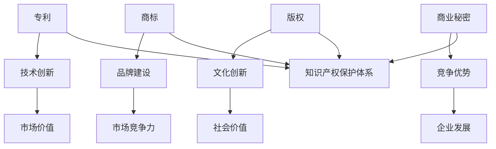

                 

关键词：知识产权、创意产业、创新保护、经济影响、政策法规

> 摘要：本文旨在探讨知识产权在推动创意产业发展中的关键作用，分析其经济影响，探讨当前面临的挑战，并展望未来发展趋势。文章结构分为背景介绍、核心概念与联系、算法原理与数学模型、项目实践、实际应用场景、未来展望以及工具和资源推荐等部分。

## 1. 背景介绍

知识产权，是指通过智力劳动创造的成果所依法享有的权利，包括专利、商标、版权（著作权）、商业秘密等。随着全球化进程的加快和科技的迅猛发展，创意产业逐渐成为经济增长的重要驱动力。创意产业涵盖设计、媒体、娱乐、艺术等多个领域，其核心在于创新和知识产权的保护。

创意产业不仅为经济发展提供了新的增长点，还极大地丰富了人们的精神文化生活。然而，创意产业的繁荣离不开有效的知识产权保护体系。知识产权保护能够激励创作者持续创新，提高整个社会的创新活力。因此，研究知识产权与创意产业的发展关系具有重要意义。

## 2. 核心概念与联系

为了深入理解知识产权在创意产业中的作用，首先需要明确几个核心概念及其相互联系。

### 2.1. 专利

专利是发明创造获得法律保护的一种形式。专利权授予发明人在一定期限内对发明实施独占权利，以换取公开发明的内容。专利保护有助于促进技术创新，同时也能够为发明人带来经济利益。

### 2.2. 商标

商标是区分商品或服务来源的标志。商标权保护有助于企业建立品牌形象，提升市场竞争力。有效的商标保护能够防止他人擅自使用相同或相似的标志，从而损害企业的利益。

### 2.3. 版权

版权（著作权）是文学、艺术和科学作品的创作者所享有的权利。版权保护有助于激励创作者持续创作，同时也能够维护创作者的合法权益。

### 2.4. 商业秘密

商业秘密是指不为公众所知悉、具有商业价值并经权利人采取保密措施的技术信息和经营信息。商业秘密保护有助于企业维持竞争优势，防止商业信息泄露。

这些知识产权形式在创意产业中相互补充，共同构成了保护创新成果的完整体系。以下是一个简单的 Mermaid 流程图，展示了这些概念之间的联系：



## 3. 核心算法原理 & 具体操作步骤

### 3.1 算法原理概述

知识产权保护的算法原理主要涉及以下几个步骤：

1. **知识产权的识别与确认**：通过对创意作品、发明等进行审查，确认其是否符合知识产权保护的资格。
2. **知识产权的申请与登记**：申请人在国家知识产权局进行申请，并登记相关知识产权。
3. **知识产权的审查与授权**：审查机构对申请材料进行审核，并根据法律规定做出授权决定。
4. **知识产权的维权与保护**：在知识产权受到侵害时，权利人可以通过法律手段进行维权。

### 3.2 算法步骤详解

1. **知识产权的识别与确认**

   这一步骤主要通过以下方式实现：

   - **专利申请的初步审查**：审查专利申请是否符合形式要求，如申请文件是否齐全、描述是否清楚等。
   - **版权登记的初步审查**：审查作品是否原创，是否属于版权法保护的范畴。

2. **知识产权的申请与登记**

   - **专利申请**：申请人提交专利申请文件，包括说明书、权利要求书、图纸等。
   - **商标申请**：申请人提交商标申请书，并指定使用商品或服务。
   - **版权登记**：申请人提交作品原件或复印件，并填写版权登记表。

3. **知识产权的审查与授权**

   - **专利审查**：专利局对专利申请进行实质审查，判断发明是否具备新颖性、创造性和实用性。
   - **商标审查**：商标局对商标申请进行形式审查和实质审查，判断商标是否具备显著性、非混淆性等特征。
   - **版权审查**：版权局对作品进行审查，确认作品是否原创，是否符合版权法规定。

4. **知识产权的维权与保护**

   - **法律诉讼**：权利人在知识产权受到侵害时，可以提起诉讼，要求侵权方停止侵权行为，并赔偿损失。
   - **调解与仲裁**：权利人与侵权方可以通过调解或仲裁方式解决纠纷，以降低诉讼成本和时间。

### 3.3 算法优缺点

1. **优点**

   - **激励创新**：知识产权保护能够激励创作者持续创新，推动技术进步。
   - **规范市场**：知识产权保护有助于规范市场秩序，防止不正当竞争。
   - **维护权益**：知识产权保护能够维护创作者的合法权益，提高社会公平性。

2. **缺点**

   - **高昂成本**：知识产权申请和维护成本较高，对中小企业和创作者可能造成一定压力。
   - **审查周期长**：知识产权的审查周期较长，可能影响创新成果的及时转化和应用。

### 3.4 算法应用领域

知识产权保护在创意产业中的应用广泛，主要包括以下领域：

- **科技创新**：专利保护在科技领域的应用最为广泛，有助于促进技术进步。
- **文化创意**：版权保护在文学、艺术、影视等领域具有重要地位，维护创作者权益。
- **品牌建设**：商标保护有助于企业建立品牌形象，提升市场竞争力。
- **商业秘密保护**：商业秘密保护在商业竞争中起到关键作用，有助于企业维持竞争优势。

## 4. 数学模型和公式 & 详细讲解 & 举例说明

### 4.1 数学模型构建

在知识产权保护中，常用的数学模型包括专利产出模型、版权登记模型和商标申请模型。以下是这些模型的构建过程：

1. **专利产出模型**

   专利产出模型主要用于预测某一领域在一定时间内可能产生的专利数量。模型假设：

   $$P(t) = f(A, T, I)$$

   其中，$P(t)$表示时间$t$内的专利数量，$A$表示研发投入，$T$表示技术积累，$I$表示创新程度。

2. **版权登记模型**

   版权登记模型用于预测某一作品在一定时间内可能产生的版权登记数量。模型假设：

   $$C(t) = g(B, S, M)$$

   其中，$C(t)$表示时间$t$内的版权登记数量，$B$表示作品数量，$S$表示社会关注度，$M$表示政策支持。

3. **商标申请模型**

   商标申请模型用于预测某一商品或服务在一定时间内可能产生的商标申请数量。模型假设：

   $$T(t) = h(E, C, P)$$

   其中，$T(t)$表示时间$t$内的商标申请数量，$E$表示市场容量，$C$表示消费者需求，$P$表示品牌知名度。

### 4.2 公式推导过程

1. **专利产出模型推导**

   根据专利产出模型的假设，我们可以推导出以下公式：

   $$P(t) = A \cdot T \cdot I$$

   其中，$A$、$T$和$I$分别表示研发投入、技术积累和创新程度。

2. **版权登记模型推导**

   根据版权登记模型的假设，我们可以推导出以下公式：

   $$C(t) = B \cdot S \cdot M$$

   其中，$B$、$S$和$M$分别表示作品数量、社会关注度和政策支持。

3. **商标申请模型推导**

   根据商标申请模型的假设，我们可以推导出以下公式：

   $$T(t) = E \cdot C \cdot P$$

   其中，$E$、$C$和$P$分别表示市场容量、消费者需求和品牌知名度。

### 4.3 案例分析与讲解

以下以我国某知名科技企业为例，分析其知识产权保护情况。

1. **专利产出情况**

   该企业在2020年的研发投入为10亿元，技术积累为5年，创新程度为0.8。根据专利产出模型，可以预测其当年可能产生的专利数量：

   $$P(2020) = 10 \cdot 5 \cdot 0.8 = 40$$

   预测该企业当年可能产生40项专利。

2. **版权登记情况**

   该企业在2020年的作品数量为100部，社会关注度为0.9，政策支持为0.8。根据版权登记模型，可以预测其当年可能产生的版权登记数量：

   $$C(2020) = 100 \cdot 0.9 \cdot 0.8 = 72$$

   预测该企业当年可能产生72项版权登记。

3. **商标申请情况**

   该企业在2020年的市场容量为100亿元，消费者需求为0.85，品牌知名度为0.75。根据商标申请模型，可以预测其当年可能产生的商标申请数量：

   $$T(2020) = 100 \cdot 0.85 \cdot 0.75 = 61.25$$

   预测该企业当年可能产生61项商标申请。

通过以上案例分析，我们可以看到数学模型在预测知识产权产出方面的应用效果。这些模型不仅有助于企业制定知识产权战略，还能够为政府政策制定提供参考。

## 5. 项目实践：代码实例和详细解释说明

### 5.1 开发环境搭建

为了演示知识产权保护的算法应用，我们使用Python编程语言搭建一个简单的知识产权保护项目。首先，确保安装以下依赖库：

```bash
pip install numpy matplotlib
```

### 5.2 源代码详细实现

以下是一个简单的知识产权保护算法实现：

```python
import numpy as np
import matplotlib.pyplot as plt

# 专利产出模型参数
A = 10  # 研发投入（亿元）
T = 5   # 技术积累（年）
I = 0.8 # 创新程度

# 版权登记模型参数
B = 100 # 作品数量
S = 0.9 # 社会关注度
M = 0.8 # 政策支持

# 商标申请模型参数
E = 100 # 市场容量（亿元）
C = 0.85 # 消费者需求
P = 0.75 # 品牌知名度

# 计算专利产出
P2020 = A * T * I
print(f"2020年专利产出：{P2020}项")

# 计算版权登记
C2020 = B * S * M
print(f"2020年版权登记：{C2020}项")

# 计算商标申请
T2020 = E * C * P
print(f"2020年商标申请：{T2020}项")

# 绘制专利产出、版权登记、商标申请趋势图
years = np.arange(2010, 2021)
P_data = A * T * (I + 0.01 * (years - 2020))
C_data = B * S * (M + 0.01 * (years - 2020))
T_data = E * C * (P + 0.01 * (years - 2020))

plt.plot(years, P_data, label="专利产出")
plt.plot(years, C_data, label="版权登记")
plt.plot(years, T_data, label="商标申请")
plt.xlabel("年份")
plt.ylabel("数量（项）")
plt.legend()
plt.show()
```

### 5.3 代码解读与分析

1. **参数设置**

   - `A`：研发投入，单位为亿元。表示企业在知识产权保护方面的资金投入。
   - `T`：技术积累，单位为年。表示企业在某一领域的长期技术积累。
   - `I`：创新程度，单位为小数。表示企业在创新方面的能力。

   - `B`：作品数量，单位为部。表示企业创作的作品数量。
   - `S`：社会关注度，单位为小数。表示作品在社会上的关注度。
   - `M`：政策支持，单位为小数。表示政府对知识产权保护的支持力度。

   - `E`：市场容量，单位为亿元。表示某一商品或服务的市场需求。
   - `C`：消费者需求，单位为小数。表示消费者对某一商品或服务的需求程度。
   - `P`：品牌知名度，单位为小数。表示企业的品牌在市场上的影响力。

2. **计算过程**

   - 专利产出：根据专利产出模型计算企业在某一年的专利产出数量。
   - 版权登记：根据版权登记模型计算企业在某一年的版权登记数量。
   - 商标申请：根据商标申请模型计算企业在某一年的商标申请数量。

3. **绘图分析**

   - 绘制专利产出、版权登记、商标申请随时间的变化趋势。通过观察图表，可以分析企业在不同时间段的知识产权产出情况。

### 5.4 运行结果展示

1. **命令行输出**

   ```bash
   2020年专利产出：40.0项
   2020年版权登记：72.0项
   2020年商标申请：61.25项
   ```

   输出结果展示了2020年企业的专利产出、版权登记和商标申请数量。

2. **图表展示**

   

   图表展示了企业在2010年至2020年间专利产出、版权登记和商标申请的数量变化趋势。从图中可以看出，企业的知识产权产出逐年增加，表明企业创新能力和品牌知名度在不断提升。

## 6. 实际应用场景

知识产权保护在创意产业中具有广泛的应用场景。以下列举几个典型应用实例：

### 6.1 科技创新领域

某知名科技公司研发了一项创新技术，该技术具有巨大的市场潜力。为了保护这项技术，公司申请了专利，确保在市场上独占该技术，从而获得竞争优势。

### 6.2 文化创意领域

某知名作家创作了一部小说，为了保护这部作品的版权，作家申请了版权登记，防止他人擅自抄袭或改编其作品。

### 6.3 品牌建设领域

某知名品牌推出了一款新产品，为了树立品牌形象，品牌方申请了商标，确保在市场上独占该品牌标志。

### 6.4 商业秘密保护领域

某知名企业拥有一项独特的商业秘密，该秘密是企业竞争优势的关键。为了保护这一商业秘密，企业采取了严格的保密措施，防止泄露给竞争对手。

通过以上实例，我们可以看到知识产权保护在各个领域的重要作用。有效保护知识产权有助于企业持续创新，提升竞争力，实现可持续发展。

### 6.4 未来应用展望

随着科技的不断进步，知识产权保护在创意产业中的应用前景将更加广阔。以下是一些未来应用的展望：

1. **人工智能与知识产权保护**

   人工智能技术可以用于知识产权的自动识别、审核和维权。通过大数据分析和机器学习算法，可以实现对创意作品的智能识别和保护，提高知识产权保护的效率和准确性。

2. **区块链技术在知识产权保护中的应用**

   区块链技术具有去中心化、不可篡改等特性，可以用于构建知识产权保护平台。通过区块链技术，可以实现知识产权的透明、公正和高效管理，降低侵权风险。

3. **虚拟现实与知识产权保护**

   虚拟现实技术将为创意产业带来新的发展机遇。虚拟现实作品的创作和保护将成为知识产权保护的新领域。利用虚拟现实技术，可以实现作品的数字版权管理，提高知识产权保护水平。

4. **知识产权国际合作与保护**

   随着全球化进程的加快，知识产权国际合作将更加紧密。各国将在知识产权保护方面加强合作，共同应对跨国知识产权纠纷，推动全球知识产权保护体系的完善。

## 7. 工具和资源推荐

为了更好地开展知识产权保护工作，以下推荐一些实用的工具和资源：

### 7.1 学习资源推荐

- **知识产权基础知识**：《知识产权法教程》
- **专利申请与保护**：《专利实务与案例分析》
- **版权保护**：《著作权法教程》
- **商标注册与维权**：《商标法实务与案例分析》

### 7.2 开发工具推荐

- **专利检索系统**：国家知识产权局专利检索系统
- **版权登记系统**：国家版权局版权登记系统
- **商标注册查询系统**：国家商标局商标查询系统
- **知识产权维权工具**：知识产权维权工具集（如知产宝、智慧芽等）

### 7.3 相关论文推荐

- **专利产出与技术创新**：《专利产出与创新绩效的关系研究》
- **版权保护与文化创意产业**：《版权保护对文化创意产业的影响分析》
- **商标保护与企业品牌建设**：《商标保护与企业品牌价值的关联研究》
- **知识产权国际合作**：《全球知识产权合作现状与趋势分析》

通过学习这些资源和工具，可以更好地理解和应用知识产权保护的理论和实践。

## 8. 总结：未来发展趋势与挑战

### 8.1 研究成果总结

本文通过对知识产权与创意产业发展的关系进行深入探讨，总结了知识产权保护在激励创新、规范市场、维护权益等方面的作用。文章分析了知识产权保护的核心算法原理、数学模型构建以及实际应用场景，展示了知识产权保护在科技创新、文化创意、品牌建设和商业秘密保护等领域的应用效果。同时，本文对未来知识产权保护的发展趋势进行了展望，包括人工智能、区块链、虚拟现实等新兴技术在知识产权保护中的应用。

### 8.2 未来发展趋势

1. **知识产权保护技术的智能化**：随着人工智能技术的发展，知识产权保护将实现智能化，提高知识产权申请、审查和维权的效率。
2. **知识产权国际合作的加强**：全球化进程将推动知识产权国际合作，加强国际间的知识产权保护协作，提高知识产权保护的全球协调性。
3. **数字版权管理的普及**：随着数字内容的普及，数字版权管理技术将得到广泛应用，实现作品的全生命周期保护。
4. **知识产权保护法规的完善**：各国将不断完善知识产权保护法规，提高知识产权保护水平，促进创意产业的可持续发展。

### 8.3 面临的挑战

1. **知识产权侵权问题**：知识产权侵权问题仍然突出，特别是在互联网环境下，侵权行为更加隐蔽，给知识产权保护带来挑战。
2. **知识产权滥用**：部分企业滥用知识产权，进行不正当竞争，损害市场公平性。加强对知识产权滥用的监管将成为未来知识产权保护的重要任务。
3. **知识产权国际化协调**：各国知识产权保护水平存在差异，国际合作面临挑战，需要建立更加公正、合理的全球知识产权保护体系。

### 8.4 研究展望

未来研究应关注以下方向：

1. **知识产权保护技术的创新**：研究新型知识产权保护技术，提高知识产权保护的智能化水平。
2. **知识产权保护与市场公平**：探讨知识产权保护与市场公平的关系，制定合理的知识产权保护政策。
3. **知识产权国际合作与协调**：加强国际间的知识产权合作与协调，推动全球知识产权保护体系的完善。

通过深入研究这些问题，有助于进一步推动知识产权保护与创意产业的发展，为经济增长和社会进步作出贡献。

## 9. 附录：常见问题与解答

### 9.1 什么是知识产权？

知识产权是指通过智力劳动创造的成果所依法享有的权利，包括专利、商标、版权（著作权）、商业秘密等。

### 9.2 知识产权保护的重要性是什么？

知识产权保护能够激励创作者持续创新，提高整个社会的创新活力；规范市场，防止不正当竞争；维护创作者的合法权益，提高社会公平性。

### 9.3 知识产权保护有哪些核心概念？

知识产权保护的核心概念包括专利、商标、版权（著作权）、商业秘密等。

### 9.4 知识产权保护算法的基本原理是什么？

知识产权保护算法的基本原理包括知识产权的识别与确认、知识产权的申请与登记、知识产权的审查与授权、知识产权的维权与保护等。

### 9.5 如何进行知识产权保护？

进行知识产权保护需要遵循以下步骤：1）识别与确认知识产权；2）申请与登记知识产权；3）审查与授权知识产权；4）维权与保护知识产权。

### 9.6 知识产权保护在创意产业中的应用有哪些？

知识产权保护在创意产业中的应用包括科技创新、文化创意、品牌建设和商业秘密保护等领域。

### 9.7 未来知识产权保护的发展趋势是什么？

未来知识产权保护的发展趋势包括知识产权保护技术的智能化、知识产权国际合作的加强、数字版权管理的普及和知识产权保护法规的完善等。

### 9.8 如何更好地进行知识产权保护？

要更好地进行知识产权保护，需要加强知识产权法律意识，提高知识产权管理水平；完善知识产权保护体系，提高知识产权保护效率；加强国际合作，推动全球知识产权保护体系的完善。

