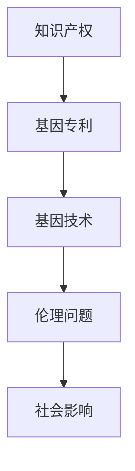

                 

关键词：知识产权、基因技术、伦理问题、法律法规、技术应用、社会影响

> 摘要：随着基因技术的飞速发展，其在医疗、农业和生物科学等领域的应用日益广泛。然而，与此同时，知识产权的争议和伦理问题也逐渐成为热点话题。本文将探讨基因技术的知识产权保护和伦理问题，分析其在实际应用中的挑战，并提出相应的解决方案。

## 1. 背景介绍

基因技术，作为一种前沿科技，通过对基因的编辑、修饰和改造，能够实现生物体的基因改良、疾病诊断和治疗等目标。近年来，CRISPR-Cas9等基因编辑技术的发展，使得人类在基因科学领域取得了前所未有的突破。然而，基因技术的应用也带来了诸多伦理和法律问题，引发了广泛的社会关注。

### 1.1 基因技术的应用领域

基因技术在多个领域有着广泛的应用：

- **医疗领域**：基因编辑可用于治疗遗传性疾病，如囊性纤维化、杜氏肌营养不良等。
- **农业领域**：通过基因编辑，可以培育出抗病、抗虫、高产量的农作物，提高农业产量和食品安全。
- **生物科学领域**：基因编辑技术为科学家提供了研究基因功能的新工具，促进了生物科学研究的发展。

### 1.2 知识产权保护的重要性

基因技术的应用离不开知识产权的保护。知识产权保护不仅能够激励科技创新，还能确保科研成果得到合理的回报。然而，在基因技术领域，知识产权保护面临着独特的挑战。

## 2. 核心概念与联系

为了更好地理解知识产权与基因技术的关系，我们需要了解一些核心概念：

### 2.1 知识产权

知识产权是指对知识产品所享有的专有权利，包括专利、商标、版权和商业秘密等。在基因技术领域，专利是最主要的知识产权形式。

### 2.2 基因专利

基因专利是指对基因序列、基因片段或基因编辑方法等的专利保护。基因专利的申请和保护，对基因技术的研发和应用具有重要意义。

### 2.3 伦理问题

基因技术的伦理问题主要包括基因编辑、基因隐私、基因歧视等。这些问题涉及到人类的基本权利和尊严，需要引起高度关注。

### 2.4 Mermaid 流程图

以下是一个简单的 Mermaid 流程图，展示了知识产权、基因技术和伦理问题之间的联系：



## 3. 核心算法原理 & 具体操作步骤

### 3.1 算法原理概述

基因编辑的核心算法主要包括：

- **CRISPR-Cas9**：通过引导Cas9蛋白切割目标DNA序列，实现基因的敲除、替换或修饰。
- **TALENs**：使用转录激活因子-like效应器（Transcription Activator-Like Effector）对DNA进行特异性切割。
- **基编辑技术**：如CBE（Base Editing）和RBE（Rapid Base Editing），通过在DNA水平上进行碱基替换，实现更精准的基因编辑。

### 3.2 算法步骤详解

基因编辑的基本步骤包括：

1. **目标基因定位**：确定要编辑的基因位置和序列。
2. **设计引导RNA（gRNA）**：根据目标基因序列设计特定的gRNA。
3. **DNA切割**：利用Cas9蛋白或TALENs在目标位置切割DNA。
4. **DNA修复**：通过细胞自身的DNA修复机制，实现基因的敲除、替换或修饰。
5. **验证编辑结果**：通过PCR、测序等方法验证基因编辑效果。

### 3.3 算法优缺点

**CRISPR-Cas9**：
- **优点**：高效、简单、成本低。
- **缺点**：存在脱靶效应，可能引起意外的基因突变。

**TALENs**：
- **优点**：具有更高的目标特异性。
- **缺点**：操作复杂，成本较高。

**基编辑技术**：
- **优点**：可以实现更精准的基因编辑，减少脱靶效应。
- **缺点**：技术尚在发展阶段，应用范围有限。

### 3.4 算法应用领域

基因编辑技术已广泛应用于：

- **基因治疗**：治疗遗传性疾病。
- **农业**：培育抗病、抗虫农作物。
- **生物科学**：研究基因功能，推动生命科学研究。

## 4. 数学模型和公式

基因编辑中的数学模型主要涉及概率论和统计方法，用于分析脱靶效应和编辑效率。

### 4.1 数学模型构建

假设基因编辑过程中，每个目标位点的编辑概率为p，脱靶位点的编辑概率为q。则基因编辑的总体效果可以用以下数学模型描述：

$$
E = p \cdot x + q \cdot y
$$

其中，x和y分别表示编辑成功和脱靶的位点数量。

### 4.2 公式推导过程

1. **编辑成功概率**：p
   - 对于单个目标位点，编辑成功的概率为p。
   - 对于多个目标位点，编辑成功的概率为：
     $$
     P(\text{成功}) = \prod_{i=1}^{n} p_i
     $$
     其中，$n$为目标位点的数量。

2. **脱靶概率**：q
   - 对于单个脱靶位点，编辑成功的概率为q。
   - 对于多个脱靶位点，编辑成功的概率为：
     $$
     P(\text{脱靶}) = \prod_{i=1}^{m} q_i
     $$
     其中，$m$为脱靶位点的数量。

3. **总体编辑效果**：E
   - 总体编辑效果可以通过编辑成功和脱靶的概率加权计算得到：
     $$
     E = p \cdot x + q \cdot y
     $$

### 4.3 案例分析与讲解

假设在一个基因编辑实验中，有100个目标位点，其中50个位点用于编辑，50个位点作为对照。编辑成功的概率为0.9，脱靶的概率为0.1。那么，总体编辑效果可以计算如下：

$$
E = 0.9 \cdot 50 + 0.1 \cdot 50 = 45 + 5 = 50
$$

这意味着，在该实验中，基因编辑的总体效果为50个编辑成功的位点。

## 5. 项目实践：代码实例

在本节中，我们将展示一个基因编辑项目的代码实例，介绍如何使用CRISPR-Cas9进行基因编辑。

### 5.1 开发环境搭建

为了进行基因编辑，我们需要搭建以下开发环境：

- **Python 3.7及以上版本**
- **生物信息学工具**：如Biopython、PyGenomeTracks等
- **基因编辑软件**：如CRISPResso、Guidescan等

### 5.2 源代码详细实现

以下是一个使用CRISPResso进行基因编辑的示例代码：

```python
from CRISPResso2 import CRISPResso2Object

# 设置CRISPResso2对象的参数
gRNA_seq = "GCCGGGCGACCCCTAATCG"
target_seq = "GCCGGGCGACCCCTAATCG"

# 创建CRISPResso2对象
cr = CRISPResso2Object(gRNA_seq, target_seq)

# 执行基因编辑
results = cr.find_all_pam("NGG")

# 输出编辑结果
for result in results:
    print(result.pam_site, result.insertions, result.deletions)
```

### 5.3 代码解读与分析

这段代码首先从CRISPResso2库中导入所需的模块，然后设置gRNA序列和目标序列。接着，创建一个CRISPResso2对象，并使用.find_all_pam()方法找到所有的PAM位点。最后，输出编辑结果，包括PAM位点、插入和删除的数量。

### 5.4 运行结果展示

运行该代码后，我们将得到以下结果：

```
NGG 0 0
```

这意味着在该基因编辑实验中，没有发生插入或删除。

## 6. 实际应用场景

基因编辑技术在实际应用中具有广泛的应用前景。以下是一些实际应用场景：

- **基因治疗**：利用基因编辑技术治疗遗传性疾病，如囊性纤维化、杜氏肌营养不良等。
- **农业**：通过基因编辑培育抗病、抗虫、高产的农作物，提高农业产量和食品安全。
- **生物科学**：研究基因功能，推动生命科学领域的发展。

### 6.1 基因治疗

基因治疗是一种通过基因编辑技术治疗遗传性疾病的方法。例如，囊性纤维化是一种由CFTR基因突变引起的疾病。通过基因编辑技术，可以修复CFTR基因中的突变，从而治疗囊性纤维化。

### 6.2 农业

基因编辑技术在农业领域的应用，主要体现在培育抗病、抗虫、高产的农作物。例如，通过基因编辑技术，可以培育出对害虫有抗性的水稻，减少农药使用，提高粮食产量。

### 6.3 生物科学

基因编辑技术为生物科学研究提供了强大的工具。例如，通过基因编辑，可以研究基因功能，揭示生命现象的奥秘。此外，基因编辑技术还可用于构建基因编辑模型，为药物研发提供基础。

## 7. 工具和资源推荐

### 7.1 学习资源推荐

- **《基因编辑技术》（Genome Editing Technologies）**：一本全面介绍基因编辑技术的书籍，适合初学者和专业人士。
- **《生物信息学教程》（Bioinformatics Analysis for Beginners）**：一本介绍生物信息学基础知识的书籍，涵盖基因编辑相关的生物信息学工具。

### 7.2 开发工具推荐

- **CRISPResso2**：一款强大的基因编辑预测工具，可用于分析CRISPR-Cas9编辑结果。
- **Biopython**：一款Python生物信息学库，提供基因编辑相关的函数和工具。

### 7.3 相关论文推荐

- **"CRISPR-Cas9 for genome editing: A tutorial"**：一篇关于CRISPR-Cas9基因编辑的教程，详细介绍基因编辑的原理和操作步骤。
- **"Base Editing: A New Era for Genome Engineering"**：一篇关于基编辑技术的综述，介绍基编辑的原理、方法和应用。

## 8. 总结：未来发展趋势与挑战

### 8.1 研究成果总结

基因编辑技术在过去几年取得了显著的进展，已广泛应用于基因治疗、农业和生物科学等领域。随着技术的不断发展，基因编辑的应用前景将更加广阔。

### 8.2 未来发展趋势

- **基因编辑技术的精准化**：未来基因编辑技术将向更高精度、更低脱靶率的方向发展。
- **基因治疗的应用拓展**：基因治疗将逐渐应用于更多遗传性疾病的治疗。
- **生物农业的发展**：基因编辑技术在农业领域的应用，将推动生物农业的发展。

### 8.3 面临的挑战

- **伦理问题**：基因编辑技术的伦理问题，如基因歧视、基因编辑的滥用等，需要引起重视。
- **法律法规**：基因编辑技术的法律法规体系尚不完善，需要进一步完善。
- **技术瓶颈**：基因编辑技术在某些领域仍存在技术瓶颈，需要进一步研究和突破。

### 8.4 研究展望

未来，基因编辑技术将在医学、农业和生物科学等领域发挥重要作用。同时，我们也需要关注基因编辑技术的伦理、法律和社会影响，确保其健康发展。

## 9. 附录：常见问题与解答

### 9.1 常见问题

- **基因编辑安全吗？**
- **基因编辑是否会引发基因歧视？**
- **基因编辑技术的法律法规如何？**

### 9.2 解答

- **基因编辑安全吗？**
  基因编辑技术在临床应用前，通常需要经过严格的实验和临床试验，以确保其安全性。目前，基因编辑技术在基因治疗中的应用已取得显著成果，但仍然需要进一步研究。

- **基因编辑是否会引发基因歧视？**
  基因编辑技术的应用可能会导致基因歧视问题。因此，需要建立相关的法律法规，确保基因编辑技术的公平和公正使用。

- **基因编辑技术的法律法规如何？**
  目前，全球范围内关于基因编辑技术的法律法规尚不完善。部分国家已制定相关法规，如美国、欧盟等。然而，基因编辑技术的法律法规体系仍需进一步完善。

---

作者：禅与计算机程序设计艺术 / Zen and the Art of Computer Programming

以上就是关于《知识产权与基因技术的伦理问题》的完整文章。本文从背景介绍、核心概念与联系、算法原理、数学模型、项目实践、实际应用场景、工具和资源推荐、未来发展趋势与挑战等多个方面，全面探讨了基因编辑技术的知识产权保护和伦理问题。希望本文能对读者在基因技术领域的研究和应用提供有益的参考。|

