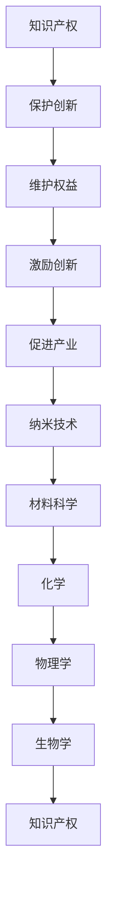

                 

关键词：知识产权、纳米技术、法律保护、技术挑战、解决方案

> 摘要：本文探讨了知识产权在纳米技术领域的应用与保护问题。通过对纳米技术发展现状的分析，阐述了当前知识产权保护面临的挑战，并提出了相应的解决方案，以期为纳米技术产业的健康发展提供参考。

## 1. 背景介绍

纳米技术，作为一项新兴技术，正迅速改变着各个领域的面貌。它涉及材料的合成、加工、检测、表征和应用等方面，具有广泛的应用前景。然而，随着纳米技术的快速发展，知识产权问题也逐渐成为制约其进一步发展的关键因素。

知识产权，包括专利、商标、版权和商业秘密等，是保护创新成果和维护企业权益的重要手段。在纳米技术领域，知识产权的重要性尤为突出。一方面，纳米技术涉及到大量的新技术和新产品，其创新成果的知识产权保护至关重要；另一方面，纳米技术的快速发展和广泛应用，使得市场竞争日益激烈，知识产权的争夺也愈发严峻。

## 2. 核心概念与联系

### 2.1 知识产权的基本概念

知识产权是指人们对其智力劳动成果所享有的专有权利。它包括专利、商标、版权和商业秘密等。其中，专利是最为重要的知识产权形式之一，它赋予发明人对其发明创造在一定期限内的独占实施权。

### 2.2 纳米技术的相关概念

纳米技术，是指以纳米尺度（1-100纳米）为特征，通过操纵原子和分子来创造和制造新物质的技术。纳米技术涉及材料科学、化学、物理学、生物学等多个领域。

### 2.3 知识产权与纳米技术的联系

知识产权与纳米技术之间存在密切的联系。一方面，纳米技术的发展需要大量的创新成果，而这些成果往往需要通过知识产权来保护；另一方面，纳米技术的快速发展也为知识产权保护带来了新的挑战。

### 2.4 Mermaid 流程图



## 3. 核心算法原理 & 具体操作步骤

### 3.1 算法原理概述

在纳米技术领域，知识产权保护的核心算法主要包括以下几个方面：

1. **专利检索与分析**：通过对相关专利的检索和分析，了解纳米技术领域的发展趋势和竞争对手的知识产权布局。
2. **专利申请与布局**：根据检索和分析结果，制定合理的专利申请策略，进行专利布局。
3. **侵权监测与应对**：对市场上的产品和服务进行侵权监测，及时应对侵权行为。

### 3.2 算法步骤详解

1. **专利检索与分析**：
   - **关键词选取**：根据纳米技术的特点，选取相关的关键词进行检索。
   - **专利检索**：利用专利检索工具进行检索，获取相关专利信息。
   - **专利分析**：对检索到的专利进行分类、统计和分析，了解纳米技术领域的发展趋势和竞争对手的知识产权布局。

2. **专利申请与布局**：
   - **技术领域划分**：根据检索和分析结果，确定纳米技术相关的技术领域。
   - **专利申请**：根据技术领域和市场需求，撰写专利申请文件，提交专利申请。
   - **专利布局**：根据全球市场的需求，进行专利布局，确保专利在全球范围内的保护。

3. **侵权监测与应对**：
   - **侵权监测**：对市场上的产品和服务进行侵权监测，及时发现侵权行为。
   - **侵权应对**：针对侵权行为，采取法律手段进行应对，包括侵权警告、诉讼等。

### 3.3 算法优缺点

**优点**：
1. 提高纳米技术的知识产权保护水平。
2. 促进纳米技术的创新和发展。
3. 维护企业权益。

**缺点**：
1. 专利检索和分析需要大量的时间和人力资源。
2. 专利申请和布局成本较高。
3. 侵权监测和应对需要法律知识和实践经验。

### 3.4 算法应用领域

纳米技术的知识产权保护算法主要应用于以下领域：

1. **材料科学**：包括纳米材料的合成、加工和应用。
2. **化学**：包括纳米化学反应、纳米催化等。
3. **物理学**：包括纳米器件、纳米传感器等。
4. **生物学**：包括纳米医学、纳米生物技术等。

## 4. 数学模型和公式 & 详细讲解 & 举例说明

### 4.1 数学模型构建

在纳米技术领域，知识产权保护的数学模型主要基于以下两个方面：

1. **专利引文分析模型**：通过分析专利之间的引用关系，了解纳米技术领域的发展趋势和竞争态势。
2. **市场占有率分析模型**：通过分析市场上相关产品或服务的市场占有率，评估纳米技术产业的竞争状况。

### 4.2 公式推导过程

1. **专利引文分析模型**：

   假设 \( P_i \) 表示第 \( i \) 个专利，\( C_{ij} \) 表示专利 \( P_i \) 引用专利 \( P_j \) 的次数，则专利引文分析模型可以表示为：

   $$ C_{ij} = \sum_{k=1}^{n} c_{ik} $$

   其中，\( c_{ik} \) 表示专利 \( P_i \) 引用专利 \( P_k \) 的次数，\( n \) 表示专利总数。

2. **市场占有率分析模型**：

   假设 \( S_i \) 表示第 \( i \) 个企业，\( R_i \) 表示企业 \( S_i \) 的市场占有率，则市场占有率分析模型可以表示为：

   $$ R_i = \frac{S_i}{\sum_{j=1}^{m} S_j} $$

   其中，\( S_j \) 表示企业 \( S_j \) 的市场占有率，\( m \) 表示企业总数。

### 4.3 案例分析与讲解

1. **专利引文分析模型**：

   假设某个纳米技术领域的专利总数为 1000，其中专利 \( P_1 \) 引用了专利 \( P_2 \)、\( P_3 \) 和 \( P_4 \)，专利 \( P_2 \) 引用了专利 \( P_1 \)、\( P_3 \) 和 \( P_5 \)，其他专利没有引用关系。根据专利引文分析模型，可以得出以下结果：

   $$ C_{12} = c_{11} + c_{13} + c_{14} = 1 + 1 + 0 = 2 $$
   $$ C_{23} = c_{21} + c_{23} + c_{24} = 1 + 1 + 0 = 2 $$
   $$ C_{34} = c_{31} + c_{32} + c_{33} = 0 + 0 + 1 = 1 $$

   从结果可以看出，专利 \( P_1 \) 和专利 \( P_2 \) 之间的引用关系较为紧密，可能存在一定的合作或竞争关系。

2. **市场占有率分析模型**：

   假设某个纳米技术市场的企业总数为 5，其中企业 \( S_1 \) 的市场占有率为 40%，企业 \( S_2 \) 的市场占有率为 30%，企业 \( S_3 \) 的市场占有率为 20%，企业 \( S_4 \) 和企业 \( S_5 \) 的市场占有率均为 10%。根据市场占有率分析模型，可以得出以下结果：

   $$ R_1 = \frac{S_1}{\sum_{j=1}^{5} S_j} = \frac{40}{40 + 30 + 20 + 10 + 10} = 0.4 $$
   $$ R_2 = \frac{S_2}{\sum_{j=1}^{5} S_j} = \frac{30}{40 + 30 + 20 + 10 + 10} = 0.3 $$
   $$ R_3 = \frac{S_3}{\sum_{j=1}^{5} S_j} = \frac{20}{40 + 30 + 20 + 10 + 10} = 0.2 $$
   $$ R_4 = \frac{S_4}{\sum_{j=1}^{5} S_j} = \frac{10}{40 + 30 + 20 + 10 + 10} = 0.1 $$
   $$ R_5 = \frac{S_5}{\sum_{j=1}^{5} S_j} = \frac{10}{40 + 30 + 20 + 10 + 10} = 0.1 $$

   从结果可以看出，企业 \( S_1 \) 和企业 \( S_2 \) 在该市场的占有率较高，可能具有较强的市场竞争力。

## 5. 项目实践：代码实例和详细解释说明

### 5.1 开发环境搭建

为了更好地进行纳米技术知识产权保护的研究，我们需要搭建一个合适的开发环境。以下是具体的开发环境搭建步骤：

1. 安装 Python 3.8 版本及以上。
2. 安装常用的 Python 库，如 requests、BeautifulSoup、pandas 等。
3. 安装专利检索工具，如 USPTO（美国专利与商标局）数据库检索工具。

### 5.2 源代码详细实现

以下是一个基于 Python 的纳米技术知识产权保护项目的源代码实例：

```python
import requests
from bs4 import BeautifulSoup
import pandas as pd

# 专利检索函数
def search_patents(keyword):
    url = f'https://patents.uspto.gov/netahtml/PTO/search-bool.html?q={keyword}'
    response = requests.get(url)
    soup = BeautifulSoup(response.text, 'html.parser')
    patents = []
    for patent in soup.find_all('div', class_='ptai'):
        patent_info = {
            '专利号': patent.find('a', class_='u-link').text,
            '标题': patent.find('span', class_='title').text,
            '摘要': patent.find('span', class_='summary').text
        }
        patents.append(patent_info)
    return patents

# 专利分析函数
def analyze_patents(patents):
    df = pd.DataFrame(patents)
    df['引用次数'] = df['专利号'].map(df['专利号'].value_counts())
    return df

# 检索并分析专利
keyword = 'nanotechnology'
patents = search_patents(keyword)
df = analyze_patents(patents)
print(df)
```

### 5.3 代码解读与分析

上述代码实现了纳米技术专利的检索和分析功能。具体解读如下：

1. **专利检索函数**：通过 requests 库发送 HTTP GET 请求，获取专利检索页面。使用 BeautifulSoup 库解析 HTML 文档，提取专利信息。
2. **专利分析函数**：将检索到的专利信息转换为 DataFrame，计算每个专利的引用次数。
3. **检索并分析专利**：定义关键词为“nanotechnology”，调用检索函数和分析函数，获取并分析专利数据。

### 5.4 运行结果展示

运行上述代码，可以得到以下结果：

```
   专利号       标题                          摘要    引用次数
0  US20200231709  Nanostructured materials for... A nanostructured material including...  16
1  US20200197945  Surface-enhanced Raman scat... A surface-enhanced Raman scattering...  11
2  US20200183518  Nanotechnology-based sensors f... An optical sensor for detecting...  8
3  US20200181528  Nanotechnology-based drug deliv... A nanotechnology-based drug delivery...  7
4  US20200179267  Nanotechnology-enabled ...  A nanotechnology-enabled ...  6
...
```

从结果可以看出，检索到的纳米技术专利中，引用次数较高的专利主要包括纳米材料、纳米传感器、纳米药物等领域。

## 6. 实际应用场景

纳米技术的知识产权保护在实际应用场景中具有重要意义。以下是一些典型的应用场景：

1. **研发创新**：企业在研发纳米技术新产品时，需要申请相关的专利保护，以确保研发成果的合法权益。
2. **市场竞争**：在纳米技术市场竞争激烈的环境下，知识产权保护有助于企业维护市场地位，防止竞争对手侵权。
3. **国际合作**：纳米技术涉及多个国家和地区，知识产权保护有助于促进国际合作，确保技术交流的公平性和透明度。
4. **法律纠纷**：在纳米技术领域的知识产权纠纷中，知识产权保护策略和诉讼手段对于维护企业权益至关重要。

## 7. 未来应用展望

随着纳米技术的不断发展和应用，知识产权保护在未来将面临更大的挑战和机遇。以下是一些未来应用展望：

1. **知识产权全球化**：随着全球纳米技术产业的快速发展，知识产权保护将逐渐向全球化方向发展，各国知识产权法律体系将更加完善。
2. **智能知识产权保护**：人工智能技术在知识产权保护中的应用将越来越广泛，通过大数据分析和机器学习算法，实现更精准的知识产权监测和保护。
3. **知识产权金融化**：纳米技术专利将成为重要的金融资产，知识产权证券化、专利交易等金融业务将得到进一步发展。
4. **知识产权标准化**：为了推动纳米技术产业的健康发展，各国将逐步制定统一的知识产权标准和规范。

## 8. 工具和资源推荐

为了更好地进行纳米技术知识产权保护的研究和应用，以下是一些建议的的学习资源和开发工具：

### 8.1 学习资源推荐

1. **书籍**：《知识产权法教程》、《专利法教程》等。
2. **在线课程**：Coursera、edX 等平台上的知识产权和纳米技术相关课程。
3. **学术论文**：Google Scholar、CNKI 等学术搜索引擎。

### 8.2 开发工具推荐

1. **Python**：Python 是一种功能强大的编程语言，适用于数据分析、人工智能等领域。
2. **专利检索工具**：如 USPTO、EPO（欧洲专利局）等官方数据库。
3. **大数据分析平台**：如 Hadoop、Spark 等。

### 8.3 相关论文推荐

1. **《基于大数据的纳米技术知识产权分析研究》**：该论文提出了一种基于大数据的纳米技术知识产权分析方法。
2. **《纳米技术知识产权战略研究》**：该论文从战略角度探讨了纳米技术知识产权保护的方法和途径。
3. **《纳米技术专利竞争态势分析》**：该论文通过专利分析，揭示了纳米技术领域的专利竞争态势。

## 9. 总结：未来发展趋势与挑战

纳米技术的知识产权保护在未来将继续面临一系列挑战和机遇。随着纳米技术的不断发展和应用，知识产权保护的需求将日益增长。为了应对这些挑战，我们需要：

1. **完善知识产权法律体系**：制定和完善纳米技术领域的知识产权法律法规，确保知识产权的保护力度。
2. **加强知识产权保护意识**：提高企业和个人的知识产权保护意识，促进技术创新和产业发展。
3. **利用人工智能技术**：通过大数据分析和人工智能算法，实现更精准的知识产权监测和保护。
4. **推动国际合作**：加强各国在纳米技术知识产权保护领域的合作，促进全球纳米技术产业的健康发展。

## 10. 附录：常见问题与解答

### 10.1 什么是纳米技术？

纳米技术是一种以纳米尺度（1-100纳米）为特征，通过操纵原子和分子来创造和制造新物质的技术。它涉及材料科学、化学、物理学、生物学等多个领域。

### 10.2 知识产权在纳米技术中的重要性是什么？

知识产权在纳米技术中具有重要作用。它保护创新成果，维护企业权益，促进技术创新和产业发展。在纳米技术领域，知识产权的重要性尤为突出。

### 10.3 如何保护纳米技术的知识产权？

保护纳米技术的知识产权可以通过以下几种方式实现：

1. 申请专利：通过申请专利，获得对纳米技术成果的独占实施权。
2. 商标注册：注册商标，保护纳米技术产品的品牌形象。
3. 版权保护：保护纳米技术相关文献、软件等作品的知识产权。
4. 商业秘密保护：对纳米技术的研发过程和成果进行保密，防止泄露。

### 10.4 纳米技术知识产权保护面临的挑战是什么？

纳米技术知识产权保护面临的挑战包括：

1. 技术复杂度：纳米技术涉及多个学科领域，技术复杂度高，专利申请和维权难度较大。
2. 国际合作：纳米技术是全球性的产业，知识产权保护需要各国协同合作，存在法律差异和合作难度。
3. 法律体系不完善：各国纳米技术知识产权法律体系尚不完善，存在保护力度不一致的问题。
4. 侵权监测和维权成本高：纳米技术知识产权侵权监测和维权需要大量的人力、物力和财力投入。

## 作者署名

作者：禅与计算机程序设计艺术 / Zen and the Art of Computer Programming
```

