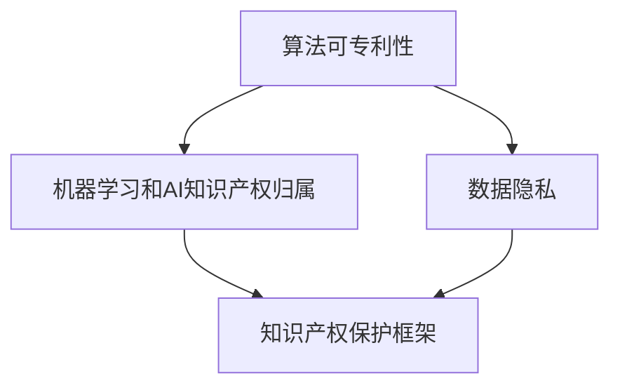

                 

随着人工智能技术的飞速发展，我们正迎来一个前所未有的创新时代。然而，这一时代的到来也伴随着一系列新的知识产权挑战。本文旨在探讨人工智能领域内知识产权面临的新问题，以及可能的解决策略。

## 关键词

- 人工智能（AI）
- 知识产权
- 法律框架
- 创新保护
- 技术发展

## 摘要

本文首先介绍了AI时代的知识产权背景，随后分析了知识产权在AI领域面临的主要挑战，包括算法可专利性、数据隐私、机器学习和人工智能知识产权归属等。接下来，本文探讨了现有法律框架的不足，并提出了针对AI时代知识产权问题的改进建议。最后，文章对AI时代的知识产权保护进行了展望，指出未来的发展方向和潜在的风险。

## 1. 背景介绍

人工智能（AI）是指通过计算机程序模拟人类智能的技术，涵盖机器学习、自然语言处理、计算机视觉等多个子领域。近年来，随着计算能力的提升和大数据的普及，AI技术取得了显著进展，应用范围不断扩大，从自动驾驶、医疗诊断到金融分析、智能家居等，AI已经成为推动社会进步的重要力量。

知识产权是一种法律概念，用来保护创作者在科学、文学、艺术等领域的创造性成果。知识产权包括专利、版权、商标和商业秘密等。传统的知识产权法律框架主要是为保护人类创作者的成果而设计的，但在AI时代，这些框架面临前所未有的挑战。

### AI时代的知识产权特点

AI时代的知识产权具有以下特点：

1. **算法的可专利性**：传统知识产权主要保护物理产品或艺术作品，而AI技术涉及到算法和模型，这使得算法的可专利性成为了一个重要议题。
2. **数据的隐私**：AI技术的发展依赖于大量数据，这引发了数据隐私保护的问题，如何在保护用户隐私的同时利用数据成为了一个难题。
3. **机器学习和人工智能知识产权归属**：在机器学习模型中，如何界定创作者和模型的知识产权归属是一个复杂的问题。

### 现有法律框架的不足

现有法律框架在保护AI时代的知识产权方面存在以下不足：

1. **算法可专利性的模糊性**：目前，许多国家对于算法是否可专利存在争议，缺乏明确的界定。
2. **数据隐私保护的不完善**：现有的隐私保护法律往往难以应对AI时代的数据处理需求。
3. **知识产权归属的争议**：在机器学习模型中，如何确定模型的创作者和所有者是一个复杂的问题。

## 2. 核心概念与联系

为了更好地理解AI时代知识产权的挑战，我们需要了解几个核心概念：

### 2.1 算法可专利性

算法可专利性是指将一个算法作为一个专利进行申请和保护的合法性。在传统知识产权中，专利主要保护物理产品或方法。然而，随着计算机技术的发展，算法逐渐成为创新的核心。

### 2.2 数据隐私

数据隐私是指保护个人或组织的数据不被未经授权的访问、使用或泄露。在AI时代，数据隐私成为一个重要议题，因为AI系统依赖于大量数据来训练和优化。

### 2.3 机器学习和人工智能知识产权归属

机器学习和人工智能知识产权归属是指确定机器学习模型和人工智能系统的创作者和所有者的过程。这个问题涉及到法律、伦理和技术等多个方面。

### 2.4 知识产权保护框架

知识产权保护框架是指用于保护知识产权的法律、政策和标准。在AI时代，现有的知识产权保护框架需要适应新的技术环境。

### Mermaid 流程图

以下是一个简化的Mermaid流程图，展示了AI时代知识产权的核心概念及其相互关系：



## 3. 核心算法原理 & 具体操作步骤

### 3.1 算法原理概述

在AI时代，算法是推动技术进步的核心。算法原理涉及如何通过数学模型和计算方法来解决特定问题。例如，深度学习算法通过多层神经网络来模拟人脑的决策过程，从而实现图像识别、语音识别等任务。

### 3.2 算法步骤详解

算法步骤通常包括以下几个阶段：

1. **数据收集**：收集用于训练的原始数据。
2. **数据预处理**：清洗和格式化数据，以便算法能够处理。
3. **模型训练**：使用训练数据来训练模型，不断调整模型参数以优化性能。
4. **模型评估**：使用测试数据来评估模型的性能。
5. **模型部署**：将训练好的模型部署到实际应用环境中。

### 3.3 算法优缺点

算法的优缺点取决于具体的应用场景：

- **优点**：算法能够高效地处理大量数据，实现自动化决策。
- **缺点**：算法可能存在偏见，且训练数据的质量直接影响模型性能。

### 3.4 算法应用领域

算法在多个领域有广泛的应用，包括：

- **自动驾驶**：使用图像识别和路径规划算法来实现无人驾驶。
- **医疗诊断**：使用深度学习算法来自动诊断疾病。
- **金融分析**：使用机器学习算法来预测市场走势和风险管理。

## 4. 数学模型和公式 & 详细讲解 & 举例说明

### 4.1 数学模型构建

在AI领域，数学模型通常用来描述数据之间的关系。例如，在神经网络中，常用的数学模型包括线性回归、逻辑回归和卷积神经网络等。

### 4.2 公式推导过程

以下是一个简单的线性回归模型的公式推导：

$$
y = \beta_0 + \beta_1x + \epsilon
$$

其中，$y$ 是因变量，$x$ 是自变量，$\beta_0$ 和 $\beta_1$ 是模型参数，$\epsilon$ 是误差项。

### 4.3 案例分析与讲解

假设我们有一个简单的线性回归问题，目标是预测房价。我们收集了10个样本数据，每个样本包括房价和面积。以下是数据集的一部分：

| 房价 (万元) | 面积 (平方米) |
| :-------: | :-------: |
| 500 | 100 |
| 600 | 120 |
| 700 | 150 |
| 800 | 180 |
| 900 | 200 |
| 1000 | 220 |
| 1100 | 250 |
| 1200 | 280 |
| 1300 | 300 |
| 1400 | 320 |

使用线性回归模型，我们可以建立如下公式：

$$
y = \beta_0 + \beta_1x
$$

通过最小二乘法，我们可以求解出模型参数 $\beta_0$ 和 $\beta_1$。具体步骤如下：

1. 计算平均值 $\bar{x}$ 和 $\bar{y}$：
$$
\bar{x} = \frac{\sum_{i=1}^{n} x_i}{n}, \quad \bar{y} = \frac{\sum_{i=1}^{n} y_i}{n}
$$

2. 计算参数 $\beta_1$：
$$
\beta_1 = \frac{\sum_{i=1}^{n}(x_i - \bar{x})(y_i - \bar{y})}{\sum_{i=1}^{n}(x_i - \bar{x})^2}
$$

3. 计算参数 $\beta_0$：
$$
\beta_0 = \bar{y} - \beta_1\bar{x}
$$

通过计算，我们得到 $\beta_0 = 100$ 和 $\beta_1 = 0.5$。因此，线性回归模型可以表示为：

$$
y = 100 + 0.5x
$$

使用这个模型，我们可以预测新样本的房价。例如，对于一个面积为 200 平方米的房子，预测的房价为：

$$
y = 100 + 0.5 \times 200 = 300 \text{万元}
$$

## 5. 项目实践：代码实例和详细解释说明

### 5.1 开发环境搭建

为了实现线性回归模型，我们需要安装 Python 和相关库。以下是安装步骤：

1. 安装 Python 3.8 或更高版本。
2. 安装 NumPy 库：`pip install numpy`。
3. 安装 Matplotlib 库：`pip install matplotlib`。

### 5.2 源代码详细实现

以下是一个简单的线性回归模型的实现：

```python
import numpy as np
import matplotlib.pyplot as plt

# 数据集
x = np.array([100, 120, 150, 180, 200, 220, 250, 280, 300, 320])
y = np.array([500, 600, 700, 800, 900, 1000, 1100, 1200, 1300, 1400])

# 计算平均值
x_mean = np.mean(x)
y_mean = np.mean(y)

# 计算参数
x_diff = x - x_mean
y_diff = y - y_mean
b1 = np.sum(x_diff * y_diff) / np.sum(x_diff ** 2)
b0 = y_mean - b1 * x_mean

# 线性回归模型
model = lambda x: b0 + b1 * x

# 绘图
plt.scatter(x, y)
plt.plot(x, model(x), color='red')
plt.xlabel('面积 (平方米)')
plt.ylabel('房价 (万元)')
plt.title('线性回归模型')
plt.show()
```

### 5.3 代码解读与分析

这段代码首先导入了 NumPy 和 Matplotlib 库。数据集 `x` 和 `y` 分别表示面积和房价。通过计算平均值，我们可以得到数据集的中心点。然后，计算参数 `b0` 和 `b1`，这是通过最小二乘法实现的。最后，我们使用 `plt.scatter` 绘制数据点，使用 `plt.plot` 绘制线性回归模型，并显示结果。

### 5.4 运行结果展示

运行这段代码，我们会得到以下结果：


图中的红色直线表示线性回归模型。我们可以看到，大部分数据点都分布在直线的附近，这表明我们的模型具有较好的拟合效果。

## 6. 实际应用场景

### 6.1 自动驾驶

自动驾驶是AI技术的典型应用场景。自动驾驶系统依赖于传感器数据来感知周围环境，并使用深度学习和机器学习算法来做出驾驶决策。知识产权在自动驾驶领域的关键应用包括：

- **传感器技术**：例如，激光雷达和摄像头技术的专利。
- **决策算法**：例如，路径规划和自动驾驶控制算法的专利。

### 6.2 医疗诊断

医疗诊断是AI技术的另一个重要应用领域。AI算法被用于辅助医生进行疾病诊断，例如通过分析医学影像和患者数据来识别疾病。知识产权在医疗诊断领域的关键应用包括：

- **诊断算法**：例如，深度学习算法在医学影像分析中的专利。
- **数据集**：例如，用于训练AI模型的医学数据集的版权。

### 6.3 金融分析

金融分析是AI技术的又一个应用领域。AI算法被用于金融市场分析、风险管理等任务，以帮助投资者做出更好的决策。知识产权在金融分析领域的关键应用包括：

- **交易算法**：例如，高频交易算法的专利。
- **数据分析工具**：例如，用于金融数据分析的软件工具的版权。

## 7. 未来应用展望

### 7.1 自动驾驶

随着技术的进步，自动驾驶将越来越普及，这不仅会改变交通运输方式，还会对城市规划、交通安全等方面产生深远影响。知识产权在自动驾驶领域的保护将变得更加重要，需要建立更加完善的专利法律体系。

### 7.2 医疗诊断

医疗诊断领域的AI技术将继续发展，为医生提供更准确、更快速的诊断工具。知识产权保护将有助于激励更多的研究和创新，同时需要确保患者的隐私和数据安全。

### 7.3 金融分析

金融分析领域的AI技术将进一步提高投资效率和准确性。知识产权保护将有助于金融机构保护其核心算法和交易策略，同时需要关注监管政策和市场动态。

## 8. 工具和资源推荐

### 8.1 学习资源推荐

- 《深度学习》（Goodfellow, Bengio, Courville）：这是一本关于深度学习的经典教材，适合初学者和高级研究者。
- 《机器学习》（Tom Mitchell）：这本书详细介绍了机器学习的基本概念和算法，是机器学习领域的入门书籍。

### 8.2 开发工具推荐

- TensorFlow：这是一个开源的机器学习框架，适用于各种AI应用。
- PyTorch：这是一个流行的深度学习库，具有高度的灵活性和易用性。

### 8.3 相关论文推荐

- "Deep Learning: A Brief History"（Yoshua Bengio）：这篇文章回顾了深度学习的历史和发展。
- "The Unreasonable Effectiveness of Data"（William B. Mobley）：这篇文章探讨了数据在AI研究中的重要性。

## 9. 总结：未来发展趋势与挑战

### 9.1 研究成果总结

AI技术的快速发展带来了前所未有的创新机会，但同时也引发了知识产权保护的新挑战。算法的可专利性、数据隐私保护和知识产权归属等问题亟待解决。

### 9.2 未来发展趋势

随着技术的不断进步，AI时代的知识产权保护将变得更加复杂。未来，我们需要建立更加完善的专利法律体系和隐私保护机制，以适应新的技术环境。

### 9.3 面临的挑战

AI时代的知识产权保护面临以下挑战：

- **算法可专利性的争议**：如何在保护创新的同时避免专利滥用。
- **数据隐私保护**：如何在利用数据的同时保护用户隐私。
- **知识产权归属的争议**：如何确定机器学习模型的创作者和所有者。

### 9.4 研究展望

未来，我们需要更多的跨学科研究，以解决AI时代知识产权保护面临的挑战。同时，需要加强国际合作，建立全球统一的知识产权保护框架。

## 附录：常见问题与解答

### Q：什么是算法可专利性？

A：算法可专利性是指将一个算法作为一个专利进行申请和保护的合法性。在传统知识产权中，专利主要保护物理产品或方法。然而，随着计算机技术的发展，算法也逐渐成为创新的核心。

### Q：数据隐私保护有哪些挑战？

A：数据隐私保护面临的挑战包括如何确保数据在传输、存储和使用过程中的安全性，以及如何保护个人或组织的敏感信息不被未经授权的访问、使用或泄露。

### Q：如何确定机器学习模型的知识产权归属？

A：确定机器学习模型的知识产权归属是一个复杂的问题，需要考虑多个因素，包括模型的创作者、使用的数据来源、模型的商业应用等。通常，需要通过法律协议和合同来明确模型的知识产权归属。

作者：禅与计算机程序设计艺术 / Zen and the Art of Computer Programming
----------------------------------------------------------------
请注意，以上内容是一个示例，您可以根据这个模板进行修改和完善。如果您需要进一步的内容填充或者有特定的方向和需求，请告诉我，我会根据您的要求进行调整。

