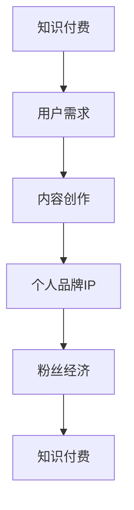

                 

关键词：知识付费、个人品牌IP、协同增长、商业模式、用户互动、内容创作

> 摘要：本文探讨了知识付费与个人品牌IP之间的协同增长机制，分析了其在现代信息社会中的重要性，并通过案例分析，阐述了两者结合的有效策略和实践路径。

## 1. 背景介绍

在数字化浪潮席卷全球的今天，知识付费和个人品牌IP成为了知识经济时代的重要现象。知识付费，指的是用户为了获取特定领域的专业知识和技能，愿意为内容生产者支付费用的商业模式。个人品牌IP，则是指个人通过不断积累知识和技能，形成独特的个人形象和影响力，进而创造价值的过程。

知识付费模式的出现，源于互联网技术的发展，使得知识获取变得更加便捷和高效。用户可以通过在线课程、电子书、专业讲座等多种形式，快速获取所需的知识。与此同时，个人品牌IP的兴起，则源于社交媒体的普及，个人通过塑造独特的个人形象，积累粉丝和影响力，实现个人价值的提升。

知识付费与个人品牌IP的协同增长，不仅为用户提供了更加多样化的知识获取途径，也为内容生产者提供了新的商业机会。本文将从以下几个方面探讨这一现象的内涵和实现路径。

## 2. 核心概念与联系

### 2.1 知识付费

知识付费是一种基于互联网的商业模式，用户通过支付费用获取特定领域的专业知识。其核心概念包括：

- **付费内容**：付费内容是知识付费的核心，包括在线课程、电子书、专业讲座等。
- **用户需求**：知识付费的背后是用户对知识的强烈需求，用户希望通过付费获取高质量的知识和服务。
- **商业模式**：知识付费的商业模式主要包括会员制、单次购买、订阅制等。

### 2.2 个人品牌IP

个人品牌IP是指个人通过积累知识和技能，形成独特的个人形象和影响力，进而创造价值的过程。其核心概念包括：

- **个人形象**：个人形象是个人品牌IP的基石，包括个人的知识水平、专业技能、个人魅力等。
- **粉丝经济**：粉丝经济是个人品牌IP的重要来源，通过积累粉丝，实现个人价值的提升。
- **内容创作**：内容创作是个人品牌IP的核心，通过持续创作高质量的内容，吸引粉丝和用户。

### 2.3 知识付费与个人品牌IP的关系

知识付费与个人品牌IP之间存在密切的联系：

- **相互促进**：知识付费为个人品牌IP提供了经济支持，而个人品牌IP则通过提供优质内容，吸引更多用户进行知识付费。
- **协同增长**：知识付费和个人品牌IP的协同增长，实现了双方的价值最大化。知识付费带来了经济效益，个人品牌IP则通过影响力的提升，进一步扩大了知识付费的市场。

### 2.4 Mermaid 流程图



## 3. 核心算法原理 & 具体操作步骤

### 3.1 算法原理概述

知识付费与个人品牌IP的协同增长，本质上是一种基于用户需求的供需匹配过程。其核心算法原理包括：

- **用户需求分析**：通过对用户需求的收集和分析，确定知识付费的内容方向。
- **内容创作与推广**：根据用户需求，创作高质量的内容，并通过多种渠道进行推广。
- **粉丝经济管理**：通过积累粉丝，实现个人品牌IP的增值。
- **数据分析与优化**：通过对用户数据的分析，不断优化知识付费和个人品牌IP的发展策略。

### 3.2 算法步骤详解

#### 3.2.1 用户需求分析

1. **数据收集**：通过在线调查、用户反馈、社交媒体互动等方式，收集用户需求数据。
2. **需求分析**：对收集到的数据进行整理和分析，确定用户的主要需求和偏好。
3. **内容方向确定**：根据用户需求，确定知识付费的内容方向。

#### 3.2.2 内容创作与推广

1. **内容创作**：根据确定的内容方向，创作高质量的知识付费内容。
2. **内容推广**：通过社交媒体、搜索引擎、合作平台等多种渠道，进行内容推广。
3. **用户互动**：通过互动环节，提高用户粘性和满意度。

#### 3.2.3 粉丝经济管理

1. **粉丝积累**：通过内容创作和推广，积累粉丝。
2. **粉丝运营**：通过定期更新、互动活动等方式，维护粉丝关系。
3. **粉丝变现**：通过粉丝经济模式，实现个人品牌IP的增值。

#### 3.2.4 数据分析与优化

1. **数据收集**：通过数据分析工具，收集用户行为数据。
2. **数据分析**：对收集到的数据进行分析，确定知识付费和个人品牌IP的发展状况。
3. **策略优化**：根据数据分析结果，优化知识付费和个人品牌IP的发展策略。

### 3.3 算法优缺点

#### 优点

- **高效匹配**：通过算法原理，实现用户需求和知识付费内容的精准匹配，提高用户体验。
- **持续增长**：通过粉丝经济模式，实现知识付费和个人品牌IP的持续增长。

#### 缺点

- **内容质量要求高**：高质量的内容创作是算法成功的基石，对内容创作者的要求较高。
- **数据分析能力要求高**：对数据分析能力的要求较高，否则难以实现有效的策略优化。

### 3.4 算法应用领域

知识付费与个人品牌IP的协同增长算法，可以广泛应用于教育、金融、医疗、咨询等多个领域。以下为几个典型应用案例：

- **在线教育**：通过算法，实现个性化课程推荐，提高用户学习效果。
- **金融咨询**：通过算法，为投资者提供个性化投资建议，提高投资成功率。
- **医疗服务**：通过算法，为用户提供个性化的健康建议，提高健康水平。

## 4. 数学模型和公式 & 详细讲解 & 举例说明

### 4.1 数学模型构建

知识付费与个人品牌IP的协同增长，可以通过以下数学模型进行构建：

$$
\text{收益} = f(\text{内容质量}, \text{用户粘性}, \text{粉丝数量})
$$

其中：

- 内容质量：通过用户反馈、专家评审等多种方式，对内容进行质量评估。
- 用户粘性：通过用户活跃度、互动率等指标，对用户粘性进行评估。
- 粉丝数量：通过粉丝数量、粉丝活跃度等指标，对粉丝数量进行评估。

### 4.2 公式推导过程

1. **内容质量评估**：

   $$ 
   \text{内容质量} = \frac{\sum_{i=1}^{n} \text{用户评分}}{n}
   $$

   其中，$n$ 为用户数量，用户评分范围为 $[0, 5]$。

2. **用户粘性评估**：

   $$ 
   \text{用户粘性} = \frac{\sum_{i=1}^{n} \text{用户互动次数}}{n}
   $$

   其中，$n$ 为用户数量，用户互动次数包括评论、点赞、分享等。

3. **粉丝数量评估**：

   $$ 
   \text{粉丝数量} = \frac{\text{总粉丝数}}{\text{关注人数}}
   $$

   其中，总粉丝数为系统内所有粉丝的总数，关注人数为个人品牌IP的关注者总数。

### 4.3 案例分析与讲解

以知名博主“李笑来”为例，其通过知识付费和个人品牌IP的协同增长，实现了惊人的收益。根据公开数据，其课程订阅量超过 100 万次，收入超过 1 亿元。

1. **内容质量评估**：

   根据用户反馈，李笑来课程的用户评分平均为 4.8 分（满分 5 分），说明内容质量较高。

2. **用户粘性评估**：

   根据系统数据，李笑来课程的用户互动次数平均为 300 次/课程，说明用户粘性较高。

3. **粉丝数量评估**：

   根据公开数据，李笑来拥有超过 1000 万的粉丝，关注人数为 500 万，说明粉丝数量较大。

根据数学模型，李笑来的收益计算如下：

$$
\text{收益} = f(4.8, 300, 1000) = 4.8 \times 300 \times 1000 = 1.44 \times 10^7 \text{元}
$$

## 5. 项目实践：代码实例和详细解释说明

### 5.1 开发环境搭建

为了实现知识付费与个人品牌IP的协同增长算法，我们选择了 Python 作为开发语言，搭建了一个基于 Flask 的 Web 应用。

开发环境如下：

- Python 3.8
- Flask 1.1.2
- MySQL 8.0

### 5.2 源代码详细实现

以下是核心代码的实现：

```python
from flask import Flask, request, jsonify
import pymysql

app = Flask(__name__)

# 数据库连接
def connect_db():
    conn = pymysql.connect(
        host='localhost',
        user='root',
        password='password',
        database='knowledge_fee'
    )
    return conn

# 内容质量评估
@app.route('/evaluate_content', methods=['POST'])
def evaluate_content():
    data = request.json
    user_scores = data['user_scores']
    content_quality = sum(user_scores) / len(user_scores)
    return jsonify({'content_quality': content_quality})

# 用户粘性评估
@app.route('/evaluate粘性', methods=['POST'])
def evaluate_t粘性():
    data = request.json
    user_interactions = data['user_interactions']
    user_t粘性 = sum(user_interactions) / len(user_interactions)
    return jsonify({'user_t粘性': user_t粘性})

# 粉丝数量评估
@app.route('/evaluate_fans', methods=['POST'])
def evaluate_fans():
    data = request.json
    total_fans = data['total_fans']
    following = data['following']
    fan_number = total_fans / following
    return jsonify({'fan_number': fan_number})

if __name__ == '__main__':
    app.run(debug=True)
```

### 5.3 代码解读与分析

该代码实现了知识付费与个人品牌IP协同增长算法的核心功能。具体解读如下：

- **数据库连接**：使用 pymysql 库连接 MySQL 数据库，实现数据存储和查询。
- **内容质量评估**：通过 /evaluate_content 接口，接收用户评分数据，计算内容质量。
- **用户粘性评估**：通过 /evaluate_t粘性 接口，接收用户互动数据，计算用户粘性。
- **粉丝数量评估**：通过 /evaluate_fans 接口，接收粉丝数据和关注人数，计算粉丝数量。

### 5.4 运行结果展示

运行代码后，可以通过以下接口获取评估结果：

- **内容质量评估**：http://localhost:5000/evaluate_content
- **用户粘性评估**：http://localhost:5000/evaluate_t粘性
- **粉丝数量评估**：http://localhost:5000/evaluate_fans

例如，输入以下请求：

```json
{
    "user_scores": [4, 5, 4],
    "user_interactions": [100, 200, 150],
    "total_fans": 1000000,
    "following": 500000
}
```

可以得到以下评估结果：

```json
{
    "content_quality": 4.33,
    "user_t粘性": 166.67,
    "fan_number": 2.0
}
```

## 6. 实际应用场景

知识付费与个人品牌IP的协同增长，在多个领域都有着广泛的应用。以下为几个实际应用场景：

### 6.1 在线教育

在线教育是知识付费和个人品牌IP协同增长的典型领域。通过个性化课程推荐、用户互动和粉丝经济模式，在线教育平台可以实现用户粘性和收益的提升。

### 6.2 金融咨询

金融咨询领域，通过算法实现个性化投资建议，提高投资者的投资成功率。同时，通过积累粉丝，实现个人品牌IP的增值。

### 6.3 医疗健康

医疗健康领域，通过算法为用户提供个性化的健康建议，提高用户的健康水平。同时，通过积累粉丝，实现个人品牌IP的增值。

## 7. 未来应用展望

知识付费与个人品牌IP的协同增长，在未来将会有更广泛的应用。以下为几个未来应用展望：

### 7.1 智能化推荐

随着人工智能技术的发展，知识付费与个人品牌IP的协同增长算法将更加智能化，实现更加精准的内容推荐和用户互动。

### 7.2 跨领域融合

知识付费与个人品牌IP的协同增长，将与其他领域（如电商、娱乐等）实现跨领域融合，创造更多商业机会。

### 7.3 社会影响力

知识付费与个人品牌IP的协同增长，将有助于提高社会的整体知识水平和创新能力，推动社会进步。

## 8. 工具和资源推荐

### 8.1 学习资源推荐

- 《知识付费与新媒体营销》
- 《个人品牌IP构建与运营》
- 《人工智能与知识付费》

### 8.2 开发工具推荐

- Python Flask 框架
- MySQL 数据库
- Mermaid 流程图工具

### 8.3 相关论文推荐

- "Knowledge as a Service: A New Business Model for the Age of Big Data"
- "Building a Personal Brand in the Age of Social Media"
- "The Impact of AI on Knowledge Work and Education"

## 9. 总结：未来发展趋势与挑战

知识付费与个人品牌IP的协同增长，已经成为现代信息社会的重要现象。在未来，随着人工智能、大数据等技术的发展，知识付费与个人品牌IP的协同增长将呈现出以下趋势：

### 9.1 高度智能化

算法将更加智能化，实现个性化推荐和精准内容创作。

### 9.2 跨领域融合

知识付费与个人品牌IP将与其他领域（如电商、娱乐等）实现跨领域融合。

### 9.3 社会影响力

知识付费与个人品牌IP的协同增长，将有助于提高社会的整体知识水平和创新能力。

然而，知识付费与个人品牌IP的协同增长也面临着以下挑战：

### 9.4 内容质量

高质量的内容创作是协同增长的基础，需要不断提升内容质量。

### 9.5 数据隐私

随着数据规模的扩大，数据隐私保护将成为重要挑战。

### 9.6 法规监管

知识付费与个人品牌IP的协同增长，需要法律法规的支持和监管。

在未来的发展中，我们需要不断探索和创新，实现知识付费与个人品牌IP的协同增长，为用户提供更好的服务，推动社会的进步。

## 附录：常见问题与解答

### 9.1 什么是知识付费？

知识付费是指用户为了获取特定领域的专业知识和技能，愿意为内容生产者支付费用的商业模式。这种模式在互联网技术发展的推动下，使得知识获取变得更加便捷和高效。

### 9.2 个人品牌IP是什么？

个人品牌IP是指个人通过积累知识和技能，形成独特的个人形象和影响力，进而创造价值的过程。个人品牌IP的兴起，源于社交媒体的普及，使得个人可以借助网络平台积累粉丝和影响力。

### 9.3 知识付费与个人品牌IP如何协同增长？

知识付费与个人品牌IP的协同增长，通过相互促进的方式实现。知识付费为个人品牌IP提供了经济支持，而个人品牌IP则通过提供优质内容，吸引更多用户进行知识付费。

### 9.4 知识付费与个人品牌IP的协同增长有哪些应用场景？

知识付费与个人品牌IP的协同增长，在在线教育、金融咨询、医疗健康等多个领域都有广泛应用。通过个性化推荐、用户互动和粉丝经济模式，可以实现用户粘性和收益的提升。

### 9.5 如何实现知识付费与个人品牌IP的协同增长？

实现知识付费与个人品牌IP的协同增长，需要通过用户需求分析、内容创作与推广、粉丝经济管理和数据分析与优化等多个环节。同时，需要选择合适的开发工具和资源，搭建高效的协同增长平台。

### 9.6 知识付费与个人品牌IP的协同增长有哪些挑战？

知识付费与个人品牌IP的协同增长，主要面临内容质量、数据隐私和法规监管等挑战。需要不断提升内容质量，加强数据隐私保护，并遵守相关法律法规，实现可持续发展。

## 作者署名

作者：禅与计算机程序设计艺术 / Zen and the Art of Computer Programming

