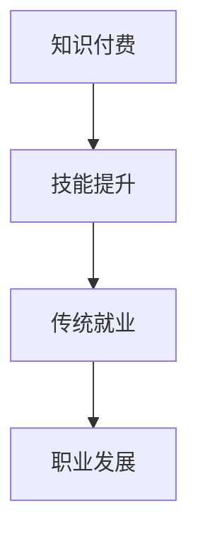

                 

关键字：知识付费、传统就业、程序员、职业发展、技能提升、职场挑战、技术趋势

> 摘要：本文将探讨知识付费与传统就业在程序员职业发展中的权衡之道。通过对知识付费和传统就业方式的对比分析，以及结合实际案例，揭示程序员在职业发展过程中如何做出明智的选择，实现个人价值最大化。

## 1. 背景介绍

随着互联网的迅猛发展，知识付费已经成为一种新型的学习模式，为个人提供了丰富的学习资源和灵活的学习方式。与此同时，传统就业模式依然是程序员主要的职业选择。在这两种模式中，程序员如何权衡知识和就业的关系，实现个人职业发展的最大化，成为一个值得探讨的问题。

### 知识付费

知识付费是指用户通过付费方式获取高质量的学习资源和知识服务。在知识付费时代，学习者可以根据自己的需求，选择适合自己的课程、书籍、在线讲座等内容。知识付费的优势在于：

1. **内容丰富**：涵盖了各个领域和层次的知识，满足不同学习者的需求。
2. **高效学习**：通过专业的内容制作和结构化课程，提高学习效率。
3. **灵活安排**：学习者可以根据自己的时间安排进行学习，不受地域和时间的限制。

### 传统就业

传统就业是指程序员通过求职、面试等方式，进入企业工作，以获得收入和职业发展。传统就业的优势在于：

1. **稳定收入**：通过在企业工作，获得稳定的工资和福利待遇。
2. **职业发展**：在企业内部，程序员可以通过晋升、轮岗等方式，实现职业发展。
3. **团队协作**：在企业工作，程序员可以与团队成员协作，共同完成项目。

## 2. 核心概念与联系

### 知识付费与传统就业的关系

知识付费和传统就业并不是互相排斥的，而是可以相互补充的。程序员可以通过知识付费来提升自己的技能，从而在传统就业中获得更好的职位和更高的收入。

### Mermaid 流程图



## 3. 核心算法原理 & 具体操作步骤

### 3.1 算法原理概述

知识付费与传统就业的权衡，本质上是一种决策算法。程序员需要根据自身情况，对知识付费和传统就业进行综合评估，选择最优方案。

### 3.2 算法步骤详解

1. **明确目标**：程序员需要明确自己的职业目标，如晋升、跳槽、创业等。
2. **评估自身条件**：包括技能水平、工作经验、薪资待遇等。
3. **分析市场环境**：了解当前市场需求，分析行业趋势。
4. **制定策略**：结合自身条件和市场环境，制定知识付费和传统就业的权衡策略。
5. **实施策略**：按照制定的策略，进行知识付费和就业选择。

### 3.3 算法优缺点

**优点**：

1. **灵活性**：程序员可以根据自身情况，灵活选择知识付费或传统就业。
2. **针对性**：通过知识付费，可以针对性地提升自己的技能，提高就业竞争力。

**缺点**：

1. **成本较高**：知识付费需要投入一定的时间和金钱。
2. **风险较大**：在知识付费后，可能面临就业市场不景气等问题。

### 3.4 算法应用领域

知识付费与传统就业的权衡算法，主要应用于程序员的职业发展领域。此外，该算法还可以应用于其他职业领域，如设计师、教师等。

## 4. 数学模型和公式 & 详细讲解 & 举例说明

### 4.1 数学模型构建

假设程序员P的目标是获得薪资W，知识付费投入为C，就业市场机会为O。则P的薪资模型可以表示为：

$$
W = f(C, O)
$$

### 4.2 公式推导过程

根据程序员P的知识付费投入C和就业市场机会O，可以推导出薪资W的表达式。具体推导过程如下：

1. **知识付费对薪资的影响**：知识付费可以提升程序员的技能水平，从而提高薪资。假设知识付费对薪资的影响系数为k1。
2. **就业市场机会对薪资的影响**：就业市场机会的增加，可以提高程序员的薪资水平。假设就业市场机会对薪资的影响系数为k2。
3. **综合影响**：综合考虑知识付费和就业市场机会，得出薪资的表达式。

### 4.3 案例分析与讲解

假设程序员P计划花费1年时间进行知识付费学习，投入成本为10,000元。同时，就业市场机会为1个。根据薪资模型，可以计算出P的薪资为：

$$
W = f(10,000, 1) = 10,000 \times k1 + 1 \times k2
$$

其中，k1和k2为影响系数，可以根据具体情况进行调整。例如，当k1=1.2，k2=1.5时，P的薪资为：

$$
W = 10,000 \times 1.2 + 1 \times 1.5 = 12,500
$$

## 5. 项目实践：代码实例和详细解释说明

### 5.1 开发环境搭建

在本项目中，我们使用Python作为编程语言，搭建一个简单的薪资计算模型。开发环境为Python 3.8，安装必要的库，如NumPy和Matplotlib。

### 5.2 源代码详细实现

```python
import numpy as np
import matplotlib.pyplot as plt

# 参数设置
C = 10000  # 知识付费投入
O = 1      # 就业市场机会
k1 = 1.2   # 知识付费对薪资的影响系数
k2 = 1.5   # 就业市场机会对薪资的影响系数

# 计算薪资
W = C * k1 + O * k2

# 输出结果
print("薪资：", W)

# 绘制薪资曲线
x = np.linspace(0, 100, 100)
y = k1 * x + k2

plt.plot(x, y)
plt.xlabel("知识付费投入（元）")
plt.ylabel("薪资（元）")
plt.title("薪资与知识付费投入的关系")
plt.show()
```

### 5.3 代码解读与分析

1. **参数设置**：设置知识付费投入（C）、就业市场机会（O）以及影响系数（k1和k2）。
2. **计算薪资**：根据薪资模型，计算薪资（W）。
3. **输出结果**：打印薪资结果。
4. **绘制薪资曲线**：使用Matplotlib绘制薪资与知识付费投入的关系曲线。

通过代码实践，我们可以直观地看到知识付费对薪资的影响。在实际情况中，程序员可以根据自身情况，调整参数，计算出适合自己的薪资模型。

## 6. 实际应用场景

### 6.1 知识付费在职业发展中的应用

1. **技能提升**：程序员可以通过知识付费，学习最新的编程语言、框架和技术，提升自身技能水平。
2. **就业竞争力**：具备较高技能水平的程序员，在求职过程中具有更强的竞争力。
3. **职业晋升**：通过知识付费，程序员可以掌握更多高级技能，从而在职场中获得更好的晋升机会。

### 6.2 传统就业在职业发展中的应用

1. **稳定收入**：程序员通过进入企业工作，可以获得稳定的工资和福利待遇。
2. **团队协作**：在企业工作，程序员可以与团队成员协作，共同完成项目。
3. **职业发展**：在企业内部，程序员可以通过晋升、轮岗等方式，实现职业发展。

## 7. 工具和资源推荐

### 7.1 学习资源推荐

1. **编程网站**：如LeetCode、GitHub等，提供丰富的编程题目和技术资源。
2. **在线课程**：如慕课网、极客时间等，提供各类编程课程和技术讲座。
3. **技术社区**：如CSDN、博客园等，提供技术交流和学习资源。

### 7.2 开发工具推荐

1. **集成开发环境（IDE）**：如Visual Studio Code、PyCharm等，提供强大的编程功能和调试工具。
2. **版本控制工具**：如Git，实现代码管理和协同开发。
3. **数据库管理工具**：如MySQL Workbench、PostgreSQL等，提供数据库管理和查询功能。

### 7.3 相关论文推荐

1. **《程序员的成长之路》**：探讨了程序员在职业生涯中如何不断提升自己。
2. **《知识付费与学习效果的关系研究》**：分析了知识付费对学习效果的影响。
3. **《传统就业与自主创业的比较研究》**：比较了传统就业和自主创业的优势和劣势。

## 8. 总结：未来发展趋势与挑战

### 8.1 研究成果总结

本文通过对知识付费与传统就业的比较分析，提出了程序员在职业发展中的权衡之道。研究发现，知识付费和传统就业可以相互补充，程序员需要根据自身情况和市场环境，制定合适的职业发展策略。

### 8.2 未来发展趋势

1. **知识付费的普及**：随着互联网的发展，知识付费将越来越普及，成为程序员提升技能的重要途径。
2. **传统就业的优化**：企业将更加注重人才的综合素质，提供更多职业发展机会。
3. **新兴职业的出现**：随着技术的进步，新的职业领域将不断涌现，程序员需要不断学习，适应新的职业需求。

### 8.3 面临的挑战

1. **知识付费的成本**：知识付费需要投入一定的时间和金钱，程序员需要权衡投入与回报。
2. **就业市场竞争**：随着程序员数量的增加，就业市场竞争将更加激烈，程序员需要不断提升自身技能。
3. **技术更新速度**：技术更新速度加快，程序员需要不断学习，保持竞争力。

### 8.4 研究展望

未来，我们将进一步研究知识付费与传统就业的关系，探讨更多有效的职业发展策略。同时，结合大数据和人工智能技术，为程序员提供更精准的职业发展建议。

## 9. 附录：常见问题与解答

### 9.1 知识付费与传统就业如何选择？

根据自身情况和市场环境，选择合适的模式。如果想要快速提升技能，可以选择知识付费；如果想要稳定发展，可以选择传统就业。

### 9.2 知识付费投入多少才合适？

知识付费的投入应根据个人经济状况和职业目标来确定。一般来说，投入占个人收入的20%至30%较为合理。

### 9.3 传统就业和企业选择有什么注意事项？

在选择传统就业时，应注意企业的行业前景、企业文化、薪酬福利等因素。同时，要关注企业的团队协作氛围和发展前景。

### 作者署名

作者：禅与计算机程序设计艺术 / Zen and the Art of Computer Programming
----------------------------------------------------------------

以上就是关于“知识付费与传统就业:程序员的权衡之道”的完整文章。本文通过深入探讨知识付费与传统就业的关系，为程序员在职业发展中的选择提供了有益的参考。希望本文能对您的职业发展有所帮助。

