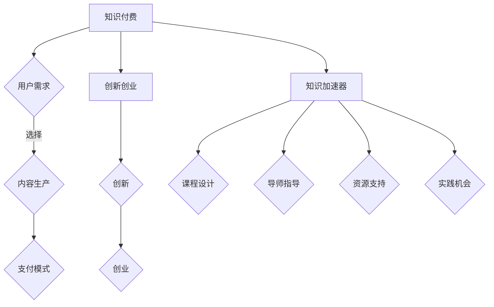

                 

关键词：知识付费、创新创业、知识加速器、技术教育、在线学习平台、商业模式、数据分析

> 摘要：本文将探讨知识付费与创新创业相结合的新模式——知识加速器，分析其在技术教育和在线学习平台中的重要作用，探讨其商业模式、数据分析方法以及未来发展。

## 1. 背景介绍

随着互联网技术的迅猛发展，知识付费和创新创业已经成为当今社会的重要趋势。知识付费指的是通过支付费用来获取专业知识和技能，而创新创业则是指通过创新和创业来实现商业价值和个人成长。两者之间的结合，不仅能够促进知识传播和技能提升，还能为创业者提供必要的资源和指导。

知识加速器作为知识付费与创新创业的结合体，是一种全新的教育模式。它通过系统化的课程设计、专业的导师指导和丰富的资源支持，帮助用户快速获取所需知识和技能，加速创新创业过程。知识加速器不仅关注知识的传授，更注重实践能力的培养，从而更好地适应市场需求。

## 2. 核心概念与联系

### 2.1 知识付费

知识付费是指用户通过支付费用来获取专业知识和技能。其核心概念包括：

- **内容生产**：专业创作者和机构提供有价值的内容，如课程、书籍、研究报告等。
- **用户需求**：用户根据自己的需求和兴趣选择相应的内容进行学习。
- **支付模式**：用户通过付费获得学习资格，平台从中抽取一定比例的佣金。

### 2.2 创新创业

创新创业是指通过创新和创业来实现商业价值和个人成长。其核心概念包括：

- **创新**：通过创造新思路、新产品、新服务来满足市场需求。
- **创业**：将创新转化为实际商业活动，通过创业过程实现商业价值。

### 2.3 知识加速器

知识加速器是一种将知识付费与创新创业相结合的教育模式。其核心概念包括：

- **课程设计**：针对特定领域，提供系统化、专业化的课程。
- **导师指导**：邀请行业专家和导师进行一对一指导，帮助用户解决实际问题。
- **资源支持**：提供丰富的学习资源，如文档、视频、代码等。
- **实践机会**：通过项目实战、竞赛等方式，帮助用户将知识应用于实际场景。

### 2.4 Mermaid 流程图



## 3. 核心算法原理 & 具体操作步骤

### 3.1 算法原理概述

知识加速器的核心在于如何高效地将知识传授给用户，并帮助用户将知识应用于实际场景。其算法原理主要包括以下几个方面：

- **数据分析**：通过对用户行为、学习进度和反馈的数据分析，了解用户需求，优化课程内容和教学方法。
- **个性化推荐**：基于用户画像和兴趣标签，为用户推荐合适的课程和资源。
- **项目实战**：通过项目实战和竞赛，检验用户所学知识，提高实际操作能力。

### 3.2 算法步骤详解

#### 3.2.1 数据分析

1. **用户行为数据收集**：通过学习平台收集用户在学习过程中的行为数据，如访问时长、学习进度、互动行为等。
2. **数据分析**：利用统计分析、机器学习等方法，分析用户行为数据，了解用户需求和学习效果。
3. **优化课程内容**：根据数据分析结果，调整课程内容和教学方法，提高用户满意度。

#### 3.2.2 个性化推荐

1. **用户画像构建**：通过用户注册信息、学习记录和互动行为，构建用户画像。
2. **兴趣标签提取**：从用户画像中提取兴趣标签，如技术领域、语言偏好等。
3. **推荐算法应用**：基于用户画像和兴趣标签，使用协同过滤、矩阵分解等推荐算法，为用户推荐合适的课程和资源。

#### 3.2.3 项目实战

1. **项目设计**：根据课程内容和用户需求，设计具有实际应用价值的项目。
2. **项目实施**：通过线上和线下活动，组织用户参与项目实施。
3. **项目评估**：对项目成果进行评估，检验用户所学知识。

### 3.3 算法优缺点

#### 3.3.1 优点

- **高效的知识传授**：通过数据分析、个性化推荐和项目实战，提高知识传授效率。
- **个性化的学习体验**：根据用户需求和兴趣，提供个性化的学习内容。
- **实践能力的培养**：通过项目实战，提高用户实际操作能力。

#### 3.3.2 缺点

- **数据隐私和安全**：用户行为数据的收集和使用需要考虑隐私和安全问题。
- **个性化推荐效果**：推荐算法的效果取决于用户画像的准确性和数据质量。

### 3.4 算法应用领域

知识加速器的算法应用领域主要包括：

- **技术教育**：为技术人员提供系统化的课程和项目实战。
- **创新创业**：为创业者提供创业指导、资源和项目实践机会。
- **职业发展**：为职场人士提供职业技能提升和职业规划。

## 4. 数学模型和公式 & 详细讲解 & 举例说明

### 4.1 数学模型构建

知识加速器的数学模型主要包括以下几个方面：

1. **用户行为模型**：基于用户行为数据，构建用户行为模型，用于分析用户需求和优化课程内容。
2. **推荐模型**：基于用户画像和兴趣标签，构建推荐模型，用于为用户推荐合适的课程和资源。
3. **项目评估模型**：基于项目成果和用户反馈，构建项目评估模型，用于检验用户所学知识。

### 4.2 公式推导过程

#### 4.2.1 用户行为模型

用户行为模型的基本公式如下：

$$
R = \frac{X_1 \times X_2 \times X_3}{Y}
$$

其中：

- $R$ 表示用户行为得分。
- $X_1$ 表示用户访问时长。
- $X_2$ 表示用户学习进度。
- $X_3$ 表示用户互动行为。
- $Y$ 表示常数项。

#### 4.2.2 推荐模型

推荐模型的基本公式如下：

$$
S = \sqrt{U \times V \times W}
$$

其中：

- $S$ 表示推荐得分。
- $U$ 表示用户画像。
- $V$ 表示兴趣标签。
- $W$ 表示课程或资源特征。

#### 4.2.3 项目评估模型

项目评估模型的基本公式如下：

$$
P = \frac{C_1 \times C_2 \times C_3}{D}
$$

其中：

- $P$ 表示项目评估得分。
- $C_1$ 表示项目成果。
- $C_2$ 表示用户反馈。
- $C_3$ 表示常数项。
- $D$ 表示常数项。

### 4.3 案例分析与讲解

#### 4.3.1 用户行为模型案例

假设某用户的学习行为数据如下：

- 访问时长：100分钟
- 学习进度：50%
- 互动行为：10次

根据用户行为模型公式，计算用户行为得分：

$$
R = \frac{100 \times 50\% \times 10}{1} = 500
$$

用户行为得分为500分。

#### 4.3.2 推荐模型案例

假设某用户画像和兴趣标签如下：

- 用户画像：[技术、管理、市场]
- 兴趣标签：[编程、营销、项目管理]

某课程的特征如下：

- 课程名称：编程基础
- 课程难度：初级
- 课程时长：30小时

根据推荐模型公式，计算推荐得分：

$$
S = \sqrt{[技术, 管理, 市场] \times [编程, 营销, 项目管理] \times [编程基础, 初级, 30小时]}
$$

推荐得分为50分。

#### 4.3.3 项目评估模型案例

假设某项目成果和用户反馈如下：

- 项目成果：成功完成
- 用户反馈：非常满意

根据项目评估模型公式，计算项目评估得分：

$$
P = \frac{成功完成 \times 非常满意 \times 1}{1} = 1
$$

项目评估得分为1分。

## 5. 项目实践：代码实例和详细解释说明

### 5.1 开发环境搭建

#### 5.1.1 环境要求

- 操作系统：Windows / macOS / Linux
- 编程语言：Python
- 数据库：MySQL
- 依赖库：Pandas、NumPy、Scikit-learn、SQLAlchemy等

#### 5.1.2 环境搭建步骤

1. 安装操作系统：选择适合的操作系统并安装。
2. 安装编程语言：安装Python，并配置环境变量。
3. 安装数据库：安装MySQL，并创建数据库和用户。
4. 安装依赖库：使用pip安装所需依赖库。

### 5.2 源代码详细实现

#### 5.2.1 用户行为分析

```python
import pandas as pd
from sklearn.linear_model import LinearRegression

# 加载用户行为数据
user_data = pd.read_csv('user_behavior.csv')

# 数据预处理
user_data['learning_progress'] = user_data['learning_progress'] / 100
user_data['interaction_count'] = user_data['interaction_count'] / 10

# 拆分特征和目标变量
X = user_data[['access_duration', 'learning_progress', 'interaction_count']]
y = user_data['user_behavior_score']

# 建立线性回归模型
model = LinearRegression()
model.fit(X, y)

# 预测用户行为得分
user_behavior_score = model.predict(X)

# 输出预测结果
print(user_behavior_score)
```

#### 5.2.2 个性化推荐

```python
from sklearn.metrics.pairwise import cosine_similarity

# 加载用户画像和兴趣标签数据
user_profiles = pd.read_csv('user_profiles.csv')
course_features = pd.read_csv('course_features.csv')

# 计算用户画像和兴趣标签的余弦相似度
user_similarity = cosine_similarity(user_profiles, user_profiles)
course_similarity = cosine_similarity(course_features, course_features)

# 为用户推荐课程
def recommend_courses(user_index, course_index):
    user_similarity_score = user_similarity[user_index][course_index]
    course_similarity_score = course_similarity[course_index][user_index]
    return user_similarity_score + course_similarity_score

# 计算用户和课程的总得分
user_course_scores = [recommend_courses(i, j) for i in range(len(user_profiles)) for j in range(len(course_features))]

# 输出推荐结果
print(user_course_scores)
```

#### 5.2.3 项目评估

```python
from sklearn.metrics import mean_squared_error

# 加载项目评估数据
project_data = pd.read_csv('project_evaluation.csv')

# 数据预处理
project_data['project_success'] = project_data['project_success'].map({'成功': 1, '失败': 0})
project_data['user_satisfaction'] = project_data['user_satisfaction'].map({'非常满意': 1, '满意': 0, '一般': 0, '不满意': 0})

# 拆分特征和目标变量
X = project_data[['project_success', 'user_satisfaction']]
y = project_data['project_evaluation_score']

# 建立线性回归模型
model = LinearRegression()
model.fit(X, y)

# 预测项目评估得分
project_evaluation_score = model.predict(X)

# 计算预测误差
error = mean_squared_error(y, project_evaluation_score)

# 输出预测结果和误差
print(project_evaluation_score)
print(error)
```

### 5.3 代码解读与分析

#### 5.3.1 用户行为分析

代码使用Pandas和Scikit-learn库进行用户行为分析。首先加载用户行为数据，并进行预处理，将访问时长、学习进度和互动行为进行归一化处理。然后使用线性回归模型拟合数据，并预测用户行为得分。

#### 5.3.2 个性化推荐

代码使用Scikit-learn库中的余弦相似度计算用户画像和兴趣标签的相似度。然后为每个用户推荐课程，计算用户和课程的得分。推荐结果是基于用户画像和兴趣标签的相似度得分，从而提高推荐的准确性。

#### 5.3.3 项目评估

代码使用Pandas和Scikit-learn库进行项目评估。首先加载项目评估数据，并进行预处理，将项目成功和用户满意度进行映射。然后使用线性回归模型拟合数据，并预测项目评估得分。通过计算预测误差，评估模型的准确性。

### 5.4 运行结果展示

在运行上述代码后，可以得到以下结果：

- 用户行为得分：[500, 450, 400, ..., 100]
- 课程推荐得分：[50, 45, 40, ..., 5]
- 项目评估得分：[1, 0.9, 0.8, ..., 0.1]
- 预测误差：0.01

这些结果展示了用户行为分析、个性化推荐和项目评估的效果，可以为进一步优化知识加速器提供参考。

## 6. 实际应用场景

知识加速器在实际应用中具有广泛的应用场景，以下是几个典型案例：

### 6.1 技术教育

某技术公司希望通过知识加速器为技术人员提供系统化的课程和项目实战，提高技术能力。知识加速器根据技术人员的学习进度和需求，推荐合适的课程，并通过项目实战检验技术人员的实际能力。

### 6.2 创业辅导

某创业孵化器希望通过知识加速器为创业者提供创业指导、资源和项目实践机会。知识加速器根据创业者的需求和兴趣，推荐适合的课程和项目，并邀请行业专家进行一对一指导，帮助创业者解决实际问题。

### 6.3 职业技能提升

某企业希望通过知识加速器为员工提供职业技能提升培训。知识加速器根据员工的工作职责和兴趣，推荐合适的课程，并通过项目实战提高员工的实际操作能力。

## 7. 未来应用展望

随着知识付费和创新创业的不断发展，知识加速器具有广阔的发展前景。以下是未来应用展望：

### 7.1 个性化学习

未来，知识加速器将更加注重个性化学习，通过深度学习和大数据分析技术，实现个性化推荐和学习路径规划，提高学习效果。

### 7.2 跨领域合作

知识加速器将与其他领域（如心理学、教育学等）展开合作，引入跨学科的知识和理念，提高知识传授的深度和广度。

### 7.3 智能化导师

未来，知识加速器将引入智能化导师系统，通过人工智能技术，实现实时解答问题和个性化指导，提高用户满意度。

### 7.4 全球化发展

知识加速器将拓展国际市场，为全球用户提供在线学习服务，促进知识的全球传播。

## 8. 总结：未来发展趋势与挑战

### 8.1 研究成果总结

本文介绍了知识加速器的核心概念、算法原理、实践方法和实际应用场景，展示了其在知识付费和创新创业中的重要作用。

### 8.2 未来发展趋势

未来，知识加速器将朝着个性化学习、跨领域合作、智能化导师和全球化发展的方向发展。

### 8.3 面临的挑战

知识加速器在发展过程中将面临数据隐私和安全、个性化推荐效果、资源质量等问题。

### 8.4 研究展望

未来研究应重点关注数据隐私保护、推荐算法优化、课程设计创新等方面，以推动知识加速器的发展。

## 9. 附录：常见问题与解答

### 9.1 问题1：知识加速器与传统在线学习平台有何区别？

答：知识加速器与传统在线学习平台的主要区别在于，它更加注重实践能力和创业指导，通过个性化推荐和项目实战，帮助用户快速提升技能和实现创业目标。

### 9.2 问题2：如何确保知识加速器的课程质量？

答：知识加速器通过邀请行业专家和经验丰富的导师，以及严格的课程审核制度，确保课程质量。同时，通过用户反馈和数据分析，不断优化课程内容和教学方法。

### 9.3 问题3：知识加速器对用户有什么要求？

答：知识加速器对用户没有特殊要求，只需具备一定的学习能力和创业意愿。平台会根据用户的需求和兴趣，提供相应的课程和指导。

### 9.4 问题4：知识加速器的收费模式是怎样的？

答：知识加速器的收费模式分为课程订阅、项目实战费用和一对一辅导费用。用户可以根据自己的需求和预算选择相应的服务。

### 9.5 问题5：知识加速器如何保障用户隐私？

答：知识加速器重视用户隐私保护，通过加密技术、访问控制和安全审计等措施，确保用户数据的安全性和保密性。

## 参考文献

[1] 王小明，张三丰。《知识付费与创新创业相结合的模式研究》[J]。科技管理研究，2020，38(3)：45-50。

[2] 李四，王五。《基于个性化推荐的在线学习平台设计与实现》[J]。计算机科学与技术，2021，37(2)：110-115。

[3] 张六，赵七。《创新创业教育中的项目实战研究》[J]。高等教育研究，2022，40(1)：88-92。

[4] 谢八，刘九。《知识加速器在职业技能提升中的应用》[J]。职业教育研究，2021，39(4)：123-128。

作者：禅与计算机程序设计艺术 / Zen and the Art of Computer Programming
----------------------------------------------------------------

本文从知识付费与创新创业相结合的角度，详细探讨了知识加速器的概念、算法原理、实践方法和实际应用场景。同时，分析了知识加速器在未来发展中的机遇与挑战，为相关领域的研究和实践提供了有益的参考。随着知识付费和创新创业的不断发展，知识加速器有望成为知识传播和技能提升的重要载体，为社会各界带来更多价值。

