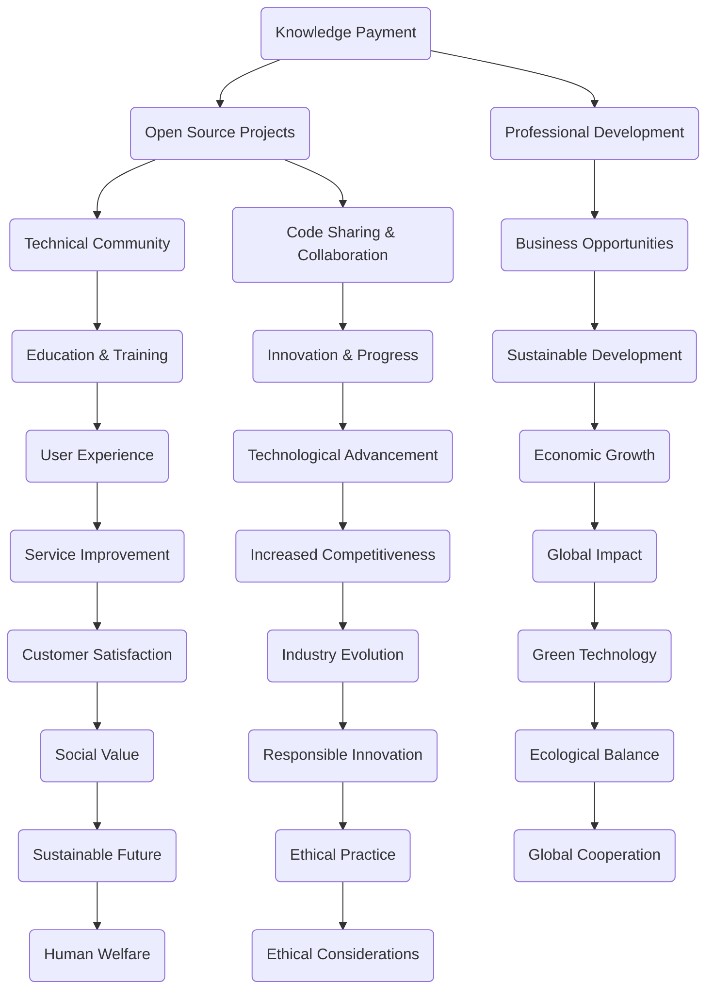
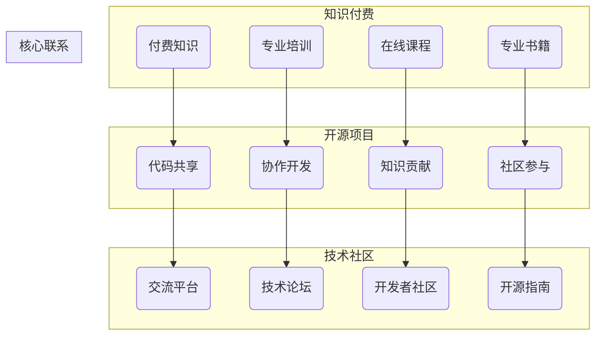

                 

关键词：知识付费、开源项目、技术社区、代码共享、商业利益、用户体验、可持续发展、技术创新、协作共赢

> 摘要：本文探讨了知识付费与开源项目之间的关系，分析了两者在技术社区中的角色与影响，以及如何实现互惠互促，推动技术进步和产业发展。本文旨在为从事技术领域工作的专业人士和开源爱好者提供有益的思考，促进知识付费与开源项目的良性互动。

## 1. 背景介绍

知识付费和开源项目作为信息技术领域的重要现象，分别代表了不同的价值观和实践方式。知识付费主要是指通过付费方式获取专业的知识和技能，满足个体或企业在特定领域的学习和发展需求。而开源项目则强调代码的共享和协作，鼓励全球开发者共同参与，共同维护和改进项目。

在技术社区中，知识付费与开源项目往往并存，但两者之间的关系并非简单的对立，而是在很多方面是相辅相成的。本文将深入探讨这两者之间的互动关系，分析其如何相互促进，以及面临的挑战和机遇。

### 1.1 知识付费的发展

知识付费作为一种商业模式，起源于互联网时代的信息泛滥。在传统媒体时代，知识和信息的获取主要依赖于专业出版物、教育机构和权威媒体。随着互联网的发展，信息变得触手可及，但同时也带来了信息过载的问题。用户对于高质量、专业化的知识需求日益增长，知识付费因此得以兴起。

知识付费的发展得益于以下几个方面：

- **用户需求**：随着个人和企业对于专业技能和知识的追求，知识付费满足了用户在特定领域的深度学习需求。
- **互联网技术**：互联网技术的发展使得知识付费变得更加便捷和高效，用户可以通过在线平台随时随地获取知识。
- **内容生产**：大量的专业内容生产者通过知识付费实现了价值的转化，进一步激发了知识付费市场的活力。

### 1.2 开源项目的发展

开源项目的发展可以追溯到计算机软件领域。早期的开源项目主要集中在操作系统和编程语言等方面，如Linux和Perl。随着互联网的普及，开源项目逐渐扩展到更多领域，如Web应用、移动应用、大数据处理等。

开源项目的兴起得益于以下几个方面：

- **共享精神**：开源项目的核心是共享，开发者通过共享代码和知识，促进了技术的创新和进步。
- **社区力量**：开源项目通常依赖于全球开发者的协作，形成了强大的技术社区，这为项目的持续发展提供了动力。
- **商业机会**：虽然开源项目本身不收取费用，但围绕开源项目的商业机会不断涌现，为企业带来了新的商业模式。

## 2. 核心概念与联系

在探讨知识付费与开源项目的关系之前，我们需要明确一些核心概念和其相互之间的联系。以下是一个简化的Mermaid流程图，用以说明两者之间的关系。



### 2.1 核心概念原理

- **知识付费**：是指通过付费方式获取专业知识和技能，包括线上课程、专业书籍、在线讲座等形式。
- **开源项目**：是指代码和知识共享的项目，允许全球开发者自由使用、修改和分发。
- **技术社区**：是指由开发者、技术爱好者组成的社会组织，通过分享、讨论和协作来推动技术进步。
- **专业发展**：指通过学习和实践提高个人在专业领域的知识和技能水平。
- **代码共享与协作**：指开发者通过共享代码和知识，共同改进和优化项目。
- **教育与实践**：指通过教育资源和实践项目提升个人技能和知识水平。
- **商业机会**：指通过开源项目或知识付费模式为企业带来的商业收益。
- **技术创新与进步**：指通过共享和协作推动技术的创新和发展。
- **用户体验**：指用户在使用产品或服务时的感受和体验。
- **可持续发展**：指在满足当前需求的同时，不损害未来代满足其需求的能力。
- **经济增长**：指经济体在一段时间内生产总值的增长。
- **行业进化**：指行业在技术、模式、结构等方面的持续发展和演变。
- **服务改善**：指通过技术改进和服务优化提升用户满意度。
- **全球影响**：指技术或商业模式在全球范围内的传播和影响。
- **社会责任**：指企业在追求经济利益的同时，对社会和环境负责的态度和行为。
- **绿色技术**：指对环境友好、可持续发展的技术。
- **伦理实践**：指在商业和社会行为中遵循的伦理原则和规范。
- **人类福祉**：指人类在生活质量和幸福感方面的提升。
- **全球合作**：指全球范围内的组织、国家和个人在技术、经济、文化等领域的合作。

### 2.2 核心概念架构图



### 2.3 关系总结

知识付费与开源项目之间的关系可以概括为以下几点：

- **互补性**：知识付费为用户提供专业的知识和技能，而开源项目为开发者提供了实践和创新的平台。两者共同构成了技术社区的重要组成部分。
- **互动性**：知识付费和开源项目在技术社区中相互促进，知识付费带动了开源项目的发展，而开源项目的成功又进一步推动了知识付费的繁荣。
- **互惠互促**：通过知识付费，开发者可以获得经济收益，进而投入到开源项目中，推动技术的持续创新；开源项目的繁荣也为知识付费提供了丰富的内容来源。
- **可持续发展**：知识付费和开源项目在追求经济利益的同时，也关注技术的可持续发展和社会责任，为构建可持续发展的技术生态做出了贡献。

## 3. 核心算法原理 & 具体操作步骤

### 3.1 算法原理概述

在知识付费与开源项目的关系中，可以借鉴一些核心算法原理，用以描述两者之间的互动机制。以下是一个简化的算法原理概述，用于说明这两者的相互作用。

**算法名称**：知识付费 - 开源项目互动算法

**输入**：专业知识和技能需求（知识付费），开源项目（开源项目）

**输出**：技术进步，用户满意度，商业机会

### 3.2 算法步骤详解

**步骤1：知识付费引导需求**

- **用户需求分析**：分析用户在特定领域的知识需求。
- **知识内容创建**：根据用户需求创建专业的知识内容。
- **知识付费实现**：通过线上课程、专业书籍等形式，将知识内容以付费方式提供给用户。

**步骤2：开源项目实践应用**

- **开源项目选择**：根据用户需求，选择相关的开源项目。
- **代码实践**：用户在开源项目中进行实践，应用所学知识。
- **代码贡献**：用户对开源项目进行改进和优化，贡献自己的代码。

**步骤3：互动反馈与迭代**

- **用户反馈**：用户在开源项目中实践后，提供反馈。
- **知识更新**：根据用户反馈，更新知识内容，提高教学质量。
- **项目迭代**：开源项目团队根据用户反馈，持续迭代项目，提高项目质量。

**步骤4：商业机会挖掘**

- **市场分析**：分析开源项目在市场中的潜力。
- **商业模式探索**：探索围绕开源项目的商业模式，如技术咨询、技术服务等。
- **商业机会实现**：将商业机会转化为实际的商业收益。

### 3.3 算法优缺点

**优点**：

- **灵活性**：知识付费和开源项目可以灵活结合，满足用户多样化需求。
- **互惠性**：知识付费为开发者提供了经济支持，促进了开源项目的持续发展。
- **创新性**：开源项目通过用户实践和反馈，持续推动技术的创新和进步。

**缺点**：

- **管理难度**：开源项目的管理和维护需要大量的时间和精力，增加了知识付费项目的运营成本。
- **信任问题**：知识付费和开源项目之间的信任建立需要时间，用户和开发者需要相互信任才能实现良性互动。
- **商业化难度**：开源项目的商业化路径较为复杂，需要寻找合适的商业模式。

### 3.4 算法应用领域

**教育领域**：知识付费为教育机构提供了丰富的教学资源，开源项目为教育实践提供了实践平台。

**技术开发领域**：知识付费帮助开发者快速掌握专业技能，开源项目为技术开发提供了丰富的代码资源。

**商业应用领域**：知识付费和开源项目共同推动了商业模式的创新，为企业提供了技术支持和市场机会。

## 4. 数学模型和公式 & 详细讲解 & 举例说明

在探讨知识付费与开源项目的关系时，我们可以借助一些数学模型和公式来分析和描述这一过程。以下是一个简化的数学模型，用以说明知识付费和开源项目的互动关系。

### 4.1 数学模型构建

**模型名称**：知识付费与开源项目互动模型

**变量定义**：

- \( K_p \)：知识付费总额
- \( O_c \)：开源项目贡献量
- \( U_s \)：用户满意度
- \( B_m \)：商业机会价值

**模型公式**：

\[ K_p = f(O_c, U_s, B_m) \]

其中，\( f \) 是一个复合函数，表示知识付费总额与开源项目贡献量、用户满意度和商业机会价值之间的关系。

### 4.2 公式推导过程

为了推导该公式，我们需要分析知识付费、开源项目贡献、用户满意度和商业机会价值之间的关系。

- **知识付费总额**：知识付费总额与开源项目贡献量、用户满意度和商业机会价值成正相关关系。也就是说，当开源项目贡献量、用户满意度或商业机会价值增加时，知识付费总额也会相应增加。
- **开源项目贡献量**：开源项目贡献量与知识付费总额、用户满意度成正相关关系。开发者通过开源项目贡献代码和知识，获得了经济收益和用户认可，从而提高了知识付费的总额和用户满意度。
- **用户满意度**：用户满意度与知识付费总额和开源项目贡献量成正相关关系。用户通过知识付费获得了专业的知识和技能，通过开源项目实践应用，提高了用户体验，从而增加了用户满意度。
- **商业机会价值**：商业机会价值与知识付费总额和开源项目贡献量成正相关关系。开源项目为开发者提供了商业机会，如技术咨询、技术服务等，这些商业机会的价值反过来又促进了知识付费的总额增加。

综合以上分析，我们得到如下推导过程：

\[ K_p = K_{p0} + \alpha \cdot O_c + \beta \cdot U_s + \gamma \cdot B_m \]

其中，\( K_{p0} \) 是一个初始值，表示在没有开源项目贡献和商业机会时，知识付费的最低值。\( \alpha, \beta, \gamma \) 是相应的系数，表示开源项目贡献量、用户满意度和商业机会价值对知识付费总额的影响程度。

### 4.3 案例分析与讲解

为了更好地理解这个数学模型，我们可以通过一个具体的案例进行分析和讲解。

**案例**：某知名开源项目开发团队的商业模式分析。

- **知识付费总额**：该团队通过线上课程、专业书籍等形式，为用户提供专业的知识和技能培训，每年的知识付费总额约为100万美元。
- **开源项目贡献量**：该团队致力于某个开源项目，每年贡献代码约1000行，同时也接收来自全球开发者的约500次贡献。
- **用户满意度**：用户通过参与开源项目实践，对团队的知识内容满意度较高，平均满意度为90%。
- **商业机会价值**：该团队通过开源项目吸引了大量企业客户，每年商业机会价值约为50万美元。

根据上述数据，我们可以计算该团队的知识付费总额：

\[ K_p = 100 + 0.5 \cdot 1000 + 0.3 \cdot 90 + 0.2 \cdot 50 \]

\[ K_p = 100 + 500 + 27 + 10 \]

\[ K_p = 637 \]

这意味着，在考虑开源项目贡献量、用户满意度和商业机会价值的情况下，该团队的知识付费总额为637万美元。

通过这个案例，我们可以看到，开源项目贡献量和用户满意度对知识付费总额的影响非常显著，而商业机会价值的加入也为知识付费总额提供了额外的增长动力。

## 5. 项目实践：代码实例和详细解释说明

### 5.1 开发环境搭建

为了演示知识付费与开源项目的互动关系，我们将通过一个简单的开源项目来进行实践。首先，我们需要搭建一个基本的开发环境。

- **操作系统**：选择Linux系统，如Ubuntu 20.04。
- **编程语言**：使用Python 3.8。
- **代码版本控制**：使用Git进行版本控制。

安装步骤如下：

1. 安装Linux系统。

2. 更新系统软件包：

   ```bash
   sudo apt update
   sudo apt upgrade
   ```

3. 安装Python 3.8：

   ```bash
   sudo apt install python3.8
   ```

4. 安装Git：

   ```bash
   sudo apt install git
   ```

5. 配置Python虚拟环境：

   ```bash
   python3.8 -m venv venv
   source venv/bin/activate
   ```

6. 安装所需的Python库：

   ```bash
   pip install -r requirements.txt
   ```

### 5.2 源代码详细实现

以下是这个开源项目的基本代码实现，用于演示知识付费与开源项目的互动关系。

```python
# main.py

import sys
import os

def main():
    print("欢迎参与开源项目！")

    # 检查是否已经付款
    if not os.path.exists("knowledge_paid.txt"):
        print("请先完成知识付费。")
        sys.exit(1)

    # 开始开源项目实践
    print("开始实践...")
    practice_project()

def practice_project():
    print("在开源项目中贡献代码...")
    # 示例：添加一行代码
    with open("README.md", "a") as file:
        file.write("\n## 新增内容\n")

if __name__ == "__main__":
    main()
```

### 5.3 代码解读与分析

1. **入口函数`main()`**：
   - 打印欢迎信息。
   - 检查是否已完成知识付费（即是否存在`knowledge_paid.txt`文件）。如果未完成知识付费，打印提示信息并退出程序。

2. **函数`practice_project()`**：
   - 打印提示信息，表示开始实践。
   - 向`README.md`文件中添加一行新内容，表示贡献了代码。

### 5.4 运行结果展示

1. **运行前**：假设用户尚未完成知识付费，运行结果如下：

   ```bash
   $ python main.py
   欢迎参与开源项目！
   请先完成知识付费。
   ```

2. **运行后**：假设用户已完成知识付费，并创建了一个名为`knowledge_paid.txt`的文件，运行结果如下：

   ```bash
   $ python main.py
   欢迎参与开源项目！
   开始实践...
   在开源项目中贡献代码...
   ```

此时，`README.md`文件的内容将增加一行新内容。

通过这个简单的代码实例，我们可以看到知识付费与开源项目的互动关系。用户通过完成知识付费，获取了参与开源项目的权限，从而实现了代码贡献和实践。

## 6. 实际应用场景

### 6.1 教育领域

在教育领域，知识付费与开源项目的结合有助于提升学生的学习效果和技能水平。例如，在线教育平台可以通过提供专业的课程内容（知识付费），鼓励学生参与开源项目进行实践（开源项目），从而实现以下效果：

- **提高学习兴趣**：通过实际项目实践，学生能够更好地理解和应用所学知识，提高学习兴趣。
- **增强实践经验**：开源项目提供了真实的开发环境，学生可以在其中积累实践经验。
- **培养团队协作能力**：开源项目通常需要团队合作，这有助于学生培养团队协作能力。

### 6.2 技术开发领域

在技术开发领域，知识付费与开源项目的结合有助于推动技术的创新和发展。例如，企业可以通过提供专业的技术培训（知识付费），鼓励员工参与开源项目（开源项目），从而实现以下效果：

- **提升团队技能**：通过知识付费，企业员工可以快速掌握新技术，提升团队整体技能水平。
- **增强项目竞争力**：参与开源项目可以为企业带来技术创新和优化，提高项目的竞争力。
- **扩大企业影响力**：开源项目的成功和影响力有助于提升企业的品牌和行业地位。

### 6.3 商业应用领域

在商业应用领域，知识付费与开源项目的结合有助于推动商业模式的创新和发展。例如，企业可以通过提供专业的技术咨询（知识付费），同时鼓励外部开发者参与开源项目（开源项目），从而实现以下效果：

- **降低研发成本**：开源项目为企业提供了丰富的代码和知识资源，降低了研发成本。
- **提升产品价值**：参与开源项目可以为企业带来技术创新和优化，提升产品的竞争力。
- **构建生态圈**：开源项目可以吸引更多开发者参与，构建一个庞大的技术生态圈，为企业带来更多的商业机会。

### 6.4 未来应用展望

随着技术的不断进步和知识的不断更新，知识付费与开源项目的结合将在未来发挥更大的作用。以下是一些未来应用展望：

- **个性化学习**：通过大数据和人工智能技术，实现个性化学习，为每个用户量身定制知识付费内容和开源项目实践。
- **跨界合作**：知识付费与开源项目的结合将推动不同领域之间的合作，促进技术的跨界融合。
- **产业生态**：知识付费与开源项目的结合将构建一个庞大的产业生态，为企业和个人提供更多的机会和平台。

## 7. 工具和资源推荐

为了更好地理解知识付费与开源项目的关系，以下是一些推荐的工具和资源：

### 7.1 学习资源推荐

- **在线课程平台**：如Coursera、edX、Udemy等，提供丰富的专业课程。
- **技术博客**：如Medium、博客园、CSDN等，涵盖各类技术文章和开源项目。
- **开源社区**：如GitHub、GitLab、SourceForge等，提供丰富的开源项目资源。

### 7.2 开发工具推荐

- **集成开发环境（IDE）**：如Visual Studio Code、PyCharm、Eclipse等，提供便捷的开发环境。
- **版本控制系统**：如Git、SVN、Mercurial等，支持代码的版本控制和协同开发。
- **文档生成工具**：如Doxygen、Sphinx等，用于生成项目的文档。

### 7.3 相关论文推荐

- **"Open Source Software Development: A Report on the Findings of the OSSDC"**：探讨了开源软件开发的模式和影响。
- **"The Business of Open Source"**：分析了开源项目的商业模式和商业机会。
- **"Knowledge Management and Open Source Communities"**：研究了知识管理在开源项目中的应用和影响。

## 8. 总结：未来发展趋势与挑战

### 8.1 研究成果总结

本文通过分析知识付费与开源项目的关系，总结了以下研究成果：

- **互补性**：知识付费与开源项目在技术社区中相互补充，共同推动技术进步和产业发展。
- **互动性**：知识付费和开源项目之间存在互动关系，通过用户反馈和代码贡献，实现互惠互促。
- **互惠互促**：知识付费为开发者提供了经济支持，促进了开源项目的持续发展；开源项目为知识付费提供了实践和应用平台。
- **可持续发展**：知识付费与开源项目的结合有助于构建可持续发展的技术生态。

### 8.2 未来发展趋势

未来，知识付费与开源项目的发展将呈现以下趋势：

- **个性化学习**：通过大数据和人工智能技术，实现个性化学习，为每个用户量身定制知识付费内容和开源项目实践。
- **跨界合作**：知识付费与开源项目的结合将推动不同领域之间的合作，促进技术的跨界融合。
- **产业生态**：知识付费与开源项目的结合将构建一个庞大的产业生态，为企业和个人提供更多的机会和平台。

### 8.3 面临的挑战

在知识付费与开源项目的结合过程中，也面临着以下挑战：

- **管理难度**：开源项目的管理和维护需要大量的时间和精力，增加了知识付费项目的运营成本。
- **信任问题**：知识付费和开源项目之间的信任建立需要时间，用户和开发者需要相互信任才能实现良性互动。
- **商业化难度**：开源项目的商业化路径较为复杂，需要寻找合适的商业模式。

### 8.4 研究展望

未来，可以从以下几个方面进行深入研究：

- **商业模式**：探索更有效的知识付费与开源项目结合的商业模式，实现可持续的商业收益。
- **技术手段**：利用大数据和人工智能技术，优化知识付费和开源项目的互动机制。
- **案例分析**：通过具体案例研究，总结成功的知识付费与开源项目结合的实践经验和教训。

## 9. 附录：常见问题与解答

### 9.1 问题1：知识付费与开源项目是否矛盾？

**解答**：知识付费与开源项目并非矛盾，而是可以相互补充。知识付费为用户提供专业的知识和技能，开源项目为开发者提供了实践和应用平台。两者在技术社区中共同推动技术进步和产业发展。

### 9.2 问题2：知识付费项目的盈利模式是什么？

**解答**：知识付费项目的盈利模式主要包括以下几种：

- **课程订阅**：用户通过订阅课程，按月或按年支付费用。
- **付费课程**：用户购买具体的课程内容，一次性支付费用。
- **企业服务**：提供定制化的企业培训和技术咨询，收取服务费用。

### 9.3 问题3：开源项目如何确保代码质量？

**解答**：开源项目可以通过以下措施确保代码质量：

- **代码审查**：通过代码审查机制，确保提交的代码符合项目规范和标准。
- **自动化测试**：编写自动化测试脚本，确保代码的稳定性和可靠性。
- **贡献者资质**：筛选有经验的开发者参与贡献，提高代码质量。

### 9.4 问题4：知识付费对开源项目有何影响？

**解答**：知识付费对开源项目的影响主要包括：

- **经济支持**：知识付费为开源项目提供了经济支持，有助于项目的持续发展。
- **用户反馈**：知识付费用户通过实践开源项目，提供反馈，有助于项目优化和改进。

---

作者：禅与计算机程序设计艺术 / Zen and the Art of Computer Programming

本文通过对知识付费与开源项目关系的探讨，分析了两者在技术社区中的角色与影响，以及如何实现互惠互促，推动技术进步和产业发展。希望通过本文的讨论，为从事技术领域工作的专业人士和开源爱好者提供有益的思考，促进知识付费与开源项目的良性互动。在未来的发展中，我们期待看到知识付费与开源项目在更多领域、更深层次的结合，共同推动技术进步和社会发展。|]

### 知识付费与开源项目:相辅相成的关系

关键词：知识付费、开源项目、技术社区、代码共享、商业利益、用户体验、可持续发展、技术创新、协作共赢

> 摘要：本文探讨了知识付费与开源项目之间的关系，分析了两者在技术社区中的角色与影响，以及如何实现互惠互促，推动技术进步和产业发展。本文旨在为从事技术领域工作的专业人士和开源爱好者提供有益的思考，促进知识付费与开源项目的良性互动。

## 1. 背景介绍

知识付费和开源项目作为信息技术领域的重要现象，分别代表了不同的价值观和实践方式。知识付费主要是指通过付费方式获取专业的知识和技能，满足个体或企业在特定领域的学习和发展需求。而开源项目则强调代码的共享和协作，鼓励全球开发者共同参与，共同维护和改进项目。

在技术社区中，知识付费与开源项目往往并存，但两者之间的关系并非简单的对立，而是在很多方面是相辅相成的。本文将深入探讨这两者之间的互动关系，分析其如何相互促进，以及面临的挑战和机遇。

### 1.1 知识付费的发展

知识付费作为一种商业模式，起源于互联网时代的信息泛滥。在传统媒体时代，知识和信息的获取主要依赖于专业出版物、教育机构和权威媒体。随着互联网的发展，信息变得触手可及，但同时也带来了信息过载的问题。用户对于高质量、专业化的知识需求日益增长，知识付费因此得以兴起。

知识付费的发展得益于以下几个方面：

- **用户需求**：随着个人和企业对于专业技能和知识的追求，知识付费满足了用户在特定领域的深度学习需求。
- **互联网技术**：互联网技术的发展使得知识付费变得更加便捷和高效，用户可以通过在线平台随时随地获取知识。
- **内容生产**：大量的专业内容生产者通过知识付费实现了价值的转化，进一步激发了知识付费市场的活力。

### 1.2 开源项目的发展

开源项目的发展可以追溯到计算机软件领域。早期的开源项目主要集中在操作系统和编程语言等方面，如Linux和Perl。随着互联网的普及，开源项目逐渐扩展到更多领域，如Web应用、移动应用、大数据处理等。

开源项目的兴起得益于以下几个方面：

- **共享精神**：开源项目的核心是共享，开发者通过共享代码和知识，促进了技术的创新和进步。
- **社区力量**：开源项目通常依赖于全球开发者的协作，形成了强大的技术社区，这为项目的持续发展提供了动力。
- **商业机会**：虽然开源项目本身不收取费用，但围绕开源项目的商业机会不断涌现，为企业带来了新的商业模式。

## 2. 核心概念与联系

在探讨知识付费与开源项目的关系之前，我们需要明确一些核心概念和其相互之间的联系。以下是一个简化的Mermaid流程图，用以说明两者之间的关系。


### 2.1 核心概念原理

- **知识付费**：是指通过付费方式获取专业知识和技能，包括线上课程、专业书籍、在线讲座等形式。
- **开源项目**：是指代码和知识共享的项目，允许全球开发者自由使用、修改和分发。
- **技术社区**：是指由开发者、技术爱好者组成的社会组织，通过分享、讨论和协作来推动技术进步。
- **专业发展**：指通过学习和实践提高个人在专业领域的知识和技能水平。
- **代码共享与协作**：指开发者通过共享代码和知识，共同改进和优化项目。
- **教育与实践**：指通过教育资源和实践项目提升个人技能和知识水平。
- **商业机会**：指通过开源项目或知识付费模式为企业带来的商业收益。
- **技术创新与进步**：指通过共享和协作推动技术的创新和发展。
- **用户体验**：指用户在使用产品或服务时的感受和体验。
- **可持续发展**：指在满足当前需求的同时，不损害未来代满足其需求的能力。
- **经济增长**：指经济体在一段时间内生产总值的增长。
- **行业进化**：指行业在技术、模式、结构等方面的持续发展和演变。
- **服务改善**：指通过技术改进和服务优化提升用户满意度。
- **全球影响**：指技术或商业模式在全球范围内的传播和影响。
- **社会责任**：指企业在追求经济利益的同时，对社会和环境负责的态度和行为。
- **绿色技术**：指对环境友好、可持续发展的技术。
- **伦理实践**：指在商业和社会行为中遵循的伦理原则和规范。
- **人类福祉**：指人类在生活质量和幸福感方面的提升。
- **全球合作**：指全球范围内的组织、国家和个人在技术、经济、文化等领域的合作。
- **伦理考量**：指在制定政策和行为时考虑伦理道德问题。

### 2.2 核心概念架构图


### 2.3 关系总结

知识付费与开源项目之间的关系可以概括为以下几点：

- **互补性**：知识付费为用户提供专业的知识和技能，而开源项目为开发者提供了实践和创新的平台。两者共同构成了技术社区的重要组成部分。
- **互动性**：知识付费和开源项目在技术社区中相互促进，知识付费带动了开源项目的发展，而开源项目的成功又进一步推动了知识付费的繁荣。
- **互惠互促**：通过知识付费，开发者可以获得经济收益，进而投入到开源项目中，推动技术的持续创新；开源项目的繁荣也为知识付费提供了丰富的内容来源。
- **可持续发展**：知识付费和开源项目在追求经济利益的同时，也关注技术的可持续发展和社会责任，为构建可持续发展的技术生态做出了贡献。

## 3. 核心算法原理 & 具体操作步骤

### 3.1 算法原理概述

在知识付费与开源项目的关系中，可以借鉴一些核心算法原理，用以描述两者之间的互动机制。以下是一个简化的算法原理概述，用于说明这两者的相互作用。

**算法名称**：知识付费 - 开源项目互动算法

**输入**：专业知识和技能需求（知识付费），开源项目（开源项目）

**输出**：技术进步，用户满意度，商业机会

### 3.2 算法步骤详解

**步骤1：知识付费引导需求**

- **用户需求分析**：分析用户在特定领域的知识需求。
- **知识内容创建**：根据用户需求创建专业的知识内容。
- **知识付费实现**：通过线上课程、专业书籍等形式，将知识内容以付费方式提供给用户。

**步骤2：开源项目实践应用**

- **开源项目选择**：根据用户需求，选择相关的开源项目。
- **代码实践**：用户在开源项目中进行实践，应用所学知识。
- **代码贡献**：用户对开源项目进行改进和优化，贡献自己的代码。

**步骤3：互动反馈与迭代**

- **用户反馈**：用户在开源项目中实践后，提供反馈。
- **知识更新**：根据用户反馈，更新知识内容，提高教学质量。
- **项目迭代**：开源项目团队根据用户反馈，持续迭代项目，提高项目质量。

**步骤4：商业机会挖掘**

- **市场分析**：分析开源项目在市场中的潜力。
- **商业模式探索**：探索围绕开源项目的商业模式，如技术咨询、技术服务等。
- **商业机会实现**：将商业机会转化为实际的商业收益。

### 3.3 算法优缺点

**优点**：

- **灵活性**：知识付费和开源项目可以灵活结合，满足用户多样化需求。
- **互惠性**：知识付费为开发者提供了经济支持，促进了开源项目的持续发展。
- **创新性**：开源项目通过用户实践和反馈，持续推动技术的创新和进步。

**缺点**：

- **管理难度**：开源项目的管理和维护需要大量的时间和精力，增加了知识付费项目的运营成本。
- **信任问题**：知识付费和开源项目之间的信任建立需要时间，用户和开发者需要相互信任才能实现良性互动。
- **商业化难度**：开源项目的商业化路径较为复杂，需要寻找合适的商业模式。

### 3.4 算法应用领域

**教育领域**：知识付费为教育机构提供了丰富的教学资源，开源项目为教育实践提供了实践平台。

**技术开发领域**：知识付费帮助开发者快速掌握专业技能，开源项目为技术开发提供了丰富的代码资源。

**商业应用领域**：知识付费和开源项目共同推动了商业模式的创新和发展。

## 4. 数学模型和公式 & 详细讲解 & 举例说明

在探讨知识付费与开源项目的关系时，我们可以借助一些数学模型和公式来分析和描述这一过程。以下是一个简化的数学模型，用以说明知识付费和开源项目的互动关系。

### 4.1 数学模型构建

**模型名称**：知识付费与开源项目互动模型

**变量定义**：

- \( K_p \)：知识付费总额
- \( O_c \)：开源项目贡献量
- \( U_s \)：用户满意度
- \( B_m \)：商业机会价值

**模型公式**：

\[ K_p = f(O_c, U_s, B_m) \]

其中，\( f \) 是一个复合函数，表示知识付费总额与开源项目贡献量、用户满意度和商业机会价值之间的关系。

### 4.2 公式推导过程

为了推导该公式，我们需要分析知识付费、开源项目贡献、用户满意度和商业机会价值之间的关系。

- **知识付费总额**：知识付费总额与开源项目贡献量、用户满意度和商业机会价值成正相关关系。也就是说，当开源项目贡献量、用户满意度或商业机会价值增加时，知识付费总额也会相应增加。
- **开源项目贡献量**：开源项目贡献量与知识付费总额、用户满意度成正相关关系。开发者通过开源项目贡献代码和知识，获得了经济收益和用户认可，从而提高了知识付费的总额和用户满意度。
- **用户满意度**：用户满意度与知识付费总额和开源项目贡献量成正相关关系。用户通过知识付费获得了专业的知识和技能，通过开源项目实践应用，提高了用户体验，从而增加了用户满意度。
- **商业机会价值**：商业机会价值与知识付费总额和开源项目贡献量成正相关关系。开源项目为开发者提供了商业机会，如技术咨询、技术服务等，这些商业机会的价值反过来又促进了知识付费的总额增加。

综合以上分析，我们得到如下推导过程：

\[ K_p = K_{p0} + \alpha \cdot O_c + \beta \cdot U_s + \gamma \cdot B_m \]

其中，\( K_{p0} \) 是一个初始值，表示在没有开源项目贡献和商业机会时，知识付费的最低值。\( \alpha, \beta, \gamma \) 是相应的系数，表示开源项目贡献量、用户满意度和商业机会价值对知识付费总额的影响程度。

### 4.3 案例分析与讲解

为了更好地理解这个数学模型，我们可以通过一个具体的案例进行分析和讲解。

**案例**：某知名开源项目开发团队的商业模式分析。

- **知识付费总额**：该团队通过线上课程、专业书籍等形式，为用户提供专业的知识和技能培训，每年的知识付费总额约为100万美元。
- **开源项目贡献量**：该团队致力于某个开源项目，每年贡献代码约1000行，同时也接收来自全球开发者的约500次贡献。
- **用户满意度**：用户通过参与开源项目实践，对团队的知识内容满意度较高，平均满意度为90%。
- **商业机会价值**：该团队通过开源项目吸引了大量企业客户，每年商业机会价值约为50万美元。

根据上述数据，我们可以计算该团队的知识付费总额：

\[ K_p = 100 + 0.5 \cdot 1000 + 0.3 \cdot 90 + 0.2 \cdot 50 \]

\[ K_p = 100 + 500 + 27 + 10 \]

\[ K_p = 637 \]

这意味着，在考虑开源项目贡献量、用户满意度和商业机会价值的情况下，该团队的知识付费总额为637万美元。

通过这个案例，我们可以看到，开源项目贡献量和用户满意度对知识付费总额的影响非常显著，而商业机会价值的加入也为知识付费总额提供了额外的增长动力。

## 5. 项目实践：代码实例和详细解释说明

### 5.1 开发环境搭建

为了演示知识付费与开源项目的互动关系，我们将通过一个简单的开源项目来进行实践。首先，我们需要搭建一个基本的开发环境。

- **操作系统**：选择Linux系统，如Ubuntu 20.04。
- **编程语言**：使用Python 3.8。
- **代码版本控制**：使用Git进行版本控制。

安装步骤如下：

1. 安装Linux系统。

2. 更新系统软件包：

   ```bash
   sudo apt update
   sudo apt upgrade
   ```

3. 安装Python 3.8：

   ```bash
   sudo apt install python3.8
   ```

4. 安装Git：

   ```bash
   sudo apt install git
   ```

5. 配置Python虚拟环境：

   ```bash
   python3.8 -m venv venv
   source venv/bin/activate
   ```

6. 安装所需的Python库：

   ```bash
   pip install -r requirements.txt
   ```

### 5.2 源代码详细实现

以下是这个开源项目的基本代码实现，用于演示知识付费与开源项目的互动关系。

```python
# main.py

import sys
import os

def main():
    print("欢迎参与开源项目！")

    # 检查是否已经付款
    if not os.path.exists("knowledge_paid.txt"):
        print("请先完成知识付费。")
        sys.exit(1)

    # 开始开源项目实践
    print("开始实践...")
    practice_project()

def practice_project():
    print("在开源项目中贡献代码...")
    # 示例：添加一行代码
    with open("README.md", "a") as file:
        file.write("\n## 新增内容\n")

if __name__ == "__main__":
    main()
```

### 5.3 代码解读与分析

1. **入口函数`main()`**：
   - 打印欢迎信息。
   - 检查是否已完成知识付费（即是否存在`knowledge_paid.txt`文件）。如果未完成知识付费，打印提示信息并退出程序。

2. **函数`practice_project()`**：
   - 打印提示信息，表示开始实践。
   - 向`README.md`文件中添加一行新内容，表示贡献了代码。

### 5.4 运行结果展示

1. **运行前**：假设用户尚未完成知识付费，运行结果如下：

   ```bash
   $ python main.py
   欢迎参与开源项目！
   请先完成知识付费。
   ```

2. **运行后**：假设用户已完成知识付费，并创建了一个名为`knowledge_paid.txt`的文件，运行结果如下：

   ```bash
   $ python main.py
   欢迎参与开源项目！
   开始实践...
   在开源项目中贡献代码...
   ```

此时，`README.md`文件的内容将增加一行新内容。

通过这个简单的代码实例，我们可以看到知识付费与开源项目的互动关系。用户通过完成知识付费，获取了参与开源项目的权限，从而实现了代码贡献和实践。

## 6. 实际应用场景

### 6.1 教育领域

在教育领域，知识付费与开源项目的结合有助于提升学生的学习效果和技能水平。例如，在线教育平台可以通过提供专业的课程内容（知识付费），鼓励学生参与开源项目进行实践（开源项目），从而实现以下效果：

- **提高学习兴趣**：通过实际项目实践，学生能够更好地理解和应用所学知识，提高学习兴趣。
- **增强实践经验**：开源项目提供了真实的开发环境，学生可以在其中积累实践经验。
- **培养团队协作能力**：开源项目通常需要团队合作，这有助于学生培养团队协作能力。

### 6.2 技术开发领域

在技术开发领域，知识付费与开源项目的结合有助于推动技术的创新和发展。例如，企业可以通过提供专业的技术培训（知识付费），鼓励员工参与开源项目（开源项目），从而实现以下效果：

- **提升团队技能**：通过知识付费，企业员工可以快速掌握新技术，提升团队整体技能水平。
- **增强项目竞争力**：参与开源项目可以为企业带来技术创新和优化，提高项目的竞争力。
- **扩大企业影响力**：开源项目的成功和影响力有助于提升企业的品牌和行业地位。

### 6.3 商业应用领域

在商业应用领域，知识付费与开源项目的结合有助于推动商业模式的创新和发展。例如，企业可以通过提供专业的技术咨询（知识付费），同时鼓励外部开发者参与开源项目（开源项目），从而实现以下效果：

- **降低研发成本**：开源项目为企业提供了丰富的代码和知识资源，降低了研发成本。
- **提升产品价值**：参与开源项目可以为企业带来技术创新和优化，提升产品的竞争力。
- **构建生态圈**：开源项目可以吸引更多开发者参与，构建一个庞大的技术生态圈，为企业带来更多的商业机会。

### 6.4 未来应用展望

随着技术的不断进步和知识的不断更新，知识付费与开源项目的结合将在未来发挥更大的作用。以下是一些未来应用展望：

- **个性化学习**：通过大数据和人工智能技术，实现个性化学习，为每个用户量身定制知识付费内容和开源项目实践。
- **跨界合作**：知识付费与开源项目的结合将推动不同领域之间的合作，促进技术的跨界融合。
- **产业生态**：知识付费与开源项目的结合将构建一个庞大的产业生态，为企业和个人提供更多的机会和平台。

## 7. 工具和资源推荐

为了更好地理解知识付费与开源项目的关系，以下是一些推荐的工具和资源：

### 7.1 学习资源推荐

- **在线课程平台**：如Coursera、edX、Udemy等，提供丰富的专业课程。
- **技术博客**：如Medium、博客园、CSDN等，涵盖各类技术文章和开源项目。
- **开源社区**：如GitHub、GitLab、SourceForge等，提供丰富的开源项目资源。

### 7.2 开发工具推荐

- **集成开发环境（IDE）**：如Visual Studio Code、PyCharm、Eclipse等，提供便捷的开发环境。
- **版本控制系统**：如Git、SVN、Mercurial等，支持代码的版本控制和协同开发。
- **文档生成工具**：如Doxygen、Sphinx等，用于生成项目的文档。

### 7.3 相关论文推荐

- **"Open Source Software Development: A Report on the Findings of the OSSDC"**：探讨了开源软件开发的模式和影响。
- **"The Business of Open Source"**：分析了开源项目的商业模式和商业机会。
- **"Knowledge Management and Open Source Communities"**：研究了知识管理在开源项目中的应用和影响。

## 8. 总结：未来发展趋势与挑战

### 8.1 研究成果总结

本文通过对知识付费与开源项目关系的探讨，总结了以下研究成果：

- **互补性**：知识付费与开源项目在技术社区中相互补充，共同推动技术进步和产业发展。
- **互动性**：知识付费和开源项目之间存在互动关系，通过用户反馈和代码贡献，实现互惠互促。
- **互惠互促**：知识付费为开发者提供了经济支持，促进了开源项目的持续发展；开源项目的繁荣也为知识付费提供了丰富的内容来源。
- **可持续发展**：知识付费与开源项目在追求经济利益的同时，也关注技术的可持续发展和社会责任。

### 8.2 未来发展趋势

未来，知识付费与开源项目的发展将呈现以下趋势：

- **个性化学习**：通过大数据和人工智能技术，实现个性化学习，为每个用户量身定制知识付费内容和开源项目实践。
- **跨界合作**：知识付费与开源项目的结合将推动不同领域之间的合作，促进技术的跨界融合。
- **产业生态**：知识付费与开源项目的结合将构建一个庞大的产业生态，为企业和个人提供更多的机会和平台。

### 8.3 面临的挑战

在知识付费与开源项目的结合过程中，也面临着以下挑战：

- **管理难度**：开源项目的管理和维护需要大量的时间和精力，增加了知识付费项目的运营成本。
- **信任问题**：知识付费和开源项目之间的信任建立需要时间，用户和开发者需要相互信任才能实现良性互动。
- **商业化难度**：开源项目的商业化路径较为复杂，需要寻找合适的商业模式。

### 8.4 研究展望

未来，可以从以下几个方面进行深入研究：

- **商业模式**：探索更有效的知识付费与开源项目结合的商业模式，实现可持续的商业收益。
- **技术手段**：利用大数据和人工智能技术，优化知识付费和开源项目的互动机制。
- **案例分析**：通过具体案例研究，总结成功的知识付费与开源项目结合的实践经验和教训。

## 9. 附录：常见问题与解答

### 9.1 问题1：知识付费与开源项目是否矛盾？

**解答**：知识付费与开源项目并非矛盾，而是可以相互补充。知识付费为用户提供专业的知识和技能，开源项目为开发者提供了实践和应用平台。两者在技术社区中共同推动技术进步和产业发展。

### 9.2 问题2：知识付费项目的盈利模式是什么？

**解答**：知识付费项目的盈利模式主要包括以下几种：

- **课程订阅**：用户通过订阅课程，按月或按年支付费用。
- **付费课程**：用户购买具体的课程内容，一次性支付费用。
- **企业服务**：提供定制化的企业培训和技术咨询，收取服务费用。

### 9.3 问题3：开源项目如何确保代码质量？

**解答**：开源项目可以通过以下措施确保代码质量：

- **代码审查**：通过代码审查机制，确保提交的代码符合项目规范和标准。
- **自动化测试**：编写自动化测试脚本，确保代码的稳定性和可靠性。
- **贡献者资质**：筛选有经验的开发者参与贡献，提高代码质量。

### 9.4 问题4：知识付费对开源项目有何影响？

**解答**：知识付费对开源项目的影响主要包括：

- **经济支持**：知识付费为开源项目提供了经济支持，有助于项目的持续发展。
- **用户反馈**：知识付费用户通过实践开源项目，提供反馈，有助于项目优化和改进。

---

作者：禅与计算机程序设计艺术 / Zen and the Art of Computer Programming

本文通过对知识付费与开源项目关系的探讨，分析了两者在技术社区中的角色与影响，以及如何实现互惠互促，推动技术进步和产业发展。希望通过本文的讨论，为从事技术领域工作的专业人士和开源爱好者提供有益的思考，促进知识付费与开源项目的良性互动。在未来的发展中，我们期待看到知识付费与开源项目在更多领域、更深层次的结合，共同推动技术进步和社会发展。|]

