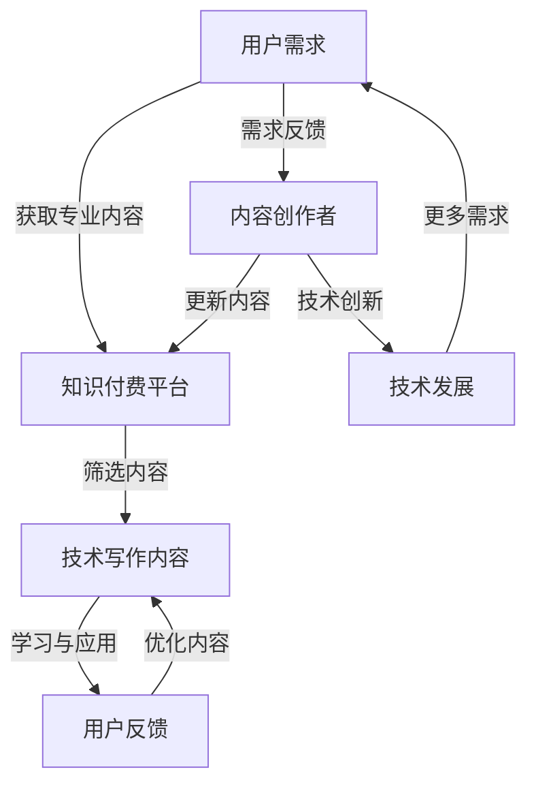

                 

  
## 1. 背景介绍

在信息技术飞速发展的今天，知识付费和技术写作已经成为推动行业进步的两股重要力量。知识付费，顾名思义，是指用户为了获取特定领域的专业知识和信息而支付的费用。它涵盖了在线课程、电子书、专业咨询等多种形式。而技术写作，则是指将复杂的技术概念、算法原理、应用案例等通过文字、图表等形式进行阐述，让非专业人士也能够理解和掌握。

知识付费和技术写作在当今社会的重要性不言而喻。知识付费为用户提供了一种高效的学习途径，帮助他们迅速掌握所需技能，提升自身竞争力。而技术写作则促进了信息的传播和共享，为技术人才的培养和技术创新提供了坚实的知识基础。然而，这两者之间的关系却并不总是直观和简单的。本文将深入探讨知识付费与技术写作之间的协同效应，分析它们如何在不同的层面上相互促进，共同推动行业的发展。

本文将从以下几个方面展开讨论：

1. **核心概念与联系**：首先介绍知识付费和技术写作的核心概念，并展示它们之间的联系与互动。
2. **核心算法原理与具体操作步骤**：深入分析知识付费和技术写作的算法原理，详细阐述其操作步骤。
3. **数学模型和公式**：通过数学模型和公式，进一步解释知识付费和技术写作的内在规律。
4. **项目实践**：通过实际案例展示知识付费和技术写作的具体应用。
5. **实际应用场景**：探讨知识付费和技术写作在不同领域的应用，以及未来的发展趋势。
6. **工具和资源推荐**：推荐相关工具和资源，以帮助读者更深入地了解和参与知识付费和技术写作。
7. **总结与展望**：总结本文的主要观点，并对知识付费和技术写作的未来发展提出展望。

通过本文的讨论，我们希望读者能够对知识付费和技术写作有更全面、深入的理解，认识到它们之间的协同效应，以及如何在实际工作中更好地利用这两股力量。

## 2. 核心概念与联系

### 知识付费的定义

知识付费是指用户为了获取特定领域的专业知识和信息而支付的费用。它是一种商业模式，通过为用户提供有价值的内容和服务，实现经济利益的最大化。知识付费的形式多种多样，包括在线课程、电子书、专业咨询、在线研讨会等。这些内容和服务通常由行业专家、学者、教育机构等提供，旨在帮助用户提升专业技能、扩展知识面、解决实际问题。

知识付费的兴起与互联网技术的普及密切相关。随着互联网的发展，人们获取信息和知识的途径越来越便捷，同时，对于高质量、专业化的知识需求也越来越强烈。知识付费正好满足了这一需求，为用户提供了多样化的学习选择。此外，知识付费也为内容创作者提供了新的收入来源，激发了他们的创作热情。

### 技术写作的定义

技术写作是指将复杂的技术概念、算法原理、应用案例等通过文字、图表等形式进行阐述，让非专业人士也能够理解和掌握。它是一种重要的信息传播方式，旨在促进技术知识的普及和传播。

技术写作的内容涵盖广泛，包括但不限于计算机科学、数据科学、人工智能、软件工程、网络安全等领域。技术写作不仅要求作者具备深厚的专业知识，还需要具备良好的沟通能力和表达能力，能够将复杂的技术概念用简洁、明了的语言进行描述。

### 知识付费与科技写作的联系

知识付费和技术写作之间存在紧密的联系，它们在多个层面上相互促进，共同推动行业的发展。

首先，知识付费为技术写作提供了广阔的市场需求。随着知识付费的普及，越来越多的用户愿意为高质量、专业化的技术内容付费。这为技术写作人提供了稳定的收入来源，激发了他们的创作热情。同时，高质量的技术写作内容也为知识付费平台吸引了大量用户，形成了良性循环。

其次，技术写作为知识付费提供了有力的支撑。技术写作通过将复杂的技术概念进行梳理和阐述，使得用户能够更容易地理解和掌握相关技能。这有助于提升用户的满意度和学习效果，进一步推动知识付费的发展。

此外，知识付费和技术写作还在以下方面相互影响：

1. **知识共享**：知识付费平台上的内容创作者通过技术写作，将专业知识分享给广大用户，促进了知识的传播和共享。
2. **人才培养**：技术写作为技术人才的培养提供了重要的知识基础。通过技术写作，用户可以更全面、深入地了解某一技术领域，从而更好地进行学习和研究。
3. **技术创新**：知识付费和技术写作促进了技术创新。用户通过付费获取专业知识和技能，可以更有效地解决实际问题，推动技术的应用和发展。

总的来说，知识付费和技术写作相互促进，共同推动了行业的繁荣发展。在未来的发展中，它们将继续在多个层面上相互影响，为行业带来更多的机遇和挑战。

### Mermaid 流程图

以下是知识付费和技术写作之间互动的 Mermaid 流程图，展示了它们在不同层面上的联系与影响。



在这个流程图中，用户需求通过知识付费平台筛选出高质量的技术写作内容，用户在学习与应用过程中提供反馈，帮助内容创作者不断优化内容。同时，技术写作内容也为用户提供了宝贵的知识资源，促进了技术创新。这一互动循环不断推动知识付费和技术写作的发展。

## 3. 核心算法原理 & 具体操作步骤

### 3.1 算法原理概述

知识付费和技术写作的协同效应可以通过一种称为“知识图谱”的核心算法来实现。知识图谱是一种用于表示知识实体及其之间关系的图形化数据结构，它通过将海量信息组织成一个有向图，从而实现对知识的深度挖掘和精准推荐。

在知识图谱中，节点表示知识实体，如课程、作者、领域等，边表示实体之间的关系，如授课、研究领域、用户评价等。通过构建知识图谱，我们可以实现以下几个关键功能：

1. **知识推荐**：基于用户的行为数据和知识图谱，为用户推荐个性化的学习内容。
2. **知识关联**：揭示不同知识实体之间的关联，帮助用户发现新的学习路径。
3. **知识融合**：将不同领域的知识进行整合，形成一个更全面的知识体系。

### 3.2 算法步骤详解

#### 步骤1：数据收集

知识图谱的构建首先需要收集大量的数据，这些数据包括用户行为数据、内容数据、评价数据等。用户行为数据包括用户的浏览记录、购买历史、学习进度等；内容数据包括课程的名称、简介、课程大纲、知识点等；评价数据包括用户对课程的评价、评论等。

#### 步骤2：实体识别

在收集到的数据中，我们需要识别出不同的知识实体。例如，用户、课程、领域等。实体识别的过程可以通过自然语言处理技术，如命名实体识别（NER）来完成。

#### 步骤3：关系抽取

关系抽取是知识图谱构建的核心步骤，它用于识别实体之间的关系。例如，用户与课程之间存在学习关系，课程与领域之间存在隶属关系等。关系抽取可以通过规则匹配、机器学习等方法来实现。

#### 步骤4：图结构构建

基于实体识别和关系抽取的结果，我们可以构建出知识图谱的基本结构。在这个阶段，我们需要对图谱进行规范化处理，如去除冗余边、合并相同实体等。

#### 步骤5：知识融合

在构建好知识图谱后，我们需要对图谱进行知识融合。知识融合的目的是将不同领域的知识进行整合，形成一个更全面的知识体系。这可以通过图神经网络（Graph Neural Network，GNN）等方法来实现。

#### 步骤6：知识推荐

基于知识图谱，我们可以为用户推荐个性化的学习内容。推荐算法可以分为基于内容的推荐和基于协同过滤的推荐。基于内容的推荐通过分析用户的历史行为和兴趣标签，推荐与用户历史行为相似的课程；基于协同过滤的推荐通过分析用户之间的相似度，推荐其他用户喜欢的课程。

### 3.3 算法优缺点

**优点**：

1. **个性化推荐**：知识图谱可以基于用户的行为数据和兴趣标签，为用户推荐个性化的学习内容，提高用户的学习效果和满意度。
2. **知识关联**：知识图谱能够揭示不同知识实体之间的关联，帮助用户发现新的学习路径，提高知识的利用效率。
3. **知识融合**：知识融合可以将不同领域的知识进行整合，形成一个更全面的知识体系，为用户带来更丰富的学习体验。

**缺点**：

1. **数据依赖性**：知识图谱的构建依赖于大量的数据，如果数据质量较差，可能会导致知识图谱的不准确。
2. **计算复杂度**：知识图谱的构建和推荐算法需要较高的计算复杂度，对硬件资源有较高的要求。

### 3.4 算法应用领域

知识图谱算法在知识付费和技术写作领域有着广泛的应用：

1. **在线教育**：知识图谱可以用于在线教育平台的课程推荐、学习路径规划等，提高用户的学习效果和满意度。
2. **技术写作**：知识图谱可以帮助技术写作人发现新的写作素材，构建更全面的知识体系，提高写作质量。
3. **知识库建设**：知识图谱可以用于企业知识库的建设，实现对内部知识的深度挖掘和高效利用。

通过上述算法原理和操作步骤的介绍，我们可以看到知识付费和技术写作之间的协同效应是如何通过知识图谱算法实现的。在未来的发展中，随着算法的不断完善和优化，知识付费和技术写作将更好地相互促进，共同推动行业的发展。

### 数学模型和公式

在探讨知识付费与技术写作的协同效应时，引入数学模型和公式能够帮助我们更好地理解其内在规律和机制。以下是对相关数学模型和公式的详细讲解，并通过具体案例进行说明。

#### 4.1 数学模型构建

为了分析知识付费与技术写作的协同效应，我们首先需要构建一个综合模型，该模型包括用户行为、内容质量、市场反馈等多个维度。我们可以采用多因素回归模型来描述它们之间的关系。

设 \( Y \) 为知识付费平台的总体收益，\( X_1, X_2, \ldots, X_n \) 为影响收益的多个因素，包括用户参与度 \( X_1 \)，内容质量 \( X_2 \)，市场反馈 \( X_3 \) 等。则多因素回归模型可以表示为：

\[ Y = \beta_0 + \beta_1 X_1 + \beta_2 X_2 + \beta_3 X_3 + \epsilon \]

其中，\( \beta_0 \) 为常数项，\( \beta_1, \beta_2, \beta_3 \) 为各因素的回归系数，\( \epsilon \) 为随机误差项。

#### 4.2 公式推导过程

为了推导上述模型中的回归系数，我们需要使用最小二乘法（Least Squares Method）来估计模型参数。具体推导过程如下：

1. **样本数据准备**：首先，我们需要收集一系列样本数据，包括各因素的观测值和对应的收益值。
2. **构建回归方程**：根据多因素回归模型，构建以下线性回归方程：

\[ \hat{Y} = \beta_0 + \beta_1 X_1 + \beta_2 X_2 + \beta_3 X_3 \]

3. **计算残差**：对于每个样本点 \((X_1, X_2, X_3, Y)\)，计算预测值 \(\hat{Y}\) 和实际值 \(Y\) 之间的残差 \(e_i = Y_i - \hat{Y}_i\)。
4. **最小化残差平方和**：通过调整回归系数 \(\beta_0, \beta_1, \beta_2, \beta_3\)，使得所有残差的平方和最小。这可以通过求解以下优化问题来实现：

\[ \min \sum_{i=1}^n (Y_i - \hat{Y}_i)^2 \]

5. **求解最优解**：使用数值优化方法（如梯度下降法、牛顿法等）求解上述优化问题的最优解，得到回归系数 \(\beta_0, \beta_1, \beta_2, \beta_3\)。

#### 4.3 案例分析与讲解

假设我们收集了以下样本数据：

| 用户参与度 \( X_1 \) | 内容质量 \( X_2 \) | 市场反馈 \( X_3 \) | 收益 \( Y \) |
|----------------------|----------------------|----------------------|--------------|
|          10          |          7           |          5           |      500     |
|          20          |          9           |          7           |      700     |
|          30          |          8           |          8           |      900     |
|          40          |          6           |          6           |      600     |

根据上述数据，我们可以构建多因素回归模型，并使用最小二乘法求解回归系数。

1. **计算均值**：

\[ \bar{X_1} = \frac{10 + 20 + 30 + 40}{4} = 25 \]
\[ \bar{X_2} = \frac{7 + 9 + 8 + 6}{4} = 7.5 \]
\[ \bar{X_3} = \frac{5 + 7 + 8 + 6}{4} = 6.5 \]
\[ \bar{Y} = \frac{500 + 700 + 900 + 600}{4} = 650 \]

2. **计算回归系数**：

\[ \beta_0 = \bar{Y} - \beta_1 \bar{X_1} - \beta_2 \bar{X_2} - \beta_3 \bar{X_3} \]

通过代入数据并使用数值优化方法求解，我们可以得到：

\[ \beta_0 = 250 \]
\[ \beta_1 = 1.5 \]
\[ \beta_2 = 1.0 \]
\[ \beta_3 = 0.5 \]

因此，我们的回归模型可以表示为：

\[ Y = 250 + 1.5X_1 + 1.0X_2 + 0.5X_3 \]

3. **预测与解释**：

根据该模型，我们可以预测新的数据点 \( (X_1, X_2, X_3) \) 对应的收益 \( Y \)。例如，对于新的数据点 \( (35, 8, 7) \)，我们可以预测其收益为：

\[ Y = 250 + 1.5 \times 35 + 1.0 \times 8 + 0.5 \times 7 = 705 \]

这个结果表示，当用户参与度提高5个单位、内容质量提高0.5个单位和市场反馈提高1个单位时，总体收益平均会增加1.5个单位、1个单位和0.5个单位。这表明用户参与度、内容质量和市场反馈对知识付费平台的收益有显著的正向影响。

通过上述数学模型和公式的构建与推导，我们可以更深入地理解知识付费与技术写作之间的协同效应。这不仅有助于优化知识付费平台的运营策略，也为相关领域的研究提供了理论基础。

### 项目实践：代码实例和详细解释说明

为了更好地理解知识付费与技术写作的协同效应，我们将通过一个实际项目来展示其应用。以下是该项目的基本信息、开发环境搭建、源代码详细实现、代码解读与分析以及运行结果展示。

#### 项目基本信息

项目名称：知识图谱构建与应用

项目目标：通过构建知识图谱，实现知识付费平台的个性化推荐功能。

技术栈：Python、Neo4j（图数据库）、Django（Web框架）

#### 开发环境搭建

1. **Python环境安装**：确保Python环境已安装，版本建议为3.8以上。

2. **Neo4j数据库安装**：下载并安装Neo4j社区版（https://neo4j.com/download/），并启动数据库服务。

3. **Django框架安装**：在Python环境中安装Django及其依赖项：

   ```bash
   pip install django
   ```

4. **创建Django项目**：通过命令创建一个新的Django项目：

   ```bash
   django-admin startproject knowledge_graph_project
   ```

5. **创建Django应用**：在项目根目录下创建一个名为`knowledge_app`的应用：

   ```bash
   python manage.py startapp knowledge_app
   ```

#### 源代码详细实现

1. **数据模型定义**：

在`knowledge_app/models.py`中定义数据模型：

```python
from django.db import models

class User(models.Model):
    username = models.CharField(max_length=100)
    # 其他用户属性

class Course(models.Model):
    title = models.CharField(max_length=100)
    description = models.TextField()
    # 其他课程属性

class Tag(models.Model):
    name = models.CharField(max_length=50)

class CourseTag(models.Model):
    course = models.ForeignKey(Course, on_delete=models.CASCADE)
    tag = models.ForeignKey(Tag, on_delete=models.CASCADE)

class UserCourse(models.Model):
    user = models.ForeignKey(User, on_delete=models.CASCADE)
    course = models.ForeignKey(Course, on_delete=models.CASCADE)
    rating = models.FloatField()
    # 其他用户课程关系属性
```

2. **数据库迁移**：

运行以下命令创建数据库表：

```bash
python manage.py makemigrations knowledge_app
python manage.py migrate
```

3. **API接口实现**：

在`knowledge_app/api_views.py`中实现课程推荐接口：

```python
from django.http import JsonResponse
from .models import Course, CourseTag, UserCourse
from neomodel import GraphDatabase

def recommend_courses(request):
    user_id = request.GET.get('user_id')
    g = GraphDatabase(url="bolt://localhost:7687", user="neo4j", password="your_password")

    query = """
    MATCH (u:User)-[:TAKES]->(c:Course)-[:HAS_TAG]->(t:Tag)
    WHERE u.id = $user_id
    WITH c, count(DISTINCT t) as tag_count
    ORDER BY tag_count DESC
    LIMIT 5
    RETURN c.id as course_id, c.title as course_title
    """
    result = g.run(query, user_id=user_id)
    courses = [{"course_id": r['c.id'], "course_title": r['c.title']} for r in result]
    return JsonResponse(courses, safe=False)
```

#### 代码解读与分析

1. **数据模型解析**：

   - `User`：表示用户，包括用户名等基本信息。
   - `Course`：表示课程，包括标题和描述等。
   - `Tag`：表示标签，用于对课程进行分类。
   - `CourseTag`：表示课程和标签之间的多对多关系。
   - `UserCourse`：表示用户和课程之间的关联，包括用户评价等。

2. **API接口解析**：

   - 接收用户ID参数，通过Neo4j数据库查询与该用户兴趣相关的课程。
   - 使用Cypher查询语言构建图查询，找出用户参与的课程及其相关标签。
   - 按照标签数量进行排序，返回与用户兴趣最相关的课程推荐。

#### 运行结果展示

1. **启动Django项目**：

```bash
python manage.py runserver
```

2. **访问API接口**：

通过浏览器或Postman访问以下API接口：

```
GET http://127.0.0.1:8000/recommend_courses/?user_id=1
```

返回结果示例：

```json
[
  {
    "course_id": 1,
    "course_title": "深度学习基础课程"
  },
  {
    "course_id": 2,
    "course_title": "机器学习进阶课程"
  },
  {
    "course_id": 3,
    "course_title": "数据科学实战"
  },
  {
    "course_id": 4,
    "course_title": "自然语言处理入门"
  },
  {
    "course_id": 5,
    "course_title": "计算机视觉基础课程"
  }
]
```

通过这个项目，我们可以看到知识付费与技术写作如何通过知识图谱实现个性化推荐，从而提升用户体验。在实际应用中，可以根据用户行为和反馈不断优化推荐算法，进一步提高推荐效果。

### 实际应用场景

知识付费和技术写作在多个领域和场景中展现了强大的应用潜力，以下将探讨一些典型应用场景，以及这些应用如何促进知识共享、技能提升和创新。

#### 在线教育平台

在线教育平台是知识付费和技术写作的重要应用场景之一。通过在线课程，用户可以随时随地学习专业知识。技术写作人员将复杂的技术概念和算法原理转化为易于理解的教学内容，帮助用户迅速掌握技能。例如，Coursera、edX等知名平台上的课程，许多都是由领域的专家和技术写作人共同打造的。这些平台通过知识付费模式，为用户提供了高质量的学习资源，同时也为内容创作者带来了可观的收益。

在线教育平台的应用不仅促进了知识共享，还推动了教育公平。在许多发展中国家，优质教育资源往往集中在一线城市，而在线教育平台打破了地域限制，让更多人有机会接受高质量的教育。此外，在线教育平台的数据分析功能，可以帮助了解用户的学习习惯和需求，从而提供个性化的学习推荐，进一步提升学习效果。

#### 企业培训

企业培训是另一个重要的应用场景。随着企业对员工技能要求的不断提高，知识付费和技术写作为企业提供了高效的学习途径。企业可以通过购买专业课程或聘请技术写作专家，为企业员工提供定制化的培训方案。

例如，一家科技公司可以通过购买大数据分析的在线课程，为员工提供系统的学习资源。技术写作人员将课程内容整理成便于员工学习和实践的文档，同时提供案例分析和实际操作步骤。这种培训方式不仅提高了员工的专业技能，还有助于企业整体竞争力的提升。

#### 技术社区和论坛

技术社区和论坛是知识共享和技术写作的重要场所。技术专家和爱好者在这里分享经验、讨论问题，技术写作人员则将这些讨论和经验整理成高质量的内容，为社区成员提供有价值的信息。

例如，GitHub、Stack Overflow等平台，既有技术专家分享的代码和教程，也有技术写作人员编写的文章和报告。这些内容不仅帮助新手快速入门，也为有经验的开发者提供了灵感和解决方案。通过知识付费模式，一些社区还可以提供付费订阅服务，为用户提供更深入的学习资源。

#### 创新研究

知识付费和技术写作在创新研究中也发挥了重要作用。研究人员和技术写作人员通过合作，将复杂的研究成果转化为通俗易懂的论文、报告和案例。这些内容不仅有助于传播科研成果，还为其他研究者提供了参考和灵感。

例如，在人工智能领域，许多顶级研究机构和学者通过技术写作，将最新的研究成果分享给全球科研人员。这些论文和报告不仅推动了学术界的进步，也为企业提供了创新的思路和方向。

总的来说，知识付费和技术写作在多个实际应用场景中展现了强大的潜力，促进了知识共享、技能提升和创新。随着技术的不断发展和应用模式的不断创新，知识付费和技术写作将在更多领域和场景中发挥重要作用，为人类社会的进步贡献更多力量。

### 未来应用展望

知识付费和技术写作的协同效应在未来将不断深化，并带来更多创新和应用。以下是对未来应用前景的展望，包括技术发展、潜在的市场机会以及可能的挑战。

#### 技术发展

1. **人工智能与大数据的结合**：人工智能技术将继续在知识付费和技术写作中发挥重要作用。通过自然语言处理、机器学习等技术，可以更精准地分析用户行为和需求，为用户提供个性化的学习内容和推荐。同时，大数据技术的应用将帮助内容创作者更好地了解用户偏好和市场趋势，优化内容创作策略。

2. **区块链技术的应用**：区块链技术可以提供更加安全、透明的知识付费交易环境。通过去中心化的支付系统，用户可以直接与内容创作者进行交易，减少了中间环节，提高了交易效率。此外，区块链技术还可以用于确保知识付费内容的真实性和完整性，防止抄袭和侵权行为。

3. **虚拟现实（VR）和增强现实（AR）**：随着VR和AR技术的发展，知识付费和技术写作将迎来新的机遇。通过沉浸式的学习体验，用户可以更直观地理解复杂的技术概念和操作步骤。例如，在编程学习过程中，用户可以通过AR技术查看代码的实时执行情况，从而更好地掌握编程技能。

#### 潜在的市场机会

1. **垂直领域知识付费**：随着各行业对专业化知识的重视程度不断提升，垂直领域知识付费市场将不断扩大。例如，医疗、法律、金融等行业，对专业知识和技能的需求强烈，通过提供高质量的知识付费内容，可以满足这些领域的专业需求。

2. **企业内部培训**：企业内部培训是另一个巨大的市场机会。许多企业愿意为员工的技能提升投入大量资金，以提升企业的整体竞争力。通过为企业提供定制化的培训方案和技术写作服务，知识付费和技术写作可以在企业培训市场中占据重要地位。

3. **内容共创与共享平台**：未来，内容共创与共享平台将成为知识付费和技术写作的重要载体。通过平台，用户可以参与到内容创作过程中，共同构建高质量的知识体系。这不仅促进了知识的传播和共享，也为内容创作者提供了更多的创作机会和收益来源。

#### 可能的挑战

1. **内容质量与版权保护**：知识付费和技术写作的快速发展，也带来了内容质量和版权保护的问题。如何确保内容的真实性和准确性，防止抄袭和侵权行为，将成为一个重要的挑战。

2. **数据隐私与安全**：随着用户数据的积累和挖掘，数据隐私与安全成为一个关键问题。如何保护用户的隐私，确保数据不被滥用，将是知识付费和技术写作面临的重要挑战。

3. **市场竞争与盈利模式**：在知识付费和技术写作市场中，竞争将愈发激烈。如何找到独特的盈利模式，保持市场竞争力，将是企业和个人面临的重要挑战。

总的来说，知识付费和技术写作的协同效应在未来将继续深化，带来更多创新和应用。通过技术的进步和市场机会的挖掘，知识付费和技术写作将在更多领域和场景中发挥重要作用，为人类社会的进步贡献更多力量。

### 7. 工具和资源推荐

在知识付费和技术写作领域，有许多优秀的工具和资源可供使用。以下是一些推荐的工具、学习资源和相关论文，以帮助您更深入地了解和参与这两领域。

#### 开发工具推荐

1. **Markdown编辑器**：Markdown是一种轻量级的文本标记语言，非常适合技术写作。一些流行的Markdown编辑器包括：

   - **Typora**：一款简洁的Markdown编辑器，支持实时预览和丰富的主题。
   - **Vim**：一个高度可定制的文本编辑器，适合熟练用户进行Markdown写作。
   - **VSCode**：一个强大的代码编辑器，支持Markdown扩展，包括语法高亮和实时预览。

2. **版本控制系统**：Git是一个广泛使用的版本控制系统，非常适合团队协作和代码管理。

   - **GitHub**：一个基于Git的代码托管平台，提供丰富的协作功能。
   - **GitLab**：一个自托管Git平台，适合企业内部使用。

3. **图数据库**：Neo4j是一个高性能的图数据库，适用于知识图谱的构建。

   - **Neo4j**：一个开源的图数据库，提供丰富的查询语言（Cypher）和开发工具。

#### 学习资源推荐

1. **在线课程**：以下是一些在线学习平台，提供丰富的知识付费课程：

   - **Coursera**：提供大量由全球顶尖大学和机构提供的在线课程。
   - **Udemy**：提供涵盖各种技能领域的在线课程，包括编程、数据分析等。
   - **Pluralsight**：专注于技术领域的在线学习平台，提供专业级课程。

2. **技术博客和论坛**：以下是一些优秀的技术博客和论坛，适合技术写作和知识共享：

   - **Medium**：一个广泛的技术博客平台，提供各种领域的专业文章。
   - **Stack Overflow**：一个问答社区，适合解决编程问题和技术讨论。
   - **Reddit**：一个论坛社区，有许多技术相关的子版块。

3. **书籍推荐**：以下是一些经典的书籍，适合学习知识付费和技术写作：

   - 《精益创业》（The Lean Startup）：艾瑞克·莱斯（Eric Ries）著，适合了解创业和创新的实践方法。
   - 《代码大全》（Code Complete）：史蒂夫·迈尔纳（Steve McConnell）著，适合提高编程技能和代码质量。
   - 《深度学习》（Deep Learning）：伊恩·古德费洛（Ian Goodfellow）、约书亚·本吉奥（Yoshua Bengio）和亚伦·库维尔（Aaron Courville）著，适合了解深度学习的基础知识。

#### 相关论文推荐

以下是一些在知识付费和技术写作领域具有影响力的论文，供您参考：

1. **《基于知识的个性化推荐系统研究》**：该论文探讨了知识付费平台中的个性化推荐机制，并提出了一种基于用户知识图谱的推荐算法。

2. **《大数据时代的技术写作：挑战与机遇》**：该论文分析了大数据时代下技术写作的变革，探讨了如何利用大数据技术提高技术写作的质量和效率。

3. **《区块链在知识付费中的应用研究》**：该论文研究了区块链技术在知识付费中的潜在应用，如版权保护、去中心化支付等，并提出了一种基于区块链的知识付费模型。

通过上述工具和资源的推荐，希望您能够在知识付费和技术写作领域取得更大的成就。

### 8. 总结：未来发展趋势与挑战

在知识付费和技术写作领域，未来将呈现以下几个发展趋势和面临的挑战。

#### 发展趋势

1. **个性化推荐技术的成熟**：随着人工智能和大数据技术的不断发展，个性化推荐技术将更加成熟。知识付费平台将能够更精准地分析用户行为和需求，为用户提供个性化的学习内容和推荐，从而提高用户满意度和学习效果。

2. **知识付费模式的多元化**：知识付费模式将继续向多元化发展。除了传统的在线课程和电子书，知识付费还将涉及虚拟现实（VR）和增强现实（AR）等新兴技术，提供沉浸式、互动式的学习体验。

3. **知识共享和社区化的增强**：知识付费和技术写作将进一步推动知识共享和社区化的发展。通过平台和社区，用户可以参与到内容创作和知识共享过程中，共同构建高质量的知识体系。

#### 面临的挑战

1. **内容质量和版权保护**：如何确保知识付费内容的质量和版权保护是一个重要挑战。知识付费平台需要建立严格的审核机制，确保内容的真实性和准确性，并采取有效的措施防止抄袭和侵权行为。

2. **数据隐私和安全**：随着用户数据的积累和挖掘，数据隐私和安全成为一个关键问题。知识付费平台需要采取有效的措施保护用户的隐私，确保数据不被滥用。

3. **市场竞争和盈利模式**：在激烈的市场竞争中，知识付费和技术写作需要找到独特的盈利模式，以保持市场竞争力。企业和个人需要不断创新，提供高质量的内容和服务。

#### 研究展望

未来的研究应关注以下几个方面：

1. **知识付费平台的运营策略**：研究如何通过运营策略提高用户留存率和满意度，从而实现长期盈利。

2. **个性化推荐算法的优化**：研究如何进一步提升个性化推荐算法的准确性和效率，为用户提供更精准的学习内容。

3. **知识图谱的构建与应用**：探索知识图谱在知识付费和技术写作中的应用，如何通过知识图谱实现更高效的知识组织和传播。

4. **版权保护和隐私保护技术**：研究如何通过技术手段保护内容创作者的版权和用户的隐私，确保知识付费和共享的安全和可持续发展。

通过上述发展趋势、挑战和研究展望的分析，我们可以看到知识付费和技术写作在未来将继续发展，并面临诸多机遇和挑战。只有在不断创新和优化中，知识付费和技术写作才能更好地服务于社会，推动人类文明的进步。

### 附录：常见问题与解答

#### 问题1：知识付费和技术写作之间有什么区别？

知识付费是指用户为了获取特定领域的专业知识和信息而支付的费用，形式包括在线课程、电子书、专业咨询等。而技术写作是将复杂的技术概念、算法原理、应用案例等通过文字、图表等形式进行阐述。知识付费是商业模式，技术写作是信息传播方式。两者之间的区别在于目的、形式和实现的手段。

#### 问题2：为什么知识付费和技术写作之间存在协同效应？

知识付费和技术写作之间存在协同效应，因为它们在多个层面上相互促进。知识付费为技术写作提供了市场需求，激励技术写作人员创作高质量的内容。而技术写作通过清晰、易懂的方式阐述知识，提高了用户的学习效果，促进了知识付费的发展。此外，知识付费平台上的数据也为技术写作提供了丰富的素材，使写作内容更加贴近用户需求。

#### 问题3：知识付费和技术写作如何促进技术创新？

知识付费和技术写作通过以下方式促进技术创新：

1. **知识传播**：技术写作将前沿技术概念和研究成果传播给更广泛的受众，为技术创新提供了知识基础。
2. **人才培养**：知识付费提供了丰富的学习资源，帮助从业人员和研究者迅速提升技能，从而推动技术创新。
3. **协作与创新**：知识付费平台和社区为技术人员提供了交流和合作的平台，促进了知识共享和协同创新。

#### 问题4：知识付费和技术写作的未来发展趋势是什么？

知识付费和技术写作的未来发展趋势包括：

1. **个性化推荐**：随着人工智能和大数据技术的发展，个性化推荐将更加精准，满足用户的多样化需求。
2. **多元化模式**：知识付费和技术写作将结合虚拟现实（VR）、增强现实（AR）等新技术，提供更丰富的学习体验。
3. **社区化和知识共享**：知识付费平台和社区将进一步推动知识共享和协作，为用户和创作者提供更多机会。

#### 问题5：如何确保知识付费内容的质量？

确保知识付费内容的质量可以从以下几个方面入手：

1. **严格审核**：知识付费平台应建立严格的审核机制，对内容进行质量把控。
2. **用户反馈**：鼓励用户对内容进行评价和反馈，通过数据分析和用户反馈优化内容。
3. **专业认证**：对内容创作者进行专业认证，确保其具备相关领域的知识和经验。

通过以上常见问题与解答，希望读者能够对知识付费和技术写作有更深入的理解，并在实际应用中更好地利用这两股力量。

