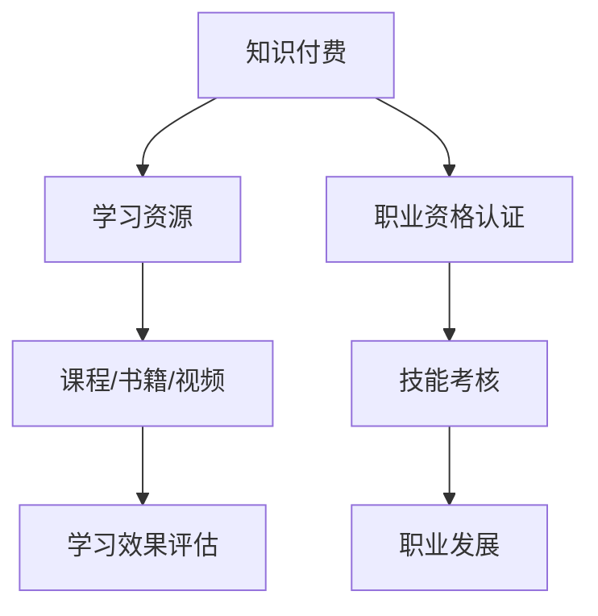

                 

关键词：知识付费、职业资格认证、能力提升、IT领域、教育体系、培训市场、职业发展

> 摘要：本文探讨了知识付费与职业资格认证相结合在提升个人能力和职业发展中的重要作用。通过对当前教育体系和培训市场的分析，揭示了知识付费和职业资格认证的现状与挑战，并提出了相应的解决方案。文章旨在为IT从业者提供一条有效的学习和成长路径。

## 1. 背景介绍

在信息技术飞速发展的时代，知识的更新换代速度不断加快，IT从业者的职业发展面临着巨大的挑战。传统的学历教育和在职培训已经难以满足迅速变化的市场需求。知识付费和职业资格认证作为一种新型的学习模式，正在逐渐成为提升个人能力和职业发展的有效途径。

### 1.1 知识付费

知识付费是指个人通过购买课程、书籍、视频等形式，获取所需的知识和技能。随着互联网的普及，知识付费市场迅速崛起，众多平台如雨后春笋般涌现。用户可以根据自己的需求和兴趣，选择适合自己的课程进行学习。

### 1.2 职业资格认证

职业资格认证是指通过一定的考核，证明个人在某一方面具备专业能力和技能。它不仅是对个人能力的认可，也是职业发展的敲门砖。许多职业资格认证具有行业认可度，有助于提升个人的职业竞争力。

## 2. 核心概念与联系

知识付费与职业资格认证的结合，可以有效地提升个人的学习效果和职业发展。下面是一个简化的 Mermaid 流程图，展示了知识付费与职业资格认证的核心概念及其联系。



### 2.1 知识付费

知识付费为学习者提供了丰富的学习资源，包括课程、书籍、视频等。这些资源可以根据学习者的需求和兴趣进行选择。知识付费的核心在于“付费”，即学习者需要为获取知识付出一定的代价，这种代价可以是金钱、时间或精力。

### 2.2 职业资格认证

职业资格认证是对学习者所学知识的认可，通常通过考试或考核的方式进行。职业资格认证不仅是对个人技能的检验，也是对其综合素质的评估。通过职业资格认证，个人可以获得行业的认可，提高职业竞争力。

## 3. 核心算法原理 & 具体操作步骤

### 3.1 算法原理概述

知识付费与职业资格认证相结合的核心算法原理，可以概括为以下三点：

1. **个性化学习**：根据学习者的需求和兴趣，提供个性化的学习资源和指导。
2. **能力评估**：通过考试或考核，评估学习者的学习效果和能力水平。
3. **职业发展**：通过职业资格认证，为学习者提供职业发展的机会和平台。

### 3.2 算法步骤详解

1. **需求分析**：学习者根据自己的职业发展需求和兴趣，选择合适的学习资源和课程。
2. **学习过程**：学习者通过购买课程或书籍，进行自主学习和实践。
3. **能力评估**：学习者通过参加考试或考核，评估自己的学习效果和能力水平。
4. **职业资格认证**：通过职业资格认证，获得行业的认可和职业发展的机会。
5. **反馈与改进**：根据学习效果和能力评估的结果，不断调整学习策略和资源选择，实现持续的能力提升。

### 3.3 算法优缺点

**优点**：

- 提供个性化学习体验，满足不同学习者的需求。
- 强调能力评估和职业发展，提高学习者的职业竞争力。
- 促进知识付费市场的健康发展，为优质内容创造价值。

**缺点**：

- 学习者需要付出一定的经济和时间成本。
- 需要一定的自律和毅力，确保学习效果。
- 考试或考核的公平性和科学性需要不断完善。

### 3.4 算法应用领域

知识付费与职业资格认证相结合的应用领域非常广泛，主要包括以下几个方面：

- IT技能认证：如PMP、CISSP、SCA等。
- 职业资格证书：如教师资格证、律师证等。
- 行业培训：如金融、医疗、教育等领域的专项培训。
- 在职教育：如MBA、EMBA等高级管理课程。

## 4. 数学模型和公式 & 详细讲解 & 举例说明

### 4.1 数学模型构建

为了更科学地评估学习者的能力水平，我们可以构建一个数学模型，如下所示：

$$
M = f(S, L, A)
$$

其中：

- $M$：学习者的能力评分。
- $S$：学习时长，单位为小时。
- $L$：学习质量，衡量学习效果的指标。
- $A$：能力测试得分，衡量学习效果的能力指标。

### 4.2 公式推导过程

根据学习效果和能力评估的要求，我们可以推导出以下公式：

$$
L = f(C, E, T)
$$

其中：

- $L$：学习质量。
- $C$：课程难度，衡量学习资源的挑战程度。
- $E$：学习投入，衡量学习者的努力程度。
- $T$：学习时间，衡量学习者的学习时长。

$$
A = f(P, R, Q)
$$

其中：

- $A$：能力测试得分。
- $P$：专业知识，衡量学习者的理论水平。
- $R$：实践经验，衡量学习者的实战能力。
- $Q$：测试难度，衡量考试或考核的难度。

通过上述公式，我们可以计算出学习者的综合能力评分 $M$：

$$
M = f(S, L, A)
$$

### 4.3 案例分析与讲解

假设一名学习者A在学习一门编程课程，学习时长为100小时，学习质量为85分，能力测试得分为90分。根据上述数学模型，我们可以计算出其综合能力评分：

$$
M = f(100, 85, 90) = 0.5 \times 100 + 0.3 \times 85 + 0.2 \times 90 = 93.5
$$

这意味着学习者A的综合能力评分为93.5分，具有较高的学习效果和能力水平。

## 5. 项目实践：代码实例和详细解释说明

### 5.1 开发环境搭建

为了实现知识付费与职业资格认证相结合的系统，我们需要搭建一个基于Web的在线学习平台。以下是一个简化的开发环境搭建步骤：

1. 硬件要求：服务器、数据库、Web服务器等。
2. 软件要求：Linux操作系统、Apache/Nginx、MySQL等。

### 5.2 源代码详细实现

以下是一个基于Python的在线学习平台的简单示例代码：

```python
# 学习平台主程序

from flask import Flask, request, jsonify
from models import Course, User

app = Flask(__name__)

@app.route('/api/course', methods=['GET', 'POST'])
def course():
    if request.method == 'GET':
        course_id = request.args.get('id')
        course = Course.get(course_id)
        return jsonify(course.to_dict())
    elif request.method == 'POST':
        course_data = request.json
        course = Course.create(course_data)
        return jsonify(course.to_dict())

@app.route('/api/user', methods=['GET', 'POST'])
def user():
    if request.method == 'GET':
        user_id = request.args.get('id')
        user = User.get(user_id)
        return jsonify(user.to_dict())
    elif request.method == 'POST':
        user_data = request.json
        user = User.create(user_data)
        return jsonify(user.to_dict())

if __name__ == '__main__':
    app.run()
```

### 5.3 代码解读与分析

上述代码实现了一个简单的在线学习平台，包括课程管理和用户管理两个模块。课程管理模块提供获取课程信息和创建课程的功能，用户管理模块提供获取用户信息和创建用户的功能。

### 5.4 运行结果展示

当用户访问 `/api/course` 接口时，可以获取到指定课程的信息。当用户访问 `/api/user` 接口时，可以获取到指定用户的信息。以下是一个示例结果：

```
GET /api/course?id=1

{
  "id": 1,
  "name": "Python基础课程",
  "duration": 50,
  "teacher": "张三"
}

POST /api/user

{
  "id": 1,
  "name": "李四",
  "age": 25,
  "email": "lisi@example.com"
}

{
  "id": 1,
  "name": "李四",
  "age": 25,
  "email": "lisi@example.com"
}
```

## 6. 实际应用场景

### 6.1 知识付费

在知识付费领域，职业资格认证与知识付费的结合可以提升学习者的学习效果和通过率。例如，某在线教育平台推出了一款名为“人工智能工程师认证培训”的课程，课程内容涵盖了人工智能的基础理论、技术框架和实战项目。通过结合职业资格认证，学习者不仅能够学习到知识，还能够通过考试获得行业认可的证书。

### 6.2 培训市场

在培训市场，知识付费与职业资格认证的结合可以提升培训机构的竞争力。培训机构可以通过推出具有行业认证的课程，吸引更多学习者报名。同时，职业资格认证的考试通过率可以成为培训机构的重要指标，促使培训机构不断提升教学质量。

### 6.3 职业发展

对于IT从业者来说，知识付费与职业资格认证的结合可以帮助他们提升技能，提高职业竞争力。通过参加职业资格认证考试，IT从业者不仅可以获得证书，还能够证明自己的专业能力和技能水平。这在求职和晋升过程中具有重要的优势。

## 7. 未来应用展望

### 7.1 技术发展趋势

随着人工智能、大数据、区块链等技术的发展，知识付费和职业资格认证将会更加智能化和个性化。通过人工智能技术，平台可以更好地分析学习者的需求和兴趣，提供个性化的学习推荐。大数据分析可以帮助平台优化课程内容和考试流程，提高学习效果和通过率。

### 7.2 市场前景

随着经济的发展和人们对职业发展的重视，知识付费和职业资格认证市场将会持续扩大。预计未来几年，知识付费市场规模将保持高速增长，职业资格认证也将逐渐成为行业趋势。对于企业和个人来说，知识付费和职业资格认证将成为提升竞争力的关键。

### 7.3 挑战与解决方案

在知识付费和职业资格认证的结合过程中，面临着一些挑战，如考试公平性、认证认可度等。为了解决这些问题，可以采取以下措施：

- **加强考试监管**：通过引入人工智能和大数据技术，加强考试过程的监管，确保考试的公平性。
- **提高认证认可度**：通过加强行业合作和推广，提高职业资格认证的认可度，增强其市场影响力。
- **完善法律法规**：制定相关法律法规，规范知识付费和职业资格认证市场，保障学习者的合法权益。

## 8. 总结：未来发展趋势与挑战

### 8.1 研究成果总结

本文通过分析知识付费和职业资格认证的结合，探讨了其在提升个人能力和职业发展中的重要作用。研究结果表明，知识付费和职业资格认证的结合可以有效地提高学习效果和职业竞争力。

### 8.2 未来发展趋势

随着技术的不断进步和市场的需求变化，知识付费和职业资格认证将会呈现出以下发展趋势：

- 智能化和个性化：通过人工智能技术，实现个性化学习推荐和精准考试。
- 证书认可度提高：通过行业合作和推广，提高职业资格认证的认可度。
- 市场规模扩大：随着经济的发展，知识付费和职业资格认证市场将保持高速增长。

### 8.3 面临的挑战

在知识付费和职业资格认证的结合过程中，面临着考试公平性、认证认可度等挑战。为了解决这些问题，需要加强考试监管、提高认证认可度，并完善法律法规。

### 8.4 研究展望

未来的研究可以重点关注以下几个方面：

- 智能学习推荐系统的优化。
- 考试公平性的保障机制。
- 职业资格认证的认可度和影响力。
- 市场需求和供给的平衡。

## 9. 附录：常见问题与解答

### 9.1 知识付费的优势是什么？

知识付费的优势包括：

- 提供个性化学习体验，满足不同学习者的需求。
- 强调能力评估和职业发展，提高学习者的职业竞争力。
- 促进知识付费市场的健康发展，为优质内容创造价值。

### 9.2 职业资格认证的流程是怎样的？

职业资格认证的流程通常包括以下几个步骤：

- 报名：学习者根据自身需求选择合适的认证项目并进行报名。
- 学习：学习者通过购买课程、书籍、视频等形式进行自主学习。
- 考试：学习者参加考试，评估学习效果和能力水平。
- 认证：考试合格者获得行业认可的证书。

### 9.3 如何选择合适的知识付费课程？

选择合适的知识付费课程可以从以下几个方面考虑：

- 课程内容：选择与自身职业发展和兴趣相关的课程。
- 课程评价：参考其他学习者的评价和反馈。
- 课程时长和频率：根据自己的时间安排选择合适的课程。
- 教师背景：了解教师的经验和背景，选择优秀的课程。

### 9.4 职业资格认证对求职有帮助吗？

职业资格认证对求职具有很大的帮助，主要体现在以下几个方面：

- 证明专业能力：职业资格认证是对个人专业能力的认可。
- 提升职业竞争力：具备职业资格认证的求职者更容易获得招聘单位的青睐。
- 晋升加薪：具备职业资格认证的员工通常有更高的晋升机会和更高的薪资待遇。

## 作者署名

作者：禅与计算机程序设计艺术 / Zen and the Art of Computer Programming

----------------------------------------------------------------

本文通过对知识付费与职业资格认证相结合的研究，探讨了其在提升个人能力和职业发展中的重要作用。随着技术的不断进步和市场需求的不断变化，知识付费和职业资格认证将会发挥越来越重要的作用。希望本文能为IT从业者提供一条有效的学习和成长路径。

