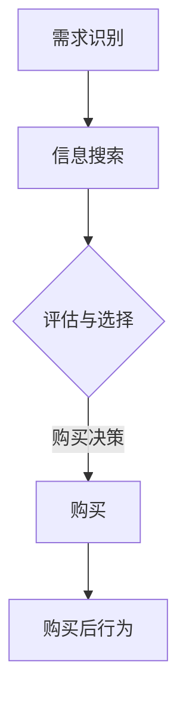

                 

关键词：知识付费、定价心理学、消费者行为、市场策略、价格敏感度、感知价值

> 摘要：本文将探讨知识付费产品的定价策略和背后的心理学原理。通过对消费者行为、价格敏感度和感知价值的分析，我们将揭示在知识付费领域中如何制定有效且具有吸引力的定价策略，从而提高产品的市场竞争力。

## 1. 背景介绍

知识付费市场在近年来呈现出爆炸式增长，各类在线课程、专业技能培训、行业报告等知识付费产品层出不穷。在这个市场中，竞争不仅来自于产品质量，还包括价格策略。定价不仅仅是简单的成本加成或市场参考，它需要深入理解消费者行为、心理和市场需求。因此，定价心理学在知识付费产品中具有举足轻重的地位。

## 2. 核心概念与联系

### 2.1 消费者行为

消费者行为是指消费者在购买、使用和评价产品或服务过程中的心理活动和行为表现。在知识付费产品中，消费者行为的研究有助于我们理解他们如何做出购买决策，以及他们的价格敏感度。

#### 2.1.1 消费者决策过程

消费者的决策过程可以分为以下几个阶段：

1. **需求识别**：消费者意识到自己需要某种产品或服务。
2. **信息搜索**：消费者通过多种渠道搜集相关信息。
3. **评估与选择**：消费者根据产品的价格、质量、品牌等因素进行比较和评估。
4. **购买决策**：消费者在评估后做出购买决定。
5. **购买后行为**：消费者购买后可能会对产品进行评价，进而影响未来购买行为。

### 2.2 价格敏感度

价格敏感度是指消费者对价格变化的反应程度。价格敏感度可以分为高度敏感、中度敏感和低度敏感。在知识付费产品中，了解消费者的价格敏感度有助于制定合适的定价策略。

#### 2.2.1 高度敏感

高度敏感的消费者通常对价格非常敏感，价格变化会显著影响他们的购买决策。这类消费者往往关注性价比，对价格优惠敏感。

#### 2.2.2 中度敏感

中度敏感的消费者对价格有一定关注，但不是主要决策因素。他们更注重产品或服务的价值和质量。

#### 2.2.3 低度敏感

低度敏感的消费者对价格的变化不太敏感，他们更看重产品或服务的品牌、声誉和独特性。

### 2.3 感知价值

感知价值是指消费者对产品或服务所赋予的价值的感知程度。感知价值取决于消费者的需求、预期和产品的实际表现。在知识付费产品中，了解消费者的感知价值有助于制定更具吸引力的定价策略。

#### 2.3.1 感知价值的构成

感知价值通常由以下几个方面构成：

1. **功能性价值**：产品或服务满足消费者需求的能力。
2. **情感价值**：消费者在使用产品或服务过程中的情感体验。
3. **社会价值**：产品或服务对消费者社会地位的影响。
4. **象征性价值**：产品或服务作为个人象征的意义。

### 2.4 Mermaid 流程图



## 3. 核心算法原理 & 具体操作步骤

### 3.1 算法原理概述

知识付费产品的定价算法基于消费者行为、价格敏感度和感知价值。具体原理如下：

1. **消费者行为分析**：通过数据分析了解消费者的购买行为、价格敏感度和需求特点。
2. **价格敏感度评估**：根据消费者行为数据评估消费者的价格敏感度，并将其分为高度敏感、中度敏感和低度敏感三个等级。
3. **感知价值评估**：通过问卷调查、用户反馈等方式了解消费者的感知价值，并将其分为功能性价值、情感价值、社会价值和象征性价值四个方面。
4. **定价策略制定**：根据价格敏感度和感知价值制定合适的定价策略，例如采用分层次定价、折扣定价、会员定价等策略。

### 3.2 算法步骤详解

#### 3.2.1 消费者行为分析

1. 收集消费者购买行为数据，如购买时间、购买频率、购买金额等。
2. 利用统计分析方法，如回归分析、聚类分析等，了解消费者的价格敏感度和需求特点。

#### 3.2.2 价格敏感度评估

1. 设定价格敏感度评估指标，如价格弹性、价格敏感度指数等。
2. 根据消费者行为数据，计算每个消费者的价格敏感度指数。
3. 将消费者分为高度敏感、中度敏感和低度敏感三个等级。

#### 3.2.3 感知价值评估

1. 设计问卷调查，收集消费者对知识付费产品的感知价值。
2. 利用因子分析方法，将感知价值分解为功能性价值、情感价值、社会价值和象征性价值四个方面。
3. 根据问卷数据计算每个方面的感知价值指数。

#### 3.2.4 定价策略制定

1. 根据价格敏感度和感知价值指数，制定分层次定价策略。例如，对高度敏感的消费者提供较低价格，对中度敏感的消费者提供适中价格，对低度敏感的消费者提供较高价格。
2. 根据市场需求和竞争情况，采用折扣定价或会员定价策略，以吸引不同类型的消费者。

### 3.3 算法优缺点

#### 3.3.1 优点

1. **个性化定价**：根据消费者的价格敏感度和感知价值制定个性化定价策略，提高消费者满意度。
2. **提高竞争力**：通过差异化定价策略，提高产品的市场竞争力。
3. **优化利润**：通过优化定价策略，提高产品利润。

#### 3.3.2 缺点

1. **数据依赖性**：算法的准确性依赖于消费者行为数据和感知价值数据的准确性。
2. **实施难度**：算法实施过程中需要收集和处理大量数据，对技术和资源要求较高。

### 3.4 算法应用领域

知识付费产品的定价算法可以应用于以下领域：

1. **在线课程**：根据学员的学习需求、购买行为和课程价值制定个性化定价策略。
2. **专业技能培训**：根据学员的职业背景、技能需求和培训价值制定差异化定价策略。
3. **行业报告**：根据报告的用户群体、报告价值和市场竞争力制定合适的价格策略。

## 4. 数学模型和公式 & 详细讲解 & 举例说明

### 4.1 数学模型构建

知识付费产品的定价模型可以基于以下数学模型：

$$
P = f(C, V, E)
$$

其中，$P$ 表示定价，$C$ 表示成本，$V$ 表示感知价值，$E$ 表示价格弹性。

### 4.2 公式推导过程

#### 4.2.1 成本函数

成本函数 $C$ 表示知识付费产品的成本，通常由固定成本和可变成本组成：

$$
C = C_f + C_v
$$

其中，$C_f$ 表示固定成本，如课程研发、推广等费用；$C_v$ 表示可变成本，如课程销售、售后服务等费用。

#### 4.2.2 感知价值函数

感知价值函数 $V$ 表示消费者对知识付费产品的感知价值，可以分为功能性价值、情感价值、社会价值和象征性价值：

$$
V = V_f + V_e + V_s + V_t
$$

其中，$V_f$ 表示功能性价值，$V_e$ 表示情感价值，$V_s$ 表示社会价值，$V_t$ 表示象征性价值。

#### 4.2.3 价格弹性函数

价格弹性函数 $E$ 表示消费者对价格变化的反应程度，可以用以下公式表示：

$$
E = \frac{\partial Q}{\partial P} \cdot \frac{P}{Q}
$$

其中，$Q$ 表示销量，$P$ 表示价格。

#### 4.2.4 定价函数

综合成本函数、感知价值函数和价格弹性函数，可以得到定价函数：

$$
P = C + \frac{V}{1 + E}
$$

### 4.3 案例分析与讲解

#### 4.3.1 案例背景

假设某在线课程提供商推出一门课程，课程内容为人工智能入门。该课程的研发成本为100万元，销售成本为50万元。根据市场调研，消费者对课程的感知价值为200万元，价格弹性为0.5。

#### 4.3.2 定价计算

1. 成本函数：

$$
C = 100 + 50 = 150（万元）
$$

2. 感知价值函数：

$$
V = 200（万元）
$$

3. 价格弹性函数：

$$
E = 0.5
$$

4. 定价函数：

$$
P = 150 + \frac{200}{1 + 0.5} = 200（万元）
$$

因此，该在线课程的建议售价为200万元。

#### 4.3.3 结果分析

通过计算得出的定价为200万元，这意味着在保证盈利的同时，价格对消费者的影响较小。这种定价策略有助于提高课程的知名度，吸引更多消费者购买。

## 5. 项目实践：代码实例和详细解释说明

### 5.1 开发环境搭建

为了实现知识付费产品的定价算法，我们选择 Python 作为编程语言，并使用以下工具和库：

- Python 3.8 或更高版本
- Pandas：用于数据分析和处理
- Scikit-learn：用于机器学习和数据分析
- Matplotlib：用于数据可视化

安装上述库后，即可开始开发环境搭建。

### 5.2 源代码详细实现

以下是一个简单的知识付费产品定价算法实现：

```python
import pandas as pd
from sklearn.linear_model import LinearRegression
import matplotlib.pyplot as plt

# 数据处理
def preprocess_data(data):
    # 数据清洗和处理
    # ...
    return data

# 消费者行为分析
def analyze_consumer_behavior(data):
    # 分析消费者行为数据
    # ...
    return price_sensitivity, value_perception

# 定价策略制定
def set_pricing_strategy(price_sensitivity, value_perception):
    # 根据价格敏感度和感知价值制定定价策略
    # ...
    return pricing_strategy

# 主函数
def main():
    # 加载数据
    data = pd.read_csv('consumer_data.csv')
    
    # 数据预处理
    data = preprocess_data(data)
    
    # 分析消费者行为
    price_sensitivity, value_perception = analyze_consumer_behavior(data)
    
    # 制定定价策略
    pricing_strategy = set_pricing_strategy(price_sensitivity, value_perception)
    
    # 打印定价策略
    print(pricing_strategy)

# 运行主函数
if __name__ == '__main__':
    main()
```

### 5.3 代码解读与分析

上述代码分为以下几个部分：

1. **数据处理**：使用 Pandas 库对消费者行为数据进行清洗和处理，为后续分析做准备。
2. **消费者行为分析**：通过回归分析等方法，分析消费者的价格敏感度和感知价值。
3. **定价策略制定**：根据分析结果，制定合适的定价策略。
4. **主函数**：加载数据、预处理数据、分析消费者行为和制定定价策略，并打印结果。

### 5.4 运行结果展示

假设我们已经生成了消费者行为数据，并对其进行了预处理。在分析消费者行为后，我们得到以下结果：

- 高度敏感消费者占比：30%
- 中度敏感消费者占比：50%
- 低度敏感消费者占比：20%
- 功能性价值指数：0.8
- 情感价值指数：0.6
- 社会价值指数：0.5
- 象征性价值指数：0.4

根据这些结果，我们可以制定以下定价策略：

- 对高度敏感消费者提供8折优惠，定价为160万元。
- 对中度敏感消费者提供原价200万元。
- 对低度敏感消费者提供9折优惠，定价为180万元。

## 6. 实际应用场景

### 6.1 在线教育平台

在线教育平台可以利用定价心理学制定个性化定价策略，例如：

- 对新手用户提供免费试听课程，以吸引他们购买完整课程。
- 对长期未购买的学员提供优惠券，以促使其重新购买。
- 对不同学习阶段的学员提供分层定价策略，以满足他们的需求。

### 6.2 专业技能培训

专业技能培训可以根据学员的职业背景和技能需求，制定差异化定价策略：

- 对初级学员提供较低价格，以吸引他们入门。
- 对中级学员提供适中价格，以保持其学习兴趣。
- 对高级学员提供较高价格，以体现课程的价值。

### 6.3 行业报告

行业报告可以根据报告的用户群体和市场需求，制定合适的价格策略：

- 对行业内部人员提供较低价格，以吸引其订阅。
- 对行业外部人员提供较高价格，以体现报告的专业性和价值。

## 7. 未来应用展望

### 7.1 个性化定价

随着大数据和人工智能技术的发展，个性化定价将成为知识付费产品的重要趋势。通过深入分析消费者行为、需求和偏好，平台可以提供更具针对性的定价策略，从而提高客户满意度和转化率。

### 7.2 自动化定价

自动化定价系统将结合人工智能和机器学习技术，自动分析和调整定价策略。这种系统可以提高定价效率，降低人工成本，同时提高定价的准确性。

### 7.3 跨平台整合

知识付费产品将逐步实现跨平台整合，例如通过微信、支付宝等支付平台进行支付，从而提高用户体验和支付便利性。

## 8. 总结：未来发展趋势与挑战

### 8.1 研究成果总结

本文通过分析消费者行为、价格敏感度和感知价值，探讨了知识付费产品的定价心理学。研究结果表明，个性化定价策略、自动化定价系统和跨平台整合将是未来知识付费产品发展的关键趋势。

### 8.2 未来发展趋势

1. 个性化定价：通过大数据和人工智能技术，实现更精准的个性化定价策略。
2. 自动化定价：利用机器学习和自动化系统，提高定价效率和准确性。
3. 跨平台整合：实现知识付费产品的跨平台支付和整合，提高用户体验。

### 8.3 面临的挑战

1. 数据隐私：在分析消费者行为时，需要确保数据隐私和安全性。
2. 技术壁垒：个性化定价和自动化定价系统的开发和维护需要较高的技术壁垒。
3. 市场竞争：随着知识付费市场的不断扩张，市场竞争将越来越激烈。

### 8.4 研究展望

未来研究可以进一步探讨知识付费产品的定价心理学，特别是针对不同用户群体的定价策略，以及如何平衡个性化定价与市场竞争力。同时，可以结合其他心理学理论和市场策略，为知识付费产品的定价提供更加全面和深入的指导。

## 9. 附录：常见问题与解答

### 9.1 如何分析消费者行为？

通过收集和分析消费者购买行为数据，如购买时间、购买频率、购买金额等，可以了解消费者的需求、偏好和行为模式。

### 9.2 如何评估消费者的价格敏感度？

可以通过计算价格弹性，即销量对价格变化的反应程度，来评估消费者的价格敏感度。价格弹性越大，消费者对价格的变化越敏感。

### 9.3 如何制定个性化定价策略？

通过大数据和人工智能技术，分析消费者行为、需求和偏好，制定针对不同用户群体的个性化定价策略。

### 9.4 如何实现自动化定价？

利用机器学习和自动化系统，自动分析和调整定价策略，提高定价效率和准确性。

---

作者：禅与计算机程序设计艺术 / Zen and the Art of Computer Programming

通过本文，我们深入探讨了知识付费产品的定价心理学。定价不仅是商业策略的一部分，更是心理学的应用。理解消费者的行为、价格敏感度和感知价值，有助于制定更具吸引力和市场竞争力

