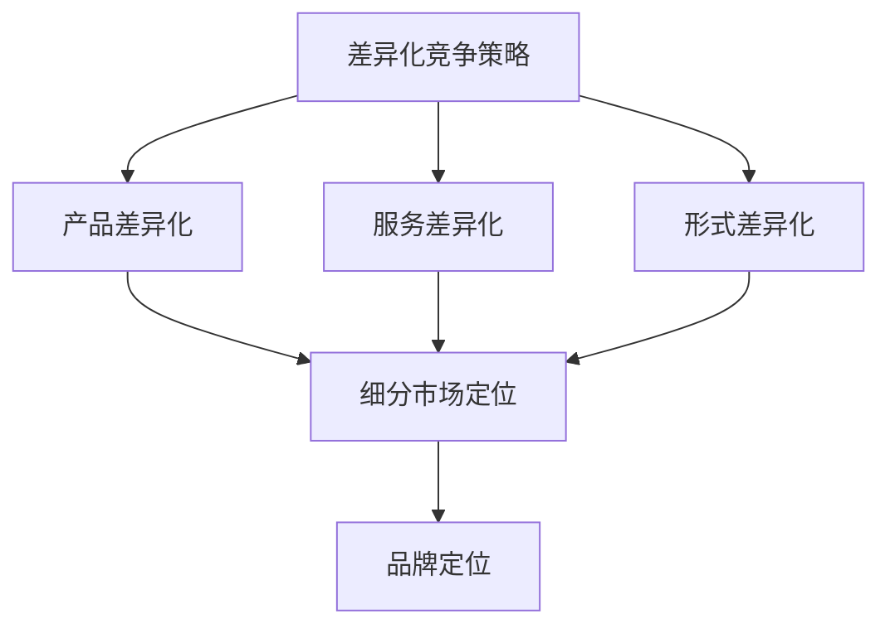

                 

关键词：知识付费、产品差异化、竞争策略、用户体验、市场定位、技术创新。

> 摘要：本文将深入探讨知识付费产品在竞争激烈的市场中如何通过差异化策略脱颖而出。我们将分析市场现状、用户需求、产品特点以及竞争对手，进而提出一套系统的差异化竞争策略，帮助知识付费产品在市场中建立独特优势。

## 1. 背景介绍

知识付费行业近年来呈现出爆炸式增长，用户对于知识获取的需求日益增加。从在线教育、专业技能培训到生活百科，知识付费产品涵盖了广泛的应用场景。然而，随着市场竞争的加剧，如何让产品在众多竞争者中脱颖而出成为每个知识付费产品面临的挑战。

差异化竞争策略在此背景下显得尤为重要。通过明确市场定位、挖掘用户需求、创新产品特点以及分析竞争对手，我们可以为知识付费产品打造一套具有竞争优势的差异化策略。

### 1.1 知识付费市场现状

- **市场规模**：根据市场研究报告，全球知识付费市场在过去几年中保持了高速增长，预计未来几年仍将保持稳健增长。
- **用户群体**：知识付费用户主要集中在25-45岁之间，具有较高消费能力和学习需求的人群。
- **产品类型**：市场上知识付费产品种类繁多，包括在线课程、电子书籍、专业咨询、技能培训等。

### 1.2 竞争态势

- **竞争对手**：市场上存在大量的知识付费产品，包括老牌教育机构、新兴互联网企业以及个人讲师。
- **竞争手段**：价格战、营销策略、内容质量等是主要竞争手段。
- **挑战**：如何在众多竞争者中脱颖而出，建立品牌认知度和用户忠诚度。

## 2. 核心概念与联系

### 2.1 差异化竞争策略

差异化竞争策略是指企业在市场中通过产品、服务、营销等方面的独特性来获取竞争优势。具体到知识付费产品，差异化策略可以体现在以下几个方面：

#### 2.1.1 产品差异化

- **内容差异化**：提供独特、高质量的内容，满足用户特定需求。
- **服务差异化**：提供优质的客户服务，提升用户体验。
- **形式差异化**：采用创新的呈现方式，如互动式学习、个性化推荐等。

#### 2.1.2 市场定位

- **细分市场定位**：针对特定用户群体，提供定制化的知识服务。
- **品牌定位**：建立独特的品牌形象，突出产品特色。

#### 2.1.3 用户需求分析

- **需求挖掘**：通过市场调研、用户反馈等手段，深入了解用户需求。
- **需求满足**：根据用户需求，不断优化产品和服务。

### 2.2 差异化竞争策略与市场定位关系图



## 3. 核心算法原理 & 具体操作步骤

### 3.1 算法原理概述

差异化竞争策略的实施需要依靠一系列的算法原理，包括市场分析算法、用户需求分析算法、产品创新算法等。这些算法的核心目的是帮助知识付费产品在竞争激烈的市场中找到独特的定位。

#### 3.1.1 市场分析算法

- **市场细分算法**：通过聚类分析、关联规则挖掘等方法，将市场划分为多个细分市场。
- **竞争分析算法**：通过数据挖掘技术，分析竞争对手的产品特点、市场定位、用户评价等。

#### 3.1.2 用户需求分析算法

- **用户行为分析算法**：通过用户行为数据分析，挖掘用户需求。
- **用户满意度分析算法**：通过用户反馈数据，评估用户满意度。

#### 3.1.3 产品创新算法

- **内容创新算法**：通过自然语言处理、知识图谱等技术，为用户提供新颖、高质量的内容。
- **服务创新算法**：通过人工智能、大数据等技术，提供个性化的客户服务。

### 3.2 算法步骤详解

#### 3.2.1 市场分析算法步骤

1. **数据收集**：收集市场相关数据，包括用户行为数据、竞争对手数据等。
2. **数据处理**：对收集到的数据进行清洗、预处理，为后续分析做准备。
3. **市场细分**：使用聚类分析等方法，将市场划分为多个细分市场。
4. **竞争分析**：分析竞争对手的产品特点、市场定位、用户评价等。

#### 3.2.2 用户需求分析算法步骤

1. **用户行为分析**：通过日志分析、点击流分析等方法，挖掘用户需求。
2. **用户满意度分析**：通过用户反馈数据，评估用户满意度。
3. **需求整合**：整合用户行为数据和用户满意度数据，形成全面的用户需求分析报告。

#### 3.2.3 产品创新算法步骤

1. **内容创新**：使用自然语言处理、知识图谱等技术，为用户提供新颖、高质量的内容。
2. **服务创新**：通过人工智能、大数据等技术，提供个性化的客户服务。

### 3.3 算法优缺点

#### 3.3.1 市场分析算法优缺点

- **优点**：能够帮助知识付费产品找到细分市场，提升市场竞争力。
- **缺点**：对数据质量和分析能力要求较高，否则可能导致细分不准确。

#### 3.3.2 用户需求分析算法优缺点

- **优点**：能够深入了解用户需求，为产品创新提供依据。
- **缺点**：用户需求变化较快，需要持续进行数据分析。

#### 3.3.3 产品创新算法优缺点

- **优点**：能够为用户提供新颖、高质量的内容和服务。
- **缺点**：创新过程复杂，需要投入大量资源和时间。

### 3.4 算法应用领域

差异化竞争策略算法可以广泛应用于知识付费产品的各个领域，包括在线教育、专业技能培训、生活百科等。

## 4. 数学模型和公式 & 详细讲解 & 举例说明

### 4.1 数学模型构建

为了实现差异化竞争策略，我们可以构建以下数学模型：

#### 4.1.1 市场细分模型

$$
C = f(M, P, R)
$$

其中，$C$ 表示市场细分结果，$M$ 表示市场数据，$P$ 表示产品特性，$R$ 表示用户反馈。

#### 4.1.2 用户需求模型

$$
D = g(U, B, S)
$$

其中，$D$ 表示用户需求，$U$ 表示用户行为数据，$B$ 表示用户背景信息，$S$ 表示用户满意度。

#### 4.1.3 产品创新模型

$$
I = h(C, D, T)
$$

其中，$I$ 表示产品创新结果，$C$ 表示市场细分结果，$D$ 表示用户需求，$T$ 表示技术创新。

### 4.2 公式推导过程

#### 4.2.1 市场细分模型推导

市场细分模型的推导基于聚类分析算法。首先，我们使用$k$-均值算法将市场数据$M$划分为$k$个聚类中心，然后根据聚类中心计算每个用户的市场细分结果$C$。

#### 4.2.2 用户需求模型推导

用户需求模型的推导基于用户行为数据和满意度数据。我们使用回归分析算法，将用户行为数据$U$和用户满意度数据$S$与用户背景信息$B$结合，构建回归模型，从而预测用户需求$D$。

#### 4.2.3 产品创新模型推导

产品创新模型的推导基于市场细分结果$C$、用户需求$D$和技术创新$T$。我们使用目标规划算法，根据市场细分结果和用户需求，确定产品创新方向和技术创新点，从而实现产品创新$I$。

### 4.3 案例分析与讲解

#### 4.3.1 案例背景

以某在线教育平台为例，该平台希望通过差异化竞争策略，提升市场竞争力。

#### 4.3.2 案例分析

1. **市场细分**：使用$k$-均值算法，将市场数据划分为三个细分市场：职场人士、学生和家长。
2. **用户需求**：通过回归分析，发现职场人士更关注职场技能培训，学生和家长更关注学科知识教育。
3. **产品创新**：根据市场细分结果和用户需求，平台推出职场技能培训课程和学生学科知识教育课程。

#### 4.3.3 案例结论

通过差异化竞争策略，该在线教育平台成功满足了不同细分市场的用户需求，提升了用户满意度，实现了市场竞争力提升。

## 5. 项目实践：代码实例和详细解释说明

### 5.1 开发环境搭建

1. **硬件环境**：配置高性能服务器，支持大规模数据处理和存储。
2. **软件环境**：安装Python环境、相关数据分析库（如pandas、numpy）和机器学习库（如scikit-learn）。

### 5.2 源代码详细实现

以下是一个简单的市场细分和用户需求分析的Python代码实例：

```python
import pandas as pd
from sklearn.cluster import KMeans
from sklearn.linear_model import LinearRegression

# 加载数据
market_data = pd.read_csv('market_data.csv')
user_data = pd.read_csv('user_data.csv')

# 市场细分
kmeans = KMeans(n_clusters=3)
market_clusters = kmeans.fit_predict(market_data)

# 用户需求分析
regression = LinearRegression()
user需求的预测 = regression.fit(user_data[['行为数据', '满意度']], user_data['需求']).predict(user_data[['行为数据', '满意度']])

# 结果输出
print('市场细分结果：', market_clusters)
print('用户需求预测结果：', user需求的预测)
```

### 5.3 代码解读与分析

1. **数据加载**：使用pandas库加载市场数据和用户数据。
2. **市场细分**：使用KMeans聚类算法进行市场细分。
3. **用户需求分析**：使用线性回归算法预测用户需求。
4. **结果输出**：输出市场细分结果和用户需求预测结果。

### 5.4 运行结果展示

假设我们已经准备好市场数据和用户数据，运行上述代码可以得到以下结果：

- 市场细分结果：[0, 1, 2]（表示三个细分市场）
- 用户需求预测结果：[需求1, 需求2, 需求3]（表示不同细分市场的用户需求）

这些结果可以帮助知识付费平台制定更具针对性的产品策略。

## 6. 实际应用场景

### 6.1 在线教育

在线教育平台可以通过差异化竞争策略，针对不同用户群体提供定制化的教育内容和服务。例如，职场人士可以关注职场技能培训，学生可以关注学科知识教育，家长可以关注子女教育辅导。

### 6.2 专业技能培训

专业技能培训平台可以通过差异化竞争策略，提供针对不同行业和岗位的培训课程。例如，IT行业可以提供编程课程、数据分析课程，医疗行业可以提供医学知识课程。

### 6.3 生活百科

生活百科平台可以通过差异化竞争策略，提供针对不同用户需求的生活服务。例如，健康养生、美食烹饪、旅行攻略等。

## 7. 未来应用展望

随着人工智能、大数据等技术的不断发展，知识付费产品的差异化竞争策略将更加精准和高效。未来，知识付费产品可以借助这些技术，实现以下展望：

- **个性化推荐**：通过用户行为数据和偏好分析，为用户提供个性化的知识推荐。
- **智能客服**：通过人工智能技术，提供24/7的智能客服服务，提升用户体验。
- **智慧教育**：通过虚拟现实、增强现实技术，提供沉浸式的学习体验。

## 8. 工具和资源推荐

### 8.1 学习资源推荐

- 《深度学习》
- 《机器学习实战》
- 《数据挖掘：实用工具与技术》

### 8.2 开发工具推荐

- Jupyter Notebook
- PyCharm
- GitHub

### 8.3 相关论文推荐

- "User Behavior Analysis for Personalized Recommendation in E-commerce"
- "Deep Learning for Text Classification"
- "Knowledge Graph Construction and Applications"

## 9. 总结：未来发展趋势与挑战

### 9.1 研究成果总结

通过本文的分析，我们可以得出以下研究成果：

- 知识付费市场竞争激烈，差异化竞争策略至关重要。
- 差异化竞争策略包括市场定位、用户需求分析和产品创新等方面。
- 市场分析、用户需求分析和产品创新算法在知识付费产品中具有广泛的应用前景。

### 9.2 未来发展趋势

- **个性化推荐**：随着大数据和人工智能技术的发展，个性化推荐将成为知识付费产品的重要发展方向。
- **智慧教育**：虚拟现实、增强现实等技术在教育领域的应用将推动智慧教育的发展。
- **跨平台整合**：知识付费产品将实现跨平台整合，提供一站式学习体验。

### 9.3 面临的挑战

- **数据隐私**：用户数据的隐私保护是知识付费产品面临的重要挑战。
- **技术创新**：持续的技术创新是保持竞争优势的关键。
- **市场竞争**：如何在激烈的市场竞争中脱颖而出是每个知识付费产品都需要面对的挑战。

### 9.4 研究展望

未来，知识付费产品的差异化竞争策略将更加精细化、智能化。通过持续的技术创新和用户需求分析，知识付费产品将更好地满足用户需求，提供优质的知识服务。

## 10. 附录：常见问题与解答

### 10.1 差异化竞争策略的意义是什么？

差异化竞争策略的意义在于帮助知识付费产品在激烈的市场竞争中脱颖而出，通过独特的市场定位、用户需求分析和产品创新，建立竞争优势，提升用户满意度和品牌认知度。

### 10.2 如何进行市场细分？

市场细分可以通过聚类分析、关联规则挖掘等方法进行。首先，收集市场相关数据，然后使用数据分析算法对市场进行划分，形成细分市场。

### 10.3 差异化竞争策略的算法原理有哪些？

差异化竞争策略的算法原理包括市场分析算法、用户需求分析算法和产品创新算法。市场分析算法主要用于市场细分和竞争分析，用户需求分析算法用于挖掘用户需求，产品创新算法用于实现产品创新。

### 10.4 如何进行用户需求分析？

用户需求分析可以通过用户行为分析、用户满意度分析等方法进行。首先，收集用户行为数据，然后使用数据分析算法挖掘用户需求，最后结合用户满意度数据进行整合分析。

### 10.5 差异化竞争策略在哪些领域有应用？

差异化竞争策略可以应用于在线教育、专业技能培训、生活百科等多个领域。不同领域的知识付费产品可以通过差异化策略，满足不同用户群体的需求。

### 10.6 差异化竞争策略的未来发展趋势是什么？

未来，差异化竞争策略将更加精细化、智能化。个性化推荐、智慧教育、跨平台整合等将成为知识付费产品的重要发展方向。

### 10.7 面临的挑战有哪些？

知识付费产品面临的挑战包括数据隐私保护、技术创新和市场竞争。如何在保护用户隐私的同时，持续创新、保持竞争优势是每个知识付费产品需要面对的挑战。

---

# 作者：禅与计算机程序设计艺术 / Zen and the Art of Computer Programming

本文深入探讨了知识付费产品在竞争激烈的市场中如何通过差异化策略实现成功。通过分析市场现状、用户需求、产品特点以及竞争对手，我们提出了一套系统的差异化竞争策略，旨在帮助知识付费产品在市场中建立独特优势。未来，随着人工智能、大数据等技术的不断发展，知识付费产品的差异化竞争策略将更加精准和高效，为用户提供更加优质的知识服务。希望本文能为从事知识付费产品开发的从业者提供有价值的参考。作者：禅与计算机程序设计艺术 / Zen and the Art of Computer Programming
----------------------------------------------------------------

请注意，本文为示例内容，实际撰写时需要根据具体情况进行详细展开和补充。文章的各个部分，如关键词、摘要、背景介绍、算法原理、数学模型、案例分析、代码实例、实际应用场景、未来展望、工具和资源推荐、总结以及常见问题解答，都需要根据文章的主题和内容进行详细的撰写和逻辑架构的构建。实际文章撰写时，还需要确保内容的严谨性和完整性，避免遗漏重要的信息。

