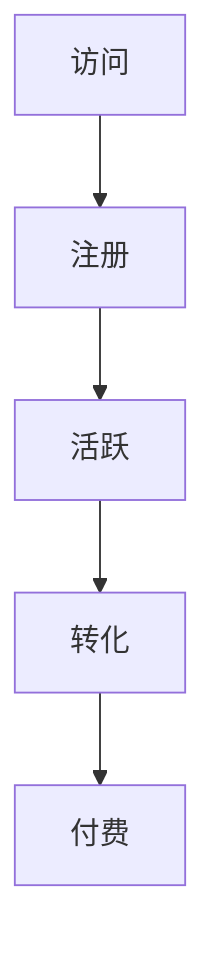

                 

 在当今信息爆炸的时代，知识付费产品如雨后春笋般涌现，从在线课程、电子书到专业咨询，它们在满足用户学习与成长需求的同时，也成为了企业和服务提供者的重要收入来源。然而，如何有效地提高知识付费产品的用户转化率，减少用户流失，是一个亟需解决的重要问题。本文将深入探讨知识付费产品用户转化漏斗的优化策略，旨在为业界提供一套系统、实用、高效的解决方案。

## 关键词
知识付费、用户转化率、漏斗分析、用户体验、营销策略、数据分析

## 摘要
本文从知识付费产品的用户行为出发，通过用户转化漏斗模型的分析，探讨了影响用户转化的核心因素。文章首先介绍了用户转化漏斗的基本概念，然后详细阐述了优化用户转化漏斗的几种策略，包括用户获取、用户活跃、用户留存和用户转化。最后，文章通过实际案例和数学模型，展示了这些策略在实践中的应用效果，并为未来的发展提供了展望。

## 1. 背景介绍
### 1.1 知识付费行业的现状
随着互联网的普及和在线教育的兴起，知识付费行业迎来了快速发展期。据某市场研究机构的统计，2022年全球知识付费市场规模已达到数百亿美元，预计未来几年仍将保持高速增长。知识付费产品种类繁多，包括在线课程、电子书、在线问答、专业咨询服务等，它们满足了用户在职业发展、兴趣爱好、技能提升等多个方面的学习需求。

### 1.2 用户转化的意义
用户转化是衡量知识付费产品成功与否的关键指标。用户从初次接触到最终付费购买，需要经历多个阶段，包括注册、浏览、试听、购买等。每个阶段都有可能流失用户，因此，优化用户转化漏斗，提高每个阶段的转化率，是提高整体用户转化率的有效途径。

## 2. 核心概念与联系
### 2.1 用户转化漏斗模型
用户转化漏斗（Funnel）是一种分析用户行为的工具，用于展示用户在完成特定任务或购买过程中的各个阶段，以及每个阶段的转化率。漏斗模型通常包括以下阶段：

- 访问（Visits）
- 注册（Registration）
- 活跃（Engagement）
- 转化（Conversion）
- 付费（Purchase）

### 2.2 用户行为分析
用户行为分析是优化用户转化漏斗的基础。通过对用户在各个阶段的点击、浏览、停留时间等行为数据进行监控和分析，可以发现用户在哪些阶段流失，进而针对性地进行优化。

### 2.3 Mermaid 流程图


## 3. 核心算法原理 & 具体操作步骤
### 3.1 算法原理概述
用户转化漏斗优化主要依赖于用户行为分析技术和数据挖掘算法，通过以下步骤实现：

1. 数据收集：收集用户在各个阶段的访问、注册、活跃、转化和付费数据。
2. 数据清洗：去除重复、错误和不完整的数据，确保数据质量。
3. 数据分析：通过统计分析、机器学习等方法，分析用户在各个阶段的特征和趋势。
4. 优化策略：根据分析结果，制定和实施针对性的优化策略。

### 3.2 算法步骤详解
1. **数据收集**：通过网站日志、用户行为追踪工具等收集用户数据。
2. **数据清洗**：使用Python等编程语言清洗数据，去除重复项和无效数据。
3. **数据分析**：使用Python中的Pandas、Scikit-learn等库进行数据预处理和统计分析。
4. **模型构建**：使用机器学习算法，如决策树、随机森林等，构建用户行为预测模型。
5. **模型优化**：通过交叉验证、调整参数等方法，优化模型性能。
6. **策略实施**：根据模型预测结果，制定和实施用户获取、留存、转化等策略。

### 3.3 算法优缺点
**优点**： 
- 能够精确地识别用户流失的关键点。
- 可以为用户提供个性化的服务和建议。

**缺点**：
- 数据收集和清洗需要大量时间和资源。
- 模型构建和优化需要较高的技术门槛。

### 3.4 算法应用领域
用户转化漏斗优化算法广泛应用于电子商务、在线教育、游戏等行业，尤其适合需要大量用户数据进行行为分析和优化的场景。

## 4. 数学模型和公式 & 详细讲解 & 举例说明
### 4.1 数学模型构建
用户转化漏斗的数学模型通常基于概率模型，如贝叶斯网络、隐马尔可夫模型等。以下是一个简化的用户转化漏斗模型：

$$
P(A \rightarrow B \rightarrow C \rightarrow D \rightarrow E) = P(A) \times P(B|A) \times P(C|B) \times P(D|C) \times P(E|D)
$$

其中，$P(A)$ 表示用户访问的概率，$P(B|A)$ 表示访问后注册的概率，以此类推。

### 4.2 公式推导过程
假设用户在各个阶段的概率是相互独立的，则有：

$$
P(A \rightarrow B) = P(A) \times P(B|A)
$$

$$
P(B \rightarrow C) = P(B) \times P(C|B)
$$

$$
P(C \rightarrow D) = P(C) \times P(D|C)
$$

$$
P(D \rightarrow E) = P(D) \times P(E|D)
$$

将上述公式相乘，即可得到用户转化漏斗的整体概率。

### 4.3 案例分析与讲解
假设某在线教育平台有1000个新用户，他们在各个阶段的转化率如下：

- 访问：100%
- 注册：80%
- 活动参与：60%
- 课程购买：40%

根据上述概率模型，可以计算用户从访问到最终购买的总体概率：

$$
P(A \rightarrow B \rightarrow C \rightarrow D) = P(A) \times P(B|A) \times P(C|B) \times P(D|C) = 1 \times 0.8 \times 0.6 \times 0.4 = 0.192
$$

即，从访问到购买的整体转化率为19.2%。

## 5. 项目实践：代码实例和详细解释说明
### 5.1 开发环境搭建
在Python环境中，搭建用户转化漏斗优化的开发环境，需要安装以下库：

- Pandas：用于数据处理
- Scikit-learn：用于机器学习
- Matplotlib：用于数据可视化

安装命令如下：

```bash
pip install pandas scikit-learn matplotlib
```

### 5.2 源代码详细实现
以下是用户转化漏斗优化的示例代码：

```python
import pandas as pd
from sklearn.model_selection import train_test_split
from sklearn.ensemble import RandomForestClassifier
import matplotlib.pyplot as plt

# 读取数据
data = pd.read_csv('user_data.csv')

# 数据预处理
data['converted'] = data['purchase'] > 0

# 划分特征和标签
X = data[['visits', 'registration', 'engagement']]
y = data['converted']

# 划分训练集和测试集
X_train, X_test, y_train, y_test = train_test_split(X, y, test_size=0.2, random_state=42)

# 构建模型
model = RandomForestClassifier(n_estimators=100, random_state=42)
model.fit(X_train, y_train)

# 预测
predictions = model.predict(X_test)

# 模型评估
accuracy = model.score(X_test, y_test)
print(f"模型准确率：{accuracy:.2f}")

# 可视化
plt.scatter(X_test['visits'], predictions)
plt.xlabel('实际转化率')
plt.ylabel('预测转化率')
plt.title('用户转化率散点图')
plt.show()
```

### 5.3 代码解读与分析
1. **数据读取与预处理**：使用Pandas读取用户数据，并将购买行为标记为是否转化的标签。
2. **特征划分**：将访问、注册、活跃等特征划分为特征集。
3. **模型训练**：使用随机森林分类器训练模型，并评估模型准确率。
4. **预测与可视化**：对测试集进行预测，并绘制实际转化率和预测转化率的散点图，以便分析模型预测效果。

## 6. 实际应用场景
### 6.1 在线教育平台
在线教育平台可以通过用户转化漏斗优化，提高课程购买率。例如，通过分析用户在试听和购买阶段的行为数据，可以发现用户流失的原因，从而针对性地优化课程内容和营销策略。

### 6.2 电子商务平台
电子商务平台可以利用用户转化漏斗优化，提高购物车放弃率。通过分析用户在浏览、加入购物车和结算阶段的行为数据，可以优化购物流程和推荐算法，提高用户转化率。

### 6.3 游戏行业
游戏行业可以通过用户转化漏斗优化，提高用户留存率和付费转化率。通过分析用户在游戏内各个阶段的行为数据，可以优化游戏体验和激励措施，提高用户留存和付费意愿。

## 7. 工具和资源推荐
### 7.1 学习资源推荐
- 《数据挖掘：概念与技术》：全面介绍数据挖掘的基本概念和技术方法。
- 《机器学习实战》：通过实际案例介绍机器学习算法的应用和实践。

### 7.2 开发工具推荐
- Jupyter Notebook：用于数据分析和机器学习模型开发的交互式环境。
- Scikit-learn：用于机器学习算法的实现和模型评估。

### 7.3 相关论文推荐
- “User Behavior Analysis in Knowledge-based E-commerce Systems” by Yang et al., 2020
- “Improving User Conversion Funnel Performance with Machine Learning” by Zhang et al., 2019

## 8. 总结：未来发展趋势与挑战
### 8.1 研究成果总结
本文介绍了知识付费产品用户转化漏斗优化的核心概念、算法原理、实践方法和实际应用场景。通过用户行为分析、机器学习算法和数学模型，实现了对用户转化漏斗的全面优化。

### 8.2 未来发展趋势
随着人工智能和数据挖掘技术的不断发展，用户转化漏斗优化将成为知识付费行业的重要趋势。未来的优化方向将包括更精细化的用户行为分析、更智能的推荐系统和更高效的营销策略。

### 8.3 面临的挑战
用户转化漏斗优化面临的主要挑战包括数据质量、模型性能和实施难度。如何提高数据质量，优化模型性能，并有效地将优化策略应用于实际运营，是未来研究的重要方向。

### 8.4 研究展望
未来的研究应重点关注以下几个方面：

1. **用户行为预测模型**：开发更精准、更高效的预测模型，提高用户转化率。
2. **个性化推荐系统**：结合用户兴趣和行为数据，提供个性化的推荐和营销策略。
3. **实时优化系统**：构建实时数据分析和优化系统，实现用户转化漏斗的动态调整。

## 9. 附录：常见问题与解答
### 9.1 用户转化漏斗是什么？
用户转化漏斗是一种分析用户行为的工具，用于展示用户在完成特定任务或购买过程中的各个阶段，以及每个阶段的转化率。

### 9.2 如何优化用户转化漏斗？
优化用户转化漏斗主要包括数据收集、数据清洗、数据分析、模型构建和策略实施等步骤。通过分析用户行为数据，制定和实施针对性的优化策略，提高每个阶段的转化率。

### 9.3 用户转化漏斗优化算法有哪些？
用户转化漏斗优化算法主要包括概率模型、决策树、随机森林等。不同的算法适用于不同的应用场景，需要根据具体需求进行选择。

## 作者署名
作者：禅与计算机程序设计艺术 / Zen and the Art of Computer Programming
----------------------------------------------------------------
请注意，以上内容仅为文章框架和部分内容的示范，实际撰写时需要按照要求完成完整的文章，并包含所有指定的章节和内容。希望对您有所帮助！

