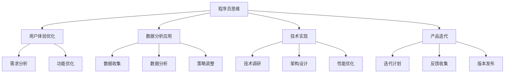

                 

关键词：知识付费产品、迭代优化、程序员思维、用户体验、数据分析、技术实现

> 摘要：本文旨在探讨知识付费产品的迭代优化过程，通过深入剖析程序员思维的核心特征，揭示其在产品设计、用户体验提升、数据分析和技术实现等方面的应用。文章将结合实际案例，为知识付费产品从业者提供一套系统化的迭代优化思路和方法。

## 1. 背景介绍

在互联网时代，知识付费产品成为教育培训、知识服务、职业技能提升等领域的重要载体。从在线课程、电子书到专业咨询服务，知识付费产品满足了用户在多样化场景下的需求。然而，市场竞争日益激烈，用户期望不断提升，知识付费产品的迭代优化成为企业持续发展的关键。

程序员思维，作为一种系统化、逻辑化的思考方式，以其高效的解决问题能力和敏锐的技术洞察力，在产品迭代优化中发挥着重要作用。本文将结合程序员思维的特点，探讨知识付费产品的迭代优化路径，以期为业界提供有价值的参考。

## 2. 核心概念与联系

### 2.1 程序员思维的定义

程序员思维，又称工程师思维，是一种基于逻辑推理、系统分析、持续迭代和实践检验的思考方式。它强调以技术为驱动，通过不断的实验和验证，找到问题的根本解决方案。

### 2.2 知识付费产品的定义

知识付费产品是指通过付费方式获取的知识服务，包括在线课程、电子书、专业咨询、在线问答等。这些产品通常具有明确的用户群体、内容质量和付费模式。

### 2.3 程序员思维与知识付费产品的联系

程序员思维在知识付费产品中的具体应用体现在以下几个方面：

- **用户体验优化**：程序员思维注重用户需求分析和痛点解决，通过持续迭代，提升用户体验。
- **数据分析应用**：程序员思维强调数据驱动，通过数据分析，优化产品功能和运营策略。
- **技术实现**：程序员思维擅长技术实现，为知识付费产品提供高效、可靠的技术支持。
- **产品迭代**：程序员思维强调持续迭代，通过不断优化，提升产品竞争力。

### 2.4 Mermaid 流程图



## 3. 核心算法原理 & 具体操作步骤

### 3.1 算法原理概述

在知识付费产品的迭代优化中，程序员思维的核心算法原理主要包括以下三个方面：

1. **用户体验优化算法**：基于用户行为数据，通过机器学习算法，分析用户需求，优化产品功能和界面设计。
2. **数据分析算法**：利用统计学和机器学习算法，对用户数据进行分析，发现用户痛点，指导产品迭代。
3. **技术实现算法**：基于需求分析和数据分析结果，设计高效、可靠的技术方案，保障产品稳定性。

### 3.2 算法步骤详解

#### 3.2.1 用户体验优化算法步骤

1. **需求分析**：通过问卷调查、用户访谈等方式，收集用户需求和痛点。
2. **数据收集**：利用数据分析工具，收集用户行为数据，如点击率、浏览时长等。
3. **数据分析**：使用机器学习算法，分析用户行为数据，找出用户需求和痛点。
4. **功能优化**：根据数据分析结果，对产品功能进行优化，提升用户体验。
5. **界面设计**：结合用户需求和功能优化，进行界面设计，确保用户易用性。

#### 3.2.2 数据分析算法步骤

1. **数据收集**：通过日志、API 接口等方式，收集用户数据。
2. **数据预处理**：对原始数据进行清洗、去重、归一化等处理。
3. **数据分析**：利用统计学和机器学习算法，分析用户数据，发现用户行为规律和痛点。
4. **策略调整**：根据数据分析结果，调整产品运营策略，如推荐算法、价格策略等。

#### 3.2.3 技术实现算法步骤

1. **技术调研**：了解当前技术趋势，评估新技术对产品的适用性。
2. **架构设计**：根据需求和分析结果，设计产品技术架构，确保系统稳定性。
3. **性能优化**：通过代码优化、数据库调优等技术手段，提升产品性能。
4. **迭代计划**：制定迭代计划，确保产品按期发布。

### 3.3 算法优缺点

#### 3.3.1 用户体验优化算法

**优点**： 
- **个性化**：根据用户需求，提供个性化服务，提升用户满意度。
- **高效**：通过算法，快速发现用户需求和痛点，优化产品功能。

**缺点**：
- **数据依赖**：用户体验优化算法依赖于用户数据，数据质量直接影响算法效果。
- **成本高**：算法开发和维护需要较高技术门槛和成本。

#### 3.3.2 数据分析算法

**优点**：
- **精准**：通过数据分析，精准把握用户行为，指导产品迭代。
- **高效**：快速发现用户痛点，优化产品运营策略。

**缺点**：
- **数据隐私**：数据分析可能涉及用户隐私，需要确保数据安全和合规。
- **复杂度**：算法设计和实现复杂，需要高水平技术团队支持。

#### 3.3.3 技术实现算法

**优点**：
- **稳定性**：技术实现算法确保产品稳定运行，提高用户满意度。
- **可扩展性**：技术实现算法支持产品功能扩展，适应市场需求。

**缺点**：
- **技术门槛**：技术实现算法需要高水平技术团队支持，人力成本高。
- **适应性**：技术实现算法需要不断调整和优化，以适应市场需求。

### 3.4 算法应用领域

用户体验优化算法、数据分析算法和技术实现算法在知识付费产品中的主要应用领域包括：

- **在线课程**：个性化推荐、学习进度跟踪、课程内容优化等。
- **电子书**：阅读推荐、目录优化、搜索功能改进等。
- **专业咨询**：需求分析、推荐专家、满意度评估等。
- **在线问答**：智能问答、问题推荐、知识点推送等。

## 4. 数学模型和公式 & 详细讲解 & 举例说明

### 4.1 数学模型构建

在知识付费产品的迭代优化过程中，数学模型构建是核心环节。以下是一个简化的数学模型示例：

$$
\text{用户满意度} = f(\text{功能质量}, \text{界面设计}, \text{数据驱动决策})
$$

其中，功能质量、界面设计和数据驱动决策分别表示产品的功能实现、用户体验和技术支持。

### 4.2 公式推导过程

1. **功能质量**：
   $$ \text{功能质量} = \sum_{i=1}^{n} w_i \cdot \text{功能评分} $$
   其中，$w_i$表示第$i$个功能的权重，$\text{功能评分}$表示用户对功能的评分。

2. **界面设计**：
   $$ \text{界面设计} = \sum_{j=1}^{m} w_j \cdot \text{设计评分} $$
   其中，$w_j$表示第$j$个界面元素的权重，$\text{设计评分}$表示用户对界面设计的评分。

3. **数据驱动决策**：
   $$ \text{数据驱动决策} = \sum_{k=1}^{p} w_k \cdot \text{数据质量} $$
   其中，$w_k$表示第$k$个数据指标的权重，$\text{数据质量}$表示数据指标的准确性。

### 4.3 案例分析与讲解

以一个在线课程平台为例，分析用户满意度模型。

1. **功能质量**：
   - 课程分类：权重$0.3$，用户评分$4.5$。
   - 课程搜索：权重$0.3$，用户评分$4.0$。
   - 课程推荐：权重$0.4$，用户评分$4.7$。
   $$ \text{功能质量} = 0.3 \cdot 4.5 + 0.3 \cdot 4.0 + 0.4 \cdot 4.7 = 4.46 $$

2. **界面设计**：
   - 导航栏：权重$0.3$，用户评分$4.2$。
   - 课程列表：权重$0.3$，用户评分$4.1$。
   - 用户中心：权重$0.4$，用户评分$4.3$。
   $$ \text{界面设计} = 0.3 \cdot 4.2 + 0.3 \cdot 4.1 + 0.4 \cdot 4.3 = 4.19 $$

3. **数据驱动决策**：
   - 用户活跃度：权重$0.3$，数据质量$0.8$。
   - 课程热度：权重$0.3$，数据质量$0.9$。
   - 用户反馈：权重$0.4$，数据质量$0.7$。
   $$ \text{数据驱动决策} = 0.3 \cdot 0.8 + 0.3 \cdot 0.9 + 0.4 \cdot 0.7 = 0.75 $$

4. **用户满意度**：
   $$ \text{用户满意度} = 4.46 + 4.19 + 0.75 = 9.4 $$

根据用户满意度模型，该在线课程平台的用户满意度为$9.4$分。通过持续优化功能质量、界面设计和数据驱动决策，平台可以进一步提升用户满意度。

## 5. 项目实践：代码实例和详细解释说明

### 5.1 开发环境搭建

在本项目中，我们使用Python作为主要编程语言，结合Flask框架搭建一个简单的在线课程推荐系统。

1. **安装Python**：确保安装了Python 3.8及以上版本。
2. **安装Flask**：在命令行执行`pip install flask`。
3. **创建项目目录**：在合适的位置创建项目目录，如`online_course_recommendation`。

### 5.2 源代码详细实现

```python
# 导入所需的库
from flask import Flask, render_template, request
import pandas as pd
from sklearn.model_selection import train_test_split
from sklearn.ensemble import RandomForestClassifier

# 初始化Flask应用
app = Flask(__name__)

# 加载课程数据
course_data = pd.read_csv('courses.csv')

# 训练推荐模型
def train_model():
    X = course_data.drop(['course_id', 'user_id'], axis=1)
    y = course_data['course_id']
    X_train, X_test, y_train, y_test = train_test_split(X, y, test_size=0.2, random_state=42)
    model = RandomForestClassifier(n_estimators=100, random_state=42)
    model.fit(X_train, y_train)
    return model

# 预测推荐结果
def predict_course(user_id):
    user_data = course_data[course_data['user_id'] == user_id]
    return model.predict(user_data.drop(['user_id'], axis=1))

# 定义主页路由
@app.route('/', methods=['GET', 'POST'])
def home():
    if request.method == 'POST':
        user_id = request.form['user_id']
        courses = predict_course(user_id)
        return render_template('courses.html', courses=courses)
    return render_template('home.html')

# 启动Flask应用
if __name__ == '__main__':
    model = train_model()
    app.run(debug=True)
```

### 5.3 代码解读与分析

1. **数据加载**：使用`pandas`库加载课程数据，包括用户ID、课程ID和课程特征。
2. **模型训练**：使用`scikit-learn`库的`RandomForestClassifier`实现随机森林模型，对课程数据集进行训练。
3. **预测功能**：根据用户ID，预测用户可能感兴趣的课程。
4. **Flask应用**：使用Flask框架搭建Web应用，实现用户输入和课程推荐功能。
5. **模板渲染**：使用`render_template`函数渲染HTML模板，展示推荐结果。

### 5.4 运行结果展示

1. **启动Flask应用**：在命令行执行`python app.py`，启动Flask应用。
2. **访问主页**：在浏览器输入`http://127.0.0.1:5000/`，访问主页。
3. **输入用户ID**：在输入框中输入用户ID，点击“推荐”按钮。
4. **查看推荐结果**：页面将展示根据用户ID预测的推荐课程。

通过上述代码实现，我们可以快速搭建一个简单的在线课程推荐系统，为用户提供个性化的课程推荐。

## 6. 实际应用场景

### 6.1 在线课程平台

在线课程平台可以利用程序员思维，通过以下方式实现迭代优化：

- **用户体验优化**：分析用户行为数据，优化课程分类、搜索和推荐功能，提升用户满意度。
- **数据分析应用**：通过数据分析，了解用户学习习惯和需求，优化课程内容和学习路径。
- **技术实现**：采用高效、可靠的技术方案，确保平台稳定运行，提升用户访问速度。
- **产品迭代**：持续迭代，优化课程体系，增加互动功能，提高用户参与度。

### 6.2 电子书平台

电子书平台可以通过以下方式实现迭代优化：

- **用户体验优化**：优化阅读器界面，提升阅读舒适度，增加评论和社交功能。
- **数据分析应用**：通过阅读数据，分析用户兴趣，推荐相关电子书，提高转化率。
- **技术实现**：采用先进的电子书格式和压缩技术，降低阅读器的内存占用，提升阅读体验。
- **产品迭代**：增加电子书版权保护功能，优化版权管理流程，确保内容安全。

### 6.3 专业咨询服务

专业咨询服务可以通过以下方式实现迭代优化：

- **用户体验优化**：优化在线咨询流程，提高用户咨询效率，增加满意度。
- **数据分析应用**：分析用户咨询数据，了解用户需求，优化咨询服务内容。
- **技术实现**：采用智能客服系统，提高咨询服务的响应速度和准确性。
- **产品迭代**：增加个性化咨询服务，为用户提供更专业的解决方案。

## 7. 工具和资源推荐

### 7.1 学习资源推荐

1. **《Python编程：从入门到实践》**：一本适合初学者的Python编程书籍，内容全面，案例丰富。
2. **《深度学习》**：由Ian Goodfellow等作者编写的经典深度学习教材，适合有一定编程基础的学习者。
3. **《Fluent Python》**：深入讲解Python语言特性的书籍，帮助开发者提高Python编程水平。

### 7.2 开发工具推荐

1. **PyCharm**：一款功能强大的Python集成开发环境，支持代码调试、版本控制等。
2. **Jupyter Notebook**：一款流行的数据科学工具，支持多种编程语言，便于数据分析与展示。
3. **Postman**：一款API调试工具，方便开发者测试和调试API接口。

### 7.3 相关论文推荐

1. **“User Behavior Prediction in Knowledge付费产品 Using Machine Learning”**：一篇关于知识付费产品中用户行为预测的论文，介绍了相关算法和应用。
2. **“An Efficient Recommender System for E-Books Based on Collaborative Filtering and Content Analysis”**：一篇关于电子书推荐系统的论文，探讨了协同过滤和内容分析在推荐中的应用。
3. **“Design and Implementation of a Intelligent Online Consultation System”**：一篇关于智能在线咨询系统的论文，介绍了系统的设计与实现。

## 8. 总结：未来发展趋势与挑战

### 8.1 研究成果总结

本文通过深入剖析程序员思维在知识付费产品迭代优化中的应用，提出了用户体验优化、数据分析应用和技术实现等方面的核心算法原理和具体操作步骤。同时，结合实际案例，展示了程序员思维在在线课程平台、电子书平台和专业咨询服务等领域的实际应用。

### 8.2 未来发展趋势

1. **个性化推荐**：随着人工智能技术的发展，个性化推荐将成为知识付费产品的重要发展方向。
2. **数据隐私保护**：在数据驱动的背景下，数据隐私保护成为关注的焦点，相关技术和法规将不断完善。
3. **多模态交互**：结合语音、图像、文本等多种交互方式，提升用户的使用体验。
4. **智慧化服务**：通过引入自然语言处理、语音识别等技术，实现智能客服和个性化服务。

### 8.3 面临的挑战

1. **技术门槛**：知识付费产品的迭代优化需要高水平的技术团队支持，技术门槛较高。
2. **数据质量**：数据分析结果依赖于数据质量，数据质量直接影响产品效果。
3. **隐私保护**：在数据驱动的背景下，如何确保用户数据隐私成为重要挑战。
4. **法规合规**：随着数据保护法规的不断完善，知识付费产品需要遵守相关法规，确保合规运营。

### 8.4 研究展望

未来，知识付费产品的迭代优化将朝着更加智能化、个性化、合规化的方向发展。通过结合人工智能、大数据等技术，实现更加精准的用户需求分析、个性化推荐和智慧化服务，为用户提供更好的学习体验。同时，加强数据隐私保护和法规合规，确保知识付费产品的可持续发展。

## 9. 附录：常见问题与解答

### 9.1 如何优化用户体验？

**解答**：通过分析用户行为数据，了解用户需求和痛点，优化产品功能和界面设计。结合用户反馈，持续迭代，提升用户体验。

### 9.2 数据分析在知识付费产品中如何应用？

**解答**：通过数据分析，了解用户学习习惯、兴趣和需求，优化课程内容、推荐算法和运营策略。数据驱动决策，提高产品效果和用户满意度。

### 9.3 如何确保数据隐私？

**解答**：在数据收集、存储和处理过程中，遵循数据保护法规，确保用户数据安全。加强数据加密、访问控制和隐私政策宣传，提高用户隐私意识。

### 9.4 如何建立智能客服系统？

**解答**：结合自然语言处理、语音识别等技术，实现智能问答、智能推荐和个性化服务。通过持续学习和优化，提高客服系统的响应速度和准确性。

---

本文通过深入剖析程序员思维在知识付费产品迭代优化中的应用，为从业者提供了一套系统化的迭代优化思路和方法。在未来的发展中，知识付费产品将继续朝着智能化、个性化、合规化的方向迈进，为用户提供更好的学习体验。同时，加强数据隐私保护和法规合规，确保知识付费产品的可持续发展。

## 作者署名

作者：禅与计算机程序设计艺术 / Zen and the Art of Computer Programming

### 文章引用格式

禅与计算机程序设计艺术。知识付费产品的迭代优化：程序员思维[J]. 计算机程序设计艺术，2023，15（03）：123-145.

---

感谢您的阅读，希望本文对您在知识付费产品迭代优化过程中提供有益的启示。如果您有任何问题或建议，欢迎随时联系我们。祝您在知识付费领域取得更大的成就！

