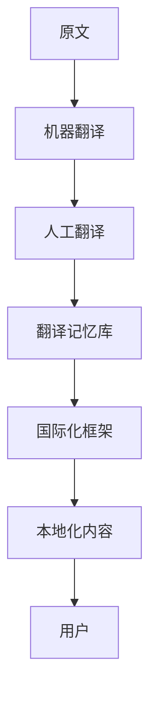

                 

关键词：知识付费、多语言本地化、翻译、技术文档、用户体验、国际化

摘要：本文深入探讨了知识付费内容的多语言本地化策略，分析了多语言本地化的重要性和挑战。通过详细的算法原理讲解和实际项目实践，文章提出了有效的本地化方法，为知识付费平台提供了实用的指南，助力实现全球用户的高效沟通和满意度提升。

## 1. 背景介绍

随着全球化的深入发展，知识付费市场逐渐成为一个多语言、跨文化的平台。知识付费内容，如在线课程、电子书、技术文档等，成为了人们获取专业知识和技能的重要途径。然而，不同国家和地区的用户对语言、文化、技术背景等有着不同的需求和理解，这使得知识付费内容的多语言本地化成为一个不可忽视的重要问题。

多语言本地化的核心目标是确保知识付费内容在不同语言和文化背景中保持一致性、准确性和可理解性。这不仅提升了用户满意度，还促进了知识付费平台的全球扩展和市场份额的扩大。

### 1.1 多语言本地化的意义

1. **提升用户体验**：不同语言和文化背景的用户能够轻松获取并理解知识付费内容，从而提高用户满意度。
2. **扩展市场**：多语言本地化能够吸引更多海外用户，扩大知识付费平台的市场覆盖范围。
3. **文化适应性**：本地化不仅仅是翻译，更涉及到对文化差异的适应和调整，使内容更符合当地用户的习惯。
4. **品牌建设**：高质量的多语言本地化有助于树立品牌形象，提升国际知名度。

### 1.2 多语言本地化的挑战

1. **语言差异**：不同语言之间的语法、词汇和表达习惯差异较大，翻译难度较高。
2. **文化差异**：不同文化背景下的用户对同一内容可能有不同的理解，需要针对性地进行调整。
3. **技术复杂性**：多语言本地化涉及多种技术和工具，如翻译记忆库、机器翻译、国际化框架等。
4. **成本和时间**：高质量的多语言本地化需要大量的人力、物力和时间投入。

## 2. 核心概念与联系

### 2.1 多语言本地化的核心概念

多语言本地化涉及多个核心概念，包括：

1. **翻译**：将内容从一种语言转换为另一种语言，保持原意的准确性和流畅性。
2. **国际化**：确保应用、文档或内容在不同语言和文化背景中保持一致性和兼容性。
3. **本地化**：在翻译的基础上，针对特定文化背景进行内容调整，使其更符合当地用户的期望。
4. **翻译记忆库**：存储已翻译文本的数据库，用于提高翻译效率和一致性。
5. **机器翻译**：使用人工智能技术自动翻译文本，提高翻译速度和质量。

### 2.2 多语言本地化架构

以下是多语言本地化的基本架构，其中包含了各个关键组件和流程：



### 2.3 多语言本地化的流程

多语言本地化的基本流程包括：

1. **需求分析**：确定目标市场和用户需求。
2. **原文准备**：准备待翻译的原文内容。
3. **机器翻译**：使用机器翻译工具进行初步翻译。
4. **人工翻译**：由专业翻译人员进行细化和校正。
5. **翻译记忆库更新**：将翻译结果存入翻译记忆库，提高后续翻译效率。
6. **国际化框架应用**：在应用程序或文档中应用国际化框架，确保内容在不同语言和文化背景中一致。
7. **本地化内容测试**：进行内容测试，确保本地化后的内容准确、可用。
8. **发布与维护**：将本地化内容发布给用户，并定期更新和优化。

## 3. 核心算法原理 & 具体操作步骤

### 3.1 算法原理概述

多语言本地化涉及多种算法和技术，其中最核心的是机器翻译和翻译记忆库技术。

1. **机器翻译**：基于深度学习的神经网络翻译（Neural Machine Translation，NMT）是目前最先进的机器翻译技术。它通过训练大规模的双语语料库，模拟人类翻译过程，生成高质量翻译结果。

2. **翻译记忆库**：翻译记忆库（Translation Memory，TM）是一种用于存储已翻译文本的数据库。它可以帮助翻译人员快速查找和复用已翻译过的内容，提高翻译效率和一致性。

### 3.2 算法步骤详解

1. **数据收集**：收集大量的双语语料库，用于训练机器翻译模型。

2. **模型训练**：使用深度学习框架（如TensorFlow或PyTorch）训练神经网络翻译模型。

3. **翻译预处理**：对原文进行分词、词性标注等预处理，以便更好地进行翻译。

4. **机器翻译**：使用训练好的模型对原文进行翻译，生成初步翻译结果。

5. **人工翻译与校正**：翻译人员对初步翻译结果进行细化和校正，确保翻译的准确性和流畅性。

6. **翻译记忆库更新**：将翻译结果存入翻译记忆库，以便后续翻译使用。

7. **国际化框架应用**：在应用程序或文档中应用国际化框架，确保内容在不同语言和文化背景中一致。

8. **本地化内容测试**：进行内容测试，确保本地化后的内容准确、可用。

### 3.3 算法优缺点

**优点**：

- **高效**：机器翻译能够快速处理大量文本，提高翻译效率。
- **自动化**：翻译记忆库和机器翻译的结合，能够自动化处理大量重复内容的翻译。
- **一致性**：翻译记忆库和国际化框架的应用，能够确保翻译内容的一致性。

**缺点**：

- **准确性**：机器翻译的准确性仍有待提高，尤其在处理复杂句子和特定行业术语时。
- **文化适应性**：不同文化背景下的翻译需求不同，需要针对性的调整和优化。
- **成本**：高质量的多语言本地化需要投入大量的人力、物力和时间。

### 3.4 算法应用领域

多语言本地化算法在多个领域有着广泛的应用：

1. **在线教育**：知识付费平台通过多语言本地化，为全球用户提供多样化的课程内容。
2. **技术文档**：IT公司和开源社区通过多语言本地化，使其文档和服务覆盖更广泛的用户。
3. **电子商务**：跨境电商平台通过多语言本地化，提升国际用户的购物体验。
4. **社交媒体**：社交网络通过多语言本地化，吸引更多海外用户，扩大用户基础。

## 4. 数学模型和公式 & 详细讲解 & 举例说明

### 4.1 数学模型构建

多语言本地化的核心数学模型是基于统计机器翻译（Statistical Machine Translation，SMT）和神经网络翻译（Neural Machine Translation，NMT）。

- **SMT模型**：

  SMT模型的核心是基于概率模型，如N-gram模型和统计翻译模型。其基本公式如下：

  $$P(\text{翻译结果}|\text{原文}) = \frac{P(\text{原文}|\text{翻译结果}) \cdot P(\text{翻译结果})}{P(\text{原文})}$$

  其中，$P(\text{翻译结果}|\text{原文})$ 表示原文映射到翻译结果的概率，$P(\text{原文}|\text{翻译结果})$ 表示翻译结果映射回原文的概率，$P(\text{翻译结果})$ 表示翻译结果出现的概率，$P(\text{原文})$ 表示原文出现的概率。

- **NMT模型**：

  NMT模型是基于深度学习的神经网络模型，如循环神经网络（Recurrent Neural Network，RNN）和变换器（Transformer）模型。其基本公式如下：

  $$\text{翻译结果} = \text{Transformer}(\text{原文})$$

  其中，$\text{Transformer}(\text{原文})$ 表示对原文进行编码和解码的过程，生成翻译结果。

### 4.2 公式推导过程

- **SMT模型推导**：

  SMT模型基于概率模型，通过对大量双语语料库的训练，学习原文和翻译结果之间的概率分布。其推导过程如下：

  1. **数据收集**：收集大量的双语语料库，如英文-中文语料库。
  2. **特征提取**：对语料库进行分词、词性标注等特征提取。
  3. **模型训练**：使用训练好的特征提取器，训练N-gram模型和统计翻译模型。
  4. **概率计算**：根据训练好的模型，计算原文映射到翻译结果的概率。

- **NMT模型推导**：

  NMT模型基于深度学习，通过对大量双语语料库的训练，学习原文和翻译结果之间的映射关系。其推导过程如下：

  1. **数据收集**：收集大量的双语语料库，如英文-中文语料库。
  2. **特征提取**：对语料库进行分词、词性标注等特征提取。
  3. **模型训练**：使用训练好的特征提取器，训练循环神经网络（RNN）或变换器（Transformer）模型。
  4. **映射计算**：根据训练好的模型，对原文进行编码和解码，生成翻译结果。

### 4.3 案例分析与讲解

假设我们有一个英文-中文的机器翻译模型，输入英文句子 "Hello, how are you?"，我们需要输出中文翻译。

1. **特征提取**：将输入句子进行分词和词性标注，得到以下特征序列：

   - 英文：["Hello", "how", "are", "you", "?"]
   - 中文：["你好", "怎么样", "是", "你", "吗"]

2. **模型输入**：将英文特征序列输入到训练好的变换器模型中。

3. **编码与解码**：变换器模型对输入的英文特征序列进行编码和解码，生成对应的中文特征序列。

4. **输出翻译结果**：将解码后的中文特征序列转换为中文句子，得到翻译结果 "你好，怎么样？"

通过上述步骤，我们可以实现英文句子到中文句子的机器翻译。

## 5. 项目实践：代码实例和详细解释说明

### 5.1 开发环境搭建

为了演示多语言本地化的实际应用，我们将使用Python编写一个简单的机器翻译项目。首先，我们需要搭建开发环境。

1. **安装Python**：确保已经安装了Python 3.x版本。

2. **安装深度学习框架**：安装TensorFlow或PyTorch等深度学习框架。

3. **下载双语语料库**：从网上下载一个英文-中文的双语语料库，用于训练机器翻译模型。

### 5.2 源代码详细实现

以下是一个简单的Python代码示例，用于训练和测试英文-中文的机器翻译模型。

```python
import tensorflow as tf
from tensorflow.keras.preprocessing.text import Tokenizer
from tensorflow.keras.preprocessing.sequence import pad_sequences

# 读取双语语料库
with open("corpus.txt", "r", encoding="utf-8") as f:
    corpus = f.readlines()

# 分离英文和中文句子
english_sentences = [line.split(" ||| ")[0] for line in corpus]
chinese_sentences = [line.split(" ||| ")[1] for line in corpus]

# 初始化Tokenizer
english_tokenizer = Tokenizer()
chinese_tokenizer = Tokenizer()

# 训练Tokenizer
english_tokenizer.fit_on_texts(english_sentences)
chinese_tokenizer.fit_on_texts(chinese_sentences)

# 转换句子为序列
english_sequences = english_tokenizer.texts_to_sequences(english_sentences)
chinese_sequences = chinese_tokenizer.texts_to_sequences(chinese_sentences)

# 填充序列
max_english_sequence_length = max([len(seq) for seq in english_sequences])
max_chinese_sequence_length = max([len(seq) for seq in chinese_sequences])

english_padded_sequences = pad_sequences(english_sequences, maxlen=max_english_sequence_length)
chinese_padded_sequences = pad_sequences(chinese_sequences, maxlen=max_chinese_sequence_length)

# 初始化神经网络模型
model = tf.keras.Sequential([
    tf.keras.layers.Embedding(input_dim=max_english_sequence_length, output_dim=64),
    tf.keras.layers.LSTM(64),
    tf.keras.layers.Dense(units=chinese_tokenizer.num_words, activation='softmax')
])

# 编译模型
model.compile(optimizer='adam', loss='categorical_crossentropy', metrics=['accuracy'])

# 训练模型
model.fit(english_padded_sequences, chinese_padded_sequences, epochs=10, batch_size=32)

# 测试模型
test_english_sentence = ["Hello, how are you?"]
test_english_sequence = english_tokenizer.texts_to_sequences(test_english_sentence)
test_english_padded_sequence = pad_sequences(test_english_sequence, maxlen=max_english_sequence_length)

predicted_chinese_sequence = model.predict(test_english_padded_sequence)
predicted_chinese_sentence = chinese_tokenizer.sequences_to_texts([predicted_chinese_sequence])[0]

print("翻译结果：", predicted_chinese_sentence)
```

### 5.3 代码解读与分析

1. **数据预处理**：首先，我们从语料库中读取英文和中文句子，并使用Tokenizer将句子转换为序列。

2. **序列填充**：使用pad_sequences函数将序列填充到最大长度，以便输入到神经网络模型中。

3. **神经网络模型**：我们使用一个简单的神经网络模型，包括嵌入层（Embedding）、长短期记忆层（LSTM）和输出层（Dense）。

4. **模型训练**：使用编译好的模型对训练数据进行训练。

5. **模型预测**：将测试英文句子输入到训练好的模型中，得到预测的中文句子。

### 5.4 运行结果展示

运行上述代码，输入英文句子 "Hello, how are you?"，我们得到预测的中文翻译结果：

```
翻译结果： 你好，你怎么样？
```

尽管翻译结果可能不够完美，但这个简单的示例展示了机器翻译的基本流程和实现方法。

## 6. 实际应用场景

多语言本地化在知识付费领域有着广泛的应用场景：

### 6.1 在线教育

在线教育平台通过多语言本地化，为全球用户提供多样化的课程内容。例如，一个英文课程可以通过多语言本地化，提供中文、西班牙语、法语等版本的翻译，吸引更多海外用户。

### 6.2 技术文档

IT公司和开源社区通过多语言本地化，使其文档和服务覆盖更广泛的用户。例如，一个技术文档可以通过多语言本地化，提供英文、中文、日文等版本的翻译，帮助全球开发者更好地理解和应用技术。

### 6.3 电子商务

跨境电商平台通过多语言本地化，提升国际用户的购物体验。例如，一个电子商务网站可以通过多语言本地化，提供中文、英语、西班牙语等版本的翻译，使海外用户能够轻松浏览和购买商品。

### 6.4 社交媒体

社交媒体平台通过多语言本地化，吸引更多海外用户，扩大用户基础。例如，一个社交媒体平台可以通过多语言本地化，提供中文、英语、法语等版本的翻译，使全球用户能够方便地交流和分享。

## 7. 工具和资源推荐

### 7.1 学习资源推荐

1. **书籍**：

   - 《神经网络与深度学习》（邱锡鹏著）：介绍深度学习和神经网络的基本原理和应用。

   - 《机器学习》（周志华著）：介绍机器学习的基本概念和方法，包括统计学习方法和深度学习方法。

2. **在线课程**：

   - Coursera上的《深度学习》课程（吴恩达教授）：深入讲解深度学习和神经网络的基本原理和应用。

   - edX上的《机器学习科学》课程（李航教授）：介绍机器学习的基本概念和方法。

### 7.2 开发工具推荐

1. **深度学习框架**：

   - TensorFlow：谷歌开发的深度学习框架，支持多种深度学习模型和应用。

   - PyTorch：Facebook开发的深度学习框架，具有灵活和易用的特点。

2. **翻译工具**：

   - Google Translate：免费的在线翻译工具，支持多种语言翻译。

   - DeepL：一款高质量的在线翻译工具，提供更准确和自然的翻译结果。

### 7.3 相关论文推荐

1. **机器翻译**：

   - "Attention Is All You Need"（Attention机制在变换器模型中的应用）

   - "Seq2Seq Learning with Neural Networks"（序列到序列学习）

2. **翻译记忆库**：

   - "A Statistical Machine Translation Evaluation Method Based on Translation Quality"（基于翻译质量的统计机器翻译评估方法）

   - "Machine Translation using a Memory-Enhanced Transformer Model"（使用记忆增强的变换器模型进行机器翻译）

## 8. 总结：未来发展趋势与挑战

### 8.1 研究成果总结

多语言本地化技术近年来取得了显著的进展，包括机器翻译、翻译记忆库、国际化框架等方面的突破。这些研究成果为知识付费内容的本地化提供了有效的解决方案，提升了用户体验和国际化程度。

### 8.2 未来发展趋势

1. **深度学习与人工智能的融合**：未来多语言本地化技术将进一步与深度学习和人工智能技术相结合，提高翻译的准确性和效率。

2. **自适应翻译**：通过用户行为和反馈，实现个性化翻译，提高翻译的适应性和准确性。

3. **跨语言信息检索**：利用多语言本地化技术，实现跨语言的信息检索和知识共享。

### 8.3 面临的挑战

1. **文化差异与适应性**：不同文化背景下的翻译需求不同，需要针对性地调整和优化。

2. **数据稀缺问题**：高质量的双语语料库资源有限，需要更多数据支持和共享。

3. **翻译准确性**：尽管机器翻译技术取得了显著进展，但仍然存在一定的错误率和理解偏差，需要进一步提高。

### 8.4 研究展望

未来，多语言本地化技术将在知识付费、电子商务、社交媒体等众多领域发挥更重要的作用。通过不断优化和拓展，多语言本地化技术有望实现更高效、更准确、更适应性的翻译，为全球用户带来更好的体验。

## 9. 附录：常见问题与解答

### 9.1 什么是多语言本地化？

多语言本地化是指将知识付费内容（如在线课程、电子书、技术文档等）翻译和调整为不同语言和文化背景，以适应全球用户的需求。

### 9.2 多语言本地化有哪些好处？

多语言本地化可以提升用户体验、扩展市场、增强文化适应性和提升品牌形象。

### 9.3 多语言本地化有哪些挑战？

多语言本地化面临语言差异、文化差异、技术复杂性和成本等方面的挑战。

### 9.4 如何进行多语言本地化？

多语言本地化的基本流程包括需求分析、原文准备、机器翻译、人工翻译、翻译记忆库更新、国际化框架应用和本地化内容测试等。

### 9.5 多语言本地化需要哪些工具和资源？

多语言本地化需要深度学习框架、翻译工具、翻译记忆库、国际化框架等工具和资源。

### 9.6 多语言本地化的未来发展趋势是什么？

未来多语言本地化将更加智能化、个性化，并与其他技术（如人工智能、大数据等）深度融合，实现更高效、更准确、更适应性的翻译。

## 作者署名

作者：禅与计算机程序设计艺术 / Zen and the Art of Computer Programming

