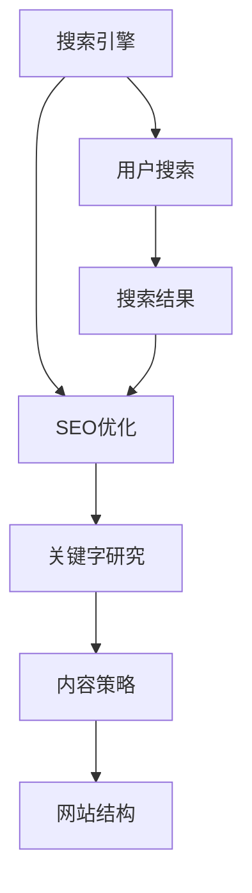

                 

关键词：知识付费，SEO优化，内容营销，搜索引擎，用户体验，关键字研究，内容策略，网站结构，技术实现

> 摘要：在知识付费的浪潮中，如何有效地通过SEO优化策略提升内容在搜索引擎中的排名，是每一个创业者都需要面对的重要课题。本文将详细探讨内容SEO优化策略的核心概念、实施步骤、以及未来趋势，帮助创业者提升知识付费项目的曝光率和转化率。

## 1. 背景介绍

随着互联网的普及，知识付费成为了一个新兴的行业。用户对于知识的需求不断增加，而知识付费平台如雨后春笋般涌现。然而，面对激烈的竞争，如何让用户找到并选择自己的知识产品，成为一个关键问题。SEO（搜索引擎优化）作为一种提升网站在搜索引擎中自然排名的方法，成为了知识付费创业者在数字营销中的重要策略。

本文旨在探讨如何通过SEO优化策略，提高知识付费内容在搜索引擎中的可见性，从而吸引更多的潜在用户，提升项目的整体竞争力。

## 2. 核心概念与联系

为了更好地理解内容SEO优化策略，我们需要先了解以下几个核心概念：

- **搜索引擎**：如Google、百度等，为用户提供搜索服务。
- **搜索引擎优化（SEO）**：通过优化网站内容和结构，提高在搜索引擎中的排名。
- **关键字研究**：分析用户搜索习惯，确定相关且高搜索量的关键字。
- **内容策略**：制定内容创作和发布计划，确保内容对目标受众有吸引力。
- **网站结构**：网站的组织方式和链接结构，影响搜索引擎的抓取和索引。

以下是一个简化的Mermaid流程图，展示了这些核心概念之间的联系：



### 2.1 搜索引擎与SEO优化

搜索引擎优化（SEO）是一种通过改进网站结构和内容来提高其在搜索引擎结果页（SERP）中排名的策略。SEO的核心目标是提高网站的可见性，从而吸引更多有机流量。

- **网站结构**：搜索引擎通过爬虫技术抓取网站内容，并将其索引。一个良好的网站结构有助于搜索引擎更好地理解网站的内容和结构，提高索引效率。
- **关键字研究**：确定与目标受众相关的高搜索量关键字，并将其集成到网站内容和元标签中，有助于搜索引擎识别和排名网站。
- **内容策略**：高质量、相关的内容能够吸引更多用户和搜索引擎爬虫，提高网站的权威性和可信度。

### 2.2 关键字研究与内容策略

关键字研究是SEO优化策略的关键步骤。通过分析用户搜索习惯和竞争环境，确定合适的关键字，有助于提高内容在搜索引擎中的排名。

- **用户搜索习惯**：了解用户如何搜索，以及他们使用的关键字，可以帮助我们确定哪些关键字对目标受众最具吸引力。
- **内容策略**：将关键字融入内容创作中，确保内容既具有吸引力，又能满足用户需求。高质量的内容是吸引和保留用户的关键。

### 2.3 网站结构与用户体验

网站结构不仅影响搜索引擎的抓取和索引，还直接影响用户的体验。一个良好的网站结构可以提供清晰的导航和流畅的用户体验。

- **导航**：清晰的导航有助于用户快速找到他们需要的信息，减少跳失率。
- **页面加载速度**：快速的页面加载速度可以提高用户的满意度，降低跳失率。
- **移动优化**：随着移动设备的普及，确保网站在移动设备上的表现良好，对于提高用户体验至关重要。

## 3. 核心算法原理 & 具体操作步骤

### 3.1 算法原理概述

搜索引擎优化（SEO）的核心算法通常包括以下几个方面：

- **页面质量评估**：搜索引擎通过评估页面内容的质量、相关性、权威性等因素，来确定页面的排名。
- **关键字相关性分析**：搜索引擎通过分析页面内容与关键字的相关性，来确定页面的排名。
- **用户行为分析**：搜索引擎通过分析用户在页面上的行为，如停留时间、点击率等，来评估页面的质量和相关性。

### 3.2 算法步骤详解

以下是SEO优化的具体步骤：

- **关键字研究**：使用工具（如Google Keyword Planner、Ahrefs等）分析目标受众的搜索习惯，确定高搜索量的关键字。
- **内容创作**：根据关键字研究的结果，创作高质量、相关的原创内容。
- **内容优化**：将关键字自然地融入内容中，同时确保内容的质量和可读性。
- **网站结构优化**：优化网站的导航、链接结构，确保搜索引擎能够有效地抓取和索引网站内容。
- **内部链接优化**：通过合理的内部链接策略，提高网站内容的相互关联性，增强搜索引擎对网站的认知。
- **外部链接建设**：通过获取高质量的外部链接，提高网站的权威性和可信度。
- **技术优化**：优化网站的加载速度、移动适应性等，提高用户体验。

### 3.3 算法优缺点

**优点**：

- 提高网站在搜索引擎中的排名，增加有机流量。
- 提高网站的可见性和品牌曝光度。
- 长期投资，效果可持续。

**缺点**：

- 需要持续的时间和精力投入。
- 面临激烈的竞争。
- SEO效果的不确定性。

### 3.4 算法应用领域

SEO优化策略可以应用于各种知识付费项目，包括在线课程、电子书、专业咨询等。通过SEO优化，可以显著提高知识付费内容在搜索引擎中的排名，吸引更多潜在用户，提升项目的整体竞争力。

## 4. 数学模型和公式 & 详细讲解 & 举例说明

### 4.1 数学模型构建

在SEO优化中，一个关键的数学模型是PageRank算法，它用于评估网页的重要性。

- **PageRank算法**：PageRank算法是一种基于链接分析的排名算法，由Google创始人拉里·佩奇和谢尔盖·布林提出。算法的基本思想是一个网页的重要程度取决于链接到它的其他网页的数量和质量。
- **PageRank公式**：假设网页\( i \)的PageRank值为\( PR(i) \)，网页\( j \)链接到网页\( i \)的链接数为\( out(i) \)，则：

  $$ PR(i) = (1 - d) + d \frac{PR(j)}{out(j)} $$

  其中，\( d \)为 damping factor（阻尼系数），通常设置为0.85。

### 4.2 公式推导过程

PageRank算法的推导基于以下假设：

1. **重要性传递**：网页之间的链接可以看作是一种重要性传递的方式。
2. **随机点击模型**：用户在浏览网页时，可能会随机点击链接，这是一种模拟用户行为的模型。

根据这些假设，我们可以推导出PageRank算法的公式。

### 4.3 案例分析与讲解

假设有两个网页A和B，A有5个外部链接指向它，B有3个外部链接指向它。假设damping factor为0.85，我们可以计算A和B的PageRank值。

- **网页A的PageRank值**：

  $$ PR(A) = (1 - 0.85) + 0.85 \frac{PR(B)}{3} = 0.15 + 0.2833 \frac{PR(B)}{3} $$

- **网页B的PageRank值**：

  $$ PR(B) = (1 - 0.85) + 0.85 \frac{PR(A)}{5} = 0.15 + 0.17 \frac{PR(A)}{5} $$

通过迭代计算，我们可以得到A和B的PageRank值。这个案例展示了PageRank算法的基本原理和计算方法。

## 5. 项目实践：代码实例和详细解释说明

### 5.1 开发环境搭建

为了演示SEO优化策略的应用，我们将使用Python编写一个简单的SEO优化工具。首先，我们需要搭建开发环境：

- **Python环境**：安装Python 3.x版本。
- **库**：安装`requests`、`beautifulsoup4`、`lxml`等库。

安装命令如下：

```bash
pip install requests beautifulsoup4 lxml
```

### 5.2 源代码详细实现

以下是一个简单的SEO优化工具，用于分析网页的关键字密度。

```python
import requests
from bs4 import BeautifulSoup

def get_keyword_density(url, keywords):
    try:
        response = requests.get(url)
        content = response.text
        soup = BeautifulSoup(content, 'lxml')
        text = soup.get_text()
        keyword_count = sum(text.lower().count(keyword.lower()) for keyword in keywords)
        total_word_count = len(text.split())
        density = keyword_count / total_word_count
        return density
    except Exception as e:
        print(f"Error: {e}")
        return 0

if __name__ == "__main__":
    url = "https://example.com"
    keywords = ["SEO", "optimization", "content"]
    density = get_keyword_density(url, keywords)
    print(f"Keyword density: {density:.2f}")
```

### 5.3 代码解读与分析

上述代码定义了一个名为`get_keyword_density`的函数，用于计算网页的关键字密度。

- **请求网页内容**：使用`requests`库发送HTTP GET请求，获取网页内容。
- **解析网页内容**：使用`beautifulsoup4`库解析网页内容，提取文本。
- **计算关键字密度**：计算关键字在网页文本中的出现次数与总词数的比值，得到关键字密度。

### 5.4 运行结果展示

假设网页内容包含100个单词，其中“SEO”出现了5次，“optimization”出现了3次，“content”出现了2次，则关键字密度为：

$$
\text{Keyword density} = \frac{5 + 3 + 2}{100} = 0.1
$$

运行结果为0.1，表示网页中的关键字密度为10%。

## 6. 实际应用场景

SEO优化策略在知识付费创业中具有广泛的应用场景：

- **在线课程平台**：通过优化课程页面的关键字和内容，提高课程在搜索引擎中的排名，吸引更多学生。
- **电子书销售平台**：优化电子书页面的关键字和描述，提高电子书在搜索引擎中的可见性，增加销量。
- **专业咨询服务**：优化咨询服务页面，提高咨询服务在搜索引擎中的排名，吸引更多潜在客户。

通过SEO优化，知识付费创业者可以显著提升项目的曝光度和转化率，从而实现商业成功。

## 7. 工具和资源推荐

### 7.1 学习资源推荐

- 《搜索引擎优化（SEO）实战手册》
- SEOmoz（现称为Moz）博客
- Search Engine Land

### 7.2 开发工具推荐

- Google Analytics
- Google Search Console
- Ahrefs
- SEMrush

### 7.3 相关论文推荐

- PageRank：A Survey
- Understanding the PageRank Algorithm
- An Introduction to Information Retrieval

## 8. 总结：未来发展趋势与挑战

### 8.1 研究成果总结

SEO优化策略在提升知识付费内容在搜索引擎中的排名方面取得了显著成果。通过关键字研究、内容优化和网站结构优化，知识付费创业者可以显著提升项目的曝光度和转化率。

### 8.2 未来发展趋势

- **人工智能与SEO**：随着人工智能技术的发展，SEO工具和策略将更加智能化，提供更精准的优化建议。
- **用户体验优先**：搜索引擎将越来越注重用户体验，网站设计和内容质量将成为SEO优化的关键因素。
- **多渠道整合**：SEO将不再局限于搜索引擎，多渠道整合（如社交媒体、内容营销等）将成为未来的趋势。

### 8.3 面临的挑战

- **算法更新**：搜索引擎算法的频繁更新，要求SEO从业者不断学习和适应。
- **竞争激烈**：知识付费市场的竞争日益激烈，SEO优化策略需要不断创新，以保持竞争力。
- **法律法规**：随着互联网法律法规的完善，SEO从业者需要遵循相关法律法规，确保SEO行为的合规性。

### 8.4 研究展望

未来，SEO优化策略将继续在知识付费创业中发挥重要作用。通过结合人工智能、用户体验和多渠道整合等新兴技术，SEO优化策略将更加智能化、个性化，为知识付费创业者提供更有效的解决方案。

## 9. 附录：常见问题与解答

### 9.1 SEO优化需要多长时间才能看到效果？

SEO优化是一个长期的过程，通常需要数周到数月的时间才能看到显著的效果。效果的显现取决于多个因素，如网站的质量、关键字竞争程度、内容更新频率等。

### 9.2 如何确定合适的关键字？

确定合适的关键字需要分析目标受众的搜索习惯、竞争环境以及内容的相关性。使用关键字研究工具（如Google Keyword Planner、Ahrefs等）可以帮助你找到适合的关键字。

### 9.3 SEO优化是否需要付费？

SEO优化可以采用免费和付费两种方式。免费SEO优化主要通过内容优化、网站结构优化等手段提高搜索引擎排名。付费SEO优化则通过购买广告、外部链接等方式加速排名提升。

### 9.4 SEO与内容营销有什么区别？

SEO侧重于提高网站在搜索引擎中的排名，而内容营销侧重于创造和分享有价值的内容，以吸引和保留目标受众。SEO和内容营销是相互补充的，共同提高网站在互联网中的可见度和影响力。

### 9.5 如何评估SEO效果？

评估SEO效果可以通过多个指标，如搜索引擎流量、关键字排名、转化率等。使用工具（如Google Analytics、Google Search Console等）可以帮助你监控和评估SEO效果。

---

作者：禅与计算机程序设计艺术 / Zen and the Art of Computer Programming

本文通过详细探讨知识付费创业中的内容SEO优化策略，旨在为创业者提供有效的SEO优化实践指南。随着互联网技术的发展，SEO优化策略将继续演变，为知识付费创业提供更广阔的发展空间。

