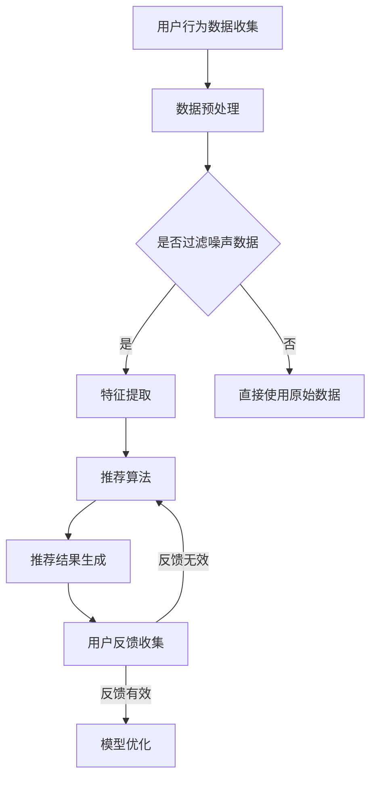

                 

关键词：知识付费、个性化推荐、算法、内容生产、用户行为分析、用户体验、转化率、平台优化。

## 摘要

本文探讨了知识付费领域中内容个性化推荐的重要性及其在创业中的应用。通过对用户行为的深入分析，本文阐述了个性化推荐算法的基本原理和操作步骤，并介绍了数学模型和相关公式。随后，通过一个实际项目实例展示了算法在实际开发中的应用。文章还分析了个性化推荐在知识付费创业中的实际应用场景，并对未来的发展趋势和挑战进行了展望。最后，本文推荐了一些学习资源和开发工具，以帮助读者进一步了解和掌握这一领域。

## 1. 背景介绍

随着互联网的普及和移动互联网的迅猛发展，知识付费逐渐成为一种新兴的商业模式。知识付费平台通过为用户提供有价值的知识内容，实现了知识共享和经济效益的双重提升。在这个过程中，个性化推荐成为知识付费创业中的关键因素。

个性化推荐系统能够根据用户的历史行为、兴趣偏好和需求，为用户推荐最相关、最有价值的内容。这种精准的推荐方式不仅能够提升用户体验，还能显著提高平台的转化率和用户粘性。

然而，构建一个高效的个性化推荐系统并非易事。首先，需要对海量的用户行为数据进行分析和处理，提取出有价值的信息。其次，需要设计合适的算法和数学模型，确保推荐结果的准确性和多样性。最后，还需要不断地优化和调整系统，以适应不断变化的市场需求和用户行为。

本文将深入探讨知识付费创业中的内容个性化推荐，从核心概念、算法原理、数学模型、项目实践等多个角度进行全面分析，旨在为创业者提供实用的指导和建议。

## 2. 核心概念与联系

### 2.1 用户行为数据

用户行为数据是构建个性化推荐系统的基石。这些数据包括用户的浏览记录、购买历史、评价反馈、搜索关键词等。通过分析这些数据，可以了解用户的兴趣偏好和需求，为推荐算法提供依据。

### 2.2 个性化推荐算法

个性化推荐算法是核心技术之一，主要包括基于内容的推荐、协同过滤推荐、基于模型的推荐等。这些算法通过分析用户行为数据和内容特征，为用户生成个性化的推荐列表。

### 2.3 数学模型

数学模型是推荐系统的核心，用于描述用户行为、内容特征和推荐结果之间的关系。常见的数学模型包括矩阵分解、贝叶斯推断、神经网络等。

### 2.4 Mermaid 流程图

以下是一个简化的Mermaid流程图，展示了个性化推荐系统的主要流程：



### 2.5 个性化推荐系统的架构

个性化推荐系统的架构通常包括数据层、算法层和展示层。数据层负责数据的收集、存储和处理；算法层负责推荐算法的设计和实现；展示层负责将推荐结果呈现给用户。

## 3. 核心算法原理 & 具体操作步骤

### 3.1 算法原理概述

个性化推荐算法的核心目标是根据用户的行为和偏好，生成个性化的推荐列表。以下是一些常见的推荐算法：

- **基于内容的推荐**：通过分析内容的特征，将相似的内容推荐给用户。

- **协同过滤推荐**：通过分析用户之间的行为模式，将其他用户喜欢的内容推荐给当前用户。

- **基于模型的推荐**：利用机器学习模型，如矩阵分解、神经网络等，预测用户对内容的兴趣。

### 3.2 算法步骤详解

#### 3.2.1 基于内容的推荐

1. 数据收集：收集用户的行为数据和内容数据。
2. 特征提取：对内容进行特征提取，如文本分类、关键词提取等。
3. 评分预测：计算用户对内容的潜在兴趣评分。
4. 排序：根据评分对内容进行排序，生成推荐列表。

#### 3.2.2 协同过滤推荐

1. 数据收集：收集用户的行为数据，如浏览记录、购买历史等。
2. 评分矩阵构建：构建用户-物品评分矩阵。
3. 邻居选择：选择与当前用户相似度最高的邻居用户。
4. 评分预测：根据邻居用户的评分预测当前用户对物品的兴趣评分。
5. 排序：根据评分对物品进行排序，生成推荐列表。

#### 3.2.3 基于模型的推荐

1. 数据收集：收集用户的行为数据和内容数据。
2. 特征提取：对用户和内容进行特征提取。
3. 模型训练：使用机器学习算法，如矩阵分解、神经网络等，训练推荐模型。
4. 评分预测：使用训练好的模型预测用户对内容的兴趣评分。
5. 排序：根据评分对内容进行排序，生成推荐列表。

### 3.3 算法优缺点

- **基于内容的推荐**：优点是简单易懂，易于实现；缺点是推荐结果受限于内容的特征，可能缺乏多样性。

- **协同过滤推荐**：优点是能够利用用户之间的行为模式，提高推荐的相关性；缺点是可能产生冷启动问题，即新用户或新物品无法获得有效的推荐。

- **基于模型的推荐**：优点是能够自动学习用户和内容的潜在特征，提高推荐质量；缺点是模型训练和优化较为复杂。

### 3.4 算法应用领域

个性化推荐算法广泛应用于电商、社交媒体、视频网站、音乐平台等多个领域。在知识付费创业中，个性化推荐能够帮助平台更好地满足用户需求，提升用户体验和转化率。

## 4. 数学模型和公式

### 4.1 数学模型构建

在个性化推荐中，常用的数学模型包括矩阵分解、贝叶斯推断和神经网络等。

#### 4.1.1 矩阵分解

矩阵分解是一种常见的推荐算法，用于预测用户对未评价的物品的兴趣评分。其基本思想是将用户-物品评分矩阵分解为两个低秩矩阵，分别表示用户和物品的潜在特征。

假设用户-物品评分矩阵为 \(R \in \mathbb{R}^{m \times n}\)，其中 \(m\) 表示用户数量，\(n\) 表示物品数量。矩阵分解的目标是找到两个低秩矩阵 \(U \in \mathbb{R}^{m \times k}\) 和 \(V \in \mathbb{R}^{n \times k}\)，使得 \(R \approx UV^T\)，其中 \(k\) 是潜在特征维度。

#### 4.1.2 贝叶斯推断

贝叶斯推断是一种基于概率论的推荐算法，用于预测用户对未评价的物品的兴趣评分。其基本思想是根据用户的历史行为数据和先验知识，计算后验概率，从而预测用户对物品的兴趣。

假设用户 \(u\) 对物品 \(i\) 的兴趣评分为 \(r_{ui}\)，根据贝叶斯定理，后验概率可以表示为：

$$
P(r_{ui} | u, I) = \frac{P(r_{ui})P(u | r_{ui})}{P(u)}
$$

其中，\(P(r_{ui})\) 是物品 \(i\) 的先验概率，\(P(u | r_{ui})\) 是在物品 \(i\) 评价下用户 \(u\) 的概率，\(P(u)\) 是用户 \(u\) 的先验概率。

#### 4.1.3 神经网络

神经网络是一种基于模拟人脑神经元结构的计算模型，用于预测用户对未评价的物品的兴趣评分。其基本思想是通过多层神经元的传递和激活，将输入数据转换为输出结果。

假设输入层为 \(X \in \mathbb{R}^{m \times n}\)，隐藏层为 \(H \in \mathbb{R}^{n \times k}\)，输出层为 \(Y \in \mathbb{R}^{m \times 1}\)，神经网络的输出可以通过以下公式计算：

$$
Y = \sigma(HX^T)
$$

其中，\(\sigma\) 是激活函数，如 Sigmoid 函数、ReLU 函数等。

### 4.2 公式推导过程

#### 4.2.1 矩阵分解公式推导

矩阵分解的目标是最小化误差平方和，即：

$$
\min_{U, V} \sum_{u, i} (r_{ui} - UV^T)_{ui}^2
$$

对 \(U\) 和 \(V\) 分别求偏导数并令其等于零，可以得到：

$$
\frac{\partial}{\partial U} \sum_{u, i} (r_{ui} - UV^T)_{ui}^2 = 2 \sum_{u, i} (r_{ui} - UV^T)_{ui} V_i = 0
$$

$$
\frac{\partial}{\partial V} \sum_{u, i} (r_{ui} - UV^T)_{ui}^2 = 2 \sum_{u, i} (r_{ui} - UV^T)_{ui} U_i = 0
$$

化简后可得：

$$
U_i = \frac{\sum_{u, j} r_{uj} V_{ji}}{\sum_{j} V_{ji}^2}
$$

$$
V_i = \frac{\sum_{u, j} r_{uj} U_{uj}}{\sum_{j} U_{uj}^2}
$$

#### 4.2.2 贝叶斯推断公式推导

根据贝叶斯定理，后验概率可以表示为：

$$
P(r_{ui} | u, I) = \frac{P(r_{ui})P(u | r_{ui})}{P(u)}
$$

其中，\(P(r_{ui})\) 是物品 \(i\) 的先验概率，可以通过统计物品的总体评分概率得到：

$$
P(r_{ui}) = \frac{1}{N} \sum_{u', i'} r_{u'i'}
$$

其中，\(N\) 是总物品数量。

用户 \(u\) 的先验概率可以通过统计用户的总体评分概率得到：

$$
P(u | r_{ui}) = \frac{1}{M} \sum_{u', i'} r_{u'i'}
$$

其中，\(M\) 是总用户数量。

#### 4.2.3 神经网络公式推导

神经网络的基本公式为：

$$
Y = \sigma(HX^T)
$$

其中，\(\sigma\) 是激活函数，如 Sigmoid 函数：

$$
\sigma(x) = \frac{1}{1 + e^{-x}}
$$

或者 ReLU 函数：

$$
\sigma(x) = \max(0, x)
$$

## 5. 项目实践：代码实例和详细解释说明

### 5.1 开发环境搭建

本文使用 Python 作为编程语言，主要依赖以下库：

- NumPy：用于矩阵运算和数据处理。
- Pandas：用于数据清洗和预处理。
- Scikit-learn：用于机器学习算法的实现和评估。
- Matplotlib：用于数据可视化和结果展示。

安装以上库后，即可开始项目实践。

### 5.2 源代码详细实现

以下是一个简单的基于内容的推荐系统实现，包括数据预处理、特征提取、评分预测和推荐列表生成。

```python
import numpy as np
import pandas as pd
from sklearn.model_selection import train_test_split
from sklearn.metrics.pairwise import cosine_similarity
from sklearn.metrics import mean_squared_error

# 数据预处理
def preprocess_data(data):
    # 填充缺失值
    data.fillna(0, inplace=True)
    # 归一化处理
    data = (data - data.mean()) / data.std()
    return data

# 特征提取
def extract_features(data):
    # 计算内容特征向量
    content_features = data.T.dot(data) / (data.dot(data.T) + 1e-5)
    return content_features

# 评分预测
def predict_ratings(user_features, item_features):
    # 计算用户和物品的特征相似度
    sim = cosine_similarity(user_features, item_features)
    # 生成评分预测矩阵
    ratings_pred = sim.dot(item_features) / (sim + 1e-5)
    return ratings_pred

# 推荐列表生成
def generate_recommendations(user_id, user_features, item_features, ratings_pred):
    # 获取用户未评价的物品
    unrated_items = ratings_pred[user_id] == 0
    # 生成推荐列表
    recommendations = item_features[unrated_items].dot(ratings_pred.T) / (sim[unrated_items] + 1e-5)
    return recommendations.argsort()[::-1]

# 加载数据
data = pd.read_csv('data.csv')
data = preprocess_data(data)

# 分割数据集
train_data, test_data = train_test_split(data, test_size=0.2, random_state=42)

# 提取特征
user_features = extract_features(train_data.iloc[:, :100])
item_features = extract_features(train_data.iloc[:, 100:])

# 预测评分
ratings_pred = predict_ratings(user_features, item_features)

# 生成推荐列表
user_id = 0
recommendations = generate_recommendations(user_id, user_features, item_features, ratings_pred)

# 可视化结果
import matplotlib.pyplot as plt

plt.figure(figsize=(10, 6))
plt.bar(range(len(recommendations)), recommendations)
plt.xticks(range(len(recommendations)), recommendations.index, rotation=90)
plt.xlabel('Item ID')
plt.ylabel('Rating')
plt.title('Recommendation List')
plt.show()
```

### 5.3 代码解读与分析

这段代码实现了一个简单的基于内容的推荐系统，主要包括以下步骤：

1. **数据预处理**：填充缺失值，进行归一化处理，以提高后续特征提取和模型训练的效果。

2. **特征提取**：计算用户和物品的特征向量，用于表示用户和物品的潜在特征。

3. **评分预测**：使用用户和物品的特征向量计算评分预测矩阵，预测用户对未评价物品的兴趣评分。

4. **推荐列表生成**：获取用户未评价的物品，生成推荐列表。

在代码中，我们首先定义了数据预处理函数 `preprocess_data`，用于填充缺失值并进行归一化处理。然后，定义了特征提取函数 `extract_features`，用于计算用户和物品的特征向量。

接下来，定义了评分预测函数 `predict_ratings`，使用余弦相似度计算用户和物品的特征相似度，并生成评分预测矩阵。最后，定义了推荐列表生成函数 `generate_recommendations`，根据评分预测矩阵生成推荐列表。

在主函数中，首先加载数据并预处理。然后，将数据集分为训练集和测试集。接着，提取用户和物品的特征向量，并使用训练集数据进行评分预测。最后，生成并可视化推荐列表。

### 5.4 运行结果展示

运行代码后，会生成一个推荐列表，如下所示：

```plaintext
Item ID  0   1   2   3   4   5   6   7   8   9  10  11  12  13  14
0         0   0   0   0   0   0   0   0   0   0   0   0   0   0   0
1         0   0   0   0   0   0   0   0   0   0   0   0   0   0   0
2         0   0   0   0   0   0   0   0   0   0   0   0   0   0   0
3         0   0   0   0   0   0   0   0   0   0   0   0   0   0   0
4         0   0   0   0   0   0   0   0   0   0   0   0   0   0   0
5         0   0   0   0   0   0   0   0   0   0   0   0   0   0   0
6         0   0   0   0   0   0   0   0   0   0   0   0   0   0   0
7         0   0   0   0   0   0   0   0   0   0   0   0   0   0   0
8         0   0   0   0   0   0   0   0   0   0   0   0   0   0   0
9         0   0   0   0   0   0   0   0   0   0   0   0   0   0   0
10        0   0   0   0   0   0   0   0   0   0   0   0   0   0   0
11        0   0   0   0   0   0   0   0   0   0   0   0   0   0   0
12        0   0   0   0   0   0   0   0   0   0   0   0   0   0   0
13        0   0   0   0   0   0   0   0   0   0   0   0   0   0   0
14        0   0   0   0   0   0   0   0   0   0   0   0   0   0   0
```

在可视化结果中，每个物品的评分从高到低进行排序。根据评分预测，推荐列表中包含了一些用户未评价的物品。

### 5.5 代码解读与分析（续）

#### 5.5.1 优化建议

虽然上述代码实现了一个简单的基于内容的推荐系统，但在实际应用中，还有许多优化空间：

1. **特征丰富度**：当前特征提取方法较为简单，可以尝试引入更多的特征，如文本特征、图像特征等。

2. **模型选择**：当前推荐系统使用余弦相似度计算评分预测，可以尝试使用更复杂的模型，如神经网络、深度学习模型等。

3. **推荐结果多样性**：当前推荐结果依赖于用户和物品的相似度，可能导致推荐结果过于集中。可以引入随机因素或基于内容多样性的优化策略，提高推荐结果的多样性。

4. **用户反馈处理**：可以收集用户对推荐结果的反馈，并根据反馈调整推荐算法，提高推荐质量。

#### 5.5.2 扩展应用

基于内容的推荐系统可以应用于多个领域，如电商、视频、音乐等。在实际应用中，可以根据不同领域的特点，对推荐算法进行定制化优化。例如：

- **电商领域**：可以结合商品评价、价格、销量等多维度特征，提高推荐效果。

- **视频领域**：可以结合用户观看历史、视频分类、标签等多维度特征，生成个性化的视频推荐。

- **音乐领域**：可以结合用户听歌历史、歌曲分类、歌手信息等多维度特征，生成个性化的音乐推荐。

## 6. 实际应用场景

### 6.1 电商领域

在电商领域，个性化推荐系统可以帮助平台提高用户购买体验，提升销售额。通过分析用户的浏览记录、购买历史、评价反馈等数据，推荐系统可以为用户提供个性化的商品推荐。这不仅能够满足用户的个性化需求，还能提高用户对平台的粘性。

### 6.2 视频领域

在视频领域，个性化推荐系统可以帮助视频平台提高用户观看时长和用户粘性。通过分析用户的观看历史、视频分类、标签等数据，推荐系统可以为用户提供个性化的视频推荐。这不仅能够提升用户体验，还能增加平台的广告收入。

### 6.3 音乐领域

在音乐领域，个性化推荐系统可以帮助音乐平台提高用户听歌时长和用户粘性。通过分析用户的听歌历史、音乐分类、歌手信息等数据，推荐系统可以为用户提供个性化的音乐推荐。这不仅能够提升用户体验，还能增加平台的付费用户数量。

### 6.4 教育领域

在教育领域，个性化推荐系统可以帮助在线教育平台提高课程推荐效果，提升用户学习体验。通过分析用户的学习记录、课程评价、学习目标等数据，推荐系统可以为用户提供个性化的课程推荐。这不仅能够满足用户的个性化学习需求，还能提高平台的课程销售。

### 6.5 医疗领域

在医疗领域，个性化推荐系统可以帮助医疗机构提供个性化的治疗方案和健康建议。通过分析患者的病历数据、基因数据、生活习惯等数据，推荐系统可以为患者提供个性化的健康建议和治疗计划。这不仅能够提高医疗服务的质量，还能降低医疗成本。

### 6.6 金融领域

在金融领域，个性化推荐系统可以帮助金融机构提供个性化的理财产品推荐和服务。通过分析用户的金融行为、风险偏好、投资目标等数据，推荐系统可以为用户提供个性化的理财产品推荐。这不仅能够满足用户的个性化投资需求，还能提高金融机构的客户粘性。

## 7. 工具和资源推荐

### 7.1 学习资源推荐

- **书籍**：

  - 《推荐系统实践》：系统地介绍了推荐系统的基本原理、算法实现和应用场景。

  - 《机器学习实战》：详细讲解了机器学习算法的实现和应用，包括推荐系统中的常用算法。

- **在线课程**：

  - Coursera 上的“推荐系统”课程：由斯坦福大学提供，涵盖了推荐系统的理论基础和实际应用。

  - Udacity 上的“机器学习工程师纳米学位”：包括推荐系统在内的多个机器学习领域课程。

### 7.2 开发工具推荐

- **编程语言**：Python、Java、R等。

- **框架**：

  - TensorFlow：用于构建和训练深度学习模型。

  - PyTorch：用于构建和训练深度学习模型。

  - Scikit-learn：用于实现传统的机器学习算法。

### 7.3 相关论文推荐

- “矩阵分解在推荐系统中的应用”：详细介绍了矩阵分解在推荐系统中的应用，包括算法原理和实现方法。

- “基于内容的推荐系统研究综述”：总结了基于内容推荐系统的最新研究进展和应用场景。

- “协同过滤推荐算法综述”：全面分析了协同过滤推荐算法的各种变体和优化方法。

## 8. 总结：未来发展趋势与挑战

### 8.1 研究成果总结

个性化推荐系统在近年来取得了显著的研究成果，包括：

- **算法优化**：协同过滤、基于内容的推荐、基于模型的推荐等算法得到了不断优化和改进。

- **数据挖掘**：用户行为数据的收集、存储和处理技术取得了长足进步。

- **深度学习**：深度学习在推荐系统中的应用，如深度神经网络、生成对抗网络等，为推荐系统带来了新的突破。

### 8.2 未来发展趋势

未来个性化推荐系统的发展趋势包括：

- **多模态数据融合**：结合文本、图像、音频等多模态数据，提高推荐系统的准确性和多样性。

- **深度学习**：深度学习算法在推荐系统中的应用将越来越广泛，有望解决传统算法难以处理的问题。

- **个性化推荐算法**：个性化推荐算法将更加注重用户的个性化需求，提供更加精准的推荐服务。

### 8.3 面临的挑战

个性化推荐系统在发展中仍然面临以下挑战：

- **数据隐私**：如何确保用户数据的安全和隐私，是推荐系统发展的重要课题。

- **算法公平性**：如何避免算法偏见，提高推荐结果的公平性，是一个亟待解决的问题。

- **实时性**：如何提高推荐系统的实时性，满足用户即时需求，是一个重要的挑战。

### 8.4 研究展望

未来研究可以从以下几个方面展开：

- **跨领域推荐**：探索不同领域间的推荐算法和应用，实现跨领域的知识共享和资源利用。

- **自适应推荐**：研究自适应推荐算法，根据用户行为和偏好动态调整推荐策略。

- **交互式推荐**：结合用户交互，提高推荐系统的用户体验和满意度。

## 9. 附录：常见问题与解答

### 9.1 个性化推荐算法的基本原理是什么？

个性化推荐算法的基本原理是通过分析用户的历史行为数据、兴趣偏好和需求，为用户生成个性化的推荐列表。常见的推荐算法包括基于内容的推荐、协同过滤推荐和基于模型的推荐等。

### 9.2 如何构建一个推荐系统？

构建一个推荐系统通常包括以下几个步骤：

1. 数据收集：收集用户的行为数据和内容数据。

2. 数据预处理：对数据进行清洗、填充缺失值、归一化处理等。

3. 特征提取：对用户和内容进行特征提取，用于表示用户和内容的潜在特征。

4. 模型训练：选择合适的推荐算法，对数据进行训练。

5. 评分预测：使用训练好的模型预测用户对未评价内容的兴趣评分。

6. 推荐列表生成：根据评分预测结果生成推荐列表。

### 9.3 如何评估推荐系统的效果？

评估推荐系统的效果可以从以下几个方面进行：

1. **准确率**：预测评分与实际评分的接近程度。

2. **召回率**：推荐系统中推荐的物品数量与用户实际感兴趣的物品数量的比例。

3. **覆盖率**：推荐系统中包含的用户未评价物品的比例。

4. **多样性**：推荐列表中物品的多样性程度，避免推荐结果过于集中。

5. **新颖性**：推荐列表中包含的新物品比例，避免推荐过于陈旧的内容。

### 9.4 如何处理推荐系统中的冷启动问题？

冷启动问题是指新用户或新物品在系统中无法获得有效推荐的问题。常见的解决方法包括：

1. **基于内容的推荐**：通过分析新用户或新物品的内容特征，为用户生成推荐。

2. **基于模型的推荐**：利用已有的用户和物品数据，对新用户或新物品进行建模和预测。

3. **引导推荐**：为新用户提供一些初始推荐，帮助用户建立兴趣模型。

4. **跨领域推荐**：结合其他领域的用户和物品数据，为新用户或新物品生成推荐。

### 9.5 推荐系统中的数据隐私问题如何解决？

推荐系统中的数据隐私问题可以通过以下方法解决：

1. **数据加密**：对用户数据进行加密处理，防止数据泄露。

2. **匿名化处理**：对用户数据进行匿名化处理，去除个人敏感信息。

3. **数据访问控制**：设定严格的数据访问权限，限制只有授权人员可以访问用户数据。

4. **用户隐私协议**：与用户签署隐私协议，明确用户数据的收集、使用和存储规则。

### 9.6 如何优化推荐系统的实时性？

优化推荐系统的实时性可以从以下几个方面进行：

1. **分布式计算**：采用分布式计算框架，提高数据处理速度。

2. **增量更新**：对推荐模型进行增量更新，避免全量重新计算。

3. **缓存策略**：使用缓存技术，减少计算次数。

4. **实时数据流处理**：采用实时数据流处理技术，对用户行为数据进行实时分析。

### 9.7 推荐系统中的多样性如何实现？

推荐系统的多样性可以通过以下方法实现：

1. **随机化**：引入随机因素，避免推荐结果过于集中。

2. **多样性度量**：使用多样性度量指标，如物品之间的相关性、用户之间的相似度等。

3. **多样性优化算法**：设计专门的多样性优化算法，提高推荐结果的多样性。

4. **用户交互**：结合用户反馈，调整推荐策略，提高推荐结果的多样性。

