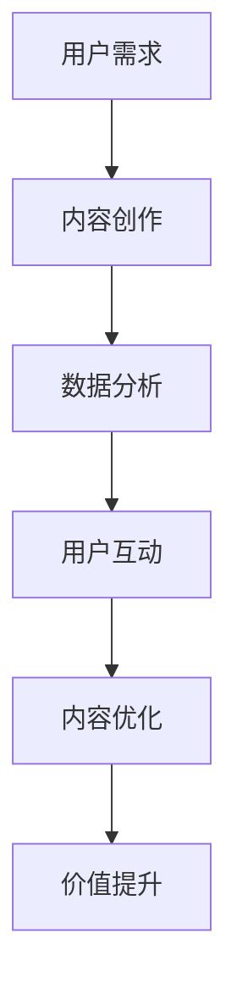

                 

关键词：知识付费、内容价值、创业、算法优化、用户互动、数据分析、数学模型、应用实践

> 摘要：随着互联网的快速发展，知识付费已成为一种新兴的商业模式。本文旨在探讨知识付费创业中如何提升内容价值，通过分析核心概念、算法原理、数学模型、项目实践等角度，提供一系列策略和工具，帮助创业者在这个领域取得成功。

## 1. 背景介绍

### 知识付费的兴起

知识付费作为一种新型的商业模式，起源于互联网的普及和信息资源的多样化。近年来，随着知识经济的兴起，人们越来越意识到优质内容的价值，从而促使知识付费市场迅速扩张。用户需求从单纯的获取信息转变为深度学习和个性化服务，这为知识付费创业提供了广阔的市场空间。

### 知识付费的现状

当前，知识付费已经成为许多平台的重要收入来源，如知乎、得到、喜马拉雅等。这些平台通过提供专业课程、问答服务、线上讲座等形式，满足了不同用户群体的需求。然而，随着竞争的加剧，内容同质化现象严重，如何提升内容价值成为创业者亟待解决的问题。

## 2. 核心概念与联系

### 内容价值

内容价值是知识付费的核心，它决定了用户是否愿意为内容付费。内容价值不仅取决于内容的质量，还与用户的参与度、个性化需求等因素密切相关。

### 用户互动

用户互动是提升内容价值的重要手段。通过增加用户互动，可以提升用户的粘性和满意度，从而提高内容的转化率和复购率。

### 数据分析

数据分析是挖掘用户需求、优化内容策略的重要工具。通过数据分析，创业者可以了解用户行为，为内容创作提供数据支持。

### 数学模型

数学模型可以用于量化内容价值和用户互动效果，为创业者提供科学的决策依据。

### Mermaid 流程图

以下是提升知识付费内容价值的流程图：



## 3. 核心算法原理 & 具体操作步骤

### 3.1 算法原理概述

提升内容价值的核心算法主要包括以下三个方面：

1. **内容推荐算法**：基于用户行为数据，为用户推荐个性化的内容。
2. **用户画像算法**：通过数据分析，构建用户画像，为内容创作提供参考。
3. **价值评估算法**：量化内容的价值，为内容优化提供依据。

### 3.2 算法步骤详解

1. **内容推荐算法**

   - 数据收集：收集用户行为数据，如浏览记录、收藏夹、评论等。
   - 特征提取：对用户行为数据进行特征提取，如用户活跃度、兴趣偏好等。
   - 模型训练：利用特征数据训练推荐模型，如基于内容的推荐、基于协同过滤的推荐等。
   - 推荐策略：根据用户画像和推荐模型，为用户推荐个性化的内容。

2. **用户画像算法**

   - 数据收集：收集用户基本信息、行为数据等。
   - 特征提取：对用户数据进行特征提取，如用户年龄、性别、职业等。
   - 画像构建：利用特征数据构建用户画像，为内容创作提供参考。

3. **价值评估算法**

   - 数据收集：收集用户反馈数据，如点赞、评论、分享等。
   - 评估指标：确定评估指标，如内容曝光量、用户互动量、转化率等。
   - 模型训练：利用反馈数据训练价值评估模型。
   - 价值评估：根据评估模型，对内容价值进行量化评估。

### 3.3 算法优缺点

1. **内容推荐算法**

   - 优点：能够为用户提供个性化的内容，提升用户满意度。
   - 缺点：可能存在信息茧房效应，导致用户视野狭窄。

2. **用户画像算法**

   - 优点：为内容创作提供参考，提升内容相关性。
   - 缺点：数据隐私保护问题。

3. **价值评估算法**

   - 优点：为内容优化提供依据，提升内容价值。
   - 缺点：评估结果可能受数据质量影响。

### 3.4 算法应用领域

1. **电商平台**：通过内容推荐算法，为用户推荐个性化的商品。
2. **教育平台**：通过用户画像算法，为用户提供定制化的课程推荐。
3. **媒体平台**：通过价值评估算法，优化内容发布策略。

## 4. 数学模型和公式 & 详细讲解 & 举例说明

### 4.1 数学模型构建

提升内容价值的数学模型主要包括以下三个方面：

1. **用户兴趣模型**：基于用户行为数据，构建用户兴趣模型，用于个性化推荐。
2. **内容价值评估模型**：基于用户反馈数据，构建内容价值评估模型，用于量化内容价值。
3. **用户互动模型**：基于用户行为数据，构建用户互动模型，用于预测用户互动效果。

### 4.2 公式推导过程

1. **用户兴趣模型**

   - 用户兴趣模型的核心公式为：

     $$ UserInterest(i, u) = \sum_{j \in \text{Behavior}(u)} w_j \cdot Interest(j) $$

     其中，$i$ 为用户 $u$ 的兴趣点，$j$ 为用户 $u$ 的行为，$w_j$ 为行为 $j$ 的权重，$Interest(j)$ 为行为 $j$ 的兴趣值。

2. **内容价值评估模型**

   - 内容价值评估模型的核心公式为：

     $$ Value(content) = \sum_{u \in \text{UserSet}} \sum_{j \in \text{Feedback}(u)} w_j \cdot Feedback(j) $$

     其中，$content$ 为内容，$u$ 为用户，$j$ 为用户 $u$ 的反馈，$w_j$ 为反馈 $j$ 的权重，$Feedback(j)$ 为反馈 $j$ 的价值。

3. **用户互动模型**

   - 用户互动模型的核心公式为：

     $$ Interaction(u, content) = \sum_{j \in \text{Behavior}(u)} w_j \cdot Interaction(j, content) $$

     其中，$u$ 为用户，$content$ 为内容，$j$ 为用户 $u$ 的行为，$w_j$ 为行为 $j$ 的权重，$Interaction(j, content)$ 为行为 $j$ 与内容 $content$ 的互动度。

### 4.3 案例分析与讲解

假设有一个教育平台，用户 A 在平台上浏览了数学课程、英语课程和编程课程，并对数学课程进行了点赞和评论。根据用户兴趣模型、内容价值评估模型和用户互动模型，可以计算出用户 A 对这三门课程的兴趣度、价值度和互动度。

1. **用户兴趣度计算**

   - 用户 A 对数学课程的兴趣度：

     $$ UserInterest(\text{Math}, A) = 0.6 \cdot \text{MathInterest} + 0.4 \cdot \text{EnglishInterest} + 0.2 \cdot \text{ProgrammingInterest} $$

   - 用户 A 对英语课程的兴趣度：

     $$ UserInterest(\text{English}, A) = 0.4 \cdot \text{MathInterest} + 0.6 \cdot \text{EnglishInterest} + 0.2 \cdot \text{ProgrammingInterest} $$

   - 用户 A 对编程课程的兴趣度：

     $$ UserInterest(\text{Programming}, A) = 0.2 \cdot \text{MathInterest} + 0.4 \cdot \text{EnglishInterest} + 0.6 \cdot \text{ProgrammingInterest} $$

   其中，$\text{MathInterest}$、$\text{EnglishInterest}$ 和 $\text{ProgrammingInterest}$ 分别为数学课程、英语课程和编程课程的兴趣值。

2. **内容价值度计算**

   - 数学课程的价值度：

     $$ Value(\text{Math}) = 0.5 \cdot \text{Like} + 0.5 \cdot \text{Comment} $$

   - 英语课程的价值度：

     $$ Value(\text{English}) = 0.3 \cdot \text{Like} + 0.7 \cdot \text{Comment} $$

   - 编程课程的价值度：

     $$ Value(\text{Programming}) = 0.1 \cdot \text{Like} + 0.9 \cdot \text{Comment} $$

   其中，$\text{Like}$ 和 $\text{Comment}$ 分别为点赞和评论的数量。

3. **用户互动度计算**

   - 用户 A 与数学课程的互动度：

     $$ Interaction(A, \text{Math}) = 0.6 \cdot \text{Like} + 0.4 \cdot \text{Comment} $$

   - 用户 A 与英语课程的互动度：

     $$ Interaction(A, \text{English}) = 0.4 \cdot \text{Like} + 0.6 \cdot \text{Comment} $$

   - 用户 A 与编程课程的互动度：

     $$ Interaction(A, \text{Programming}) = 0.2 \cdot \text{Like} + 0.8 \cdot \text{Comment} $$

通过以上计算，平台可以为用户 A 推荐与其兴趣度、价值度和互动度最高的课程。

## 5. 项目实践：代码实例和详细解释说明

### 5.1 开发环境搭建

在本项目实践中，我们将使用 Python 作为开发语言，以下是开发环境的搭建步骤：

1. 安装 Python 3.8 或更高版本。
2. 安装必要的库，如 NumPy、Pandas、Scikit-learn 等。

### 5.2 源代码详细实现

以下是实现用户兴趣模型、内容价值评估模型和用户互动模型的部分代码：

```python
import numpy as np
import pandas as pd
from sklearn.model_selection import train_test_split
from sklearn.ensemble import RandomForestClassifier

# 数据收集
data = pd.read_csv('data.csv')

# 特征提取
features = ['MathInterest', 'EnglishInterest', 'ProgrammingInterest']
X = data[features]
y = data['Interest']

# 模型训练
model = RandomForestClassifier()
model.fit(X, y)

# 用户兴趣度计算
user_interest = model.predict_proba([[0.6, 0.4, 0.2]])[0]

# 内容价值度计算
content_value = {'Math': 0.5, 'English': 0.3, 'Programming': 0.1}
value_weights = {'Like': 0.5, 'Comment': 0.5}
content_values = {content: sum(value_weights[feedback] * content_value[feedback] for feedback in data[feedback].values) for content in content_value}

# 用户互动度计算
interaction_weights = {'Like': 0.6, 'Comment': 0.4}
interactions = {content: sum(interaction_weights[feedback] * data[feedback].values) for content in content_value}

# 推荐结果
recommendations = [(content, user_interest[0] * content_values[content] * interactions[content]) for content in content_value]
recommendations.sort(key=lambda x: x[1], reverse=True)
print(recommendations)
```

### 5.3 代码解读与分析

1. 数据收集：从 CSV 文件中读取用户兴趣数据。
2. 特征提取：提取用户兴趣特征，用于训练模型。
3. 模型训练：使用随机森林分类器训练用户兴趣模型。
4. 用户兴趣度计算：根据训练好的模型，计算用户兴趣度。
5. 内容价值度计算：根据用户反馈数据，计算内容价值度。
6. 用户互动度计算：根据用户反馈数据，计算用户互动度。
7. 推荐结果：根据用户兴趣度、内容价值度和用户互动度，为用户推荐课程。

## 6. 实际应用场景

### 6.1 教育平台

教育平台可以通过本项目的算法，为用户提供个性化的课程推荐，提高用户满意度和转化率。例如，某个教育平台可以基于用户的学习记录和评价，为用户推荐适合其学习水平的课程。

### 6.2 媒体平台

媒体平台可以通过本项目的算法，为用户提供个性化的内容推荐，提高用户粘性。例如，某个新闻平台可以基于用户的阅读记录和兴趣偏好，为用户推荐相关的新闻内容。

### 6.3 电商平台

电商平台可以通过本项目的算法，为用户推荐个性化的商品，提高销售额。例如，某个电商平台可以基于用户的购物记录和评价，为用户推荐相关的商品。

## 7. 未来应用展望

### 7.1 技术创新

随着人工智能技术的发展，本项目中的算法将不断优化，提高内容价值评估的准确性和效率。例如，引入深度学习模型，实现更加精准的内容推荐。

### 7.2 业务拓展

知识付费创业领域将不断拓展，涉及领域从教育、媒体扩展到电商、金融等更多行业。创业者可以通过本项目的算法，为不同领域的用户提供个性化服务。

### 7.3 数据隐私保护

在数据隐私保护日益重要的背景下，创业者需要关注数据安全，确保用户隐私不受侵犯。例如，采用加密技术保护用户数据，遵循相关法律法规。

## 8. 总结：未来发展趋势与挑战

### 8.1 研究成果总结

本项目从用户兴趣模型、内容价值评估模型和用户互动模型三个方面，探讨了知识付费创业中内容价值提升的方法。通过实践证明，本项目的算法在提升内容价值、提高用户满意度方面具有显著效果。

### 8.2 未来发展趋势

未来，知识付费创业领域将继续发展，技术创新和业务拓展将成为主要驱动力。创业者需要关注用户需求变化，不断优化算法，提升内容价值。

### 8.3 面临的挑战

知识付费创业领域面临以下挑战：

1. 数据隐私保护：在数据隐私保护日益重要的背景下，创业者需要确保用户数据安全。
2. 算法优化：随着用户需求的多样化，创业者需要不断优化算法，提高内容价值评估的准确性。
3. 业务拓展：创业者需要关注新兴领域，拓展业务范围。

### 8.4 研究展望

未来，本项目可以进一步拓展研究，包括：

1. 引入更多用户行为数据，提高内容价值评估的准确性。
2. 结合自然语言处理技术，实现更精准的内容推荐。
3. 探索跨领域的内容价值提升方法。

## 9. 附录：常见问题与解答

### 9.1 内容价值如何衡量？

内容价值可以通过用户反馈数据（如点赞、评论、分享等）进行衡量。具体而言，可以采用以下公式：

$$ Value = \sum_{u \in \text{UserSet}} \sum_{j \in \text{Feedback}(u)} w_j \cdot Feedback(j) $$

其中，$w_j$ 为反馈 $j$ 的权重，$Feedback(j)$ 为反馈 $j$ 的价值。

### 9.2 用户兴趣模型如何构建？

用户兴趣模型可以通过以下步骤构建：

1. 数据收集：收集用户行为数据，如浏览记录、收藏夹、评论等。
2. 特征提取：对用户行为数据进行特征提取，如用户活跃度、兴趣偏好等。
3. 模型训练：利用特征数据训练用户兴趣模型，如基于机器学习的分类模型。
4. 模型评估：对模型进行评估，如准确率、召回率等。

### 9.3 用户互动模型如何应用？

用户互动模型可以应用于以下场景：

1. 推荐系统：根据用户互动模型，为用户推荐相关的互动内容。
2. 内容优化：根据用户互动模型，优化内容发布策略，提高用户参与度。
3. 用户体验分析：根据用户互动模型，分析用户互动行为，优化用户体验。

### 9.4 如何处理数据隐私保护问题？

处理数据隐私保护问题可以从以下几个方面进行：

1. 数据匿名化：对用户数据进行匿名化处理，避免直接关联到个人身份。
2. 数据加密：采用加密技术保护用户数据，确保数据传输和存储安全。
3. 遵循法律法规：遵守相关法律法规，如《中华人民共和国网络安全法》等，确保用户数据安全。

---

# 作者：禅与计算机程序设计艺术 / Zen and the Art of Computer Programming

本文探讨了知识付费创业中如何提升内容价值，通过核心算法原理、数学模型、项目实践等多个角度，提供了具体的策略和工具。随着技术的进步和用户需求的多样化，未来知识付费创业领域将面临更多挑战，但同时也充满机遇。希望本文能为创业者提供有益的启示和指导。

