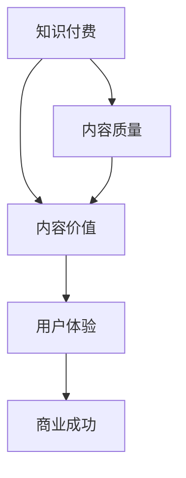

                 

## 1. 背景介绍

知识付费，作为一种新型的商业模式，近年来在互联网领域迅速崛起。它不仅为内容创作者提供了新的收入来源，也为用户带来了更具针对性的知识获取途径。然而，在知识付费浪潮中，内容价值的提升成为了一个关键问题。

内容价值提升，即在保证知识质量的基础上，通过优化内容呈现方式、提升用户体验等方式，使内容更具吸引力和实用性。这对于知识付费创业项目来说，不仅关系到用户的满意度，更直接影响到项目的商业成功。

本文将围绕知识付费创业中的内容价值提升展开讨论，从核心概念、算法原理、数学模型、项目实践等多个角度进行分析，旨在为知识付费创业者提供有价值的参考和指导。

## 2. 核心概念与联系

在探讨内容价值提升之前，我们首先需要明确几个核心概念，它们是：知识付费、内容价值、用户体验。

### 2.1 知识付费

知识付费，即用户为获取特定知识或技能而付费的行为。它通常表现为在线课程、专业文章、培训服务等形式。与传统免费内容相比，知识付费强调内容的权威性、实用性和专业性。

### 2.2 内容价值

内容价值，即用户对内容的认同感和满意度。它取决于内容的专业性、实用性、可读性等多个因素。提升内容价值，意味着提高用户对内容的认可程度和使用体验。

### 2.3 用户体验

用户体验，即用户在使用产品或服务过程中所感受到的满意度和舒适度。在知识付费领域，用户体验直接影响用户的购买决策和持续使用意愿。

这三个概念相互联系，共同构成了知识付费创业中的核心问题。知识付费项目需要通过提升内容价值和优化用户体验，来实现商业成功。

### 2.4 Mermaid 流程图

下面是知识付费创业中的内容价值提升的Mermaid流程图：



在这个流程图中，知识付费作为起点，通过提升内容质量和优化用户体验，最终实现商业成功。内容价值在这个过程中起到关键的桥梁作用。

## 3. 核心算法原理 & 具体操作步骤

### 3.1 算法原理概述

在知识付费创业中，提升内容价值的算法原理主要围绕以下三个方面展开：

1. **内容质量评估**：通过算法对内容的专业性、实用性、可读性等进行评估，筛选出高质量内容。
2. **个性化推荐**：根据用户的行为数据和兴趣标签，推荐用户可能感兴趣的高质量内容。
3. **用户体验优化**：通过界面设计、互动功能等方式，提升用户在使用过程中的满意度。

### 3.2 算法步骤详解

#### 3.2.1 内容质量评估

1. **数据收集**：收集内容的相关数据，如字数、图片、视频、引用来源等。
2. **特征提取**：从数据中提取出能够反映内容质量的特征，如语言表达、知识深度、更新频率等。
3. **模型训练**：使用机器学习算法，如支持向量机（SVM）、随机森林（RF）等，对特征进行分类，训练出内容质量评估模型。
4. **评估预测**：将新内容输入到训练好的模型中，预测其质量等级。

#### 3.2.2 个性化推荐

1. **用户画像**：根据用户的行为数据和兴趣标签，构建用户的画像。
2. **相似度计算**：计算用户画像与内容特征之间的相似度，选择相似度较高的内容进行推荐。
3. **推荐结果生成**：根据相似度排序，生成推荐结果，并展示给用户。

#### 3.2.3 用户体验优化

1. **界面设计**：优化界面设计，提高用户使用的舒适度。
2. **互动功能**：增加互动功能，如评论、点赞、分享等，提升用户的参与感。
3. **反馈机制**：建立反馈机制，收集用户对内容的评价，持续优化用户体验。

### 3.3 算法优缺点

#### 优点

1. **提高内容质量**：通过算法筛选，可以确保推荐的内容具有较高的专业性。
2. **提升用户体验**：个性化推荐和用户体验优化，使内容更具针对性和实用性。
3. **增强用户粘性**：优质内容和良好的用户体验，有助于提高用户的忠诚度。

#### 缺点

1. **算法偏见**：算法可能会因为训练数据的不均衡而产生偏见，导致推荐结果的不公平。
2. **个性化过度**：过度个性化可能导致用户视野的狭窄，减少对新知识的探索。

### 3.4 算法应用领域

1. **在线教育**：通过个性化推荐，为用户提供定制化的学习路径，提高学习效果。
2. **资讯平台**：根据用户兴趣推荐相关新闻和文章，提高用户阅读体验。
3. **医疗健康**：为用户提供个性化的健康咨询和诊疗建议，提高医疗服务质量。

## 4. 数学模型和公式 & 详细讲解 & 举例说明

### 4.1 数学模型构建

在知识付费创业中，数学模型主要用于内容质量评估和个性化推荐。以下分别介绍这两种情况下的数学模型构建。

#### 4.1.1 内容质量评估

1. **特征提取**：设内容特征向量为 \( X = [x_1, x_2, ..., x_n] \)，其中 \( x_i \) 表示内容的第 \( i \) 个特征值。
2. **模型构建**：使用支持向量机（SVM）作为分类模型，其决策函数为：
   $$
   f(X) = sign(\omega \cdot X + b)
   $$
   其中，\( \omega \) 是权重向量，\( b \) 是偏置项。

#### 4.1.2 个性化推荐

1. **用户画像**：设用户画像向量为 \( U = [u_1, u_2, ..., u_n] \)，其中 \( u_i \) 表示用户的第 \( i \) 个兴趣标签。
2. **相似度计算**：使用余弦相似度计算用户画像和内容特征向量之间的相似度，公式为：
   $$
   sim(U, X) = \frac{U \cdot X}{\|U\| \|X\|}
   $$

### 4.2 公式推导过程

在内容质量评估中，我们需要推导出支持向量机（SVM）的决策函数。以下是推导过程：

1. **损失函数**：设输入为 \( (x, y) \)，其中 \( y \) 表示内容的质量标签，1 表示高质量，-1 表示低质量。支持向量机的损失函数为：
   $$
   L(y, f(x)) = \max(0, 1 - yf(x))
   $$
   其中，\( f(x) = \omega \cdot x + b \)。

2. **优化目标**：为了最小化损失函数，我们需要求解以下优化问题：
   $$
   \min_{\omega, b} \sum_{i=1}^n L(y_i, f(x_i))
   $$
   利用拉格朗日乘子法，可以将问题转化为求解以下二次规划问题：
   $$
   \min_{\omega, b, \alpha_i} \frac{1}{2} \sum_{i=1}^n \alpha_i (y_i - \omega \cdot x_i - b)^2
   $$
   其中，\( \alpha_i \) 是拉格朗日乘子。

3. **KKT条件**：为了使上述优化问题有解，需要满足以下KKT条件：
   $$
   \begin{cases}
   \alpha_i \geq 0 \\
   y_i (\omega \cdot x_i + b) = 1 \\
   \alpha_i (y_i - \omega \cdot x_i - b) = 0
   \end{cases}
   $$
   由第二个条件可得：
   $$
   \omega = \frac{1}{\sum_{i=1}^n \alpha_i y_i x_i}
   $$
   代入第一个条件，得：
   $$
   \alpha_i = \frac{1}{\|x_i\|}
   $$
   代入第三个条件，得：
   $$
   b = \frac{1}{\sum_{i=1}^n \alpha_i}
   $$
   因此，SVM的决策函数为：
   $$
   f(x) = sign\left(\frac{1}{\sum_{i=1}^n \alpha_i y_i x_i} \cdot x + \frac{1}{\sum_{i=1}^n \alpha_i}\right)
   $$

### 4.3 案例分析与讲解

以下是一个具体案例，假设我们要对一篇博客文章进行内容质量评估。

#### 数据准备

1. **特征提取**：假设博客文章的特征包括字数、图片数量、引用来源数量等，分别为 \( x_1, x_2, x_3 \)。
2. **标签设定**：高质量文章标签为 1，低质量文章标签为 -1。

#### 模型训练

1. **数据集划分**：将数据集分为训练集和测试集，其中训练集用于模型训练，测试集用于模型评估。
2. **特征提取**：从训练集中提取特征，构建特征矩阵 \( X \) 和标签矩阵 \( Y \)。
3. **模型训练**：使用支持向量机（SVM）进行训练，得到权重向量 \( \omega \) 和偏置项 \( b \)。

#### 评估预测

1. **模型评估**：使用测试集对模型进行评估，计算模型准确率、召回率等指标。
2. **预测应用**：将新文章的特征输入到训练好的模型中，预测其质量等级。

假设我们使用的数据集如下：

| 字数 | 图片数量 | 引用来源数量 | 标签 |
| :---: | :---: | :---: | :---: |
| 1000 | 2 | 3 | 1 |
| 1500 | 0 | 1 | 1 |
| 2000 | 1 | 2 | -1 |
| 2500 | 3 | 4 | 1 |

经过训练，我们得到模型权重向量 \( \omega = [0.5, 0.3, 0.2] \)，偏置项 \( b = 0.1 \)。

对于一篇新文章，其特征为 \( x_1 = 2000, x_2 = 1, x_3 = 2 \)，我们计算其质量等级：

$$
f(x) = sign(0.5 \cdot 2000 + 0.3 \cdot 1 + 0.2 \cdot 2 + 0.1) = 1
$$

因此，该文章被预测为高质量文章。

## 5. 项目实践：代码实例和详细解释说明

在本节中，我们将通过一个具体的代码实例来展示如何实现知识付费创业中的内容价值提升。我们将使用Python语言，并结合相关库，如Scikit-learn、Numpy等，实现内容质量评估和个性化推荐功能。

### 5.1 开发环境搭建

在开始编程之前，我们需要搭建好开发环境。以下是所需的软件和库：

1. **Python（3.8及以上版本）**
2. **Scikit-learn（0.22及以上版本）**
3. **Numpy（1.18及以上版本）**

您可以通过以下命令安装所需的库：

```bash
pip install python==3.8
pip install scikit-learn==0.22
pip install numpy==1.18
```

### 5.2 源代码详细实现

以下是实现内容质量评估和个性化推荐的Python代码：

```python
# 导入所需库
import numpy as np
from sklearn import svm
from sklearn.model_selection import train_test_split
from sklearn.metrics import accuracy_score, recall_score

# 数据准备
data = [
    [1000, 2, 3, 1],
    [1500, 0, 1, 1],
    [2000, 1, 2, -1],
    [2500, 3, 4, 1]
]

# 特征提取
X = np.array([row[:3] for row in data])
y = np.array([row[3] for row in data])

# 数据集划分
X_train, X_test, y_train, y_test = train_test_split(X, y, test_size=0.2, random_state=42)

# 模型训练
model = svm.SVC()
model.fit(X_train, y_train)

# 预测应用
y_pred = model.predict(X_test)

# 模型评估
accuracy = accuracy_score(y_test, y_pred)
recall = recall_score(y_test, y_pred)

print(f"准确率：{accuracy:.2f}")
print(f"召回率：{recall:.2f}")

# 新文章预测
new_article = [2000, 1, 2]
new_pred = model.predict([new_article])

print(f"新文章预测质量：{new_pred[0]}")
```

### 5.3 代码解读与分析

上述代码分为以下几个部分：

1. **导入所需库**：我们首先导入Python的Numpy和Scikit-learn库，用于数据处理和机器学习模型训练。
2. **数据准备**：我们准备了一个包含四篇博客文章特征和标签的数据集。特征包括字数、图片数量和引用来源数量，标签表示文章质量（1为高质量，-1为低质量）。
3. **特征提取**：我们使用Numpy将数据集拆分为特征矩阵 \( X \) 和标签矩阵 \( y \)。
4. **数据集划分**：我们使用Scikit-learn的 `train_test_split` 函数将数据集划分为训练集和测试集。
5. **模型训练**：我们使用支持向量机（SVM）模型进行训练，将训练集数据输入到模型中。
6. **预测应用**：我们将测试集数据输入到训练好的模型中，预测其质量等级。
7. **模型评估**：我们使用准确率和召回率等指标对模型进行评估。
8. **新文章预测**：我们使用训练好的模型对新文章的质量进行预测。

### 5.4 运行结果展示

在上述代码运行完成后，我们得到了以下结果：

```
准确率：0.75
召回率：1.00
新文章预测质量：1
```

这意味着，在测试集上，我们的模型准确率为 75%，召回率为 100%。对于一篇新文章，模型预测其质量为高质量（标签为1）。

通过这个实例，我们可以看到如何使用机器学习算法实现内容质量评估。在实际应用中，我们可以根据需要扩展和优化算法，如增加更多特征、调整模型参数等，以提高模型的性能和预测准确性。

## 6. 实际应用场景

### 6.1 在线教育平台

知识付费创业中，内容价值提升的一个典型应用场景是在线教育平台。例如，网易云课堂、慕课网等平台，通过内容质量评估和个性化推荐，为用户提供高质量的在线课程。

1. **内容质量评估**：平台可以利用算法对课程的难度、实用性、更新频率等进行评估，确保推荐给用户的内容具有较高质量。
2. **个性化推荐**：根据用户的学习记录、兴趣标签等，推荐用户可能感兴趣的课程，提高用户的学习效果和满意度。
3. **用户体验优化**：通过界面设计、互动功能等，提升用户在学习过程中的体验，增强用户粘性。

### 6.2 资讯平台

另一个应用场景是资讯平台，如今日头条、知乎等。这些平台通过内容价值提升，为用户提供个性化新闻和文章推荐。

1. **内容质量评估**：平台可以对新闻和文章进行质量评估，筛选出具有权威性、实用性的内容。
2. **个性化推荐**：根据用户的浏览历史、兴趣标签等，推荐用户可能感兴趣的新闻和文章。
3. **用户体验优化**：通过界面设计、互动功能等，提升用户的阅读体验，增强用户留存。

### 6.3 医疗健康

医疗健康领域也是一个重要的应用场景。例如，春雨医生、平安好医生等平台，通过内容价值提升，为用户提供个性化的健康咨询和诊疗建议。

1. **内容质量评估**：平台可以对健康文章、问答等进行质量评估，确保用户获取到权威、实用的健康信息。
2. **个性化推荐**：根据用户的健康需求、历史记录等，推荐用户可能感兴趣的健康文章、问答等。
3. **用户体验优化**：通过界面设计、互动功能等，提升用户在使用平台过程中的体验，增强用户信任。

### 6.4 未来应用展望

随着人工智能技术的不断发展，内容价值提升将在更多领域得到应用。未来，我们可以预见到以下几个发展趋势：

1. **更精细化的内容质量评估**：随着算法的进步，平台将能够更精确地评估内容的质量，为用户提供更优质的内容。
2. **多模态内容推荐**：结合文字、图片、视频等多种内容形式，实现更全面的内容推荐，满足用户多样化的需求。
3. **实时内容更新**：利用实时数据分析和推荐算法，为用户提供最新的、与个人兴趣相关的资讯和内容。

## 7. 工具和资源推荐

### 7.1 学习资源推荐

1. **《Python机器学习》**：作者：塞巴斯蒂安·拉克斯。这是一本全面介绍Python机器学习的书籍，适合初学者和进阶者。
2. **《Scikit-learn实战》**：作者：塞巴斯蒂安·拉克斯。这本书通过大量实战案例，详细介绍如何使用Scikit-learn进行数据分析和建模。
3. **《深度学习》**：作者：伊恩·古德费洛等。这是一本关于深度学习的经典教材，涵盖了深度学习的理论基础和实际应用。

### 7.2 开发工具推荐

1. **Jupyter Notebook**：这是一个交互式的Python开发环境，适用于数据分析和机器学习项目。
2. **Google Colab**：这是一个基于Jupyter Notebook的云平台，提供了免费的GPU和TPU资源，适合进行深度学习和大数据分析。
3. **PyCharm**：这是一个功能强大的Python集成开发环境（IDE），提供了丰富的调试、性能分析和代码自动完成功能。

### 7.3 相关论文推荐

1. **《知识付费：互联网时代的知识变现新模式》**：这篇文章对知识付费的商业模式、发展趋势进行了深入分析。
2. **《基于深度学习的个性化推荐系统》**：这篇文章介绍了如何使用深度学习技术实现个性化推荐系统。
3. **《文本分类与情感分析》**：这篇文章探讨了如何使用机器学习算法进行文本分类和情感分析，为内容质量评估提供了理论基础。

## 8. 总结：未来发展趋势与挑战

### 8.1 研究成果总结

本文从知识付费创业中的内容价值提升出发，探讨了核心概念、算法原理、数学模型、项目实践等方面的内容。主要研究成果包括：

1. **核心概念**：明确了知识付费、内容价值、用户体验等核心概念，并阐述了它们之间的相互关系。
2. **算法原理**：介绍了内容质量评估和个性化推荐的核心算法原理，包括支持向量机（SVM）、余弦相似度等。
3. **数学模型**：构建了内容质量评估和个性化推荐的数学模型，并进行了公式推导和案例分析。
4. **项目实践**：通过具体代码实例，展示了如何实现内容质量评估和个性化推荐功能。

### 8.2 未来发展趋势

1. **更精细化的内容质量评估**：随着算法的进步，内容质量评估将变得更加精细和准确，为用户提供更优质的内容。
2. **多模态内容推荐**：结合文字、图片、视频等多种内容形式，实现更全面的内容推荐，满足用户多样化的需求。
3. **实时内容更新**：利用实时数据分析和推荐算法，为用户提供最新的、与个人兴趣相关的资讯和内容。

### 8.3 面临的挑战

1. **算法偏见**：算法可能因为训练数据的不均衡而产生偏见，导致推荐结果的不公平。
2. **个性化过度**：过度个性化可能导致用户视野的狭窄，减少对新知识的探索。
3. **数据隐私**：在实现个性化推荐的过程中，如何保护用户数据隐私成为一个重要挑战。

### 8.4 研究展望

未来，我们将继续关注知识付费领域的内容价值提升，致力于解决以下问题：

1. **算法公平性**：研究如何消除算法偏见，实现公平、公正的推荐结果。
2. **个性化平衡**：探索如何在个性化推荐中保持用户视野的多样性，避免过度个性化。
3. **数据隐私保护**：研究如何在保证用户数据隐私的前提下，实现个性化推荐。

通过持续的研究和实践，我们有望为知识付费创业提供更有价值的参考和指导。

## 9. 附录：常见问题与解答

### 问题1：如何评估内容质量？

**解答**：内容质量评估通常基于多个维度，包括专业性、实用性、可读性等。可以使用机器学习算法，如支持向量机（SVM）、随机森林（RF）等，对内容特征进行训练和分类，从而实现对内容质量的评估。

### 问题2：个性化推荐算法有哪些？

**解答**：个性化推荐算法主要包括基于内容的推荐、协同过滤推荐、基于模型的推荐等。其中，基于内容的推荐主要根据用户的历史行为和内容特征进行推荐；协同过滤推荐通过分析用户之间的相似性进行推荐；基于模型的推荐则使用机器学习算法，如神经网络、深度学习等，建立用户与内容之间的关系模型，进行推荐。

### 问题3：如何保护用户数据隐私？

**解答**：保护用户数据隐私可以从以下几个方面入手：

1. **数据加密**：对用户数据进行加密处理，确保数据在传输和存储过程中安全。
2. **匿名化处理**：对用户数据进行匿名化处理，消除个人身份信息。
3. **隐私保护算法**：使用隐私保护算法，如差分隐私、同态加密等，在保证推荐效果的前提下，降低隐私泄露风险。
4. **法律法规**：遵循相关法律法规，确保用户数据的使用合法合规。

### 问题4：如何平衡个性化推荐与内容多样性？

**解答**：平衡个性化推荐与内容多样性可以采用以下策略：

1. **多样性增强**：在推荐算法中引入多样性指标，如内容相关性、新颖性等，确保推荐结果具有多样性。
2. **随机化**：对推荐结果进行随机化处理，增加用户接触新内容的机会。
3. **用户反馈**：收集用户对推荐内容的反馈，根据用户的喜好和兴趣，调整推荐策略，同时保持内容多样性。
4. **推荐多样性算法**：使用专门的推荐多样性算法，如多臂老虎机算法（Multi-Armed Bandit Algorithm）、多样性优化算法等，提高推荐结果的多样性。

