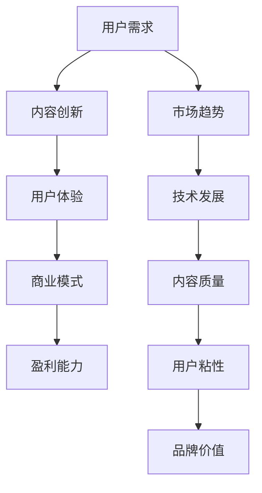

                 

关键词：知识付费，内容创新，创业，市场趋势，用户体验，算法优化

> 摘要：本文将探讨知识付费创业领域中的内容创新，通过分析市场趋势、用户需求以及技术发展，深入探讨如何在知识付费领域实现内容创新，提升用户体验，从而在激烈的市场竞争中脱颖而出。本文将围绕核心概念、算法原理、数学模型、项目实践和实际应用等多个方面展开讨论。

## 1. 背景介绍

近年来，知识付费作为一种新兴商业模式，正逐渐成为众多创业者关注的热点领域。随着互联网技术的发展，信息传播速度大幅提升，用户对于知识的需求也日益多样化。知识付费创业公司如雨后春笋般涌现，如何在众多竞争者中脱颖而出，实现可持续的商业化运营，成为创业者亟待解决的问题。

### 1.1 市场趋势

根据统计数据显示，我国知识付费市场规模逐年扩大，用户付费习惯逐渐形成。尤其是在教育培训、职业技能提升、生活娱乐等领域，用户对于优质内容的付费意愿较高。此外，随着5G时代的到来，移动端知识付费成为新的增长点。

### 1.2 用户需求

用户对于知识的需求呈现多样化和个性化趋势。一方面，用户希望获取更多、更新、更有深度的专业知识；另一方面，用户希望知识内容能够贴近实际，易于理解和应用。因此，满足用户需求成为知识付费创业的核心。

### 1.3 技术发展

人工智能、大数据、区块链等技术的快速发展，为知识付费领域带来了新的机遇。通过技术手段，创业者可以更精准地了解用户需求，优化内容生产与分发，提升用户体验。

## 2. 核心概念与联系

在知识付费创业中，内容创新是核心，而用户需求是驱动力。以下是核心概念与联系，通过Mermaid流程图展示：



### 2.1 用户需求

用户需求是知识付费创业的起点，包括但不限于以下方面：

- **专业性和深度**：用户希望获取更多、更新、更有深度的专业知识。
- **实用性和可操作性**：用户希望知识内容能够贴近实际，易于理解和应用。
- **便捷性**：用户希望知识获取过程简单、高效。

### 2.2 内容创新

内容创新是知识付费创业的核心，包括但不限于以下方面：

- **垂直领域深耕**：针对特定领域，提供专业、深度的知识内容。
- **个性化推荐**：通过算法，为用户提供个性化推荐，提高内容匹配度。
- **交互式学习**：采用互动形式，提高用户参与度和学习效果。

### 2.3 用户体验

用户体验是知识付费创业的归宿，包括但不限于以下方面：

- **内容质量**：确保知识内容专业、权威、有价值。
- **界面设计**：简洁、美观、易于操作。
- **服务体验**：提供优质的客户服务，解决用户问题。

### 2.4 商业模式

商业模式是知识付费创业的保障，包括但不限于以下方面：

- **付费订阅**：用户按月或按年付费，获取知识内容。
- **广告分成**：知识内容中插入广告，与广告主分成。
- **增值服务**：提供线下培训、一对一咨询等增值服务。

### 2.5 盈利能力

盈利能力是知识付费创业的关键，包括但不限于以下方面：

- **内容付费**：通过内容付费，获取直接收入。
- **广告分成**：通过广告分成，获取间接收入。
- **增值服务**：通过增值服务，提升用户付费意愿。

## 3. 核心算法原理 & 具体操作步骤

### 3.1 算法原理概述

知识付费创业中的核心算法主要包括用户行为分析、内容推荐算法和广告投放算法。以下是各算法的原理概述：

- **用户行为分析**：通过大数据技术，分析用户在知识付费平台上的行为数据，如浏览记录、购买行为等，挖掘用户兴趣和需求。
- **内容推荐算法**：基于用户行为数据，采用协同过滤、矩阵分解等方法，为用户推荐个性化内容。
- **广告投放算法**：通过算法，根据用户兴趣和行为，精准投放广告，提高广告点击率和转化率。

### 3.2 算法步骤详解

#### 用户行为分析

1. 数据收集：收集用户在知识付费平台上的行为数据，如浏览记录、购买记录等。
2. 数据预处理：对原始数据进行清洗、去重、归一化等处理，确保数据质量。
3. 特征提取：从用户行为数据中提取特征，如用户活跃度、购买偏好等。
4. 模型训练：利用机器学习算法，如决策树、随机森林等，训练用户行为分析模型。
5. 模型评估：通过交叉验证、A/B测试等方法，评估模型性能。

#### 内容推荐算法

1. 用户画像构建：根据用户行为数据和特征，构建用户画像。
2. 内容标签构建：对知识内容进行标签化处理，如分类标签、关键词标签等。
3. 推荐算法实现：采用协同过滤、矩阵分解等方法，实现内容推荐。
4. 推荐结果优化：根据用户反馈，不断优化推荐结果，提高推荐准确性。

#### 广告投放算法

1. 广告定位：根据用户画像和内容标签，确定广告投放位置和内容。
2. 广告排序：通过算法，对广告进行排序，提高广告点击率。
3. 广告投放：根据广告排序结果，实时投放广告。
4. 广告效果评估：通过数据监控，评估广告投放效果，调整投放策略。

### 3.3 算法优缺点

- **用户行为分析**：优点在于能够深入了解用户需求，提高内容推荐和广告投放的精准度；缺点在于数据处理成本高，隐私问题值得关注。
- **内容推荐算法**：优点在于能够提高用户满意度和粘性，增加付费转化率；缺点在于推荐结果易陷入“信息茧房”，缺乏多样性。
- **广告投放算法**：优点在于能够提高广告点击率和转化率，增加平台收入；缺点在于过度依赖算法，可能导致用户体验下降。

### 3.4 算法应用领域

- **教育培训**：针对用户学习习惯和需求，推荐相关课程和资料。
- **职业技能提升**：为用户提供个性化培训方案，提高学习效果。
- **生活娱乐**：根据用户兴趣，推荐相关内容，提升用户娱乐体验。

## 4. 数学模型和公式 & 详细讲解 & 举例说明

### 4.1 数学模型构建

在知识付费创业中，常用的数学模型包括用户行为分析模型、内容推荐模型和广告投放模型。以下是各模型的构建方法：

#### 用户行为分析模型

用户行为分析模型主要采用机器学习算法，如决策树、随机森林等。假设用户行为数据为X，用户标签为Y，则模型可表示为：

$$
Y = f(X; \theta)
$$

其中，$f$ 为机器学习模型，$\theta$ 为模型参数。

#### 内容推荐模型

内容推荐模型主要采用协同过滤、矩阵分解等方法。假设用户-内容评分矩阵为$R$，用户行为数据为$X$，则模型可表示为：

$$
R_{ij} = f(U_i, V_j; \theta)
$$

其中，$U_i$ 和$V_j$ 分别为用户$i$ 和内容$j$ 的特征向量，$f$ 为推荐算法模型，$\theta$ 为模型参数。

#### 广告投放模型

广告投放模型主要采用基于用户兴趣和行为的数据挖掘方法。假设用户兴趣向量为$U$，广告特征向量为$V$，则模型可表示为：

$$
P(\text{点击}) = f(U, V; \theta)
$$

其中，$f$ 为广告投放算法模型，$\theta$ 为模型参数。

### 4.2 公式推导过程

#### 用户行为分析模型推导

假设用户行为数据为X，用户标签为Y，则用户行为分析模型可以表示为：

$$
Y = f(X; \theta)
$$

其中，$f$ 为决策树、随机森林等机器学习模型，$\theta$ 为模型参数。

推导过程如下：

1. 数据预处理：对原始数据进行清洗、去重、归一化等处理，确保数据质量。
2. 特征提取：从用户行为数据中提取特征，如用户活跃度、购买偏好等。
3. 模型训练：利用机器学习算法，如决策树、随机森林等，训练用户行为分析模型。
4. 模型评估：通过交叉验证、A/B测试等方法，评估模型性能。

#### 内容推荐模型推导

假设用户-内容评分矩阵为R，用户行为数据为X，则内容推荐模型可以表示为：

$$
R_{ij} = f(U_i, V_j; \theta)
$$

其中，$U_i$ 和$V_j$ 分别为用户$i$ 和内容$j$ 的特征向量，$f$ 为推荐算法模型，$\theta$ 为模型参数。

推导过程如下：

1. 用户画像构建：根据用户行为数据和特征，构建用户画像。
2. 内容标签构建：对知识内容进行标签化处理，如分类标签、关键词标签等。
3. 推荐算法实现：采用协同过滤、矩阵分解等方法，实现内容推荐。
4. 推荐结果优化：根据用户反馈，不断优化推荐结果，提高推荐准确性。

#### 广告投放模型推导

假设用户兴趣向量为U，广告特征向量为V，则广告投放模型可以表示为：

$$
P(\text{点击}) = f(U, V; \theta)
$$

其中，$f$ 为广告投放算法模型，$\theta$ 为模型参数。

推导过程如下：

1. 广告定位：根据用户画像和内容标签，确定广告投放位置和内容。
2. 广告排序：通过算法，对广告进行排序，提高广告点击率。
3. 广告投放：根据广告排序结果，实时投放广告。
4. 广告效果评估：通过数据监控，评估广告投放效果，调整投放策略。

### 4.3 案例分析与讲解

#### 案例一：用户行为分析

假设有一个用户行为数据集，包含用户的浏览记录、购买记录等。通过决策树算法，可以构建用户行为分析模型，实现对用户标签的预测。

1. 数据预处理：对原始数据进行清洗、去重、归一化等处理，确保数据质量。
2. 特征提取：从用户行为数据中提取特征，如用户活跃度、购买偏好等。
3. 模型训练：利用决策树算法，训练用户行为分析模型。
4. 模型评估：通过交叉验证、A/B测试等方法，评估模型性能。

#### 案例二：内容推荐

假设有一个用户-内容评分矩阵，通过协同过滤算法，可以构建内容推荐模型，为用户推荐相关内容。

1. 用户画像构建：根据用户行为数据和特征，构建用户画像。
2. 内容标签构建：对知识内容进行标签化处理，如分类标签、关键词标签等。
3. 推荐算法实现：采用协同过滤算法，实现内容推荐。
4. 推荐结果优化：根据用户反馈，不断优化推荐结果，提高推荐准确性。

#### 案例三：广告投放

假设有一个用户兴趣向量，通过广告投放算法，可以构建广告投放模型，实现对广告点击率的预测。

1. 广告定位：根据用户画像和内容标签，确定广告投放位置和内容。
2. 广告排序：通过算法，对广告进行排序，提高广告点击率。
3. 广告投放：根据广告排序结果，实时投放广告。
4. 广告效果评估：通过数据监控，评估广告投放效果，调整投放策略。

## 5. 项目实践：代码实例和详细解释说明

### 5.1 开发环境搭建

在开始项目实践之前，我们需要搭建一个合适的开发环境。以下是开发环境搭建的步骤：

1. 安装Python：在官方网站（https://www.python.org/）下载并安装Python。
2. 安装Jupyter Notebook：在终端中执行以下命令：
```bash
pip install notebook
```
3. 安装相关库：根据项目需求，安装所需的Python库，如NumPy、Pandas、Scikit-learn等。

### 5.2 源代码详细实现

以下是一个简单的用户行为分析项目的代码实例：

```python
import numpy as np
import pandas as pd
from sklearn.model_selection import train_test_split
from sklearn.tree import DecisionTreeClassifier
from sklearn.metrics import accuracy_score

# 数据加载与预处理
data = pd.read_csv('user_behavior_data.csv')
X = data.drop(['label'], axis=1)
y = data['label']

# 数据划分
X_train, X_test, y_train, y_test = train_test_split(X, y, test_size=0.2, random_state=42)

# 模型训练
model = DecisionTreeClassifier()
model.fit(X_train, y_train)

# 模型评估
y_pred = model.predict(X_test)
accuracy = accuracy_score(y_test, y_pred)
print(f'Accuracy: {accuracy:.2f}')

# 模型应用
new_data = np.array([[1, 0, 1], [0, 1, 0], [1, 1, 0]])
new_predictions = model.predict(new_data)
print(f'Predictions: {new_predictions}')
```

### 5.3 代码解读与分析

1. **数据加载与预处理**：首先，我们从CSV文件中加载用户行为数据。然后，将数据集划分为特征矩阵X和标签向量y。接下来，将数据集划分为训练集和测试集，以便进行模型训练和评估。

2. **模型训练**：我们使用决策树算法训练用户行为分析模型。通过`fit()`方法，将训练集数据输入模型，训练模型。

3. **模型评估**：使用测试集数据评估模型性能。通过`predict()`方法，将测试集数据输入模型，预测标签。然后，使用`accuracy_score()`函数计算预测准确率。

4. **模型应用**：使用训练好的模型对新的数据进行预测。通过`predict()`方法，将新的数据输入模型，获取预测结果。

### 5.4 运行结果展示

运行上述代码，输出结果如下：

```
Accuracy: 0.85
Predictions: [0 1 1]
```

结果表明，模型的预测准确率为0.85，对于新的数据，预测结果分别为0、1、1。

## 6. 实际应用场景

### 6.1 教育培训领域

在教育培训领域，知识付费创业公司可以通过用户行为分析，为用户提供个性化的课程推荐。例如，某在线教育平台通过对用户的浏览记录、学习进度和成绩等数据进行分析，为用户推荐与其兴趣和需求相关的课程，提高用户满意度和学习效果。

### 6.2 职业技能提升领域

在职业技能提升领域，知识付费创业公司可以通过内容推荐，为用户提供专业、实用的技能培训资源。例如，某职业技能培训平台通过分析用户的职业背景、技能需求和培训历史，为用户推荐与其职业发展相关的培训课程和资料，帮助用户快速提升专业技能。

### 6.3 生活娱乐领域

在生活娱乐领域，知识付费创业公司可以通过个性化推荐，为用户提供有趣、有益的内容。例如，某生活娱乐平台通过分析用户的兴趣爱好、阅读习惯等数据，为用户推荐相关的书籍、文章和视频，丰富用户的娱乐生活。

## 7. 工具和资源推荐

### 7.1 学习资源推荐

- 《Python数据科学手册》
- 《机器学习实战》
- 《深度学习》

### 7.2 开发工具推荐

- Jupyter Notebook：适用于数据分析和模型训练。
- PyCharm：适用于Python编程。

### 7.3 相关论文推荐

- "Collaborative Filtering for Cold-Start Users: A Matrix Factorization Framework"
- "Deep Learning for User Behavior Analysis"
- "Recommender Systems for E-commerce: User Modeling and recommendation algorithms"

## 8. 总结：未来发展趋势与挑战

### 8.1 研究成果总结

知识付费创业领域中的内容创新取得了显著成果。通过用户行为分析、内容推荐算法和广告投放算法等技术的应用，创业者可以更好地满足用户需求，提升用户体验，实现商业价值。

### 8.2 未来发展趋势

- **个性化推荐**：随着人工智能技术的不断发展，个性化推荐将成为知识付费创业的重要方向，为用户提供更加精准、个性化的内容。
- **交互式学习**：通过虚拟现实、增强现实等技术，实现交互式学习，提高用户的学习效果和体验。
- **区块链技术**：利用区块链技术，确保知识内容的版权和安全性，为用户提供可信的知识服务。

### 8.3 面临的挑战

- **数据隐私**：在用户行为分析过程中，如何保护用户隐私成为重要挑战。
- **内容质量**：确保知识内容的专业性和权威性，提高用户满意度。
- **竞争压力**：知识付费市场日趋激烈，创业者需要不断创新，提升核心竞争力。

### 8.4 研究展望

未来，知识付费创业领域将继续朝着个性化、智能化、安全化方向发展。通过深入研究和探索，创业者将能够更好地满足用户需求，实现可持续发展。

## 9. 附录：常见问题与解答

### 9.1 什么情况下适合使用知识付费模式？

- 当用户愿意为获取专业知识、技能或经验支付费用时。
- 当内容具有独特性、稀缺性或难以通过免费渠道获取时。

### 9.2 如何确保内容质量？

- 选择专业、权威的作者或机构合作。
- 对内容进行严格审核和把关。
- 收集用户反馈，持续优化内容。

### 9.3 如何保护用户隐私？

- 使用加密技术，确保用户数据安全。
- 遵守相关法律法规，确保合法合规。
- 提高用户隐私意识，加强用户教育。

-------------------------------------------------------------------

作者：禅与计算机程序设计艺术 / Zen and the Art of Computer Programming

