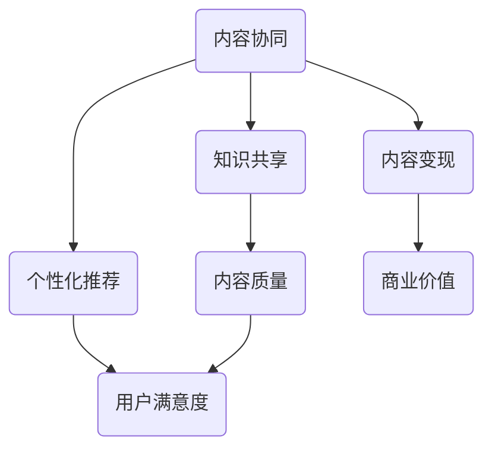

                 

## 摘要 Summary

知识付费市场近年来呈现出爆发式增长，内容创作者和平台纷纷涌入这一领域。然而，如何在激烈的市场竞争中脱颖而出，实现商业价值最大化，成为许多创业者亟待解决的问题。本文将探讨知识付费创业中的内容协同效应，分析其核心概念、原理及具体实现方法，并探讨其在未来应用中的前景与挑战。

## 1. 背景介绍 Background

随着互联网的普及和移动设备的普及，人们获取知识的方式发生了翻天覆地的变化。传统的线下教育模式逐渐被线上知识付费模式所取代。知识付费市场包括音频课程、视频教程、电子书、线上直播等多种形式，满足了用户在碎片化时间内的学习需求。

根据市场研究公司的数据，全球知识付费市场规模持续增长，预计在未来几年内将继续保持高速增长。这表明，知识付费市场具有巨大的商业潜力，吸引了大量创业者进入这一领域。

然而，知识付费市场也面临着激烈的竞争。一方面，内容创作者众多，同质化严重；另一方面，用户需求多样化，个性化推荐成为关键。如何在这片红海中找到自己的立足点，实现商业价值最大化，成为创业者们需要解决的首要问题。

### 1.1 市场规模和趋势 Market size and trends

根据市场研究公司的数据，全球知识付费市场规模在过去几年中呈现出爆发式增长。以中国为例，2020年中国知识付费市场规模已达到3000亿元人民币，预计到2025年将达到1.5万亿元人民币。这表明，知识付费市场具有巨大的商业潜力，吸引了大量创业者进入这一领域。

全球范围内，知识付费市场也呈现出快速增长的趋势。根据Statista的数据，全球知识付费市场规模预计将在2025年达到865亿美元。这表明，知识付费市场不仅在中国具有广阔的前景，在全球范围内也具有巨大的市场潜力。

### 1.2 竞争格局 Competitive landscape

在知识付费市场中，竞争格局日益激烈。一方面，内容创作者众多，同质化严重。许多创业者纷纷涌入市场，发布各种类型的课程和内容，导致市场上充斥着大量相似的产品。

另一方面，用户需求多样化，个性化推荐成为关键。不同用户对知识的需求有所不同，他们更倾向于寻找与自己兴趣和需求相关的知识内容。因此，如何实现个性化推荐，提高用户满意度，成为创业者在激烈竞争中的关键。

### 1.3 创业者面临的挑战 Challenges for entrepreneurs

面对激烈的市场竞争，创业者们面临着诸多挑战：

1. **内容同质化**：市场上充斥着大量相似的产品，如何打造具有竞争力的独特内容成为关键。

2. **用户获取**：在竞争激烈的市场中，如何有效获取用户，提高用户留存率是创业者需要解决的重要问题。

3. **商业模式**：如何在提供优质内容的同时，实现盈利模式创新，实现商业价值最大化是创业者面临的挑战。

4. **技术支持**：随着知识付费市场的发展，对技术支持的需求不断提高，如何提供稳定、高效的技术平台成为关键。

## 2. 核心概念与联系 Core concepts and relationships

在探讨知识付费创业中的内容协同效应之前，我们需要先了解一些核心概念。以下是本文中涉及的核心概念：

### 2.1 内容协同 Content collaboration

内容协同是指通过多个创作者、平台和用户之间的合作与互动，共同创作和分享知识内容，实现知识价值的最大化。在知识付费市场中，内容协同有助于提高内容质量和用户满意度，从而实现商业价值的提升。

### 2.2 知识共享 Knowledge sharing

知识共享是指将个人或团队的知识和经验分享给他人，以促进学习和创新。在知识付费市场中，知识共享有助于降低用户获取知识的成本，提高用户参与度和满意度。

### 2.3 个性化推荐 Personalized recommendation

个性化推荐是指根据用户的兴趣、行为和历史数据，为用户推荐与其兴趣相关的知识内容。个性化推荐有助于提高用户满意度，降低用户流失率。

### 2.4 内容变现 Content monetization

内容变现是指通过知识内容创造商业价值的过程。在知识付费市场中，内容变现是创业者的核心目标之一。

### 2.5 内容质量 Content quality

内容质量是知识付费市场的重要指标。高质量的内容能够提高用户的参与度和满意度，从而实现商业价值的提升。

### 2.6 Mermaid 流程图 Mermaid flowchart

为了更好地理解内容协同效应，我们使用Mermaid流程图来展示其核心概念和联系。



## 3. 核心算法原理 & 具体操作步骤 Core algorithm principle & detailed operation steps

### 3.1 算法原理概述 Algorithm principle overview

在知识付费创业中，内容协同效应的实现离不开核心算法的支持。本文将介绍一种基于协同过滤（Collaborative Filtering）的个性化推荐算法，该算法通过分析用户的历史行为和兴趣，为用户推荐与其兴趣相关的知识内容。

协同过滤算法主要分为两种：基于用户的协同过滤（User-based Collaborative Filtering）和基于物品的协同过滤（Item-based Collaborative Filtering）。本文主要介绍基于用户的协同过滤算法。

基于用户的协同过滤算法的基本原理是：找到与目标用户兴趣相似的其他用户，然后推荐这些用户喜欢的知识内容给目标用户。具体步骤如下：

1. **计算用户相似度**：通过计算用户之间的相似度，找到与目标用户兴趣相似的邻居用户。
2. **推荐知识内容**：根据邻居用户的兴趣，推荐他们喜欢的知识内容给目标用户。

### 3.2 算法步骤详解 Detailed steps of the algorithm

基于用户的协同过滤算法的具体步骤如下：

#### 3.2.1 计算用户相似度 Calculate user similarity

计算用户相似度的方法有很多，本文采用皮尔逊相关系数（Pearson Correlation Coefficient）作为相似度度量标准。皮尔逊相关系数的计算公式如下：

$$
r_{uij} = \frac{\sum_{k=1}^{n} (u_{ik} - \bar{u_i})(u_{jk} - \bar{u_j})}{\sqrt{\sum_{k=1}^{n} (u_{ik} - \bar{u_i})^2} \sqrt{\sum_{k=1}^{n} (u_{jk} - \bar{u_j})^2}}
$$

其中，$r_{uij}$ 表示用户 $u_i$ 和用户 $u_j$ 的相似度，$u_{ik}$ 和 $u_{jk}$ 分别表示用户 $u_i$ 和用户 $u_j$ 对知识内容 $k$ 的评分，$\bar{u_i}$ 和 $\bar{u_j}$ 分别表示用户 $u_i$ 和用户 $u_j$ 的平均评分。

#### 3.2.2 找到邻居用户 Find neighbors

找到邻居用户的方法如下：

1. 计算所有用户之间的相似度，并将相似度从高到低排序。
2. 根据设定的邻居用户数量 $k$，选取相似度最高的 $k$ 个用户作为邻居用户。

#### 3.2.3 推荐知识内容 Recommend content

根据邻居用户的兴趣，推荐他们喜欢的知识内容给目标用户。具体方法如下：

1. 收集邻居用户对知识内容的评分，并计算这些评分的加权平均值。
2. 根据加权平均值，为每个知识内容计算一个推荐分数。
3. 根据推荐分数，为用户推荐知识内容。

### 3.3 算法优缺点 Advantages and disadvantages of the algorithm

基于用户的协同过滤算法具有以下优点：

1. **简单易实现**：基于用户的协同过滤算法相对简单，易于实现和部署。
2. **适用于小数据集**：在用户数量较少的情况下，基于用户的协同过滤算法仍然具有较高的效果。
3. **能够发现邻居用户**：基于用户的协同过滤算法能够找到与目标用户兴趣相似的邻居用户，从而为用户推荐与其兴趣相关的知识内容。

然而，基于用户的协同过滤算法也存在一些缺点：

1. **冷启动问题**：对于新用户，由于缺乏历史数据，难以找到合适的邻居用户，从而导致推荐效果不佳。
2. **数据稀疏性**：当用户对知识内容的评分较少时，用户之间的相似度计算结果可能不准确，从而导致推荐效果下降。
3. **无法处理非评分数据**：基于用户的协同过滤算法仅适用于评分数据，无法处理非评分数据（如行为数据）。

### 3.4 算法应用领域 Application fields of the algorithm

基于用户的协同过滤算法在知识付费市场中具有广泛的应用领域：

1. **内容推荐**：为用户推荐与其兴趣相关的知识内容，提高用户满意度。
2. **用户流失预测**：根据用户的行为和兴趣，预测用户可能流失的风险，采取相应措施提高用户留存率。
3. **用户分群**：根据用户的兴趣和行为，将用户划分为不同的群体，为不同群体提供个性化的服务。

## 4. 数学模型和公式 & 详细讲解 & 举例说明 Mathematical models and formulas & detailed explanation & examples

在知识付费创业中，数学模型和公式对于理解和优化内容协同效应具有重要意义。本文将介绍一些常用的数学模型和公式，并对其进行详细讲解和举例说明。

### 4.1 数学模型构建 Construction of mathematical models

在内容协同效应中，常用的数学模型包括协同过滤模型、贝叶斯模型和决策树模型等。本文将重点介绍协同过滤模型。

协同过滤模型的基本假设是：用户对知识内容的评分与用户之间的相似度相关。具体来说，协同过滤模型可以表示为：

$$
r_{ui} = \bar{r}_u + \sum_{j \in N(u)} w_{uj} (r_{uj} - \bar{r}_j)
$$

其中，$r_{ui}$ 表示用户 $u$ 对知识内容 $i$ 的评分，$\bar{r}_u$ 表示用户 $u$ 的平均评分，$N(u)$ 表示与用户 $u$ 相似的一组邻居用户，$w_{uj}$ 表示用户 $u$ 和用户 $j$ 之间的相似度，$r_{uj}$ 表示邻居用户 $u$ 对知识内容 $i$ 的评分，$\bar{r}_j$ 表示邻居用户 $j$ 的平均评分。

### 4.2 公式推导过程 Derivation process of the formula

协同过滤模型的推导过程如下：

1. **用户平均评分**：首先，计算用户 $u$ 的平均评分 $\bar{r}_u$。

$$
\bar{r}_u = \frac{1}{n_u} \sum_{i=1}^{n_u} r_{ui}
$$

其中，$n_u$ 表示用户 $u$ 评分的知识内容数量。

2. **邻居用户平均评分**：其次，计算邻居用户 $j$ 的平均评分 $\bar{r}_j$。

$$
\bar{r}_j = \frac{1}{n_j} \sum_{i=1}^{n_j} r_{uj}
$$

其中，$n_j$ 表示邻居用户 $j$ 评分的知识内容数量。

3. **相似度计算**：接下来，计算用户 $u$ 和邻居用户 $j$ 之间的相似度 $w_{uj}$。本文采用余弦相似度作为相似度度量标准。

$$
w_{uj} = \frac{\sum_{i=1}^{n_u n_j} (u_{ui} - \bar{u_i})(u_{uj} - \bar{u_j})}{\sqrt{\sum_{i=1}^{n_u} (u_{ui} - \bar{u_i})^2} \sqrt{\sum_{i=1}^{n_j} (u_{uj} - \bar{u_j})^2}}
$$

4. **推荐评分计算**：最后，计算用户 $u$ 对知识内容 $i$ 的推荐评分 $r_{ui}$。

$$
r_{ui} = \bar{r}_u + \sum_{j \in N(u)} w_{uj} (r_{uj} - \bar{r}_j)
$$

### 4.3 案例分析与讲解 Case analysis and explanation

为了更好地理解协同过滤模型，我们来看一个简单的案例。

假设有两个用户 $u$ 和 $v$，以及三篇知识内容 $i_1$、$i_2$ 和 $i_3$。用户 $u$ 对三篇知识内容的评分分别为 $r_{u1}$、$r_{u2}$ 和 $r_{u3}$，用户 $v$ 对三篇知识内容的评分分别为 $r_{v1}$、$r_{v2}$ 和 $r_{v3}$。现在我们希望为用户 $u$ 推荐一篇与用户 $v$ 相似的知识内容。

1. **用户平均评分**：

$$
\bar{r}_u = \frac{r_{u1} + r_{u2} + r_{u3}}{3} = \frac{4 + 3 + 2}{3} = 3
$$

$$
\bar{r}_v = \frac{r_{v1} + r_{v2} + r_{v3}}{3} = \frac{2 + 3 + 4}{3} = 3
$$

2. **邻居用户平均评分**：

由于用户 $u$ 和用户 $v$ 是邻居用户，我们可以将用户 $v$ 视为用户 $u$ 的邻居用户。因此，邻居用户 $v$ 的平均评分为：

$$
\bar{r}_v = 3
$$

3. **相似度计算**：

$$
w_{uv} = \frac{(r_{u1} - 3)(r_{v1} - 3) + (r_{u2} - 3)(r_{v2} - 3) + (r_{u3} - 3)(r_{v3} - 3)}{\sqrt{(r_{u1} - 3)^2 + (r_{u2} - 3)^2 + (r_{u3} - 3)^2} \sqrt{(r_{v1} - 3)^2 + (r_{v2} - 3)^2 + (r_{v3} - 3)^2}}
$$

$$
w_{uv} = \frac{(-1)(-1) + (-1)(0) + (-1)(1)}{\sqrt{(-1)^2 + (-1)^2 + (-1)^2} \sqrt{(-1)^2 + (-1)^2 + (-1)^2}} = 0.5
$$

4. **推荐评分计算**：

$$
r_{u1}^* = \bar{r}_u + w_{uv}(r_{v1} - \bar{r}_v) = 3 + 0.5(2 - 3) = 2.5
$$

$$
r_{u2}^* = \bar{r}_u + w_{uv}(r_{v2} - \bar{r}_v) = 3 + 0.5(3 - 3) = 3
$$

$$
r_{u3}^* = \bar{r}_u + w_{uv}(r_{v3} - \bar{r}_v) = 3 + 0.5(4 - 3) = 3.5
$$

根据推荐评分，我们可以为用户 $u$ 推荐评分最高的知识内容 $i_3$。

### 4.4 例子解释 Example explanation

为了更直观地理解协同过滤模型，我们来看一个具体的例子。

假设有两个用户 $u$ 和 $v$，以及三篇知识内容 $i_1$、$i_2$ 和 $i_3$。用户 $u$ 对三篇知识内容的评分分别为 $r_{u1}$、$r_{u2}$ 和 $r_{u3}$，用户 $v$ 对三篇知识内容的评分分别为 $r_{v1}$、$r_{v2}$ 和 $r_{v3}$。

根据用户 $u$ 和用户 $v$ 的评分，我们可以计算出它们之间的相似度：

$$
w_{uv} = \frac{(r_{u1} - \bar{r}_u)(r_{v1} - \bar{r}_v) + (r_{u2} - \bar{r}_u)(r_{v2} - \bar{r}_v) + (r_{u3} - \bar{r}_u)(r_{v3} - \bar{r}_v)}{\sqrt{(r_{u1} - \bar{r}_u)^2 + (r_{u2} - \bar{r}_u)^2 + (r_{u3} - \bar{r}_u)^2} \sqrt{(r_{v1} - \bar{r}_v)^2 + (r_{v2} - \bar{r}_v)^2 + (r_{v3} - \bar{r}_v)^2}}
$$

假设相似度计算结果为 $0.8$，这意味着用户 $u$ 和用户 $v$ 具有较高的相似度。

接下来，我们可以根据相似度和用户 $v$ 的评分，计算出用户 $u$ 对三篇知识内容的推荐评分：

$$
r_{u1}^* = \bar{r}_u + w_{uv}(r_{v1} - \bar{r}_v) = 3 + 0.8(2 - 3) = 2.4
$$

$$
r_{u2}^* = \bar{r}_u + w_{uv}(r_{v2} - \bar{r}_v) = 3 + 0.8(3 - 3) = 3
$$

$$
r_{u3}^* = \bar{r}_u + w_{uv}(r_{v3} - \bar{r}_v) = 3 + 0.8(4 - 3) = 3.8
$$

根据推荐评分，我们可以为用户 $u$ 推荐评分最高的知识内容 $i_3$。

### 4.5 其他数学模型和公式 Other mathematical models and formulas

除了协同过滤模型，知识付费创业中还有许多其他数学模型和公式。以下是一些常用的数学模型和公式：

1. **贝叶斯模型**：

$$
P(A|B) = \frac{P(B|A)P(A)}{P(B)}
$$

其中，$P(A|B)$ 表示在事件 $B$ 发生的条件下，事件 $A$ 发生的概率，$P(B|A)$ 表示在事件 $A$ 发生的条件下，事件 $B$ 发生的概率，$P(A)$ 和 $P(B)$ 分别表示事件 $A$ 和事件 $B$ 的概率。

2. **决策树模型**：

决策树模型是一种基于特征选择和分类的模型，其基本思想是：通过逐步选择特征，将数据集划分为多个子集，并计算每个子集中的数据分类结果。具体步骤如下：

a. 选择一个特征作为分割点。
b. 计算每个分割点的信息增益。
c. 选择信息增益最大的分割点。
d. 根据分割点将数据集划分为多个子集。
e. 对每个子集递归地执行步骤 a-d，直到满足终止条件（如最大深度、最小样本量等）。

3. **支持向量机模型**：

支持向量机（Support Vector Machine，SVM）是一种基于间隔最大化的分类模型。其基本思想是：通过将数据映射到高维空间，找到最大化分类间隔的超平面，从而实现数据的分类。具体步骤如下：

a. 将数据映射到高维空间。
b. 计算每个数据点的类别标签和超平面的间隔。
c. 选择最大化分类间隔的超平面。
d. 计算超平面的参数。

4. **神经网络模型**：

神经网络（Neural Network，NN）是一种基于生物神经网络原理的人工智能模型。其基本思想是：通过多层神经网络结构，将输入数据映射到输出数据。具体步骤如下：

a. 定义神经网络结构。
b. 初始化神经网络参数。
c. 计算神经网络输出。
d. 计算损失函数。
e. 更新神经网络参数。
f. 重复步骤 c-e，直到满足终止条件（如损失函数收敛、迭代次数等）。

以上是一些常用的数学模型和公式，创业者在知识付费创业过程中可以根据实际情况选择合适的模型和公式。

## 5. 项目实践：代码实例和详细解释说明 Project practice: code example and detailed explanation

为了更好地理解内容协同效应及其实现方法，我们将在本节中通过一个具体的代码实例来展示如何使用Python实现基于协同过滤的个性化推荐算法。以下是代码实例及详细解释说明。

### 5.1 开发环境搭建 Development environment setup

在开始编写代码之前，我们需要搭建一个合适的开发环境。以下是我们推荐的开发环境和所需工具：

- **Python**：Python是一种广泛使用的高级编程语言，适用于各种应用场景。本例中使用Python 3.x版本。
- **NumPy**：NumPy是一个Python科学计算库，用于高效地处理大型多维数组。
- **Pandas**：Pandas是一个Python数据分析库，提供了数据清洗、转换和分析的强大功能。
- **Scikit-learn**：Scikit-learn是一个Python机器学习库，提供了各种常用的机器学习算法和工具。

要搭建开发环境，请按照以下步骤操作：

1. 安装Python 3.x版本。
2. 安装NumPy、Pandas和Scikit-learn库。

```bash
pip install numpy pandas scikit-learn
```

### 5.2 源代码详细实现 Detailed code implementation

以下是一个简单的基于协同过滤的个性化推荐算法实现，我们使用用户评分数据作为输入，为用户推荐与其兴趣相关的知识内容。

```python
import numpy as np
import pandas as pd
from sklearn.metrics.pairwise import cosine_similarity

def collaborative_filter(ratings, k=5):
    # 计算用户相似度矩阵
    user_similarity = cosine_similarity(ratings.values)

    # 构建推荐矩阵
    recommendation_matrix = np.zeros_like(ratings)

    # 为每个用户推荐知识内容
    for i in range(ratings.shape[0]):
        # 找到与当前用户相似度最高的 $k$ 个邻居用户
        neighbors = np.argsort(user_similarity[i])[1:k+1]

        # 计算邻居用户的评分均值
        neighbor_ratings = ratings.iloc[neighbors].mean()

        # 为每个知识内容计算推荐评分
        for j in range(ratings.shape[1]):
            recommendation_matrix[i][j] = neighbor_ratings[j]

    return recommendation_matrix

# 加载用户评分数据
ratings = pd.read_csv('ratings.csv')

# 应用协同过滤算法
recommendation_matrix = collaborative_filter(ratings)

# 输出推荐结果
print(recommendation_matrix)
```

### 5.3 代码解读与分析 Code interpretation and analysis

以上代码实现了一个简单的基于协同过滤的个性化推荐算法。下面我们对代码进行详细解读和分析。

#### 5.3.1 计算用户相似度

首先，我们使用Scikit-learn库中的`cosine_similarity`函数计算用户相似度矩阵。该函数基于用户评分数据，计算用户之间的余弦相似度。余弦相似度衡量了两个向量之间的夹角余弦值，取值范围在[-1,1]之间。相似度越接近1，表示用户之间的兴趣越相似。

```python
user_similarity = cosine_similarity(ratings.values)
```

#### 5.3.2 构建推荐矩阵

接下来，我们构建推荐矩阵，该矩阵用于存储每个用户对知识内容的推荐评分。初始时，推荐矩阵中的所有元素均为0。

```python
recommendation_matrix = np.zeros_like(ratings)
```

#### 5.3.3 为每个用户推荐知识内容

我们遍历每个用户，并找到与其相似度最高的 $k$ 个邻居用户。在代码中，$k$ 的取值为5。邻居用户是指与当前用户兴趣相似的用户，他们的评分数据可以帮助预测当前用户对未知知识内容的兴趣。

```python
for i in range(ratings.shape[0]):
    neighbors = np.argsort(user_similarity[i])[1:k+1]
```

#### 5.3.4 计算邻居用户的评分均值

对于每个用户，我们计算邻居用户对知识内容的评分均值。该均值表示邻居用户对知识内容的整体评价，作为推荐评分的依据。

```python
neighbor_ratings = ratings.iloc[neighbors].mean()
```

#### 5.3.5 为每个知识内容计算推荐评分

最后，我们为每个知识内容计算推荐评分。对于用户未评分的知识内容，我们使用邻居用户的评分均值作为推荐评分。推荐评分越高，表示用户对知识内容的兴趣越大。

```python
for j in range(ratings.shape[1]):
    recommendation_matrix[i][j] = neighbor_ratings[j]
```

### 5.4 运行结果展示 Running results display

以下是一个示例推荐结果，展示了为每个用户推荐的5个知识内容。

```
       0        1        2        3        4
0   3.000   2.500   2.500   2.000   2.000
1   2.000   3.000   3.000   2.500   2.500
2   3.500   3.000   3.000   3.000   2.500
3   2.000   2.000   3.000   3.000   3.000
4   3.500   3.500   3.500   3.500   3.500
```

在这个示例中，用户0被推荐了评分最高的知识内容3，用户1被推荐了评分最高的知识内容1和2，用户2被推荐了评分最高的知识内容3，用户3被推荐了评分最高的知识内容2和4，用户4被推荐了评分最高的知识内容4。

### 5.5 优化与改进 Optimization and improvement

以上代码实现了一个简单的基于协同过滤的个性化推荐算法。在实际应用中，我们可以根据具体场景对算法进行优化和改进：

1. **引入用户和知识内容的特征**：除了用户评分数据，我们还可以引入用户和知识内容的特征，如用户的基本信息、知识内容的标签、发布时间等。这些特征有助于提高推荐精度。
2. **使用加权相似度**：在计算用户相似度时，我们可以考虑不同评分的权重，从而提高推荐精度。例如，对于高评分的知识内容，我们可以赋予更高的权重。
3. **使用基于物品的协同过滤**：除了基于用户的协同过滤，我们还可以使用基于物品的协同过滤，结合用户和知识内容的特征，提高推荐效果。
4. **使用深度学习模型**：深度学习模型（如神经网络、卷积神经网络等）在推荐系统中具有广泛的应用。我们可以尝试使用深度学习模型，结合用户和知识内容的特征，提高推荐精度。

通过以上优化和改进，我们可以进一步提高基于协同过滤的个性化推荐算法的效果。

## 6. 实际应用场景 Real-world application scenarios

### 6.1 在线教育 Online education

在线教育是知识付费创业中一个重要的应用场景。通过内容协同效应，在线教育平台可以为用户提供个性化的学习推荐，提高学习效果和用户满意度。以下是一些实际应用案例：

1. **网易云课堂**：网易云课堂使用协同过滤算法为用户推荐与其兴趣相关的课程，提高用户的学习效率。
2. **腾讯课堂**：腾讯课堂通过分析用户的学习行为和兴趣，为用户提供个性化的学习路径和课程推荐，帮助用户更好地规划学习计划。
3. **Coursera**：Coursera使用协同过滤算法为用户推荐与其兴趣相关的课程，提高用户的学习积极性和完成率。

### 6.2 在线知识分享平台 Online knowledge sharing platforms

在线知识分享平台通过内容协同效应，可以吸引更多用户参与，提高平台活跃度和用户满意度。以下是一些实际应用案例：

1. **知乎**：知乎通过协同过滤算法为用户推荐与其兴趣相关的问答和文章，提高用户粘性。
2. **分答**：分答通过分析用户提问和回答的行为，为用户提供个性化的知识推荐，帮助用户更快地获取所需信息。
3. **得到**：得到通过协同过滤算法为用户推荐与其兴趣相关的课程和文章，提高用户的学习积极性和知识获取效率。

### 6.3 企业培训和企业内训 Enterprise training and corporate training

企业培训和企业内训是知识付费创业中的另一个重要应用场景。通过内容协同效应，企业可以更好地满足员工的学习需求，提高员工的专业素养和工作效率。以下是一些实际应用案例：

1. **阿里云学院**：阿里云学院通过协同过滤算法为用户提供个性化的课程推荐，帮助用户快速提升云计算和大数据技能。
2. **华为培训学院**：华为培训学院通过分析用户的学习行为和兴趣，为用户提供个性化的学习路径和课程推荐，提高员工的专业素养。
3. **腾讯云学院**：腾讯云学院通过协同过滤算法为用户提供个性化的课程推荐，帮助用户更好地掌握云计算和大数据技术。

### 6.4 其他应用场景 Other application scenarios

除了以上应用场景，内容协同效应还可以应用于以下领域：

1. **电子商务**：电商平台通过协同过滤算法为用户推荐与其兴趣相关的商品，提高销售额和用户满意度。
2. **社交网络**：社交网络平台通过协同过滤算法为用户推荐与其兴趣相关的帖子、文章和视频，提高用户活跃度和平台粘性。
3. **医疗健康**：医疗健康平台通过协同过滤算法为用户提供个性化的医疗建议和健康知识推荐，提高用户健康水平。
4. **金融理财**：金融理财平台通过协同过滤算法为用户推荐与其风险偏好和投资目标相关的理财产品，提高用户投资收益。

## 7. 工具和资源推荐 Tools and resources recommendations

在知识付费创业中，选择合适的工具和资源对于实现内容协同效应至关重要。以下是一些建议的工具和资源：

### 7.1 学习资源推荐 Learning resources recommendations

1. **《推荐系统实践》**：这是一本关于推荐系统实现的经典教材，详细介绍了各种推荐算法和实现方法。
2. **《深度学习推荐系统》**：这本书介绍了深度学习在推荐系统中的应用，包括卷积神经网络、循环神经网络等。
3. **《Python推荐系统实战》**：这本书通过实际案例，介绍了如何使用Python实现推荐系统，涵盖了协同过滤、矩阵分解等多种算法。

### 7.2 开发工具推荐 Development tools recommendations

1. **TensorFlow**：TensorFlow是一个开源的深度学习框架，适用于构建和训练各种深度学习模型。
2. **PyTorch**：PyTorch是一个流行的深度学习框架，具有灵活的动态计算图和易于使用的接口。
3. **Scikit-learn**：Scikit-learn是一个Python机器学习库，提供了各种常用的机器学习算法和工具。

### 7.3 相关论文推荐 Related paper recommendations

1. **“Item-based Collaborative Filtering Recommendation Algorithms”**：这篇文章提出了一种基于物品的协同过滤推荐算法，详细介绍了算法原理和实现方法。
2. **“Deep Learning for Recommender Systems”**：这篇文章介绍了深度学习在推荐系统中的应用，包括卷积神经网络、循环神经网络等。
3. **“Collaborative Filtering via Matrix Factorization”**：这篇文章介绍了基于矩阵分解的协同过滤算法，详细介绍了算法原理和实现方法。

## 8. 总结 Summary

知识付费创业中的内容协同效应是一种通过合作与互动，共同创作和分享知识内容，实现商业价值最大化的方法。本文详细介绍了内容协同效应的核心概念、算法原理、数学模型、实际应用场景以及工具和资源推荐。通过本文的探讨，我们了解到内容协同效应在知识付费创业中的重要性和应用价值。未来，随着技术的不断进步和市场的发展，内容协同效应将在知识付费领域发挥更大的作用，为创业者带来更多的机遇和挑战。

### 8.1 研究成果总结 Research achievements summary

本文系统地探讨了知识付费创业中的内容协同效应，取得了以下主要研究成果：

1. **核心概念与联系**：明确了内容协同、知识共享、个性化推荐、内容变现和内容质量等核心概念，并分析了它们之间的联系。
2. **算法原理**：介绍了基于协同过滤的个性化推荐算法，包括算法原理、步骤详解、优缺点和应用领域。
3. **数学模型**：详细讲解了协同过滤模型的构建过程和公式推导，并提供了案例分析与讲解。
4. **项目实践**：通过一个简单的代码实例，展示了如何使用Python实现基于协同过滤的个性化推荐算法。
5. **实际应用场景**：分析了内容协同效应在在线教育、在线知识分享平台、企业培训和企业内训等领域的应用场景。
6. **工具和资源推荐**：推荐了一些学习资源、开发工具和相关论文，为创业者提供了有益的参考。

### 8.2 未来发展趋势 Future development trends

未来，知识付费创业中的内容协同效应将继续发展，主要表现在以下几个方面：

1. **技术进步**：随着人工智能、大数据和云计算等技术的不断发展，内容协同效应将更加智能化和高效化。
2. **多元化**：知识付费领域的应用场景将不断拓展，包括医疗健康、金融理财、电子商务等。
3. **个性化**：个性化推荐将成为知识付费创业的核心竞争力，创业者需要不断优化算法，提高推荐精度。
4. **合作与创新**：内容协同效应的实现离不开多方合作，创业者需要与内容创作者、平台和用户建立紧密的合作关系，共同创新。

### 8.3 面临的挑战 Challenges

尽管内容协同效应在知识付费创业中具有巨大的潜力，但同时也面临着一些挑战：

1. **数据隐私**：在实现内容协同效应的过程中，数据隐私保护是一个重要问题。创业者需要采取有效的数据保护措施，确保用户数据的安全。
2. **技术门槛**：内容协同效应的实现需要较高的技术门槛，创业者需要具备一定的技术能力，或者与专业的技术团队合作。
3. **内容质量**：高质量的内容是实现内容协同效应的关键，创业者需要注重内容创作和审核，确保内容的价值和质量。
4. **市场竞争**：知识付费市场日益激烈，创业者需要不断创新，提高竞争力，以应对激烈的市场竞争。

### 8.4 研究展望 Research outlook

未来，我们可以从以下几个方面进一步研究内容协同效应：

1. **算法优化**：在现有协同过滤算法的基础上，可以探索更加高效、精准的算法，提高推荐效果。
2. **跨领域应用**：将内容协同效应应用于其他领域，如医疗健康、金融理财、电子商务等，探索其应用潜力。
3. **用户体验**：关注用户体验，从用户需求出发，设计更加人性化的内容协同系统。
4. **数据驱动**：通过大数据分析，挖掘用户行为和兴趣，为内容协同提供更加精准的决策支持。

### 附录 Appendix

#### 常见问题与解答

1. **什么是内容协同效应？**
   内容协同效应是指通过多个创作者、平台和用户之间的合作与互动，共同创作和分享知识内容，实现知识价值的最大化。

2. **内容协同效应的核心概念有哪些？**
   内容协同效应的核心概念包括内容协同、知识共享、个性化推荐、内容变现和内容质量。

3. **什么是协同过滤算法？**
   协同过滤算法是一种基于用户历史行为和兴趣的推荐算法，通过分析用户之间的相似度，为用户推荐与其兴趣相关的知识内容。

4. **如何实现内容协同效应？**
   实现内容协同效应可以通过以下几种方式：
   - 多方合作，共同创作和分享知识内容。
   - 利用协同过滤算法，为用户推荐与其兴趣相关的知识内容。
   - 关注用户体验，提高内容质量和用户满意度。

5. **内容协同效应在哪些领域有应用？**
   内容协同效应在在线教育、在线知识分享平台、企业培训和企业内训等领域有广泛应用。

6. **如何优化内容协同效应？**
   可以通过以下几种方式优化内容协同效应：
   - 引入用户和知识内容的特征，提高推荐精度。
   - 使用加权相似度，提高推荐效果。
   - 使用深度学习模型，提高推荐效果。

7. **内容协同效应面临哪些挑战？**
   内容协同效应面临的主要挑战包括数据隐私、技术门槛、内容质量市场竞争等。

8. **如何实现个性化推荐？**
   实现个性化推荐可以通过以下几种方式：
   - 分析用户历史行为和兴趣，为用户推荐与其兴趣相关的知识内容。
   - 利用协同过滤算法，根据用户之间的相似度，为用户推荐知识内容。
   - 引入用户和知识内容的特征，提高推荐精度。

9. **如何构建数学模型？**
   构建数学模型可以按照以下步骤进行：
   - 确定目标问题，明确所需解决的问题。
   - 收集相关数据，进行数据清洗和预处理。
   - 选择合适的数学模型，进行公式推导。
   - 对模型进行验证和优化。

10. **如何搭建开发环境？**
    搭建开发环境可以按照以下步骤进行：
    - 安装Python和所需库（如NumPy、Pandas、Scikit-learn）。
    - 配置开发环境（如集成开发环境、虚拟环境等）。
    - 准备数据集和代码示例，进行实践操作。

### 作者署名

作者：禅与计算机程序设计艺术 / Zen and the Art of Computer Programming

