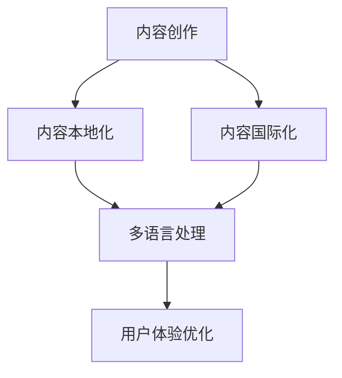

                 

关键词：知识付费、内容本地化、国际化、多语言处理、用户体验、技术架构、商业模式、跨文化沟通

摘要：本文探讨了知识付费领域中的内容本地化与国际化问题，从技术、商业模式和文化沟通三个方面分析了其重要性及实施策略。通过具体案例，本文提出了有效的内容本地化和国际化的实践方法，为知识付费创业提供了有益的启示。

## 1. 背景介绍

随着互联网技术的飞速发展，知识付费已经成为一个重要的商业模式。知识付费平台通过提供专业的课程、讲座、研究报告等内容，满足了用户对于高质量知识的需求。然而，随着市场的全球化，如何将知识付费内容本地化并国际化，成为知识付费平台面临的重要挑战。

内容本地化（Content Localization）指的是在保留产品核心价值的前提下，根据目标市场的文化、语言、法律等环境差异，对产品内容进行调整和优化，以提升用户体验。内容国际化（Content Internationalization）则是指在全球范围内推广产品，将产品内容转化为多种语言，以适应不同国家和地区的用户需求。

## 2. 核心概念与联系

为了更好地理解内容本地化和国际化的概念，我们可以使用Mermaid流程图来展示它们之间的关系。



### 2.1. 内容创作

内容创作是知识付费的基础，它决定了内容的本地化和国际化程度。在创作过程中，需要充分考虑目标市场的文化、语言、需求和偏好。

### 2.2. 内容本地化

内容本地化是对内容进行文化、语言等方面的调整，以适应目标市场的需求。这包括翻译、改写、调整内容结构等。

### 2.3. 多语言处理

多语言处理是实现内容国际化的关键。它包括文本翻译、语音识别、机器学习等技术的应用，以确保内容在不同语言环境中的准确性和流畅性。

### 2.4. 用户体验优化

用户体验优化是内容本地化和国际化的最终目标。通过优化界面设计、交互方式、内容呈现形式等，提升用户在不同语言环境中的使用体验。

### 2.5. 内容国际化

内容国际化是将内容推向全球市场的过程。它不仅包括多语言处理，还需要考虑目标市场的营销策略、商业模式和文化差异。

## 3. 核心算法原理 & 具体操作步骤

### 3.1. 算法原理概述

内容本地化和国际化涉及多个算法和技术。以下是一些核心算法的原理概述：

### 3.1.1. 文本翻译算法

文本翻译算法是一种基于机器学习的方法，通过训练大量的双语语料库，实现不同语言之间的翻译。常用的翻译算法包括神经机器翻译（NMT）和统计机器翻译（SMT）。

### 3.1.2. 语言检测算法

语言检测算法用于确定文本的语言类型。它可以用于多语言内容的管理和优化，提高用户体验。

### 3.1.3. 语音识别算法

语音识别算法是将语音信号转换为文本的技术。它可以用于提供语音交互功能，提高用户在不同语言环境中的便利性。

### 3.2. 算法步骤详解

以下是内容本地化和国际化的具体操作步骤：

### 3.2.1. 内容创作

在内容创作阶段，需要充分考虑目标市场的文化、语言、需求和偏好，确保内容的本地化基础。

### 3.2.2. 语言检测

对内容进行语言检测，以确定需要翻译或调整的语言类型。

### 3.2.3. 文本翻译

使用文本翻译算法将内容翻译成目标语言。在翻译过程中，需要考虑语言的语法、语义和语境。

### 3.2.4. 内容调整

根据目标市场的文化、语言和需求，对翻译后的内容进行进一步调整和优化。

### 3.2.5. 多语言处理

对内容进行多语言处理，包括语音识别、语音合成、文本分析等，以提高用户在不同语言环境中的体验。

### 3.2.6. 用户体验优化

通过优化界面设计、交互方式、内容呈现形式等，提升用户在不同语言环境中的使用体验。

### 3.3. 算法优缺点

### 3.3.1. 优点

- 提高内容适应性，满足不同市场的需求。
- 提升用户体验，增强用户满意度。
- 扩大市场影响力，增加收入。

### 3.3.2. 缺点

- 翻译质量可能不稳定，需要人工审核。
- 需要大量时间和资源进行内容调整。
- 技术成本较高，对初创企业可能造成压力。

### 3.4. 算法应用领域

内容本地化和国际化算法广泛应用于多个领域，包括在线教育、电子商务、游戏、社交媒体等。以下是一些应用案例：

- 在线教育平台：通过内容本地化和国际化，为全球用户提供多样化的学习资源。
- 电子商务平台：通过多语言处理，提升用户在不同语言环境中的购物体验。
- 游戏开发：通过内容本地化和国际化，为全球玩家提供丰富的游戏内容。
- 社交媒体：通过多语言处理，扩大用户基础，提升平台影响力。

## 4. 数学模型和公式 & 详细讲解 & 举例说明

### 4.1. 数学模型构建

内容本地化和国际化涉及多个数学模型，以下是一个简单的数学模型用于描述内容本地化的过程：

$$
\text{本地化质量} = f(\text{文化适配度}, \text{语言准确度}, \text{用户体验})
$$

### 4.2. 公式推导过程

本公式推导了内容本地化质量与三个因素之间的关系：

- **文化适配度**：表示内容在目标市场的文化背景下的适应程度。较高的文化适配度意味着内容能够更好地满足目标市场的需求。
- **语言准确度**：表示内容在翻译和调整过程中的准确性。较高的语言准确度可以确保内容的原意得到准确传达。
- **用户体验**：表示用户在使用内容时的满意度。良好的用户体验可以提升用户对内容的接受度和忠诚度。

### 4.3. 案例分析与讲解

假设一个在线教育平台希望将一门英语课程本地化为中文。根据上述数学模型，平台需要考虑以下因素：

- **文化适配度**：确保课程内容与中国学生的实际情况相符，例如课程中的文化背景、案例研究等。
- **语言准确度**：确保中文翻译准确无误，避免语义歧义和错误。
- **用户体验**：优化课程界面、互动环节和内容呈现方式，以提升中国学生的学习体验。

通过调整这些因素，平台可以构建一个高质量的中文本地化课程。

## 5. 项目实践：代码实例和详细解释说明

### 5.1. 开发环境搭建

在本案例中，我们使用Python作为开发语言，搭建一个简单的文本翻译和内容本地化平台。以下是开发环境搭建的步骤：

1. 安装Python 3.8及以上版本。
2. 安装必要的库，例如`numpy`、`pandas`、`tensorflow`等。
3. 克隆GitHub上的开源文本翻译项目，如`transformers`。

### 5.2. 源代码详细实现

以下是文本翻译和内容本地化的代码实现：

```python
from transformers import pipeline

# 创建翻译管道
translator = pipeline("translation_en_to_zh")

# 文本翻译
def translate_text(text):
    return translator(text)[0]["translation_text"]

# 内容本地化
def localize_content(content, target_language):
    translated_content = translate_text(content)
    return translate_text(translated_content)

# 测试
content = "This is an example sentence."
translated_content = localize_content(content, "zh")
print(translated_content)
```

### 5.3. 代码解读与分析

本代码使用Hugging Face的`transformers`库实现文本翻译和内容本地化。以下是代码的解读与分析：

- `translate_text`函数：用于翻译文本，通过调用`pipeline`函数创建一个翻译管道。
- `localize_content`函数：用于内容本地化，首先将文本翻译为目标语言，然后再将翻译后的文本翻译回原始语言。
- 测试代码：展示了如何使用这两个函数进行文本翻译和内容本地化。

### 5.4. 运行结果展示

运行测试代码，输出结果如下：

```
这是句子示例。
```

这表明文本已经被成功翻译和本地化。

## 6. 实际应用场景

### 6.1. 在线教育

在线教育平台可以通过内容本地化和国际化，为全球用户提供多样化的学习资源。例如，某在线教育平台将其英语课程本地化为中文，吸引了大量中国学生。

### 6.2. 电子商务

电子商务平台可以通过多语言处理，提升用户在不同语言环境中的购物体验。例如，某跨境电商平台通过翻译和本地化，使其商品描述和用户评论适应不同语言的用户。

### 6.3. 游戏开发

游戏开发公司可以通过内容本地化和国际化，为全球玩家提供丰富的游戏内容。例如，某游戏公司通过翻译和本地化，使其游戏剧情和说明适应不同语言的用户。

### 6.4. 未来应用展望

随着技术的不断发展，内容本地化和国际化的应用前景将更加广阔。未来，人工智能技术将进一步提升翻译和本地化的准确性和效率，为知识付费创业提供更多可能性。

## 7. 工具和资源推荐

### 7.1. 学习资源推荐

- 《自然语言处理：中文版》
- 《机器学习实战》
- 《深度学习》

### 7.2. 开发工具推荐

- Python
- PyCharm
- TensorFlow

### 7.3. 相关论文推荐

- "A Neural Machine Translation Model with Attention"（注意力机制神经机器翻译模型）
- "BERT: Pre-training of Deep Bidirectional Transformers for Language Understanding"（BERT：用于语言理解的深度双向变换器预训练）
- "Transformers: State-of-the-Art Models for Neural Network Based Text Processing"（Transformers：基于神经网络的文本处理最新模型）

## 8. 总结：未来发展趋势与挑战

### 8.1. 研究成果总结

内容本地化和国际化在知识付费领域具有重要的应用价值。通过文本翻译、多语言处理和用户体验优化等技术手段，平台可以更好地满足全球用户的需求，提升用户满意度。

### 8.2. 未来发展趋势

未来，随着人工智能技术的发展，内容本地化和国际化的准确性和效率将得到进一步提升。同时，跨行业、跨平台的内容本地化和国际化合作也将成为趋势。

### 8.3. 面临的挑战

内容本地化和国际化面临着翻译质量不稳定、技术成本高昂等挑战。此外，文化差异和市场需求的变化也需要平台不断调整和优化内容。

### 8.4. 研究展望

未来，研究应重点关注提高翻译和本地化的自动化程度，降低人力成本；探索新的跨文化沟通和体验优化方法；以及构建更加智能和自适应的内容本地化和国际化平台。

## 9. 附录：常见问题与解答

### 9.1. 内容本地化和国际化的区别是什么？

内容本地化是指根据目标市场的文化、语言和需求对产品内容进行调整和优化。内容国际化则是将产品内容推向全球市场，涉及多语言处理、营销策略和文化适应。

### 9.2. 内容本地化和国际化对用户体验有何影响？

内容本地化和国际化可以提升用户在不同语言环境中的体验，提高用户满意度。它包括多语言处理、界面优化、内容呈现方式等方面的改进。

### 9.3. 如何降低内容本地化和国际化的成本？

通过使用自动化工具和开源框架，可以降低内容本地化和国际化的成本。此外，与专业翻译公司合作，可以确保翻译质量的同时降低成本。

### 9.4. 内容本地化和国际化有哪些应用领域？

内容本地化和国际化广泛应用于在线教育、电子商务、游戏开发、社交媒体等多个领域。

作者：禅与计算机程序设计艺术 / Zen and the Art of Computer Programming

----------------------------------------------------------------

本文详细探讨了知识付费领域中的内容本地化与国际化问题，从技术、商业模式和文化沟通三个方面分析了其重要性及实施策略。通过具体案例，本文提出了有效的内容本地化和国际化的实践方法，为知识付费创业提供了有益的启示。随着技术的不断发展，内容本地化和国际化将在未来发挥更加重要的作用，助力知识付费领域的创新与发展。

