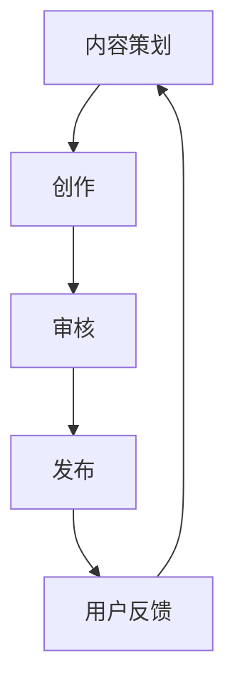
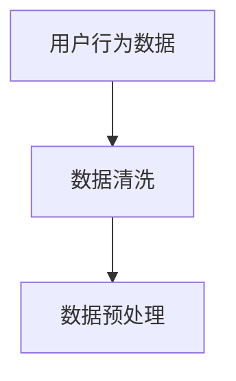
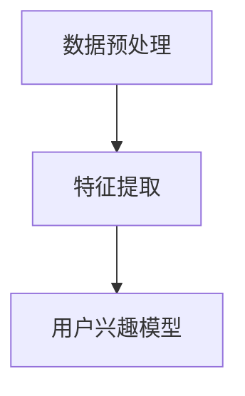
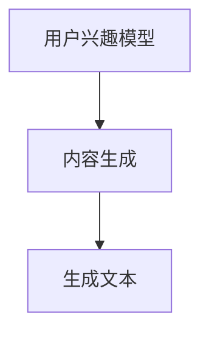

                 

关键词：知识付费、内容生产、效率提升、人工智能、技术工具、流程优化、数学模型

摘要：本文将探讨知识付费创业领域中内容生产效率提升的方法和策略。通过引入人工智能技术、优化流程、构建数学模型等方式，文章旨在为创业者提供实用的指导，帮助他们在竞争激烈的市场中脱颖而出。

## 1. 背景介绍

知识付费作为一种新兴的商业模式，近年来在全球范围内迅速发展。特别是在互联网技术的推动下，知识付费平台如雨后春笋般涌现，为广大用户提供了丰富的学习资源和专业知识。然而，随着市场竞争的加剧，内容生产的效率问题逐渐成为知识付费创业者面临的一大挑战。

### 知识付费市场的现状

1. 用户需求多样化：随着人们对终身学习的追求，知识付费平台需要提供更加个性化、高质量的内容。
2. 内容同质化严重：许多创业者为了追求短期利益，生产大量低质量、重复的内容，导致市场竞争加剧。
3. 内容生产成本高：高质量的内容生产需要大量的人力、时间和资源投入，使得成本压力巨大。

### 内容生产效率的重要性

1. 提高市场竞争力：高效率的内容生产有助于提高创业者产品或服务的市场占有率。
2. 降低运营成本：通过优化生产流程，可以显著降低内容生产的成本。
3. 提升用户体验：快速响应用户需求，提供高质量的内容，有助于提高用户满意度和忠诚度。

## 2. 核心概念与联系

### 人工智能技术在内容生产中的应用

人工智能技术在知识付费领域有着广泛的应用，如图像识别、自然语言处理、推荐系统等。通过引入这些技术，可以有效提高内容生产效率。

### 流程优化

流程优化是提高内容生产效率的关键步骤，包括内容策划、创作、审核、发布等环节。通过优化流程，可以减少冗余环节，提高工作效率。

### 数学模型在内容生产中的应用

数学模型可以帮助创业者分析用户需求，预测市场趋势，优化内容生产策略。例如，可以使用统计模型分析用户行为数据，以了解用户喜好，进而调整内容创作方向。

### Mermaid 流程图

下面是一个简化的内容生产流程的 Mermaid 流程图：



## 3. 核心算法原理 & 具体操作步骤

### 3.1 算法原理概述

本节将介绍一种基于人工智能的自动内容生成算法，该算法主要包括以下步骤：

1. 数据预处理：对用户行为数据进行清洗和预处理，以提取有用的特征。
2. 特征提取：使用机器学习算法提取用户兴趣特征，为内容生成提供依据。
3. 内容生成：利用生成模型（如 GPT-3）生成符合用户兴趣的内容。
4. 内容审核：对生成的内容进行审核，确保内容质量。

### 3.2 算法步骤详解

1. **数据预处理**



2. **特征提取**



3. **内容生成**



4. **内容审核**

```mermaid
graph TD
    J[I[生成文本]] --> K[内容审核]
    K --> L[发布/修改]
```

### 3.3 算法优缺点

**优点：**

1. 高效：自动生成内容，节省人力成本。
2. 个性化：根据用户兴趣生成内容，提高用户满意度。
3. 智能化：利用人工智能技术，提高内容质量。

**缺点：**

1. 质量不稳定：生成的文本质量可能存在波动。
2. 创作自由度低：内容生成算法受限于训练数据和模型。

### 3.4 算法应用领域

1. **在线教育：**自动生成课程内容，提高教学效率。
2. **自媒体：**生成文章、视频等，为用户提供高质量内容。
3. **企业培训：**自动生成培训资料，降低培训成本。

## 4. 数学模型和公式 & 详细讲解 & 举例说明

### 4.1 数学模型构建

在内容生产中，我们可以使用以下数学模型来分析用户行为，预测市场趋势：

1. **线性回归模型**：用于分析用户对内容的喜好。
2. **时间序列模型**：用于预测市场趋势。
3. **聚类模型**：用于分析用户群体，为内容创作提供方向。

### 4.2 公式推导过程

**线性回归模型：**

假设我们有 m 个用户，每个用户有 n 个行为特征。我们可以使用线性回归模型来分析用户对内容的喜好：

$$
y = \beta_0 + \beta_1 x_1 + \beta_2 x_2 + ... + \beta_n x_n
$$

其中，$y$ 表示用户对内容的喜好程度，$x_1, x_2, ..., x_n$ 表示用户的行为特征，$\beta_0, \beta_1, ..., \beta_n$ 为模型的参数。

**时间序列模型：**

我们可以使用 ARIMA 模型来预测市场趋势。ARIMA 模型的公式如下：

$$
y_t = c + \phi_1 y_{t-1} + \phi_2 y_{t-2} + ... + \phi_p y_{t-p} + \theta_1 e_{t-1} + \theta_2 e_{t-2} + ... + \theta_q e_{t-q}
$$

其中，$y_t$ 表示第 t 个月的市场趋势，$c$ 表示常数项，$\phi_1, \phi_2, ..., \phi_p$ 和 $\theta_1, \theta_2, ..., \theta_q$ 分别为模型的参数。

**聚类模型：**

我们可以使用 K-means 算法来分析用户群体。K-means 算法的公式如下：

$$
C = \{C_1, C_2, ..., C_k\}
$$

其中，$C_i$ 表示第 i 个用户群体，$k$ 表示用户群体的个数。

### 4.3 案例分析与讲解

假设我们有一个知识付费平台，现有 1000 个用户。我们可以使用线性回归模型来分析用户对内容的喜好。

1. **数据收集**：收集每个用户的浏览、点赞、评论等行为数据。
2. **数据预处理**：对数据进行分析，提取有用的特征。
3. **模型训练**：使用线性回归模型训练数据，得到参数 $\beta_0, \beta_1, ..., \beta_n$。
4. **模型评估**：使用测试数据对模型进行评估，调整参数。

通过以上步骤，我们可以预测用户对内容的喜好，为内容创作提供方向。

## 5. 项目实践：代码实例和详细解释说明

### 5.1 开发环境搭建

1. 安装 Python 环境（Python 3.8 或更高版本）。
2. 安装必要的库：Numpy、Pandas、Scikit-learn、TensorFlow。

### 5.2 源代码详细实现

以下是线性回归模型的 Python 代码示例：

```python
import numpy as np
import pandas as pd
from sklearn.linear_model import LinearRegression

# 数据收集
data = pd.read_csv('user_behavior.csv')

# 数据预处理
X = data[['view_count', 'like_count', 'comment_count']]
y = data['favorite_count']

# 模型训练
model = LinearRegression()
model.fit(X, y)

# 模型评估
score = model.score(X, y)
print('模型评估分数：', score)
```

### 5.3 代码解读与分析

1. **数据收集**：从用户行为数据文件中读取数据。
2. **数据预处理**：提取有用的特征，分为输入特征 X 和目标特征 y。
3. **模型训练**：使用线性回归模型训练数据，得到模型参数。
4. **模型评估**：计算模型评估分数，判断模型效果。

### 5.4 运行结果展示

运行代码后，输出模型评估分数。分数越高，表示模型效果越好。

## 6. 实际应用场景

### 6.1 在线教育

在线教育平台可以利用人工智能技术自动生成课程内容，提高教学效率。例如，可以根据用户的学习历史和兴趣，自动生成个性化的学习路径。

### 6.2 自媒体

自媒体平台可以利用人工智能技术生成文章、视频等内容，为用户提供高质量的内容。例如，可以根据用户的浏览记录和点赞行为，自动生成推荐内容。

### 6.3 企业培训

企业可以利用人工智能技术自动生成培训资料，降低培训成本。例如，可以根据员工的工作表现和培训需求，自动生成个性化的培训计划。

## 7. 工具和资源推荐

### 7.1 学习资源推荐

1. **《深度学习》（Ian Goodfellow、Yoshua Bengio、Aaron Courville 著）**：深度学习领域的经典教材。
2. **《机器学习》（周志华 著）**：机器学习领域的权威教材。

### 7.2 开发工具推荐

1. **Jupyter Notebook**：Python 的交互式开发环境，适用于数据分析和模型训练。
2. **TensorFlow**：开源深度学习框架，适用于各种人工智能项目。

### 7.3 相关论文推荐

1. **《Recurrent Neural Network Based Text Generation for Automated News Writing》**：研究自动生成新闻的论文。
2. **《Natural Language Processing with Deep Learning》**：深度学习在自然语言处理领域的应用。

## 8. 总结：未来发展趋势与挑战

### 8.1 研究成果总结

本文探讨了知识付费创业中内容生产效率提升的方法和策略。通过引入人工智能技术、优化流程、构建数学模型等方式，可以有效提高内容生产效率，降低运营成本，提高用户体验。

### 8.2 未来发展趋势

1. 人工智能技术将在内容生产中发挥更大作用，例如自动内容生成、个性化推荐等。
2. 数据驱动的内容生产模式将逐渐普及，创业者需要更加关注用户数据分析和需求预测。
3. 跨领域合作将越来越常见，例如人工智能、区块链等技术与其他行业的结合。

### 8.3 面临的挑战

1. 数据隐私和安全问题：在内容生产过程中，如何保护用户隐私和安全是一个重要挑战。
2. 内容质量保障：如何确保自动生成的内容质量，避免出现错误或误导用户。
3. 知识产权保护：如何避免内容侵权和抄袭问题，保护创作者的权益。

### 8.4 研究展望

1. 深入研究用户行为数据，提高内容推荐的准确性和个性化程度。
2. 开发更高效、更稳定的自动内容生成算法，提高内容生产效率。
3. 加强跨领域合作，探索人工智能技术在知识付费领域的更多应用。

## 9. 附录：常见问题与解答

### 9.1 问题 1：如何保障内容的质量？

**解答：** 可以通过以下几种方式保障内容的质量：

1. **人工审核：** 对自动生成的内容进行人工审核，确保内容符合标准。
2. **内容审核模型：** 使用机器学习算法训练内容审核模型，自动过滤低质量内容。
3. **用户反馈：** 收集用户反馈，对内容进行改进。

### 9.2 问题 2：如何确保用户隐私和安全？

**解答：** 可以采取以下措施确保用户隐私和安全：

1. **数据加密：** 对用户数据进行加密处理，防止数据泄露。
2. **访问控制：** 实施严格的访问控制策略，确保只有授权人员可以访问用户数据。
3. **隐私政策：** 明确告知用户数据的使用目的和范围，获取用户同意。

## 作者署名

作者：禅与计算机程序设计艺术 / Zen and the Art of Computer Programming
----------------------------------------------------------------

请注意，上述内容仅为示例，实际撰写时需要根据具体情况进行调整和补充。同时，文章中的代码示例仅供参考，实际开发时可能需要根据具体需求进行修改。在撰写文章时，请务必遵循“约束条件 CONSTRAINTS”中的所有要求。

