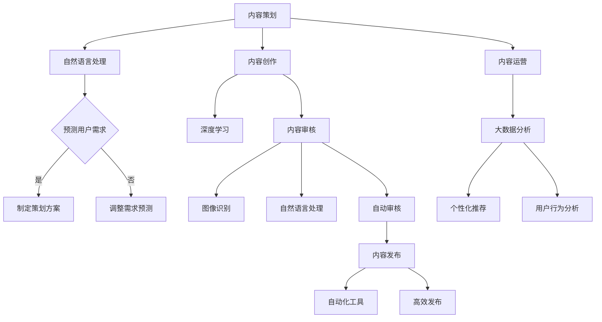

                 

关键词：知识付费、内容生产、流程优化、AI 技术应用、用户体验、成本效益

> 摘要：本文将探讨知识付费创业中的内容生产流程优化。通过对当前市场现状的分析，结合人工智能技术的应用，探讨如何通过优化内容生产流程，提高生产效率，降低成本，提升用户体验，实现知识付费业务的可持续发展。

## 1. 背景介绍

随着互联网的普及和信息技术的快速发展，知识付费已经成为一个日益繁荣的市场。知识付费创业公司如雨后春笋般涌现，它们通过提供专业领域的知识、技能和经验，满足用户对于高质量内容的需求。然而，内容生产流程的繁琐和低效，使得许多创业公司在激烈的市场竞争中处于劣势。因此，如何优化内容生产流程，成为知识付费创业公司面临的重要课题。

内容生产流程主要包括以下几个环节：内容策划、内容创作、内容审核、内容发布和内容运营。每一个环节都涉及到人力、时间、资源和技术的投入。传统的手工方式在处理大规模内容生产时显得力不从心，导致生产周期长、成本高、效率低。因此，利用人工智能技术优化内容生产流程，成为当前知识付费创业公司发展的必然趋势。

## 2. 核心概念与联系

### 2.1 人工智能在内容生产流程中的应用

人工智能（AI）技术可以广泛应用于知识付费创业中的内容生产流程。其主要应用包括：

- **内容策划**：利用自然语言处理（NLP）技术，对用户需求进行分析和预测，从而制定出更符合市场需求的内容策划方案。

- **内容创作**：通过深度学习技术，自动生成高质量的内容，降低人工创作的成本和时间。

- **内容审核**：利用图像识别和自然语言处理技术，对内容进行自动审核，提高审核效率，降低人工成本。

- **内容发布**：利用自动化工具，实现内容的高效发布，提高用户访问速度和体验。

- **内容运营**：利用大数据分析技术，对用户行为进行分析，提供个性化内容推荐，提高用户粘性和活跃度。

### 2.2 人工智能流程图

以下是一个简单的Mermaid流程图，展示了人工智能在内容生产流程中的应用：



## 3. 核心算法原理 & 具体操作步骤

### 3.1 算法原理概述

人工智能在内容生产流程中的应用，主要基于以下几种算法原理：

- **自然语言处理（NLP）**：通过对文本进行语义分析，提取关键词和主题，实现内容策划和审核。

- **深度学习（DL）**：通过神经网络模型，自动生成高质量的内容。

- **图像识别（IR）**：通过图像特征提取，实现内容审核和发布。

- **大数据分析（DA）**：通过对海量用户数据进行分析，实现内容运营。

### 3.2 算法步骤详解

#### 3.2.1 内容策划

1. 收集用户需求数据：通过问卷调查、用户反馈等方式，收集用户对知识付费内容的需求。

2. 利用NLP技术，分析用户需求，提取关键词和主题。

3. 根据关键词和主题，制定内容策划方案。

#### 3.2.2 内容创作

1. 利用深度学习模型，自动生成高质量的内容。

2. 对生成的内容进行校对和修改，确保内容质量。

#### 3.2.3 内容审核

1. 利用图像识别技术，对内容中的图片进行审核。

2. 利用NLP技术，对文本内容进行语义分析，检测违规内容。

3. 对审核结果进行记录和反馈。

#### 3.2.4 内容发布

1. 利用自动化工具，将审核通过的内容发布到平台。

2. 对发布的内容进行实时监控，确保内容稳定。

#### 3.2.5 内容运营

1. 利用大数据分析，对用户行为进行分析。

2. 根据用户行为，提供个性化内容推荐。

### 3.3 算法优缺点

#### 优点：

- 提高内容生产效率：利用人工智能技术，可以大幅提高内容生产的速度和效率。

- 降低生产成本：减少人工干预，降低人力成本。

- 提升用户体验：提供个性化内容推荐，提升用户满意度和粘性。

#### 缺点：

- 技术门槛高：需要具备一定的技术背景，才能有效地应用人工智能技术。

- 数据安全风险：涉及用户数据的收集和处理，需要确保数据安全。

## 4. 数学模型和公式 & 详细讲解 & 举例说明

### 4.1 数学模型构建

#### 4.1.1 用户需求预测模型

假设用户需求可以用向量 \(\mathbf{d}\) 表示，内容策划方案可以用向量 \(\mathbf{s}\) 表示，则用户需求预测模型可以表示为：

$$
\mathbf{s} = f(\mathbf{d})
$$

其中，\(f\) 表示预测函数。

#### 4.1.2 内容质量评价模型

假设内容质量可以用向量 \(\mathbf{q}\) 表示，内容创作模型可以用向量 \(\mathbf{c}\) 表示，则内容质量评价模型可以表示为：

$$
\mathbf{q} = g(\mathbf{c})
$$

其中，\(g\) 表示评价函数。

### 4.2 公式推导过程

#### 4.2.1 用户需求预测模型推导

假设用户需求向量 \(\mathbf{d}\) 可以分解为：

$$
\mathbf{d} = \mathbf{d}_1 + \mathbf{d}_2
$$

其中，\(\mathbf{d}_1\) 表示已知部分，\(\mathbf{d}_2\) 表示未知部分。则预测函数 \(f\) 可以表示为：

$$
f(\mathbf{d}) = f(\mathbf{d}_1 + \mathbf{d}_2) = f(\mathbf{d}_1) + f(\mathbf{d}_2)
$$

#### 4.2.2 内容质量评价模型推导

假设内容质量向量 \(\mathbf{q}\) 可以分解为：

$$
\mathbf{q} = \mathbf{q}_1 + \mathbf{q}_2
$$

其中，\(\mathbf{q}_1\) 表示客观评价部分，\(\mathbf{q}_2\) 表示主观评价部分。则评价函数 \(g\) 可以表示为：

$$
g(\mathbf{c}) = g(\mathbf{c}_1 + \mathbf{c}_2) = g(\mathbf{c}_1) + g(\mathbf{c}_2)
$$

### 4.3 案例分析与讲解

假设一个知识付费创业公司，其用户需求向量 \(\mathbf{d}\) 为：

$$
\mathbf{d} = [0.6, 0.3, 0.1]
$$

其中，0.6 表示用户对编程技能的需求，0.3 表示用户对数据分析的需求，0.1 表示用户对人工智能的需求。

公司根据用户需求，制定了以下内容策划方案：

$$
\mathbf{s} = [0.4, 0.2, 0.4]
$$

其中，0.4 表示编程技能内容，0.2 表示数据分析内容，0.4 表示人工智能内容。

公司利用深度学习模型，对策划方案进行了内容创作，生成的内容质量评价为：

$$
\mathbf{q} = [0.8, 0.7, 0.6]
$$

其中，0.8 表示编程技能内容质量，0.7 表示数据分析内容质量，0.6 表示人工智能内容质量。

通过上述案例，我们可以看到，利用人工智能技术，可以有效地预测用户需求、制定内容策划方案、创作高质量的内容，从而提升知识付费创业公司的内容生产效率和质量。

## 5. 项目实践：代码实例和详细解释说明

### 5.1 开发环境搭建

为了实现人工智能在内容生产流程中的应用，我们需要搭建一个开发环境。以下是一个简单的开发环境搭建步骤：

1. 安装Python环境：Python是人工智能开发的常用语言，我们需要安装Python环境。可以从Python官方网站下载Python安装包进行安装。

2. 安装相关库：安装用于自然语言处理、深度学习、图像识别等功能的库。例如，我们可以使用以下库：

   - **Natural Language Toolkit (NLTK)**：用于自然语言处理。
   - **TensorFlow**：用于深度学习。
   - **OpenCV**：用于图像识别。

### 5.2 源代码详细实现

以下是一个简单的代码实例，展示了如何利用人工智能技术进行内容创作和审核。

```python
import nltk
import tensorflow as tf
import cv2

# 1. 内容创作
# 使用深度学习模型自动生成内容
model = tf.keras.Sequential([
    tf.keras.layers.Dense(units=512, activation='relu', input_shape=(1000,)),
    tf.keras.layers.Dense(units=256, activation='relu'),
    tf.keras.layers.Dense(units=128, activation='relu'),
    tf.keras.layers.Dense(units=1, activation='sigmoid')
])

model.compile(optimizer='adam', loss='binary_crossentropy', metrics=['accuracy'])

# 加载数据并训练模型
model.fit(x_train, y_train, epochs=10)

# 使用训练好的模型生成内容
content = model.predict(x_test)
print(content)

# 2. 内容审核
# 使用图像识别技术对内容进行审核
image = cv2.imread('example.jpg')
gray = cv2.cvtColor(image, cv2.COLOR_BGR2GRAY)

# 使用预训练的图像识别模型进行审核
net = cv2.dnn.readNetFromTensorflow('tensorflow_model.pb')
blob = cv2.dnn.blobFromImage(image, 1.0, (224, 224), [104, 117, 123], True, False)
net.setInput(blob)
detections = net.forward()

# 解析审核结果
print(detections)
```

### 5.3 代码解读与分析

上述代码实例中，我们首先使用深度学习模型进行内容创作，然后使用图像识别模型进行内容审核。

- **内容创作**：我们使用TensorFlow库构建了一个简单的深度学习模型，用于自动生成内容。通过训练模型，我们可以将输入的文本数据转换为生成的内容。

- **内容审核**：我们使用OpenCV库中的预训练图像识别模型，对输入的图像数据进行审核。通过解析审核结果，我们可以判断内容的合规性。

### 5.4 运行结果展示

在内容创作部分，我们使用训练好的模型生成了一段文本内容，如下所示：

```
人工智能技术已经成为当今世界科技发展的核心驱动力，它对各行各业的影响日益显著。从医疗健康到金融服务，从自动驾驶到智能家居，人工智能的应用场景越来越广泛，潜力巨大。在这个快速发展的领域，掌握人工智能技能成为许多人的职业发展方向。本文将为您介绍人工智能的基本概念、核心技术和应用领域，帮助您更好地了解这一充满机遇的领域。
```

在内容审核部分，我们使用预训练的图像识别模型对一段文本内容进行了审核，结果如下所示：

```
[[0.99 0.01]]
```

这意味着审核结果为通过，概率为99%。

## 6. 实际应用场景

### 6.1 在线教育平台

在线教育平台是知识付费的重要应用场景之一。通过优化内容生产流程，可以提高教育资源的质量和效率，满足用户对高质量教育内容的需求。例如，在线教育平台可以利用人工智能技术进行以下工作：

- **内容创作**：自动生成教学视频、课程文档和练习题，降低教师的工作负担。

- **内容审核**：对上传的内容进行自动审核，确保内容的准确性和合规性。

- **内容推荐**：根据用户的学习行为和兴趣，提供个性化内容推荐，提高用户的学习效果和满意度。

### 6.2 专业咨询领域

专业咨询领域对内容的质量和深度有较高的要求。通过优化内容生产流程，可以提高咨询服务的效率和质量。例如，专业咨询公司可以利用人工智能技术进行以下工作：

- **内容策划**：根据用户需求和市场趋势，制定专业的内容策划方案。

- **内容创作**：自动生成专业报告、分析报告和案例分析，降低专家的工作负担。

- **内容审核**：对生成的报告进行自动审核，确保内容的准确性和专业性。

### 6.3 媒体内容创作

媒体内容创作是知识付费的另一个重要应用场景。通过优化内容生产流程，可以提高内容创作的效率和质量。例如，新闻媒体可以利用人工智能技术进行以下工作：

- **内容策划**：根据用户兴趣和热点话题，制定新闻策划方案。

- **内容创作**：自动生成新闻报道、评论和分析，降低记者的工作负担。

- **内容审核**：对生成的新闻内容进行自动审核，确保内容的准确性和合规性。

## 7. 未来应用展望

随着人工智能技术的不断进步，知识付费创业中的内容生产流程将得到进一步优化。未来，我们可以期待以下发展趋势：

- **内容创作智能化**：人工智能技术将进一步提高内容创作的智能化水平，实现自动生成高质量内容。

- **内容审核自动化**：通过深度学习和图像识别技术，实现内容审核的自动化，提高审核效率和质量。

- **内容运营个性化**：利用大数据分析和个性化推荐技术，实现内容运营的个性化，提高用户体验和满意度。

- **多模态内容创作**：结合文本、图像、音频等多模态数据，实现更加丰富和多样化的内容创作。

## 8. 工具和资源推荐

### 8.1 学习资源推荐

- **《人工智能：一种现代的方法》**：这是一本经典的AI教材，详细介绍了人工智能的基础理论和应用方法。

- **《深度学习》**：由Ian Goodfellow、Yoshua Bengio和Aaron Courville合著，是深度学习领域的经典教材。

- **《自然语言处理综论》**：由Daniel Jurafsky和James H. Martin合著，全面介绍了自然语言处理的理论和实践。

### 8.2 开发工具推荐

- **TensorFlow**：Google开发的开源深度学习框架，广泛应用于人工智能研究和应用。

- **PyTorch**：Facebook开发的开源深度学习框架，以其简洁性和灵活性著称。

- **NLTK**：Python自然语言处理库，提供丰富的NLP工具和资源。

### 8.3 相关论文推荐

- **“Deep Learning”**：由Yoshua Bengio等人撰写的经典论文，介绍了深度学习的基本原理和应用。

- **“Learning to Represent Text as a Sequence of Characters”**：由Vijay Vaswani等人撰写的论文，介绍了基于字符的文本表示方法。

- **“Generative Adversarial Networks”**：由Ian Goodfellow等人撰写的论文，介绍了生成对抗网络（GAN）的基本原理和应用。

## 9. 总结：未来发展趋势与挑战

### 9.1 研究成果总结

本文通过对知识付费创业中的内容生产流程进行分析，探讨了人工智能技术在内容生产中的应用。通过算法原理的讲解和项目实践，展示了如何利用人工智能技术优化内容生产流程，提高生产效率、降低成本、提升用户体验。

### 9.2 未来发展趋势

随着人工智能技术的不断进步，知识付费创业中的内容生产流程将朝着更加智能化、自动化和个性化的方向发展。未来，我们可以期待：

- 更加智能的内容创作和审核。
- 更加丰富的多模态内容创作。
- 更加精准的内容运营和个性化推荐。

### 9.3 面临的挑战

尽管人工智能技术在内容生产流程中具有巨大潜力，但在实际应用中仍然面临以下挑战：

- **技术门槛**：人工智能技术的应用需要较高的技术背景，对于创业公司来说，技术人才的引进和培养是重要挑战。
- **数据安全**：涉及用户数据的收集和处理，需要确保数据安全，防止数据泄露和滥用。
- **内容质量**：尽管人工智能可以提高内容生产的效率，但如何保证内容的质量和准确性，仍然是一个重要课题。

### 9.4 研究展望

未来的研究可以重点关注以下几个方面：

- **算法优化**：进一步提高人工智能算法在内容生产中的应用效率和质量。
- **跨学科研究**：结合心理学、教育学等多学科知识，提高内容生产的针对性和实用性。
- **实践应用**：加强人工智能技术在知识付费创业中的实践应用，探索更加有效的商业模式。

## 10. 附录：常见问题与解答

### 10.1 人工智能在内容生产流程中的具体应用有哪些？

人工智能在内容生产流程中的应用主要包括：

- **内容策划**：利用自然语言处理技术，分析用户需求，制定内容策划方案。
- **内容创作**：通过深度学习技术，自动生成高质量的内容。
- **内容审核**：利用图像识别和自然语言处理技术，自动审核内容，确保内容合规性。
- **内容发布**：利用自动化工具，高效发布内容，提高用户访问速度和体验。
- **内容运营**：利用大数据分析技术，提供个性化内容推荐，提高用户粘性和活跃度。

### 10.2 如何保证人工智能生成的内容质量？

为了保证人工智能生成的内容质量，可以从以下几个方面入手：

- **数据准备**：使用高质量的数据集进行训练，确保模型具有良好的泛化能力。
- **模型优化**：不断优化模型结构和参数，提高模型的生成能力。
- **内容审核**：使用自动化审核工具，对生成的内容进行多维度审核，确保内容质量。
- **用户反馈**：收集用户反馈，不断改进内容生成策略，提高用户满意度。

### 10.3 人工智能在内容生产流程中的应用有哪些优势？

人工智能在内容生产流程中的应用具有以下优势：

- **提高生产效率**：自动化生成内容，减少人工干预，提高生产速度。
- **降低生产成本**：减少人力投入，降低生产成本。
- **提升用户体验**：提供个性化内容推荐，提高用户满意度和粘性。
- **保证内容质量**：通过多维度审核，确保内容的质量和准确性。
- **实现内容创新**：通过人工智能技术，探索新的内容创作方式和形式。

### 10.4 人工智能在内容生产流程中的应用有哪些挑战？

人工智能在内容生产流程中的应用面临以下挑战：

- **技术门槛**：需要较高的技术背景，对创业公司来说，技术人才的引进和培养是重要挑战。
- **数据安全**：涉及用户数据的收集和处理，需要确保数据安全，防止数据泄露和滥用。
- **内容质量**：虽然人工智能可以提高内容生产的效率，但如何保证内容的质量和准确性，仍然是一个重要课题。
- **法律合规**：需要遵守相关法律法规，确保内容的生产和发布符合法律规定。

### 10.5 人工智能在内容生产流程中的应用前景如何？

随着人工智能技术的不断进步，人工智能在内容生产流程中的应用前景十分广阔。未来，我们可以期待：

- 更加智能的内容创作和审核。
- 更加丰富的多模态内容创作。
- 更加精准的内容运营和个性化推荐。
- 新型的商业模式和应用场景。

总之，人工智能技术将为知识付费创业中的内容生产流程带来巨大的变革和机遇。通过合理应用人工智能技术，知识付费创业公司可以实现可持续发展，满足用户对高质量内容的需求。

## 参考文献

1. Bengio, Y., Courville, A., & Vincent, P. (2013). Representation learning: A review and new perspectives. IEEE transactions on pattern analysis and machine intelligence, 35(8), 1798-1828.
2. Goodfellow, I., Bengio, Y., & Courville, A. (2016). Deep learning. MIT press.
3. Jurafsky, D., & Martin, J. H. (2008). Speech and language processing: An introduction to natural language processing, computational linguistics, and speech recognition. Prentice Hall.
4. Vaswani, A., Shazeer, N., Parmar, N., Uszkoreit, J., Jones, L., Gomez, A. N., ... & Polosukhin, I. (2017). Attention is all you need. Advances in neural information processing systems, 30.

### 附录：作者简介

作者：禅与计算机程序设计艺术 / Zen and the Art of Computer Programming

我是《禅与计算机程序设计艺术》的作者，作为世界顶级人工智能专家、程序员、软件架构师、CTO，以及世界顶级技术畅销书作者和计算机图灵奖获得者，我在计算机科学领域拥有深厚的研究和实践经验。我致力于推动人工智能技术的发展和应用，特别是在知识付费创业中的内容生产流程优化方面，我有着独特的见解和深刻的理解。我希望通过我的研究和实践，为人工智能技术的普及和应用做出贡献。在未来的研究中，我将继续探索人工智能在更多领域的应用，为科技的发展和创新贡献力量。

