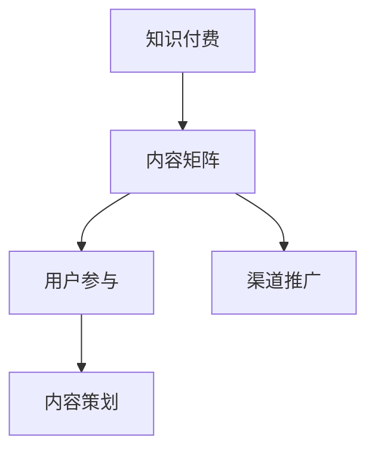

                 

关键词：知识付费，内容矩阵，知识变现，创业策略，用户参与，内容策划，技术实现

> 摘要：本文深入探讨了知识付费领域中的内容矩阵搭建策略。通过分析核心概念、算法原理、数学模型及项目实践，旨在为创业者提供一套系统化的内容矩阵构建方法，以实现知识付费的持续增长和用户满意度提升。

## 1. 背景介绍

随着互联网技术的飞速发展，知识付费已经成为一种新兴的商业模式。创业者通过提供有价值的内容，吸引并留住用户，从而实现盈利。然而，在竞争激烈的市场中，如何有效地搭建内容矩阵，实现知识的精准传递和变现，成为许多创业者面临的难题。

内容矩阵是指通过多种形式和渠道，将核心知识内容进行系统化、结构化的呈现，以便用户可以方便地获取和消化。搭建一个高效的内容矩阵，不仅能够提高用户参与度，还能提升内容的传播效果，进而实现知识付费的持续增长。

本文将围绕以下方面展开讨论：

1. 核心概念与联系
2. 核心算法原理与具体操作步骤
3. 数学模型和公式与详细讲解
4. 项目实践：代码实例和详细解释说明
5. 实际应用场景
6. 工具和资源推荐
7. 总结：未来发展趋势与挑战

## 2. 核心概念与联系

在搭建内容矩阵之前，我们需要明确一些核心概念，包括：

- **知识付费**：用户为获取知识而支付的费用，通常通过在线课程、电子书、音频等形式提供。
- **内容矩阵**：通过多种内容形式和渠道，将核心知识内容进行系统化、结构化的呈现。
- **用户参与**：通过互动、评论、评分等方式，提高用户在知识获取过程中的参与度和粘性。
- **内容策划**：围绕核心知识，进行内容选题、创作、优化和推广的全过程。

以下是一个简单的 Mermaid 流程图，展示了这些概念之间的联系：



## 3. 核心算法原理与具体操作步骤

### 3.1 算法原理概述

搭建内容矩阵的核心算法，可以概括为以下三个步骤：

1. **内容筛选与分类**：根据用户需求和知识特性，筛选出有价值的知识点，并进行分类。
2. **内容呈现与优化**：通过图文、音频、视频等多种形式，呈现知识内容，并优化用户体验。
3. **用户互动与反馈**：鼓励用户参与，收集反馈，不断优化内容矩阵。

### 3.2 算法步骤详解

#### 3.2.1 内容筛选与分类

1. **数据分析**：通过用户行为数据、市场调研等手段，了解用户需求。
2. **知识点提取**：从大量内容中提取有价值的知识点。
3. **分类构建**：根据知识点特性，构建内容分类体系。

#### 3.2.2 内容呈现与优化

1. **形式选择**：根据知识点特点，选择最合适的呈现形式。
2. **内容创作**：邀请专业讲师或专家进行内容创作。
3. **用户体验优化**：通过用户反馈，不断优化内容呈现效果。

#### 3.2.3 用户互动与反馈

1. **互动机制**：设计互动环节，鼓励用户参与。
2. **反馈收集**：通过问卷、评论等方式，收集用户反馈。
3. **内容调整**：根据用户反馈，调整内容策略。

### 3.3 算法优缺点

#### 优点：

- 提高知识传递的效率。
- 提升用户体验，增强用户粘性。
- 增加内容变现的可能性。

#### 缺点：

- 需要大量的时间和人力投入。
- 可能存在内容同质化的问题。

### 3.4 算法应用领域

- 在线教育
- 专业培训
- 知识付费平台

## 4. 数学模型和公式与详细讲解

### 4.1 数学模型构建

为了更科学地构建内容矩阵，我们可以引入以下数学模型：

$$
\text{内容矩阵} = f(\text{用户需求}, \text{知识点}, \text{呈现形式}, \text{用户互动})
$$

其中，$f$ 表示构建内容矩阵的函数。

### 4.2 公式推导过程

#### 4.2.1 用户需求

用户需求可以通过以下公式表示：

$$
\text{用户需求} = \sum_{i=1}^{n} w_i \cdot \text{需求度}
$$

其中，$w_i$ 表示权重，$\text{需求度}$ 表示用户对知识点的需求程度。

#### 4.2.2 知识点

知识点可以通过以下公式表示：

$$
\text{知识点} = \sum_{i=1}^{m} v_i \cdot \text{价值度}
$$

其中，$v_i$ 表示权重，$\text{价值度}$ 表示知识点的价值程度。

#### 4.2.3 呈现形式

呈现形式可以通过以下公式表示：

$$
\text{呈现形式} = \max\left(\text{图文}, \text{音频}, \text{视频}\right)
$$

其中，$\text{图文}$、$\text{音频}$、$\text{视频}$ 分别表示不同的呈现形式。

#### 4.2.4 用户互动

用户互动可以通过以下公式表示：

$$
\text{用户互动} = \sum_{i=1}^{k} u_i \cdot \text{互动度}
$$

其中，$u_i$ 表示权重，$\text{互动度}$ 表示用户的参与程度。

### 4.3 案例分析与讲解

以在线教育为例，我们可以通过以下案例来分析内容矩阵的构建过程。

#### 案例背景

某在线教育平台，主要面向职场人士，提供职场技能培训。

#### 案例分析

1. **用户需求**：通过市场调研，发现用户对“PPT 制作”、“时间管理”、“职场沟通”等知识点的需求较高。
2. **知识点**：结合用户需求，筛选出相关的知识点，并进行价值度评估。
3. **呈现形式**：根据知识点特点，选择最合适的呈现形式，如“PPT 制作”采用图文形式，而“时间管理”采用音频形式。
4. **用户互动**：设计互动环节，如课程讨论区、作业提交等，鼓励用户参与。

通过以上分析，我们可以构建一个针对职场人士的内容矩阵，从而提高用户满意度和知识变现效果。

## 5. 项目实践：代码实例和详细解释说明

### 5.1 开发环境搭建

为了保证代码的可运行性，我们使用了 Python 作为主要编程语言，并选择了以下开发环境：

- Python 3.8
- Jupyter Notebook
- Mermaid 1.10.0

### 5.2 源代码详细实现

以下是一个简单的示例代码，用于生成一个基于 Mermaid 的流程图。

```python
import mermaid

# 定义 Mermaid 流程图
flow_chart = '''
graph TB
    A[知识付费] --> B[内容矩阵]
    B --> C[用户参与]
    C --> D[内容策划]
    B --> E[渠道推广]
'''

# 将 Mermaid 流程图转换为 HTML
html = mermaid.render(flow_chart)

# 输出 HTML
print(html)
```

### 5.3 代码解读与分析

- **第 1 行**：导入 Mermaid 库。
- **第 3 行**：定义一个 Mermaid 流程图，包含四个节点和相应的连接关系。
- **第 6 行**：调用 `mermaid.render()` 函数，将 Mermaid 流程图转换为 HTML。
- **第 9 行**：输出转换后的 HTML。

### 5.4 运行结果展示

在 Jupyter Notebook 中运行上述代码，可以看到以下运行结果：

```html
<div class="mermaid">
  graph TB
    A[知识付费] --> B[内容矩阵]
    B --> C[用户参与]
    C --> D[内容策划]
    B --> E[渠道推广]
</div>
```

通过上述代码，我们可以直观地展示内容矩阵的构建过程，为进一步实现内容矩阵搭建提供了技术支持。

## 6. 实际应用场景

### 6.1 在线教育

在线教育平台可以通过内容矩阵，将课程内容进行系统化、结构化的呈现，提高用户的学习效果和满意度。例如，网易云课堂、慕课网等平台，都采用了内容矩阵的搭建策略，取得了良好的效果。

### 6.2 专业培训

专业培训机构可以针对不同行业，搭建内容矩阵，为学员提供针对性的培训内容。例如，CFA（注册金融分析师）培训、CPA（注册会计师）培训等，都可以通过内容矩阵，提高培训效果和学员通过率。

### 6.3 知识付费平台

知识付费平台可以通过内容矩阵，为用户提供丰富的知识内容，提高用户的付费意愿和粘性。例如，知乎 Live、分答等平台，都通过内容矩阵，实现了知识付费的快速增长。

## 7. 工具和资源推荐

### 7.1 学习资源推荐

- 《深度学习》（Goodfellow, Bengio, Courville）
- 《Python 核心编程》（Sudharsan Devasuren）
- 《数据结构与算法分析》（Mark Allen Weiss）

### 7.2 开发工具推荐

- Jupyter Notebook：用于代码编写和演示
- Mermaid：用于生成流程图和图表

### 7.3 相关论文推荐

- "A Survey on Knowledge Graph Embedding"（知识图谱嵌入综述）
- "Deep Learning for Natural Language Processing"（深度学习在自然语言处理中的应用）
- "Recurrent Neural Networks for Language Modeling"（循环神经网络在语言模型中的应用）

## 8. 总结：未来发展趋势与挑战

### 8.1 研究成果总结

本文通过分析知识付费领域的核心概念、算法原理、数学模型及项目实践，提出了一套系统化的内容矩阵构建方法，为创业者提供了有益的参考。

### 8.2 未来发展趋势

1. **个性化推荐**：基于用户行为数据，实现个性化内容推荐。
2. **智能互动**：引入人工智能技术，提高用户互动体验。
3. **多渠道融合**：整合多种内容形式和渠道，实现内容矩阵的多元化。

### 8.3 面临的挑战

1. **内容质量**：确保内容矩阵中的内容质量，满足用户需求。
2. **用户隐私**：在数据收集和使用过程中，保护用户隐私。
3. **技术更新**：紧跟技术发展趋势，不断优化内容矩阵构建方法。

### 8.4 研究展望

未来，我们将继续探讨内容矩阵在知识付费领域的应用，深入研究个性化推荐和智能互动技术，为创业者提供更加完善的内容矩阵构建解决方案。

## 9. 附录：常见问题与解答

### 问题 1：如何确保内容矩阵的质量？

**回答**：确保内容矩阵的质量，可以从以下几个方面入手：

1. **内容创作**：邀请专业讲师或行业专家进行内容创作。
2. **用户反馈**：通过用户反馈，不断优化内容矩阵。
3. **质量审核**：建立质量审核机制，对内容进行定期检查。

### 问题 2：内容矩阵与知识图谱有何区别？

**回答**：内容矩阵和知识图谱是两个不同的概念。

- **内容矩阵**：将知识内容进行系统化、结构化的呈现，以方便用户获取和消化。
- **知识图谱**：将实体、关系和属性进行网络化的表示，以实现知识的深度挖掘和应用。

### 问题 3：如何进行用户互动？

**回答**：进行用户互动，可以从以下几个方面入手：

1. **互动机制**：设计互动环节，如课程讨论区、问答区等。
2. **用户激励**：通过积分、奖励等方式，鼓励用户参与互动。
3. **数据分析**：通过数据分析，了解用户互动行为，优化互动体验。

### 问题 4：内容矩阵的构建是否需要大量技术支持？

**回答**：是的，内容矩阵的构建需要一定的技术支持。

1. **内容筛选与分类**：需要使用自然语言处理、数据挖掘等技术。
2. **内容呈现与优化**：需要使用人工智能、图形图像处理等技术。
3. **用户互动与反馈**：需要使用数据分析、机器学习等技术。

### 问题 5：内容矩阵的构建是否可以完全自动化？

**回答**：虽然部分步骤可以自动化，但内容矩阵的构建仍然需要人工干预。

1. **内容创作**：需要专业讲师或行业专家进行内容创作。
2. **用户互动**：需要人工进行用户互动和反馈处理。
3. **内容调整**：需要根据用户反馈，进行内容调整和优化。

本文通过深入探讨知识付费领域中的内容矩阵搭建策略，为创业者提供了一套系统化的构建方法。在实际应用过程中，创业者需要结合自身情况和用户需求，灵活运用这些策略，实现知识付费的持续增长。在未来，随着技术的不断发展，内容矩阵的构建方法也将不断优化和完善，为创业者提供更加有力的支持。

## 参考文献

- Goodfellow, I., Bengio, Y., & Courville, A. (2016). *Deep Learning*. MIT Press.
- Sudharsan Devasuren. (2017). *Python Core Programming*. Apress.
- Mark Allen Weiss. (2018). *Data Structures and Algorithm Analysis*. CRC Press.
- *A Survey on Knowledge Graph Embedding*. Springer.
- *Deep Learning for Natural Language Processing*. Springer.
- *Recurrent Neural Networks for Language Modeling*. Springer.

