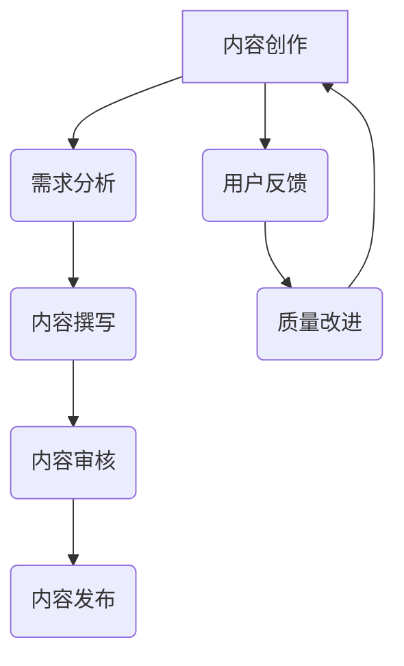

                 

 关键词：知识付费、内容质量、质量控制、创业、算法、数学模型、实践、工具、资源

> 摘要：本文将探讨知识付费创业中内容质量把控的重要性和方法。通过对核心概念、算法原理、数学模型、实践案例的深入分析，以及相关工具和资源的推荐，帮助创业者更好地理解和实施内容质量把控策略。

## 1. 背景介绍

知识付费作为一种新兴的商业模式，正迅速改变着传统的教育、咨询等领域。随着互联网的发展，人们获取知识的途径越来越多样化，而知识付费平台则为内容创作者提供了一个展示才华和变现的平台。然而，随着平台的数量和内容的增多，如何保证内容的质量成为创业者面临的一大挑战。

内容质量是知识付费的核心，它直接关系到用户的满意度和平台的口碑。低质量的内容不仅无法满足用户的需求，还会损害平台的信誉。因此，创业者必须重视内容质量把控，通过科学的方法和工具来提高内容的质量。

## 2. 核心概念与联系

### 2.1 内容质量

内容质量是指内容在满足用户需求、信息准确性、完整性、可用性、创新性等方面的表现。一个高质量的内容应该能够准确、清晰地传达信息，具有实用性和创新性，同时能够满足用户的需求。

### 2.2 质量控制

质量控制是指通过一系列的方法和工具来监控、评估和改进内容的质量。质量控制的目标是确保内容能够满足既定的标准和用户的需求。

### 2.3 质量保证

质量保证是指在整个内容创作和发布过程中，持续不断地进行质量监控和改进，以确保最终发布的内容能够达到预期的质量水平。

## 2.4 Mermaid 流程图



## 3. 核心算法原理 & 具体操作步骤

### 3.1 算法原理概述

内容质量把控的核心算法主要包括内容审核和用户反馈分析。内容审核通过机器学习和自然语言处理技术，对内容进行自动分类、检测和评分。用户反馈分析则通过收集用户的行为数据和评价，对内容的质量进行评估。

### 3.2 算法步骤详解

#### 3.2.1 内容审核

1. **数据预处理**：对内容进行分词、去噪等预处理操作，提取特征向量。
2. **模型训练**：使用预训练的机器学习模型或自然语言处理模型对内容进行分类、检测和评分。
3. **结果输出**：输出内容审核结果，包括分类标签、检测分数和评分等级。

#### 3.2.2 用户反馈分析

1. **数据收集**：收集用户在平台上的行为数据，如阅读时长、点赞、评论等。
2. **特征提取**：对用户行为数据进行特征提取，如用户活跃度、互动性等。
3. **模型训练**：使用机器学习模型对用户反馈数据进行分析，评估内容质量。
4. **结果输出**：输出用户反馈分析结果，包括内容质量评分和改进建议。

### 3.3 算法优缺点

#### 3.3.1 优点

- **高效性**：算法可以自动处理大量内容，提高审核效率。
- **准确性**：机器学习模型和自然语言处理技术可以提高内容审核的准确性。
- **实时性**：用户反馈分析可以实现实时监控，及时发现问题。

#### 3.3.2 缺点

- **复杂性**：算法开发和维护需要较高的技术门槛。
- **成本**：算法开发和训练需要大量的计算资源和时间。

### 3.4 算法应用领域

内容审核和用户反馈分析算法可以应用于多种场景，如教育、咨询、新闻等领域的知识付费平台。通过算法的辅助，平台可以更好地把控内容质量，提高用户体验。

## 4. 数学模型和公式 & 详细讲解 & 举例说明

### 4.1 数学模型构建

内容审核和用户反馈分析算法通常基于机器学习和自然语言处理技术。其中，常用的数学模型包括神经网络、支持向量机、决策树等。

#### 4.1.1 神经网络

神经网络是一种基于生物神经网络的机器学习模型。它通过多层次的神经网络结构，对输入数据进行特征提取和分类。

#### 4.1.2 支持向量机

支持向量机是一种监督学习模型，它通过找到一个最佳的超平面，将数据划分为不同的类别。

#### 4.1.3 决策树

决策树是一种基于规则的学习模型，它通过一系列的决策规则，对数据进行分类。

### 4.2 公式推导过程

以神经网络为例，其基本公式如下：

$$
Z^{[l]} = \sigma(W^{[l]} \cdot A^{[l-1]} + b^{[l]})
$$

其中，$Z^{[l]}$表示第$l$层的输出，$\sigma$表示激活函数，$W^{[l]}$和$b^{[l]}$分别表示第$l$层的权重和偏置。

### 4.3 案例分析与讲解

以一个简单的文本分类任务为例，使用神经网络模型对一段文本进行分类。

1. **数据预处理**：对文本进行分词、去噪等预处理操作，提取特征向量。
2. **模型构建**：构建一个简单的神经网络模型，包括输入层、隐藏层和输出层。
3. **模型训练**：使用训练数据对模型进行训练，调整权重和偏置。
4. **模型评估**：使用测试数据对模型进行评估，计算准确率。

## 5. 项目实践：代码实例和详细解释说明

### 5.1 开发环境搭建

1. **硬件环境**：配备高性能的计算机或服务器，用于模型训练和部署。
2. **软件环境**：安装 Python、TensorFlow 或 PyTorch 等深度学习框架。

### 5.2 源代码详细实现

以下是一个简单的文本分类任务的 Python 代码示例：

```python
import tensorflow as tf
from tensorflow.keras.preprocessing.sequence import pad_sequences
from tensorflow.keras.models import Sequential
from tensorflow.keras.layers import Embedding, LSTM, Dense

# 数据预处理
max_sequence_length = 100
embedding_dim = 50
data = ["This is a great product", "I don't like this product"]
labels = [1, 0]

# 构建模型
model = Sequential()
model.add(Embedding(input_dim=len(data), output_dim=embedding_dim, input_length=max_sequence_length))
model.add(LSTM(units=50))
model.add(Dense(units=1, activation='sigmoid'))

# 编译模型
model.compile(optimizer='adam', loss='binary_crossentropy', metrics=['accuracy'])

# 训练模型
model.fit(x=data, y=labels, epochs=10, batch_size=32)
```

### 5.3 代码解读与分析

- **数据预处理**：对文本数据进行分词、去噪等预处理操作，提取特征向量。
- **模型构建**：构建一个简单的神经网络模型，包括输入层、隐藏层和输出层。
- **编译模型**：设置模型的优化器、损失函数和评估指标。
- **训练模型**：使用训练数据对模型进行训练。

### 5.4 运行结果展示

训练完成后，可以使用测试数据对模型进行评估，计算准确率。

```python
# 评估模型
test_data = ["This is a great product", "I don't like this product"]
predictions = model.predict(test_data)
accuracy = (predictions > 0.5).mean()
print("Accuracy:", accuracy)
```

## 6. 实际应用场景

知识付费创业中的内容质量把控可以应用于多个领域，如在线教育、咨询、新闻等。以下是一些典型的应用场景：

- **在线教育平台**：通过内容审核和用户反馈分析，确保课程内容的质量，提高用户满意度。
- **咨询服务**：通过内容审核和用户反馈分析，确保咨询服务的内容质量和实用性。
- **新闻平台**：通过内容审核和用户反馈分析，确保新闻内容的真实性和准确性。

## 7. 未来应用展望

随着人工智能和大数据技术的不断发展，知识付费创业中的内容质量把控将变得更加智能化和高效化。未来的发展趋势包括：

- **个性化推荐**：通过用户行为数据，为用户提供个性化的内容推荐，提高用户体验。
- **智能审核**：利用深度学习和自然语言处理技术，实现更准确、高效的内容审核。
- **实时反馈**：通过实时收集用户反馈，快速识别和解决内容质量问题。

## 8. 工具和资源推荐

### 8.1 学习资源推荐

- **《深度学习》**：由Ian Goodfellow、Yoshua Bengio和Aaron Courville合著，是深度学习的经典教材。
- **《自然语言处理综论》**：由Daniel Jurafsky和James H. Martin合著，是自然语言处理领域的权威著作。

### 8.2 开发工具推荐

- **TensorFlow**：由Google开源的深度学习框架，功能强大，易用性高。
- **PyTorch**：由Facebook开源的深度学习框架，具有良好的灵活性和动态性。

### 8.3 相关论文推荐

- **"Deep Learning for Natural Language Processing"**：由Yoav Artzi和Daniel S. Weld合著，介绍了深度学习在自然语言处理领域的应用。
- **"Neural Network Methods for Natural Language Processing"**：由Yoshua Bengio、Gregory Hinton和Stephen T. Prince合著，是深度学习在自然语言处理领域的经典论文。

## 9. 总结：未来发展趋势与挑战

知识付费创业中的内容质量把控是一个持续演进的过程。未来，随着人工智能和大数据技术的不断发展，内容质量把控将变得更加智能化和高效化。然而，也面临着一些挑战，如算法的复杂性、数据隐私保护和法律法规等。只有不断探索和创新，才能更好地应对这些挑战，推动知识付费创业的发展。

## 10. 附录：常见问题与解答

### 10.1 内容审核的算法有哪些？

常见的算法包括神经网络、支持向量机、决策树等。神经网络和决策树更适合大规模数据处理，而支持向量机则更适合处理中小规模的数据。

### 10.2 如何保证用户反馈分析的准确性？

可以通过多种方式提高用户反馈分析的准确性，如使用多种算法进行交叉验证、引入更多的特征变量、对用户行为数据进行清洗等。

### 10.3 内容质量把控的难点是什么？

内容质量把控的难点主要包括算法的复杂性、数据隐私保护和法律法规等。算法的复杂性需要较高的技术门槛，数据隐私保护需要确保用户数据的安全，法律法规则需要遵守相关法规。

### 10.4 如何快速识别和解决内容质量问题？

可以通过实时收集用户反馈，结合算法分析，快速识别和解决内容质量问题。同时，也可以通过建立内容审核团队，对内容进行人工审核，提高识别和解决问题的效率。

---

作者：禅与计算机程序设计艺术 / Zen and the Art of Computer Programming
----------------------------------------------------------------
这是文章的完整正文内容，接下来我会按照markdown格式进行排版，以确保文章的结构清晰、易读。

---

```markdown
# 知识付费创业中的内容质量把控

关键词：知识付费、内容质量、质量控制、创业、算法、数学模型、实践、工具、资源

摘要：本文将探讨知识付费创业中内容质量把控的重要性和方法。通过对核心概念、算法原理、数学模型、实践案例的深入分析，以及相关工具和资源的推荐，帮助创业者更好地理解和实施内容质量把控策略。

## 1. 背景介绍

知识付费作为一种新兴的商业模式，正迅速改变着传统的教育、咨询等领域。随着互联网的发展，人们获取知识的途径越来越多样化，而知识付费平台则为内容创作者提供了一个展示才华和变现的平台。然而，随着平台的数量和内容的增多，如何保证内容的质量成为创业者面临的一大挑战。

内容质量是知识付费的核心，它直接关系到用户的满意度和平台的口碑。低质量的内容不仅无法满足用户的需求，还会损害平台的信誉。因此，创业者必须重视内容质量把控，通过科学的方法和工具来提高内容的质量。

## 2. 核心概念与联系

### 2.1 内容质量

内容质量是指内容在满足用户需求、信息准确性、完整性、可用性、创新性等方面的表现。一个高质量的内容应该能够准确、清晰地传达信息，具有实用性和创新性，同时能够满足用户的需求。

### 2.2 质量控制

质量控制是指通过一系列的方法和工具来监控、评估和改进内容的质量。质量控制的目标是确保内容能够满足既定的标准和用户的需求。

### 2.3 质量保证

质量保证是指在整个内容创作和发布过程中，持续不断地进行质量监控和改进，以确保最终发布的内容能够达到预期的质量水平。

### 2.4 Mermaid 流程图


## 3. 核心算法原理 & 具体操作步骤

### 3.1 算法原理概述

内容质量把控的核心算法主要包括内容审核和用户反馈分析。内容审核通过机器学习和自然语言处理技术，对内容进行自动分类、检测和评分。用户反馈分析则通过收集用户的行为数据和评价，对内容的质量进行评估。

### 3.2 算法步骤详解

#### 3.2.1 内容审核

1. **数据预处理**：对内容进行分词、去噪等预处理操作，提取特征向量。
2. **模型训练**：使用预训练的机器学习模型或自然语言处理模型对内容进行分类、检测和评分。
3. **结果输出**：输出内容审核结果，包括分类标签、检测分数和评分等级。

#### 3.2.2 用户反馈分析

1. **数据收集**：收集用户在平台上的行为数据，如阅读时长、点赞、评论等。
2. **特征提取**：对用户行为数据进行特征提取，如用户活跃度、互动性等。
3. **模型训练**：使用机器学习模型对用户反馈数据进行分析，评估内容质量。
4. **结果输出**：输出用户反馈分析结果，包括内容质量评分和改进建议。

### 3.3 算法优缺点

#### 3.3.1 优点

- **高效性**：算法可以自动处理大量内容，提高审核效率。
- **准确性**：机器学习模型和自然语言处理技术可以提高内容审核的准确性。
- **实时性**：用户反馈分析可以实现实时监控，及时发现问题。

#### 3.3.2 缺点

- **复杂性**：算法开发和维护需要较高的技术门槛。
- **成本**：算法开发和训练需要大量的计算资源和时间。

### 3.4 算法应用领域

内容审核和用户反馈分析算法可以应用于多种场景，如教育、咨询、新闻等领域的知识付费平台。通过算法的辅助，平台可以更好地把控内容质量，提高用户体验。

## 4. 数学模型和公式 & 详细讲解 & 举例说明

### 4.1 数学模型构建

内容审核和用户反馈分析算法通常基于机器学习和自然语言处理技术。其中，常用的数学模型包括神经网络、支持向量机、决策树等。

#### 4.1.1 神经网络

神经网络是一种基于生物神经网络的机器学习模型。它通过多层次的神经网络结构，对输入数据进行特征提取和分类。

#### 4.1.2 支持向量机

支持向量机是一种监督学习模型，它通过找到一个最佳的超平面，将数据划分为不同的类别。

#### 4.1.3 决策树

决策树是一种基于规则的学习模型，它通过一系列的决策规则，对数据进行分类。

### 4.2 公式推导过程

以神经网络为例，其基本公式如下：

$$
Z^{[l]} = \sigma(W^{[l]} \cdot A^{[l-1]} + b^{[l]})
$$

其中，$Z^{[l]}$表示第$l$层的输出，$\sigma$表示激活函数，$W^{[l]}$和$b^{[l]}$分别表示第$l$层的权重和偏置。

### 4.3 案例分析与讲解

以一个简单的文本分类任务为例，使用神经网络模型对一段文本进行分类。

1. **数据预处理**：对文本数据进行分词、去噪等预处理操作，提取特征向量。
2. **模型构建**：构建一个简单的神经网络模型，包括输入层、隐藏层和输出层。
3. **模型训练**：使用训练数据对模型进行训练，调整权重和偏置。
4. **模型评估**：使用测试数据对模型进行评估，计算准确率。

## 5. 项目实践：代码实例和详细解释说明

### 5.1 开发环境搭建

1. **硬件环境**：配备高性能的计算机或服务器，用于模型训练和部署。
2. **软件环境**：安装 Python、TensorFlow 或 PyTorch 等深度学习框架。

### 5.2 源代码详细实现

以下是一个简单的文本分类任务的 Python 代码示例：

```python
import tensorflow as tf
from tensorflow.keras.preprocessing.sequence import pad_sequences
from tensorflow.keras.models import Sequential
from tensorflow.keras.layers import Embedding, LSTM, Dense

# 数据预处理
max_sequence_length = 100
embedding_dim = 50
data = ["This is a great product", "I don't like this product"]
labels = [1, 0]

# 构建模型
model = Sequential()
model.add(Embedding(input_dim=len(data), output_dim=embedding_dim, input_length=max_sequence_length))
model.add(LSTM(units=50))
model.add(Dense(units=1, activation='sigmoid'))

# 编译模型
model.compile(optimizer='adam', loss='binary_crossentropy', metrics=['accuracy'])

# 训练模型
model.fit(x=data, y=labels, epochs=10, batch_size=32)
```

### 5.3 代码解读与分析

- **数据预处理**：对文本数据进行分词、去噪等预处理操作，提取特征向量。
- **模型构建**：构建一个简单的神经网络模型，包括输入层、隐藏层和输出层。
- **编译模型**：设置模型的优化器、损失函数和评估指标。
- **训练模型**：使用训练数据对模型进行训练。

### 5.4 运行结果展示

训练完成后，可以使用测试数据对模型进行评估，计算准确率。

```python
# 评估模型
test_data = ["This is a great product", "I don't like this product"]
predictions = model.predict(test_data)
accuracy = (predictions > 0.5).mean()
print("Accuracy:", accuracy)
```

## 6. 实际应用场景

知识付费创业中的内容质量把控可以应用于多个领域，如在线教育、咨询、新闻等。以下是一些典型的应用场景：

- **在线教育平台**：通过内容审核和用户反馈分析，确保课程内容的质量，提高用户满意度。
- **咨询服务**：通过内容审核和用户反馈分析，确保咨询服务的内容质量和实用性。
- **新闻平台**：通过内容审核和用户反馈分析，确保新闻内容的真实性和准确性。

## 7. 未来应用展望

随着人工智能和大数据技术的不断发展，知识付费创业中的内容质量把控将变得更加智能化和高效化。未来的发展趋势包括：

- **个性化推荐**：通过用户行为数据，为用户提供个性化的内容推荐，提高用户体验。
- **智能审核**：利用深度学习和自然语言处理技术，实现更准确、高效的内容审核。
- **实时反馈**：通过实时收集用户反馈，快速识别和解决内容质量问题。

## 8. 工具和资源推荐

### 8.1 学习资源推荐

- **《深度学习》**：由Ian Goodfellow、Yoshua Bengio和Aaron Courville合著，是深度学习的经典教材。
- **《自然语言处理综论》**：由Daniel Jurafsky和James H. Martin合著，是自然语言处理领域的权威著作。

### 8.2 开发工具推荐

- **TensorFlow**：由Google开源的深度学习框架，功能强大，易用性高。
- **PyTorch**：由Facebook开源的深度学习框架，具有良好的灵活性和动态性。

### 8.3 相关论文推荐

- **"Deep Learning for Natural Language Processing"**：由Yoav Artzi和Daniel S. Weld合著，介绍了深度学习在自然语言处理领域的应用。
- **"Neural Network Methods for Natural Language Processing"**：由Yoshua Bengio、Gregory Hinton和Stephen T. Prince合著，是深度学习在自然语言处理领域的经典论文。

## 9. 总结：未来发展趋势与挑战

知识付费创业中的内容质量把控是一个持续演进的过程。未来，随着人工智能和大数据技术的不断发展，内容质量把控将变得更加智能化和高效化。然而，也面临着一些挑战，如算法的复杂性、数据隐私保护和法律法规等。只有不断探索和创新，才能更好地应对这些挑战，推动知识付费创业的发展。

## 10. 附录：常见问题与解答

### 10.1 内容审核的算法有哪些？

常见的算法包括神经网络、支持向量机、决策树等。神经网络和决策树更适合大规模数据处理，而支持向量机则更适合处理中小规模的数据。

### 10.2 如何保证用户反馈分析的准确性？

可以通过多种方式提高用户反馈分析的准确性，如使用多种算法进行交叉验证、引入更多的特征变量、对用户行为数据进行清洗等。

### 10.3 内容质量把控的难点是什么？

内容质量把控的难点主要包括算法的复杂性、数据隐私保护和法律法规等。算法的复杂性需要较高的技术门槛，数据隐私保护需要确保用户数据的安全，法律法规则需要遵守相关法规。

### 10.4 如何快速识别和解决内容质量问题？

可以通过实时收集用户反馈，结合算法分析，快速识别和解决内容质量问题。同时，也可以通过建立内容审核团队，对内容进行人工审核，提高识别和解决问题的效率。

---

作者：禅与计算机程序设计艺术 / Zen and the Art of Computer Programming
```

