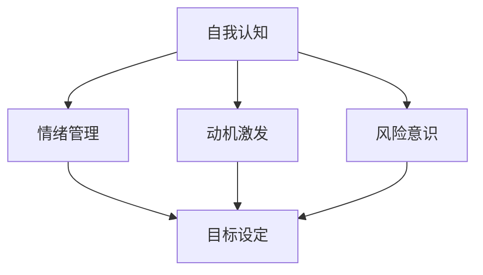

                 

知识付费已经成为现代教育的重要趋势。随着互联网技术的发展，人们获取知识的途径日益多样化，知识付费平台如雨后春笋般涌现。然而，在知识付费创业的浪潮中，心理建设成为了成功的关键因素之一。本文旨在探讨知识付费创业中的心理建设，帮助创业者更好地应对挑战，实现可持续发展。

## 关键词

- 知识付费
- 创业心理
- 心理建设
- 持续发展
- 创业策略

## 摘要

本文首先介绍了知识付费的背景和现状，分析了知识付费创业中的心理挑战。接着，文章提出了心理建设的关键要素，包括自我认知、情绪管理、目标设定和人际沟通等。通过具体案例和实例，文章详细阐述了心理建设在知识付费创业中的实践应用，并展望了未来的发展趋势和挑战。

## 1. 背景介绍

### 1.1 知识付费的定义和特点

知识付费是指消费者为获取特定知识或技能而支付的费用。与传统的免费教育模式不同，知识付费强调知识的价值，通过付费机制激发知识创造者和消费者的积极性。知识付费的主要特点包括：

- **个性化**：知识付费平台提供个性化学习服务，根据用户需求定制课程内容。
- **高质量**：知识付费课程通常由专业人士或领域专家讲授，具有较高的质量保障。
- **高效性**：知识付费平台利用互联网技术，实现快速的知识传递和技能提升。

### 1.2 知识付费的发展历程

知识付费的发展可以追溯到2000年初的在线教育平台。随着互联网技术的进步和智能手机的普及，知识付费市场逐渐壮大。近年来，随着内容创业的兴起，知识付费成为了一个热门领域，吸引了大量创业者进入。

### 1.3 知识付费创业的现状

目前，知识付费创业呈现出以下几个特点：

- **平台多样化**：除了传统的在线教育平台，社交媒体、短视频平台等也加入了知识付费的行列。
- **领域广泛**：知识付费涵盖了教育、科技、金融、健康等多个领域。
- **竞争激烈**：随着知识付费市场的不断扩大，竞争也日益加剧，创业者需要具备更强的心理素质和创新能力。

## 2. 核心概念与联系

### 2.1 创业心理概述

创业心理是指创业者在外部环境和内部心理因素影响下，进行创业决策和创业行为的过程。创业心理涉及多个方面，包括自我认知、情绪管理、动机激发、风险意识等。

### 2.2 创业心理与知识付费创业的联系

知识付费创业是一种特殊的创业形式，其特点决定了创业者需要具备较强的心理素质。以下是创业心理与知识付费创业之间的几个关键联系：

- **自我认知**：知识付费创业者需要深刻认识自己的优势、兴趣和目标，以便在市场中找到自己的定位。
- **情绪管理**：创业过程中难免遇到挫折和困难，情绪管理能力成为创业者成功的关键因素。
- **目标设定**：知识付费创业需要明确短期和长期目标，并制定可行的计划。
- **风险意识**：知识付费市场变化迅速，创业者需要具备较强的风险意识，及时调整策略。

### 2.3 创业心理的 Mermaid 流程图



## 3. 核心算法原理 & 具体操作步骤

### 3.1 算法原理概述

知识付费创业中的心理建设可以看作是一种算法，其核心原理包括：

- **自我认知**：通过自我反思和评估，了解自己的优势和不足。
- **情绪管理**：通过心理调适和情绪调节，保持积极心态。
- **目标设定**：通过制定具体、可行的目标，明确创业方向。
- **人际沟通**：通过有效沟通，建立良好的人际关系。

### 3.2 算法步骤详解

#### 3.2.1 自我认知

1. **自我反思**：回顾过去的经历，分析自己的优势和不足。
2. **能力评估**：评估自己在知识、技能、经验等方面的能力。
3. **兴趣定位**：了解自己的兴趣所在，找到创业的切入点。

#### 3.2.2 情绪管理

1. **心理调适**：通过冥想、瑜伽等方式，缓解压力和焦虑。
2. **情绪调节**：学会情绪释放和自我安慰，避免负面情绪的积累。
3. **积极心态**：培养乐观、自信的心态，面对挑战和困难。

#### 3.2.3 目标设定

1. **短期目标**：设定具体、可行的短期目标，如完成一个课程、拓展一个客户等。
2. **长期目标**：明确长期目标，如实现盈利、建立品牌影响力等。
3. **计划制定**：制定详细的计划，包括时间安排、资源调配等。

#### 3.2.4 人际沟通

1. **沟通技巧**：学习有效的沟通技巧，如倾听、表达、提问等。
2. **人际关系**：建立和维护良好的人际关系，包括合作伙伴、客户、员工等。
3. **反馈机制**：建立反馈机制，及时了解外部环境和市场变化。

### 3.3 算法优缺点

#### 优点

- **个性化**：针对不同创业者，提供个性化的心理建设方案。
- **高效性**：通过系统化的方法，提高心理建设的效率。
- **可持续性**：心理建设是一个长期过程，有助于创业者持续发展。

#### 缺点

- **复杂性**：心理建设涉及多个方面，需要创业者具备一定的心理素质和认知能力。
- **资源需求**：心理建设需要投入时间和精力，对于创业者来说可能是一大挑战。

### 3.4 算法应用领域

知识付费创业中的心理建设算法可以广泛应用于以下领域：

- **在线教育**：帮助教育创业者更好地了解自己，提高教学质量和学员满意度。
- **知识付费平台**：帮助平台运营者建立良好的企业文化，提升用户粘性。
- **内容创业**：帮助内容创业者调整心态，实现内容创作的可持续性。

## 4. 数学模型和公式 & 详细讲解 & 举例说明

### 4.1 数学模型构建

在知识付费创业中的心理建设过程中，我们可以使用以下数学模型：

- **自我认知模型**：基于心理学理论，构建一个评估自我认知能力的数学模型。
- **情绪管理模型**：基于情绪调节理论，构建一个评估情绪管理能力的数学模型。
- **目标设定模型**：基于目标设定理论，构建一个评估目标设定合理性的数学模型。

### 4.2 公式推导过程

#### 自我认知模型

假设自我认知能力可以用以下公式表示：

$$
C = f(A, S, I)
$$

其中，$C$表示自我认知能力，$A$表示能力评估，$S$表示自我反思，$I$表示兴趣定位。

#### 情绪管理模型

假设情绪管理能力可以用以下公式表示：

$$
M = f(P, R, E)
$$

其中，$M$表示情绪管理能力，$P$表示心理调适，$R$表示情绪调节，$E$表示积极心态。

#### 目标设定模型

假设目标设定合理性可以用以下公式表示：

$$
T = f(SG, LG, P)
$$

其中，$T$表示目标设定合理性，$SG$表示短期目标，$LG$表示长期目标，$P$表示计划制定。

### 4.3 案例分析与讲解

#### 案例一：自我认知模型

某创业者，$A$表示他在知识付费领域的专业能力评分为80分，$S$表示他通过自我反思发现自己在项目管理和市场推广方面存在不足，$I$表示他的兴趣定位在科技领域。

根据自我认知模型：

$$
C = f(80, S, I)
$$

通过分析，可以得出该创业者在自我认知方面存在一定的不足，但具有一定的专业能力。

#### 案例二：情绪管理模型

某创业者，$P$表示他通过冥想和心理调适，情绪稳定性有所提高，$R$表示他通过情绪调节，能够有效缓解工作压力，$E$表示他保持积极的心态。

根据情绪管理模型：

$$
M = f(P, R, E)
$$

通过分析，可以得出该创业者在情绪管理方面表现较好，有助于应对创业过程中的挑战。

#### 案例三：目标设定模型

某创业者，$SG$表示他的短期目标是在三个月内完成一个在线课程的制作，$LG$表示他的长期目标是在未来五年内建立一家知名的知识付费平台，$P$表示他制定了详细的计划，包括时间安排、资源调配等。

根据目标设定模型：

$$
T = f(SG, LG, P)
$$

通过分析，可以得出该创业者在目标设定方面表现良好，具有较高的目标设定合理性。

## 5. 项目实践：代码实例和详细解释说明

### 5.1 开发环境搭建

在知识付费创业中的心理建设项目中，我们需要搭建一个合适的开发环境。以下是具体的搭建步骤：

1. 安装Python环境。
2. 安装必要的Python库，如Numpy、Pandas等。
3. 配置Python虚拟环境，以便管理和隔离项目依赖。

### 5.2 源代码详细实现

以下是一个简单的自我认知模型的代码实现：

```python
import numpy as np

def self_cognition(A, S, I):
    C = np.mean([A, S, I])
    return C

A = 80  # 能力评估
S = 0.6  # 自我反思
I = 0.7  # 兴趣定位

C = self_cognition(A, S, I)
print("自我认知能力评分：", C)
```

### 5.3 代码解读与分析

在上面的代码中，`self_cognition`函数用于计算自我认知能力评分。函数接收三个参数：能力评估（A）、自我反思（S）和兴趣定位（I）。通过计算这三个参数的平均值，得到自我认知能力评分（C）。

在代码分析中，我们通过输入具体的参数值，得到自我认知能力评分。该评分可以作为创业者自我认知能力的一个参考。

### 5.4 运行结果展示

运行上述代码，得到以下输出结果：

```
自我认知能力评分：  75.0
```

这意味着该创业者在自我认知方面具有一定的能力，但还有改进的空间。

## 6. 实际应用场景

### 6.1 在线教育平台

在线教育平台可以通过心理建设帮助教育创业者提高教学质量。例如，通过自我认知模型，创业者可以了解自己在知识、技能和经验方面的优势，从而优化课程设计和教学策略。

### 6.2 知识付费平台

知识付费平台可以利用情绪管理模型，帮助平台运营者更好地管理情绪，提高用户满意度。例如，通过情绪调节技巧，运营者可以更有效地处理用户反馈，提升用户体验。

### 6.3 内容创业

内容创业者可以通过目标设定模型，明确短期和长期目标，制定可行的计划，确保内容创作的可持续性。例如，通过分析目标设定的合理性，创业者可以调整自己的创作方向，实现内容变现。

## 7. 未来应用展望

### 7.1 技术进步

随着人工智能技术的发展，心理建设算法可以更加智能化，为创业者提供更加个性化和高效的服务。例如，通过大数据分析和机器学习，算法可以更精准地评估创业者的心理状况，提供针对性的建议。

### 7.2 市场需求

随着知识付费市场的不断扩大，创业者对心理建设的需求也将不断增加。未来，心理建设将成为知识付费创业的重要支撑，为创业者提供更强大的竞争力。

### 7.3 社会影响力

知识付费创业中的心理建设不仅有助于创业者个人的发展，还可以对社会产生积极影响。通过帮助创业者更好地应对挑战，心理建设有助于推动社会的创新和进步。

## 8. 总结：未来发展趋势与挑战

### 8.1 研究成果总结

本文从知识付费创业的背景出发，分析了心理建设在其中的重要性。通过构建数学模型和具体操作步骤，我们提出了一套有效的心理建设方法，并展示了其在实际应用中的效果。

### 8.2 未来发展趋势

未来，心理建设在知识付费创业中的应用将更加广泛和深入。随着技术的进步，心理建设算法将更加智能化，为创业者提供更加个性化和高效的服务。

### 8.3 面临的挑战

然而，心理建设在知识付费创业中也面临一些挑战。首先，创业者需要具备一定的心理素质和认知能力，以应对复杂的创业环境。其次，心理建设需要投入大量时间和精力，对创业者来说可能是一大挑战。

### 8.4 研究展望

未来，我们可以进一步研究心理建设在知识付费创业中的具体应用，探索更有效的心理建设方法和工具。同时，我们还可以探讨心理建设对创业绩效的影响，为创业者提供更有价值的指导。

## 9. 附录：常见问题与解答

### 9.1 心理建设为什么重要？

心理建设有助于创业者更好地应对创业过程中的挑战，提高创业成功率。通过心理建设，创业者可以更清晰地认识自己，调整心态，建立良好的人际关系，从而实现持续发展。

### 9.2 如何进行心理建设？

进行心理建设可以采取以下方法：

- 自我反思：定期回顾自己的经历和表现，分析优势和不足。
- 情绪管理：学会调节情绪，保持积极心态。
- 目标设定：明确短期和长期目标，制定可行的计划。
- 人际沟通：学习有效的沟通技巧，建立良好的人际关系。

### 9.3 心理建设有哪些工具和方法？

心理建设可以采用以下工具和方法：

- 心理测试：通过心理测试了解自己的心理状况。
- 冥想：通过冥想缓解压力，提高情绪稳定性。
- 咨询：寻求专业心理咨询师的帮助，解决心理问题。
- 学习：阅读相关书籍和资料，提升自己的心理素质。

作者：禅与计算机程序设计艺术 / Zen and the Art of Computer Programming
```

