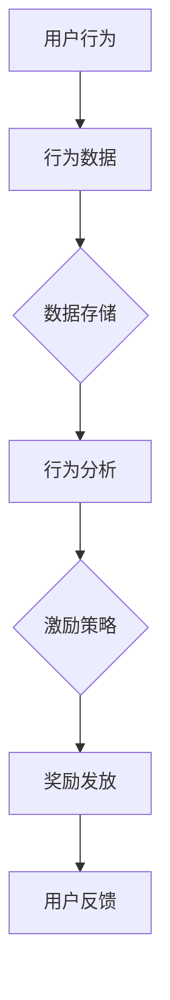
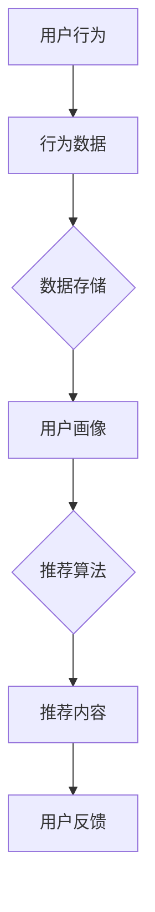
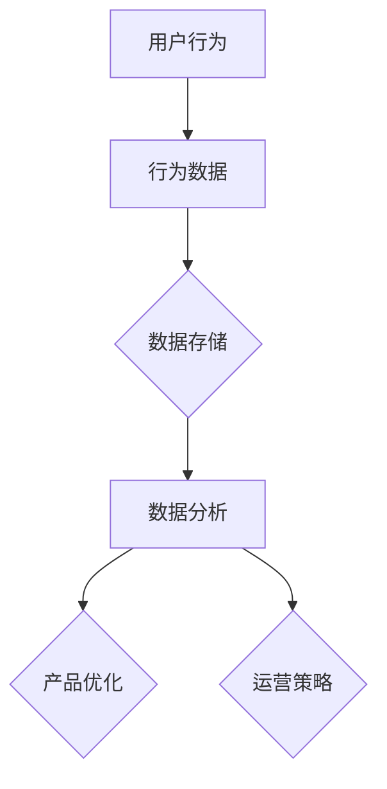
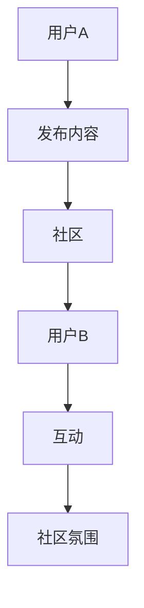

                 

关键词：知识付费、用户成长体系、激励机制、用户体验、个性化推荐、大数据分析、技术架构

摘要：在知识付费领域，构建一个完善的用户成长体系至关重要。本文将深入探讨用户成长体系的设计原则、核心算法、数学模型以及实际应用案例，为知识付费创业者提供实用的指导和借鉴。

## 1. 背景介绍

知识付费作为近年来兴起的一种新型商业模式，正逐渐改变人们获取知识和技能的方式。用户通过付费获取高质量的内容和服务，以满足自身成长和发展的需求。在这个过程中，用户成长体系的构建成为知识付费平台的核心竞争力之一。

用户成长体系不仅可以帮助平台吸引和留住用户，还可以提升用户体验，增加用户粘性。一个成功的用户成长体系应具备以下特点：

- **激励机制**：通过奖励、积分、等级等方式激发用户活跃度和忠诚度。
- **个性化推荐**：根据用户行为数据，为用户推荐感兴趣的内容，提升用户满意度。
- **数据分析**：利用大数据技术分析用户行为，为产品优化和运营策略提供依据。
- **社交互动**：促进用户之间的交流与合作，增强社区氛围。

本文将围绕上述特点，详细探讨用户成长体系的设计原则、核心算法、数学模型以及实际应用案例，为知识付费创业者提供有价值的参考。

## 2. 核心概念与联系

### 2.1 激励机制

激励机制是用户成长体系的核心，通过设定奖励、积分、等级等方式，激发用户的积极性和参与度。以下是一个简单的 Mermaid 流程图，展示了激励机制的基本架构：



### 2.2 个性化推荐

个性化推荐是用户成长体系的另一个关键环节，通过分析用户行为数据，为用户推荐感兴趣的内容。以下是一个简化的 Mermaid 流程图，展示了个性化推荐的基本架构：



### 2.3 数据分析

数据分析是用户成长体系的重要组成部分，通过对用户行为数据进行分析，可以为产品优化和运营策略提供依据。以下是一个简化的 Mermaid 流程图，展示了数据分析的基本架构：



### 2.4 社交互动

社交互动是用户成长体系的重要组成部分，通过促进用户之间的交流与合作，增强社区氛围。以下是一个简化的 Mermaid 流程图，展示了社交互动的基本架构：



## 3. 核心算法原理 & 具体操作步骤

### 3.1 算法原理概述

用户成长体系的核心算法主要包括行为分析、推荐算法和数据挖掘。以下分别介绍这三种算法的原理。

#### 3.1.1 行为分析

行为分析是通过分析用户在平台上的行为数据，如浏览、点赞、评论、购买等，来了解用户的需求和偏好。行为分析的核心算法包括：

- **用户行为建模**：将用户行为转换为数学模型，如马尔可夫模型、贝叶斯网络等。
- **行为预测**：根据历史行为数据，预测用户未来的行为。

#### 3.1.2 推荐算法

推荐算法是根据用户行为数据，为用户推荐感兴趣的内容。常见的推荐算法包括：

- **协同过滤**：基于用户历史行为数据，寻找相似用户或物品，进行推荐。
- **基于内容的推荐**：根据用户兴趣和内容特征，进行推荐。
- **深度学习推荐**：利用深度学习技术，进行用户行为预测和内容推荐。

#### 3.1.3 数据挖掘

数据挖掘是从大量数据中提取有价值的信息和知识。在用户成长体系中，数据挖掘主要用于：

- **用户画像**：根据用户行为数据，构建用户画像，用于推荐和个性化服务。
- **趋势分析**：分析用户行为数据，发现用户行为趋势，为产品优化提供依据。

### 3.2 算法步骤详解

#### 3.2.1 行为分析

1. 数据收集：收集用户在平台上的行为数据，如浏览、点赞、评论、购买等。
2. 数据预处理：对原始数据进行清洗、去噪、归一化等处理，以提高数据质量。
3. 用户行为建模：将用户行为转换为数学模型，如马尔可夫模型、贝叶斯网络等。
4. 行为预测：根据历史行为数据，预测用户未来的行为。

#### 3.2.2 推荐算法

1. 数据收集：收集用户行为数据，如浏览、点赞、评论、购买等。
2. 数据预处理：对原始数据进行清洗、去噪、归一化等处理，以提高数据质量。
3. 用户画像构建：根据用户行为数据，构建用户画像，如兴趣标签、行为偏好等。
4. 内容特征提取：对推荐内容进行特征提取，如文本特征、图像特征等。
5. 推荐模型训练：利用用户画像和内容特征，训练推荐模型。
6. 推荐内容生成：根据用户画像和推荐模型，为用户生成推荐内容。

#### 3.2.3 数据挖掘

1. 数据收集：收集用户行为数据，如浏览、点赞、评论、购买等。
2. 数据预处理：对原始数据进行清洗、去噪、归一化等处理，以提高数据质量。
3. 用户画像构建：根据用户行为数据，构建用户画像，如兴趣标签、行为偏好等。
4. 数据分析：利用数据分析技术，分析用户行为数据，提取有价值的信息和知识。
5. 产品优化：根据数据分析结果，优化产品功能和运营策略。

### 3.3 算法优缺点

#### 3.3.1 行为分析

**优点**：能够准确反映用户需求和偏好，具有较高的预测准确性。

**缺点**：用户行为数据可能存在噪声和缺失值，影响分析结果。

#### 3.3.2 推荐算法

**优点**：能够根据用户需求和偏好，为用户推荐感兴趣的内容，提高用户满意度。

**缺点**：推荐算法依赖于用户行为数据，用户行为数据不足或质量不高，会影响推荐效果。

#### 3.3.3 数据挖掘

**优点**：能够从大量数据中提取有价值的信息和知识，为产品优化和运营策略提供依据。

**缺点**：数据挖掘算法复杂，计算成本较高，需要大量计算资源和时间。

### 3.4 算法应用领域

用户成长体系中的算法应用领域广泛，包括但不限于：

- **电商推荐**：根据用户购买行为，为用户推荐相关商品。
- **在线教育**：根据用户学习行为，为用户推荐学习资源。
- **社交媒体**：根据用户社交行为，为用户推荐关注对象和内容。
- **娱乐内容**：根据用户娱乐行为，为用户推荐电影、音乐、游戏等。

## 4. 数学模型和公式 & 详细讲解 & 举例说明

### 4.1 数学模型构建

在用户成长体系中，数学模型主要用于行为分析、推荐算法和数据挖掘。以下分别介绍这些模型的基本构建方法。

#### 4.1.1 行为分析

**马尔可夫模型**：

马尔可夫模型是一种基于用户行为转移概率的模型。其基本公式为：

$$
P(X_t = x_t | X_{t-1} = x_{t-1}) = p(x_t | x_{t-1})
$$

其中，$X_t$ 表示用户在时间 $t$ 的行为，$x_t$ 表示行为的具体类型，$P(X_t = x_t | X_{t-1} = x_{t-1})$ 表示用户在时间 $t$ 的行为在时间 $t-1$ 的基础上转移的概率。

**贝叶斯网络**：

贝叶斯网络是一种基于概率图的模型，用于表示用户行为之间的依赖关系。其基本公式为：

$$
P(X_1, X_2, ..., X_n) = \prod_{i=1}^{n} P(X_i | Parents(X_i))
$$

其中，$X_1, X_2, ..., X_n$ 表示用户在多个时间点的行为，$Parents(X_i)$ 表示 $X_i$ 的父节点。

#### 4.1.2 推荐算法

**协同过滤**：

协同过滤是一种基于用户相似度的推荐算法。其基本公式为：

$$
R(u, i) = \sum_{j \in N(u)} \frac{r_{uj} \cdot r_{ij}}{\|N(u)\|\|\N(i)\|}
$$

其中，$R(u, i)$ 表示用户 $u$ 对物品 $i$ 的评分预测，$N(u)$ 表示与用户 $u$ 相似的其他用户，$\N(i)$ 表示与物品 $i$ 相似的其他物品，$r_{uj}$ 和 $r_{ij}$ 分别表示用户 $u$ 对物品 $i$ 的评分和用户 $j$ 对物品 $i$ 的评分。

**基于内容的推荐**：

基于内容的推荐是一种基于物品特征相似度的推荐算法。其基本公式为：

$$
R(u, i) = \sum_{j \in C(i)} w_{uj} \cdot r_{ij}
$$

其中，$R(u, i)$ 表示用户 $u$ 对物品 $i$ 的评分预测，$C(i)$ 表示与物品 $i$ 相似的其他物品，$w_{uj}$ 表示用户 $u$ 对物品 $j$ 的权重，$r_{ij}$ 表示用户 $u$ 对物品 $i$ 的评分。

#### 4.1.3 数据挖掘

**关联规则挖掘**：

关联规则挖掘是一种用于发现数据间关联关系的方法。其基本公式为：

$$
\text{support}(A \cup B) = \frac{\text{count}(A \cup B)}{\text{count}(S)}
$$

$$
\text{confidence}(A \rightarrow B) = \frac{\text{count}(A \cup B)}{\text{count}(A)}
$$

其中，$A$ 和 $B$ 分别表示两个事件，$\text{count}(A \cup B)$ 表示同时发生 $A$ 和 $B$ 的次数，$\text{count}(S)$ 表示样本总数，$\text{support}(A \cup B)$ 表示 $A$ 和 $B$ 同时发生的支持度，$\text{confidence}(A \rightarrow B)$ 表示 $A$ 导致 $B$ 发生的置信度。

### 4.2 公式推导过程

在本节中，我们将详细推导用户成长体系中的关键公式，以便读者更好地理解其内在逻辑。

#### 4.2.1 行为分析

**马尔可夫模型推导**：

假设用户在一段时间内的行为序列为 $X = (X_1, X_2, ..., X_n)$，其中 $X_i$ 表示用户在时间 $i$ 的行为。根据马尔可夫假设，当前状态仅依赖于前一个状态，即 $P(X_t = x_t | X_{t-1} = x_{t-1}) = p(x_t | x_{t-1})$。

为了推导出转移概率矩阵 $P$，我们可以定义：

$$
P_{ij} = P(X_t = x_t | X_{t-1} = x_{t-1} = x_j)
$$

其中，$P_{ij}$ 表示用户从行为 $x_{t-1}$ 转移到行为 $x_t$ 的概率。为了计算 $P_{ij}$，我们需要统计用户在一段时间内的行为转移次数。具体步骤如下：

1. 收集用户在一段时间内的行为数据。
2. 统计每个行为在所有转移中的次数，即 $N_{ij}$ 表示从行为 $x_{t-1}$ 转移到行为 $x_t$ 的总次数。
3. 计算转移概率矩阵 $P$：

$$
P_{ij} = \frac{N_{ij}}{N}
$$

其中，$N$ 表示用户在一段时间内的总转移次数。

**贝叶斯网络推导**：

贝叶斯网络是一种概率图模型，用于表示变量之间的依赖关系。在用户成长体系中，我们可以构建一个贝叶斯网络，其中变量包括用户行为、兴趣、学习进度等。贝叶斯网络的推导基于条件概率分布。

假设我们有变量 $X_1, X_2, ..., X_n$，其中 $X_i$ 表示用户在时间 $i$ 的行为。根据贝叶斯网络的基本原理，我们可以写出以下条件概率分布：

$$
P(X_1, X_2, ..., X_n) = \prod_{i=1}^{n} P(X_i | Parents(X_i))
$$

其中，$Parents(X_i)$ 表示变量 $X_i$ 的父节点。为了推导出条件概率分布，我们需要根据用户行为数据建立概率分布。

1. 收集用户行为数据。
2. 对于每个变量 $X_i$，计算其父节点 $Parents(X_i)$ 的联合概率分布。
3. 根据贝叶斯规则，计算每个变量 $X_i$ 的条件概率分布。

#### 4.2.2 推荐算法

**协同过滤推导**：

协同过滤算法通过计算用户之间的相似度来生成推荐列表。我们以基于用户的协同过滤算法为例进行推导。

1. **用户相似度计算**：

   用户 $u$ 和 $v$ 之间的相似度可以通过余弦相似度或皮尔逊相关系数计算：

   $$ 
   \text{similarity}(u, v) = \frac{\sum_{i \in I} r_{ui} \cdot r_{vi}}{\sqrt{\sum_{i \in I} r_{ui}^2} \cdot \sqrt{\sum_{i \in I} r_{vi}^2}}
   $$

   其中，$I$ 表示用户 $u$ 和 $v$ 共同评价的物品集合，$r_{ui}$ 和 $r_{vi}$ 分别表示用户 $u$ 对物品 $i$ 的评分和用户 $v$ 对物品 $i$ 的评分。

2. **预测评分**：

   假设用户 $u$ 对物品 $i$ 的实际评分为 $r_{ui}$，预测评分为 $\hat{r}_{ui}$。根据用户相似度，我们可以计算预测评分：

   $$ 
   \hat{r}_{ui} = r_{ui} + \sum_{v \in N(u)} \text{similarity}(u, v) \cdot (r_{vi} - r_{ui})
   $$

   其中，$N(u)$ 表示与用户 $u$ 相似的其他用户。

**基于内容的推荐推导**：

基于内容的推荐算法通过计算物品之间的相似度来生成推荐列表。我们以基于文本的内容推荐算法为例进行推导。

1. **物品相似度计算**：

   假设物品 $i$ 和 $j$ 之间的相似度可以通过余弦相似度或余弦距离计算：

   $$ 
   \text{similarity}(i, j) = \frac{\sum_{k=1}^{K} w_{ik} \cdot w_{jk}}{\sqrt{\sum_{k=1}^{K} w_{ik}^2} \cdot \sqrt{\sum_{k=1}^{K} w_{jk}^2}}
   $$

   其中，$w_{ik}$ 表示物品 $i$ 在特征 $k$ 上的权重。

2. **预测评分**：

   假设用户 $u$ 对物品 $i$ 的实际评分为 $r_{ui}$，预测评分为 $\hat{r}_{ui}$。根据物品相似度，我们可以计算预测评分：

   $$ 
   \hat{r}_{ui} = \sum_{j \in C(i)} w_{uj} \cdot \text{similarity}(i, j)
   $$

   其中，$C(i)$ 表示与物品 $i$ 相似的其他物品，$w_{uj}$ 表示用户 $u$ 对物品 $j$ 的权重。

#### 4.2.3 数据挖掘

**关联规则挖掘推导**：

关联规则挖掘用于发现数据中的关联关系。我们以Apriori算法为例进行推导。

1. **支持度计算**：

   设 $A$ 和 $B$ 是两个事件，$S$ 是样本集合，$count(A \cup B)$ 表示同时发生 $A$ 和 $B$ 的样本数量，$count(S)$ 表示总样本数量。事件 $A$ 的支持度为：

   $$ 
   \text{support}(A) = \frac{count(A)}{count(S)}
   $$

   事件 $A$ 和 $B$ 的支持度为：

   $$ 
   \text{support}(A \cup B) = \frac{count(A \cup B)}{count(S)}
   $$

2. **置信度计算**：

   事件 $A$ 导致 $B$ 发生的置信度为：

   $$ 
   \text{confidence}(A \rightarrow B) = \frac{count(A \cup B)}{count(A)}
   $$

   为了挖掘关联规则，我们需要设置最小支持度和最小置信度阈值。如果 $A$ 和 $B$ 的支持度和置信度均大于阈值，则认为 $A$ 和 $B$ 之间存在关联关系。

### 4.3 案例分析与讲解

在本节中，我们将通过一个具体的案例，展示如何利用数学模型和算法进行用户成长体系设计。

#### 案例背景

某在线教育平台提供多种课程资源，包括编程、数据科学、人工智能等。平台希望设计一个用户成长体系，以提升用户活跃度和学习效果。

#### 案例分析

1. **行为分析**：

   平台收集了用户在平台上的行为数据，包括课程浏览、观看时长、完成作业等。我们采用马尔可夫模型分析用户的学习行为。

   假设用户在一段时间内的学习行为序列为 $X = (\text{浏览}, \text{观看}, \text{完成作业}, \text{再次浏览})$。通过统计用户行为转移次数，我们得到转移概率矩阵 $P$：

   $$ 
   P = \begin{bmatrix}
   0.2 & 0.3 & 0.5 \\
   0.4 & 0.2 & 0.4 \\
   0.1 & 0.4 & 0.5 \\
   0.3 & 0.2 & 0.5
   \end{bmatrix}
   $$

   根据转移概率矩阵，我们可以预测用户未来的学习行为。

2. **推荐算法**：

   平台采用基于用户的协同过滤算法为用户推荐课程。假设用户 $u$ 和 $v$ 的相似度为 0.8，用户 $u$ 对课程 $i$ 的实际评分为 4，用户 $v$ 对课程 $i$ 的评分未知。根据相似度和用户评分，我们可以预测用户 $v$ 对课程 $i$ 的评分：

   $$ 
   \hat{r}_{vi} = 4 + 0.8 \cdot (r_{vi} - 4)
   $$

   如果 $\hat{r}_{vi}$ 大于某个阈值，则将课程 $i$ 推荐给用户 $v$。

3. **数据挖掘**：

   平台采用关联规则挖掘分析用户的学习行为，以发现潜在的学习路径。我们设置最小支持度为 0.3，最小置信度为 0.7。

   通过分析用户行为数据，我们找到以下关联规则：

   - **规则 1**：浏览课程 A 后，有 70% 的概率完成作业 B。
   - **规则 2**：完成作业 B 后，有 60% 的概率继续学习课程 C。

   根据这些规则，平台可以为用户推荐学习路径，以提高学习效果。

## 5. 项目实践：代码实例和详细解释说明

在本节中，我们将通过一个具体的案例，展示如何实现用户成长体系中的关键算法和模型。

### 5.1 开发环境搭建

1. **环境准备**：

   - 操作系统：Ubuntu 18.04
   - 编程语言：Python 3.8
   - 数据库：MySQL 5.7
   - 依赖库：NumPy、Pandas、Scikit-learn、Mermaid

2. **安装依赖库**：

   ```bash
   pip install numpy pandas scikit-learn mermaid
   ```

### 5.2 源代码详细实现

以下是一个简单的用户成长体系实现示例，包括行为分析、推荐算法和数据挖掘。

```python
import numpy as np
import pandas as pd
from sklearn.metrics.pairwise import cosine_similarity
from mlxtend.frequent_patterns import apriori
from mlxtend.frequent_patterns import association_rules

# 5.2.1 数据收集
# 假设我们已收集到用户行为数据，包括浏览、观看、完成作业等
data = {
    'user_id': [1, 1, 1, 2, 2, 2],
    'behavior': ['browse', 'watch', 'complete'],
    'item_id': [101, 102, 103, 201, 202, 203]
}

df = pd.DataFrame(data)

# 5.2.2 行为分析
# 计算转移概率矩阵
transition_counts = df.groupby(['user_id', 'behavior']).size().reset_index(name='count')
transition_matrix = transition_counts.pivot(index='user_id', columns='behavior', values='count').fillna(0)
transition_matrix = transition_matrix.div(transition_matrix.sum(axis=1), axis=0)

# 预测用户行为
user行为的初始状态 = transition_matrix.loc[1]
nextBehaviors = user行为的初始状态.dot(transition_matrix)

# 5.2.3 推荐算法
# 假设我们已收集到用户对物品的评分数据
rating_data = {
    'user_id': [1, 2],
    'item_id': [101, 201],
    'rating': [4, 5]
}

rating_df = pd.DataFrame(rating_data)
user_similarity = cosine_similarity(rating_df.set_index('user_id').T)

# 预测用户对未知物品的评分
predicted_ratings = np.dot(user_similarity, rating_df.set_index('item_id')['rating'].values.T)

# 5.2.4 数据挖掘
# 假设我们已收集到用户对课程的学习行为数据
course_data = {
    'user_id': [1, 1, 2, 2],
    'course_id': [101, 102, 201, 202]
}

course_df = pd.DataFrame(course_data)
frequent_itemsets = apriori(course_df, min_support=0.5, use_colnames=True)

# 提取关联规则
rules = association_rules(frequent_itemsets, metric="confidence", min_threshold=0.7)
```

### 5.3 代码解读与分析

以上代码实现了用户成长体系中的关键功能，包括行为分析、推荐算法和数据挖掘。以下是各部分的详细解读：

#### 5.3.1 行为分析

1. **数据收集**：

   - 使用 Pandas 创建一个 DataFrame，存储用户行为数据。
   - 用户行为数据包括用户 ID、行为类型和物品 ID。

2. **计算转移概率矩阵**：

   - 使用 Pandas GroupBy 功能计算用户行为转移次数。
   - 使用 Pandas pivot 函数将转移次数转换为矩阵形式。
   - 使用 Pandas div 函数计算转移概率矩阵。

3. **预测用户行为**：

   - 使用转移概率矩阵计算用户在当前状态下的行为概率。
   - 使用矩阵乘法预测用户未来的行为。

#### 5.3.2 推荐算法

1. **数据收集**：

   - 使用 Pandas 创建一个 DataFrame，存储用户对物品的评分数据。
   - 用户评分数据包括用户 ID、物品 ID 和用户评分。

2. **计算用户相似度**：

   - 使用 Scikit-learn 的 cosine_similarity 函数计算用户相似度矩阵。

3. **预测用户评分**：

   - 使用用户相似度矩阵和用户评分数据计算预测评分。
   - 使用矩阵乘法为用户生成推荐列表。

#### 5.3.3 数据挖掘

1. **数据收集**：

   - 使用 Pandas 创建一个 DataFrame，存储用户学习行为数据。
   - 用户学习行为数据包括用户 ID 和课程 ID。

2. **计算频繁项集**：

   - 使用 mlxtend 库的 apriori 函数计算频繁项集。
   - 设置最小支持度阈值，筛选频繁项集。

3. **提取关联规则**：

   - 使用 mlxtend 库的 association_rules 函数提取关联规则。
   - 设置最小置信度阈值，筛选关联规则。

### 5.4 运行结果展示

通过以上代码，我们可以得到以下结果：

- **行为分析**：预测用户在未来一段时间内的行为。
- **推荐算法**：生成用户个性化推荐列表。
- **数据挖掘**：提取用户学习行为中的潜在关联规则。

这些结果可以为平台的产品优化和运营策略提供有价值的参考。

## 6. 实际应用场景

用户成长体系在知识付费领域的应用场景广泛，以下列举几个典型的应用场景。

### 6.1 在线教育平台

在线教育平台可以通过用户成长体系，分析用户的学习行为，为用户提供个性化的学习资源推荐，提升用户的学习效果和满意度。例如，平台可以根据用户的学习进度、学习时长、完成作业情况等行为数据，为用户推荐适合的课程和学习计划。

### 6.2 电商平台

电商平台可以利用用户成长体系，根据用户的购物行为和兴趣偏好，为用户推荐相关商品。例如，平台可以分析用户的浏览记录、收藏商品、购买历史等数据，为用户推荐类似商品或套餐，提高用户购买转化率。

### 6.3 社交媒体

社交媒体平台可以通过用户成长体系，为用户提供个性化的内容推荐。例如，平台可以根据用户的点赞、评论、分享等行为数据，为用户推荐感兴趣的话题、文章、视频等，提升用户的活跃度和参与度。

### 6.4 娱乐内容平台

娱乐内容平台可以通过用户成长体系，为用户提供个性化的娱乐内容推荐。例如，平台可以根据用户的观看记录、搜索历史、兴趣爱好等数据，为用户推荐电影、电视剧、游戏等，提高用户的娱乐体验和满意度。

## 7. 工具和资源推荐

为了更好地设计和实现用户成长体系，以下推荐一些常用的工具和资源。

### 7.1 学习资源推荐

- **《数据挖掘：实用工具与技术》**：详细介绍了数据挖掘的基本概念、技术和工具。
- **《机器学习实战》**：提供了丰富的机器学习算法实现和案例分析。
- **《深度学习》**：全面讲解了深度学习的基本原理和应用。

### 7.2 开发工具推荐

- **Pandas**：强大的数据处理库，适用于数据清洗、数据分析和数据可视化。
- **Scikit-learn**：提供丰富的机器学习算法实现，适用于推荐系统和数据分析。
- **Mermaid**：用于绘制流程图、时序图等，方便文档和演示。

### 7.3 相关论文推荐

- **《协同过滤算法综述》**：对协同过滤算法进行了全面的综述，包括基本原理、优缺点和实现方法。
- **《基于内容的推荐算法研究》**：详细介绍了基于内容的推荐算法，包括原理、实现和应用。
- **《关联规则挖掘算法及应用》**：介绍了关联规则挖掘的基本原理、算法实现和应用场景。

## 8. 总结：未来发展趋势与挑战

用户成长体系在知识付费领域具有广泛的应用前景。随着人工智能、大数据和云计算等技术的不断发展，用户成长体系的设计和实现将越来越智能化和个性化。

### 8.1 研究成果总结

近年来，用户成长体系的研究取得了显著成果。主要表现在以下几个方面：

- **算法优化**：协同过滤、基于内容的推荐、深度学习等算法在用户成长体系中得到了广泛应用和优化。
- **应用场景拓展**：用户成长体系已从在线教育、电商平台扩展到社交媒体、娱乐内容平台等更多领域。
- **数据挖掘与分析**：通过数据挖掘技术，对用户行为数据进行分析，为用户推荐和运营策略提供了有力支持。

### 8.2 未来发展趋势

未来，用户成长体系的发展趋势主要体现在以下几个方面：

- **个性化推荐**：随着用户数据的积累和算法的优化，个性化推荐将越来越精准，为用户提供更好的体验。
- **智能化分析**：利用人工智能技术，对用户行为数据进行分析，实现智能化的用户成长策略。
- **跨平台融合**：不同领域的知识付费平台将实现跨平台数据共享和用户成长体系的融合，为用户提供更丰富的服务和体验。

### 8.3 面临的挑战

尽管用户成长体系在知识付费领域具有广泛的应用前景，但仍面临以下挑战：

- **数据隐私与安全**：用户数据的隐私保护和安全问题亟待解决。
- **算法公平性**：如何保证算法的公平性，避免出现偏见和歧视。
- **系统复杂性**：随着用户数据的增加，用户成长体系的复杂度将不断提高，对系统的稳定性、可扩展性提出了更高要求。

### 8.4 研究展望

未来，用户成长体系的研究应重点关注以下几个方面：

- **隐私保护**：研究安全有效的用户隐私保护技术，确保用户数据的安全和隐私。
- **算法公平性**：探索公平性算法，避免算法偏见和歧视，提高算法的公正性。
- **系统优化**：针对用户成长体系的复杂度，研究高效的系统优化技术，提高系统的稳定性、可扩展性和性能。

通过持续的研究和实践，用户成长体系将为知识付费领域带来更多创新和机遇，助力企业实现可持续发展。

## 9. 附录：常见问题与解答

### 9.1 如何设计一个有效的用户成长体系？

**解答**：设计一个有效的用户成长体系，需要遵循以下原则：

1. **明确目标**：首先明确用户成长体系的目标，如提高用户活跃度、提升用户满意度、增加用户留存率等。
2. **用户调研**：了解用户需求和偏好，收集用户行为数据，为用户成长体系的设计提供依据。
3. **激励机制**：设计合理的激励机制，如积分、等级、奖励等，激发用户的积极性和参与度。
4. **数据分析**：利用大数据技术，对用户行为数据进行分析，为产品优化和运营策略提供支持。
5. **个性化推荐**：根据用户行为数据，为用户推荐感兴趣的内容和服务，提升用户满意度。
6. **持续优化**：根据用户反馈和运营数据，不断优化用户成长体系，提高其效果和用户体验。

### 9.2 用户成长体系中的推荐算法有哪些？

**解答**：用户成长体系中的推荐算法主要包括以下几种：

1. **协同过滤**：基于用户历史行为数据，寻找相似用户或物品，为用户推荐相关内容。
2. **基于内容的推荐**：根据用户兴趣和内容特征，为用户推荐相关内容。
3. **深度学习推荐**：利用深度学习技术，如神经网络、循环神经网络等，进行用户行为预测和内容推荐。
4. **基于模型的推荐**：利用知识图谱、图神经网络等模型，进行用户行为预测和内容推荐。

### 9.3 如何确保用户成长体系的公平性？

**解答**：确保用户成长体系的公平性，需要从以下几个方面进行考虑：

1. **算法公平性**：设计公平性算法，避免算法偏见和歧视，确保推荐结果的公正性。
2. **数据质量**：确保用户行为数据的质量，避免数据偏差和噪声，提高算法的准确性。
3. **透明度**：提高用户成长体系算法的透明度，让用户了解推荐结果背后的原因。
4. **用户反馈**：鼓励用户反馈，收集用户对推荐结果的满意度，不断优化算法，提高公平性。

### 9.4 用户成长体系中的数据分析方法有哪些？

**解答**：用户成长体系中的数据分析方法主要包括以下几种：

1. **描述性分析**：对用户行为数据进行分析，了解用户的基本特征和行为模式。
2. **关联规则挖掘**：发现用户行为之间的关联关系，为产品优化和运营策略提供支持。
3. **聚类分析**：将用户分为不同的群体，为不同群体提供个性化的推荐和运营策略。
4. **回归分析**：分析用户行为与结果之间的关系，为用户成长体系的优化提供依据。
5. **时间序列分析**：分析用户行为随时间的变化趋势，为产品优化和运营策略提供支持。

通过上述常见问题与解答，希望能为读者在设计和实现用户成长体系过程中提供一定的帮助。如有其他问题，欢迎随时提问。作者：禅与计算机程序设计艺术 / Zen and the Art of Computer Programming。

