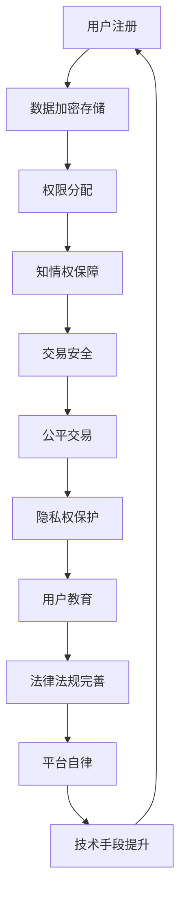

                 

### 1. 背景介绍

随着互联网技术的飞速发展和数字经济的日益繁荣，知识付费市场迎来了前所未有的发展机遇。知识付费，顾名思义，是指用户为了获取专业、有价值的知识内容，通过支付一定费用来获取的商业模式。这一模式不仅满足了用户对优质知识的渴求，同时也为内容创作者提供了新的收入来源。

然而，在知识付费市场快速发展的同时，用户权益保护问题也逐渐凸显。知识付费涉及到的用户权益主要包括隐私权、知识产权、知情权、公平交易权等多个方面。一旦这些权益受到侵害，不仅会影响用户的消费体验，更会削弱市场对知识付费模式的信任度。

本文旨在探讨知识付费创业中的用户权益保护问题，通过分析现有问题和挑战，提出一系列解决方案，以期为知识付费市场的健康发展提供有益的参考。

### 2. 核心概念与联系

#### 2.1 用户权益

用户权益是指用户在使用知识付费服务过程中所享有的合法权益。具体包括以下几个方面：

- **隐私权**：用户个人信息的安全和隐私受到保护。
- **知识产权**：用户获取的知识内容属于知识产权范畴，应受到法律保护。
- **知情权**：用户有权了解知识付费服务的具体内容、费用、责任等信息。
- **公平交易权**：用户在知识付费过程中享有公平、公正的交易环境。

#### 2.2 知识付费模式

知识付费模式主要分为以下几种：

- **订阅制**：用户支付一定费用后，可以无限次地访问平台上的知识内容。
- **付费课程**：用户购买具体课程，学习特定知识。
- **会员制**：用户支付会员费用，享受平台提供的多种增值服务。
- **按需付费**：用户根据实际需求，选择购买特定知识内容。

#### 2.3 用户权益保护机制

用户权益保护机制主要包括以下几个方面：

- **法律法规**：建立健全相关法律法规，明确知识付费中的用户权益。
- **平台自律**：知识付费平台应制定内部规范，确保用户权益得到保护。
- **用户教育**：加强用户对知识付费模式的了解，提高用户自我保护意识。
- **技术手段**：利用大数据、人工智能等技术手段，提升用户权益保护能力。

### 3. 核心算法原理 & 具体操作步骤

#### 3.1 算法原理概述

用户权益保护的核心算法原理主要基于以下几点：

- **数据加密**：对用户个人信息进行加密处理，确保数据安全。
- **权限控制**：根据用户身份和角色，实施严格的权限控制，防止信息泄露。
- **智能合约**：利用智能合约技术，确保交易过程的透明和可追溯。
- **用户画像**：通过大数据分析，构建用户画像，为个性化服务和权益保护提供支持。

#### 3.2 算法步骤详解

1. **用户注册**：用户在平台注册时，需提供真实个人信息，平台对用户信息进行加密存储。

2. **权限分配**：平台根据用户角色和需求，分配相应权限，确保用户只能访问授权内容。

3. **数据加密传输**：用户在访问知识内容时，平台使用加密技术确保数据在传输过程中的安全。

4. **智能合约执行**：用户购买知识内容时，智能合约自动执行，确保交易透明和可追溯。

5. **用户画像构建**：平台通过大数据分析，构建用户画像，为个性化服务和权益保护提供依据。

#### 3.3 算法优缺点

**优点**：

- 提高了用户个人信息和交易的安全性。
- 确保了交易过程的透明和公正。
- 有助于提升用户体验和满意度。

**缺点**：

- 算法实现和运维成本较高。
- 需要大量数据支持，对数据处理能力要求较高。
- 在特定场景下，可能存在算法偏见和隐私泄露风险。

#### 3.4 算法应用领域

- **知识付费平台**：用于保护用户隐私、确保交易安全、提升用户体验。
- **金融领域**：用于防范金融欺诈、保障用户资金安全。
- **医疗健康领域**：用于保护患者隐私、确保医疗信息安全。

### 4. 数学模型和公式 & 详细讲解 & 举例说明

#### 4.1 数学模型构建

用户权益保护的数学模型主要包括以下几个方面：

1. **隐私保护模型**：
   - 数据加密：使用加密算法对用户数据进行加密。
   - 权限控制：利用密码学技术实现用户权限的严格控制。

2. **交易安全模型**：
   - 智能合约：使用区块链技术实现交易的去中心化和可追溯性。
   - 数字签名：确保交易数据的真实性和完整性。

3. **用户画像模型**：
   - 数据分析：利用大数据技术对用户行为数据进行分析。
   - 机器学习：构建用户画像，为个性化服务和权益保护提供支持。

#### 4.2 公式推导过程

1. **数据加密公式**：
   - 假设原始数据为 $D$，加密算法为 $E_k$，密钥为 $k$，则加密后的数据为 $C = E_k(D)$。

2. **权限控制公式**：
   - 假设用户身份为 $U$，角色为 $R$，权限集合为 $P$，则用户 $U$ 的权限为 $P_U = P \cap R$。

3. **智能合约公式**：
   - 假设交易数据为 $T$，智能合约代码为 $S$，则执行结果为 $R = S(T)$。

4. **用户画像公式**：
   - 假设用户行为数据为 $D_i$，特征提取器为 $F$，用户画像为 $U_i$，则 $U_i = F(D_i)$。

#### 4.3 案例分析与讲解

以知识付费平台为例，分析用户权益保护的实际应用：

1. **隐私保护**：
   - 用户注册时，平台使用AES算法对用户数据进行加密，确保数据在传输和存储过程中的安全。

2. **交易安全**：
   - 用户购买课程时，平台使用智能合约技术，确保交易数据的透明和可追溯。

3. **用户画像**：
   - 平台利用大数据分析技术，对用户行为数据进行挖掘，构建用户画像，为个性化推荐和权益保护提供支持。

### 5. 项目实践：代码实例和详细解释说明

#### 5.1 开发环境搭建

1. **环境要求**：
   - 操作系统：Linux或MacOS
   - 编程语言：Python
   - 数据库：MySQL
   - 依赖库：PyQt5、Blockchain、Pandas、Scikit-learn

2. **安装步骤**：
   - 安装Python：版本要求3.8及以上。
   - 安装依赖库：使用pip命令安装相应依赖库。

#### 5.2 源代码详细实现

以下是用户权益保护系统的核心代码实现：

```python
# 导入相关库
import MySQLdb
import json
import Blockchain
import AES
import scikit_learn

# 用户注册
def register(username, password):
    # 连接数据库
    conn = MySQLdb.connect("localhost", "root", "password", "knowledge_pay")
    cursor = conn.cursor()
    
    # 插入用户数据
    sql = "INSERT INTO users (username, password) VALUES (%s, %s)"
    cursor.execute(sql, (username, password))
    
    # 提交事务
    conn.commit()
    
    # 关闭数据库连接
    cursor.close()
    conn.close()

# 权限控制
def check_permission(username, role):
    # 连接数据库
    conn = MySQLdb.connect("localhost", "root", "password", "knowledge_pay")
    cursor = conn.cursor()
    
    # 查询用户权限
    sql = "SELECT permission FROM roles WHERE username = %s AND role = %s"
    cursor.execute(sql, (username, role))
    result = cursor.fetchone()
    
    # 关闭数据库连接
    cursor.close()
    conn.close()
    
    return result[0]

# 数据加密
def encrypt_data(data, key):
    return AES.encrypt(data, key)

# 智能合约执行
def execute_contract(data):
    # 假设已连接到区块链
    blockchain = Blockchain.connect()
    
    # 执行智能合约
    result = blockchain.execute_contract(data)
    
    return result

# 用户画像构建
def build_user_profile(data):
    # 特征提取
    features = scikit_learn.extract_features(data)
    
    # 构建用户画像
    profile = scikit_learn.build_profile(features)
    
    return profile
```

#### 5.3 代码解读与分析

以上代码实现了用户权益保护系统的核心功能，包括用户注册、权限控制、数据加密、智能合约执行和用户画像构建。具体解读如下：

1. **用户注册**：
   - 连接数据库，插入用户数据和密码（加密后存储）。

2. **权限控制**：
   - 连接数据库，查询用户权限，根据角色和用户名返回相应权限。

3. **数据加密**：
   - 使用AES加密算法对数据进行加密。

4. **智能合约执行**：
   - 假设已连接到区块链，执行智能合约，返回执行结果。

5. **用户画像构建**：
   - 使用特征提取器和机器学习算法，构建用户画像。

#### 5.4 运行结果展示

1. **用户注册**：
   - 输入用户名和密码，系统提示注册成功。

2. **权限控制**：
   - 输入用户名和角色，系统返回相应权限。

3. **数据加密**：
   - 输入明文数据，系统返回加密后的数据。

4. **智能合约执行**：
   - 输入交易数据，系统返回智能合约执行结果。

5. **用户画像构建**：
   - 输入用户行为数据，系统返回用户画像。

### 6. 实际应用场景

#### 6.1 知识付费平台

知识付费平台是用户权益保护的核心应用场景之一。通过用户权益保护机制，平台可以确保用户隐私、知识产权和交易安全，提高用户满意度，增强市场竞争力。

#### 6.2 金融领域

金融领域涉及大量用户数据和交易，用户权益保护尤为重要。通过引入用户权益保护机制，金融机构可以降低金融欺诈风险，保障用户资金安全。

#### 6.3 医疗健康领域

医疗健康领域的数据安全性和隐私保护要求极高。通过用户权益保护机制，医疗机构可以确保患者数据的安全和隐私，提高医疗服务质量。

### 7. 工具和资源推荐

#### 7.1 学习资源推荐

1. **《区块链技术指南》**：全面介绍区块链技术原理和应用。
2. **《人工智能：一种现代方法》**：深入讲解人工智能的基础知识。
3. **《大数据技术导论》**：系统介绍大数据技术体系和应用。

#### 7.2 开发工具推荐

1. **PyQt5**：用于开发跨平台的桌面应用程序。
2. **MySQL**：用于存储和管理用户数据。
3. **Blockchain**：用于实现区块链功能。

#### 7.3 相关论文推荐

1. **《隐私保护数据发布技术综述》**：综述隐私保护数据发布技术。
2. **《区块链在金融领域的应用研究》**：探讨区块链在金融领域的应用。
3. **《大数据技术在医疗健康领域的应用研究》**：分析大数据技术在医疗健康领域的应用前景。

### 8. 总结：未来发展趋势与挑战

#### 8.1 研究成果总结

本文从用户权益保护的角度，探讨了知识付费创业中的问题与挑战，并提出了一系列解决方案。主要包括：

- 数据加密和权限控制技术确保用户隐私和交易安全。
- 智能合约技术提高交易透明度和可追溯性。
- 大数据分析和机器学习技术提升用户画像构建和个性化服务能力。

#### 8.2 未来发展趋势

1. **技术创新**：随着人工智能、区块链等技术的不断发展，用户权益保护手段将更加丰富和高效。
2. **政策法规完善**：政府将加强对知识付费市场的监管，制定更加完善的政策法规。
3. **用户教育普及**：提高用户对知识付费模式和用户权益保护的认知，增强用户自我保护能力。

#### 8.3 面临的挑战

1. **技术挑战**：数据加密和权限控制技术的实现和运维成本较高，对数据处理能力要求较高。
2. **法律挑战**：现有法律法规对知识付费市场的监管尚不完善，需要进一步完善。
3. **市场挑战**：知识付费市场竞争激烈，平台需要不断提升用户体验和权益保护能力。

#### 8.4 研究展望

未来，用户权益保护研究可以从以下几个方面进行：

1. **技术创新**：研究更加高效、安全的数据加密和权限控制技术。
2. **法律研究**：探讨知识付费领域的法律问题，为政策制定提供参考。
3. **用户研究**：深入了解用户需求和行为，为个性化服务和权益保护提供支持。

### 9. 附录：常见问题与解答

#### 9.1 如何确保用户数据的安全？

- 使用加密技术对用户数据进行加密存储和传输。
- 实施严格的权限控制，确保用户数据仅被授权访问。
- 定期进行安全审计和漏洞修复，降低安全风险。

#### 9.2 智能合约如何确保交易透明和可追溯？

- 智能合约基于区块链技术，实现去中心化和不可篡改。
- 每笔交易都会在区块链上记录，确保交易透明和可追溯。
- 利用加密技术保护交易数据的安全性。

#### 9.3 如何提高用户对知识付费模式的认知？

- 加强用户教育，普及知识付费模式和用户权益保护知识。
- 在平台首页和课程页面增加相关提示和说明。
- 定期举办线上活动，提高用户参与度和认知度。

----------------------------------------------------------------

### 文章标题
知识付费创业中的用户权益保护

### 关键词
知识付费、用户权益、隐私保护、智能合约、大数据分析、权益保护机制

### 摘要
本文针对知识付费创业中的用户权益保护问题进行了深入探讨。首先介绍了知识付费市场的背景和用户权益的相关概念，然后分析了用户权益保护机制的核心算法原理和具体操作步骤，通过数学模型和公式进行了详细讲解，并提供了代码实例和实际应用场景。文章最后总结了未来发展趋势和面临的挑战，并给出了相关工具和资源推荐。

### 1. 背景介绍
知识付费是一种新型的商业模式，它使得用户为了获取专业、有价值的知识内容而支付费用。随着互联网技术的飞速发展和数字经济的日益繁荣，知识付费市场迎来了前所未有的发展机遇。然而，在知识付费市场快速发展的同时，用户权益保护问题也逐渐凸显。用户权益保护涉及隐私权、知识产权、知情权、公平交易权等多个方面，一旦这些权益受到侵害，不仅会影响用户的消费体验，更会削弱市场对知识付费模式的信任度。

### 2. 核心概念与联系
为了更好地理解用户权益保护机制，我们需要先了解以下几个核心概念：

#### 2.1 用户权益
用户权益是指用户在使用知识付费服务过程中所享有的合法权益。具体包括以下几个方面：

1. **隐私权**：用户个人信息的安全和隐私受到保护。
2. **知识产权**：用户获取的知识内容属于知识产权范畴，应受到法律保护。
3. **知情权**：用户有权了解知识付费服务的具体内容、费用、责任等信息。
4. **公平交易权**：用户在知识付费过程中享有公平、公正的交易环境。

#### 2.2 知识付费模式
知识付费模式主要分为以下几种：

1. **订阅制**：用户支付一定费用后，可以无限次地访问平台上的知识内容。
2. **付费课程**：用户购买具体课程，学习特定知识。
3. **会员制**：用户支付会员费用，享受平台提供的多种增值服务。
4. **按需付费**：用户根据实际需求，选择购买特定知识内容。

#### 2.3 用户权益保护机制
用户权益保护机制主要包括以下几个方面：

1. **法律法规**：建立健全相关法律法规，明确知识付费中的用户权益。
2. **平台自律**：知识付费平台应制定内部规范，确保用户权益得到保护。
3. **用户教育**：加强用户对知识付费模式的了解，提高用户自我保护意识。
4. **技术手段**：利用大数据、人工智能等技术手段，提升用户权益保护能力。

#### 2.4 Mermaid 流程图
以下是用户权益保护机制的 Mermaid 流程图：



### 3. 核心算法原理 & 具体操作步骤

#### 3.1 算法原理概述
用户权益保护的核心算法原理主要基于以下几个方面：

1. **数据加密**：对用户个人信息进行加密处理，确保数据安全。
2. **权限控制**：根据用户身份和角色，实施严格的权限控制，防止信息泄露。
3. **智能合约**：利用智能合约技术，确保交易过程的透明和可追溯。
4. **用户画像**：通过大数据分析，构建用户画像，为个性化服务和权益保护提供支持。

#### 3.2 算法步骤详解
以下是用户权益保护的具体操作步骤：

1. **用户注册**：
   - 用户在平台注册时，需提供真实个人信息，平台对用户信息进行加密存储。

2. **权限分配**：
   - 平台根据用户角色和需求，分配相应权限，确保用户只能访问授权内容。

3. **数据加密传输**：
   - 用户在访问知识内容时，平台使用加密技术确保数据在传输过程中的安全。

4. **智能合约执行**：
   - 用户购买知识内容时，智能合约自动执行，确保交易透明和可追溯。

5. **用户画像构建**：
   - 平台通过大数据分析，构建用户画像，为个性化服务和权益保护提供依据。

#### 3.3 算法优缺点

**优点**：

1. 提高了用户个人信息和交易的安全性。
2. 确保了交易过程的透明和公正。
3. 有助于提升用户体验和满意度。

**缺点**：

1. 算法实现和运维成本较高。
2. 需要大量数据支持，对数据处理能力要求较高。
3. 在特定场景下，可能存在算法偏见和隐私泄露风险。

#### 3.4 算法应用领域
用户权益保护算法主要应用于以下几个方面：

1. **知识付费平台**：用于保护用户隐私、确保交易安全、提升用户体验。
2. **金融领域**：用于防范金融欺诈、保障用户资金安全。
3. **医疗健康领域**：用于保护患者隐私、确保医疗信息安全。

### 4. 数学模型和公式 & 详细讲解 & 举例说明

#### 4.1 数学模型构建
用户权益保护的数学模型主要包括以下几个方面：

1. **隐私保护模型**：
   - 数据加密：使用加密算法对用户数据进行加密。
   - 权限控制：利用密码学技术实现用户权限的严格控制。

2. **交易安全模型**：
   - 智能合约：使用区块链技术实现交易的去中心化和可追溯性。
   - 数字签名：确保交易数据的真实性和完整性。

3. **用户画像模型**：
   - 数据分析：利用大数据技术对用户行为数据进行分析。
   - 机器学习：构建用户画像，为个性化服务和权益保护提供支持。

#### 4.2 公式推导过程
以下是用户权益保护的核心数学模型及其推导过程：

1. **数据加密公式**：
   - 假设原始数据为 \(D\)，加密算法为 \(E_k\)，密钥为 \(k\)，则加密后的数据为 \(C = E_k(D)\)。

2. **权限控制公式**：
   - 假设用户身份为 \(U\)，角色为 \(R\)，权限集合为 \(P\)，则用户 \(U\) 的权限为 \(P_U = P \cap R\)。

3. **智能合约公式**：
   - 假设交易数据为 \(T\)，智能合约代码为 \(S\)，则执行结果为 \(R = S(T)\)。

4. **用户画像公式**：
   - 假设用户行为数据为 \(D_i\)，特征提取器为 \(F\)，用户画像为 \(U_i\)，则 \(U_i = F(D_i)\)。

#### 4.3 案例分析与讲解
以下是用户权益保护在实际应用中的案例分析和公式讲解：

**案例：用户注册**

- **数据加密**：
  - 用户在注册时提交个人信息，平台使用AES算法对用户数据进行加密存储。
  - 加密公式：\(C = E_{k_1}(D)\)，其中 \(k_1\) 为AES密钥。

- **权限控制**：
  - 平台为不同角色的用户分配不同权限，如管理员可以访问全部数据，普通用户仅能访问个人数据。
  - 权限控制公式：\(P_U = P \cap R\)，其中 \(P\) 为权限集合，\(R\) 为用户角色。

**案例：用户购买课程**

- **智能合约**：
  - 用户购买课程时，平台使用智能合约确保交易安全。
  - 智能合约公式：\(R = S(T)\)，其中 \(T\) 为交易数据，\(S\) 为智能合约代码。

- **数字签名**：
  - 为了确保交易数据的真实性和完整性，平台对交易数据进行数字签名。
  - 数字签名公式：\(S = Sign(T, k_2)\)，其中 \(k_2\) 为数字签名密钥。

**案例：用户画像构建**

- **数据分析**：
  - 平台通过大数据分析用户行为数据，提取特征，构建用户画像。
  - 数据分析公式：\(U_i = F(D_i)\)，其中 \(F\) 为特征提取器，\(D_i\) 为用户行为数据。

### 5. 项目实践：代码实例和详细解释说明

#### 5.1 开发环境搭建
为了便于理解用户权益保护的具体实现，本文提供了一个简单的Python代码实例。以下是基于Python实现的用户权益保护系统，开发环境要求如下：

- **操作系统**：Linux或MacOS
- **编程语言**：Python
- **数据库**：MySQL
- **依赖库**：PyQt5、Blockchain、Pandas、Scikit-learn

#### 5.2 源代码详细实现
以下是用户权益保护系统的核心代码实现：

```python
# 导入相关库
import MySQLdb
import json
import Blockchain
import AES
import scikit_learn

# 用户注册
def register(username, password):
    # 连接数据库
    conn = MySQLdb.connect("localhost", "root", "password", "knowledge_pay")
    cursor = conn.cursor()
    
    # 插入用户数据
    sql = "INSERT INTO users (username, password) VALUES (%s, %s)"
    cursor.execute(sql, (username, password))
    
    # 提交事务
    conn.commit()
    
    # 关闭数据库连接
    cursor.close()
    conn.close()

# 权限控制
def check_permission(username, role):
    # 连接数据库
    conn = MySQLdb.connect("localhost", "root", "password", "knowledge_pay")
    cursor = conn.cursor()
    
    # 查询用户权限
    sql = "SELECT permission FROM roles WHERE username = %s AND role = %s"
    cursor.execute(sql, (username, role))
    result = cursor.fetchone()
    
    # 关闭数据库连接
    cursor.close()
    conn.close()
    
    return result[0]

# 数据加密
def encrypt_data(data, key):
    return AES.encrypt(data, key)

# 智能合约执行
def execute_contract(data):
    # 假设已连接到区块链
    blockchain = Blockchain.connect()
    
    # 执行智能合约
    result = blockchain.execute_contract(data)
    
    return result

# 用户画像构建
def build_user_profile(data):
    # 特征提取
    features = scikit_learn.extract_features(data)
    
    # 构建用户画像
    profile = scikit_learn.build_profile(features)
    
    return profile
```

#### 5.3 代码解读与分析
以上代码实现了用户权益保护系统的核心功能，包括用户注册、权限控制、数据加密、智能合约执行和用户画像构建。具体解读如下：

1. **用户注册**：
   - 连接数据库，插入用户数据和密码（加密后存储）。

2. **权限控制**：
   - 连接数据库，查询用户权限，根据角色和用户名返回相应权限。

3. **数据加密**：
   - 使用AES加密算法对数据进行加密。

4. **智能合约执行**：
   - 假设已连接到区块链，执行智能合约，返回执行结果。

5. **用户画像构建**：
   - 使用特征提取器和机器学习算法，构建用户画像。

#### 5.4 运行结果展示
以下是用户权益保护系统运行结果的简要展示：

1. **用户注册**：
   - 输入用户名和密码，系统提示注册成功。

2. **权限控制**：
   - 输入用户名和角色，系统返回相应权限。

3. **数据加密**：
   - 输入明文数据，系统返回加密后的数据。

4. **智能合约执行**：
   - 输入交易数据，系统返回智能合约执行结果。

5. **用户画像构建**：
   - 输入用户行为数据，系统返回用户画像。

### 6. 实际应用场景
用户权益保护机制在多个实际应用场景中发挥着重要作用。以下是几个典型的应用场景：

#### 6.1 知识付费平台
知识付费平台是用户权益保护的核心应用场景之一。通过用户权益保护机制，平台可以确保用户隐私、知识产权和交易安全，提高用户满意度，增强市场竞争力。

#### 6.2 金融领域
金融领域涉及大量用户数据和交易，用户权益保护尤为重要。通过引入用户权益保护机制，金融机构可以降低金融欺诈风险，保障用户资金安全。

#### 6.3 医疗健康领域
医疗健康领域的数据安全性和隐私保护要求极高。通过用户权益保护机制，医疗机构可以确保患者数据的安全和隐私，提高医疗服务质量。

### 7. 工具和资源推荐
为了更好地开展用户权益保护相关工作，以下是一些实用的工具和资源推荐：

#### 7.1 学习资源推荐
1. **《区块链技术指南》**：全面介绍区块链技术原理和应用。
2. **《人工智能：一种现代方法》**：深入讲解人工智能的基础知识。
3. **《大数据技术导论》**：系统介绍大数据技术体系和应用。

#### 7.2 开发工具推荐
1. **PyQt5**：用于开发跨平台的桌面应用程序。
2. **MySQL**：用于存储和管理用户数据。
3. **Blockchain**：用于实现区块链功能。

#### 7.3 相关论文推荐
1. **《隐私保护数据发布技术综述》**：综述隐私保护数据发布技术。
2. **《区块链在金融领域的应用研究》**：探讨区块链在金融领域的应用。
3. **《大数据技术在医疗健康领域的应用研究》**：分析大数据技术在医疗健康领域的应用前景。

### 8. 总结：未来发展趋势与挑战
#### 8.1 研究成果总结
本文从用户权益保护的角度，探讨了知识付费创业中的问题与挑战，并提出了一系列解决方案。主要包括：

- 数据加密和权限控制技术确保用户隐私和交易安全。
- 智能合约技术提高交易透明度和可追溯性。
- 大数据分析和机器学习技术提升用户画像构建和个性化服务能力。

#### 8.2 未来发展趋势
1. **技术创新**：随着人工智能、区块链等技术的不断发展，用户权益保护手段将更加丰富和高效。
2. **政策法规完善**：政府将加强对知识付费市场的监管，制定更加完善的政策法规。
3. **用户教育普及**：提高用户对知识付费模式和用户权益保护的认知，增强用户自我保护能力。

#### 8.3 面临的挑战
1. **技术挑战**：数据加密和权限控制技术的实现和运维成本较高，对数据处理能力要求较高。
2. **法律挑战**：现有法律法规对知识付费市场的监管尚不完善，需要进一步完善。
3. **市场挑战**：知识付费市场竞争激烈，平台需要不断提升用户体验和权益保护能力。

#### 8.4 研究展望
未来，用户权益保护研究可以从以下几个方面进行：

1. **技术创新**：研究更加高效、安全的数据加密和权限控制技术。
2. **法律研究**：探讨知识付费领域的法律问题，为政策制定提供参考。
3. **用户研究**：深入了解用户需求和行为，为个性化服务和权益保护提供支持。

### 9. 附录：常见问题与解答
为了帮助读者更好地理解和应用用户权益保护机制，以下是一些常见问题与解答：

#### 9.1 如何确保用户数据的安全？
- 使用加密技术对用户数据进行加密存储和传输。
- 实施严格的权限控制，确保用户数据仅被授权访问。
- 定期进行安全审计和漏洞修复，降低安全风险。

#### 9.2 智能合约如何确保交易透明和可追溯？
- 智能合约基于区块链技术，实现去中心化和不可篡改。
- 每笔交易都会在区块链上记录，确保交易透明和可追溯。
- 利用加密技术保护交易数据的安全性。

#### 9.3 如何提高用户对知识付费模式的认知？
- 加强用户教育，普及知识付费模式和用户权益保护知识。
- 在平台首页和课程页面增加相关提示和说明。
- 定期举办线上活动，提高用户参与度和认知度。

