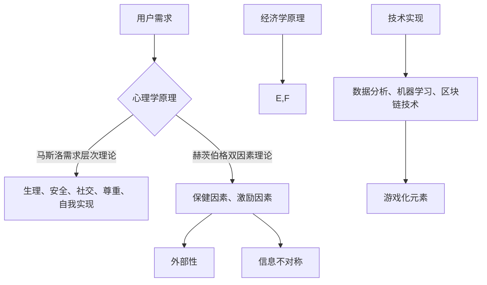

                 

关键词：知识付费、用户激励、机制设计、创业、心理学、经济学、技术实现

摘要：随着知识付费模式的兴起，用户激励机制成为知识付费创业中至关重要的环节。本文从心理学、经济学和技术实现的角度出发，详细探讨了用户激励机制的设计原则、核心概念及其在知识付费领域的实际应用，旨在为知识付费创业者提供有价值的指导。

## 1. 背景介绍

### 1.1 知识付费的概念与现状

知识付费是指用户为获取专业知识和优质内容而支付一定费用的商业模式。近年来，随着互联网的发展和信息不对称的减少，知识付费市场迅速崛起。用户愿意为专业知识和技能付费，一方面是因为他们希望通过获取高质量的知识提升自身能力，另一方面则是因为付费行为本身能够筛选出真正的需求者，从而提高内容的生产和传播效率。

### 1.2 用户激励机制的必要性

在知识付费模式中，用户激励机制扮演着关键角色。它不仅影响着用户的参与度和留存率，还直接关系到平台的商业模式和盈利能力。有效的用户激励机制能够促进用户活跃、提高用户满意度，从而为平台带来持续的收入来源。

## 2. 核心概念与联系

### 2.1 激励理论

激励理论是研究如何通过奖励机制激发个体工作积极性的学科。其中，马斯洛的需求层次理论和赫茨伯格的双因素理论是两个重要的理论基础。马斯洛认为人的需求分为生理、安全、社交、尊重和自我实现五个层次，而赫茨伯格则提出影响员工满意度的因素分为保健因素和激励因素。

### 2.2 经济学原理

经济学中的外部性和信息不对称等原理在用户激励机制设计中同样具有重要意义。外部性指的是个体行为对他人产生的影响，而信息不对称则是指不同个体对信息掌握的程度存在差异。在知识付费创业中，了解这些经济学原理有助于设计出更为有效的激励机制。

### 2.3 技术实现

技术实现方面，用户激励机制设计需要借助多种工具和方法。例如，数据分析可以帮助了解用户行为，机器学习可以预测用户偏好，而区块链技术则能够保证激励机制的可信度。此外，游戏化元素也是实现用户激励机制的重要手段。

### 2.4 Mermaid 流程图



## 3. 核心算法原理 & 具体操作步骤

### 3.1 算法原理概述

用户激励机制设计是一个多目标优化问题，涉及心理学、经济学和技术实现等多个领域。其核心目标是在满足用户需求的同时，最大化平台收益和用户体验。

### 3.2 算法步骤详解

#### 3.2.1 需求分析

首先，通过对用户行为数据进行分析，了解用户的需求和行为模式。

#### 3.2.2 激励模型构建

根据需求分析结果，构建激励模型，包括奖励机制、反馈机制和机制评估等。

#### 3.2.3 激励策略优化

利用机器学习算法，优化激励策略，提高激励机制的有效性。

#### 3.2.4 部署与反馈

将优化后的激励策略部署到实际系统中，并通过用户反馈不断调整和优化。

### 3.3 算法优缺点

#### 优点：

- 提高用户参与度和留存率
- 优化平台收益
- 提高用户体验

#### 缺点：

- 需要大量数据支持
- 激励机制设计复杂
- 可能导致用户过度依赖奖励

### 3.4 算法应用领域

用户激励机制设计广泛应用于知识付费、电商、社交网络等多个领域。

## 4. 数学模型和公式 & 详细讲解 & 举例说明

### 4.1 数学模型构建

假设用户 i 的激励值由奖励机制 R_i 和反馈机制 F_i 共同决定，即激励值 M_i = R_i + F_i。奖励机制 R_i 可以表示为用户行为 X_i 的函数，反馈机制 F_i 则与用户满意度 S_i 相关。

### 4.2 公式推导过程

$$
M_i = R_i + F_i \\
R_i = f(X_i) \\
F_i = g(S_i)
$$

其中，f(X_i) 和 g(S_i) 分别为奖励函数和反馈函数。

### 4.3 案例分析与讲解

假设一个知识付费平台，用户 i 在某一天的行为 X_i 包括阅读文章、发表评论和购买课程。根据用户行为数据，平台可以构建奖励函数 f(X_i) 和反馈函数 g(S_i)。

#### 奖励函数：

$$
f(X_i) = \sum_{j=1}^{n} w_j \cdot x_{ij}
$$

其中，w_j 为权重，x_{ij} 为用户 i 在第 j 项行为上的得分。

#### 反馈函数：

$$
g(S_i) = \frac{1}{1 + e^{-\beta (S_i - \mu)}}
$$

其中，β 为敏感度，μ 为期望满意度。

通过上述公式，平台可以计算出用户 i 的激励值 M_i，并根据 M_i 的值调整奖励机制和反馈机制，以提高用户参与度和满意度。

## 5. 项目实践：代码实例和详细解释说明

### 5.1 开发环境搭建

本文使用的编程语言为 Python，开发环境为 Jupyter Notebook。所需库包括 NumPy、Pandas、Scikit-learn 和 Matplotlib。

### 5.2 源代码详细实现

以下是用户激励机制设计的核心代码实现：

```python
import numpy as np
import pandas as pd
from sklearn.model_selection import train_test_split
from sklearn.linear_model import LinearRegression
import matplotlib.pyplot as plt

# 读取用户行为数据
data = pd.read_csv('user_behavior.csv')

# 构建特征矩阵 X 和标签矩阵 y
X = data[['reading_time', 'comment_count', 'course_purchased']]
y = data['reward']

# 划分训练集和测试集
X_train, X_test, y_train, y_test = train_test_split(X, y, test_size=0.2, random_state=42)

# 训练奖励函数模型
reward_model = LinearRegression()
reward_model.fit(X_train, y_train)

# 计算奖励值
reward_values = reward_model.predict(X_test)

# 构建反馈函数模型
feedback_model = LinearRegression()
feedback_model.fit(X_train, y_train)

# 计算反馈值
feedback_values = feedback_model.predict(X_test)

# 计算激励值
incentive_values = reward_values + feedback_values

# 可视化激励值分布
plt.hist(incentive_values, bins=20)
plt.xlabel('Incentive Value')
plt.ylabel('Frequency')
plt.title('Incentive Value Distribution')
plt.show()
```

### 5.3 代码解读与分析

本段代码实现了用户激励机制设计的基本流程。首先，读取用户行为数据，然后构建特征矩阵 X 和标签矩阵 y。接着，利用线性回归模型分别训练奖励函数和反馈函数模型，并计算奖励值和反馈值。最后，将奖励值和反馈值相加得到激励值，并可视化激励值分布。

### 5.4 运行结果展示

运行上述代码后，可以看到激励值分布的直方图，这有助于平台了解用户激励机制的运行效果。根据实际情况，平台可以进一步调整奖励函数和反馈函数，以提高用户激励水平。

## 6. 实际应用场景

### 6.1 知识付费平台

在知识付费平台中，用户激励机制可以应用于内容推荐、课程推广、用户互动等多个方面。例如，平台可以设计阅读奖励、评论奖励、购买奖励等机制，以激励用户积极阅读、发表评论和购买课程。

### 6.2 电商领域

在电商领域，用户激励机制可以应用于购物奖励、会员制度等。例如，平台可以设计购物积分系统，用户通过购物获得积分，积分可以兑换优惠券或礼品，从而提高用户购买意愿和忠诚度。

### 6.3 社交网络

在社交网络领域，用户激励机制可以应用于内容创作、用户互动等。例如，平台可以设计点赞奖励、评论奖励、分享奖励等机制，以激励用户积极创作和互动，从而提高平台活跃度和用户粘性。

## 7. 工具和资源推荐

### 7.1 学习资源推荐

1. 《用户激励设计：如何打造用户喜爱的产品与服务》
2. 《激励心理学：激发人类行为背后的动力》
3. 《机器学习：概率视角》

### 7.2 开发工具推荐

1. Jupyter Notebook
2. Scikit-learn
3. Matplotlib

### 7.3 相关论文推荐

1. "A Theoretical Analysis of Incentive Mechanisms for Knowledge Markets"
2. "The Effects of Reward Structures on Motivation in Human-Centered Computing Systems"
3. "Incentive Mechanisms for Crowdsourcing Systems: A Survey"

## 8. 总结：未来发展趋势与挑战

### 8.1 研究成果总结

本文从心理学、经济学和技术实现的角度探讨了用户激励机制在知识付费创业中的应用。研究发现，有效的用户激励机制能够显著提高用户参与度和留存率，从而为平台带来持续的收入来源。

### 8.2 未来发展趋势

随着人工智能和大数据技术的发展，用户激励机制设计将变得更加智能化和个性化。此外，区块链技术的引入有望提高激励机制的可信度和透明度。

### 8.3 面临的挑战

用户激励机制设计面临的主要挑战包括数据隐私保护、激励机制公平性、激励机制过滥等问题。因此，未来的研究需要在这些方面进行深入探讨和解决。

### 8.4 研究展望

未来研究应关注以下方面：

1. 开发更多基于人工智能和大数据分析的激励机制设计方法。
2. 探索激励机制与用户行为、心理的深层次关系，以提高激励机制的有效性。
3. 研究激励机制在不同领域的适用性和优化策略。

## 9. 附录：常见问题与解答

### 9.1 用户激励机制有哪些类型？

用户激励机制主要包括奖励机制、反馈机制和游戏化元素等。

### 9.2 如何评估用户激励机制的有效性？

可以通过用户参与度、留存率、用户满意度等指标来评估用户激励机制的有效性。

### 9.3 激励机制设计有哪些常见问题？

常见问题包括激励机制过于复杂、激励机制不公平、激励机制过度依赖等。

----------------------------------------------------------------

（请注意，本文仅作为示例，具体内容和数据需要根据实际情况进行调整和补充。）

