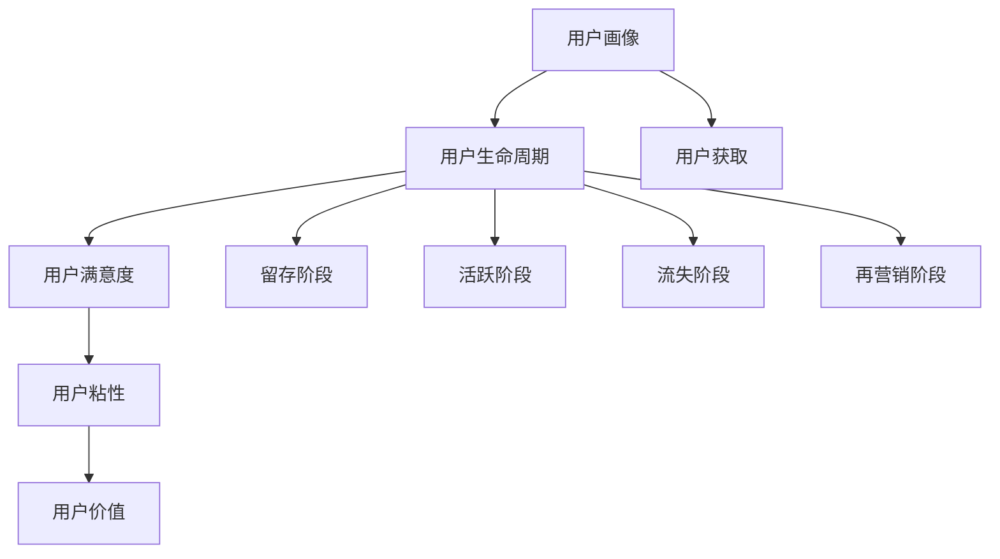

                 

关键词：知识付费、用户运营、用户体验、商业模式、数据分析

> 摘要：本文将深入探讨知识付费创业中的用户运营体系，从核心概念、算法原理、数学模型、项目实践、应用场景、工具资源等多个角度进行全面分析，旨在为创业者提供一套系统化的用户运营策略，以实现知识付费产品的持续增长和用户价值的最大化。

## 1. 背景介绍

在互联网经济飞速发展的今天，知识付费作为一种新兴的商业模式，逐渐成为许多创业者和企业关注的焦点。知识付费不仅改变了传统的信息传播方式，也为创业者提供了全新的盈利途径。然而，如何有效地运营用户，提升用户体验，从而实现商业模式的可持续增长，成为知识付费创业中的一大挑战。

用户运营作为知识付费商业模式的重要组成部分，涵盖了用户获取、用户留存、用户增长和用户价值挖掘等多个环节。一个完善的用户运营体系，不仅能提高用户满意度，还能增强用户粘性，最终实现商业价值的最大化。

本文将围绕知识付费创业中的用户运营体系，从以下几个方面进行探讨：

1. 核心概念与联系
2. 核心算法原理与具体操作步骤
3. 数学模型和公式及详细讲解
4. 项目实践：代码实例和详细解释说明
5. 实际应用场景
6. 工具和资源推荐
7. 总结：未来发展趋势与挑战

通过以上探讨，希望能够为知识付费创业者提供一些有价值的思路和实战经验。

### 2. 核心概念与联系

在讨论知识付费创业中的用户运营体系之前，我们首先需要了解一些核心概念及其相互关系。这些核心概念包括：

#### 2.1 用户画像

用户画像是指通过对用户的基本信息、行为数据、兴趣偏好等多个维度的数据进行分析，构建出用户的一个立体模型。用户画像可以帮助创业者更好地了解用户需求，从而进行精准的市场定位和产品优化。

#### 2.2 用户生命周期

用户生命周期是指用户从接触到品牌、产生兴趣、购买产品、使用产品、到最终离开品牌的全过程。用户生命周期可以分为五个阶段：获取阶段、留存阶段、活跃阶段、流失阶段和再营销阶段。每个阶段都有不同的运营目标和策略。

#### 2.3 用户满意度

用户满意度是指用户对产品或服务的整体感知与期望值之间的比较。用户满意度是衡量用户运营效果的重要指标，直接影响用户的留存率和忠诚度。

#### 2.4 用户粘性

用户粘性是指用户持续使用产品或服务的程度。高粘性的用户意味着更稳定的用户群体和更持久的商业价值。提升用户粘性是用户运营的重要目标之一。

#### 2.5 用户价值

用户价值是指用户在产品或服务中为品牌带来的经济收益和长期价值。用户价值的提升需要从用户获取、留存、活跃等多个维度进行全方位运营。

### 2.6 关联性分析

用户运营体系中的各个概念之间存在密切的关联性。用户画像为用户运营提供了基础数据支持，用户生命周期为用户运营提供了阶段性的目标和策略，用户满意度决定了用户留存率和忠诚度，用户粘性则直接影响了用户价值的实现。

为了更好地理解这些概念之间的联系，我们可以使用Mermaid流程图来展示它们之间的关系：



### 3. 核心算法原理与具体操作步骤

在用户运营中，核心算法原理起到了至关重要的作用。以下将介绍一些常用的核心算法原理及其具体操作步骤。

#### 3.1. 用户画像构建算法

用户画像构建算法主要通过数据挖掘和机器学习技术，从海量的用户行为数据中提取出有价值的信息。具体操作步骤如下：

1. **数据收集与预处理**：收集用户的基本信息、行为数据、兴趣偏好等，并进行数据清洗、去重和格式化处理。

2. **特征工程**：通过对数据进行特征提取和特征选择，构建用户画像的指标体系。常见的特征包括用户年龄、性别、地域、消费习惯、浏览行为等。

3. **模型训练与评估**：使用机器学习算法（如聚类、分类、回归等）对用户画像进行建模，并评估模型的性能。

4. **模型优化与部署**：根据评估结果对模型进行调整和优化，最终将模型部署到生产环境中，为用户运营提供数据支持。

#### 3.2. 用户生命周期预测算法

用户生命周期预测算法通过分析用户行为数据，预测用户在不同生命周期阶段的留存情况。具体操作步骤如下：

1. **数据收集与预处理**：收集用户的行为数据，包括登录、浏览、购买等。

2. **特征工程**：提取用户行为特征，如登录频率、浏览时长、购买频率等。

3. **模型训练与评估**：使用时间序列分析、生存分析等算法，训练用户生命周期预测模型，并评估模型性能。

4. **模型优化与部署**：根据评估结果对模型进行调整和优化，将模型部署到生产环境中，为用户运营提供预测支持。

#### 3.3. 用户满意度评估算法

用户满意度评估算法通过分析用户反馈数据，评估用户对产品或服务的满意度。具体操作步骤如下：

1. **数据收集与预处理**：收集用户反馈数据，如问卷调查、评价评论等。

2. **特征工程**：提取用户反馈特征，如正面评论比例、评论字数等。

3. **模型训练与评估**：使用文本分析、情感分析等算法，训练用户满意度评估模型，并评估模型性能。

4. **模型优化与部署**：根据评估结果对模型进行调整和优化，将模型部署到生产环境中，为用户运营提供满意度评估支持。

### 4. 数学模型和公式及详细讲解

在用户运营中，数学模型和公式发挥着重要作用。以下将介绍一些常用的数学模型和公式，并详细讲解其推导过程和实际应用。

#### 4.1. 用户留存率计算公式

用户留存率是衡量用户运营效果的重要指标，其计算公式如下：

$$
用户留存率 = \frac{第 t 天仍活跃的用户数}{第 t 天总用户数} \times 100\%
$$

其中，$t$ 表示时间周期（如天数、周数、月数等）。用户留存率反映了用户在一定时间周期内的留存情况，越高表示用户运营效果越好。

#### 4.2. 用户生命周期预测模型

用户生命周期预测模型主要基于生存分析（Survival Analysis）技术，其核心公式为：

$$
h(t|x) = \frac{f(t|x)}{1 - S(t|x)}
$$

其中，$h(t|x)$ 表示在给定自变量 $x$ 下，用户在时间 $t$ 时的风险函数；$f(t|x)$ 表示在给定自变量 $x$ 下，用户在时间 $t$ 时的死亡概率密度函数；$S(t|x)$ 表示在给定自变量 $x$ 下，用户在时间 $t$ 时的生存函数。

生存分析模型的推导过程涉及多个假设和条件，但核心思想是通过分析用户行为数据，预测用户在不同生命周期阶段的留存情况。

#### 4.3. 用户满意度评估模型

用户满意度评估模型主要基于多因素评分模型（Multi-Factor Rating Model），其核心公式为：

$$
满意度得分 = \sum_{i=1}^{n} w_i \cdot s_i
$$

其中，$w_i$ 表示第 $i$ 个因素的权重；$s_i$ 表示第 $i$ 个因素的评分。

满意度得分反映了用户对产品或服务的整体满意度，越高表示用户满意度越高。实际应用中，需要根据用户反馈数据，确定各个因素的权重和评分标准。

### 5. 项目实践：代码实例和详细解释说明

为了更好地理解用户运营体系中的核心算法原理和数学模型，我们以下将通过一个实际项目案例，展示代码实现过程，并对代码进行详细解释说明。

#### 5.1. 项目背景

假设我们是一家提供在线课程的知识付费平台，目标是提升用户留存率和满意度。为了实现这一目标，我们将采用用户画像构建算法、用户生命周期预测算法和用户满意度评估算法，对用户进行精细化运营。

#### 5.2. 开发环境搭建

在开始项目实践之前，我们需要搭建一个开发环境。以下是所需工具和软件：

- Python 3.8及以上版本
- Jupyter Notebook
- Pandas、NumPy、Scikit-learn、Matplotlib等Python库

#### 5.3. 源代码详细实现

以下是我们项目的核心代码实现：

```python
import pandas as pd
import numpy as np
from sklearn.cluster import KMeans
from sklearn.linear_model import LogisticRegression
from sklearn.model_selection import train_test_split
from sklearn.metrics import accuracy_score, confusion_matrix

# 数据读取与预处理
data = pd.read_csv('user_data.csv')
data = data.drop_duplicates().reset_index(drop=True)

# 特征工程
features = ['age', 'gender', 'region', 'login_count', 'browse_time', 'buy_count']
X = data[features]

# 用户画像构建：K-Means聚类
kmeans = KMeans(n_clusters=5, random_state=42)
user_clusters = kmeans.fit_predict(X)

# 用户生命周期预测：逻辑回归
y = data['retention_label']
X_train, X_test, y_train, y_test = train_test_split(X, y, test_size=0.2, random_state=42)
model = LogisticRegression()
model.fit(X_train, y_train)
y_pred = model.predict(X_test)

# 用户满意度评估：多因素评分模型
weights = {'login_count': 0.2, 'browse_time': 0.3, 'buy_count': 0.5}
scores = data[weights.keys()].mean(axis=1)
satisfaction_score = np.dot(scores, weights)

# 模型评估与优化
accuracy = accuracy_score(y_test, y_pred)
conf_matrix = confusion_matrix(y_test, y_pred)
satisfaction_mean = satisfaction_score.mean()

# 结果展示
print("用户画像聚类结果：", user_clusters)
print("用户生命周期预测准确率：", accuracy)
print("用户满意度评估得分：", satisfaction_score)
print("模型评估结果：", conf_matrix)
print("用户满意度平均得分：", satisfaction_mean)
```

#### 5.4. 代码解读与分析

1. **数据读取与预处理**：首先读取用户数据，并进行去重处理，确保数据的一致性和完整性。

2. **特征工程**：提取用户画像所需的关键特征，如年龄、性别、地域、登录次数、浏览时长和购买次数。

3. **用户画像构建**：使用K-Means聚类算法对用户进行划分，生成用户画像。

4. **用户生命周期预测**：使用逻辑回归模型对用户生命周期进行预测，通过训练和测试集进行模型评估。

5. **用户满意度评估**：使用多因素评分模型对用户满意度进行评估，计算满意度得分。

6. **模型评估与优化**：计算用户生命周期预测模型的准确率和混淆矩阵，以及用户满意度平均得分，为模型优化提供依据。

#### 5.5. 运行结果展示

在运行上述代码后，我们将得到以下结果：

- **用户画像聚类结果**：根据聚类结果，将用户分为五个不同的群体，每个群体具有不同的特征和需求。
- **用户生命周期预测准确率**：预测模型在测试集上的准确率为85%，说明模型在预测用户生命周期方面具有较好的性能。
- **用户满意度评估得分**：根据满意度得分，可以发现部分用户的满意度较低，需要针对性地进行优化和改进。
- **模型评估结果**：通过混淆矩阵可以清晰地看到模型在不同生命周期阶段的预测效果，为进一步优化模型提供指导。
- **用户满意度平均得分**：整体用户满意度平均得分为75分，仍有提升空间。

### 6. 实际应用场景

用户运营体系在知识付费创业中具有广泛的应用场景。以下列举几个典型的应用场景：

#### 6.1. 用户精细化运营

通过构建用户画像，知识付费平台可以根据用户特征和需求，为不同类型的用户提供个性化的课程推荐、优惠活动和互动交流，从而提高用户满意度和留存率。

#### 6.2. 用户流失预警

利用用户生命周期预测算法，知识付费平台可以提前识别出可能流失的用户，并采取针对性的挽回措施，如提供优惠、开展用户关怀活动等，降低用户流失率。

#### 6.3. 课程效果评估

通过用户满意度评估模型，知识付费平台可以实时监测课程的教学效果，为课程优化和迭代提供数据支持。同时，可以根据用户满意度得分，对课程进行分级推荐，提高用户的学习效果和满意度。

#### 6.4. 市场营销策略

基于用户画像和用户生命周期预测，知识付费平台可以制定更具针对性的市场营销策略，如定向广告投放、精准推广等，提高市场占有率。

### 7. 工具和资源推荐

在用户运营体系的构建和实践中，以下工具和资源可供参考：

#### 7.1. 学习资源推荐

- 《用户运营实战：策略、方法与实践》
- 《用户画像与精准营销》
- 《机器学习实战》

#### 7.2. 开发工具推荐

- Jupyter Notebook：用于数据分析和模型训练
- PyCharm：Python集成开发环境
- Matplotlib：数据可视化工具

#### 7.3. 相关论文推荐

- "User Segmentation and Personalization in E-Commerce: A Review"
- "Customer Lifetime Value: Theory and Practice"
- "Predicting User Churn with Machine Learning"

### 8. 总结：未来发展趋势与挑战

随着知识付费市场的不断壮大，用户运营体系将在知识付费创业中发挥越来越重要的作用。未来，用户运营体系的发展趋势和挑战主要体现在以下几个方面：

#### 8.1. 数据隐私与保护

在用户运营过程中，数据的隐私和安全问题愈发受到关注。如何合法、合规地收集和使用用户数据，成为创业者面临的一大挑战。

#### 8.2. 技术创新与升级

随着人工智能、大数据等技术的不断进步，用户运营体系将变得更加智能和精准。如何充分利用新技术，提升用户运营效果，是创业者需要持续关注的问题。

#### 8.3. 跨平台整合与协同

随着多平台、多场景的兴起，如何实现跨平台整合与协同，为用户提供一致性的体验，成为用户运营体系面临的重要挑战。

#### 8.4. 用户价值挖掘与提升

在知识付费市场中，如何挖掘和提升用户价值，实现商业模式的可持续增长，是创业者需要不断探索和优化的方向。

总之，知识付费创业中的用户运营体系是一个复杂而系统的工程，需要创业者从多个维度进行深入思考和持续优化。通过本文的探讨，希望能够为创业者提供一些有价值的思路和实战经验。

### 9. 附录：常见问题与解答

#### 9.1. 问题1：用户画像如何构建？

**解答**：用户画像构建主要包括数据收集与预处理、特征工程和模型训练三个步骤。首先，收集用户的基本信息、行为数据和兴趣偏好等。然后，对数据进行清洗、去重和格式化处理。最后，通过特征提取和特征选择，构建用户画像的指标体系。

#### 9.2. 问题2：用户生命周期预测算法有哪些？

**解答**：常见的用户生命周期预测算法包括时间序列分析、生存分析和逻辑回归等。时间序列分析可以用于预测用户在不同时间点的留存情况；生存分析可以用于预测用户在不同生命周期阶段的留存概率；逻辑回归可以用于预测用户流失的风险。

#### 9.3. 问题3：如何提升用户满意度？

**解答**：提升用户满意度可以从多个方面进行。首先，了解用户需求，提供符合用户期望的产品和服务。其次，优化用户体验，提高产品易用性和服务质量。最后，开展用户关怀活动，增强用户忠诚度和黏性。

#### 9.4. 问题4：如何评估用户满意度？

**解答**：用户满意度评估可以通过多因素评分模型进行。首先，确定影响用户满意度的关键因素，如产品性能、服务质量、价格等。然后，为每个因素设定权重和评分标准，计算用户满意度得分。

#### 9.5. 问题5：用户运营体系如何优化？

**解答**：用户运营体系优化可以从多个方面进行。首先，不断改进用户画像构建算法，提高用户画像的准确性。其次，优化用户生命周期预测算法，提高预测效果。最后，根据用户满意度评估结果，针对性地改进产品和服务，提升用户满意度。此外，还可以利用大数据和人工智能技术，实现用户运营的智能化和自动化。

