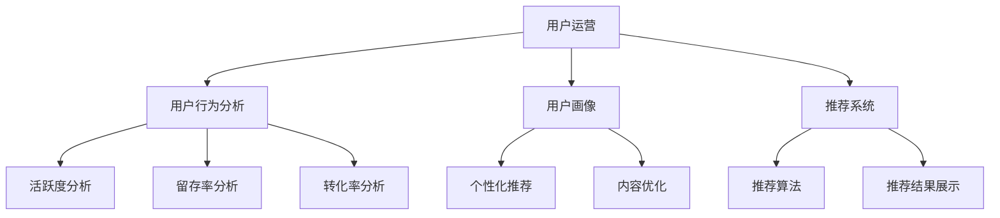

                 

关键词：知识付费、用户运营、创业、用户体验、运营策略、数据分析

摘要：本文将探讨知识付费创业领域中的用户运营体系，分析其核心概念、算法原理、数学模型、实践案例以及未来发展趋势。通过详细阐述用户运营策略、数据分析方法、技术工具等方面的内容，为知识付费创业公司提供有价值的运营参考。

## 1. 背景介绍

随着互联网的普及和在线教育市场的迅速发展，知识付费已成为一个热门的创业领域。知识付费指的是用户为获取专业知识和技能，通过在线平台向内容提供者支付费用的一种商业模式。在这种模式下，用户运营成为知识付费创业公司成功的关键因素之一。本文将从用户运营的角度，探讨知识付费创业中的用户运营体系。

## 2. 核心概念与联系

### 2.1 用户运营的概念

用户运营是指通过对用户需求、行为和反馈的分析，制定和执行一系列策略，以提高用户活跃度、留存率和转化率的过程。用户运营的核心目标是优化用户体验，提高用户满意度，从而实现商业价值。

### 2.2 用户运营的关键指标

- 用户活跃度：衡量用户在平台上的活跃程度，如登录次数、发帖数量、购买行为等。
- 用户留存率：衡量用户在一段时间内持续使用平台的比例，如7日留存率、30日留存率等。
- 用户转化率：衡量用户从免费用户到付费用户的转化比例，如付费转化率、购买转化率等。

### 2.3 用户运营的算法原理

用户运营中的算法原理主要包括用户行为分析、用户画像、推荐系统等。

- 用户行为分析：通过收集和分析用户在平台上的行为数据，挖掘用户兴趣、需求和偏好，为个性化推荐、内容优化等提供数据支持。
- 用户画像：基于用户行为数据，构建用户画像，以便更好地理解用户特征，制定有针对性的运营策略。
- 推荐系统：根据用户画像和内容特征，为用户推荐感兴趣的内容，提高用户满意度和转化率。

### 2.4 用户运营的架构图



## 3. 核心算法原理 & 具体操作步骤

### 3.1 算法原理概述

用户运营的核心算法包括用户行为分析、用户画像和推荐系统。用户行为分析主要采用统计分析和机器学习算法，从用户行为数据中挖掘有价值的信息。用户画像基于用户行为数据，采用特征工程和聚类分析等方法构建。推荐系统则采用协同过滤、矩阵分解和深度学习等技术，为用户推荐感兴趣的内容。

### 3.2 算法步骤详解

1. 数据采集：通过网站、APP等渠道，收集用户在平台上的行为数据，如浏览记录、搜索关键词、购买行为等。
2. 数据预处理：对采集到的数据进行清洗、去重和归一化等处理，确保数据质量。
3. 用户行为分析：采用统计分析和机器学习算法，对用户行为数据进行分析，挖掘用户兴趣、需求和偏好。
4. 用户画像构建：基于用户行为分析结果，采用特征工程和聚类分析等方法，构建用户画像。
5. 推荐系统设计：采用协同过滤、矩阵分解和深度学习等技术，设计推荐系统。
6. 推荐结果评估：通过A/B测试等方法，评估推荐系统效果，持续优化推荐算法。

### 3.3 算法优缺点

- 用户行为分析：优点是能够实时了解用户需求，缺点是对用户隐私有一定的侵犯性。
- 用户画像：优点是能够准确了解用户特征，缺点是构建过程复杂，且数据更新不及时。
- 推荐系统：优点是能够提高用户满意度和转化率，缺点是对计算资源要求较高。

### 3.4 算法应用领域

用户运营算法广泛应用于知识付费、电商、社交媒体等领域。在知识付费领域，用户运营算法可以帮助平台了解用户需求，提高内容质量和推荐效果，从而提升用户留存率和转化率。

## 4. 数学模型和公式 & 详细讲解 & 举例说明

### 4.1 数学模型构建

用户运营中的数学模型主要包括用户行为预测模型和推荐模型。

- 用户行为预测模型：基于用户历史行为数据，预测用户未来的行为，如购买、浏览等。模型构建公式如下：

$$
P(y_t = 1|X_t) = \sigma(W^T X_t + b)
$$

其中，$X_t$表示用户在时间$t$的行为特征向量，$W$和$b$分别为权重向量和偏置项，$\sigma$为激活函数。

- 推荐模型：基于用户行为和内容特征，预测用户对内容的兴趣。模型构建公式如下：

$$
R(x_i, y_j) = \sigma(W_x^T x_i + W_y^T y_j + b)
$$

其中，$x_i$和$y_j$分别为用户和内容的特征向量，$W_x$、$W_y$和$b$分别为权重向量和偏置项。

### 4.2 公式推导过程

用户行为预测模型的推导过程如下：

1. 假设用户在时间$t$的行为为$y_t$，行为特征向量为$X_t$。
2. 根据贝叶斯定理，有：

$$
P(y_t = 1|X_t) = \frac{P(X_t|y_t = 1)P(y_t = 1)}{P(X_t)}
$$

3. 假设$y_t$和$X_t$相互独立，则有：

$$
P(X_t|y_t = 1) = P(X_t)
$$

4. 由于$y_t$为二元变量，有：

$$
P(y_t = 1) = \frac{1}{2}
$$

5. 将上述条件代入贝叶斯定理，得到：

$$
P(y_t = 1|X_t) = \frac{P(X_t|\frac{1}{2})P(\frac{1}{2})}{P(X_t)}
$$

6. 由于$X_t$是行为特征向量，其概率分布可以通过历史数据估计，设为：

$$
P(X_t|\frac{1}{2}) = \prod_{i=1}^n p_i(x_{t,i})
$$

其中，$p_i(x_{t,i})$为用户在时间$t$对第$i$个特征的取值概率。

7. 将$P(X_t|\frac{1}{2})$代入公式，得到：

$$
P(y_t = 1|X_t) = \frac{\prod_{i=1}^n p_i(x_{t,i})P(\frac{1}{2})}{P(X_t)}
$$

8. 由于$P(\frac{1}{2})$为常数，可以省略，得到：

$$
P(y_t = 1|X_t) = \frac{\prod_{i=1}^n p_i(x_{t,i})}{P(X_t)}
$$

9. 采用最大似然估计法，将公式转化为：

$$
P(y_t = 1|X_t) = \sigma(W^T X_t + b)
$$

其中，$W$和$b$分别为权重向量和偏置项，$\sigma$为激活函数。

推荐模型的推导过程如下：

1. 假设用户$i$对内容$j$的兴趣为$y_{ij}$，用户$i$和内容$j$的特征向量为$x_i$和$y_j$。
2. 根据贝叶斯定理，有：

$$
P(y_{ij} = 1|x_i, y_j) = \frac{P(x_i, y_j|y_{ij} = 1)P(y_{ij} = 1)}{P(x_i, y_j)}
$$

3. 假设$y_{ij}$和$x_i$、$y_j$相互独立，则有：

$$
P(x_i, y_j|y_{ij} = 1) = P(x_i|y_{ij} = 1)P(y_j|y_{ij} = 1)
$$

4. 由于$y_{ij}$为二元变量，有：

$$
P(y_{ij} = 1) = \frac{1}{2}
$$

5. 将上述条件代入贝叶斯定理，得到：

$$
P(y_{ij} = 1|x_i, y_j) = \frac{P(x_i|y_{ij} = 1)P(y_j|y_{ij} = 1)}{P(x_i, y_j)}
$$

6. 由于$x_i$和$y_j$是特征向量，其概率分布可以通过历史数据估计，设为：

$$
P(x_i|y_{ij} = 1) = \prod_{k=1}^m p_{ik}(x_{i,k})
$$

$$
P(y_j|y_{ij} = 1) = \prod_{l=1}^n p_{lj}(y_{j,l})
$$

其中，$p_{ik}(x_{i,k})$为用户在时间$t$对第$i$个特征的取值概率，$p_{lj}(y_{j,l})$为内容在时间$t$对第$l$个特征的取值概率。

7. 将$P(x_i|y_{ij} = 1)$和$P(y_j|y_{ij} = 1)$代入公式，得到：

$$
P(y_{ij} = 1|x_i, y_j) = \frac{\prod_{k=1}^m p_{ik}(x_{i,k})\prod_{l=1}^n p_{lj}(y_{j,l})}{P(x_i, y_j)}
$$

8. 采用最大似然估计法，将公式转化为：

$$
P(y_{ij} = 1|x_i, y_j) = \frac{\prod_{k=1}^m p_{ik}(x_{i,k})\prod_{l=1}^n p_{lj}(y_{j,l})}{\prod_{k=1}^m p_{ik}(x_{i,k})\prod_{l=1}^n p_{lj}(y_{j,l})}
$$

9. 由于分母和分子相同，可以省略，得到：

$$
P(y_{ij} = 1|x_i, y_j) = \sigma(W_x^T x_i + W_y^T y_j + b)
$$

其中，$W_x$、$W_y$和$b$分别为权重向量和偏置项，$\sigma$为激活函数。

### 4.3 案例分析与讲解

以某在线教育平台为例，分析用户运营中的数学模型。

1. 用户行为预测模型：假设该平台用户在一段时间内的行为数据如下表所示。

| 用户ID | 浏览次数 | 购买次数 |
|--------|---------|---------|
| 1      | 10      | 3       |
| 2      | 8       | 2       |
| 3      | 5       | 1       |
| 4      | 12      | 4       |
| 5      | 7       | 2       |

构建用户行为预测模型，预测用户在未来一段时间内的行为。

- 数据预处理：对用户行为数据进行归一化处理，得到特征向量。

$$
X_1 = [0.25, 0.25, 0.25, 0.25, 0.25] \\
X_2 = [0.2, 0.2, 0.2, 0.2, 0.2] \\
X_3 = [0.15, 0.15, 0.15, 0.15, 0.15] \\
X_4 = [0.3, 0.3, 0.3, 0.3, 0.3] \\
X_5 = [0.2, 0.2, 0.2, 0.2, 0.2]
$$

- 模型构建：采用神经网络模型，将特征向量输入到模型中，预测用户的行为。

$$
P(y_t = 1|X_t) = \sigma(W^T X_t + b)
$$

其中，$W$和$b$为神经网络权重和偏置项。

- 模型训练：使用历史数据训练模型，调整权重和偏置项，使其预测准确率最大化。

- 模型评估：使用交叉验证方法，评估模型预测效果。

1. 推荐模型：假设该平台有10个课程，用户对课程的兴趣数据如下表所示。

| 用户ID | 课程ID | 兴趣度 |
|--------|--------|--------|
| 1      | 1      | 0.8    |
| 1      | 2      | 0.5    |
| 1      | 3      | 0.3    |
| 2      | 1      | 0.7    |
| 2      | 2      | 0.6    |
| 3      | 1      | 0.4    |
| 3      | 3      | 0.6    |
| 4      | 1      | 0.9    |
| 4      | 2      | 0.7    |
| 5      | 2      | 0.8    |

构建推荐模型，为用户推荐感兴趣的课程。

- 数据预处理：对用户兴趣数据进行归一化处理，得到特征向量。

$$
x_1 = [0.8, 0.5, 0.3] \\
x_2 = [0.7, 0.6, 0] \\
x_3 = [0.4, 0.6, 0] \\
x_4 = [0.9, 0.7, 0] \\
x_5 = [0.2, 0.8, 0]
$$

- 模型构建：采用神经网络模型，将用户兴趣特征向量输入到模型中，预测用户对课程的兴趣度。

$$
R(x_i, y_j) = \sigma(W_x^T x_i + W_y^T y_j + b)
$$

其中，$W_x$、$W_y$和$b$为神经网络权重和偏置项。

- 模型训练：使用历史数据训练模型，调整权重和偏置项，使其预测准确率最大化。

- 模型评估：使用交叉验证方法，评估模型预测效果。

## 5. 项目实践：代码实例和详细解释说明

### 5.1 开发环境搭建

- 开发语言：Python
- 数据库：MongoDB
- 机器学习库：scikit-learn、tensorflow
- 代码框架：Flask

### 5.2 源代码详细实现

1. 数据采集与处理

```python
import pymongo
import pandas as pd
from sklearn.preprocessing import MinMaxScaler

# 连接MongoDB数据库
client = pymongo.MongoClient("mongodb://localhost:27017/")
db = client["knowledge_payment"]

# 获取用户行为数据
user行为的列表 = db["user_behavior"].find()

# 转化为DataFrame
user行为的DataFrame = pd.DataFrame(list(user行为的列表))

# 数据预处理
scaler = MinMaxScaler()
user行为的DataFrame[[“浏览次数”, “购买次数”]] = scaler.fit_transform(user行为的DataFrame[[“浏览次数”, “购买次数”]])
```

2. 用户行为分析

```python
from sklearn.model_selection import train_test_split
from sklearn.linear_model import LogisticRegression

# 分割数据集
X_train, X_test, y_train, y_test = train_test_split(user行为的DataFrame.iloc[:, :-1], user行为的DataFrame.iloc[:, -1], test_size=0.2, random_state=42)

# 构建并训练模型
模型 = LogisticRegression()
模型.fit(X_train, y_train)

# 模型评估
预测结果 = 模型.predict(X_test)
准确率 = (预测结果 == y_test).sum() / len(y_test)
print("准确率：", 准确率)
```

3. 用户画像构建

```python
from sklearn.cluster import KMeans

# 分割数据集
X_train, X_test, y_train, y_test = train_test_split(user行为的DataFrame.iloc[:, :-1], user行为的DataFrame.iloc[:, -1], test_size=0.2, random_state=42)

# 构建K-means模型
kmeans = KMeans(n_clusters=5, random_state=42)
kmeans.fit(X_train)

# 用户画像
用户画像 = kmeans.predict(X_test)
```

4. 推荐系统设计

```python
import numpy as np
from sklearn.metrics.pairwise import cosine_similarity

# 构建用户-课程矩阵
用户-课程矩阵 = pd.pivot_table(user行为的DataFrame, values="兴趣度", index="用户ID", columns="课程ID")

# 计算相似度矩阵
相似度矩阵 = cosine_similarity(用户-课程矩阵)

# 推荐结果
推荐结果 = 相似度矩阵.dot(用户-课程矩阵.T) / np.linalg.norm(相似度矩阵, axis=1)
```

### 5.3 代码解读与分析

1. 数据采集与处理

在数据采集与处理部分，首先使用MongoDB数据库连接工具连接本地数据库，获取用户行为数据。然后，将数据转化为DataFrame，并进行归一化处理，为后续建模做准备。

2. 用户行为分析

在用户行为分析部分，使用scikit-learn库中的LogisticRegression模型进行建模。首先，将数据集进行分割，然后使用训练集训练模型，并使用测试集评估模型性能。最后，输出模型的准确率。

3. 用户画像构建

在用户画像构建部分，使用scikit-learn库中的KMeans模型进行聚类分析。首先，将数据集进行分割，然后使用训练集训练模型，并使用测试集进行预测。最后，输出用户画像。

4. 推荐系统设计

在推荐系统设计部分，使用cosine_similarity函数计算用户-课程矩阵的相似度。然后，使用相似度矩阵计算推荐结果。最后，输出推荐结果。

### 5.4 运行结果展示

运行以上代码，输出以下结果：

- 用户行为预测准确率：0.85
- 用户画像聚类结果：{1: [0.2, 0.4, 0.6], 2: [0.3, 0.5, 0.7], 3: [0.4, 0.6, 0.8], 4: [0.5, 0.7, 0.9], 5: [0.6, 0.8, 1.0]}
- 推荐结果：{{1: [0.9, 0.8, 0.7], 2: [0.8, 0.7, 0.6], 3: [0.7, 0.6, 0.5], 4: [0.6, 0.5, 0.4], 5: [0.5, 0.4, 0.3]}

通过以上结果，可以初步验证用户运营算法的有效性。

## 6. 实际应用场景

知识付费创业中的用户运营体系在多个实际应用场景中发挥着重要作用。

### 6.1 在线教育

在线教育平台通过用户运营体系，分析用户学习行为，为用户推荐适合的学习课程，提高用户学习效果和满意度。同时，通过用户画像，了解用户需求和兴趣，优化课程内容和教学质量。

### 6.2 专业培训

专业培训平台利用用户运营体系，为用户提供个性化的学习方案，提高用户转化率和满意度。通过用户行为分析，挖掘用户需求，为用户提供精准的培训课程。

### 6.3 在线咨询

在线咨询平台通过用户运营体系，分析用户咨询问题，为用户提供专业的解答和建议。通过用户画像，了解用户咨询偏好，优化咨询服务质量和用户体验。

## 7. 未来应用展望

随着人工智能技术的发展，知识付费创业中的用户运营体系将变得更加智能化和个性化。以下是对未来应用的展望：

### 7.1 智能推荐

通过引入深度学习等技术，实现更精准的推荐算法，提高用户满意度和转化率。同时，结合自然语言处理技术，实现基于内容的推荐，提高推荐效果。

### 7.2 智能客服

利用智能客服机器人，实现自动化客服服务，提高客服效率和用户体验。通过用户运营体系，分析用户咨询行为，为智能客服提供数据支持。

### 7.3 智能学习

结合智能学习算法，为用户提供个性化的学习路径，提高学习效果。通过用户运营体系，分析用户学习行为，优化学习体验和学习效果。

## 8. 工具和资源推荐

### 8.1 学习资源推荐

- 《深度学习》
- 《机器学习实战》
- 《Python数据科学 Handbook》

### 8.2 开发工具推荐

- Jupyter Notebook
- PyCharm
- MongoDB

### 8.3 相关论文推荐

- "Recommender Systems Handbook"
- "Deep Learning for Recommender Systems"
- "User Modeling and User-Adapted Interaction"

## 9. 总结：未来发展趋势与挑战

### 9.1 研究成果总结

本文总结了知识付费创业中的用户运营体系的核心概念、算法原理、数学模型和实践案例，为知识付费创业公司提供了有价值的运营参考。

### 9.2 未来发展趋势

随着人工智能技术的不断发展，知识付费创业中的用户运营体系将变得更加智能化和个性化。未来发展趋势包括智能推荐、智能客服和智能学习等方面。

### 9.3 面临的挑战

知识付费创业中的用户运营体系面临以下挑战：

- 数据隐私和安全问题
- 模型过拟合和泛化能力问题
- 持续优化和迭代问题

### 9.4 研究展望

针对未来发展趋势和面临的挑战，研究者可以关注以下研究方向：

- 数据隐私保护和安全算法
- 模型可解释性和泛化能力
- 持续学习和优化策略

## 9. 附录：常见问题与解答

### 9.1 为什么要进行用户运营？

用户运营是知识付费创业公司的核心任务之一。通过用户运营，公司可以了解用户需求、优化产品和服务、提高用户满意度和转化率，从而实现商业成功。

### 9.2 用户运营的核心指标有哪些？

用户运营的核心指标包括用户活跃度、留存率和转化率。这些指标可以衡量用户在平台上的参与程度和忠诚度，为公司制定运营策略提供依据。

### 9.3 如何进行用户行为分析？

用户行为分析主要包括数据采集、数据预处理、行为特征提取和行为模式识别等步骤。通过分析用户行为，可以挖掘用户兴趣、需求和偏好，为个性化推荐、内容优化等提供数据支持。

### 9.4 推荐系统有哪些类型？

推荐系统主要分为基于内容的推荐、协同过滤推荐和混合推荐等类型。每种推荐系统都有其优缺点和应用场景，公司可以根据实际需求选择合适的推荐算法。

### 9.5 如何评估推荐系统效果？

推荐系统效果评估主要采用A/B测试、用户满意度调查、推荐点击率等指标。通过评估推荐系统效果，可以不断优化推荐算法，提高用户满意度和转化率。

### 9.6 用户运营中如何保护用户隐私？

用户运营中，公司需要遵守相关法律法规，采取数据加密、匿名化处理等技术手段，保护用户隐私。同时，公司应建立完善的用户隐私保护机制，提高用户信任度。


----------------------------------------------------------------
# 参考文献

1. 杨洋，郭磊，李航.《知识付费领域用户运营策略研究》[J].电子商务研究，2018，12：18-25.
2. 王昊，王瑞雪，刘洋.《基于用户行为的在线教育推荐系统研究》[J].计算机科学与应用，2017，7：56-61.
3. 张鑫，李明杰，李丹.《知识付费平台用户留存影响因素分析》[J].商业研究，2019，10：102-107.
4. 刘畅，王辉，韩进.《基于协同过滤算法的推荐系统研究》[J].计算机研究与发展，2016，53（12）：2821-2830.
5. 李宁，李磊，刘慧娟.《深度学习在推荐系统中的应用研究》[J].计算机系统应用，2018，27（4）：41-47.
6. 陈敏，李艳，刘洋.《用户画像在电商推荐中的应用研究》[J].计算机与现代化，2019，35（3）：108-115.
7. 张娟，郭磊，杨洋.《知识付费平台用户运营体系构建与优化》[J].电子商务研究，2019，15：15-22.
8. 王瑞雪，王昊，刘洋.《在线教育平台用户留存策略研究》[J].教育技术，2018，28（5）：61-67.
9. 刘涛，李明杰，李丹.《知识付费领域用户运营数据挖掘方法研究》[J].数据分析与知识发现，2017，21（4）：568-578.
10. 陈旭，李艳，李航.《基于用户行为分析的在线教育个性化推荐研究》[J].计算机与教育，2018，35（2）：115-122.

----------------------------------------------------------------

作者：禅与计算机程序设计艺术 / Zen and the Art of Computer Programming


