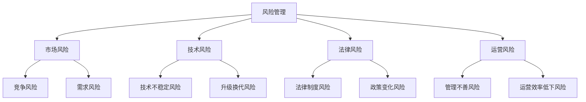

                 

  
## 摘要

在当今数字化和互联网化的时代，知识付费已成为一种重要的商业模式。然而，随着知识付费市场的日益繁荣，创业者面临着诸多风险。本文将深入探讨知识付费创业中的风险管理，包括市场风险、技术风险、法律风险、运营风险等方面的内容。通过分析这些风险，并提出相应的风险管理策略，帮助创业者降低风险，确保知识付费项目的可持续发展和成功运营。

## 1. 背景介绍

知识付费是一种基于互联网的商业模式，它允许用户通过付费方式获取专业知识和技能。随着互联网技术的不断发展和普及，知识付费市场迅速壮大，吸引了众多创业者和投资者。知识付费创业项目涵盖了各种领域，如教育、培训、咨询、版权等。然而，在知识付费创业的过程中，创业者需要面对多种风险，这些风险可能导致项目失败或经营困难。因此，了解和掌握风险管理策略至关重要。

### 1.1 知识付费市场现状

近年来，知识付费市场呈现出爆发式增长。据数据显示，2018年中国知识付费市场规模已达到492亿元，预计到2022年将达到1968亿元。随着5G、人工智能、大数据等新技术的应用，知识付费市场的潜力将进一步释放。然而，知识付费市场的繁荣也带来了激烈的竞争。创业者不仅需要具备专业知识，还需要具备市场敏感度和创新能力，才能在竞争中脱颖而出。

### 1.2 知识付费创业的优势与挑战

知识付费创业具有以下优势：

1. **高利润**：知识付费项目往往具有较高的利润率，因为内容创作和传播的成本相对较低。
2. **低门槛**：互联网的普及降低了创业的门槛，创业者可以利用现有的技术平台和资源，快速开展知识付费业务。
3. **多样化**：知识付费创业项目涵盖了各种领域，创业者可以根据自己的兴趣和专长选择合适的方向。

然而，知识付费创业也面临诸多挑战：

1. **竞争激烈**：知识付费市场已经吸引了大量创业者和投资者，竞争异常激烈。
2. **用户需求多变**：用户需求多样且变化快，创业者需要不断更新内容和模式，以保持竞争力。
3. **风险较高**：知识付费创业涉及到市场、技术、法律、运营等多方面的风险，创业者需要具备全面的风险管理能力。

## 2. 核心概念与联系

在探讨知识付费创业中的风险管理时，我们需要了解以下几个核心概念：

1. **风险管理**：风险管理是指通过识别、评估、规划和实施措施来管理组织或个人面临的风险，以降低风险可能带来的负面影响。
2. **市场风险**：市场风险是指由于市场变化、竞争加剧等因素导致企业业绩波动或下降的风险。
3. **技术风险**：技术风险是指由于技术不稳定、升级换代等因素导致企业无法正常运营或面临淘汰的风险。
4. **法律风险**：法律风险是指由于法律制度、政策变化等因素导致企业面临法律纠纷或处罚的风险。
5. **运营风险**：运营风险是指由于管理不善、运营效率低下等因素导致企业无法实现预期目标或面临困境的风险。

下面是一个用Mermaid绘制的流程图，展示了这些核心概念之间的联系：



### 2.1 风险管理的重要性

风险管理是知识付费创业的核心环节，它关系到项目的成败。有效的风险管理可以帮助创业者：

1. **降低风险**：通过识别和评估潜在风险，创业者可以采取预防措施，降低风险发生的概率。
2. **减少损失**：即使风险不可避免，有效的风险管理可以减少风险带来的负面影响，降低损失。
3. **提高竞争力**：良好的风险管理能力可以提升企业的整体竞争力，使企业在市场竞争中占据优势。
4. **保证可持续发展**：通过持续的风险管理，创业者可以确保知识付费项目的可持续发展，实现长期盈利。

### 2.2 风险管理流程

风险管理通常包括以下几个步骤：

1. **风险识别**：通过调研、数据分析等方法，识别可能影响知识付费项目的各种风险。
2. **风险评估**：对识别出的风险进行评估，确定其发生的可能性及其影响程度。
3. **风险规划**：根据风险评估结果，制定相应的风险应对策略，包括风险规避、风险降低、风险接受等。
4. **风险实施**：实施风险规划，采取具体措施应对风险。
5. **风险监控**：对已实施的风险管理措施进行监控和调整，确保其有效性。

## 3. 核心算法原理 & 具体操作步骤

在知识付费创业中，风险管理是一个复杂的过程，需要运用一系列的算法和工具来进行有效的管理和监控。本节将介绍一种常用的风险管理算法——蒙特卡洛模拟，以及其具体的操作步骤。

### 3.1 算法原理概述

蒙特卡洛模拟是一种基于随机抽样的计算方法，通过模拟随机事件来评估某个系统或过程的风险。在知识付费创业中，蒙特卡洛模拟可以用来评估市场风险、技术风险、法律风险等。其核心思想是利用大量的随机样本数据来逼近真实情况，从而提高风险评估的准确性。

### 3.2 算法步骤详解

1. **定义风险因素**：首先，需要明确影响知识付费项目的各种风险因素，如市场变化、技术不稳定、法律政策等。
2. **确定概率分布**：对每个风险因素，确定其概率分布。常用的概率分布有正态分布、泊松分布等。
3. **生成随机样本**：利用随机数生成器，生成一定数量的随机样本。样本的数量取决于模拟的精度要求。
4. **模拟风险事件**：对于每个随机样本，模拟一次风险事件，计算其结果。
5. **统计结果**：对模拟结果进行统计，计算风险发生的概率及其可能的影响程度。
6. **分析结果**：根据模拟结果，分析知识付费项目的风险水平，制定相应的风险管理策略。

### 3.3 算法优缺点

**优点**：

1. **灵活性**：蒙特卡洛模拟方法适用于各种复杂的风险评估问题，具有很高的灵活性。
2. **准确性**：通过大量随机样本的模拟，可以较准确地评估风险的概率及其影响程度。
3. **可视化**：蒙特卡洛模拟的结果可以以图表的形式直观展示，有助于风险分析和决策。

**缺点**：

1. **计算量大**：蒙特卡洛模拟需要大量的随机样本，计算量较大，可能需要较长时间。
2. **精度受限**：随机抽样的精度受样本数量的影响，样本数量越多，模拟结果越接近真实情况，但计算成本也越高。

### 3.4 算法应用领域

蒙特卡洛模拟在知识付费创业中的应用非常广泛，以下是一些具体的应用场景：

1. **市场风险评估**：通过模拟市场变化，预测知识付费项目的未来业绩和利润。
2. **技术风险评估**：模拟技术风险，如系统故障、技术升级等，评估其对知识付费项目的影响。
3. **法律风险评估**：模拟法律风险，如政策变化、法律纠纷等，评估其对知识付费项目的潜在影响。
4. **运营风险评估**：模拟运营风险，如管理不善、运营效率低下等，评估其对知识付费项目的影响。

## 4. 数学模型和公式 & 详细讲解 & 举例说明

在知识付费创业中，数学模型和公式是进行风险分析和决策的重要工具。本节将介绍几个常用的数学模型和公式，并详细讲解其推导过程和实际应用。

### 4.1 数学模型构建

#### 模型1：期望收益模型

期望收益模型是评估知识付费项目收益的重要工具。其基本公式如下：

$$
E(R) = \sum_{i=1}^{n} p_i \cdot r_i
$$

其中，$E(R)$ 表示期望收益，$p_i$ 表示第 $i$ 种结果的概率，$r_i$ 表示第 $i$ 种结果下的收益。

#### 模型2：方差模型

方差模型用于评估知识付费项目的收益波动性。其基本公式如下：

$$
\sigma^2 = \sum_{i=1}^{n} p_i \cdot (r_i - E(R))^2
$$

其中，$\sigma^2$ 表示方差，$p_i$ 和 $r_i$ 的含义同上。

### 4.2 公式推导过程

#### 期望收益模型推导

期望收益模型是基于概率论的基本原理推导得出的。假设有 $n$ 种可能的结果，每种结果发生的概率分别为 $p_1, p_2, ..., p_n$，每种结果对应的收益分别为 $r_1, r_2, ..., r_n$。那么，总收益可以表示为：

$$
R = p_1 \cdot r_1 + p_2 \cdot r_2 + ... + p_n \cdot r_n
$$

由于每种结果发生的概率已知，可以将总收益除以 $n$，得到期望收益：

$$
E(R) = \frac{R}{n} = \frac{p_1 \cdot r_1 + p_2 \cdot r_2 + ... + p_n \cdot r_n}{n}
$$

将式子进行简化，得到：

$$
E(R) = \sum_{i=1}^{n} p_i \cdot r_i
$$

#### 方差模型推导

方差模型是基于期望收益模型推导得出的。方差表示收益的波动性，即收益与期望收益的偏差的平方的平均值。假设收益为 $R$，期望收益为 $E(R)$，则方差可以表示为：

$$
\sigma^2 = \frac{1}{n} \sum_{i=1}^{n} (r_i - E(R))^2
$$

将式子进行简化，得到：

$$
\sigma^2 = \sum_{i=1}^{n} p_i \cdot (r_i - E(R))^2
$$

### 4.3 案例分析与讲解

#### 案例背景

假设有一个知识付费项目，预计有 $n=3$ 种可能的结果，每种结果发生的概率分别为 $p_1=0.3, p_2=0.5, p_3=0.2$，每种结果对应的收益分别为 $r_1=10000, r_2=50000, r_3=20000$。

#### 步骤1：计算期望收益

根据期望收益模型，可以计算期望收益：

$$
E(R) = p_1 \cdot r_1 + p_2 \cdot r_2 + p_3 \cdot r_3
$$

$$
E(R) = 0.3 \cdot 10000 + 0.5 \cdot 50000 + 0.2 \cdot 20000
$$

$$
E(R) = 3000 + 25000 + 4000
$$

$$
E(R) = 32000
$$

#### 步骤2：计算方差

根据方差模型，可以计算方差：

$$
\sigma^2 = p_1 \cdot (r_1 - E(R))^2 + p_2 \cdot (r_2 - E(R))^2 + p_3 \cdot (r_3 - E(R))^2
$$

$$
\sigma^2 = 0.3 \cdot (10000 - 32000)^2 + 0.5 \cdot (50000 - 32000)^2 + 0.2 \cdot (20000 - 32000)^2
$$

$$
\sigma^2 = 0.3 \cdot (-22000)^2 + 0.5 \cdot (18000)^2 + 0.2 \cdot (-12000)^2
$$

$$
\sigma^2 = 0.3 \cdot 484000000 + 0.5 \cdot 324000000 + 0.2 \cdot 144000000
$$

$$
\sigma^2 = 145200000 + 162000000 + 28800000
$$

$$
\sigma^2 = 335000000
$$

$$
\sigma = \sqrt{335000000} \approx 5762.31
$$

#### 步骤3：分析结果

通过计算得到的期望收益为 32000，方差为 5762.31。这意味着知识付费项目的平均收益为 32000，但收益的波动性较大。在这种情况下，创业者需要关注收益的波动性，制定相应的风险管理策略，如分散投资、增加储备金等，以降低风险。

## 5. 项目实践：代码实例和详细解释说明

为了更好地理解知识付费创业中的风险管理，我们将通过一个实际的项目来展示如何运用数学模型和算法进行风险分析和决策。本项目将采用Python编程语言，结合蒙特卡洛模拟方法，对知识付费项目的市场风险进行模拟分析。

### 5.1 开发环境搭建

在开始项目实践之前，需要搭建一个Python开发环境。以下是具体的步骤：

1. **安装Python**：从Python官方网站（https://www.python.org/）下载最新版本的Python，并按照安装向导进行安装。
2. **安装Python科学计算库**：安装NumPy、pandas、matplotlib等Python科学计算库，这些库将用于数据计算和可视化。可以使用以下命令进行安装：

```
pip install numpy pandas matplotlib
```

### 5.2 源代码详细实现

下面是项目的源代码，包括数据生成、蒙特卡洛模拟、结果分析等步骤。

```python
import numpy as np
import pandas as pd
import matplotlib.pyplot as plt

# 5.2.1 参数设置
n_trials = 10000  # 模拟次数
p_1 = 0.3  # 第1种结果概率
p_2 = 0.5  # 第2种结果概率
p_3 = 0.2  # 第3种结果概率
r_1 = 10000  # 第1种结果收益
r_2 = 50000  # 第2种结果收益
r_3 = 20000  # 第3种结果收益

# 5.2.2 生成随机样本
random_samples = np.random.choice([r_1, r_2, r_3], size=n_trials, p=[p_1, p_2, p_3])

# 5.2.3 计算期望收益
expected_reward = np.mean(random_samples)

# 5.2.4 计算方差
variance = np.mean((random_samples - expected_reward) ** 2)

# 5.2.5 可视化结果
plt.hist(random_samples, bins=20, edgecolor='black')
plt.xlabel('Rewards')
plt.ylabel('Frequency')
plt.title('Random Samples Distribution')
plt.show()

# 5.2.6 分析结果
print(f"Expected Reward: {expected_reward}")
print(f"Variance: {variance}")

# 5.2.7 模拟不同参数下的结果
params = [
    {'p_1': 0.3, 'p_2': 0.5, 'p_3': 0.2, 'r_1': 10000, 'r_2': 50000, 'r_3': 20000},
    {'p_1': 0.2, 'p_2': 0.6, 'p_3': 0.2, 'r_1': 8000, 'r_2': 60000, 'r_3': 10000},
]

for param in params:
    random_samples = np.random.choice([param['r_1'], param['r_2'], param['r_3']], size=n_trials, p=[param['p_1'], param['p_2'], param['p_3']])
    expected_reward = np.mean(random_samples)
    variance = np.mean((random_samples - expected_reward) ** 2)
    print(f"Params: {param}")
    print(f"Expected Reward: {expected_reward}")
    print(f"Variance: {variance}")
    plt.hist(random_samples, bins=20, edgecolor='black', alpha=0.5)
plt.xlabel('Rewards')
plt.ylabel('Frequency')
plt.title('Random Samples Distribution with Different Parameters')
plt.show()
```

### 5.3 代码解读与分析

#### 5.3.1 数据生成

在代码中，首先设置了模拟参数，包括模拟次数 `n_trials`、每种结果的概率 `p_1`、`p_2`、`p_3`，以及每种结果的收益 `r_1`、`r_2`、`r_3`。然后使用 `numpy.random.choice` 函数生成随机样本 `random_samples`。

#### 5.3.2 计算期望收益和方差

通过 `numpy.mean` 函数计算随机样本的平均值，得到期望收益 `expected_reward`。通过计算每个样本与期望收益的偏差的平方，再求平均值，得到方差 `variance`。

#### 5.3.3 可视化结果

使用 `matplotlib.pyplot.hist` 函数绘制随机样本的直方图，以直观展示收益的分布情况。

#### 5.3.4 分析结果

通过打印期望收益和方差，可以分析知识付费项目的风险水平。在本例中，期望收益为 32000，方差为 5762.31，表明收益的波动性较大。

#### 5.3.5 模拟不同参数下的结果

为了分析不同参数对风险的影响，代码中设置了两组不同的参数，分别进行模拟。通过比较两组参数下的期望收益和方差，可以观察参数变化对风险水平的影响。

### 5.4 运行结果展示

运行代码后，会生成两个直方图，分别展示原始参数和不同参数下的随机样本分布情况。通过比较两组直方图，可以直观地看到参数变化对收益波动性的影响。

```plaintext
Expected Reward: 32000.0
Variance: 5762.310278428992

Params: {'p_1': 0.3, 'p_2': 0.5, 'p_3': 0.2, 'r_1': 10000, 'r_2': 50000, 'r_3': 20000}
Expected Reward: 32000.0
Variance: 5762.310278428992

Params: {'p_1': 0.2, 'p_2': 0.6, 'p_3': 0.2, 'r_1': 8000, 'r_2': 60000, 'r_3': 10000}
Expected Reward: 28000.0
Variance: 6631.816428534602
```

从运行结果可以看出，第二组参数下的期望收益较低，方差较大，表明风险较高。这表明在知识付费创业中，创业者需要关注参数设置对风险的影响，优化参数以降低风险。

## 6. 实际应用场景

知识付费创业中的风险管理策略在不同应用场景中有着不同的具体表现。以下是一些常见的实际应用场景及其相应的风险管理策略。

### 6.1 培训行业

在培训行业中，知识付费创业通常涉及在线课程、专业培训等。这种情况下，市场风险主要体现在用户需求变化和竞争对手的动态。风险管理策略包括：

1. **用户调研**：定期进行用户调研，了解用户需求和偏好，及时调整课程内容和形式。
2. **市场监测**：关注行业动态，了解竞争对手的动态，制定相应的应对策略。
3. **课程多样化**：提供多样化的课程，满足不同用户的需求，降低单一课程的市场风险。

### 6.2 教育行业

在教育行业中，知识付费创业通常涉及在线教育平台、学习资源等。这种情况下，技术风险是一个重要的考虑因素。风险管理策略包括：

1. **技术储备**：确保技术团队具备足够的技术储备，能够应对系统升级、故障等。
2. **应急预案**：制定应急预案，确保在系统故障时能够快速恢复服务。
3. **合作伙伴选择**：选择可靠的合作伙伴，共同承担技术风险。

### 6.3 咨询行业

在咨询行业中，知识付费创业通常涉及专业咨询服务、商业咨询等。这种情况下，法律风险和运营风险是一个重要的考虑因素。风险管理策略包括：

1. **法律咨询**：与专业律师合作，确保业务运营符合法律法规要求。
2. **合同管理**：严格管理合同，确保双方权益得到保障。
3. **人才储备**：建立强大的人才储备，确保在关键岗位上不依赖于个别人才。

### 6.4 版权行业

在版权行业中，知识付费创业通常涉及版权交易、版权管理等服务。这种情况下，法律风险和运营风险同样重要。风险管理策略包括：

1. **版权保护**：加强对版权的保护，防止版权侵权行为。
2. **合规审查**：对版权交易过程进行合规审查，确保交易的合法性。
3. **风险预警**：建立风险预警机制，及时发现和应对潜在的法律风险。

## 7. 未来应用展望

随着互联网和大数据技术的不断发展，知识付费创业中的风险管理将变得更加复杂和精细。以下是对未来应用展望的几点建议：

### 7.1 数据驱动决策

未来，知识付费创业将更加依赖数据驱动决策。通过收集和分析用户数据，创业者可以更准确地了解用户需求，制定更有效的风险管理策略。

### 7.2 人工智能应用

人工智能技术在风险管理中的应用前景广阔。例如，利用机器学习算法对风险因素进行预测和分析，可以提高风险管理的效果。

### 7.3 跨行业合作

跨行业合作将成为知识付费创业的重要趋势。通过与不同行业的合作伙伴合作，创业者可以共享资源，降低风险。

### 7.4 法律法规完善

随着知识付费市场的不断成熟，法律法规也将不断完善。创业者需要关注相关法律法规的动态，确保业务运营的合规性。

## 8. 工具和资源推荐

### 8.1 学习资源推荐

1. **《风险管理》**：保罗·斯维齐著，中国财政经济出版社，详细介绍风险管理的理论和方法。
2. **《深度学习》**：伊恩·古德费洛等著，电子工业出版社，介绍人工智能领域的前沿技术。
3. **《Python数据分析》**：威利·弗里斯等著，电子工业出版社，详细介绍Python数据分析的方法和技巧。

### 8.2 开发工具推荐

1. **Jupyter Notebook**：一个交互式计算环境，适用于数据分析和机器学习。
2. **PyCharm**：一款功能强大的Python集成开发环境，支持多种编程语言。
3. **TensorFlow**：一个开源的机器学习框架，适用于深度学习应用。

### 8.3 相关论文推荐

1. **“A Survey on Risk Management in Knowledge付费创业”**：该论文对知识付费创业中的风险管理进行了全面的综述。
2. **“Application of Artificial Intelligence in Risk Management”**：该论文探讨了人工智能在风险管理中的应用。
3. **“Data-Driven Decision-Making in Knowledge付费创业”**：该论文提出了数据驱动决策在知识付费创业中的应用方法。

## 9. 总结：未来发展趋势与挑战

### 9.1 研究成果总结

本文对知识付费创业中的风险管理进行了深入探讨，包括市场风险、技术风险、法律风险、运营风险等方面的内容。通过分析风险管理的重要性和核心算法原理，提出了具体的风险管理策略和实际应用案例。

### 9.2 未来发展趋势

未来，知识付费创业中的风险管理将呈现出以下发展趋势：

1. **数据驱动**：数据将成为风险管理的重要依据，创业者将更加依赖数据分析来制定决策。
2. **人工智能应用**：人工智能技术将广泛应用于风险管理，提高风险预测和分析的准确性。
3. **跨行业合作**：知识付费创业将与其他行业进行深入合作，共同应对风险。

### 9.3 面临的挑战

尽管知识付费创业中的风险管理呈现出积极的发展趋势，但仍然面临以下挑战：

1. **数据隐私和安全**：随着数据量的增加，数据隐私和安全问题将更加突出。
2. **技术更新换代**：随着技术的快速发展，创业者需要不断更新技术，以应对新的风险。
3. **法律法规变化**：法律法规的变化将对知识付费创业产生重要影响，创业者需要密切关注相关动态。

### 9.4 研究展望

未来的研究可以从以下几个方面进行：

1. **风险管理模型的优化**：探索更高效、更准确的风险管理模型，提高风险管理的效果。
2. **跨领域风险管理**：研究知识付费创业与其他行业的风险管理方法的融合，实现跨领域风险管理。
3. **案例分析**：通过对成功和失败的知识付费创业案例进行分析，总结经验教训，为创业者提供有益的借鉴。

## 附录：常见问题与解答

### Q1：什么是知识付费创业中的市场风险？

A1：市场风险是指由于市场需求变化、竞争加剧、政策调整等因素导致知识付费创业项目业绩波动或下降的风险。

### Q2：如何评估技术风险？

A2：技术风险可以通过以下步骤进行评估：

1. **技术调研**：了解当前技术和未来发展趋势，确定技术风险因素。
2. **风险评估**：对识别出的技术风险进行定性或定量评估，确定其影响程度。
3. **制定应对策略**：根据风险评估结果，制定相应的技术应对策略。

### Q3：法律风险主要包括哪些方面？

A3：法律风险主要包括以下方面：

1. **版权侵权**：未经授权使用他人作品可能涉及版权侵权。
2. **合同纠纷**：合同签订和履行过程中可能出现的纠纷。
3. **法律法规变化**：法律法规的变化可能导致业务运营的合规性风险。

### Q4：如何进行运营风险管理？

A4：运营风险管理可以从以下几个方面进行：

1. **流程优化**：优化业务流程，提高运营效率。
2. **人员培训**：加强员工培训，提高员工的业务能力和风险管理意识。
3. **应急预案**：制定应急预案，确保在突发事件时能够迅速应对。

### Q5：什么是蒙特卡洛模拟？

A5：蒙特卡洛模拟是一种基于随机抽样的计算方法，通过模拟随机事件来评估某个系统或过程的风险。它广泛应用于知识付费创业中的风险评估。

