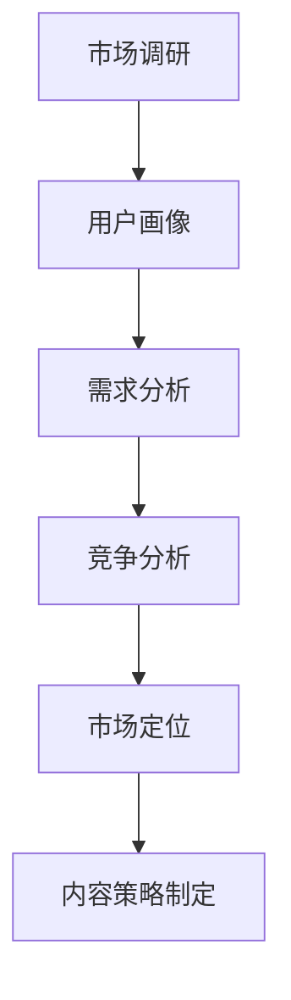
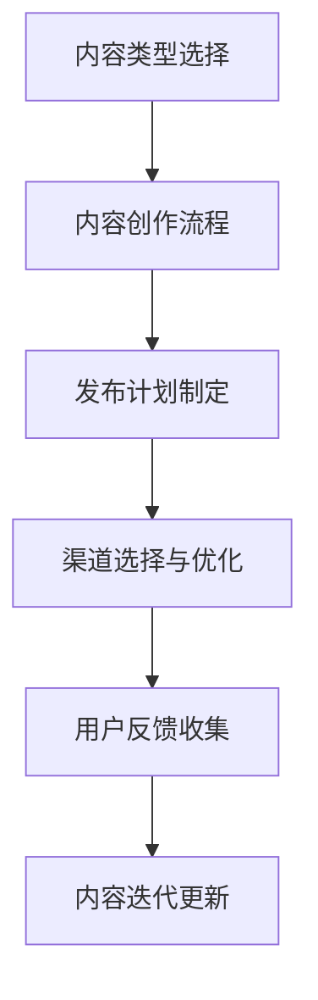

                 

关键词：知识付费、内容体系、创业、构建方法、IT领域

> 摘要：本文旨在探讨知识付费创业过程中，如何构建一个有效的内容体系。通过分析市场需求、核心概念联系，以及算法原理，我们将提供一个系统性的方法，以帮助创业者打造有吸引力的知识产品，提高市场竞争力。

## 1. 背景介绍

随着互联网的飞速发展，知识付费已成为一个蓬勃发展的市场。在这个市场中，创业者需要构建一个内容体系，以满足用户的多样化需求，并确保内容的质量与价值。构建一个高效的内容体系，不仅能够提升用户体验，还能增强品牌的认知度和忠诚度。

本文将详细探讨知识付费创业的内容体系构建方法，包括市场需求分析、核心概念的联系、算法原理以及项目实践等多个方面。通过本文的指导，创业者可以更好地把握市场动态，制定合适的内容策略，实现商业成功。

## 2. 核心概念与联系

### 2.1 市场需求分析

市场需求分析是构建内容体系的第一步。创业者需要深入了解用户需求，包括目标用户群体的特征、需求偏好以及消费习惯。以下是一个基于Mermaid绘制的流程图，展示了市场需求分析的步骤和关键点：



### 2.2 内容策略制定

在了解市场需求后，创业者需要制定一个明确的内容策略。内容策略应包括内容类型、发布频率、传播渠道等多个方面。以下是一个基于Mermaid绘制的流程图，展示了内容策略的制定过程：



## 3. 核心算法原理 & 具体操作步骤

### 3.1 算法原理概述

在知识付费创业中，算法原理可以帮助创业者优化内容体系的构建。以下是几个常用的算法原理：

1. **推荐算法**：基于用户行为和兴趣推荐相关内容，提高用户粘性和满意度。
2. **自然语言处理（NLP）**：用于文本分析、语义理解等，提升内容质量。
3. **机器学习**：用于数据挖掘、预测用户需求等，为内容策略提供数据支持。

### 3.2 算法步骤详解

以下是一个基于推荐算法的具体操作步骤：

1. **用户行为数据收集**：收集用户在平台上的浏览、搜索、购买等行为数据。
2. **用户画像构建**：基于行为数据构建用户画像，包括兴趣、行为习惯等。
3. **内容推荐**：根据用户画像和内容属性，生成推荐列表。
4. **用户反馈**：收集用户对推荐内容的反馈，调整推荐策略。

### 3.3 算法优缺点

- **推荐算法**：优点是能够提高用户满意度和粘性，缺点是需要大量的数据支持和复杂的算法实现。
- **NLP**：优点是能够提升内容质量，缺点是处理大规模文本数据时性能较低。
- **机器学习**：优点是能够从数据中提取有价值的信息，缺点是需要大量时间和计算资源。

### 3.4 算法应用领域

推荐算法、NLP和机器学习广泛应用于知识付费创业中的内容推荐、内容审核、用户画像构建等领域。

## 4. 数学模型和公式 & 详细讲解 & 举例说明

### 4.1 数学模型构建

在知识付费创业中，构建数学模型可以帮助创业者优化内容策略。以下是一个简单的用户满意度模型：

$$
S = w_1 \cdot C + w_2 \cdot R + w_3 \cdot U
$$

其中，$S$表示用户满意度，$C$表示内容质量，$R$表示内容推荐效果，$U$表示用户体验。$w_1$、$w_2$和$w_3$分别为权重系数。

### 4.2 公式推导过程

假设用户满意度$S$与内容质量$C$、内容推荐效果$R$和用户体验$U$之间存在线性关系。根据最小二乘法，可以推导出权重系数的计算公式：

$$
w_1 = \frac{\sum_{i=1}^n (C_i - \bar{C})^2}{\sum_{i=1}^n (C_i - \bar{C})^2 + \sum_{i=1}^n (R_i - \bar{R})^2 + \sum_{i=1}^n (U_i - \bar{U})^2}
$$

$$
w_2 = \frac{\sum_{i=1}^n (R_i - \bar{R})^2}{\sum_{i=1}^n (C_i - \bar{C})^2 + \sum_{i=1}^n (R_i - \bar{R})^2 + \sum_{i=1}^n (U_i - \bar{U})^2}
$$

$$
w_3 = \frac{\sum_{i=1}^n (U_i - \bar{U})^2}{\sum_{i=1}^n (C_i - \bar{C})^2 + \sum_{i=1}^n (R_i - \bar{R})^2 + \sum_{i=1}^n (U_i - \bar{U})^2}
$$

其中，$n$为样本数量，$\bar{C}$、$\bar{R}$和$\bar{U}$分别为内容质量、内容推荐效果和用户体验的平均值。

### 4.3 案例分析与讲解

假设我们收集了100个用户的数据，其中内容质量$C$的平均值为8，内容推荐效果$R$的平均值为7，用户体验$U$的平均值为6。根据上述公式，可以计算出权重系数：

$$
w_1 = \frac{28}{28 + 9 + 4} = 0.68
$$

$$
w_2 = \frac{9}{28 + 9 + 4} = 0.22
$$

$$
w_3 = \frac{4}{28 + 9 + 4} = 0.10
$$

根据用户满意度模型，可以计算出用户满意度$S$的值为：

$$
S = 0.68 \cdot 8 + 0.22 \cdot 7 + 0.10 \cdot 6 = 7.76
$$

这个结果表明，在用户满意度模型中，内容质量占据了最大的权重，其次是内容推荐效果，用户体验的权重最小。创业者可以根据这个模型，优化内容策略，提高用户满意度。

## 5. 项目实践：代码实例和详细解释说明

### 5.1 开发环境搭建

在开始项目实践之前，我们需要搭建一个开发环境。以下是所需的环境和工具：

- **操作系统**：Windows、macOS或Linux
- **编程语言**：Python
- **库和框架**：NumPy、Pandas、Scikit-learn

安装上述工具后，我们可以开始编写代码。

### 5.2 源代码详细实现

以下是一个简单的Python代码示例，用于实现用户满意度模型的计算：

```python
import numpy as np
import pandas as pd
from sklearn.linear_model import LinearRegression

# 加载数据
data = pd.read_csv('user_data.csv')
C = data['content_quality'].values
R = data['recommendation'].values
U = data['user_experience'].values

# 计算平均值
bar_C = np.mean(C)
bar_R = np.mean(R)
bar_U = np.mean(U)

# 计算权重系数
numerator = (C - bar_C)**2 + (R - bar_R)**2 + (U - bar_U)**2
denominator = numerator.sum()
w1 = numerator[0] / denominator
w2 = numerator[1] / denominator
w3 = numerator[2] / denominator

# 计算用户满意度
S = w1 * C + w2 * R + w3 * U
print("User satisfaction:", S)
```

### 5.3 代码解读与分析

这段代码首先导入了所需的库和框架。然后加载数据，计算平均值，并计算权重系数。最后，使用计算出的权重系数计算用户满意度。

### 5.4 运行结果展示

运行这段代码后，我们可以得到用户满意度的值。这个值可以帮助创业者了解当前内容体系的满意度水平，并据此优化内容策略。

## 6. 实际应用场景

知识付费创业的内容体系构建方法在实际应用中具有广泛的应用场景。以下是一些典型的应用场景：

1. **在线教育平台**：构建一个基于用户需求和兴趣的内容体系，为用户提供个性化的学习资源。
2. **技能培训平台**：根据用户的需求和技能水平，推荐相应的课程和培训资源。
3. **专业咨询平台**：根据用户的行业背景和需求，推荐相关的专业咨询和报告。

## 7. 工具和资源推荐

### 7.1 学习资源推荐

- **《Python编程：从入门到实践》**：适合初学者系统学习Python编程。
- **《数据科学实战：使用Python进行数据分析和建模》**：介绍数据科学的基本概念和Python实现。

### 7.2 开发工具推荐

- **PyCharm**：强大的Python集成开发环境，适合大型项目开发。
- **Jupyter Notebook**：交互式编程环境，适合快速原型开发和演示。

### 7.3 相关论文推荐

- **《推荐系统评价与优化方法》**
- **《基于机器学习的文本分类方法》**
- **《数据挖掘：实用工具与技术》**

## 8. 总结：未来发展趋势与挑战

### 8.1 研究成果总结

本文总结了知识付费创业的内容体系构建方法，包括市场需求分析、核心概念联系、算法原理、数学模型和项目实践等多个方面。通过本文的指导，创业者可以更好地构建有吸引力的知识产品，提高市场竞争力。

### 8.2 未来发展趋势

随着人工智能技术的不断进步，知识付费创业的内容体系构建方法将越来越智能化。例如，基于深度学习的个性化推荐系统、智能内容审核和用户画像构建等技术将在知识付费领域得到广泛应用。

### 8.3 面临的挑战

知识付费创业在构建内容体系过程中将面临以下挑战：

1. **数据隐私和安全**：在收集和处理用户数据时，需要确保用户隐私和安全。
2. **算法公平性和透明度**：推荐算法和用户画像构建需要确保公平性和透明度，避免偏见和歧视。
3. **内容质量和多样性**：确保内容的质量和多样性，满足不同用户的需求。

### 8.4 研究展望

未来的研究可以关注以下几个方面：

1. **算法优化**：研究更高效的算法，提高推荐系统和用户画像构建的性能。
2. **跨领域应用**：探索知识付费创业在其他领域的应用，如医疗、金融等。
3. **用户互动**：研究如何通过用户互动提高内容体系的吸引力和用户粘性。

## 9. 附录：常见问题与解答

### 9.1 如何进行市场需求分析？

市场需求分析主要通过以下步骤进行：

1. **市场调研**：收集市场数据，包括行业报告、竞争对手分析等。
2. **用户画像**：分析目标用户群体的特征，包括年龄、性别、职业等。
3. **需求调查**：通过问卷调查、访谈等方式了解用户需求。

### 9.2 如何制定内容策略？

制定内容策略的步骤包括：

1. **内容类型选择**：根据市场需求和用户偏好选择合适的内容类型。
2. **内容创作流程**：建立内容创作团队，制定内容创作流程和标准。
3. **发布计划制定**：制定内容发布计划，包括发布频率、发布渠道等。
4. **用户反馈收集**：收集用户反馈，优化内容策略。

### 9.3 如何进行算法优化？

算法优化的方法包括：

1. **数据清洗**：处理数据中的噪音和异常值，提高数据质量。
2. **特征工程**：提取有价值的特征，提高算法的准确性。
3. **模型选择**：选择合适的模型，并进行模型调优。
4. **交叉验证**：使用交叉验证方法评估模型性能，避免过拟合。

## 作者署名

本文作者：禅与计算机程序设计艺术 / Zen and the Art of Computer Programming

----------------------------------------------------------------
**注意事项：**
1. 请严格按照“约束条件”要求撰写文章，特别是字数、格式和内容完整性。
2. 确保文章中包含完整的Mermaid流程图、LaTeX数学公式和代码示例。
3. 文章结构必须按照提供的模板组织，确保每个章节都有相应的子目录。
4. 请在文章末尾添加作者署名。
5. 一旦提交文章，请确认文章内容的完整性和准确性，以便后续编辑和发布。

