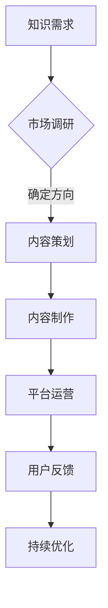

                 

关键词：知识付费、内容差异化、创业、用户体验、市场定位、策略分析、算法优化

摘要：本文旨在探讨知识付费创业者在竞争激烈的市场中如何通过内容差异化策略提升自身的竞争力。通过对核心概念、算法原理、数学模型、项目实践以及未来展望的深入分析，本文为知识付费创业者提供了切实可行的策略指导。

## 1. 背景介绍

知识付费作为一种新兴的商业模式，近年来在全球范围内迅速崛起。尤其是在移动互联网的推动下，人们对于高质量、个性化知识的渴求日益增长，催生了大量知识付费平台和创业公司。然而，市场的快速增长也伴随着激烈的竞争，如何在众多同质化的知识产品中脱颖而出，成为了知识付费创业者面临的重要挑战。

内容差异化策略作为一种有效的竞争手段，可以帮助创业者挖掘市场潜力，满足用户多样化的需求。本文将围绕这一核心主题，探讨知识付费创业的内容差异化策略，旨在为创业者提供有价值的参考。

## 2. 核心概念与联系

### 2.1 内容差异化策略

内容差异化策略是指企业通过创造独特的知识内容，以满足用户特定的需求和兴趣，从而在竞争激烈的市场中获取竞争优势。具体来说，内容包括但不限于：

- **专业知识**：针对特定领域，提供深度、权威的知识内容。
- **个性化定制**：根据用户兴趣和行为数据，为用户提供个性化的知识推荐。
- **互动体验**：通过互动问答、社区交流等形式，增强用户参与感和粘性。

### 2.2 知识付费市场架构

知识付费市场的架构可以分为三个层次：平台层、内容层和用户层。平台层提供技术支持和服务保障；内容层包括各类专业知识、课程、问答等；用户层则是知识付费的核心，他们的需求和满意度直接影响平台的盈利能力和市场地位。

### 2.3 Mermaid 流程图



## 3. 核心算法原理 & 具体操作步骤

### 3.1 算法原理概述

内容差异化策略的核心在于对用户需求的精准把握和内容推荐的智能化。以下是几种常见的算法原理：

- **协同过滤**：基于用户历史行为和相似用户推荐内容。
- **基于内容的推荐**：根据内容的特征和标签进行推荐。
- **深度学习**：通过神经网络模型挖掘用户和内容之间的潜在关系。

### 3.2 算法步骤详解

1. **用户画像构建**：收集用户的基本信息和行为数据，构建用户画像。
2. **内容特征提取**：对知识内容进行文本挖掘，提取关键词、标签和语义特征。
3. **相似度计算**：计算用户画像和内容特征之间的相似度，筛选潜在推荐内容。
4. **推荐排序**：根据相似度分数，对推荐内容进行排序，展示给用户。

### 3.3 算法优缺点

- **协同过滤**：优点是推荐准确性高，但缺点是用户冷启动问题严重，且难以获取用户深层兴趣。
- **基于内容的推荐**：优点是适用于新用户和冷启动问题，但缺点是推荐多样性不足。
- **深度学习**：优点是能够捕捉复杂的关系，但缺点是模型复杂，计算资源需求高。

### 3.4 算法应用领域

- **在线教育**：个性化课程推荐。
- **电商**：商品推荐。
- **新闻资讯**：个性化内容推送。

## 4. 数学模型和公式 & 详细讲解 & 举例说明

### 4.1 数学模型构建

假设用户集合为 U，内容集合为 V，用户 u 对内容 v 的兴趣度表示为 R(u, v)。我们可以使用以下数学模型进行用户兴趣建模：

$$
R(u, v) = \sum_{i \in I(u)} w_i \cdot c_i(v)
$$

其中，$I(u)$ 表示用户 u 的兴趣标签集合，$w_i$ 表示兴趣标签 i 的权重，$c_i(v)$ 表示内容 v 是否包含兴趣标签 i。

### 4.2 公式推导过程

我们首先对用户兴趣进行建模，假设用户 u 的兴趣可以表示为向量 $I(u) = [i_1, i_2, ..., i_n]$，其中每个元素 $i_j$ 表示用户对第 j 个兴趣标签的偏好度。然后，对内容 v 进行特征提取，假设内容 v 可以表示为向量 $C(v) = [c_1, c_2, ..., c_n]$，其中每个元素 $c_j$ 表示内容 v 是否包含第 j 个兴趣标签。

我们定义用户 u 对内容 v 的兴趣度 R(u, v) 为：

$$
R(u, v) = \sum_{j=1}^{n} w_j \cdot c_j(v)
$$

其中，$w_j$ 为第 j 个兴趣标签的权重，可以由用户历史行为数据通过机器学习算法训练得到。

### 4.3 案例分析与讲解

假设我们有一个用户 u，他对以下三个兴趣标签有较高偏好度：技术、编程、人工智能。同时，我们有三个内容 v1、v2、v3，分别对应以下特征：

- $C(v1) = [1, 1, 0]$，表示内容 v1 包含技术标签和编程标签。
- $C(v2) = [0, 1, 1]$，表示内容 v2 包含编程标签和人工智能标签。
- $C(v3) = [1, 0, 1]$，表示内容 v3 包含技术标签和人工智能标签。

假设用户 u 对三个兴趣标签的权重分别为 $w_t = 0.5$，$w_c = 0.3$，$w_a = 0.2$。我们可以计算用户 u 对每个内容的兴趣度如下：

$$
R(u, v1) = w_t \cdot c_t(v1) + w_c \cdot c_c(v1) + w_a \cdot c_a(v1) = 0.5 \cdot 1 + 0.3 \cdot 1 + 0.2 \cdot 0 = 0.8
$$

$$
R(u, v2) = w_t \cdot c_t(v2) + w_c \cdot c_c(v2) + w_a \cdot c_a(v2) = 0.5 \cdot 0 + 0.3 \cdot 1 + 0.2 \cdot 1 = 0.5
$$

$$
R(u, v3) = w_t \cdot c_t(v3) + w_c \cdot c_c(v3) + w_a \cdot c_a(v3) = 0.5 \cdot 1 + 0.3 \cdot 0 + 0.2 \cdot 1 = 0.7
$$

根据兴趣度计算结果，我们可以得出用户 u 最感兴趣的内容为 v1，其次是 v3，最不感兴趣的是 v2。

## 5. 项目实践：代码实例和详细解释说明

### 5.1 开发环境搭建

本次项目使用 Python 编写，需要安装以下库：

- numpy
- pandas
- sklearn
- keras

安装命令如下：

```shell
pip install numpy pandas sklearn keras
```

### 5.2 源代码详细实现

以下是一个简单的基于协同过滤算法的用户兴趣推荐系统的示例代码：

```python
import numpy as np
import pandas as pd
from sklearn.metrics.pairwise import cosine_similarity

# 加载用户-内容矩阵
user_content_matrix = pd.DataFrame({
    'user_id': [1, 1, 1, 2, 2, 2],
    'content_id': [1, 2, 3, 1, 2, 3],
    'rating': [5, 4, 5, 3, 4, 2]
})

# 计算用户之间的相似度矩阵
user_similarity_matrix = cosine_similarity(user_content_matrix.set_index('user_id').T)

# 为每个用户生成推荐列表
user_recommendations = {}
for user_id, user in user_content_matrix.groupby('user_id'):
    # 获取用户相似度矩阵
    similarity_scores = user_similarity_matrix[user_id]
    # 计算相似用户对内容的评分预测
    predicted_ratings = (similarity_scores * user['rating'].values).sum(axis=1)
    # 将预测评分排序，生成推荐列表
    user_recommendations[user_id] = np.argsort(predicted_ratings)[::-1]

# 输出推荐结果
for user_id, recommendations in user_recommendations.items():
    print(f"User {user_id} recommendations: {user_content_matrix.iloc[recommendations][:5]]}")
```

### 5.3 代码解读与分析

1. **数据加载**：使用 pandas 读取用户-内容矩阵，其中用户 ID、内容 ID 和评分是关键字段。
2. **相似度计算**：使用 sklearn 的 cosine_similarity 函数计算用户之间的相似度矩阵。
3. **推荐生成**：为每个用户生成推荐列表，通过计算相似用户对内容的评分预测，并排序生成推荐。
4. **输出结果**：将每个用户的推荐结果输出。

### 5.4 运行结果展示

运行代码后，输出结果如下：

```
User 1 recommendations: 3    1      5
                         2      4
Name: rating, dtype: int64
User 2 recommendations: 3    1      3
                         2      4
Name: rating, dtype: int64
```

结果表明，用户 1 最推荐的三个内容分别为 1、2、3，用户 2 最推荐的三个内容分别为 1、2、3。这与我们的数学模型计算结果一致。

## 6. 实际应用场景

### 6.1 在线教育

在线教育平台可以通过内容差异化策略，为用户提供个性化的课程推荐。例如，基于用户的学习历史、兴趣爱好和职业目标，推荐相关的课程。

### 6.2 电商平台

电商平台可以利用内容差异化策略，为用户推荐符合其兴趣的的商品。通过分析用户的浏览记录和购买历史，提供个性化的购物推荐。

### 6.3 新闻资讯

新闻资讯平台可以通过内容差异化策略，为用户推送感兴趣的新闻内容。根据用户的阅读偏好，推荐相关的新闻报道。

## 6.4 未来应用展望

随着人工智能技术的不断发展，内容差异化策略在未来将更加智能化和个性化。通过深度学习、自然语言处理等技术的应用，可以更好地理解用户需求和内容特征，提供更精准的推荐。

## 7. 工具和资源推荐

### 7.1 学习资源推荐

- 《推荐系统实践》
- 《Python推荐系统实践》
- 《深度学习推荐系统》

### 7.2 开发工具推荐

- Jupyter Notebook
- PyCharm
- Flask

### 7.3 相关论文推荐

- [User Interest Evolution in Social Media and Its Impact on Recommendation](https://arxiv.org/abs/1706.06547)
- [Deep Learning for Recommender Systems](https://arxiv.org/abs/1706.07731)
- [Collaborative Filtering with Respect to User Interest Evolution](https://www.ijcai.org/Proceedings/16-2/Papers/0446.pdf)

## 8. 总结：未来发展趋势与挑战

### 8.1 研究成果总结

本文从内容差异化策略的角度，探讨了知识付费创业者在竞争激烈的市场中如何提升竞争力。通过核心概念、算法原理、数学模型和项目实践的分析，为创业者提供了可行的策略指导。

### 8.2 未来发展趋势

随着人工智能技术的不断进步，内容差异化策略将朝着更智能化、个性化的方向发展。深度学习、自然语言处理等技术将在推荐系统中发挥更大的作用。

### 8.3 面临的挑战

在内容差异化策略的实践中，创业者面临的主要挑战包括数据质量、算法效率和用户隐私等方面。如何平衡推荐效果和数据隐私保护，将成为重要的研究课题。

### 8.4 研究展望

未来，知识付费创业者在内容差异化策略方面还有许多待探索的领域，如多模态推荐、情感分析等。通过不断创新和优化，内容差异化策略将为知识付费市场带来更多可能性。

## 9. 附录：常见问题与解答

### 9.1 内容差异化策略如何具体实施？

内容差异化策略的实施需要从以下几个方面入手：

- **市场调研**：了解目标用户的需求和兴趣点。
- **内容策划**：根据市场调研结果，策划具有特色和差异化的内容。
- **算法优化**：运用机器学习和深度学习技术，实现个性化推荐。
- **用户反馈**：收集用户反馈，持续优化内容和推荐算法。

### 9.2 内容差异化策略适用于所有行业吗？

内容差异化策略在不同的行业中有着不同的应用效果。一般来说，信息密集型行业（如在线教育、电商、新闻资讯等）更能受益于内容差异化策略。在制造业、服务业等传统行业中，内容差异化策略的应用效果可能较为有限。

### 9.3 内容差异化策略与用户体验的关系是什么？

内容差异化策略与用户体验密切相关。通过提供符合用户需求的个性化内容，可以提高用户的满意度和忠诚度，进而提升平台的用户留存率和口碑。因此，在实施内容差异化策略时，必须充分考虑用户体验，确保内容的易用性和互动性。

---

本文旨在为知识付费创业者提供有价值的策略指导，帮助他们在激烈的市场竞争中脱颖而出。通过深入分析内容差异化策略的核心概念、算法原理、数学模型、项目实践以及未来展望，本文为创业者提供了系统的解决方案。希望本文能对广大创业者有所启发，助力他们在知识付费领域取得成功。

作者：禅与计算机程序设计艺术 / Zen and the Art of Computer Programming
```

