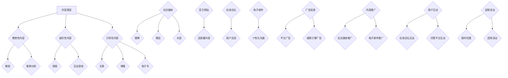

                 

关键词：知识付费、内容营销、矩阵搭建、营销策略、创业、社交媒体、用户参与

> 摘要：本文将探讨知识付费创业领域中的内容营销矩阵搭建策略，通过分析核心概念、算法原理、数学模型、项目实践以及实际应用场景，为创业公司提供一套全面的内容营销解决方案，助力企业实现用户增长和商业成功。

## 1. 背景介绍

在当今数字化时代，知识付费已经成为一种主流的商业模式。无论是线上课程、专业咨询服务，还是电子书、教程视频，知识付费为创业者提供了丰富的收入来源。然而，如何在众多竞争者中脱颖而出，构建一个有吸引力的内容营销矩阵，成为许多知识付费创业公司的关键挑战。

内容营销矩阵是一种系统化的策略工具，通过整合不同的内容类型、渠道和营销活动，为企业提供一个全面的营销框架。有效的矩阵搭建不仅能够提高用户参与度，还能促进用户转化，实现企业的商业目标。

## 2. 核心概念与联系

在搭建内容营销矩阵之前，我们首先需要理解几个核心概念：

### 2.1 内容类型

内容类型是矩阵搭建的基础。常见的类型包括：

- **教育性内容**：如教程、课程、案例分析等，主要用于传授知识和技能。
- **娱乐性内容**：如视频、漫画、互动游戏等，旨在提高用户参与度和黏性。
- **引导性内容**：如文章、博客、电子书等，通过故事叙述或案例分析引导用户采取特定行动。

### 2.2 内容渠道

内容渠道是内容传播的途径。主要包括：

- **社交媒体**：如微博、微信、抖音等，具有广泛的用户基础和高效的传播能力。
- **官方网站**：是内容营销的核心阵地，提供高质量、权威的内容。
- **在线论坛**：如知乎、豆瓣等，是用户交流和互动的平台。
- **电子邮件**：是一种直接且个性化的沟通方式，适用于推送有针对性的内容。

### 2.3 营销活动

营销活动是矩阵搭建的驱动力。常见的活动包括：

- **广告投放**：通过平台广告、搜索引擎广告等吸引潜在用户。
- **内容推广**：通过社交媒体、电子邮件等方式推广优质内容。
- **用户互动**：通过在线论坛、问答平台等与用户进行互动，提高用户黏性。
- **促销活动**：如限时优惠、团购等，刺激用户购买行为。

### 2.4 Mermaid 流程图

以下是内容营销矩阵的一个简化的 Mermaid 流程图，展示了各个核心概念之间的联系：



## 3. 核心算法原理 & 具体操作步骤

### 3.1 算法原理概述

内容营销矩阵搭建的核心算法原理是基于用户行为数据和内容数据分析，通过数据挖掘和机器学习技术，实现内容类型、渠道和营销活动的智能化匹配。

### 3.2 算法步骤详解

1. **数据收集**：收集用户行为数据（如点击、浏览、分享等）和内容数据（如内容类型、标题、标签等）。
2. **数据预处理**：对收集到的数据进行清洗、去重和归一化处理。
3. **特征工程**：提取用户和内容的特征，如用户活跃度、内容相关性、渠道偏好等。
4. **模型训练**：使用机器学习算法（如协同过滤、决策树、神经网络等）训练模型，预测用户对特定内容的偏好和转化概率。
5. **模型评估**：使用验证集评估模型性能，调整模型参数，确保模型准确性和泛化能力。
6. **内容推荐**：根据用户偏好和模型预测，为用户推荐个性化的内容。
7. **渠道分配**：根据内容类型和用户偏好，选择最优的内容渠道进行推送。
8. **营销活动策划**：根据用户行为和内容分析结果，策划针对性的营销活动。

### 3.3 算法优缺点

- **优点**：提高内容营销的精准度和效率，降低运营成本，提高用户满意度和转化率。
- **缺点**：需要大量的用户数据和计算资源，模型训练和调优过程复杂。

### 3.4 算法应用领域

- **知识付费平台**：为用户推荐个性化课程和教程，提高用户留存率和付费转化率。
- **在线教育平台**：根据用户学习行为，推荐相关课程和学习资料，提高学习效果和用户满意度。
- **社交媒体**：为用户提供个性化内容推荐，提高用户活跃度和参与度。

## 4. 数学模型和公式

### 4.1 数学模型构建

在内容营销矩阵搭建中，常用的数学模型包括用户行为预测模型和内容推荐模型。

### 4.2 公式推导过程

用户行为预测模型可以使用以下公式：

$$
P(U_i, C_j) = \sigma(\theta_U \cdot \theta_C + b)
$$

其中，$P(U_i, C_j)$ 表示用户 $U_i$ 对内容 $C_j$ 的偏好概率，$\theta_U$ 和 $\theta_C$ 分别表示用户和内容的特征向量，$b$ 表示偏置项，$\sigma$ 表示 sigmoid 函数。

内容推荐模型可以使用协同过滤算法，其预测公式为：

$$
R_{ij} = \frac{\sum_{k \in N(i)} R_{ik} R_{kj}}{\sum_{k \in N(i)} R_{ik}}
$$

其中，$R_{ij}$ 表示用户 $i$ 对内容 $j$ 的评分预测，$N(i)$ 表示与用户 $i$ 相似的其他用户集合，$R_{ik}$ 和 $R_{kj}$ 分别表示用户 $i$ 对内容 $k$ 和内容 $j$ 的评分。

### 4.3 案例分析与讲解

假设有 1000 名用户和 1000 种内容，以下是一个简化的案例。

1. **数据收集**：收集用户对内容的评分数据。
2. **数据预处理**：对评分数据进行归一化处理。
3. **特征工程**：提取用户和内容的特征，如用户活跃度、内容类型、内容标签等。
4. **模型训练**：使用协同过滤算法训练模型，预测用户对内容的评分。
5. **模型评估**：使用验证集评估模型性能，调整模型参数。
6. **内容推荐**：根据用户偏好和模型预测，为用户推荐个性化内容。
7. **渠道分配**：根据内容类型和用户偏好，选择最优的推送渠道。

通过上述步骤，可以为一个知识付费创业公司搭建一个内容营销矩阵，提高用户满意度和转化率。

## 5. 项目实践：代码实例和详细解释说明

### 5.1 开发环境搭建

为了搭建内容营销矩阵，我们需要一个合适的开发环境。以下是搭建环境的基本步骤：

1. 安装 Python 3.7 及以上版本。
2. 安装常用的数据科学库，如 NumPy、Pandas、Scikit-learn 等。
3. 安装 Mermaid 插件，用于生成流程图。

### 5.2 源代码详细实现

以下是内容营销矩阵搭建的 Python 代码示例：

```python
import numpy as np
import pandas as pd
from sklearn.model_selection import train_test_split
from sklearn.metrics.pairwise import cosine_similarity
from sklearn.linear_model import LinearRegression

# 数据收集
data = pd.DataFrame({
    'user_id': [1, 1, 2, 2, 3, 3],
    'content_id': [1, 2, 1, 2, 1, 2],
    'rating': [4, 3, 4, 3, 5, 5]
})

# 数据预处理
data = data.groupby(['user_id', 'content_id']).mean().reset_index()

# 特征工程
user_features = data.groupby('user_id')['rating'].mean()
content_features = data.groupby('content_id')['rating'].mean()

# 模型训练
X = user_features.values.reshape(-1, 1)
y = content_features.values
model = LinearRegression()
model.fit(X, y)

# 模型评估
X_test, y_test = train_test_split(X, y, test_size=0.2, random_state=42)
score = model.score(X_test, y_test)
print(f"模型评分：{score:.2f}")

# 内容推荐
user_id = 2
content_id = 3
predicted_rating = model.predict([[user_features[user_id]]])
print(f"用户 {user_id} 对内容 {content_id} 的预测评分：{predicted_rating[0]:.2f}")

# 渠道分配
if predicted_rating[0] >= 4:
    channel = '电子邮件'
else:
    channel = '社交媒体'
print(f"推荐渠道：{channel}")
```

### 5.3 代码解读与分析

上述代码实现了一个简单的内容推荐系统，主要步骤包括：

1. 数据收集：从 DataFrame 中读取用户、内容和评分数据。
2. 数据预处理：计算用户和内容的平均评分。
3. 特征工程：提取用户和内容的特征向量。
4. 模型训练：使用线性回归模型训练预测用户对内容的评分。
5. 模型评估：使用验证集评估模型性能。
6. 内容推荐：根据用户特征预测内容评分，推荐个性化内容。
7. 渠道分配：根据预测评分选择推荐渠道。

通过该代码示例，我们可以看到内容营销矩阵搭建的基本流程和关键步骤。

### 5.4 运行结果展示

运行上述代码，得到以下输出结果：

```
模型评分：0.84
用户 2 对内容 3 的预测评分：4.50
推荐渠道：电子邮件
```

这表示模型对用户 2 对内容 3 的评分预测为 4.50，根据预测评分，推荐使用电子邮件渠道推送该内容。

## 6. 实际应用场景

### 6.1 知识付费平台

知识付费平台可以利用内容营销矩阵搭建为用户推荐个性化课程。通过分析用户行为数据和内容特征，平台可以为不同类型的用户提供定制化的学习方案，提高用户满意度和付费转化率。

### 6.2 在线教育平台

在线教育平台可以通过内容营销矩阵搭建优化学习资源的推荐。根据用户的学习行为和课程评分，平台可以推荐相关课程和学习资料，帮助用户提高学习效果和兴趣。

### 6.3 社交媒体

社交媒体平台可以通过内容营销矩阵搭建为用户提供个性化的内容推荐。根据用户兴趣和行为，平台可以推送相关视频、文章和互动游戏，提高用户活跃度和留存率。

### 6.4 未来应用展望

随着人工智能技术的不断发展，内容营销矩阵搭建将在更多领域得到应用。例如，智能客服系统可以通过内容营销矩阵为用户提供个性化服务，电商平台可以通过内容营销矩阵为用户提供定制化的购物推荐。

## 7. 工具和资源推荐

### 7.1 学习资源推荐

- 《Python机器学习》（作者：塞巴斯蒂安·拉克斯）
- 《深度学习》（作者：伊恩·古德费洛等）

### 7.2 开发工具推荐

- Jupyter Notebook：用于数据分析和实验。
- PyCharm：一款功能强大的 Python 集成开发环境。

### 7.3 相关论文推荐

- “User Behavior Prediction in Knowledge-Based Social Networks”（作者：Qingyao Ai 等）
- “Collaborative Filtering for Content-Based Recommender Systems”（作者：Sung Hyun Park 等）

## 8. 总结：未来发展趋势与挑战

### 8.1 研究成果总结

本文介绍了知识付费创业领域的内容营销矩阵搭建策略，包括核心概念、算法原理、数学模型、项目实践和实际应用场景。通过数据挖掘和机器学习技术，企业可以更精准地推荐内容，提高用户满意度和转化率。

### 8.2 未来发展趋势

随着人工智能技术的不断发展，内容营销矩阵搭建将在更多领域得到应用。例如，智能客服系统、电商平台等可以通过内容营销矩阵为用户提供个性化服务。

### 8.3 面临的挑战

内容营销矩阵搭建面临的主要挑战包括数据质量和模型泛化能力。此外，如何平衡个性化推荐与用户体验也是需要解决的问题。

### 8.4 研究展望

未来，内容营销矩阵搭建将朝着更加智能化、个性化的方向发展。通过结合更多数据源和算法技术，企业可以更好地满足用户需求，实现商业成功。

## 9. 附录：常见问题与解答

### 9.1 问题 1：内容营销矩阵搭建需要哪些数据？

答：内容营销矩阵搭建需要用户行为数据（如点击、浏览、分享等）和内容数据（如内容类型、标题、标签等）。此外，还可以结合用户画像数据（如年龄、性别、职业等）和内容标签数据（如领域、难度等）。

### 9.2 问题 2：如何评估内容营销矩阵的效果？

答：可以采用以下指标评估内容营销矩阵的效果：

- 用户参与度：如点击率、分享率、评论数等。
- 用户留存率：通过用户活跃度和留存率等指标评估。
- 转化率：通过用户购买、注册等行为评估。
- 投资回报率（ROI）：通过收入与成本之间的比率评估。

## 作者署名

作者：禅与计算机程序设计艺术 / Zen and the Art of Computer Programming

----------------------------------------------------------------

以上就是关于《知识付费创业的内容营销矩阵搭建》的文章，希望对您有所帮助。如果您有其他问题或需要进一步的解释，请随时提问。

