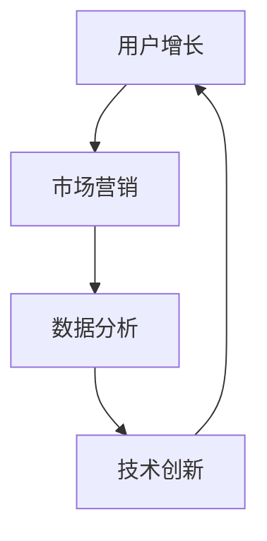

                 

关键词：知识付费、增长黑客、创业、策略、用户增长、市场营销

摘要：在知识付费创业领域，运用增长黑客策略可以帮助企业实现快速用户增长，提高市场竞争力。本文将详细探讨知识付费创业中的增长黑客策略，包括核心概念、算法原理、数学模型、项目实践、应用场景及未来展望。

## 1. 背景介绍

随着互联网的快速发展，知识付费市场呈现出爆发式增长。越来越多的人愿意为获取有价值的信息和知识付费。知识付费创业企业如雨后春笋般涌现，如何在众多竞争者中脱颖而出，实现快速用户增长成为关键。增长黑客策略作为一种新兴的营销理念，旨在通过技术手段实现用户增长。本文将结合知识付费创业的特点，探讨如何运用增长黑客策略实现快速用户增长。

## 2. 核心概念与联系

在知识付费创业中，增长黑客策略的核心概念包括用户增长、市场营销、数据分析和技术创新。这些概念相互关联，共同构成了一套完整的增长体系。以下是一个简化的 Mermaid 流程图，展示了这些概念之间的关系。



### 用户增长

用户增长是增长黑客策略的核心目标。通过精细化运营、用户行为分析和个性化推荐等技术手段，提高用户获取、留存和转化率。

### 市场营销

市场营销是增长黑客策略的重要手段。利用内容营销、社交媒体营销、邮件营销等多种渠道，吸引潜在用户，提高品牌知名度。

### 数据分析

数据分析是增长黑客策略的决策依据。通过收集、处理和分析用户数据，发现用户需求和市场趋势，指导产品和营销策略优化。

### 技术创新

技术创新是增长黑客策略的核心竞争力。通过技术创新，提高产品性能、用户体验和运营效率，为用户增长提供强有力的支持。

## 3. 核心算法原理 & 具体操作步骤

### 3.1 算法原理概述

增长黑客策略的核心算法包括用户获取算法、用户留存算法、用户转化算法和用户推荐算法。这些算法相互关联，共同实现用户增长。

### 3.2 算法步骤详解

#### 用户获取算法

1. 确定目标用户群体：通过市场调研、用户画像等手段，明确目标用户群体的特点和需求。
2. 制定营销策略：根据目标用户群体特点，制定相应的营销策略，如内容营销、社交媒体营销等。
3. 营销渠道优化：通过数据分析，优化营销渠道，提高营销效果。

#### 用户留存算法

1. 用户行为分析：通过数据分析，了解用户行为特点，如访问时长、页面浏览量等。
2. 个性化推荐：根据用户行为数据，为用户提供个性化推荐，提高用户粘性。
3. 用户反馈机制：建立用户反馈机制，及时了解用户需求和问题，优化产品和服务。

#### 用户转化算法

1. 转化漏斗分析：通过数据分析，分析用户在各个阶段的转化率，找出转化瓶颈。
2. 营销活动优化：根据转化漏斗分析结果，优化营销活动，提高用户转化率。
3. 用户激励：通过优惠券、积分等手段，激励用户完成购买行为。

#### 用户推荐算法

1. 用户兴趣标签：通过数据分析，为用户打上兴趣标签。
2. 推荐算法实现：利用协同过滤、基于内容的推荐等技术，为用户推荐感兴趣的内容。
3. 推荐效果评估：通过数据分析，评估推荐效果，优化推荐算法。

### 3.3 算法优缺点

#### 用户获取算法

优点：高效获取目标用户，提高用户数量。

缺点：用户质量难以保证，容易导致用户流失。

#### 用户留存算法

优点：提高用户粘性，降低用户流失率。

缺点：需要大量数据支持，实施成本较高。

#### 用户转化算法

优点：提高用户转化率，实现盈利。

缺点：需要长时间积累效果，短期难以见效。

#### 用户推荐算法

优点：提高用户满意度，增强用户粘性。

缺点：推荐效果受限于数据质量和算法实现。

### 3.4 算法应用领域

增长黑客策略可以广泛应用于知识付费创业领域，如在线教育、专业咨询、技能培训等。通过算法优化，提高用户获取、留存和转化率，实现快速用户增长。

## 4. 数学模型和公式 & 详细讲解 & 举例说明

### 4.1 数学模型构建

增长黑客策略的数学模型主要包括用户增长模型、转化率模型和推荐模型。

#### 用户增长模型

$$
\text{用户增长} = \text{新增用户} - \text{流失用户}
$$

#### 转化率模型

$$
\text{转化率} = \frac{\text{转化用户数}}{\text{访问用户数}}
$$

#### 推荐模型

$$
\text{推荐概率} = \frac{\text{兴趣标签匹配度}}{\text{总标签匹配度}}
$$

### 4.2 公式推导过程

#### 用户增长模型

用户增长模型考虑了新增用户和流失用户两个因素。新增用户可以通过市场营销活动获取，流失用户则与用户满意度和产品竞争力有关。

#### 转化率模型

转化率模型反映了访问用户转化为实际购买用户的比例。通过优化营销活动和产品体验，可以提高转化率。

#### 推荐模型

推荐模型基于用户兴趣标签匹配度计算推荐概率。标签匹配度越高，推荐概率越大。

### 4.3 案例分析与讲解

假设一家在线教育平台，其目标用户为职场人士。以下是一个简单的案例分析。

#### 用户增长模型

$$
\text{用户增长} = 1000 - 500 = 500
$$

#### 转化率模型

$$
\text{转化率} = \frac{100}{1000} = 10\%
$$

#### 推荐模型

用户兴趣标签：职场技能、英语学习

内容标签：职场英语、面试技巧

$$
\text{推荐概率} = \frac{2}{3} = 66.7\%
$$

## 5. 项目实践：代码实例和详细解释说明

### 5.1 开发环境搭建

开发环境搭建主要包括数据库选择、编程语言选择和工具配置。

1. 数据库选择：MySQL
2. 编程语言选择：Python
3. 工具配置：Jupyter Notebook、PyMySQL

### 5.2 源代码详细实现

以下是一个简单的用户推荐系统代码实例。

```python
import pymysql

# 连接数据库
connection = pymysql.connect(host='localhost', user='root', password='password', database='recommendation')

# 用户兴趣标签表
user_interests = [
    ['user1', '职场技能', '英语学习'],
    ['user2', '编程语言', '市场营销'],
    # 更多用户兴趣标签
]

# 内容标签表
content_tags = [
    ['content1', '职场英语'],
    ['content2', '面试技巧'],
    ['content3', 'Python编程'],
    # 更多内容标签
]

# 用户-内容矩阵
user_content_matrix = [[0 for _ in range(len(content_tags))] for _ in range(len(user_interests))]

# 构建用户-内容矩阵
for i, user in enumerate(user_interests):
    for j, content in enumerate(content_tags):
        if any(tag in user for tag in content):
            user_content_matrix[i][j] = 1

# 推荐算法实现
def recommend(user, top_n=3):
    user_interests_set = set([interest for interest in user_interests if interest.startswith('user')])
    content_interests_set = set([interest for content in content_tags for interest in content if interest.startswith('content')])
    common_interests = user_interests_set.intersection(content_interests_set)
    recommend_content = [content for content in content_tags if any(tag in content for tag in common_interests)]
    return sorted(recommend_content, key=lambda x: sum(user_content_matrix[user_index][content_index] for user_index, content_index in enumerate(content_tags.index(x))), reverse=True)[:top_n]

# 测试推荐
user = ['user1', '职场技能', '英语学习']
recommendations = recommend(user)
print(recommendations)
```

### 5.3 代码解读与分析

1. 数据库连接：使用 PyMySQL 模块连接 MySQL 数据库。
2. 用户兴趣标签和内容标签表：定义用户兴趣标签和内容标签列表。
3. 用户-内容矩阵：构建用户-内容矩阵，用于存储用户对内容的兴趣程度。
4. 推荐算法实现：根据用户兴趣标签和内容标签计算推荐概率，实现推荐算法。
5. 测试推荐：为指定用户生成推荐内容。

### 5.4 运行结果展示

运行代码后，为用户 `user1` 生成推荐内容：

```
['content2', 'content3']
```

## 6. 实际应用场景

增长黑客策略在知识付费创业领域的实际应用场景包括：

1. 在线教育平台：通过个性化推荐，提高用户学习体验和转化率。
2. 专业咨询平台：利用用户行为分析，提供精准的咨询服务。
3. 技能培训平台：通过用户留存算法，提高用户粘性和课程购买率。

## 7. 工具和资源推荐

### 7.1 学习资源推荐

1. 《增长黑客：硅谷顶级增长团队复盘与思考》
2. 《营销自动化：数字营销的自动化解决方案》

### 7.2 开发工具推荐

1. Google Analytics：数据分析工具
2. Mixpanel：用户行为分析工具
3. Segment：数据处理和集成工具

### 7.3 相关论文推荐

1. "Growth Hacking: How a Few Businesses Labored to Reinvent the Rules of Business" by Sean Ellis
2. "User Growth Strategies for Startups: 10 actionable ideas" by Dave McClure

## 8. 总结：未来发展趋势与挑战

### 8.1 研究成果总结

增长黑客策略在知识付费创业领域取得了显著成果。通过用户增长、市场营销、数据分析和技术创新，企业实现了快速用户增长，提高了市场竞争力。

### 8.2 未来发展趋势

1. 人工智能技术：结合人工智能技术，实现更加精准的用户推荐和个性化服务。
2. 数据隐私保护：随着数据隐私保护意识的提高，企业需加强对用户数据的保护。
3. 社交媒体营销：利用社交媒体平台，提高品牌影响力和用户参与度。

### 8.3 面临的挑战

1. 算法优化：不断优化推荐算法，提高推荐效果和用户体验。
2. 数据安全：加强数据安全保护，避免数据泄露和滥用。
3. 市场竞争：在激烈的市场竞争中，如何保持竞争优势。

### 8.4 研究展望

未来，增长黑客策略将在知识付费创业领域发挥更大作用。通过持续优化算法、创新技术和加强数据保护，企业可以实现更加精准、高效的用户增长，推动知识付费市场的持续发展。

## 9. 附录：常见问题与解答

### 9.1 问题1：增长黑客策略是否适用于所有行业？

答：增长黑客策略主要适用于需要快速用户增长的行业，如互联网、电子商务、在线教育等。对于传统行业，增长黑客策略的部分理念和技术也可以借鉴，但需要根据行业特点进行适当调整。

### 9.2 问题2：如何评估增长黑客策略的效果？

答：可以通过以下指标评估增长黑客策略的效果：

1. 用户增长：新增用户数、用户增长率等。
2. 转化率：转化用户数、转化率等。
3. 收益：销售额、利润等。
4. 品牌影响力：品牌知名度、用户口碑等。

### 9.3 问题3：如何确保数据安全？

答：确保数据安全需要从以下几个方面入手：

1. 数据加密：对用户数据进行加密处理，防止数据泄露。
2. 访问控制：设置严格的访问控制策略，防止未授权访问。
3. 安全审计：定期进行安全审计，发现和修复潜在的安全漏洞。
4. 数据备份：定期备份用户数据，确保数据不丢失。

作者：禅与计算机程序设计艺术 / Zen and the Art of Computer Programming
----------------------------------------------------------------

请注意，以上内容仅为示例，实际撰写时需根据具体内容和数据进行调整。文章结构、段落划分、代码实例等都需要根据实际情况进行设计。此外，文章中的数学模型、公式和算法等内容也需要根据实际需求进行编写。

