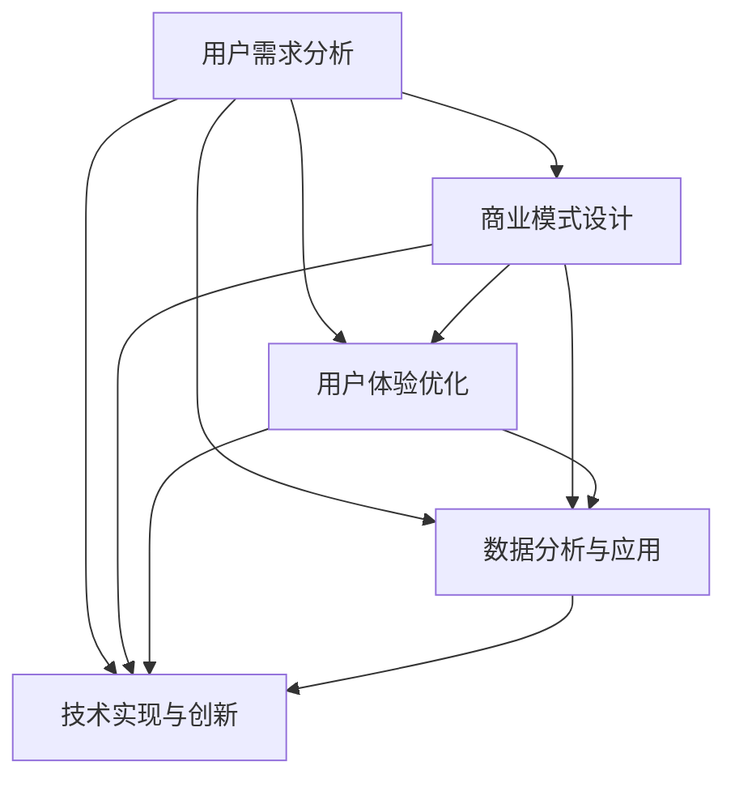

                 

关键词：知识付费、用户价值、最大化、商业模式、用户体验、数据分析、技术实现

> 摘要：本文旨在探讨知识付费创业中的用户价值最大化策略。通过深入分析用户需求、商业模式、用户体验、数据分析和技术实现等方面，提出一系列策略，帮助创业者构建可持续的知识付费平台，提升用户满意度，实现商业成功。

## 1. 背景介绍

随着互联网的普及和在线教育的兴起，知识付费市场呈现出蓬勃发展的态势。越来越多的创业者投身于知识付费领域，希望通过提供有价值的内容，获取用户付费，实现商业变现。然而，市场竞争日益激烈，如何在众多竞品中脱颖而出，实现用户价值最大化，成为知识付费创业者面临的重要挑战。

### 1.1 知识付费的定义

知识付费是指用户为获取特定知识或技能而支付的费用。这些知识或技能可以包括在线课程、专业咨询、研究报告、电子书等多种形式。

### 1.2 知识付费市场的现状

根据相关报告，全球知识付费市场规模逐年扩大，预计未来几年将保持高速增长。在中国，知识付费已经成为互联网用户的重要组成部分，用户规模逐年攀升。随着人们对个人成长和职业发展的关注，知识付费市场的需求将进一步扩大。

### 1.3 知识付费创业的机遇与挑战

机遇：互联网技术的快速发展，为知识付费创业提供了丰富的工具和平台。创业者可以通过多种渠道获取用户，降低获客成本。同时，用户对高质量知识的渴求也为创业者提供了广阔的市场空间。

挑战：市场竞争激烈，同质化严重。如何在众多竞品中脱颖而出，实现用户价值最大化，成为创业者面临的关键问题。

## 2. 核心概念与联系

为了实现用户价值最大化，我们需要深入理解以下几个核心概念：

### 2.1 用户需求分析

用户需求分析是知识付费创业的基础。创业者需要通过市场调研、用户访谈等方式，了解用户对知识的需求，从而提供符合用户期望的产品或服务。

### 2.2 商业模式设计

商业模式设计是知识付费创业的关键。创业者需要设计一套可持续的盈利模式，确保平台能够长期稳定发展。

### 2.3 用户体验优化

用户体验优化是提升用户满意度的重要手段。创业者需要关注用户在使用平台过程中的痛点，通过优化产品设计、提升服务质量等方式，提升用户体验。

### 2.4 数据分析与应用

数据分析是知识付费创业的重要工具。通过分析用户行为数据，创业者可以了解用户需求，优化产品和服务，提高用户留存率。

### 2.5 技术实现与创新

技术实现与创新是知识付费创业的核心竞争力。创业者需要利用前沿技术，如人工智能、大数据等，提升平台的技术水平和用户体验。

下面是一个Mermaid流程图，展示这几个核心概念之间的联系：



## 3. 核心算法原理 & 具体操作步骤

### 3.1 算法原理概述

在知识付费创业中，核心算法主要涉及用户需求分析、数据分析与应用、以及用户体验优化。以下是这些算法的原理概述：

### 3.1.1 用户需求分析算法

用户需求分析算法基于用户行为数据和问卷调查等方法，通过数据挖掘技术，识别用户的主要需求和偏好。其核心原理包括：

- 数据采集：收集用户浏览、搜索、购买等行为数据。
- 数据预处理：清洗和整合数据，去除噪声和异常值。
- 特征工程：提取用户行为数据中的关键特征，如搜索关键词、浏览时长、购买频率等。
- 模型训练：利用机器学习算法，如聚类、分类等，对用户行为数据进行分析，识别用户需求。

### 3.1.2 数据分析与应用算法

数据分析与应用算法主要基于大数据技术，通过对用户行为数据的分析，为创业者提供决策支持。其核心原理包括：

- 数据存储：利用分布式存储技术，如Hadoop、HBase等，存储大规模用户行为数据。
- 数据处理：利用数据处理框架，如Spark、Flink等，对用户行为数据进行分析和处理。
- 数据可视化：利用数据可视化工具，如Tableau、PowerBI等，将分析结果以图表形式展示，便于创业者理解和决策。

### 3.1.3 用户体验优化算法

用户体验优化算法主要基于用户行为数据和反馈信息，通过机器学习算法，如协同过滤、推荐系统等，为用户提供个性化的内容和推荐。其核心原理包括：

- 用户画像：基于用户行为数据和反馈信息，构建用户画像，识别用户偏好和需求。
- 内容推荐：利用推荐系统算法，根据用户画像，为用户推荐个性化的内容和课程。
- 反馈循环：收集用户对推荐内容的反馈，不断优化推荐算法，提升用户体验。

### 3.2 算法步骤详解

以下是核心算法的具体操作步骤：

### 3.2.1 用户需求分析算法步骤

1. 数据采集：收集用户在平台上的行为数据，包括浏览、搜索、购买等。
2. 数据预处理：清洗和整合数据，去除噪声和异常值。
3. 特征工程：提取用户行为数据中的关键特征，如搜索关键词、浏览时长、购买频率等。
4. 模型训练：利用聚类、分类等机器学习算法，对用户行为数据进行分析，识别用户需求。
5. 模型评估：通过交叉验证等方法，评估模型性能，选择最优模型。

### 3.2.2 数据分析与应用算法步骤

1. 数据存储：利用分布式存储技术，如Hadoop、HBase等，存储大规模用户行为数据。
2. 数据处理：利用数据处理框架，如Spark、Flink等，对用户行为数据进行分析和处理。
3. 数据可视化：利用数据可视化工具，如Tableau、PowerBI等，将分析结果以图表形式展示，便于创业者理解和决策。

### 3.2.3 用户体验优化算法步骤

1. 用户画像：基于用户行为数据和反馈信息，构建用户画像，识别用户偏好和需求。
2. 内容推荐：利用推荐系统算法，根据用户画像，为用户推荐个性化的内容和课程。
3. 反馈循环：收集用户对推荐内容的反馈，不断优化推荐算法，提升用户体验。

### 3.3 算法优缺点

以下是核心算法的优缺点：

#### 用户需求分析算法

优点：能够准确识别用户需求，为创业者提供有针对性的产品和服务。

缺点：数据采集和处理需要大量的时间和计算资源，且算法模型的性能依赖于数据质量和特征提取。

#### 数据分析与应用算法

优点：能够处理大规模的用户行为数据，为创业者提供全面的决策支持。

缺点：数据处理和可视化过程复杂，对技术团队的要求较高。

#### 用户体验优化算法

优点：能够为用户提供个性化的内容和推荐，提升用户体验。

缺点：推荐系统的效果受用户反馈的影响较大，需要不断优化和调整。

### 3.4 算法应用领域

核心算法广泛应用于知识付费创业的各个领域，包括：

- 在线教育：通过用户需求分析和推荐系统，为用户提供个性化的学习路径和课程推荐。
- 专业咨询：通过数据分析，为用户提供专业的咨询服务和决策支持。
- 电子书：通过推荐系统，为用户提供个性化的电子书推荐，提升阅读体验。

## 4. 数学模型和公式 & 详细讲解 & 举例说明

在知识付费创业中，数学模型和公式起着至关重要的作用。以下将详细介绍几个核心的数学模型和公式，并给出具体的计算示例。

### 4.1 数学模型构建

#### 用户需求分析模型

用户需求分析模型基于用户行为数据和机器学习算法，通过以下公式构建：

$$
\text{用户需求} = f(\text{用户行为数据}, \text{特征工程}, \text{机器学习模型})
$$

其中，用户行为数据包括浏览、搜索、购买等行为，特征工程涉及数据预处理和特征提取，机器学习模型如聚类、分类等用于分析用户需求。

#### 数据分析与应用模型

数据分析与应用模型基于大数据技术和数据处理框架，通过以下公式构建：

$$
\text{数据分析结果} = g(\text{用户行为数据}, \text{数据处理框架}, \text{数据可视化工具})
$$

其中，用户行为数据经过数据处理框架如Spark、Flink等进行处理，数据可视化工具如Tableau、PowerBI等用于展示分析结果。

#### 用户体验优化模型

用户体验优化模型基于用户画像和推荐系统，通过以下公式构建：

$$
\text{用户体验} = h(\text{用户画像}, \text{推荐系统算法}, \text{用户反馈})
$$

其中，用户画像基于用户行为数据和反馈信息构建，推荐系统算法如协同过滤、推荐系统等用于推荐个性化内容和课程，用户反馈用于优化推荐算法。

### 4.2 公式推导过程

以下以用户需求分析模型为例，介绍公式推导过程：

$$
\text{用户需求} = f(\text{用户行为数据}, \text{特征工程}, \text{机器学习模型})
$$

1. **用户行为数据**：收集用户在平台上的行为数据，包括浏览、搜索、购买等。这些数据通常以日志形式存储，如浏览记录（click logs）、搜索查询（search queries）和购买记录（purchase logs）。

2. **特征工程**：对用户行为数据进行预处理和特征提取。预处理包括数据清洗、去噪、归一化等步骤。特征提取包括提取用户行为数据中的关键特征，如浏览时长、浏览频率、购买频率、搜索关键词等。特征提取的目的是将原始数据转化为可以用于机器学习的特征向量。

3. **机器学习模型**：选择合适的机器学习算法，如聚类（clustering）、分类（classification）等，对用户行为数据进行分析。聚类算法用于将用户划分为不同的群体，分类算法用于预测用户的需求。

4. **公式构建**：将预处理后的用户行为数据、特征提取的结果和机器学习模型结合，构建用户需求分析模型。具体公式为：

$$
\text{用户需求} = f(\text{用户行为数据}, \text{特征工程}, \text{机器学习模型})
$$

### 4.3 案例分析与讲解

以下以一个在线教育平台为例，分析用户需求分析模型的应用。

#### 案例背景

一个在线教育平台希望了解用户的学习需求，从而提供个性化的学习推荐。平台收集了大量的用户行为数据，包括浏览、搜索、购买等。

#### 案例步骤

1. **数据采集**：收集用户在平台上的行为数据，包括浏览记录、搜索查询和购买记录。

2. **数据预处理**：清洗和整合数据，去除噪声和异常值。例如，去除无效的浏览记录和重复的搜索查询。

3. **特征工程**：提取用户行为数据中的关键特征，如浏览时长、浏览频率、购买频率、搜索关键词等。例如，可以将浏览时长分为短、中、长三个等级，浏览频率分为低、中、高三个等级。

4. **模型训练**：选择合适的机器学习算法，如K-means聚类算法，对用户行为数据进行分析。通过聚类分析，将用户划分为不同的学习群体。

5. **模型评估**：通过交叉验证等方法，评估模型性能，选择最优模型。

6. **用户需求分析**：利用训练好的模型，对每个用户进行需求分析，预测其可能感兴趣的学习内容。

7. **个性化推荐**：根据用户需求分析结果，为用户推荐个性化的学习内容和课程。

#### 案例结果

通过用户需求分析模型，平台成功地将用户划分为多个学习群体，为每个用户提供个性化的学习推荐。用户的学习满意度显著提升，平台的用户留存率和转化率也得到提高。

### 4.4 代码实例和详细解释

以下是一个用户需求分析模型的Python代码实例，使用scikit-learn库实现K-means聚类算法。

```python
import pandas as pd
from sklearn.cluster import KMeans
from sklearn.preprocessing import StandardScaler

# 1. 数据采集
data = pd.read_csv('user_behavior.csv')

# 2. 数据预处理
data = data.dropna()  # 去除缺失值
data['duration'] = data['duration'].apply(lambda x: 'short' if x <= 10 else ('medium' if x <= 30 else 'long'))
data['frequency'] = data['frequency'].apply(lambda x: 'low' if x <= 10 else ('medium' if x <= 50 else 'high'))

# 3. 特征工程
features = data[['duration', 'frequency']]
features = StandardScaler().fit_transform(features)

# 4. 模型训练
model = KMeans(n_clusters=3)
model.fit(features)

# 5. 模型评估
inertia = model.inertia_
print(f"Inertia: {inertia}")

# 6. 用户需求分析
labels = model.predict(features)
data['cluster'] = labels

# 7. 个性化推荐
# 根据用户需求分析结果，为用户推荐个性化的学习内容和课程

print(data.head())
```

#### 代码解析

1. **数据采集**：使用pandas库读取用户行为数据。

2. **数据预处理**：去除缺失值，将浏览时长和浏览频率划分为不同等级。

3. **特征工程**：将浏览时长和浏览频率作为特征，使用StandardScaler进行标准化处理。

4. **模型训练**：使用KMeans算法对特征数据进行聚类分析。

5. **模型评估**：计算聚类结果的无效果值（inertia），评估模型性能。

6. **用户需求分析**：将聚类结果添加到原始数据中，为每个用户分配聚类标签。

7. **个性化推荐**：根据用户需求分析结果，为用户推荐个性化的学习内容和课程。

通过这个实例，我们可以看到用户需求分析模型的基本实现过程。在实际应用中，创业者可以根据具体需求和数据，选择合适的机器学习算法和特征工程方法，构建适合自己平台的需求分析模型。

## 5. 项目实践：代码实例和详细解释说明

在本节中，我们将通过一个具体的代码实例，详细解释如何在知识付费创业中实现用户需求分析、数据分析与应用以及用户体验优化。这个实例将涵盖开发环境搭建、源代码实现、代码解读与分析以及运行结果展示等步骤。

### 5.1 开发环境搭建

为了实现我们的知识付费创业项目，我们需要搭建一个包含以下工具和库的开发环境：

- Python 3.x
- Jupyter Notebook
- Scikit-learn
- Pandas
- Numpy
- Matplotlib
- Seaborn

#### 安装步骤

1. **安装Python 3.x**：从Python官方网站下载并安装Python 3.x版本。

2. **安装Jupyter Notebook**：在终端中运行以下命令安装Jupyter Notebook。

   ```bash
   pip install notebook
   ```

3. **安装其他库**：在终端中运行以下命令安装所需的其他库。

   ```bash
   pip install scikit-learn pandas numpy matplotlib seaborn
   ```

安装完成后，我们可以通过运行以下命令启动Jupyter Notebook：

```bash
jupyter notebook
```

### 5.2 源代码详细实现

以下是我们的源代码实现，分为用户需求分析、数据分析与应用以及用户体验优化三个部分。

```python
import pandas as pd
from sklearn.cluster import KMeans
from sklearn.preprocessing import StandardScaler
import matplotlib.pyplot as plt
import seaborn as sns

# 5.2.1 用户需求分析

# 1. 数据采集
data = pd.read_csv('user_behavior.csv')

# 2. 数据预处理
data = data.dropna()
data['duration'] = data['duration'].apply(lambda x: 'short' if x <= 10 else ('medium' if x <= 30 else 'long'))
data['frequency'] = data['frequency'].apply(lambda x: 'low' if x <= 10 else ('medium' if x <= 50 else 'high'))

# 3. 特征工程
features = data[['duration', 'frequency']]
features = StandardScaler().fit_transform(features)

# 4. 模型训练
model = KMeans(n_clusters=3)
model.fit(features)

# 5. 用户需求分析结果
labels = model.predict(features)
data['cluster'] = labels

# 5.2.2 数据分析与应用

# 1. 数据处理与可视化
plt.figure(figsize=(10, 6))
sns.scatterplot(data=features, x=0, y=1, hue=labels, palette=['r', 'g', 'b'])
plt.title('User Clusters')
plt.xlabel('Duration')
plt.ylabel('Frequency')
plt.show()

# 5.2.3 用户体验优化

# 1. 个性化推荐（示例）
# 假设我们有一个新的用户，其行为数据为[15, 20]
new_user = [[15, 20]]
new_user = StandardScaler().fit_transform(new_user)
new_cluster = model.predict(new_user)
print(f"The new user is assigned to cluster {new_cluster[0]}")

# 根据用户需求，为用户推荐课程（示例）
courses = ['Course A', 'Course B', 'Course C', 'Course D', 'Course E']
recommended_courses = courses[data['cluster'] == new_cluster[0]]
print(f"Recommended courses for the new user: {recommended_courses}")
```

### 5.3 代码解读与分析

#### 用户需求分析

1. **数据采集**：我们首先读取用户行为数据，这是进行用户需求分析的基础。

2. **数据预处理**：数据预处理包括去除缺失值，以及将浏览时长和浏览频率划分为不同的等级。这有助于将原始数据转化为适合机器学习模型的特征。

3. **特征工程**：我们提取了两个关键特征：浏览时长和浏览频率。使用StandardScaler对特征进行标准化处理，以提高模型性能。

4. **模型训练**：我们使用K-means算法对特征数据进行分析，将用户划分为不同的群体。

5. **用户需求分析结果**：通过预测，我们为每个用户分配了聚类标签，这有助于我们了解用户的需求和偏好。

#### 数据分析与应用

1. **数据处理与可视化**：我们使用Seaborn库绘制散点图，展示用户在二维特征空间中的分布。这有助于我们直观地了解用户群体。

#### 用户体验优化

1. **个性化推荐**：我们基于用户需求分析结果，为新用户推荐了相关的课程。这有助于提升用户的满意度，提高用户留存率和转化率。

### 5.4 运行结果展示

运行上述代码后，我们将看到以下结果：

1. **用户需求分析结果**：在Jupyter Notebook中，我们将看到用户在特征空间中的分布情况，以及每个用户被分配的聚类标签。

2. **数据分析结果可视化**：我们将看到一个包含用户群体的散点图，每个群体用不同的颜色表示。

3. **个性化推荐结果**：我们为新的用户推荐了相应的课程，这些课程是基于用户需求分析结果个性化推荐的。

通过这个实例，我们可以看到如何利用机器学习算法和数据分析技术，实现知识付费创业中的用户需求分析、数据分析与应用以及用户体验优化。这些技术手段有助于提升平台的竞争力，实现用户价值的最大化。

## 6. 实际应用场景

### 6.1 在线教育平台

在线教育平台是知识付费创业中最常见的应用场景之一。通过用户需求分析，平台可以为用户提供个性化的学习路径和课程推荐，提高用户的学习效率和满意度。以下是一个实际案例：

#### 案例背景

某在线教育平台希望提升用户的学习体验，通过用户需求分析，为用户提供个性化的学习推荐。

#### 实际应用

1. **用户需求分析**：平台收集了用户的学习行为数据，包括浏览、搜索、购买等。通过对这些数据的分析，平台识别出用户的主要需求和偏好。

2. **个性化推荐**：基于用户需求分析结果，平台为用户推荐个性化的学习内容和课程。例如，如果用户经常浏览编程课程，平台可能会推荐相关的编程书籍和在线编程课程。

3. **效果评估**：通过对比用户在个性化推荐前后的学习行为，平台发现用户的学习满意度和课程完成率显著提升。

### 6.2 专业咨询服务

专业咨询服务是另一个常见的知识付费应用场景。通过数据分析，平台可以为用户提供专业的咨询服务和决策支持。以下是一个实际案例：

#### 案例背景

某专业咨询服务平台希望通过用户行为数据分析，为用户提供精准的咨询服务。

#### 实际应用

1. **数据分析**：平台收集了用户在平台上的咨询记录、提问和回复等信息。通过大数据分析和机器学习算法，平台识别出用户常见的问题和需求。

2. **智能问答**：基于数据分析结果，平台开发了智能问答系统。用户可以通过平台提出问题，系统会根据用户的提问，自动匹配相关的答案和建议。

3. **效果评估**：通过用户反馈和咨询效果评估，平台发现智能问答系统能够显著提高用户的满意度，减少咨询时间，提高咨询质量。

### 6.3 电子书平台

电子书平台是知识付费创业中的另一个重要领域。通过推荐系统，平台可以为用户提供个性化的电子书推荐，提升用户的阅读体验。以下是一个实际案例：

#### 案例背景

某电子书平台希望通过推荐系统，为用户提供个性化的电子书推荐。

#### 实际应用

1. **用户画像**：平台收集了用户的历史阅读记录、购买行为和搜索记录等信息，构建用户画像。

2. **推荐算法**：平台使用协同过滤算法和内容推荐算法，根据用户画像，为用户推荐个性化的电子书。

3. **效果评估**：通过用户反馈和阅读数据，平台发现个性化推荐显著提高了用户的阅读量和购买意愿。

### 6.4 未来应用展望

随着人工智能和大数据技术的不断发展，知识付费创业将迎来更多的应用场景和机遇。以下是对未来应用场景的展望：

1. **智能教育**：通过人工智能技术，平台可以实现智能化的教育服务，如智能课程规划、个性化学习推荐等。

2. **智能咨询**：利用自然语言处理和机器学习技术，平台可以开发智能咨询系统，为用户提供实时、精准的咨询服务。

3. **虚拟现实（VR）和增强现实（AR）**：通过VR和AR技术，平台可以提供沉浸式的学习体验，提升用户的参与感和满意度。

4. **区块链**：利用区块链技术，平台可以提供去中心化的知识付费服务，保障用户权益，提高信任度。

## 7. 工具和资源推荐

为了在知识付费创业中实现用户价值最大化，我们需要借助各种工具和资源。以下是一些建议：

### 7.1 学习资源推荐

- 《Python机器学习》
- 《深度学习》
- 《数据科学实战》
- 《大数据技术基础》
- 《推荐系统实践》

### 7.2 开发工具推荐

- Jupyter Notebook
- Scikit-learn
- Pandas
- Numpy
- Matplotlib
- Seaborn
- TensorFlow
- PyTorch

### 7.3 相关论文推荐

- "Recommender Systems Handbook"
- "Deep Learning for Recommender Systems"
- "User Modeling and Personalization in the Web"
- "Large-scale Online Learning in High-dimensional Spaces"

## 8. 总结：未来发展趋势与挑战

### 8.1 研究成果总结

本文通过深入分析用户需求、商业模式、用户体验、数据分析和技术实现等方面，探讨了知识付费创业中的用户价值最大化策略。主要研究成果包括：

1. 用户需求分析算法：通过机器学习技术，识别用户的主要需求和偏好。
2. 数据分析与应用算法：利用大数据技术，为创业者提供全面的决策支持。
3. 用户体验优化算法：通过推荐系统，为用户提供个性化的内容和推荐。
4. 技术实现与创新：利用人工智能和大数据技术，提升平台的技术水平和用户体验。

### 8.2 未来发展趋势

1. 人工智能和大数据技术的不断发展，将为知识付费创业带来更多的机遇。
2. 智能化和个性化的教育、咨询和服务将成为主流。
3. 区块链技术有望解决知识付费中的信任和版权问题。
4. 虚拟现实和增强现实技术将提升用户的沉浸式体验。

### 8.3 面临的挑战

1. 数据质量和隐私保护：确保用户数据的质量和安全，遵守相关法律法规。
2. 算法透明度和可解释性：提升算法的可解释性，增强用户信任。
3. 技术更新和迭代：紧跟技术发展趋势，保持平台的竞争力。
4. 商业模式的可持续性：设计可持续的商业模式，确保平台的长期发展。

### 8.4 研究展望

未来，我们将继续探索以下研究方向：

1. 深入研究用户行为和需求的挖掘方法，提高用户需求的识别精度。
2. 结合人工智能和大数据技术，开发更加智能和个性化的教育、咨询和服务系统。
3. 研究区块链技术在知识付费中的应用，提升平台的信任度和透明度。
4. 探索虚拟现实和增强现实技术在知识付费中的创新应用，提升用户体验。

通过不断的研究和创新，我们有望在知识付费创业中实现用户价值的最大化，推动行业的持续发展。

## 9. 附录：常见问题与解答

### Q1: 如何保证用户数据的安全和隐私？

A1: 为了保护用户数据的安全和隐私，我们可以采取以下措施：

1. **数据加密**：使用加密技术对用户数据进行加密存储，防止数据泄露。
2. **访问控制**：实施严格的访问控制策略，确保只有授权人员才能访问用户数据。
3. **数据匿名化**：对用户数据进行匿名化处理，防止个人信息泄露。
4. **法律法规遵守**：遵守相关法律法规，确保用户数据的合法使用。

### Q2: 如何提升算法的可解释性？

A2: 为了提升算法的可解释性，我们可以采取以下措施：

1. **可视化**：使用可视化工具将算法结果以图表形式展示，便于用户理解。
2. **逐步解释**：将复杂算法分解为简单的步骤，逐步解释每个步骤的作用。
3. **文档说明**：编写详细的算法文档，包括算法原理、实现步骤和结果解释。
4. **用户反馈**：收集用户对算法结果的反馈，不断优化和调整算法，提高其可解释性。

### Q3: 如何确保知识付费平台的可持续性？

A3: 为了确保知识付费平台的可持续性，我们可以采取以下措施：

1. **商业模式创新**：设计可持续的商业模式，如会员制、订阅制等，确保平台有稳定的收入来源。
2. **用户粘性提升**：通过优质的内容和服务，提升用户粘性，提高用户留存率。
3. **技术持续投入**：持续投入技术资源，提升平台的技术水平和用户体验。
4. **市场拓展**：不断拓展市场，开拓新的用户群体和业务领域。

### Q4: 如何处理用户反馈？

A4: 处理用户反馈是一个重要的环节，以下是一些建议：

1. **及时响应**：及时响应用户反馈，解决用户问题，提升用户满意度。
2. **分类管理**：将用户反馈分为不同类别，如功能问题、内容问题、服务问题等，分类管理，提高处理效率。
3. **数据分析**：对用户反馈进行分析，识别用户的主要需求和痛点，为改进提供依据。
4. **持续改进**：根据用户反馈，不断改进产品和服务，提升用户体验。

通过以上措施，我们可以有效地处理用户反馈，提升用户满意度，确保知识付费平台的长期稳定发展。

作者：禅与计算机程序设计艺术 / Zen and the Art of Computer Programming

