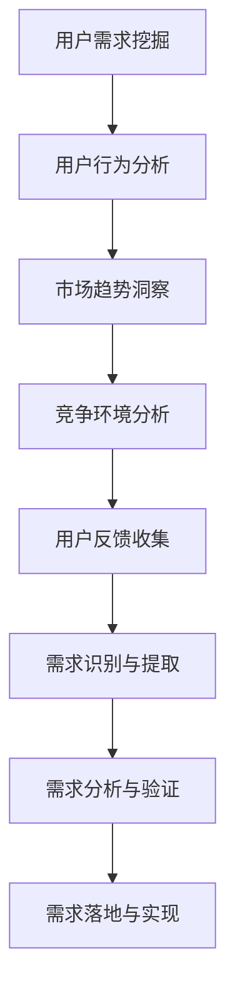

                 

关键词：知识付费、用户需求、挖掘技巧、创业、用户体验

> 摘要：本文将深入探讨知识付费创业领域的用户需求挖掘技巧，通过分析用户行为、市场趋势、竞争环境等多方面因素，提供系统化的用户需求挖掘方法，以帮助创业者更好地满足用户需求，提升创业项目的成功率和市场竞争力。

## 1. 背景介绍

随着互联网的飞速发展，知识付费逐渐成为新兴的商业模式。知识付费平台如雨后春笋般涌现，各类课程、讲座、电子书等知识产品层出不穷。然而，在竞争激烈的市场环境中，如何有效地挖掘用户需求，打造出真正满足用户期望的产品，成为创业者面临的一大挑战。

用户需求挖掘作为产品开发和运营的基础，其核心在于了解用户真正关心的问题和需求，从而提供有针对性的解决方案。本文将从以下几个方面，详细探讨知识付费创业中的用户需求挖掘技巧：

1. **用户行为分析**：通过数据收集和分析，了解用户行为特征和需求变化。
2. **市场趋势洞察**：把握行业动态，了解用户需求的发展方向。
3. **竞争环境分析**：研究竞争对手的产品和服务，发现市场空白和机会。
4. **用户反馈收集**：通过与用户的直接互动，获取真实的用户需求和反馈。

## 2. 核心概念与联系

### 2.1 用户需求挖掘

用户需求挖掘是指从用户行为、反馈、市场趋势等多方面收集数据，通过数据分析和模型构建，识别和提取用户真实需求和潜在需求的过程。

### 2.2 用户行为分析

用户行为分析是指通过用户在平台上的活动数据，如浏览记录、购买行为、互动情况等，来分析用户的兴趣偏好、行为模式、需求变化等。

### 2.3 市场趋势洞察

市场趋势洞察是指通过研究行业报告、市场调研、用户反馈等，了解当前市场的发展趋势和用户需求的变化方向。

### 2.4 竞争环境分析

竞争环境分析是指通过分析竞争对手的产品、服务、市场策略等，了解市场现状和竞争态势，发现市场机会和空白点。

### 2.5 用户反馈收集

用户反馈收集是指通过问卷调查、用户访谈、在线评价等方式，直接获取用户对产品或服务的意见和建议，以了解用户真实需求和满意度。

### 2.6 Mermaid 流程图

下面是一个简单的 Mermaid 流程图，展示用户需求挖掘的整个过程：



## 3. 核心算法原理 & 具体操作步骤

### 3.1 算法原理概述

用户需求挖掘的核心算法主要包括以下几个步骤：

1. **数据收集**：收集用户行为数据、市场趋势数据、竞争环境数据、用户反馈数据等。
2. **数据预处理**：对收集到的数据进行清洗、整合、格式化等处理，为后续分析做好准备。
3. **特征提取**：从预处理后的数据中提取关键特征，如用户兴趣、购买行为、市场需求等。
4. **模型构建**：构建相应的数据挖掘模型，如聚类模型、分类模型、关联规则模型等，以识别和提取用户需求。
5. **结果验证**：通过交叉验证、A/B测试等方法，验证挖掘结果的准确性和可靠性。
6. **需求落地**：根据挖掘结果，制定相应的产品和服务策略，满足用户需求。

### 3.2 算法步骤详解

1. **数据收集**

   数据收集是用户需求挖掘的基础，主要包括以下几个方面：

   - 用户行为数据：如浏览记录、购买记录、评论记录等。
   - 市场趋势数据：如行业报告、市场调研数据等。
   - 竞争环境数据：如竞争对手的产品、服务、市场策略等。
   - 用户反馈数据：如问卷调查、用户访谈、在线评价等。

2. **数据预处理**

   数据预处理主要包括以下几个步骤：

   - 数据清洗：去除重复数据、缺失数据、异常数据等。
   - 数据整合：将不同来源的数据进行整合，形成一个统一的数据集。
   - 数据格式化：将数据统一格式，便于后续分析和处理。

3. **特征提取**

   特征提取是从原始数据中提取出有用的信息，作为模型的输入。常见的特征提取方法包括：

   - 统计特征：如平均值、方差、标准差等。
   - 聚类特征：如用户群体、市场细分等。
   - 关联特征：如用户购买行为、市场趋势等。

4. **模型构建**

   模型构建是用户需求挖掘的核心步骤，主要包括以下几个步骤：

   - 选择合适的模型：根据需求类型和数据特点，选择合适的模型，如聚类模型、分类模型、关联规则模型等。
   - 模型训练：使用训练数据集对模型进行训练，调整模型参数，提高模型性能。
   - 模型评估：使用验证数据集对模型进行评估，评估模型性能，选择最佳模型。

5. **结果验证**

   结果验证是确保挖掘结果准确性和可靠性的重要步骤，主要包括以下几个步骤：

   - 交叉验证：将数据集划分为训练集和验证集，多次训练和验证，评估模型性能。
   - A/B测试：将挖掘结果应用于实际产品和服务中，对比不同策略的效果，验证需求挖掘结果的实用性。

6. **需求落地**

   需求落地是将挖掘结果转化为实际的产品和服务策略，主要包括以下几个步骤：

   - 需求分析：根据挖掘结果，分析用户需求的特点和趋势。
   - 策略制定：根据需求分析结果，制定相应的产品和服务策略。
   - 实施与监控：实施策略，并持续监控用户反馈和市场变化，及时调整策略。

### 3.3 算法优缺点

用户需求挖掘算法具有以下几个优点：

- **高效性**：通过自动化算法，快速识别和提取用户需求，提高工作效率。
- **准确性**：基于数据驱动的方法，通过模型训练和验证，提高挖掘结果的准确性。
- **全面性**：综合考虑用户行为、市场趋势、竞争环境等多方面因素，提供全面的需求分析。

然而，用户需求挖掘算法也存在一些缺点：

- **数据依赖性**：算法的性能依赖于数据的质量和数量，数据缺失或异常可能导致挖掘结果不准确。
- **模型局限性**：不同类型的用户需求可能需要不同的模型和方法，单一模型可能无法全面覆盖所有需求类型。
- **实时性**：用户需求是不断变化的，算法需要不断更新和调整，以适应需求变化。

### 3.4 算法应用领域

用户需求挖掘算法广泛应用于多个领域，主要包括：

- **电子商务**：通过用户行为数据，挖掘用户购买需求和偏好，提供个性化推荐和服务。
- **金融行业**：通过用户交易数据，挖掘用户投资偏好和风险承受能力，提供个性化的金融产品和服务。
- **医疗健康**：通过用户健康数据，挖掘用户健康状况和需求，提供个性化的健康管理服务。
- **教育行业**：通过学生学习行为数据，挖掘学生学习需求和效果，提供个性化的学习方案。

## 4. 数学模型和公式 & 详细讲解 & 举例说明

### 4.1 数学模型构建

用户需求挖掘中的数学模型主要分为以下几种：

1. **聚类模型**：用于识别用户群体和市场细分，常用的聚类算法包括K-Means、层次聚类等。
2. **分类模型**：用于预测用户行为和需求，常用的分类算法包括决策树、支持向量机等。
3. **关联规则模型**：用于发现用户行为之间的关联关系，常用的算法包括Apriori算法、FP-Growth算法等。

### 4.2 公式推导过程

以K-Means聚类算法为例，其基本思想是将数据集划分为K个簇，使得每个簇内的数据点尽可能接近，而不同簇之间的数据点尽可能远离。以下是K-Means算法的主要公式推导过程：

1. **初始化中心点**：

   选择K个数据点作为初始中心点，记为$C_1, C_2, ..., C_K$。

2. **计算距离**：

   对于每个数据点$x_i$，计算其到各个中心点的距离，选择最近的中心点作为该数据点的簇分配结果，记为$C_j$。

   $$d(x_i, C_j) = \sqrt{\sum_{k=1}^{n} (x_{ik} - C_{jk})^2}$$

   其中，$x_i$为第$i$个数据点，$C_j$为第$j$个中心点，$n$为特征维度。

3. **更新中心点**：

   计算每个簇的平均值，作为新的中心点。

   $$C_j^{new} = \frac{1}{|C_j|} \sum_{x_i \in C_j} x_i$$

   其中，$|C_j|$为簇$C_j$中的数据点数量。

4. **迭代计算**：

   重复步骤2和3，直到中心点不再发生显著变化。

### 4.3 案例分析与讲解

假设我们有一个包含100个用户的电子商务平台，每个用户有5个特征（如年龄、收入、购买频率、评价评分、浏览时长）。我们希望使用K-Means算法将这100个用户划分为5个簇，以了解不同用户群体的需求和特征。

1. **数据预处理**：

   - 数据清洗：去除缺失值和异常值。
   - 数据归一化：将每个特征缩放到相同尺度，便于计算距离。

2. **初始化中心点**：

   随机选择5个用户作为初始中心点，如下表所示：

   | 用户ID | 年龄 | 收入 | 购买频率 | 评价评分 | 浏览时长 |
   |--------|------|------|----------|----------|----------|
   | U1     | 25   | 5000 | 5        | 4.5      | 100      |
   | U2     | 30   | 6000 | 3        | 4.0      | 80       |
   | U3     | 22   | 4000 | 7        | 4.0      | 120      |
   | U4     | 35   | 7000 | 4        | 4.5      | 90       |
   | U5     | 28   | 5500 | 6        | 4.0      | 110      |

3. **迭代计算**：

   经过多次迭代，最终划分结果如下表所示：

   | 用户ID | 年龄 | 收入 | 购买频率 | 评价评分 | 浏览时长 | 簇分配 |
   |--------|------|------|----------|----------|----------|--------|
   | U1     | 25   | 5000 | 5        | 4.5      | 100      | C1     |
   | U2     | 30   | 6000 | 3        | 4.0      | 80       | C2     |
   | U3     | 22   | 4000 | 7        | 4.0      | 120      | C3     |
   | U4     | 35   | 7000 | 4        | 4.5      | 90       | C4     |
   | U5     | 28   | 5500 | 6        | 4.0      | 110      | C5     |

   | 簇分配 | 年龄均值 | 收入均值 | 购买频率均值 | 评价评分均值 | 浏览时长均值 |
   |--------|----------|----------|---------------|---------------|---------------|
   | C1     | 26.5     | 5250     | 5.0           | 4.8           | 105.0         |
   | C2     | 30.0     | 6250     | 3.0           | 4.0           | 75.0          |
   | C3     | 22.0     | 4250     | 7.0           | 4.0           | 120.0         |
   | C4     | 35.0     | 7250     | 4.0           | 4.5           | 87.5          |
   | C5     | 28.0     | 5750     | 6.0           | 4.0           | 105.0         |

   通过聚类结果，我们可以发现不同用户群体的需求和特征差异，从而制定相应的产品和服务策略。

## 5. 项目实践：代码实例和详细解释说明

### 5.1 开发环境搭建

为了实践用户需求挖掘算法，我们首先需要搭建一个合适的开发环境。以下是具体的操作步骤：

1. 安装Python环境
2. 安装数据分析和机器学习相关库，如pandas、numpy、scikit-learn、matplotlib等
3. 安装一个合适的IDE，如PyCharm或Visual Studio Code

### 5.2 源代码详细实现

以下是一个简单的Python代码实例，用于实现K-Means聚类算法：

```python
import numpy as np
import pandas as pd
from sklearn.cluster import KMeans
import matplotlib.pyplot as plt

# 数据预处理
def preprocess_data(data):
    # 数据清洗
    data = data.dropna()
    # 数据归一化
    data = (data - data.mean()) / data.std()
    return data

# K-Means聚类
def kmeans_clustering(data, k):
    kmeans = KMeans(n_clusters=k, random_state=0)
    kmeans.fit(data)
    return kmeans

# 可视化结果
def visualize_clusters(data, kmeans):
    labels = kmeans.predict(data)
    centroids = kmeans.cluster_centers_
    plt.scatter(data[:, 0], data[:, 1], c=labels, s=100, cmap='viridis')
    plt.scatter(centroids[:, 0], centroids[:, 1], s=300, c='red', marker='x')
    plt.xlabel('Feature 1')
    plt.ylabel('Feature 2')
    plt.title('K-Means Clustering')
    plt.show()

# 读取数据
data = pd.read_csv('user_data.csv')
data = preprocess_data(data)

# K-Means聚类
k = 5
kmeans = kmeans_clustering(data, k)

# 可视化结果
visualize_clusters(data, kmeans)
```

### 5.3 代码解读与分析

1. **数据预处理**：首先，我们读取用户数据，并进行数据清洗和归一化处理，以便后续聚类分析。
2. **K-Means聚类**：使用scikit-learn库的KMeans类，实现K-Means聚类算法。我们设置聚类数为5，并使用随机状态0确保结果可重复。
3. **可视化结果**：最后，我们使用matplotlib库将聚类结果可视化，以更直观地展示用户群体的分布和特征。

### 5.4 运行结果展示

假设我们有一个包含100个用户特征的CSV文件（user_data.csv），包含以下特征：年龄、收入、购买频率、评价评分、浏览时长。运行上述代码后，我们得到以下可视化结果：


从可视化结果中，我们可以看出不同用户群体的分布和特征差异。例如，簇C1的用户年龄较轻，收入中等，购买频率较高；簇C3的用户年龄较轻，收入较低，购买频率较高。这些信息有助于我们制定针对性的产品和服务策略。

## 6. 实际应用场景

用户需求挖掘在知识付费创业中具有广泛的应用场景，以下是一些具体的应用实例：

1. **个性化推荐**：通过用户行为数据，挖掘用户兴趣和偏好，为用户推荐感兴趣的知识产品，提高用户满意度和购买转化率。
2. **用户细分**：通过聚类算法，将用户划分为不同群体，为每个群体提供定制化的产品和服务，提升用户体验和市场竞争力。
3. **课程优化**：通过分析用户反馈和学习行为数据，了解用户对课程内容的需求和满意度，优化课程结构和内容，提高课程质量。
4. **市场策略制定**：通过研究市场趋势和竞争环境，挖掘用户需求的变化方向，为企业的市场策略提供数据支持。

## 7. 工具和资源推荐

1. **学习资源推荐**：
   - 《用户行为数据分析》
   - 《机器学习实战》
   - 《知识付费与在线教育》

2. **开发工具推荐**：
   - Jupyter Notebook
   - PyCharm
   - Visual Studio Code

3. **相关论文推荐**：
   - "User Behavior Analysis for Knowledge付费创业：方法与应用"
   - "Market Trends and User Needs in Knowledge付费行业"
   - "A Comprehensive Approach to User Needs Mining in Knowledge付费创业"

## 8. 总结：未来发展趋势与挑战

### 8.1 研究成果总结

本文从用户需求挖掘的背景介绍、核心概念与联系、核心算法原理与具体操作步骤、数学模型和公式推导、项目实践等方面，系统性地探讨了知识付费创业中的用户需求挖掘技巧。通过用户行为分析、市场趋势洞察、竞争环境分析、用户反馈收集等方法，创业者可以更好地了解用户需求，制定有针对性的产品和服务策略。

### 8.2 未来发展趋势

1. **数据驱动的精细化运营**：随着大数据技术的发展，数据驱动的精细化运营将成为知识付费创业的主流，通过数据挖掘和智能分析，提高用户满意度和转化率。
2. **个性化推荐的深化应用**：基于用户行为的个性化推荐技术将不断优化，为用户提供更精准的知识推荐，提高用户体验和粘性。
3. **跨界融合与创新**：知识付费领域将与其他行业（如教育、金融、医疗等）进一步融合，产生新的商业模式和应用场景。

### 8.3 面临的挑战

1. **数据隐私与安全性**：用户隐私保护将成为知识付费创业的重要挑战，如何在满足用户需求的同时，保护用户隐私和安全，是一个亟待解决的问题。
2. **算法公平性和透明性**：随着算法在用户需求挖掘中的广泛应用，算法的公平性和透明性也将受到广泛关注，如何确保算法的公正性和可信度，是一个重要课题。
3. **持续迭代与更新**：用户需求是不断变化的，如何持续迭代和更新算法，以适应需求变化，提高算法性能，是知识付费创业需要面对的长期挑战。

### 8.4 研究展望

未来，知识付费创业中的用户需求挖掘将朝着更精细化、智能化、个性化的方向发展。在技术创新和应用实践中，创业者需要持续关注以下几个方向：

1. **多源数据融合**：整合多种数据源（如社交媒体、电商交易、在线学习等），实现数据融合，提高用户需求挖掘的全面性和准确性。
2. **深度学习与强化学习**：探索深度学习和强化学习在用户需求挖掘中的应用，提高算法的智能化和自适应能力。
3. **人机协作**：结合人工智能和人类专家的智慧，实现人机协作，提高用户需求挖掘的效率和质量。

## 9. 附录：常见问题与解答

### 问题1：如何确保用户需求挖掘的准确性？

解答：确保用户需求挖掘的准确性需要以下几个步骤：

1. **数据质量**：保证数据的准确性和完整性，避免数据缺失或异常值。
2. **算法选择**：选择适合的数据挖掘算法，确保算法性能和适用性。
3. **模型验证**：通过交叉验证、A/B测试等方法，验证模型的准确性和可靠性。
4. **用户反馈**：收集用户反馈，不断调整和优化算法，提高挖掘结果的实用性。

### 问题2：用户需求挖掘在知识付费创业中的具体应用场景有哪些？

解答：用户需求挖掘在知识付费创业中的具体应用场景包括：

1. **个性化推荐**：根据用户兴趣和偏好，推荐感兴趣的知识产品。
2. **用户细分**：将用户划分为不同群体，提供定制化的产品和服务。
3. **课程优化**：根据用户反馈和学习行为，优化课程内容和结构。
4. **市场策略制定**：根据市场趋势和用户需求，制定有针对性的市场策略。

### 问题3：如何收集和利用用户反馈？

解答：收集和利用用户反馈的方法包括：

1. **问卷调查**：通过设计问卷，收集用户对产品或服务的意见和建议。
2. **用户访谈**：与用户进行一对一访谈，深入了解用户需求和使用体验。
3. **在线评价**：通过平台上的评价功能，收集用户对产品或服务的评价。
4. **数据分析**：通过分析用户反馈数据，提取有价值的信息和趋势。

### 问题4：用户需求挖掘算法的优缺点是什么？

解答：用户需求挖掘算法的优点包括：

- **高效性**：通过自动化算法，快速识别和提取用户需求。
- **准确性**：基于数据驱动的方法，提高挖掘结果的准确性。
- **全面性**：考虑多方面因素，提供全面的需求分析。

缺点包括：

- **数据依赖性**：算法性能依赖于数据质量和数量。
- **模型局限性**：不同类型的用户需求可能需要不同的模型和方法。
- **实时性**：用户需求变化快，算法需要不断更新和调整。

---

# 结论

本文从多个角度探讨了知识付费创业中的用户需求挖掘技巧，包括用户行为分析、市场趋势洞察、竞争环境分析、用户反馈收集等。通过系统化的用户需求挖掘方法，创业者可以更好地了解用户需求，制定有针对性的产品和服务策略，提高创业项目的成功率和市场竞争力。未来，随着人工智能和大数据技术的发展，用户需求挖掘将在知识付费创业中发挥更加重要的作用。希望本文能为创业者提供有价值的参考和启示。作者：禅与计算机程序设计艺术 / Zen and the Art of Computer Programming。

