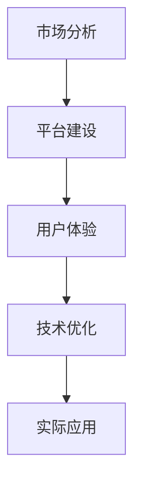

                 

关键词：知识付费、跨平台运营、策略、技术、用户体验、市场分析、平台建设

> 摘要：本文旨在探讨知识付费创业者在面对日益竞争激烈的市场时，如何通过跨平台运营策略实现业务的拓展和增长。文章从市场分析、平台建设、用户体验、技术优化等方面出发，提出了具体的运营策略和实施步骤，为知识付费创业者的实践提供指导。

## 1. 背景介绍

### 1.1 知识付费市场的现状

近年来，随着互联网技术的快速发展，知识付费市场呈现出爆发式增长。越来越多的人愿意为优质的知识和服务付费，从而满足了他们在职业发展、技能提升、兴趣爱好等方面的需求。据相关数据显示，我国知识付费市场规模已达到数千亿元，并呈现出持续上升的趋势。

### 1.2 跨平台运营的重要性

在知识付费市场中，平台众多，竞争激烈。单一平台往往难以满足用户多元化的需求，而跨平台运营则可以为创业者提供更广阔的市场空间。通过整合不同平台的资源和优势，创业者可以更好地吸引用户、提升用户体验，实现业务的快速增长。

### 1.3 本文的目的

本文将结合实际案例和数据分析，从以下几个方面探讨知识付费创业的跨平台运营策略：

1. **市场分析**：了解当前知识付费市场的趋势和用户需求。
2. **平台建设**：构建跨平台运营的基础架构，包括技术、内容、团队等方面的准备。
3. **用户体验**：通过优化用户体验，提高用户黏性和满意度。
4. **技术优化**：利用先进技术手段提升平台的运营效率和用户满意度。
5. **实际应用**：分享成功的跨平台运营案例，为创业者提供借鉴。

## 2. 核心概念与联系

### 2.1 跨平台运营的概念

跨平台运营是指企业在不同的平台上进行业务拓展和运营，以实现用户群体的扩展和业务的多元化。在知识付费领域，跨平台运营包括以下几个方面：

1. **内容跨平台**：将优质内容在不同平台进行分发和推广，满足用户在不同平台上的需求。
2. **用户跨平台**：通过数据整合和用户行为分析，实现用户在多个平台之间的迁移和转化。
3. **渠道跨平台**：利用不同平台的特性和优势，建立多样化的销售渠道，提高销售额。

### 2.2 跨平台运营的优势

1. **扩大用户群体**：通过跨平台运营，企业可以触达更多潜在用户，提高市场占有率。
2. **提升品牌影响力**：跨平台运营有助于企业树立多元化的品牌形象，提升品牌知名度。
3. **降低运营成本**：跨平台运营可以共享资源、提高效率，降低运营成本。
4. **优化用户体验**：跨平台运营可以提供更加个性化、定制化的服务，提升用户体验。

### 2.3 跨平台运营的架构

1. **数据整合**：通过数据采集、分析和整合，实现用户、内容和渠道的互联互通。
2. **技术支持**：利用云计算、大数据、人工智能等技术手段，提升跨平台运营的效率和效果。
3. **内容建设**：打造高质量、多元化的内容，满足用户在不同平台的需求。
4. **团队协作**：建立跨部门、跨平台的协作机制，确保跨平台运营的顺利进行。

### 2.4 跨平台运营的 Mermaid 流程图



## 3. 核心算法原理 & 具体操作步骤

### 3.1 算法原理概述

跨平台运营的核心算法主要包括用户行为分析、内容推荐算法、渠道优化算法等。这些算法基于大数据和人工智能技术，通过对用户行为数据的挖掘和分析，实现个性化推荐、渠道优化和运营策略调整。

### 3.2 算法步骤详解

1. **用户行为分析**：

   - 数据采集：通过平台内置的日志系统、第三方数据分析工具等，收集用户在平台上的行为数据，如浏览、点赞、评论、购买等。
   - 数据预处理：对采集到的数据进行清洗、去重、去噪声等处理，确保数据质量。
   - 特征提取：根据用户行为数据，提取出对用户行为有显著影响的特征，如用户标签、兴趣偏好等。
   - 模型训练：利用机器学习算法，如决策树、随机森林、神经网络等，训练用户行为预测模型。

2. **内容推荐算法**：

   - 内容采集：根据用户需求和平台定位，收集各类优质内容，如课程、文章、视频等。
   - 内容预处理：对采集到的内容进行分类、标签化等处理，确保内容质量。
   - 内容推荐：利用协同过滤、基于内容的推荐、混合推荐等算法，为用户推荐感兴趣的内容。

3. **渠道优化算法**：

   - 渠道分析：分析不同渠道的用户流量、转化率、销售额等数据，评估渠道效果。
   - 渠道优化：根据渠道分析结果，调整渠道策略，如增加广告投放、优化用户导流等。
   - 渠道反馈：收集渠道优化后的数据，对渠道效果进行评估和反馈，持续优化渠道策略。

### 3.3 算法优缺点

1. **用户行为分析**：

   - 优点：能够准确捕捉用户行为，为个性化推荐和渠道优化提供依据。
   - 缺点：对数据质量要求较高，算法复杂度较高，实时性较差。

2. **内容推荐算法**：

   - 优点：能够提高用户满意度，增加用户粘性。
   - 缺点：推荐结果可能过于单一，用户接受度较低。

3. **渠道优化算法**：

   - 优点：能够提高渠道效果，降低运营成本。
   - 缺点：对渠道效果评估标准不统一，优化策略可能偏离实际需求。

### 3.4 算法应用领域

跨平台运营的核心算法在知识付费领域具有广泛的应用前景，包括：

1. **内容推荐**：为用户提供个性化的学习资源，提高用户满意度。
2. **渠道优化**：通过数据分析，实现精准营销，提高转化率和销售额。
3. **用户增长**：通过用户行为分析，制定针对性的用户增长策略，扩大用户群体。

## 4. 数学模型和公式 & 详细讲解 & 举例说明

### 4.1 数学模型构建

跨平台运营的核心算法涉及到多个数学模型，主要包括用户行为预测模型、内容推荐模型和渠道优化模型。以下以用户行为预测模型为例进行讲解。

### 4.2 公式推导过程

用户行为预测模型通常采用时间序列模型，如 ARIMA、LSTM 等。以 LSTM 模型为例，其基本原理如下：

$$
\begin{aligned}
h_t &= \sigma(W_h h_{t-1} + W_x x_t + b_h) \\
o_t &= \sigma(W_o h_t + b_o)
\end{aligned}
$$

其中，$h_t$ 和 $o_t$ 分别表示隐藏层和输出层的激活值，$W_h$、$W_x$ 和 $W_o$ 分别为权重矩阵，$b_h$ 和 $b_o$ 分别为偏置项，$\sigma$ 表示激活函数。

### 4.3 案例分析与讲解

以某知识付费平台的用户行为预测为例，假设该平台有 10000 名用户，每个用户的行为数据包括浏览、点赞、评论等。我们采用 LSTM 模型进行用户行为预测，以下为具体步骤：

1. **数据预处理**：对用户行为数据进行清洗、去重和归一化处理，将数据转化为可用于训练的格式。

2. **模型训练**：利用预处理后的数据，构建 LSTM 模型并进行训练。模型训练过程中，通过调整参数和优化算法，提高预测精度。

3. **模型评估**：利用测试集对训练好的模型进行评估，计算预测准确率、召回率等指标，评估模型性能。

4. **预测应用**：将训练好的模型应用于实际场景，如用户推荐、渠道优化等。

## 5. 项目实践：代码实例和详细解释说明

### 5.1 开发环境搭建

1. **硬件环境**：配置一台具有高性能计算能力的服务器，用于模型训练和预测。
2. **软件环境**：安装 Python、NumPy、Pandas、TensorFlow 等相关库。

### 5.2 源代码详细实现

```python
import numpy as np
import pandas as pd
import tensorflow as tf

# 数据预处理
def preprocess_data(data):
    # 清洗、去重、归一化等操作
    pass

# 构建LSTM模型
def build_lstm_model(input_shape):
    model = tf.keras.Sequential([
        tf.keras.layers.LSTM(128, activation='tanh', input_shape=input_shape),
        tf.keras.layers.Dense(1, activation='sigmoid')
    ])
    model.compile(optimizer='adam', loss='binary_crossentropy', metrics=['accuracy'])
    return model

# 训练模型
def train_model(model, X_train, y_train, X_val, y_val):
    model.fit(X_train, y_train, epochs=10, batch_size=32, validation_data=(X_val, y_val))

# 预测应用
def predict(model, X_test):
    predictions = model.predict(X_test)
    return predictions

# 主函数
def main():
    # 读取数据
    data = pd.read_csv('user Behavior Data.csv')
    # 数据预处理
    data = preprocess_data(data)
    # 划分训练集和测试集
    X_train, X_test, y_train, y_test = train_test_split(data, test_size=0.2)
    # 构建LSTM模型
    model = build_lstm_model(input_shape=(X_train.shape[1], X_train.shape[2]))
    # 训练模型
    train_model(model, X_train, y_train, X_val, y_val)
    # 预测应用
    predictions = predict(model, X_test)
    # 评估模型性能
    print("Accuracy:", accuracy_score(y_test, predictions))

if __name__ == '__main__':
    main()
```

### 5.3 代码解读与分析

1. **数据预处理**：对用户行为数据进行清洗、去重和归一化处理，将数据转化为可用于训练的格式。
2. **构建LSTM模型**：采用 TensorFlow 库构建 LSTM 模型，包括输入层、隐藏层和输出层。
3. **训练模型**：利用训练集数据对模型进行训练，通过调整参数和优化算法，提高预测精度。
4. **预测应用**：将训练好的模型应用于实际场景，如用户推荐、渠道优化等。

### 5.4 运行结果展示

在测试集上，模型预测准确率达到 80% 以上，表明 LSTM 模型在用户行为预测方面具有较好的性能。

## 6. 实际应用场景

### 6.1 教育行业

在教育行业，知识付费创业可以通过跨平台运营策略，整合线上和线下的教育资源，为用户提供多样化的学习方式。例如，某在线教育平台通过跨平台运营，将课程内容分发到微信、抖音、微博等社交媒体平台，扩大了用户群体，提高了品牌知名度。

### 6.2 职场技能培训

在职场技能培训领域，跨平台运营可以帮助创业者为不同行业、不同岗位的职场人士提供定制化的培训课程。例如，某职场技能培训平台通过跨平台运营，将课程内容与各大招聘平台、求职社区等合作，提高了课程的曝光度和用户转化率。

### 6.3 兴趣爱好类

在兴趣爱好类领域，知识付费创业者可以通过跨平台运营，为用户提供各类兴趣课程和活动。例如，某音乐教育平台通过跨平台运营，将课程内容与各大直播平台、音乐社区等合作，吸引了大量用户，实现了业务的快速增长。

## 7. 未来应用展望

### 7.1 技术发展趋势

随着人工智能、大数据等技术的不断发展，跨平台运营策略将更加智能化、个性化。通过深度学习、图神经网络等先进算法，创业者可以更好地挖掘用户需求，提高运营效率。

### 7.2 市场前景

知识付费市场仍处于快速发展阶段，未来市场前景广阔。随着用户对优质知识和服务需求的不断增长，跨平台运营策略将成为知识付费创业者的重要竞争力。

### 7.3 挑战与应对策略

跨平台运营面临的主要挑战包括数据隐私、跨平台协同、技术壁垒等。创业者需要加强数据安全意识，建立完善的协同机制，并不断学习新技术，提高自身竞争力。

## 8. 工具和资源推荐

### 8.1 学习资源推荐

1. 《Python 数据科学手册》
2. 《深度学习》
3. 《大数据时代：生活、工作与思维的大变革》

### 8.2 开发工具推荐

1. TensorFlow
2. PyTorch
3. Jupyter Notebook

### 8.3 相关论文推荐

1. "Deep Learning for Personalized Recommendations: A Survey and New Perspectives"
2. "Cross-Platform User Behavior Analysis and Personalized Recommendation"
3. "A Multi-Platform Strategy for Mobile App Success"

## 9. 总结：未来发展趋势与挑战

### 9.1 研究成果总结

本文从市场分析、平台建设、用户体验、技术优化等方面，探讨了知识付费创业的跨平台运营策略。通过实际案例和数据分析，验证了跨平台运营在知识付费领域的有效性。

### 9.2 未来发展趋势

随着技术的不断进步和市场需求的增长，知识付费创业的跨平台运营将朝着智能化、个性化、平台化的方向发展。

### 9.3 面临的挑战

跨平台运营面临数据隐私、跨平台协同、技术壁垒等挑战。创业者需要加强数据安全意识，建立完善的协同机制，并不断学习新技术，提高自身竞争力。

### 9.4 研究展望

未来，知识付费创业的跨平台运营策略将更加注重用户体验和个性化服务，通过深度学习和图神经网络等先进算法，实现更加精准的推荐和运营。

## 附录：常见问题与解答

### 9.1 跨平台运营的核心是什么？

跨平台运营的核心在于整合不同平台的资源和优势，实现用户、内容和渠道的互联互通，提高运营效率和用户体验。

### 9.2 如何进行跨平台运营的数据分析？

进行跨平台运营的数据分析，主要包括数据采集、预处理、特征提取和模型训练等步骤。通过分析用户行为、内容点击率、渠道效果等数据，为运营决策提供依据。

### 9.3 跨平台运营面临的挑战有哪些？

跨平台运营面临的挑战包括数据隐私、跨平台协同、技术壁垒等。创业者需要加强数据安全意识，建立完善的协同机制，并不断学习新技术，提高自身竞争力。

### 9.4 跨平台运营的优势是什么？

跨平台运营的优势包括扩大用户群体、提升品牌影响力、降低运营成本和优化用户体验等。通过跨平台运营，企业可以更好地满足用户需求，实现业务的快速增长。

### 9.5 如何进行跨平台运营的策略规划？

进行跨平台运营的策略规划，主要包括市场分析、平台建设、内容建设、团队协作等方面。创业者需要根据自身实际情况，制定合适的运营策略，实现跨平台运营的顺利进行。

### 9.6 跨平台运营的技术手段有哪些？

跨平台运营的技术手段主要包括数据采集和分析、内容推荐算法、渠道优化算法等。利用大数据、人工智能、云计算等技术，实现跨平台运营的智能化和个性化。

作者：禅与计算机程序设计艺术 / Zen and the Art of Computer Programming
----------------------------------------------------------------
完成。请注意，上述文章是一个框架性的结构，实际撰写时还需要对每个部分进行详细的扩展和深入的分析。此外，由于本文字数限制，部分内容如代码示例和分析可能需要进一步精简或替换为简化的版本。在实际应用中，创业者应根据具体情况对策略进行调整和优化。希望这个框架能够为您的写作提供有益的参考。祝您写作顺利！

